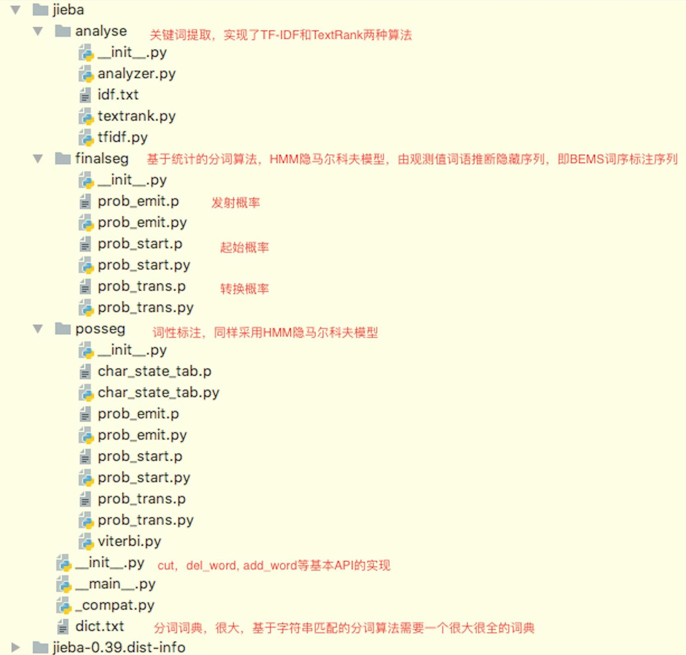
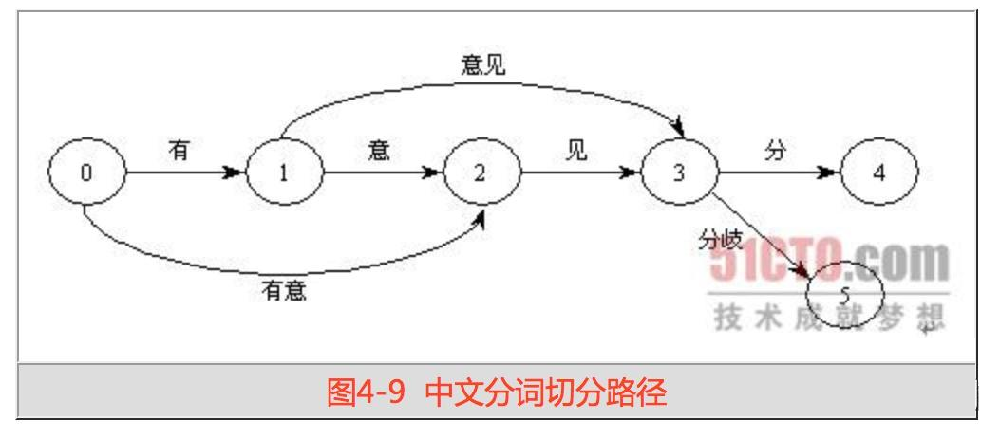

# 2.jieba分词用法及原理

## **1.概述**

上篇文章分析了自然语言处理，特别是中文处理中，分词的几个主要难点。为了解决这些难点，提出了**基于字符串匹配的算法**和**基于统计的分词算法**。针对当前的几种分词引擎，对其分词准确度和速度进行了评估。jieba分词作为一个开源项目，在准确度和速度方面均不错，是我们平时常用的分词工具。本文将对jieba分词的使用方法以及原理进行讲解，便于在理解jieba分词原理的同时，加深对前文讲解的分词难点和算法的理解。

### 1.1 特点

Jieba库分词有4种模式，最常用的还是前3种

1. **精确模式**\*\*：**就是把一段文本精确地切分成若干个中文单词，若干个中文单词之间经过组合，就精确地还原为之前的文本。其中**不存在冗余单词 \*\*。
2. **全模式**\*\*：**将一段文本中所有可能的词语都扫描出来，可能有一段文本它可以切分成不同的模式，或者有不同的角度来切分变成不同的词语，在全模式下，Jieba库会将各种不同的组合都挖掘出来。分词后的信息再组合起来**会有冗余，不再是原来的文本 \*\*。
3. **搜索引擎模式****：** 在精确模式基础上，对发现的那些长的词语，我们会对它再次切分，进而适合搜索引擎对短词语的索引和搜索。**也有冗余**。
4. **paddle模式**：利用PaddlePaddle深度学习框架，训练序列标注（双向GRU）网络模型实现分词。同时支持词性标注。paddle模式使用需安装paddlepaddle-tiny，`pip install paddlepaddle-tiny==1.6.1`。目前paddle模式支持jieba v0.40及以上版本。jieba v0.40以下版本，请升级jieba，`pip install jieba --upgrade` 。

### 1.2 安装说明

代码对 Python 2/3 均兼容

- 全自动安装：`easy_install jieba` 或者 `pip install jieba` / `pip3 install jieba`
- 半自动安装：先下载 [http://pypi.python.org/pypi/jieba/](http://pypi.python.org/pypi/jieba/ "http://pypi.python.org/pypi/jieba/") ，解压后运行 `python setup.py install`
- 手动安装：将 jieba 目录放置于当前目录或者 site-packages 目录
- 通过 `import jieba` 来引用
- 如果需要使用paddle模式下的分词和词性标注功能，请先安装paddlepaddle-tiny，`pip install paddlepaddle-tiny==1.6.1`。

### 1.3 算法

- 基于前缀词典实现高效的词图扫描，生成句子中汉字所有可能成词情况所构成的有向无环图 (DAG)
- 采用了**动态规划查找最大概率路径, 找出基于词频的最大切分组合**
- 对于**未登录词**，**采用了基于汉字成词能力的 HMM 模型，使用了 Viterbi 算法**

## **2.jieba分词用法**

jieba分词是一个开源项目，地址为：[fxsjy/jieba: 结巴中文分词](https://github.com/fxsjy/jieba "fxsjy/jieba: 结巴中文分词")

它在分词准确度和速度方面均表现不错。其功能和用法如下。

### **2.1 分词**

`jieba.cut` 方法接受四个输入参数:&#x20;

- 需要分词的字符串；
- `cut_all `参数用来控制是否采用全模式；
- `HMM` 参数用来控制是否使用 HMM 模型；
- `use_paddle` 参数用来控制是否使用paddle模式下的分词模式，paddle模式采用延迟加载方式，通过enable\_paddle接口安装paddlepaddle-tiny，并且import相关代码；

`jieba.cut_for_search` 方法接受两个参数：

- 需要分词的字符串；
- 是否使用 HMM 模型。该方法适合用于搜索引擎构建倒排索引的分词，粒度比较细

待分词的字符串可以是 unicode 或 UTF-8 字符串、GBK 字符串。注意：不建议直接输入 GBK 字符串，可能无法预料地错误解码成 UTF-8

`jieba.cut` 以及 `jieba.cut_for_search` 返回的结构都是一个可迭代的 generator，可以使用 for 循环来获得分词后得到的每一个词语(unicode)，或者用

`jieba.lcut` 以及 `jieba.lcut_for_search` 直接返回 list

`jieba.Tokenizer(dictionary=DEFAULT_DICT)` 新建自定义分词器，可用于同时使用不同词典。`jieba.dt` 为默认分词器，所有全局分词相关函数都是该分词器的映射。

支持三种分词模式

```python
# encoding=utf-8
import jieba

seg_list = jieba.cut("我来到北京清华大学", cut_all=True)
print("Full Mode: " + "/ ".join(seg_list))  # 全模式

seg_list = jieba.cut("我来到北京清华大学", cut_all=False)
print("Default Mode: " + "/ ".join(seg_list))  # 精确模式

seg_list = jieba.cut("他来到了网易杭研大厦")  # 默认是精确模式
print(", ".join(seg_list))

seg_list = jieba.cut_for_search("小明硕士毕业于中国科学院计算所，后在日本京都大学深造")  # 搜索引擎模式
print(", ".join(seg_list))

```

输出为

```text
【全模式】: 我/ 来到/ 北京/ 清华/ 清华大学/ 华大/ 大学

【精确模式】: 我/ 来到/ 北京/ 清华大学

【新词识别】：他, 来到, 了, 网易, 杭研, 大厦    (此处，“杭研”并没有在词典中，但是也被Viterbi算法识别出来了)

【搜索引擎模式】： 小明, 硕士, 毕业, 于, 中国, 科学, 学院, 科学院, 中国科学院, 计算, 计算所, 后, 在, 日本, 京都, 大学, 日本京都大学, 深造

```

### **2.2 添加自定义词典**

- 开发者可以指定自己自定义的词典，以便包含 jieba 词库里没有的词。虽然 jieba 有新词识别能力，但是自行添加新词可以保证更高的正确率
- 用法： `jieba.load_userdict(file_name)` ， file\_name 为文件类对象或自定义词典的路径
- 词典格式和 `dict.txt` 一样，一个词占一行；每一行分三部分：词语、词频（可省略）、词性（可省略），用空格隔开，顺序不可颠倒。`file_name` 若为路径或二进制方式打开的文件，则文件必须为 UTF-8 编码。
- 词频省略时使用自动计算的能保证分出该词的词频。

使用起来很简单，我们先创建一个文件，比如`user_dict.txt`，其中每一行代表一个新词，分别为词语，词频，词性。如下：

```text
创新办 3 i
云计算 5
凱特琳 nz
台中

```

然后在代码中分词前，加载这个自定义词典即可。更改分词器（默认为 `jieba.dt`）的 `tmp_dir` 和 `cache_file` 属性，可分别指定缓存文件所在的文件夹及其文件名，用于受限的文件系统。

```python
jieba.load_userdict("user_dict.txt")

```

加载自定义词典的分词效果：

```text
之前： 李小福 / 是 / 创新 / 办 / 主任 / 也 / 是 / 云 / 计算 / 方面 / 的 / 专家 /

加载自定义词库后：　李小福 / 是 / 创新办 / 主任 / 也 / 是 / 云计算 / 方面 / 的 / 专家 /

```

### **2.3 调整词典**

- 使用 `add_word(word, freq=None, tag=None)` 和 `del_word(word)` 可在程序中动态修改词典。
- 使用 `suggest_freq(segment, tune=True)` 可调节单个词语的词频，使其能（或不能）被分出来。
- 注意：自动计算的词频在使用 HMM 新词发现功能时可能无效。

```python
# 1 使用del_word()使得某个词语不会出现
print('/'.join(jieba.cut('如果放到post中将出错。', HMM=False)))
如果/放到/post/中将/出错/。

jieba.del_word("中将")
print('/'.join(jieba.cut('如果放到post中将出错。', HMM=False)))
如果/放到/post/中/将/出错/。

# 2 使用add_word()添加新词到字典中
print('/'.join(jieba.cut('「台中」正确应该不会被切开', HMM=False)))
「/台/中/」/正确/应该/不会/被/切开

jieba.add_word("台中")
print('/'.join(jieba.cut('「台中」正确应该不会被切开', HMM=False)))
「/台中/」/正确/应该/不会/被/切开

# 3 使用suggest_freq()调整某个词语的词频，使得其在设置的词频高是能分出，词频低时不能分出
jieba.suggest_freq('台中', True)
69
print('/'.join(jieba.cut('「台中」正确应该不会被切开', HMM=False)))
「/台中/」/正确/应该/不会/被/切开

```

### **2.4 关键词提取**

关键词提取，将文本中最能表达文本含义的词语抽取出来，有点类似于论文的关键词或者摘要。关键词抽取可以采取：

#### （1）**基于TF-IDF的关键词抽取算法**

**目标是获取文本中词频高，也就是TF大的，且语料库其他文本中词频低的，也就是IDF大的**。这样的词可以作为文本的标志，用来区分其他文本。

API函数

- `jieba.analyse.extract_tags(sentence, topK=20, withWeight=False, allowPOS=())`
  - `sentence` 为待提取的文本
  - `topK` 为返回几个 TF/IDF 权重最大的关键词，默认值为 20
  - `withWeight` 为是否一并返回关键词权重值，默认值为 False
  - `allowPOS` 仅包括指定词性的词，默认值为空，即不筛选
- `jieba.analyse.TFIDF(idf_path=None)` ，新建 TFIDF 实例，`idf_path` 为 IDF 频率文件

代码示例

```python
from jieba import analyse
# 引入TF-IDF关键词抽取接口
tfidf = analyse.extract_tags

# 原始文本
text = "线程是程序执行时的最小单位，它是进程的一个执行流，\
        是CPU调度和分派的基本单位，一个进程可以由很多个线程组成，\
        线程间共享进程的所有资源，每个线程有自己的堆栈和局部变量。\
        线程由CPU独立调度执行，在多CPU环境下就允许多个线程同时运行。\
        同样多线程也可以实现并发操作，每个请求分配一个线程来处理。"

# 基于TF-IDF算法进行关键词抽取
keywords = tfidf(text)
print "keywords by tfidf:"
# 输出抽取出的关键词
for keyword in keywords:
    print keyword + "/",


# 输出为：
keywords by tfidf:
线程/ CPU/ 进程/ 调度/ 多线程/ 程序执行/ 每个/ 执行/ 堆栈/ 局部变量/ 单位/ 并发/ 分派/ 一个/ 共享/ 请求/ 最小/ 可以/ 允许/ 分配/ 

```

#### **（2）基于TextRank的关键词抽取算法**

1. 先将文本进行分词和词性标注，将特定词性的词（比如名词）作为节点添加到图中。
2. 出现在一个窗口中的词语之间形成一条边，窗口大小可设置为2\~10之间，它表示一个窗口中有多少个词语。
3. 对节点根据入度节点个数以及入度节点权重进行打分，入度节点越多，且入度节点权重大，则打分高。
4. 然后根据打分进行降序排列，输出指定个数的关键词。

API函数

- `jieba.analyse.textrank(sentence, topK=20, withWeight=False, allowPOS=('ns', 'n', 'vn', 'v')) `直接使用，接口相同，注意默认过滤词性。
- `jieba.analyse.TextRank() `新建自定义 TextRank 实例
- 算法论文： [TextRank: Bringing Order into Texts](http://web.eecs.umich.edu/~mihalcea/papers/mihalcea.emnlp04.pdf "TextRank: Bringing Order into Texts")

代码示例

```python
from jieba import analyse
# 引入TextRank关键词抽取接口
textrank = analyse.textrank

# 原始文本
text = "线程是程序执行时的最小单位，它是进程的一个执行流，\
        是CPU调度和分派的基本单位，一个进程可以由很多个线程组成，\
        线程间共享进程的所有资源，每个线程有自己的堆栈和局部变量。\
        线程由CPU独立调度执行，在多CPU环境下就允许多个线程同时运行。\
        同样多线程也可以实现并发操作，每个请求分配一个线程来处理。"

print "\nkeywords by textrank:"
# 基于TextRank算法进行关键词抽取
keywords = textrank(text)
# 输出抽取出的关键词
for keyword in keywords:
    print keyword + "/",

# 输出为：
keywords by textrank:
线程/ 进程/ 调度/ 单位/ 操作/ 请求/ 分配/ 允许/ 基本/ 共享/ 并发/ 堆栈/ 独立/ 执行/ 分派/ 组成/ 资源/ 实现/ 运行/ 处理/

```

### **2.5 词性标注**

利用`jieba.posseg`模块来进行词性标注，会给出分词后每个词的词性。词性标示兼容ICTCLAS 汉语词性标注集，可查阅网站

API函数

- `jieba.posseg.POSTokenizer(tokenizer=None)` 新建自定义分词器，`tokenizer` 参数可指定内部使用的 `jieba.Tokenizer` 分词器。`jieba.posseg.dt` 为默认词性标注分词器。
- 标注句子分词后每个词的词性，采用和 ictclas 兼容的标记法。
- 除了jieba默认分词模式，提供paddle模式下的词性标注功能。paddle模式采用延迟加载方式，通过`enable_paddle()`安装`paddlepaddle-tiny`，并且import相关代码；

代码示例

```python
import jieba.posseg as pseg
words = pseg.cut("我爱北京天安门")
for word, flag in words:
...    print('%s %s' % (word, flag))
...
我 r        # 代词
爱 v        # 动词
北京 ns        # 名词
天安门 ns        # 名词

```

paddle模式词性标注对应表如下：

paddle模式词性和专名类别标签集合如下表，其中词性标签 24 个（小写字母），专名类别标签 4 个（大写字母）。

| 标签  | 含义   | 标签  | 含义   | 标签  | 含义   | 标签   | 含义   |
| --- | ---- | --- | ---- | --- | ---- | ---- | ---- |
| n   | 普通名词 | f   | 方位名词 | s   | 处所名词 | t    | 时间   |
| nr  | 人名   | ns  | 地名   | nt  | 机构名  | nw   | 作品名  |
| nz  | 其他专名 | v   | 普通动词 | vd  | 动副词  | vn   | 名动词  |
| a   | 形容词  | ad  | 副形词  | an  | 名形词  | d    | 副词   |
| m   | 数量词  | q   | 量词   | r   | 代词   | p    | 介词   |
| c   | 连词   | u   | 助词   | xc  | 其他虚词 | w    | 标点符号 |
| PER | 人名   | LOC | 地名   | ORG | 机构名  | TIME | 时间   |

### **2.6 并行分词**

将文本按行分隔后，每行由一个jieba分词进程处理，之后进行归并处理，输出最终结果。这样可以大大提高分词速度。

原理：将目标文本按行分隔后，把各行文本分配到多个 Python 进程并行分词，然后归并结果，从而获得分词速度的可观提升

基于 python 自带的 multiprocessing 模块，目前暂不支持 Windows

用法：

- `jieba.enable_parallel(4)` # 开启并行分词模式，参数为并行进程数
- `jieba.disable_parallel()` # 关闭并行分词模式

```python
jieba.enable_parallel(4) # 开启并行分词模式，参数为并行进程数
jieba.disable_parallel() # 关闭并行分词模式

```

实验结果：在 4 核 3.4GHz Linux 机器上，对金庸全集进行精确分词，获得了 1MB/s 的速度，是单进程版的 3.3 倍。

**注意**：并行分词仅支持默认分词器 `jieba.dt` 和 `jieba.posseg.dt`。

### **2.7 Tokenize：返回词语在原文的起止位置**

注意，输入参数只接受 unicode

#### 默认模式

```python
result = jieba.tokenize(u'永和服装饰品有限公司')
for tk in result:
    print("word %s\t\t start: %d \t\t end:%d" % (tk[0],tk[1],tk[2]))

# 输出为
word 永和                start: 0                end:2
word 服装                start: 2                end:4
word 饰品                start: 4                end:6
word 有限公司            start: 6                end:10

```

#### 搜索模式

```python
result = jieba.tokenize(u'永和服装饰品有限公司', mode='search')
for tk in result:
    print("word %s\t\t start: %d \t\t end:%d" % (tk[0],tk[1],tk[2]))

# 输出为 
word 永和                start: 0                end:2
word 服装                start: 2                end:4
word 饰品                start: 4                end:6
word 有限                start: 6                end:8
word 公司                start: 8                end:10
word 有限公司            start: 6                end:10   

```

### 2.8 命令模式

使用示例：`python -m jieba news.txt > cut_result.txt`

命令行选项（翻译）

```python
使用: python -m jieba [options] filename

结巴命令行界面。

固定参数:
  filename              输入文件

可选参数:
  -h, --help            显示此帮助信息并退出
  -d [DELIM], --delimiter [DELIM]
                        使用 DELIM 分隔词语，而不是用默认的' / '。
                        若不指定 DELIM，则使用一个空格分隔。
  -p [DELIM], --pos [DELIM]
                        启用词性标注；如果指定 DELIM，词语和词性之间
                        用它分隔，否则用 _ 分隔
  -D DICT, --dict DICT  使用 DICT 代替默认词典
  -u USER_DICT, --user-dict USER_DICT
                        使用 USER_DICT 作为附加词典，与默认词典或自定义词典配合使用
  -a, --cut-all         全模式分词（不支持词性标注）
  -n, --no-hmm          不使用隐含马尔可夫模型
  -q, --quiet           不输出载入信息到 STDERR
  -V, --version         显示版本信息并退出

如果没有指定文件名，则使用标准输入。
```

`--help` 选项输出：

```bash
$> python -m jieba --help
Jieba command line interface.

positional arguments:
  filename              input file

optional arguments:
  -h, --help            show this help message and exit
  -d [DELIM], --delimiter [DELIM]
                        use DELIM instead of ' / ' for word delimiter; or a
                        space if it is used without DELIM
  -p [DELIM], --pos [DELIM]
                        enable POS tagging; if DELIM is specified, use DELIM
                        instead of '_' for POS delimiter
  -D DICT, --dict DICT  use DICT as dictionary
  -u USER_DICT, --user-dict USER_DICT
                        use USER_DICT together with the default dictionary or
                        DICT (if specified)
  -a, --cut-all         full pattern cutting (ignored with POS tagging)
  -n, --no-hmm          don't use the Hidden Markov Model
  -q, --quiet           don't print loading messages to stderr
  -V, --version         show program's version number and exit

If no filename specified, use STDIN instead.
```

### **2.9 延迟加载机制**

jieba 采用延迟加载，`import jieba` 和 `jieba.Tokenizer()` 不会立即触发词典的加载，一旦有必要才开始加载词典构建前缀字典。如果你想手工初始 jieba，也可以手动初始化。

```python
import jieba
jieba.initialize()  # 手动初始化（可选）

```

## **3.jieba分词源码结构**

分词的jieba源码版本为0.39。代码结构如下



主要的模块如下

1. 基本API的封装，在Tokenizer类中，相当于一个外观类。如`cut` `del_word` `add_word` `enable_parallel initialize` 等
2. 基于字符串匹配的分词算法，包含一个很大很全的词典，即`dict.txt`文件
3. 基于统计的分词算法，实现了HMM隐马尔科夫模型。jieba分词使用了字符串分词和统计分词，结合了二者的优缺点。
4. 关键词提取，实现了TFIDF和TextRank两种无监督学习算法
5. 词性标注，实现了HMM隐马尔科夫模型和viterbi算法

## **4.jieba分词原理分析**

jieba分词综合了**基于字符串匹配**的算法和**基于统计**的算法，其分词步骤为

1. 初始化。加载词典文件，获取每个词语和它出现的词数
2. 切分短语。利用正则，将文本切分为一个个语句，之后对语句进行分词
3. 构建DAG。通过字符串匹配，构建所有可能的分词情况的有向无环图，也就是DAG
4. 构建节点最大路径概率，以及结束位置。计算每个汉字节点到语句结尾的所有路径中的最大概率，并记下最大概率时在DAG中对应的该汉字成词的结束位置。
5. 构建切分组合。根据节点路径，得到词语切分的结果，也就是分词结果。
6. HMM新词处理：对于新词，也就是dict.txt中没有的词语，通过统计方法来处理，jieba中采用了HMM隐马尔科夫模型来处理。
7. 返回分词结果：通过yield将上面步骤中切分好的词语逐个返回。yield相对于list，可以节约存储空间。

### **4.1 初始化**

词典是基于字符串匹配的分词算法的关键所在，决定了最终分词的准确度。jieba词典dict.txt是jieba作者采集了超大规模的语料数据，统计得到的。有5M，包含349,046条词语。每一行对应一个词语，包含词语 词数 词性三部分。如下

```text
凤凰寺 22 ns
凤凰山 311 ns
凤凰岭 15 ns
凤凰岭村 2 ns
凤凰木 3 ns

```

初始化时，先加载词典文件dict.txt，遍历每一行，生成词语-词数的键值对和总词数，并将生成结果保存到cache中，下次直接从cache中读取即可。代码如下，删除了无关的log打印。只需要看关键节点代码即可，不提倡逐行逐行阅读代码，最重要的是理解代码执行的主要流程和关键算法。

```python
def initialize(self, dictionary=None):
    # 获取词典路径
    if dictionary:
        abs_path = _get_abs_path(dictionary)
        if self.dictionary == abs_path and self.initialized:
            return
        else:
            self.dictionary = abs_path
            self.initialized = False
    else:
        abs_path = self.dictionary

    with self.lock:
        try:
            with DICT_WRITING[abs_path]:
                pass
        except KeyError:
            pass
        if self.initialized:
            return

        # 获取cache_file
        default_logger.debug("Building prefix dict from %s ..." % (abs_path or 'the default dictionary'))
        t1 = time.time()
        if self.cache_file:
            cache_file = self.cache_file
        # default dictionary
        elif abs_path == DEFAULT_DICT:
            cache_file = "jieba.cache"
        # custom dictionary
        else:
            cache_file = "jieba.u%s.cache" % md5(
                abs_path.encode('utf-8', 'replace')).hexdigest()
        cache_file = os.path.join(
            self.tmp_dir or tempfile.gettempdir(), cache_file)
        # prevent absolute path in self.cache_file
        tmpdir = os.path.dirname(cache_file)

        # 加载cache_file
        load_from_cache_fail = True
        if os.path.isfile(cache_file) and (abs_path == DEFAULT_DICT or
            os.path.getmtime(cache_file) &gt; os.path.getmtime(abs_path)):
            try:
                with open(cache_file, 'rb') as cf:
                    self.FREQ, self.total = marshal.load(cf)
                load_from_cache_fail = False
            except Exception:
                load_from_cache_fail = True

        # cache_file不存在或者加载失败时，加载原始词典
        if load_from_cache_fail:
            wlock = DICT_WRITING.get(abs_path, threading.RLock())
            DICT_WRITING[abs_path] = wlock
            with wlock:
                # 加载原始词典，得到每个词与其词数的键值对，以及总词数。单个词数除以总词数，即可计算词频
                self.FREQ, self.total = self.gen_pfdict(self.get_dict_file())
                try:
                    # 保存加载的原始词典到cache_file中
                    fd, fpath = tempfile.mkstemp(dir=tmpdir)
                    with os.fdopen(fd, 'wb') as temp_cache_file:
                        marshal.dump(
                            (self.FREQ, self.total), temp_cache_file)
                    _replace_file(fpath, cache_file)
                except Exception:

            try:
                del DICT_WRITING[abs_path]
            except KeyError:
                pass

        self.initialized = True
    

# 加载原始词典
    def gen_pfdict(self, f):
        lfreq = {}
        ltotal = 0
        f_name = resolve_filename(f)

        # 遍历词典每一行，一行包含一个词，词数，以及词性
        for lineno, line in enumerate(f, 1):
            try:
                line = line.strip().decode('utf-8')
                # 取出词语和它的词数
                word, freq = line.split(' ')[:2]
                freq = int(freq)
                # 将词语和它的词数构造成键值对
                lfreq[word] = freq
                # 计算总词数，这个是为了以后计算某个词的词频，词频越大，则改词出现的概率越大
                ltotal += freq
                # 遍历词语中的每个字，如果该字没有出现在词典中，则建立其词语-词数键值对，词数设置为0
                for ch in xrange(len(word)):
                    wfrag = word[:ch + 1]
                    if wfrag not in lfreq:
                        lfreq[wfrag] = 0
            except ValueError:
                raise ValueError(
                    'invalid dictionary entry in %s at Line %s: %s' % (f_name, lineno, line))
        f.close()
        # 返回词语-词数的键值对，以及总词数
        return lfreq, ltotal

```

初始化可以简单理解为，**读取词典文件，构建词语-词数键值对，方便后面步骤中查词典，也就是字符串匹配**。

### **4.2. 切分短语**

使用汉字正则，切分出连续的汉字和英文字符，形成一段段短语。可以理解为以**空格 逗号 句号**为分隔，将输入文本切分为一个个短语，之后会基于一个个短语来分词。代码如下

```python
def cut(self, sentence, cut_all=False, HMM=True):
    # 编码转换，utf-8或gbk
    sentence = strdecode(sentence)

    # 根据是否全模式，以及是否采用HMM隐马尔科夫，来设置正则re_han re_skip，以及cut_block
    if cut_all:
        re_han = re_han_cut_all
        re_skip = re_skip_cut_all
    else:
        re_han = re_han_default
        re_skip = re_skip_default
    if cut_all:
        cut_block = self.__cut_all
    elif HMM:
        cut_block = self.__cut_DAG
    else:
        cut_block = self.__cut_DAG_NO_HMM

    # 将输入文本按照空格 逗号 句号等字符进行分割，生成一个个语句子串
    blocks = re_han.split(sentence)

    # 遍历语句子串
    for blk in blocks:
        if not blk:
            continue
        if re_han.match(blk):
            # 对语句进行分词
            for word in cut_block(blk):
                yield word
        else:
            tmp = re_skip.split(blk)
            for x in tmp:
                if re_skip.match(x):
                    yield x
                elif not cut_all:
                    for xx in x:
                        yield xx
                else:
                    yield x

```

1. 首先进行将语句转换为UTF-8或者GBK。
2. 然后根据用户指定的模式，设置cut的真正实现。
3. 然后根据正则，将输入文本分为一个个语句。
4. 最后遍历语句，对每个语句单独进行分词。

### **4.3 构建DAG**

下面我们来分析默认模式，也就是精确模式下的分词过程。先来看`__cut_DAG`方法。

```python
def __cut_DAG(self, sentence):
    # 得到语句的有向无环图DAG
    DAG = self.get_DAG(sentence)
    # 动态规划，计算从语句末尾到语句起始，DAG中每个节点到语句结束位置的最大路径概率，以及概率最大时节点对应词语的结束位置
    route = {}
    self.calc(sentence, DAG, route)
    x = 0
    buf = ''
    N = len(sentence)
    while x &lt; N:
        # y表示词语的结束位置，x为词语的起始位置
        y = route[x][1] + 1
        # 从起始位置x到结束位置y，取出一个词语
        l_word = sentence[x:y]

        if y - x == 1:
            # 单字，一个汉字构成的一个词语
            buf += l_word
        else:
            # 多汉字词语
            if buf:
                if len(buf) == 1:
                    yield buf
                    buf = ''
                else:
                    if not self.FREQ.get(buf):
                        # 词语不在字典中，也就是新词，使用HMM隐马尔科夫模型进行分割
                        recognized = finalseg.cut(buf)
                        for t in recognized:
                            yield t
                    else:
                        for elem in buf:
                            yield elem
                    buf = ''
            yield l_word
        # 该节点取词完毕，跳到下一个词语的开始位置
        x = y

    # 通过yield，逐词返回上一步切分好的词语
    if buf:
        if len(buf) == 1:
            yield buf
        elif not self.FREQ.get(buf):
            recognized = finalseg.cut(buf)
            for t in recognized:
                yield t
        else:
            for elem in buf:
                yield elem

```

主体步骤如下

1. 得到语句的有向无环图DAG
2. 动态规划构建Route，计算从语句末尾到语句起始，DAG中每个节点到语句结束位置的最大路径概率，以及概率最大时节点对应词语的结束位置
3. 遍历每个节点的Route，组装词语组合。
4. 如果词语不在字典中，也就是新词，使用HMM隐马尔科夫模型进行分割
5. 通过yield将词语逐个返回。

下面我们来看构建DAG的过程。先遍历一个个切分好的短语，对这些短语来进行分词。首先要构建短语的有向无环图DAG。查词典进行字符串匹配的过程中，可能会出现好几种可能的切分方式，将这些组合构成有向无环图，如下图所示



可以看到，构成了两条路径：

DAG中记录了某个词的开始位置和它可能的结束位置。开始位置作为key，结束位置是一个list。比如位置0的DAG表达为 `{0: [1, 2]}`, 也就是说0位置为词的开始位置时，1，2位置都有可能是词的结束位置。上面语句的完整DAG为

```text
{
    0: [1, 2],
    1: [2, 3],
    2: [3],
    3: [4, 5],
    4: [5]
}

```

DAG构建过程的代码如下：

```python
# 获取语句的有向无环图
def get_DAG(self, sentence):
    self.check_initialized()
    DAG = {}
    N = len(sentence)
    for k in xrange(N):
        tmplist = []
        i = k
        frag = sentence[k]
        while i &lt; N and frag in self.FREQ:
            if self.FREQ[frag]:
                tmplist.append(i)
            i += 1
            frag = sentence[k:i + 1]
        if not tmplist:
            tmplist.append(k)
        DAG[k] = tmplist
    return DAG

```

### **4.4 构建节点最大路径概率，以及结束位置**

中文一般形容词在前面，而相对来说更关键的名词和动词在后面。考虑到这一点，**jieba中对语句，从右向左反向计算路径的最大概率，这个类似于逆向最大匹配**。`每个词的概率 = 字典中该词的词数 / 字典总词数`。对于上图构建每个节点的最大路径概率的过程如下：

```python
p(5)= 1, 
p(4)= max(p(5) * p(4-&gt;5)), 
p(3)= max(p(4) * p(4-&gt;5),   p(5) * p(3-&gt;5)),  # 对于节点3，他有3-&gt;4, 3-&gt;5两条路径，我们取概率最大的路径作为节点3的路径概率，并记下概率最大时节点3的结束位置
p(2) = max(p(3) * p(2-&gt;3))
p(1) = max(p(2) * p(1-&gt;2),   p(3) * p(1-&gt;3))
p(0) = max(p(1) * p(0-&gt;1),   p(2) * p(0-&gt;2))

```

对应代码如下

```python
def calc(self, sentence, DAG, route):
    N = len(sentence)
    route[N] = (0, 0)
    logtotal = log(self.total)
    for idx in xrange(N - 1, -1, -1):
        # route[idx] = (该汉字到最后一个汉字的最大路径概率， 最大路径概率时该汉字对应的词语结束位置)
        # 遍历DAG中该汉字节点的结束位置，也就是DAG[idx]，计算idx到x之间构成的词语的概率，然后乘以x到语句结束位置的最大概率，即可得到idx到语句结束的路径最大概率
        route[idx] = max((log(self.FREQ.get(sentence[idx:x + 1]) or 1) - logtotal + route[x + 1][0], x) for x in DAG[idx])

```

### **4.5 构建切分组合**

从节点0开始，按照步骤4中构建的最大路径概率以及结束位置，取出节点0的结束位置，构成词语。如果是单字词语，则直接通过yield返回。如果词语在字典中，也直接通过yield返回。如果词语不在字典中，也就是新词，则需要通过HMM隐马尔科夫模型来分割。节点0处理完毕，则跳到下一个词语的开始处进行处理，直至到达语句末尾。

代码参见`__cut_DAG()`，也就是主体流程代码。

### **4.6 HMM新词处理**

对于新词，也就是`dict.txt`中没有的词语，通过统计方法来处理，jieba中采用了HMM隐马尔科夫模型。回顾下HMM的五要素：**观测序列，隐藏序列，发射概率，起始概率，转移概率**。由这五大要素可以对短语建模。

**通过语料大规模训练，可以得到发射概率，起始概率和转移概率。通过viterbi算法，可以得到概率最大的隐藏序列**，也就是 BEMS标注序列，通过BEMS就可以对语句进行分词了。观察发现，新词被分成二字词语的概率很大。

转移概率在`prob_trans.py`中，如下

```python
P={'B': {'E': -0.510825623765990, 'M': -0.916290731874155}, # exp后为概率，此处为{'E': 0.6, 'M': 0.4}
 'E': {'B': -0.5897149736854513, 'S': -0.8085250474669937},
 'M': {'E': -0.33344856811948514, 'M': -1.2603623820268226},
 'S': {'B': -0.7211965654669841, 'S': -0.6658631448798212}}

```

起始概率在`prob_start.py`中，如下

```python
P={'B': -0.26268660809250016,
 'E': -3.14e+100,
 'M': -3.14e+100,
 'S': -1.4652633398537678}

# exp后为概率，此处为{'B': 0.769, 'E': 0, 'M': 0, 'S': 0.231}

```

隐马尔科夫模型处理代码主要为

```python
# 通过HMM隐马尔科夫模型获取语句的BEMS序列标注，并通过它来进行分词
def __cut(sentence):
    global emit_P
    # 通过viterbi算法和start_P, trans_P, emit_P三个训练好的概率，得到语句对应的BEMS序列标注
    prob, pos_list = viterbi(sentence, 'BMES', start_P, trans_P, emit_P)
    begin, nexti = 0, 0
    
    # 得到分词结果。根据上面得到pos_list, 也就是语句对应的BEMS序列，来对原始语句进行分词。
    for i, char in enumerate(sentence):
        pos = pos_list[i]
        if pos == 'B':
            # 词语开始
            begin = i
        elif pos == 'E':
            # 词语结束，可以根据begin开始位置来返回分词词语了
            yield sentence[begin:i + 1]
            nexti = i + 1
        elif pos == 'S':
            # 单字词语，直接返回
            yield char
            nexti = i + 1
            
    # 理论上不会走到下面这儿，只是以防万一
    if nexti &lt; len(sentence):
        yield sentence[nexti:]

```

viterbi算法的代码如下

```python
# 通过viterbi算法，由观测序列，也就是语句，来得到隐藏序列，也就是BEMS标注序列
# obs为语句，states为"BEMS"四种状态，
# start_p为起始概率, trans_p为转移概率, emit_p为发射概率，三者通过语料训练得到
def viterbi(obs, states, start_p, trans_p, emit_p):
    V = [{}]        # 每个汉字的每个BEMS状态的最大概率。
    path = {}       # 分词路径

    # 初始化每个state，states为"BEMS"
    for y in states:
        V[0][y] = start_p[y] + emit_p[y].get(obs[0], MIN_FLOAT)
        path[y] = [y]

    # 逐字进行处理
    for t in xrange(1, len(obs)):
        V.append({})
        newpath = {}
        # 遍历每个状态
        for y in states:
            # 得到某状态到某个字的发射概率
            em_p = emit_p[y].get(obs[t], MIN_FLOAT)
            # 计算前一个状态到本状态的最大概率和它的前一个状态
            (prob, state) = max(
                [(V[t - 1][y0] + trans_p[y0].get(y, MIN_FLOAT) + em_p, y0) for y0 in PrevStatus[y]])
            # 将该汉字下的某状态（BEMS）的最大概率记下来
            V[t][y] = prob
            # 记录状态转换路径
            newpath[y] = path[state] + [y]
        path = newpath

    # 尝试合并ES两种状态，因为ES经常可以组成一个完整词语
    (prob, state) = max((V[len(obs) - 1][y], y) for y in 'ES')

    # 返回语句的BEMS序列
    return (prob, path[state])

```

### **4.7 返回分词结果**

通过yield将上面步骤中切分好的词语逐个返回。yield相对于list，可以节约存储空间。

## **5.总结**

jiaba分词是一款十分优秀的开源分词引擎，它结合了基于字符串匹配的算法和基于统计的算法。使用最大概率路径动态规划算法，进行字符串匹配，可以在分词速度快的同时，保持较高的分词精度。使用HMM隐马尔科夫模型对新词进行分词，可以有效解决字符串匹配无法识别新词的难点。阅读它的源码有利于我们加深对分词难点和算法的理解，也能加深对HMM隐马尔卡尔模型这种常用的机器学习算法的理解。
