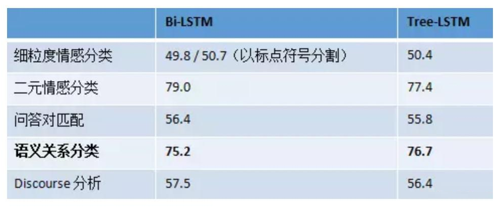

# 4.句法分析

## **1.概述**

句法分析也是自然语言处理中的基础性工作，它分析句子的句法结构（主谓宾结构）和词汇间的依存关系（并列，从属等）。通过句法分析，可以为语义分析，情感倾向，观点抽取等NLP应用场景打下坚实的基础。

随着深度学习在NLP中的使用，特别是本身携带句法关系的LSTM模型的应用，句法分析已经变得不是那么必要了。但是，在句法结构十分复杂的长语句，以及标注样本较少的情况下，句法分析依然可以发挥出很大的作用。因此研究句法分析依然是很有必要的。

## **2.句法分析分类**

句法分析分为两类，一类是分析句子的主谓宾、定状补的句法结构。另一类是分析词汇间的依存关系，如并列、从属、比较、递进等。下面详细讲解。

### **2.1 句法结构分析**

句法结构分析，识别句子的主谓宾、定状补，**并分析各成分之间的关系**.

通过句法结构分析，就能够分析出语句的主干，以及各成分间关系。对于复杂语句，仅仅通过词性分析，不能得到正确的语句成分关系。

句法结构分析的标注如下

### **2.2 语义依存关系分析**

语义依存关系分析，识别词汇间的从属、并列、递进等关系，可以获得较深层的语义信息。如以下三个不同的表达方式，表达了同一个语义信息。可见语义依存关系不受句法结构的影响。

语义依存关系偏向于介词等非实词的在语句中的作用，而句法结构分析则更偏向于名词、动词、形容词等实词。如张三 -> 吃的关系为施加关系Agt，苹果->吃的关系为受事关系Pat。依存关系标注比较多，就不一一列举了。

## **3.句法分析工具**

句法分析算法比较复杂，我们就不展开了。可以参考文章[NLP底层技术之句法分析](https://blog.csdn.net/qq_28031525/article/details/79187080 "NLP底层技术之句法分析")。介绍下几个句法分析工具。

哈工大LTP： [语言云（语言技术平台云 LTP-Cloud）](https://www.ltp-cloud.com/ "语言云（语言技术平台云 LTP-Cloud）")

斯坦福句法分析工具Stanford Parser：[The Stanford Natural Language Processing Group](https://nlp.stanford.edu/software/lex-parser.shtml "The Stanford Natural Language Processing Group")

当前句法分析难度还很大，准确度不高。哈工大的LTP也只能做到80%左右的准确率。

## **4.深度学习和句法分析**

基于深度学习的RNN和LSTM序列模型，本身可以携带很多句法结构和依存关系等深层信息。同时，句法分析树结构也可以和深度学习结合起来。利用句法分析树可以构建LSTM网络（tree-lstm）, 从而对语句进行文本摘要，情感分析。那是否基于句法分析树的LSTM（tree-lstm）就一定比单纯的双向LSTM（bi-lstm）效果好吗？

研究表明，很多情况下，单纯的bi-lstm，比基于句法分析树的tree-lstm效果更好

这主要是因为当前句法分析准确度不高，只有90%左右。如果是句子成分关系很复杂，则准确率更低。因此给lstm网络带来了很大的噪声，从而导致了tree-lstm模型准确度的降低。但是tree-lstm可以使用较少的标注语料，而且在句子结构复杂的长语句上，表现更好。因此当语料较少且句子结构很复杂时，可以考虑使用tree-lstm。相关文章可以参考：[哈工大车万翔：自然语言处理中的深度学习模型是否依赖于树结构？](https://mp.weixin.qq.com/s?__biz=MzIxMjAzNDY5Mg==\&mid=209300177\&idx=1\&sn=4d24467ee27da15ae05effaa0ded9332\&scene=2\&srcid=1015LyJAMxAtArMzdyKyIRHh\&from=timeline\&isappinstalled=0#rd "哈工大车万翔：自然语言处理中的深度学习模型是否依赖于树结构？")

## **5.总结**

句法分析是自然语言处理中的基础性工作，在文本分析 观点抽取 情感分析等场景下可以广泛应用。句法分析当前难度还很高，准确率也有待提升。受制于句法分析准确率问题，基于句法结构树的LSTM深度学习网络的准确率还有待进一步提升。总之，句法分析，任重而道远。
