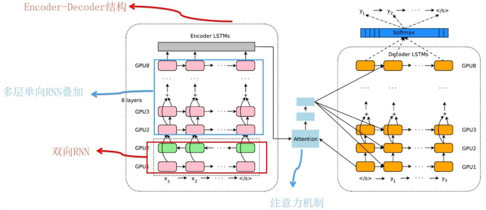

# NLP三大特征抽取器（CNN/RNN/TF）

> 摘自文章：[自然语言处理三大特征抽取器](https://zhuanlan.zhihu.com/p/54743941 "自然语言处理三大特征抽取器")

**结论**：RNN已经基本完成它的历史使命，将来会逐步退出历史舞台；CNN如果改造得当，将来还是有希望有自己在NLP领域的一席之地；而Transformer明显会很快成为NLP里担当大任的最主流的特征抽取器。

NLP任务的特点：输入是个一维线性序列；输入不定长；单词或句子的位置关系很重要；句子中长距离特征对于语义理解也很重要。

> **一个特征抽取器是否适配问题领域的特点，有时候决定了它的成败，而很多模型改进的方向，其实就是改造得使得它更匹配领域问题的特性**。

#### RNN

采取线性序列结构不断从前往后收集输入信息，但这种线性序列结构在反向传播的时候存在优化困难问题，因为反向传播路径太长，容易导致严重的梯度消失或梯度爆炸问题。为了解决这个问题，后来引入了LSTM和GRU模型，通过增加中间状态信息直接向后传播，以此缓解梯度消失问题，获得了很好的效果，于是很快LSTM和GRU成为RNN的标准模型。经过不断优化，后来NLP又从图像领域借鉴并引入了attention机制（从这两个过程可以看到不同领域的相互技术借鉴与促进作用），叠加网络把层深作深，以及引入Encoder-Decoder框架，这些技术进展极大拓展了RNN的能力以及应用效果。

RNN的结构天然适配解决NLP的问题，NLP的输入往往是个不定长的线性序列句子，而RNN本身结构就是个可以接纳不定长输入的由前向后进行信息线性传导的网络结构，而在LSTM引入三个门后，对于捕获长距离特征也是非常有效的。所以RNN特别适合NLP这种线形序列应用场景，这是RNN为何在NLP界如此流行的根本原因。

RNN在新时代面临的两个问题：

1. 一些新模型的崛起：特殊改造的CNN；Transformer
2. RNN结构存在序列依赖，对大规模并行非常不友好

#### CNN

CNN捕获的特征其实的单词的`k-gram`片段信息，`k`的大小决定了能捕获多远距离的特征。

目前NLP界主流的CNN：

通常由1-D卷积层来叠加深度，使用Skip Connection来辅助优化，也可以引入Dilated CNN等手段。

CNN的卷积层其实是保留了相对位置信息的，CNN的并行计算能力，那是非常强的。

#### Transformer

自然语言一般是个不定长的句子，那么这个不定长问题怎么解决呢？Transformer做法跟CNN是类似的，一般设定输入的最大长度，如果句子没那么长，则用Padding填充，这样整个模型输入起码看起来是定长的了。

#### 三大抽取器比较

1. **语义特征提取能力**：Transformer在这方面的能力非常显著地超过RNN和CNN，RNN和CNN两者能力差不太多。
2. **长距离特征捕获能力**：原生CNN特征抽取器在这方面极为显著地弱于RNN和Transformer，Transformer微弱优于RNN模型(尤其在主语谓语距离小于13时)，能力由强到弱排序为Transformer>RNN>>CNN; 但在比较远的距离上（主语谓语距离大于13），RNN微弱优于Transformer，所以综合看，可以认为Transformer和RNN在这方面能力差不太多，而CNN则显著弱于前两者。
3. **任务综合特征抽取能力（机器翻译）**：Transformer综合能力要明显强于RNN和CNN，而RNN和CNN看上去表现基本相当，貌似CNN表现略好一些。
4. **并行计算能力及运行效率**：RNN在并行计算方面有严重缺陷，这是它本身的序列依赖特性导致的；对于CNN和Transformer来说，因为它们不存在网络中间状态不同时间步输入的依赖关系，所以可以非常方便及自由地做并行计算改造。Transformer和CNN差不多，都远远远远强于RNN。

#### 综合排名

***单从任务综合效果方面来说，Transformer明显优于CNN，CNN略微优于RNN。速度方面Transformer和CNN明显占优，RNN在这方面劣势非常明显。***

三者的结合：向Transformer靠拢
