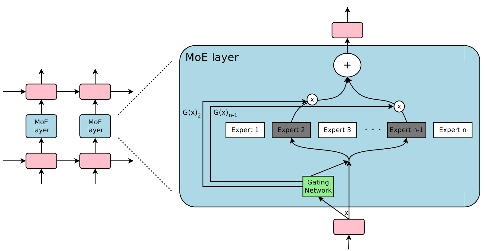
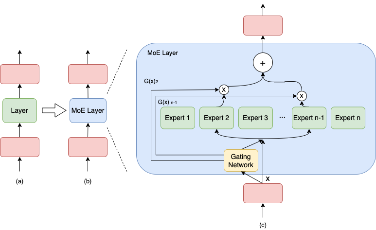
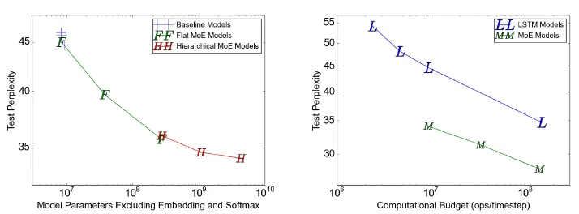
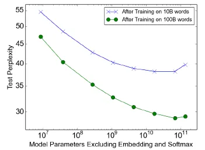
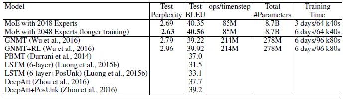
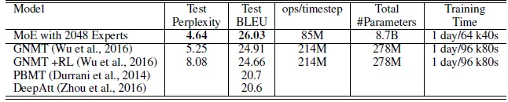
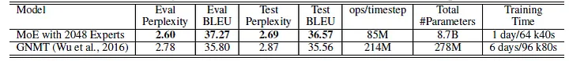
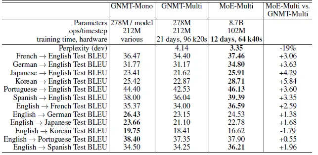

# 1.MoE论文

参考文章：

- [Mixture of Experts-Introduction](https://abdulkaderhelwan.medium.com/mixture-of-experts-introduction-39f244a4ff05 "Mixture of Experts-Introduction")
- [Understanding the Mixture-of-Experts Model in Deep Learning](https://medium.com/@jain.sm/understanding-the-mixture-of-experts-model-in-deep-learning-71d2e20650ac "Understanding the Mixture-of-Experts Model in Deep Learning")

论文相关：

- 论文名称：Outrageously Large Neural Networks: The Sparsely-Gated Mixture-of-Experts Layer
- 论文地址：[Outrageously Large Neural Networks: The Sparsely-Gated Mixture-of-Experts Layer](https://arxiv.org/abs/1701.06538 "Outrageously Large Neural Networks: The Sparsely-Gated Mixture-of-Experts Layer")

混合专家（Mixture of Experts，MoE）就像是神经网络世界中的一种团队合作技术。想象一下，把一项大任务分解成更小的部分，让不同的专家来处理每个部分。然后，有一个聪明的法官，他根据情况决定遵循哪位专家的建议，所有这些建议都融合在一起。

尽管它最初是用神经网络来解释的，但你可以将这个想法用于任何类型的专家或模型。这有点像你把不同的味道结合在一起做一道美味的菜，这属于一组很酷的综合学习方法，称为元学习。

因此，在本文中，将了解专家组合模型的技巧。

## 1.摘要

- 神经网络的**吸收信息的容量（capacity）受限于**参数数目。
- **条件计算（conditional computation）****针对于每个样本，** ​**激活网络的部分子网络进行计算**，它在理论上已证明，可以作为一种显著增加模型容量的方法。
- 在实际中，在牺牲少量计算效率的情况下，实现了 **1000 倍**的**模型容量（model capacity）** 的提升。
- 引入了**稀疏门控专家混合层（Sparsely-Gated Mixture-of-Experts Layer）**，包括数以千计的前馈子网络。对于每一个样本，有一个**可训练的门控网络（gating network）会计算这些**专家（指前馈子网络）**的**稀疏组合。
- 把**专家混合（MoE）应用于**语言建模和**机器翻译**任务中，对于这些任务，从训练语料库中吸收的巨量知识，是十分关键的。
- 在我们提出的模型架构里，MoE 包含 1370 亿个参数，以卷积的方式放在**堆叠 LSTM 层**之间。
- 在大型语言建模和及其翻译的基准测试中，该模型以更少的计算成本，实现了比最先进方法更好的结果。

## 2.介绍和相关工作

### 2.1 条件计算

**充分利用训练数据和模型大小的规模**，一直以来都是深度学习成功的关键。

- 当训练集足够大，增加神经网络的容量（即参数数目），可以得到更高的预测准确度。
- 对于传统的深度学习模型，**对每一个样本都会激活整个模型**，这会导致在训练成本上，以**大约二次方的速度增长**，因为**模型大小和训练样本数目都增加了**。
- 当前计算能力和分布式计算的进展，并不能满足这样的需求。

因此有很多工作提出了各种形式的条件计算，**它们在不显著增加计算成本的情况下**\*\*，尽量增加模型的容量\*\*。

- 在这些算法里，**以每个样本为基础（on a per-example basis）**，会**激活或冻结**网络中的大部分。
- 这种**门控决策机制**，可以是**二进制的**，也可以是**稀疏而连续的**；可以是**随机性的**，也可以是**确定性的**。
- 门控决策通过有各种形式的强化学习和反向传播来训练。

> Figure 1：MoE 层嵌入到循环语言模型中。在本例中，稀疏的门控函数选择**两个专家**来执行计算。门控网络会调整专家的输出。

尽管这种思想在理论上很有前景，但是目前为止，还没有工作展现在模型容量、训练时间或模型质量上有足够的提升。我们把原因归结为这些挑战：

- 现代计算设备（特别是 GPU），相比**分支（branching）而言，在**数值计算上更快。
- 大的批量大小对于性能很关键。而条件计算减少了批量大小。
- 网络带宽会成为性能瓶颈。
- 损失项可能对于实现好的效果是必需的，因此损失项可能会影响模型质量和负载平衡。
- 对于大型数据集，模型容量是最关键的。目前条件计算的文献处理的图像识别数据集都相对太小了，难以为大模型提供足够多的信号。

本文首先解决了上述挑战，并且最后看到了条件计算的前景。

- 我们得到了 1000 倍的模型容量提升，只花费了少量计算开销
- 得到的结果也优于最顶尖的结果

### 2.2 本文方法：稀疏门控专家混合层

我们的条件计算方法，就是引入了一个新的通用神经网络组件类型：**稀疏门控专家混合层**。

MoE 包含：

- 一些专家，每个专家都是一个**简单的前馈神经网络**。
- 一个**可训练的门控网络**，它会挑选专家的一个稀疏组合，用来处理每个输入。
- 所有网络都是**使用反向传播联合训练**的。

尽管该技术是通用的，但是本文聚焦在语言建模和机器翻译任务中（这些任务都受益于非常大的模型）。

- 具体说来，如图一所示，我们把 MoE **以卷积的方式（convolutionally）放在**多层 LSTM 层之间。
- 在文本的每个位置上，就会调用 MoE 一次，进而**可能选择不同的专家组合**。
- 不同的专家**会倾向于变得高度专业化（基于语法和语义）**。

## 3.混合专家层的结构

### 3.1 MoE层

MoE 层包括 ：

- n 个“**专家网络**”：$E1,⋯,En$。
- 一个**门控网络** $G$，其输出是一个稀疏的 $n$ 维向量。

尽管从理论上讲，每个专家网络只要保持一致的输入大小和输出大小就可以了；但是，在本文的研究里，我们限制了专家网络具有相同的网络结构，而网络参数保持独立。

给定输入 $x$，定义 $G(x)$是门控网络的输出；$Ei(x)$ 是第 $i$ 个专家网络的输出。于是 MoE 模块的输出为：

$$
y=\sum_{i=1}^{n} G(x)_{i} E_{i}(x)
$$

基于 $G(x)$ 输出的稀疏性，可以节省计算量。

- 当 $G(x)i=0$时，我们无需计算 $Ei(x)$。
- 在我们的实验中，我们**有数以千计的专家**，但是针对每个样本，只需要用到**少量的专家**。
- 如果专家数目非常大，我们可能要采用**层次化的 MoE**；本文我们不会使用层次化的 MoE，相关细节感兴趣可以见附录 B。

### 3.2 层次化MoE

如果专家数量很大，**可以通过使用两级层次MoE来降低分支因子**。在分层MoE中，主选通网络选择“专家”的稀疏加权组合，每个专家本身就是具有自己选通网络的专家的二次混合。&#x20;

主选通网络是$Gprimary$，次选通网络为$（G1，G2，…，Ga）$，专家网络为$（E0,0，E0,1，…，Ea，b）$。MoE的输出由以下公式给出：

$$
y_{H}=\sum_{i=1}^{a} \sum_{j=1}^{b} G_{p r i m a r y}(x)_{i} \cdot G_{i}(x)_{j} \cdot E_{i, j}(x)
$$

### 3.3 门控网络

#### （1）Softmax Gating

一种朴素的想法是，用一个矩阵乘上输入，然后经过一个 Softmax 函数，这种方法实际上是一种非稀疏的门控函数：

$$
G_{\sigma}(x)=\operatorname{Softmax}\left(x \cdot W_{g}\right)
$$

#### （2）Noise Top-K Gating

在 Softmax 门控网络基础上，\*\*加入两个元素：\*\***稀疏性和噪声**。在执行 Softmax 函数之前：

我们加入了**可调的高斯噪声**，噪声项是为了帮助**负载均衡（load balancing）**，我们在附录 A 有详细讨论。

并且**保留前 k 个值**，其他设置为 $-\infty$。这种稀疏性是为了节省计算资源，**尽管这种形式的稀疏性，从理论上会造成一些可怕的输出间断性**，**但在实际使用中，并没有观察到这种问题**。

每个分量的噪音量，通过另一个可训练的权重矩阵 $W_{noise}$  来控制。

$$
G(x)=\operatorname{Softmax}(\operatorname{KeepTopK}(H(x), k))
$$

$$
H(x)_{i}=\left(x \cdot W_{g}\right)_{i}+ StandardNormal ()\cdot \operatorname{Softplus}\left(\left(x \cdot W_{\text {noise }}\right)_{i}\right)
$$

$$
KeepTopK (v, k)_{i}=\left\{\begin{array}{ll}v_{i} & \text { if } v_{i} \text { is in the top } k \text { elements of } v \\ -\infty & \text { otherwise. }\end{array}\right.
$$

### 3.4训练门控网络

使用**简单的反向传播**来训练门控网络以及接下来的模型。

## 4.解决性能挑战

### 4.1 批量减小问题（The Shrinking Batch Problem）

由于门控网络对每个样本，在 $n$ 个专家中，选择 $k$ 个。那么对于 $b$个样本的批次，每个转接都会收到更加更加小的批次（大概 $\frac{kb}{n} << b$）。这会导致朴素的 MoE 实现**在专家数量增加时，非常低效**。解决批量减小问题，就是需要让**原始的批量大小尽可能的大**。然而，批量大小会收到内存的限制。我们提出如下技术来提高批量大小：

- **混合数据并行和模型并行（Mixing Data Parallelism and Model Parallelism）**:相当于变相的扩大b，假设有d个device，每个device上一次处理b个样本，那么在这次训练中，batch=bd，从而每个expert会接收kbd/n个样本。
- 充分利用卷积
- 增加循环 MoE 的批量大小

### 4.2 网络带宽

## 5.平衡专家的利用率

我们观察到，门控网络倾向于收敛到**一种不好的状态，即对相同的少量专家，总是会得到较大的权重**。**这种不平衡是不断自我强化的**，随着更好的专家不断训练学习，它们更有可能被门控网络选中。面对这种问题，过去文献有的用**硬性约束**，有的用**软性约束**。

而我们采用**软性约束方法**。我们定义对**于一个批次训练样本**的**专家重要度（the importance of an expert）**，即该专家**在一个批次上的门控输出值的和**。并且定义损失项 $L_{importance}$ ，加入到模型的总损失上。该损失项等于**所有专家重要度的方差的平方**，再加上一个手工调节的比例因子 $w_{important}$。这个损失项**会鼓励所有专家有相同的重要度**。

$$
Importance (X)=\sum_{x \in X} G(x)
$$

$$
L_{\text {importance }}(X)=w_{\text {importance }} \cdot C V(\text { Importance }(X))^{2}
$$

尽管现在的损失函数可以保证相同的重要度，**专家仍然可能接收到差异很大的样本数目**。例如，某些专家可能接收到少量的大权重的样本；而某些专家可能接收到更多的小权重的样本。为了解决这个问题，我们引入了第二个损失函数：$L_{load} $，它可以保证负载均衡。附录 A 会包含该函数的定义。&#x20;

## 6.实验

### 6.1 10 亿词汇的语言建模基准

MoE模型：所提出的模型由两个堆叠的LSTM层组成，它们之间有一个MoE层。

使用包含4、32和256名专家的平面MoE以及包含256、1024和4096名专家的分层MoE来训练模型。

每个专家都有大约100万个参数。

对于所有MoE层，每次输入都有4名专家活跃。

左图：有4名始终活跃的专家的模型与计算匹配的基线模型表现相似（不足为奇），而最大的模型（4096名专家）在测试集上的困惑度降低了24%，令人印象深刻。&#x20;

右图：与LSTM模型相比，MoE模型在相似的计算预算下实现了更低的困惑。

对于没有MoE的基线模型，观察到的计算效率在1.07–1.29 TFLOPS/GPU之间。

对于所提出的低计算MoE模型，计算效率在0.74-0.90 TFLOPS/GPU之间，但4专家模型没有充分利用可用的并行性。

计算量最高的MoE模型在1.56 TFLOPS/GPU时效率更高，这可能是由于矩阵更大。

### 6.2 1000 亿词汇的谷歌新闻语料库

当训练超过1000亿个单词时，测试困惑度显著提高，达到65536个专家（680亿个参数），比计算匹配的基线低39%，但在131072个专家时会下降，这可能是稀疏性过大的结果。

### 6.3 机器翻译

这里使用的MoE模型是[GNMT](https://sh-tsang.medium.com/review-googles-neural-machine-translation-system-bridging-the-gap-between-human-and-machine-518595d87226 "GNMT")的修改版本。

为了减少计算，编码器和解码器中的LSTM层的数量分别从9和8减少到3和2。

MoE层被插入编码器（在层2和3之间）和解码器（在层1和2之间）中。每个MoE层包含多达2048名专家，每个专家都有大约200万个参数，总共为模型增加了大约80亿个参数。

> **Results on WMT’14 En>Fr newstest2014**

> **Results on WMT’14 En>De newstest2014**

所提出的方法在WMT’14 En>Fr和En>De基准上获得了40.56和26.03的BLEU分数，优于GNMT和Deep-Att。

在Google Production数据集上，MoE模型在训练了六分之一的时间后，测试BLEU得分也提高了1.01。

## 7.结论

- 该工作是第一个展现**基于深度网络的条件计算**的重大胜利。
- 我们探讨了设计考虑、条件计算的挑战、从算法和工程上的解决方案。
- 虽然我们聚焦在文本领域上，条件计算仍然可以在其他领域发挥作用。我们期望有更多条件计算的实现和应用。
