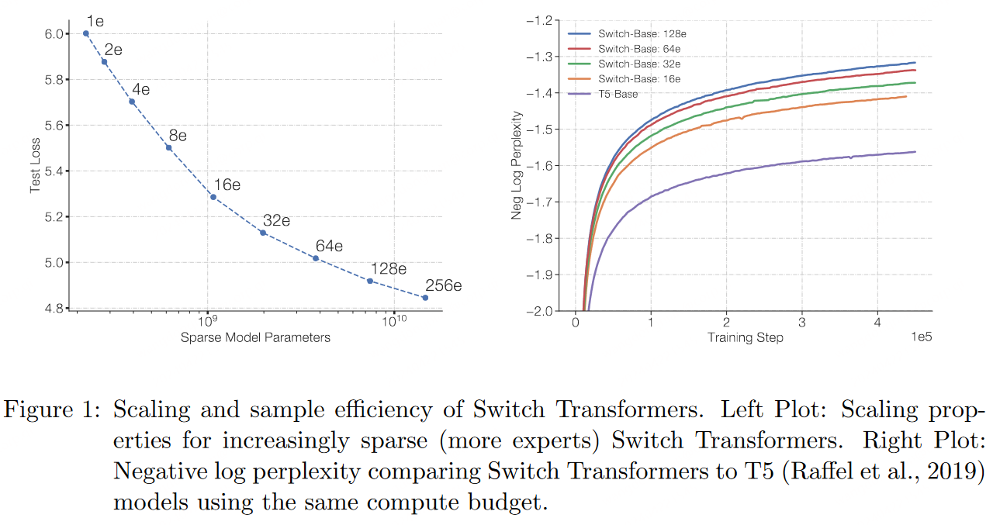
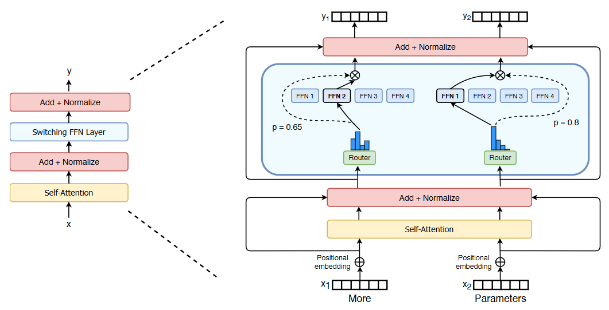
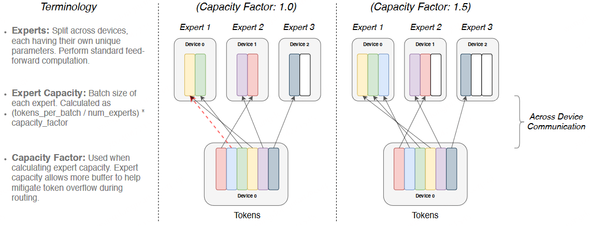
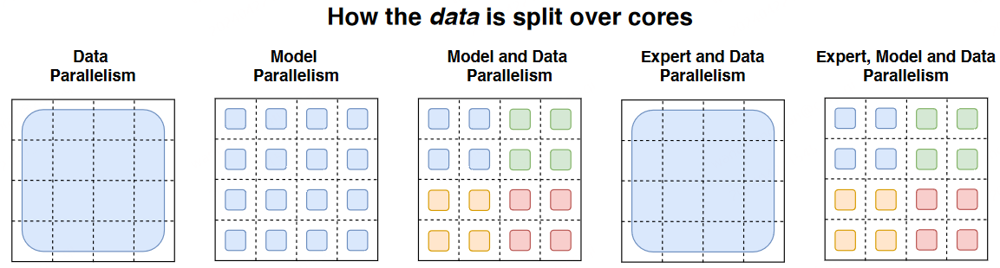
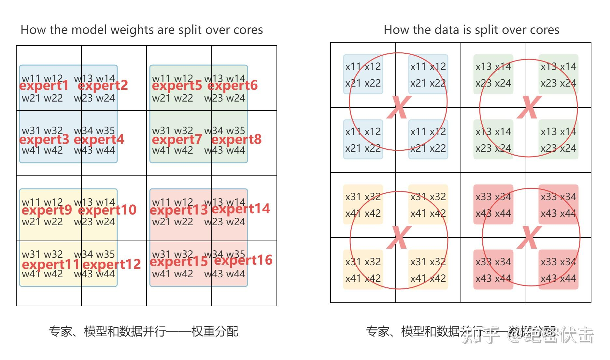

# 3.LLM MoE ：Switch Transformers

## 0.前言

GPT-4远不止1万亿，甚至，还是8个2200亿参数组成的混合专家模型（**MoE**）。

2023年6月，美国知名骇客George Hotz在接受采访时透露，GPT-4由8个220B模型组成。这么算来，8 x 220B = 1.76万亿。就连PyTorch的创建者Soumith Chintala对此也深信不疑。

MoE 应用于大模型，GPT-4并不是第一个。在2022年的时候，Google 就提出了MoE大模型**Switch Transformer**，模型大小是1571B，Switch Transformer在预训练任务上显示出比 T5-XXL（11B） 模型更高的样本效率。在相同的训练时间和计算资源下，Switch Transformer 能够达到更好的性能。

除了GPT-4和Switch Transformer，国内的团队DeepSeek 也**开源了国内首个 MoE** 大模型 **DeepSeekMoE**。

- DeepSeekMoE **2B可接近2B Dense，仅用了17.5%计算量。**&#x20;
- DeepSeekMoE **16B性能比肩 LLaMA2 7B 的同时，仅用了40%计算量。**&#x20;
- DeepSeekMoE **145B 优于Google 的MoE大模型GShard，而且仅用 28.5%计算量即可匹配 67B Dense 模型的性能。**&#x20;

## 1.什么是MoE大模型？

MoE，全称为Mixed Expert Models，翻译过来就是混合专家模型。MoE并不是什么最新技术，早在1991年的时候，论文[Adaptive Mixture of Local Experts](https://www.cs.toronto.edu/~hinton/absps/jjnh91.pdf "Adaptive Mixture of Local Experts")就提出了MoE。

**模型规模是提升模型性能的关键因素之一**，这也是为什么今天的大模型能取得成功。在有限的计算资源预算下，用更少的训练步数训练一个更大的模型，往往比用更多的步数训练一个较小的模型效果更佳。

MoE 的一个显著优势是它们**能够在远少于 Dense 模型所需的计算资源下进行有效的预训练**。这意味着在相同的计算预算条件下，可以显著扩大模型或数据集的规模。特别是在预训练阶段，与稠密模型相比，混合专家模型通常能够更快地达到相同的质量水平。

MoE基于Transformer架构，主要由两部分组成：

- **稀疏 MoE 层**\*\*：\*\* 这些层代替了传统 Transformer 模型中的前馈网络 (FFN) 层。MoE 层包含若干“专家”(例如 8 个)，每个专家本身是一个独立的神经网络。在实际应用中，这些专家通常是前馈网络 (FFN)，但它们也可以是更复杂的网络结构。
- **门控网络或路由**: 这个部分用于决定哪些 token 被发送到哪个专家。例如，在下图中，“More”这个 token 可能被发送到第二个专家，而“Parameters”这个 token 被发送到第一个专家。有时，一个 token 甚至可以被发送到多个专家。token 的路由方式是 MoE 使用中的一个关键点，因为路由器由学习的参数组成，并且与网络的其他部分一同进行预训练。

> Google Switch Transformer论文中的MoE结构

总结来说，在混合专家模型 (MoE) 中，将传统 Transformer 模型中的每个前馈网络 (FFN) 层替换为 MoE 层，其中 MoE 层由两个核心部分组成: **一个路由器（或者叫门控网络）和若干数量的专家**。

## 2.MoE大模型具备哪些优势？

MoE的最大优势就是与Dense模型相比，**在相同计算资源下，训练速度更快，而且可以训练更大的模型**。比如Google的Switch Transformer，模型大小是T5-XXL的15倍，在相同计算资源下，Switch Transformer模型在达到固定困惑度 PPL 时，比T5-XXL模型**快4倍**。

相同计算资源下，Google的MoE大模型能够**在相同计算资源下，以更快的速度达到相同的PPL，而且模型是T5的15倍**；DeepSeek的16B MoE大模型，仅在40%的计算量的情况下，性能和LLaMA 2 7B效果比肩。

总结MoE大模型优点，主要有以下几点点：

1. **训练速度更快，效果更好**\*\*。\*\*&#x20;
2. **相同参数，推理成本低**\*\*。\*\*&#x20;
3. **扩展性好**，允许模型在保持计算成本不变的情况下增加参数数量，这使得它能够扩展到非常大的模型规模，如万亿参数模型。
4. **多任务学习能力**：MoE在多任务学习中具备很好的新能（比如Switch Transformer在所有101种语言上都显示出了性能提升，证明了其在多任务学习中的有效性）。

而MoE大模型的缺点，主要有以下4点：

1. **训练稳定性**：MoE在训练过程中可能会遇到稳定性问题。
2. **通信成本**：在分布式训练环境中，MoE的专家路由机制可能会增加通信成本，尤其是在模型规模较大时。
3. **模型复杂性**：MoE的设计相对复杂，可能需要更多的工程努力来实现和优化。
4. **下游任务性能**：MoE由于其稀疏性，使得在Fine-tuning过程中容易出现过拟合。

接下来，就介绍下MoE的主要原理。通过后面的介绍，主要需要回答以下3个问题：

1. **MoE为什么可以实现更大模型参数、更低训练成本？**
2. **MoE如何解决训练稳定性问题？**
3. **MoE如何解决Fine-Tuning过程中的过拟合问题？**

## 3.Switch Transformers

尽管 MoE 显示出了很大的潜力，但是由于复杂性、通信成本以及训练和微调过程的不稳定性，模型广泛采用仍需要优化。

而在2022年，Google 提出的 [Switch Transformers](https://arxiv.org/pdf/2101.03961.pdf "Switch Transformers") 一定程度缓解了这些问题。Switch Transformers 是一项非常激动人心的工作，它深入研究了这些话题。作者在 Hugging Face 上发布了一个 [1.6 万亿参数的 MoE](https://huggingface.co/google/switch-c-2048 "1.6 万亿参数的 MoE")，拥有 2048 个专家，可以使用 `transformers` 库来运行它。Switch Transformers 实现了与 T5-XXL 相比 4 倍的预训练速度提升。

Switch Transformers\*\* 简化了 MoE 路由算法，设计了直观的改进模型，降低了通信和计算成本\*\*。Switch Transformers 的训练方法减轻了不稳定性，并且首次展示了用较低精度（bfloat16）格式训练大型稀疏模型的可能性。

**和 T5 Base、T5 Large 相比，Switch Transformers 在相同计算资源情况下获得了高达 7 倍的预训练速度**。在多语言实验中，Switch Transformers 在所有 101 种语言测试中都取得了提升。Switch Transformers 通过在爬虫语料库上预训练了一个高大万亿参数规模的模型，实现了与 T5-XXL 相比4倍的加速。

> 左图：增加模型稀疏性（更多专家），loss逐渐降低（图中256e表示256个 experts）
> 右图：Switch Transformers 和 T5-Base 的对比（相同计算资源）

上图中，模型参数随着专家数量的增加而增加，但保持了相同的计算成本（FLOPs per token）。这表明模型在保持计算效率的同时，能够利用更多的参数来提高性能。

右图中比较了使用相同计算资源下，Switch Transformer 和 T5-Base 的 PPL。可以看到 Switch Transformer 模型在保持相同计算资源的情况下，相对于 T5-Base 有显著的提升，而且专家数越多（模型参数越多、模型更稀疏），效果越好。

### 3.1 Switch Transformer 主要优化

Swith Transformer 在论文中提到其设计的指导原则是——**尽可能地把 Transformer 模型的参数量做大**\*\*！\*\*（同时以一种简单高效的实现方式）

和其他 MoE 模型的一个显著不同就是，**Switch Transformer 的门控网络每次只路由到 1 个 expert**，也就是每次只选取 top1 的专家，而其他的模型都是至少 2 个。这样就是最稀疏的 MoE 了，因此单单从 MoE layer 的计算效率上讲是最高的了。下图是 Switch Transformer 的模型结构。

> Switch Transformer encoder模块，使用稀疏的Switch FFN替换原来Dense FFN

与最初使用至少两个专家的想法相反，Switch Transformer 采用了简化的单专家策略，每次只选择一个专家。这种方法的效果包括：

- 减少了路由计算，一个 token 每次只路由到一个专家
- 每个专家的 batch size（专家容量、Expert Capacity） 至少可以减半
- 简化路由的实现，降低了 MoE 中的通信成本

### 3.2 Switch Routing

上面提到了 Switch Transformer 可以降低每个专家的**专家容量**，那么什么是专家容量？

**专家容量（Expert Capacity）** 是指每个专家在模型中处理的 token 数。专家容量的计算方式如下：

$$
Expert~ Capacity =\left(\frac{\text { tokens per batch }}{\text { number of experts }}\right) \times capacity~factor
$$

**这里为什么要计算一个专家容量？这个专家容量又有什么作用？**

在编译时，所有 tensor 的形状都是静态确定的。这意味着在编译阶段，模型的架构和数据布局已经被定义，包括模型的层数、每层的输入和输出维度等。

尽管 tensor 的形状是静态的，但**在训练和推理过程中，模型的计算是动态的**。这是因为模型中的路由器（门控网络）会根据输入数据动态地将 token 分配给不同的专家。这种动态性要求模型能够在运行时灵活地处理数据分布。

而这个**专家容量的作用就是将 batch 中的总 token 数平均分配给所有专家**。然后，为了应对 token 分布不均的情况，会通过一个容量因子（capacity factor）来扩展每个专家的容量。

**容量因子**是一个大于 1.0 的数，它的作用是为每个专家提供额外的缓冲空间，以容纳可能超出平均分配的 token。这样，即使某些专家接收到的 token 数量超过了平均值，也能够处理这些额外的 token，而不会因为容量不足而导致计算跳过。

下图是不同容量因子下的动态路由。

> 不同容量因子下的动态路由

如图所示，容量因子` Capacity Factor = 1.0`的时候，输入6个 token，那么每个专家的专家容量等于 2（`Expert Capacity = 6/3 * 1 = 2`），Expert 1 被分配到了 3 个 token，超出了专家容量，这些超出的 token 被称为“溢出 token”（图（左）中的虚线部分）。**对于这些溢出的 token，模型会跳过计算，直接将 token 的表示通过残差连接传递到下一层**。

而如果容量因子 `Capacity Factor = 1.5`，这时专家容量等于 3，每个专家就能处理 3 个 token（图（右））。

虽然增加容量因子可以减少 token 溢出，但是它也有缺点。**如果容量因子设置得过高，会导致计算资源和内存的浪费**，因为模型会为可能永远不会用到的 token 分配额外的资源。在论文中，Switch Transformers 在低容量因子 (例如 1 至 1.25) 下表现出色。

下表是不同容量因子的效果对比。

**表 1：Switch Transformer 和 MoE 的效果对比**

| 模型           | 容量因子 | 训练100k steps后的负对数困惑度（越大越好） | 模型到达指定负对数困惑度（-1.5）所需时间（单位小时） | 训练速度（每秒处理的样本数） |
| ------------ | ---- | -------------------------- | ---------------------------- | -------------- |
| T5-Base      |      | -1.731                     | 没有达到                         | 1600           |
| T5-Large     |      | -1.550                     | 131.1                        | 470            |
| MoE-Base     | 2.0  | -1.547                     | 68.7                         | 840            |
| Switch-Base  | 2.0  | -1.554                     | 72.8                         | 860            |
| MoE-Base     | 1.25 | -1.559                     | 72.8                         | 790            |
| Switch-Base  | 1.25 | -1.553                     | 65.0                         | 910            |
| MoE-Base     | 1.0  | -1.572                     | 80.1                         | 860            |
| Switch-Base  | 1.0  | -1.561                     | 62.8                         | 1000           |
| Switch-Base+ | 1.0  | -1.534                     | 67.6                         | 780            |

- 以上模型都是在相同的计算资源（32核）和硬件（TPUv3）上进行训练的。
- 所有 MoE 和 Switch Transformer 模型都使用 128 个专家。
- 为了达到负对数困惑度为-1.50，所有模型都需要进行超过 100k steps 的预训练。
- Switch-Base+：对于这个模型，作者增加了模型的大小，直到其训练速度与 MoE 模型相匹配。这通过增加模型的隐藏层大小（从768增加到896）和 head 的数量（从14增加到16）来实现。
- T5-Base 在训练的 100k 步内没有达到这个负对数困惑度：这表示在给定的训练步数内，T5-Base 模型没有达到设定的效果，这可能是由于其性能不如 Switch Transformer 或 MoE Transformer 模型。

Switch Transformer 的作者还重新审视并简化了负载均衡损失。通过合理设置负载均衡损失的系数，可以在训练过程中实现专家之间的良好负载分布。下面介绍下具体实现。

### 3.3 不同的负载均衡损失

在稀疏模型中，专家的数量通常分布在多个设备上，每个专家负责处理一部分输入数据。理想情况下，每个专家应该处理相同数量的数据，以实现资源的均匀利用。然而，**在实际训练过程中，由于数据分布的不均匀性，某些专家可能会处理更多的数据，而其他专家可能会处理较少的数据**。这种不均衡可能导致训练效率低下，因为某些专家可能会过载，而其他专家则可能闲置。为了解决这个问题，论文中引入了一种**辅助损失函数**，以促进专家之间的负载均衡。

给定 N 个专家，索引为`i=1` 到 `N` ，以及一个包含 T 个 token 的 $batch~ B$ ，辅助 loss 计算为向量 $f$和 $P$ 的缩放点积。表示如下：

$$
auxiliary ~loss =\alpha \cdot N \cdot \sum_{i=1}^{N} f_{i} \cdot P_{i}
$$

其中， $f_i$ 是 batch 中分配给专家 `i` 的 token 占比，计算方式为 batch 中被路由到专家 `i` 的 token 数除以总token 数，表示如下：

$$
f_{i}=\frac{1}{T} \sum_{x \in \mathcal{B}} \mathbb{I}\{\operatorname{argmax} p(x)=i\}
$$

$P_i$ 是所有输入token 被路由到专家 `i` 的概率，表示如下：

$$
P_{i}=\frac{1}{T} \sum_{x \in \mathcal{B}} p_{i}(x)
$$

其中 $p_i\left( x \right)$ 是给定 token xx 被路由到专家 `i` 的概率。

由于希望 batch 中的所有 token 能够均匀地分配给N个专家。这意味着每个专家应该处理相同数量的token，即每个专家处理的 token 比例应该是 `1/N` 。

通过最小化公式的辅助 loss，可以鼓励这种均匀路由。当 token 均匀分布时，这个损失会被最小化。

最终的 loss 被乘以专家数量 `N` ，这样即使专家数量变化，loss 也能保持恒定。这是因为在均匀路由情况下$\sum_{i=1}^{N}\left(f_{i} \cdot P_{i}\right)=\sum_{i=1}^{N}\left(\frac{1}{N} \cdot \frac{1}{N}\right)=\frac{1}{N}$ 。

$\alpha$ 是一个超参数，用于调整辅助 loss 的权重。论文中选择了 $\alpha=10^{-2}$ ，这个值足够大，可以确保负载均衡，同时又足够小，不会压倒主要的交叉熵目标（即主要的训练损失）。论文实验了从 $10^{-1}$ 到 $10^{-5}$ 的$\alpha$ 值范围，发现 $10^{-2} $的值可以快速平衡负载，同时不会干扰训练损失。

### 3.4 稀疏路由和负载均衡loss的合并效果

前面介绍了 Switch Transformer 的主要优化：**稀疏路由和负载均衡损失**。下面介绍一下将这两项优化合并在一起的实验效果。

实验设置如下：

- 首先从 C4 数据集上进行预训练，使用 MLM（Masked Language Modeling） 作为预训练目标。在这个任务中，模型被训练来预测被 mask 的 token。
- 对比 Switch Transformer 与 MoE Transformer 以及 T5。Switch Transformer 在计算量（FLOPs）上与 T5-Base 匹配，即每个 token 应用的计算量相同。MoE Transformer 使用 top-2 路由。
- 所有模型都在相同的硬件（TPUv3）上进行了相同数量的步骤训练。

实验结论如下（可以参见前面的**表** 1）：

- Switch Transformer 在速度和效果上都优 MoE Transformer。对于固定的计算量和时间，Switch Transformer 实现了最佳结果。
- Switch Transformer 的计算量小于同等参数的 MoE 模型。如果将 Switch Transformer 的规模增加到匹配MoE Transformer 的训练速度，那么它在每个步骤上都优于所有 MoE 模型。
- Switch Transformer 在较低的容量因子（1.0, 1.25）下表现更好。较低的专家容量表明在大模型中，模型内存非常稀缺，容量因子应尽可能小。

### 3.5 改进训练和Fine-Tuning技术

#### （1）**精度选择**

作者还尝试了混合精度的方法，例如用 `bfloat16` 精度训练专家，同时对其余计算使用全精度进行。较低的精度可以减少处理器间的通信成本、计算成本以及存储 tensor 的内存。然而，在最初的实验中，当专家和门控网络都使用 `bfloat16` 精度训练时，出现了不稳定的训练现象。这种不稳定性主要是由路由计算引起的，因为路由涉及指数函数等操作，这些操作对精度要求较高。因此，为了保持计算的稳定性和精确性，保持更高的精度是重要的。为了减轻不稳定性，路由过程也使用了全精度。

下面的表 2 显示了混合精度训练的效果，将路由器输入转换为 float32，同时保持其他部分的精度为 bfloat16。这种策略允许模型在几乎与 bfloat16 精度相同的训练速度下，实现与 float32 训练相当的稳定性。

表2：不同精度效果对比

| 模型精度选择                 | 效果（负对数困惑度） | 训练速度（每秒处理样本数） |
| ---------------------- | ---------- | ------------- |
| Switch-Base (float32)  | -1.718     | 1160          |
| Switch-Base (bfloat16) | -3.780     | 1390          |
| Switch-Base (混合精度)     | -1.716     | 1390          |

实验表明，使用混合精度的 Switch-Base 在固定步数的早期训练中，其效果（以负对数困惑度为衡量标准）与使用 float32 训练的模型相似，同时速度接近 bfloat16。

#### **（2）更小的参数初始化**

在深度学习中，适当的权重初始化对于模型的成功训练至关重要。作者观察到，在 Switch Transformer 模型中，这一点尤其明显。

**为了提高模型的稳定性，作者建议减少默认的 Transformer 初始化规模**。在 Transformer 模型中，权重矩阵通常是从一个截断的正态分布，其均值为0，标准差由一个超参数 s 决定。作者建议将这个初始化超参数 s 从默认值1.0 减少 10 倍，即 s = 0.1。这种较小的初始化规模有助于提高模型效果和减少训练过程中的不稳定性。

表3：减小参数初始化规模可以提升训练稳定性

| 权重初始化规模 | 负对数困惑度 | 负对数困惑度标准差 |
| ------- | ------ | --------- |
| 0.1倍初始化 | -2.72  | 0.01      |
| 1.0倍初始化 | -3.60  | 0.68      |

表 3 中的数据表明，通**过减少初始化规模，模型效果和稳定性得到了提升**。这种改进对于大模型，如 Switch Transformer，尤其重要。

#### **（3）Fine-Tuning 过程正则化**

为了解决 Fine-Tuning 过程中的过拟合问题，作者提出了增加 dropout的策略，特别是在专家层（expert layers）中。他们称之为“expert dropout”，即**在 Fine-Tuning 时只在专家层增加 dropout 率**。

表 4显示了在 Fine-Tuning Switch Transformer 时，不同 dropout 率的实验结果。这些模型是在 C4 数据集上预训练的，然后进行了 Fine-Tuning。

表4：Fine-Tuning 过程中正则化效果

| 模型（dropout）                       | GLUE | CNNDM | SQuAD | SuperGLUE |
| --------------------------------- | ---- | ----- | ----- | --------- |
| T5-Base (d=0.1)                   | 82.9 | 19.6  | 83.5  | 72.4      |
| Switch-Base (d=0.1)               | 84.7 | 19.1  | 83.7  | 73.0      |
| Switch-Base (d=0.2)               | 84.4 | 19.2  | 83.9  | 73.2      |
| Switch-Base (d=0.3)               | 83.9 | 19.6  | 83.4  | 70.7      |
| Switch-Base (d=0.1, expert d=0.4) | 85.2 | 19.6  | 83.7  | 73.0      |

通过这种 expert dropout 策略，有效地减少了过拟合的风险，同时保持了模型在下游任务上的性能。这种**正则化方法对于处理具有大量参数的稀疏模型特别有用，因为它可以帮助模型更好地泛化到未见过的数据**。

### 3.6 高效训练：数据、模型、专家并行

**任意增加专家数量会导致收益递减**（如图3所示）。这意味着在某个点之后，继续增加专家数量不会显著提高模型性能。但是可以通过增加模型的维度，如模型的隐藏层大小（dmodel）或前馈网络的维度（dff）来继续提升模型效果。但是这样又会导致显存和内存开销增加，这时候就可以通过并行技术，解决高效训练问题。

这里补充一下关于各种并行的方法的解释。标准的数据并行的定义是一个 batch 的数据在不同的 device 上并行处理，这时每一个 device 上都保存了模型的一份完整拷贝，前向计算完进行梯度汇总和更新。模型并行表示模型不同的参数（层、组件）分配到不同的 device 上，处理一个 batch 的数据。

> 图（a）模型权重的分配方式

> （b）数据的分配方式

图（a）表示模型权重的分配方式，图（b）表示数据的分配方式，**一种颜色表示一个矩阵**（a unique weight matrix）。其中每一个方格表示一个 core。

#### （1）**数据并行（Data Parallelism）**

**第一列**表示数据并行，模型权重拷贝 16 份，16 个同一种颜色矩阵分别表示一个完整的模型，图（b）则是一个完整的矩阵，这里可以理解为 16 个模型计算完成后由于存在梯度汇总再更新的步骤，所以整体更新的是一个batch，因此这里 Data Parallelism 是一个唯一的矩阵。简单来说就是模型复制，数据并行。

> 数据并行

#### **（2）模型并行（Model Parallelism）**

模型并行部分从模型侧看出来，16个 cores 维护的是一个整体的模型，但是每一个 core 只分配到其中部分模型参数（图（a）），同一个 batch 数据在所有的 core 上计算（图（b）），由于 1 个 core 中分布了不同的模型权重，每次计算完都需要和其他的 core 进行通信。

> 模型并行

#### **（3）模型和数据并行**

总共有 N 个 cores，其中 $N=n\times m$ ， n 代表数据并行维度上的分割因子， m 代表模型并行维度上的分割因子。现在每个 core 处理的是 B/n 个 token 以及 $d_{ff}/m$ 个权重。

> 模型和数据并行

#### **（4）专家和数据并行**

每个专家分配到一个 core 上，同时数据也切分成16份，如下图所示：

> 专家和数据并行

#### **（5）专家、模型和数据并行**

最后将专家、模型、数据并行合并在一起，如下图所示：

> 模型、专家和数据并行

## 4.总结

本文系统性地介绍了混合专家模型（MoE），主要介绍了针对 MoE 的高效训练方法，以及如何提升训练和 Fine-Tuning 的效果。现在我们回答下开篇提出的三个问题。

**第一个问题：MoE 为什么能够实现在低成本下训练更大的模型。**&#x20;

这主要是因为稀疏路由的原因，每个 token 只会选择 top-k 个专家进行计算。同时可以使用模型并行、专家并行和数据并行，优化 MoE 的训练效率。而负载均衡损失可提升每个 device 的利用率。

**第二个问题：MoE 如何解决训练稳定性问题？**

可以通过混合精度训练、更小的参数初始化，以及 Router z-loss 提升训练的稳定性。

**第三个问题：MoE 如何解决 Fine-Tuning 过程中的过拟合问题？**

可以通过更大的 dropout （主要针对 expert）、更大的学习率、更小的 batch size。目前看到的主要是预训练的优化，针对 Fine-Tuning 的优化主要是一些常规的手段。
