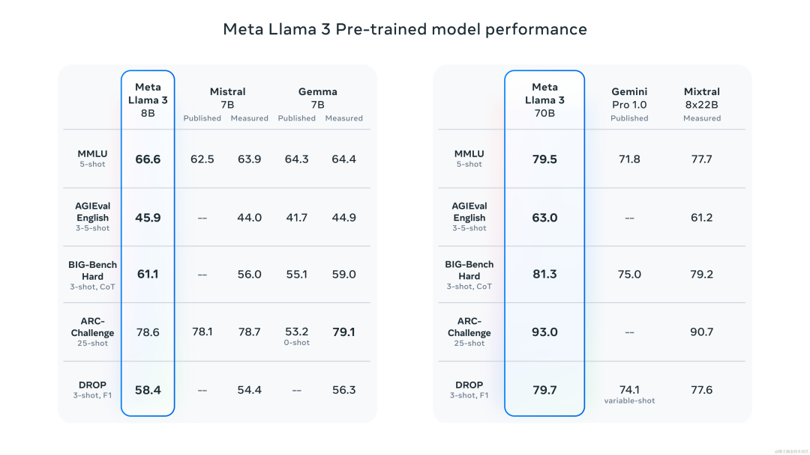
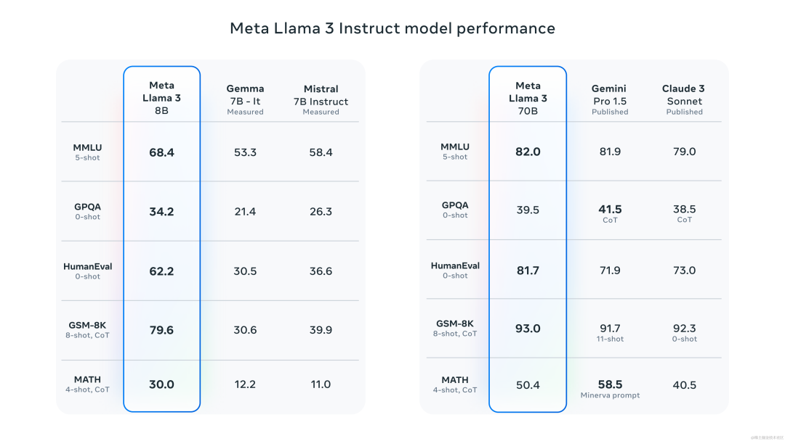
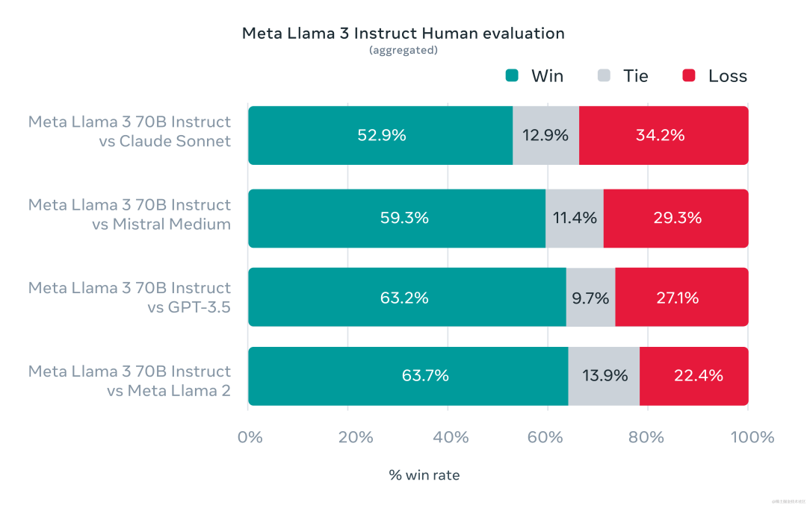
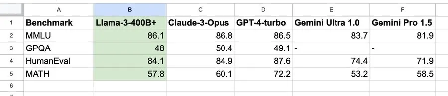

# llama 3

## 0.简介

Meta LLaMA3 强势发布，迄今为止功能最强大的公开可用的 LLM。此版本是在 15 万亿个 Token 上预训练的语言模型，具有 8B 和 70B 两种参数规模，可以支持广泛的用户场景，在各种行业基准上取得了最先进的性能，并提供一些了新功能，包括改进的推理能力，这些都是同时期最好的开源模型。除此之外，LLaMA3还有400B参数的模型正在训练中。

## 1.改进亮点

1. **参数规模与模型架构**：Llama 3提供了8B和70B两种参数规模的模型，参数数量的增加使得模型能够捕捉和学习更复杂的语言模式。同时，Llama 3**采用了标准的纯解码器（decoder-only）Transformer架构，并引入了Group Query Attention（GQA）技术**，提高了模型的推理效率和处理长文本的能力。
2. **训练数据集的扩展**：Llama 3的训练数据集比Llama 2大了7倍，包含了超过**15万亿个token**，其中包括4倍的代码数据，这使得Llama 3在理解和生成代码方面更加出色。
3. **性能提升**：通过改进的预训练和后训练过程，Llama 3在减少错误拒绝率、提升响应对齐和增加模型响应多样性方面取得了显著进步。
4. **安全性增强**：引入了Llama Guard 2等新的信任和安全工具，以及Code Shield和CyberSec Eval 2，增强了模型的安全性和可靠性。
5. **多语言支持**：Llama 3在预训练数据中加入了超过30种语言的高质量非英语数据，为未来的多语言能力打下了基础。

|         | **训练数据**    | **模型参数** | **上下文长度** | **GQA** | **训练Token数** | **知识截止**    |
| ------- | ----------- | -------- | --------- | ------- | ------------ | ----------- |
| Llama 3 | 公开在线数据的新组合。 | 8B       | 8k        | Yes     | 15T+         | 2023 年 3 月  |
|         | 公开在线数据的新组合。 | 70B      | 8k        | Yes     | 15T+         | 2023 年 12 月 |

> 注意：训练Token数仅指预训练数据。

## 2.模型架构

### 2.1 通用GPT架构

主流的大语言模型都采用了Transformer\[架构，它是一个基于多层自注意力（Self-attention）的神经网络模型。

原始的Transformer由编码器（Encoder）和解码器（Decoder）两个部分构成，同时，这两个部分也可以独立使用。例如基于编码器的BERT 模型和基于解码器的GPT模型。

Llama模型与GPT类似，也是采用了基于解码器的架构。在原始Transformer解码器的基础上，Llama进行了如下改动：

- 为了增强训练稳定性，采用前置的\*\*RMSNorm \*\*作为层归一化方法。
- 为了提高模型性能，采用\*\*SwiGLU \*\*作为激活函数。
- 为了更好地建模长序列数据，采用\*\*RoPE \*\*作为位置编码。
- 为了平衡效率和性能，部分模型采用了分组查询注意力机制 **（Grouped-Query Attention, GQA）**。

具体来说，首先将输入的token序列通过词嵌入（word embedding）矩阵转化为词向量序列。然后，词向量序列作为隐藏层状态依次通过𝐿个解码器层，并在最后使用RMSNorm进行归一化。归一化后的隐藏层状态将作为最后的输出。

在每个解码器层中，输入的隐藏层状态首先通过RMSNorm归一化然后被送入注意力模块。注意力模块的输出将和归一化前的隐藏层状态进行残差连接。之后，新的隐藏层状态进行RMSNorm归一化，然后被送入前馈网络层。类似地，前馈网络层的输出同样进行残差连接，作为解码器层的输出。

### 2.2 llama3改进

1. **解码器架构**：Llama 3采用了解码器架构，这是一种标准的Transformer模型架构，主要用于处理自然语言生成任务。
2. **分词器和词汇量**：Llama 3使用了具有**128K**个token的分词器，这使得模型能够更高效地编码语言，从而显著提升性能。
3. **分组查询注意力（GQA）**：为了提高推理效率，Llama 3在8B和70B模型中都采用了**GQA技术**。这种技术通过将注意力机制中的查询分组，减少了计算量，同时保持了模型的性能。
4. **长序列处理**：Llama 3支持长达**8,192**个token的序列，使用掩码（masking）技术确保自注意力（self-attention）不会跨越文档边界，这对于处理长文本尤其重要。
5. **预训练数据集**：Llama 3在超过**15TB**的token上进行了预训练，这个数据集不仅规模巨大，而且质量高，为模型提供了丰富的语言信息。
6. **多语言数据**：为了支持多语言能力，Llama 3的预训练数据集包含了超过5%的非英语高质量数据，涵盖了超过30种语言。
7. **数据过滤和质量控制**：Llama 3的开发团队开发了一系列数据过滤管道，包括启发式过滤器、NSFW过滤器、语义去重方法和文本分类器，以确保训练数据的高质量。
8. **扩展性和并行化**：Llama 3的训练过程中采用了数据并行化、模型并行化和流水线并行化，这些技术的应用使得模型能够高效地在大量GPU上进行训练。
9. **指令微调（Instruction Fine-Tuning）**：Llama 3在预训练模型的基础上，通过指令微调进一步提升了模型在特定任务上的表现，如对话和编程任务。

## 3.数据工程

LLaMA3 使用了超过 \*\*15T \*\*的 Tokens 进行预训练，这数据全部从公开来源收集。训练数据集比 LLaMA2 使用的数据集大七倍，并且包含四倍多的代码。并且 LLaMA3 预训练数据集中有超过 5% 的数据由涵盖 30 多种语言的高质量非英语数据组成。

为了确保 LLaMA3 接受最高质量数据的训练，**开发了一系列数据过滤pipeline**。这些流水线包括使用**启发式过滤器、NSFW 过滤器、语义重复数据删除和文本分类器来预测数据质量**。发现前几代 LLaMA 非常擅长识别高质量数据，因此**使用 LLaMA2 作为文本质量分类器生成训练数据为 LLaMA3 提供支持**。

此外，还进行了广泛的实验，以评估在最终预训练数据集中混合不同来源的数据的最佳方法。这些实验使我们能够选择一个数据组合，确保 LLaMA3 在各种场景（包括编码、历史知识等）中表现良好。

## 4.训练方法

与Llama-2类似，Llama-3系列也有两个模型——预训练模型Llama-3和微调后的模型Llama-3-Instruct。

在预训练阶段，为了有效地利用预训练数据，Llama-3投入了大量精力来扩大预训练。具体而言，通过为下游基准测试制定一系列**扩展法则（scaling laws）**，使得在训练之前就能预测出模型在关键任务上的性能，进而**选择最佳的数据组合**。

在这一过程中，Llama-3对扩展法则有了一些新的观察。例如，根据DeepMind 团队提出的Chinchilla 扩展法则，**8B模型的最优训练数据量约为200B token，但实验发现，即使训练了两个数量级的数据后，模型性能仍在继续提高**。在多达15T token上进行训练后，8B和70B参数的模型都继续以**对数线性**的方式提升性能。

为了训练最大的 LLaMA3 模型，**结合了三种类型的并行策略**：数据并行、模型并行和流水线并行。当同时在 16K GPU 上进行训练时，最高效可实现每个 GPU 超过 400 TFLOPS 的计算利用率。

为了最大限度地延长 GPU 的正常运行时间，开发了一种**先进的训练堆栈**，可以自动执行错误检测、处理和维护。同时，还极大地改进了硬件可靠性和静默数据损坏检测机制，开发了新的可扩展存储系统，以减少检查点和回滚的开销。这些改进使总体有效训练时间超过 95%。综合起来，这些改进使 LLaMA3 的训练效率比 LLaMA2 提高了约三倍。

## 5.指令微调优化

为了充分释放预训练模型在聊天场景中的潜力，还对指令微调方法进行了创新。后训练方法是**监督微调（SFT）、拒绝采样、近端策略优化（PPO）和直接策略优化（DPO）的组合**。SFT 中使用的提示质量以及 PPO 和 DPO 中使用的偏好排名对对齐模型的性能有着巨大的影响。在模型质量方面的一些最大改进来自于仔细整理这些数据并对人类标注者提供的标注进行多轮质量保证。

通过 PPO 和 DPO 从偏好排名中学习也极大地提高了 LLaMA3 在推理和编码任务上的性能。我们发现，如果你向模型提出一个它难以回答的推理问题，该模型有时会产生正确的推理轨迹：模型知道如何产生正确的答案，但不知道如何选择它。对偏好排名的训练使模型能够学习如何选择它。

## 6.性能

### 6.1 预训练模型性能

在众多基准测试中，8B模型超越了Mistral 7B和Gemma 7B，70B模型则战胜了Gemini Pro 1.0和Mixtral 8x22B。

### 6.2 指令微调模型性能

Meta官方数据显示，在各自参数规模上，Llama-3 8B和70B版本都取得了不错的成绩。8B模型在众多基准测试中均胜过Gemma 7B和Mistral 7B Instruct，而70B模型超越了闭源模型Claude 3 Sonnet，对比谷歌的Gemini Pro 1.5性能也是相当。

### 6.3 人工评估结果

在 Llama 3 的开发过程中，研究了标准基准上的模型性能，并寻求优化现实场景的性能。为此，**开发了一套新的高质量人类评估集**。该评估集包含 1800 个提示，涵盖 12 个关键用例：寻求建议、头脑风暴、分类、封闭式问答、编码、创意写作、抽取、扮演一个角色/人物、开放式问答、推理、重写和总结。为了防止模型在此评估集上意外过度拟合，即使我们自己的建模团队也无法访问它。

下图显示了针对 Claude Sonnet、Mistral Medium 和 GPT-3.5 对这些类别和提示进行人工评估的汇总结果。

## 7.LLaMA3-400B 正在训练中

LLaMA3 最大的模型有超过 400B 个参数，但该模型仍在训练中。基于 LLaMA3-400B 的早期检查点的性能测试如下：

值得注意的是，根据英伟达科学家Jim Fan的整理，Llama3 400B基本逼近Claude-3-Opus和GPT-4-turbo，这将意味着开源社区即将迎来GPT-4级大模型。

