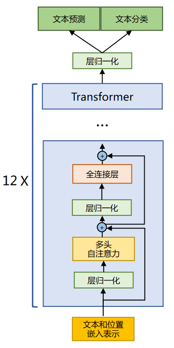
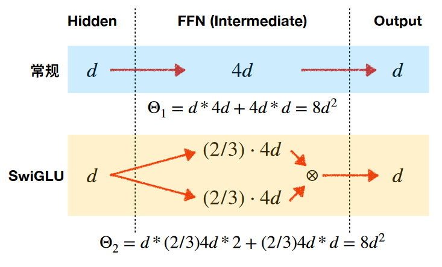
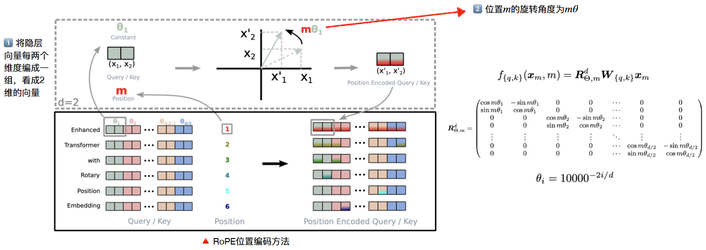
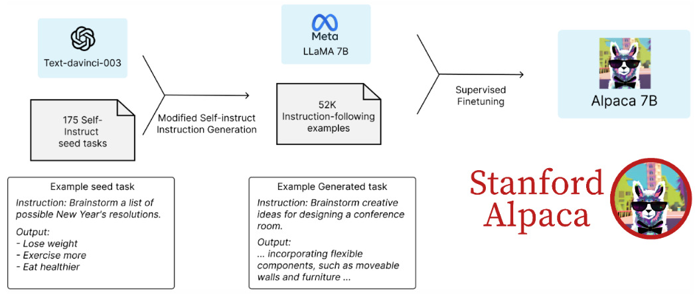

# llama系列模型

# 1.LLama

## 1.1 简介

Open and Efficient Foundation Language Models (Open但没完全Open的LLaMA)&#x20;

2023年2月，Meta（原Facebook）推出了LLaMA大模型，使用了1.4T token进行训练，虽然最大模型只有65B，但在相关评测任务上的效果可以媲美甚至超过千亿级大模型，被认为是近期开源大模型百花⻬放的开端之一，“羊驼”系列模型及其生态快速发展。

LLaMA 所采用的 Transformer 结构和细节，与标准的 Transformer 架构不同的地方包括采用了**前置层归一化（Pre-normalization）**并使用 **RMSNorm 归一化函数** （Normalizing Function）、激活函数更换为** SwiGLU**，并使用了**旋转位置嵌入（RoP）**，整体 Transformer 架构与 GPT-2 类似。



## 1.2 RMSNorm归一化函数

**为了使得模型训练过程更加稳定**，GPT-2 相较于 GPT 就引入了**前置层归一化方法**，将第一个层归一化移动到多头自注意力层之前，第二个层归一化也移动到了全连接层之前，同时残差连接的位置也调整到了多头自注意力层与全连接层之后。层归一化中也采用了 **RMSNorm 归一化函数**。 针对输入向量 RMSNorm 函数计算公式如下

$$
R M S(a)=\sqrt{\frac{1}{n} \sum_{i=1}^{n} a_{i}^{2}}
$$

$$
\bar{a}_{i}=\frac{a_{i}}{R M S(\boldsymbol{a})}
$$

此外，RMSNorm 还可以引入可学习的缩放因子 $g_
i $和偏移参数 $b_i$，从而得到 $\bar{a}_{i}=\frac{a_{i}}{\operatorname{RMS}(\boldsymbol{a})} g_{i}+b_{i}$。 RMSNorm 在 HuggingFace Transformer 库中代码实现如下所示：

```python
class LlamaRMSNorm(nn.Module):
  def __init__(self, hidden_size, eps=1e-6): 
    """ 
    LlamaRMSNorm is equivalent to T5LayerNorm 
    """ 
    super().__init__() 
    self.weight = nn.Parameter(torch.ones(hidden_size)) 
    self.variance_epsilon = eps # eps 防止取倒数之后分母为 0 
  
  def forward(self, hidden_states): 
    input_dtype = hidden_states.dtype 
    variance = hidden_states.to(torch.float32).pow(2).mean(-1, keepdim=True) 
    hidden_states = hidden_states * torch.rsqrt(variance + self.variance_epsilon) # weight 是末尾乘的可训练参数, 即 g_i 
    
    return (self.weight * hidden_states).to(input_dtype)
```

## 1.3 SwiGLU激活函数

SwiGLU激活函数是相较于 ReLU 函数在大部分评测中都有不少提升。在 LLaMA 中全连接层 使用带有 SwiGLU 激活函数的 FFN（Position-wise Feed-Forward Network）的计算公式如下：

$$
\operatorname{FFN}_{\text {SwiGLU }}\left(\boldsymbol{x}, \boldsymbol{W}, \boldsymbol{V}, \boldsymbol{W}_{2}\right)=\operatorname{SwiGLU}(\boldsymbol{x}, \boldsymbol{W}, \boldsymbol{V}) \boldsymbol{W}_{2}
$$

$$
\operatorname{SwiGLU}(\boldsymbol{x}, \boldsymbol{W}, \boldsymbol{V})=\operatorname{Swish}_{\beta}(x \boldsymbol{W}) \otimes \boldsymbol{x} \boldsymbol{V}
$$

$$
\operatorname{Swish}_{\beta}(\boldsymbol{x})=\boldsymbol{x} \sigma(\boldsymbol{\beta} \boldsymbol{x})
$$

其中，$σ(x)$ 是 Sigmoid 函数。下图给出了 Swish 激活函数在参数 $β$ 不同取值下的形状。可以看 到当 $β$ 趋近于 0 时，Swish 函数趋近于线性函数 $y = x$，当 $β $趋近于无穷大时，Swish 函数趋近于 ReLU 函数，$β$ 取值为 1 时，Swish 函数是光滑且非单调。在 HuggingFace 的 Transformer 库中 Swish1 函数使用 silu 函数代替。




LLaMA中直接将FFN中的ReLU替换为SwiGLU，并将维度放缩为$(2/3) ⋅ 4d$

## 1.4 旋转位置嵌入（RoPE）

在位置编码上，使用旋转位置嵌入（Rotary Positional Embeddings，RoPE）代替原有的绝 对位置编码。RoPE 借助了**复数的思想**，出发点是**通过绝对位置编码的方式实现相对位置编码**。其目标是通过下述运算来给 `q`，`k` 添加绝对位置信息：

$$
\tilde{\boldsymbol{q}}_{m}=f(\boldsymbol{q}, m), \tilde{\boldsymbol{k}}_{n}=f(\boldsymbol{k}, n)
$$

经过上述操作后，$\tilde{\boldsymbol{q}}_{m}$和$\tilde{\boldsymbol{k}}_{n}$就带有位置m和n的绝对位置信息。

最终可以得到二维情况下用复数表示的 RoPE：

$$
f(\boldsymbol{q}, m)=R_{f}(\boldsymbol{q}, m) e^{i \Theta_{f}(\boldsymbol{q}, m)}=\|\boldsymbol{q}\| e^{i(\Theta(\boldsymbol{q})+m \theta)}=\boldsymbol{q} e^{i m \theta}
$$

根据复数乘法的几何意义，上述变换实际上是对应向量旋转，所以位置向量称为“旋转式位置编 码”。还可以使用矩阵形式表示

$$
f(\boldsymbol{q}, m)=\left(\begin{array}{cc}\cos m \theta & -\sin \cos m \theta \\ \sin m \theta & \cos m \theta\end{array}\right)\left(\begin{array}{l}\boldsymbol{q}_{0} \\ \boldsymbol{q}_{1}\end{array}\right)
$$

根据内积满足线性叠加的性质，任意偶数维的 RoPE，都可以表示为二维情形的拼接，即：

$$
f(\boldsymbol{q}, m)=\underbrace{\left(\begin{array}{ccccccc}\cos m \theta_{0} & -\sin m \theta_{0} & 0 & 0 & \cdots & 0 & 0 \\ \sin m \theta_{0} & \cos m \theta_{0} & 0 & 0 & \cdots & 0 & 0 \\ 0 & 0 & \cos m \theta_{1} & -\sin m \theta_{1} & \cdots & 0 & 0 \\ 0 & 0 & \sin m \theta_{1} & \cos m \theta_{1} & \cdots & 0 & 0 \\ \cdots & \cdots & \cdots & \cdots & \ddots & \cdots & \cdots \\ 0 & 0 & 0 & 0 & \cdots & \cos m \theta_{d / 2-1} & -\sin m \theta_{d / 2-1} \\ 0 & 0 & 0 & 0 & \cdots & \sin m \theta_{d / 2-1} & \cos m \theta_{d / 2-1}\end{array}\right)}_{\boldsymbol{R}_{d}}\left(\begin{array}{c}\boldsymbol{q}_{0} \\ \boldsymbol{q}_{1} \\ \boldsymbol{q}_{2} \\ \boldsymbol{q}_{3} \\ \cdots \\ \boldsymbol{q}_{d-2} \\ \boldsymbol{q}_{d-1}\end{array}\right)
$$



RoPE 在 HuggingFace Transformer 库中代码实现如下所示：

```python
import torch

def precompute_freqs_cis(dim: int, end: int, constant: float = 10000.0):
    '''
    计算cos和sin的值，cos值在实部，sin值在虚部，类似于 cosx+j*sinx
    :param dim: q,k,v的最后一维，一般为emb_dim/head_num
    :param end: 句长length
    :param constant： 这里指10000
    :return:
    复数计算 torch.polar(a, t)输出， a*(cos(t)+j*sin(t))
    '''
    # freqs: 计算 1/(10000^(2i/d) )，将结果作为参数theta
    # 形式化为 [theta_0, theta_1, ..., theta_(d/2-1)]
    freqs = 1.0 / (constant ** (torch.arange(0, dim, 2)[: (dim // 2)].float() / dim)) # [d/2]

    # 计算m
    t = torch.arange(end, device=freqs.device)  # [length]
    # 计算m*theta
    freqs = torch.outer(t, freqs).float()  # [length, d/2]
    # freqs形式化为 [m*theta_0, m*theta_1, ..., m*theta_(d/2-1)],其中 m=0,1,...,length-1

    # 计算cos(m*theta)+j*sin(m*theta)
    freqs_cis = torch.polar(torch.ones_like(freqs), freqs)  # complex64
    # freqs_cis: [cos(m*theta_0)+j*sin(m*theta_0),  cos(m*theta_1)+j*sin(m*theta_1),), ..., cos(m*theta_(d/2-1))+j*sin(m*theta_(d/2-1))]
    # 其中j为虚数单位， m=0,1,...,length-1
    return freqs_cis # [length, d/2]

def reshape_for_broadcast(freqs_cis: torch.Tensor, x: torch.Tensor):
    ndim = x.ndim
    assert 0 <= 1 < ndim
    assert freqs_cis.shape == (x.shape[1], x.shape[-1])
    shape = [d if i == 1 or i == ndim - 1 else 1 for i, d in enumerate(x.shape)] # (1, length, 1, d/2)
    return freqs_cis.view(*shape) # [1, length, 1, d/2]

def apply_rotary_emb(xq: torch.Tensor, xk: torch.Tensor, freqs_cis: torch.Tensor,):
    # 先将xq维度变为[bs, length, head,  d/2, 2], 利用torch.view_as_complex转变为复数
    # xq:[q0, q1, .., q(d-1)] 转变为 xq_: [q0+j*q1, q2+j*q3, ..., q(d-2)+j*q(d-1)]
    xq_ = torch.view_as_complex(xq.float().reshape(*xq.shape[:-1], -1, 2)) # [bs, length, head, d/2]
    # 同样的，xk_:[k0+j*k1, k2+j*k3, ..., k(d-2)+j*k(d-1)]
    xk_ = torch.view_as_complex(xk.float().reshape(*xk.shape[:-1], -1, 2))

    freqs_cis = reshape_for_broadcast(freqs_cis, xq_) # [1, length, 1, d/2]
    # 下式xq_ * freqs_cis形式化输出，以第一个为例, 如下
    # (q0+j*q1)(cos(m*theta_0)+j*sin(m*theta_0)) = q0*cos(m*theta_0)-q1*sin(m*theta_0) + j*(q1*cos(m*theta_0)+q0*sin(m*theta_0))
    # 上式的实部为q0*cos(m*theta_0)-q1*sin(m*theta_0)，虚部为q1*cos(m*theta_0)+q0*sin(m*theta_0)
    # 然后通过torch.view_as_real函数，取出实部和虚部，维度由[bs, length, head, d/2]变为[bs, length, head, d/2, 2]，最后一维放实部与虚部
    # 最后经flatten函数将维度拉平，即[bs, length, head, d]
    # 此时xq_out形式化为 [实部0，虚部0，实部1，虚部1，..., 实部(d/2-1), 虚部(d/2-1)]
    xq_out = torch.view_as_real(xq_ * freqs_cis).flatten(3) # [bs, length, head, d]
    # 即为新生成的q

    xk_out = torch.view_as_real(xk_ * freqs_cis).flatten(3)
    return xq_out.type_as(xq), xk_out.type_as(xk)

if __name__=='__main__':
    # (bs, length, head, d)
    q = torch.randn((2, 10, 12, 32))  # q=[q0, q1, .., qd-1]
    k = torch.randn((2, 10, 12, 32))
    v = torch.randn((2, 10, 12, 32))
    freqs_cis= precompute_freqs_cis(dim=32, end=10, constant= 10000.0)
    # print(freqs_cis.detach().numpy())

    q_new, k_new = apply_rotary_emb(xq=q, xk=k, freqs_cis=freqs_cis)
    print()

```

# 2.Alpaca

## 2.1 简介

Stanford Alpaca: An Instruction-following LLaMA Model

Alpaca是在**LLaMA基础上使用52K指令数据精调的预训练模型**，作者只用了不到600美元的成本训练出了该模型（数据\$500 + 机器\$100）。初步实验结果表明Alpaca可以达到与OpenAI text-davinci-003相匹敌的效果

## 2.2 微调方法

1. 第一步：构造175条self-instruct 种子示例任务
2. 第二步：基于上述种子任务，利 用text-davinci-003爬取指令数据
3. 第三步：使用爬取下来的52K指令 数据在LLaMA上进行精调，最终 得到Alpaca



## 2.3 Self-instruct数据构造

首先由人工构造175条种子数据

```json
{
  "id": "seed_task_25", 
  "name": "perfect_numbers", 
  "instruction": "Find the four smallest perfect numbers.", 
  "instances": [{ "input": "", "output": "6, 28, 496, and 8128”}], 
  "is_classification": false
}
```

将“爬取要求”和种子数据进行适当组合，送入textdavinci-003，要求生成类似的指令数据。要求包括：提升指令多样性、包含真实数据、字数 要求、语言要求、拒绝不合适指令等

## 2.4 指令数据格式

- `instruction`: 描述模型需要执行的指令内容
- `input`（可选）: 任务上下文或输入信息，例如当指令是“对文章进行总结”，则input是文章内容
- `output`: 由text-davinci-003生成的针对指令的回复


# 3.Llama-2

## 3.1 简介

Llama 2: Open Foundation and Fine-Tuned Chat Models&#x20;

2023年7月，Meta推出了Llama-2开源大模型，并且推出了Llama-2-Chat对话模型

与一代LLaMA主要区别体现在**更多的训练数据、更⻓的上下文窗口、GQA技术**等


模型结构的变动主要是体现在**GQA**和**FFN**缩放上

- **MHA改成GQA**：整体参数量会有减少
- **FFN模块矩阵维度有扩充**：增强泛化能力，整体参数量增加
- **上下文长度是llama两倍**(长度从2048->4096) 训练语料增加约 40%，体现在1.4T->2.0T的Tokens llama2-34B和llama2-70B使用了GQA，加速模型训练和推理速度

## 3.2 GQA

GQA和MQA都是注意力的变体，其中多个查询头关注相同的键和值头，以减少推理过程中 KV 缓存的大小，并可以显著提高推理吞吐量。

MHA、GQA、MQA的区别和联系，具体的优点如下：

- `Mutil-Head Attention` 因为自回归模型生成回答时，需要前面生成的KV缓存起来，来加速计算。
- `Multi-Query Attention` 多个头之间可以共享KV对，因此速度上非常有优势，实验验证大约减少30-40%吞吐。
- `Group Query Attention` 没有像MQA那么极端，将query分组，组内共享KV，效果接近MQA，速度上与MQA可比较。


Llama-2中使用了8个KV映射，即GQA-8，**GQA在多数任务上与MHA效果相当，且平均效果优于MQA；GQA和MQA均比MHA有更好的吞吐量**

## 3.3 源码


# 4.Code Llama

## 4.1 简介

2023年8月24日，Meta推出了面向代码的可商用大模型Code Llama，包含三个大小版本（7B/13B/34B）

支持多种编程语言，包括Python、C++、Java、PHP、Typescript (Javascript)、C#和Bash

亮点：

- 免费供学术研究和商用
- 支持100K上下文
- “神秘”34B版接近GPT-4效果

## 4.2 模型训练流程


## 4.3 Code Infilling Task （7B/13B only）

任务目标：根据代码的上下文，预测残缺部分的代码

方法：

- 从完整的代码中选择一部分进行掩码（mask）并替换为`<MASK>`符号，构成上下文
- 利用自回归的方法，根据上下文信息预测解码出被mask的代码部分


# 5.总结

**LLaMA**&#x20;

- 开源大模型繁荣发展的开端，一系列相关工作均基于LLaMA开展
- 模型规模7B、13B、33B、65B满足了开发者和研究者的不同需求

**Alpaca**：通过少量的指令精调赋予LLaMA指令理解与执行的能力

**Llama-2**

- LLaMA的二代模型，相关模型性能进一步提升，模型可商用
- 推出官方对⻬的Chat版本模型，采用了完整的RLHF链条

**Code Llama**：专注于代码能力的LLaMA模型，最好的模型代码能力接近GPT-4效果，模型可商用
