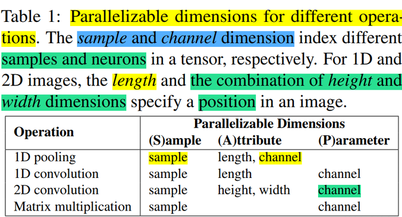
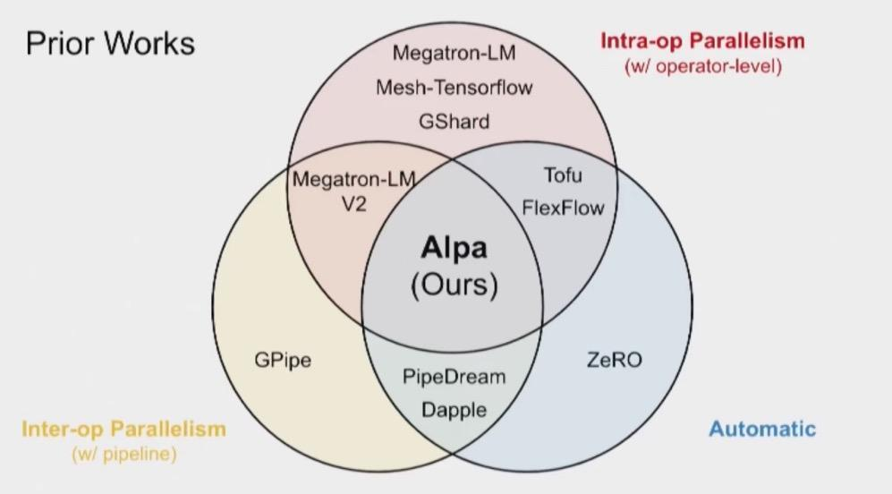

# 7.自动并行

### 1.**简述**

自动并行的目标就是**用户给定一个模型和所使用的机器资源后，能够自动地帮用户选择一个比较好或者最优的并行策略来高效执行**。可以说，自动并行是分布式并行的终极目标，它能够解放工程师去手动设置分布式并行策略。

而自动并行可以分为**全自动并行**和**半自动并行**模式。

-   **半自动模式**下用户可以根据自己需要指定某些tensor和operator的切分方式。如：Mesh-TensorFlow、GShard、GSPMD 等提到的自动并行切分方案。
-   **全自动模式**下所有 tensor 和 operator 都由框架自适应选择最优切分策略。如：OptCNN、Flexflow、Unity、Alpa 等提到的全自动并行切分方案。

目前，很多的通用AI框架（如：PaddlePaddle、OneFlow、PyTorch、MindSpore、TensorFlow、JAX等）都对自动并行(全自动或半自动)进行了实现。

下面将分享一些典型的分布式训练自动并行方案。

### 2.**Mesh-TensorFlow**

#### 2.1 **背景**

在深度学习中，由于数据量和计算量的庞大，往往会使用到分布式计算。而最常用的分布式模式是SPMD(Single-Program-Multiple-Data)，即数据并行，这种模式相当于在数据的batch维去做拆分；然后，进行并行。Mesh-Tensorflow对这种模式做了泛化，即**除了batch维外的其他维度也可做并行**。

#### 2.2 **SPMD 的 batch 切分**

首先，回顾下之前的数据并行，每个设备上都有全部模型参数的备份，在每一次迭代中，数据首先被切分分发到各个设备上；然后，各个设备分别进行计算，得到的梯度再通过AllReduce进行聚合，然后再更新参数。

#### 2.3 **Mesh-tensorflow 的切分**

分布式依赖的是数据分发和聚合，这点上面讲解的batch切分也是，但 Mesh-tensorflow 做了更泛化的抽象。

-   让Tensor的每一个维度都有名字。比如：如果每个样本都是一个向量，那么每次训练的输入x的维度就是`[batch, d_io]`。
-   类似的，**把处理器集群也表示成一个矩阵**，比如：一个二维的结构，表示成`[rows, cols]`。
-   定义一个computation layout，这个layout是从tensor维度到集群维度的一个二分图映射。例如，上面的batch切分可以表达为`[("batch", "all_processors")]`。

#### 2.4 **Mesh-tensorflow 实现**

每个操作都通过并行计算和 collective communication 来完成，这里，我们介绍几个 Mesh-Tensorflow 中比较重要的操作。

-   **Component-wise Operations**: 所谓的component-wise，就是指输入和输出的维度相同。这一类的操作可以直接分布式的进行。
-   **Reduction(reduce\_sum, reduce\_max, etc)**: Reduction操作是指会消减维度的操作，这一类操作可以先在每个切片上操作，然后用MPI-allreduce来聚合。
-   **Einstin Summation(max multiplication, etc)**: Einstin操作是一组矩阵计算的统称，在 TensorFlow 中被实现成了一个可以配置的API，配置的方式就是用维度的名字来表达计算，这点其实和 Mesh-Tensorflow 异曲同工，所以可以很方便的实现。同样的，实现的方式就是先本地计算，然后再 MPI-AllReduce 。
-   **Reshape**: Reshape虽然简单，但是在分布式环境下却需要网络通信才能完成，不同的reshape需要的操作不同，涉及到的MPI通信包括MPI-allgather，MPI-alltoall等。

#### 2.5 **小结**

Mesh-Tensorflow 定义了一套DSL语法，用于描述模型的维度和布局，你用它重写你的整个Model后，它自动帮你把模型和数据分割到多个TPU上。

另外，Mesh-Tensorflow 没有实现并行的卷积操作，因此，只适合 Language Model 这个领域。

除此之外，需要用 Mesh-Tensorflow 的语法重写你的整个模型，仔细思考维度，不仅工作量大，同时对代码侵入性强。

不同的 layout 会带来不同的性能，因此，可以考虑自动搜索最优的layout，但 Mesh-Tensorflow不支持。

### 3.**GSPMD**

通过扩大模型可以提高模型精度，扩展模型的应用范围。但这些模型往往需要在多个device上训练，产生了一些并行训练需求，如：数据并行（分割训练数据）、流水线并行（分割计算图），张量模型并行（分割每个模型层的权重和计算）。而 GSPMD 提出了一种基于 **tensor sharding annotations** 的系统，以一种统一的方法去表示不同的并行策略，包括上面提到的方法以及一些新的并行方法，如： image spatial partitioning（一种沿空间维度分割图像输入数据的技术，它有助于在内存容量有限的设备上拟合大型图像数据）和 weight-update/optimizer-state sharding（对数据并行的一种增强）。

#### 3.1 **GSPMD 简介**

上面提到 GSPMD 基于 **tensor sharding annotations** 的系统，以一种统一的方法去表示不同的并行策略。

尽管流水线并行对图进行了划分，而不是对单个运算符/张量进行了划分，但 GSPMD 仍然可以在一个简单的包装库的帮助下实现，该包装库将流水线划分简化为一个张量/运算符划分问题。

GSPMD 有足够的灵活性来表达这些方法的组合，例如：不同的层可以用不同的方法进行分区，不同的方法可以在同一层中进行组合。

GSPMD 分离了机器学习模型编程和并行的问题。它允许用户用巨大的张量编写程序，就像有一个单一的巨大设备一样。然后，用户可以在一些地方插入注解，指定张量如何在设备间分布；GSPMD将在编译器pass执行，在整个计算图上完成分片规范，并将其转化为数学上等价的并行计算，在每个设备上运行。

这使得用户可以专注于模型的建立，而不是分片的实现，并且可以轻松地将现有的单设备程序移植到更大的规模上运行。为了实验不同的分片策略，只需注解重新配置即可。

GSPMD 解决了将自动分区应用于生产模型时的几个实际问题：

-   为每个分区生成一个程序会大大增加编译时间，所以 GSPMD 为所有分区生成一个程序。这一特性被称为单程序多数据(SPMD)，对于扩展到数以千计的分区至关重要。
-   GSPMD 支持不均匀分割的维度，使任何张量都可以在任意设备网格上进行分割。为了方便开发，加速器在编译时要求静态已知的形状，这通常是一个实际的限制。尽管支持不均匀的分片，GSPMD 与这种约束是兼容的。
-   GSPMD 作为 Production ML 编译器 XLA 的一个扩展来实现。该实现涵盖了 XLA 中的全部运算符，包括那些具有复杂语义的运算符，如卷积。XLA 是对多个框架(TensorFlow，Jax，Pytorch和Julia)和硬件平台(CPU，GPU和TPU)的统一抽象，使 GSPMD 可以重复使用。
-   GSPMD支持嵌套的并行模式；在per-operator层面，这意味着不同类型的维度可以在正交的device mesh中进行划分。GSPMD 已经为这种嵌套模式开发了一种递归方法，最大限度地提高了 GSPMD 的通用性，而不需要过多的手写分片规则.

#### 3.2 **GSPMD 张量分片和自动完成**

GSPMD 为张量分片定义了一套直观且通用的表示。遵循分离设计的理念，GSPMD 有两个独立的编译器转换：sharding completion 和 per-operator partitioning。

GSPMD 具有一种机制，允许高级用户通过在子图中输入手动分区模式来精确控制子图的分区方式。 在这个子图中，用户用分片大小的形状编写程序； 在子图之外，程序仍然由编译器自动分区，并且有专门的转换节点在模式之间进行切换。

为了让 GSPMD 仍然可以对其他维度进行分区以实现数据或层内模型并行，GSPMD 扩展了手动模式以支持类似于部分复制的子组，即子组内的设备手动分区，而子组之间的设备自动分区。 在这种情况下，用作流水线阶段（stages）的设备组是手动子组。

GSPMD 根据有限的用户注解自动完成每个张量的分片。它是作为 XLA 中的编译器pass实现的。

#### 3.3 **GSPMD SPMD 分片**

在实现 Partitioner 时有两个选项：

-   为每个Partitioner创建自定义程序（多个程序多份数据，MPMD）
-   创建一个程序适用于所有Partitioner（单个程序多份数据，SPMD）

GSPMD 选择 SPMD 是因为我们的目标是扩展到数千个 Partitioner，而在 MPMD 中，编译程序会变得非常慢。编译时间是一个重要的可用性问题，因为现代ML框架通常包括JIT优化和编译，特别是对于那些针对自定义加速器的框架。并行化编译可能不简单，因为不同程序中的操作符可能需要全局调度以维护正确的通信顺序。

但在 SPMD 中实现Partitioner同样会给生产ML编译器带来了独特的挑战。因此，GSPMD针对SPMD分区所面临的挑战提出了一系列解决这些问题的技术。

#### 3.4 **小结**

总之，GSPMD 提出了一种基于编译器的、自动的、通用机器学习并行系统。它是一种半自动并行，用户手动配置部分的并行操作，然后它会对并行策略进行传播得到完成的并行策略。

### 4.**Flexflow**

#### 4.1 **背景**

现有的深度神经网络训练通常需要使用数据并行或模型并行。但是这些策略在并行程度上通常无法达到最优。因此，本文定义了**一个 DNN 并行策略搜索空间（SOAP）**，其中，包括在Sample、Operator、Attribute和Parameter维度中并行 DNN 的策略；同时，本文还提出了 FlexFlow，这是一种深度学习框架，它使用 SOAP 空间的引导随机搜索来寻找针对特定的并行机器的快速的并行策略。

为了加速这种搜索，FlexFlow 引入了一种新颖的执行模拟器（execution simulator），它可以准确预测并行策略的性能，并且比之前直接执行每个策略的方法快三个数量级。

#### 4.2 **SOAP 搜索空间**

下面来看看 DNN 并行策略的 SOAP 搜索空间。为了跨设备并行化 DNN 算子，我们要求每个设备计算operation输出张量的不相交子集。 因此，我们通过定义 oi 的输出张量如何分区来对 operation oi 的并行进行建模。

下图展示了一些算子样例的并行维度：



下图展示了一个矩阵乘法运算的并行配置示例：


总之，SOAP 维度的切分，是针对op的output tensor来切分的，选择了output tensor的多个维度：

-   Sample：表示 input 的 batch 维。
-   Attribute：表示 tensor 的属性维，例如：height/width。
-   Parameter：表示 tensor 的 param 维，例如：in-channel/out-channel。
-   Operator：表示 op 之间的切分维度。

虽然把 tensor 分成了多个维度，实际上都是属于 tensor 本身的维度。

#### 4.3 **FlexFlow 整体框架**

FlexFlow 根据计算图和设备拓扑自动寻找并行策略。与现有框架相比，FlexFlow有两个优势：

-   **可编程性**。 对于在具有深度设备拓扑的集群上运行的具有复杂计算图的 DNN 应用程序，应用程序开发人员甚至领域专家都很难手动设计高效的operation分配。 FlexFlow 负责寻找高效的并行策略，并提供更高效的编程接口。
-   **可移植性**。 针对一个集群进行微调的并行策略可能在其他集群上表现不佳。 FlexFlow 的搜索方法会自动为每个硬件配置选择有效的策略，而无需更改应用程序。

FlexFlow 的总体框架如下图所示，其中：

-   Operator Graph：计算图的描述。包括op作为node，tensor作为edge。
-   Device topology：描述实际设备的topo关系，device作为node，connection作为edge。
-   Execution Optimizer：FlexFlow的核心部件，用于搜索最优的split方案，下方是一个运行时（Distributed Runtime），用于执行split方案。


#### 4.4 **执行模拟器（Execution Simulator）**

执行模拟器是FlexFLow中比较核心的部分，负责对提出的策略做评估，得到候选者的性能数据。

这里为了提高评估的速度，没有使用直接执行的方式，而是用模拟执行。还是正常去构建执行timelines，但是需要在device上执行时，直接从上一次执行相同input-size的数据中取得执行时间，这样降低了总体的执行时间。这里是假设op针对相同input-size的执行时间基本不变，而且跟input-data无关。在大多数模型中，这个假设都是成立的。

-   输入：算子计算图G，设备拓扑结构D，并行策略S
-   输出：执行时间
-   simulator的重要假设：
-   1）每个task的执行时间都是可预测的，波动小，与input tensor的内容无关。
-   2）不同设备之间传输数据的时间为**数据大小/带宽**。
-   3）每个设备按照FIFO的顺序执行任务（GPU就是这样的）。
-   4）每个设备在完成一个任务后，只要下一个任务的数据准备就绪就立刻开始执行下一个任务，overhead可忽略不计。

为了模拟一次执行，模拟器首先建立一个Task Graph，然后运行模拟算法。

**任务图（Task Graph）：**

构建任务图时，每个op对应的split都会变成一个normal task。task之间的数据通信作为communication task。

graph的edge表示的是task之间的依赖关系，即计算先后关系，而不是数据流方向。

在构建任务图的时候，就把每个task的execTime填入了。normal task 的 execTime 是在 device 上多次执行的平均耗时，这里 cache 之后，会一直使用。communication task 的 execTime 是用 tensor size / bandwidth 得到。

**模拟算法类型：**

-   全模拟算法 ：首先用 Dijkstra 算法遍历，所有任务都被放到一个队列里，出队列的顺序是按照ready time 的增序。该算法最终返回所有任务中最慢的一个执行完所需时间。
-   Delta 模拟算法：使用一种 MCMC 搜索算法，每次只改变一个 op 的划分方式。这种情况下，前后两个策略的时间通常没有改变。Delta 模拟算法只重新模拟改变最终结果的 op。

对于同样的任务图，full和delta的模拟算法会给出同样的结果。

#### 4.5 **执行优化器（Execution Optimizer）**

执行优化器以运算符图和设备拓扑作为输入，并自动找到有效的并行化策略。

-   输入：算子计算图G，设备拓扑结构D
-   输出：最有效的并行策略

问题抽象为最小化总执行时间，这个方法避免了平衡执行时间和通信时间二者的问题。

FlexFlow 使用模拟器作为预言机，将并行优化问题转化为cost最小化问题，即最小化预测执行时间。 这种方法的主要优点是，它避免了显式地编码相互依赖的优化之间的权衡（例如：减少数据传输与平衡工作负载分布），而只是专注于最小化应用程序的整体执行时间。

通过从最小整体执行时间找到最佳并行化策略是 NP-hard 问题。 可能的策略数量与运算符图中的op数量成指数关系，这使得穷举搜索空间变得困难。

为了找到低成本策略，FlexFlow 使用成本最小化搜索程序来启发式探索空间并返回发现的最佳策略。

#### 4.6 **FlexFlow 运行时环境**

现有的深度学习系统（例如 TensorFlow 、PyTorch 、Caffe2 和 MXNet ）仅支持通过数据并行在batch维度中并行操作，在这些系统中，并行其他维度或多个维度组合的操作并非易事。

为了支持使用并行空间中定义的任何策略并行 DNN 模型，本文在 Legion（论文：**Legion: Expressing locality and independence with logical regions**） 中实现了 FlexFlow 分布式运行时，这是一种用于分布式异构架构的高性能并行运行时，并使用 cuDNN 和 cuBLAS 作为处理 DNN 算子的底层库。

本文使用 Legion 高维分区接口来支持可并行维度的任意组合的并行操作，并使用 Legion 的细粒度控制机制来控制每个算子粒度的并行。

FlexFlow 运行时与现有系统之间的主要区别在于，FlexFlow 支持以可并行维度的任意组合并行算子，并以单个算子的粒度控制并行。

#### 4.7 **小结**

总之，FlexFlow 最核心工作就是提出了 execution simulator 来完善 cost model 。

### 5.**Alpa**

#### 5.1 **背景**

现有的一些方案要么被限制在单个并行方法 (PipeDream)，要么依赖于对模型和集群规格的强假设 (DAPPLE，Tofu)。同时，自动混合并行的搜索空间较复杂，多并行策略的实现不够灵活。除此之外，不同的并行技术是有不同的带宽要求的。

因此，Alpa采用在不同的系统层次使用不同的并行技术，提出了的算子间和算子内并行自动并行方案。

#### 5.2 **Alpa 技术原理**

Alpa提出的算子间、算子内并行划分方法，通过"是否切分了tensor的维度"来区分不同的并行。

-   算子内并行（intra-op）：切分了tensor维度的并行方式，包括数据并行和算子并行（即张量模型并行）。
-   算子间并行（inter-op ）：不切分tensor，只是把子图进行不同的摆放分布，包括流水线并行。

算子内并行可充分利用带宽，切分带来的通信基本属于高效的集合通信。而算子间并行若切点寻找的合适，则通信较小，但同步版本的策略无可避免的会引来 Bubble。所以，可以利用集群的非对称特性，将算子内并行映射到高带宽互联的Devices上；将算子间并行映射到低带宽互联的Devices上。如此组合，就能释放更大的算力，Alpa会自动探索这些策略及组合情况。

Alpa 先通过动态规划（DP）来决定模型怎么切分成 stage，每个 stage 能分到哪些卡。然后在每个 stage 内部，再通过整数线性规划（ILP）的方式来决定每个 op 是如何切分到这个 stage 的多个卡上，这是一个自动优化的过程。


自动分配流水线并行的具体示例如下所示：

```python
alpa.init(cluster="ray")

# 定义并行方法
# `alpa.AutoLayerOption(layer_num=2)` means we use the auto layer construcion
# algorithm to cluster primitive operators into two layers.
# `stage_option="auto"` means we enable the auto stage construction algorithm.
method = alpa.PipeshardParallel(num_micro_batches=16,
                                layer_option=alpa.AutoLayerOption(layer_num=2),
                                stage_option="auto")

# 定义训练Step
@alpa.parallelize(method=method)
def auto_pipeline_train_step(state, batch):

    def loss_func(params):
        out = state.apply_fn(params, batch["x"])
        loss = jnp.mean((out - batch["y"])**2)
        return loss

    # Again, we use `alpa.grad` here to separate the apply gradient stage with
    # the forward/backward stages in the pipeline.
    grads = alpa.grad(loss_func)(state.params)
    new_state = state.apply_gradients(grads=grads)
    return new_state

# 在第一次调用中，alpa 触发编译。编译首先分析成本（cost）并解决优化问题以获得最佳流水线分配。
auto_pipeline_actual_state = auto_pipeline_train_step(state, batch)
assert_allclose(expected_state.params,
                auto_pipeline_actual_state.params,
                atol=5e-3)

alpa.shutdown()
```

在 Alpa 开源仓库中，也提供了基于 OPT 大模型进行自动并行的微调\*\*[案例](https://link.zhihu.com/?target=https://github.com/alpa-projects/alpa/tree/main/examples/opt_finetune "案例")\*\*。

#### 5.3 **Alpa 的执行过程**

Alpa 高度依赖 JAX，它魔改了 XLA （JAX 底层通过 XLA 执行）中的 GSPMD，拿到 XLA 的计算图后，自动对 op 进行切分，生成对应的程序，在每个 worker 上执行。

#### 5.4 **Alpa 的创新之处**

旧有的方案往往焦点在 inter-op，intra-op 和自动并行策略搜索的一个或者两个点，而 Alpa 兼顾了所有；比如：在 GShard 中提出了 intra-op 的方式，GPipe 提出 inter-op 的方式，Megatron-LM v2 则通过结合 inter-op 和 intra-op 的方式，通过人工指定的并行策略来支持分布式训练 GPT 模型。微软 DeepSpeed 提出的 ZeRO 技术试图通过自动的策略，通过多个层级步骤，来优化数据并行中的显存使用。而 Alpa 首先做 inter-op 的自动切分，然后用 intra-op 的层级调度方式，从而达到兼顾所有的优化策略。可以说，Alpa 是当今为止自动并行的集大成者，后续工作要想突破它相当困难。


