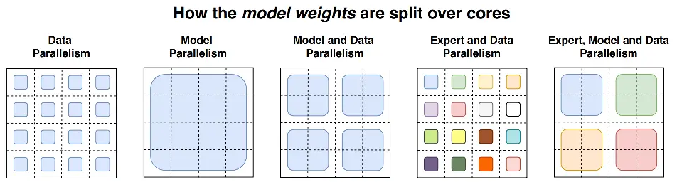

# 9.总结

### 1.数据并行

数据并行，由于其原理相对比较简单，是目前使用最广泛的分布式并行技术。**数据并行不仅仅指对训练的数据并行操作，还可以对网络模型梯度、权重参数、优化器状态等数据进行并行**。

我们首先以PyTorch 数据并行的发展（DataParallel、DistributedDataParallel、FullyShardedDataParallel）为主线进行讲述了数据并行的技术原理。同时，也简述了 DeepSpeed 中的增强版数据并行ZeRO。

### 2.流水线并行

所谓流水线并行，就是由于模型太大，无法将整个模型放置到单张GPU卡中；因此，**将模型的不同层放置到不同的计算设备，降低单个计算设备的显存消耗，从而实现超大规模模型训练**，也被称为**层间模型并行**。

我们首先讲述了朴素流水线并行，但是，朴素流水线并行存在的Bubble太大，导致GPU的利用率很低。为了减少Bubble率，后面又讲述了微批次流水线并行方案GPipe，虽然，GPipe可以显著提高GPU的利用率，但是GPipe采用的是F-then-B 模式（先进行前向计算，再进行反向计算），由于缓存了多个 micro-batch 的中间变量和梯度，因此，显存的实际利用率并不高。后来，我们又讲述了采用1F1B模式（前向计算和反向计算交叉进行，可以及时释放不必要的中间变量）的PipeDream及其变体（PipeDream-2BW、PipeDream-Flush等）来进一步节省显存，训练更大的模型。同时，还提到了常见的AI训练框架中采用的流水线并行方案。

### 3.张量并行

**将计算图中的层内的参数（张量）切分到不同设备（即层内并行），每个设备只拥有模型的一部分，以减少内存负荷**，我们称之为张量模型并行。按照行或者列的切分方式，可将张量并行切分为对应的行并行或者列并行。我们首先介绍了由Megatron-LM提出的仅对权重进行划分的1D张量并行。为了应对超大规模的AI模型，后来又介绍了由 Colossal-AI 提出的多维（2/2.5/3 维）张量并行。2D张量并行提出了针对激活进行切分。该并行方式降低了内存成本，但是却引入更多的通信成本。而2.5D张量通过增加更多的设备来减少通信的开销。而为了进一步减少内存冗余和通信开销，后续有提出了3D张量并行。除此之外，我们还谈到了PyTorch2.0中，开始对张量并行进行支持。

### 4.序列并行

序列并行，目前并没有一个统一的定义。我们主要介绍了两篇关于序列并行的工作。

-   第一篇是 Colossal-AI 发表的论文：Sequence Parallelism: Long Sequence Training from System Perspective
-   第二篇是 Megatron-LM 发表的论文：Reducing Activation Recomputation in Large Transformer Models

虽然两者都叫序列并行（Sequence Parallelism），但是实际上解决的问题、方法都不一样。前者主要是解决模型的输入长度(sequence length)限制，而后者是主要是减少模型显存的。

同时，还谈到了在PyTorch2.0的版本中提供了对序列并行的支持，不过目前还没有realease。

### 5.多维混合并行

前面讲述了数据并行、张量并行、流水线并行等多种并行技术，但在进行上百亿/千亿级以上参数规模的超大模型预训练时，我们通常会组合多种并行技术一起使用。

我们对目前常见的分布式并行技术组合策略进行了探讨，同时，还讲述了目前业界知名大模型中所采用的多维混合并行方案。

### 6.自动并行

大模型的分布式训练是一个非常复杂的问题，目前的绝大多数的分布式训练系统，都依赖用户人工反复尝试以及系统专家经验来进行部署，造成严重的资源利用效率低下的问题。因此，我们讲述了自动并行技术。主要针对目前一些经典的半自动（Mesh-tensorflow、GSPMD）或全自动（FlexFlow、Alpa）并行方案进行了相应的探讨。但目前自动并行方案在工业界落地的应用比较少。

### 7.MOE并行

现在的模型越来越大，训练样本越来越多，每个样本都需要经过模型的全部计算，这就导致了训练成本的平方级增长。而当我们希望在牺牲极少的计算效率的情况下，把模型规模提升上百倍、千倍，通常就需要使用 **MOE并行**。我们对带MOE结构的分布式并行策略进行了讲解，同时，也讲述了业界的一些超大模型（Switch-Transformer、GLaM）的MOE并行方案。

### 8.分布式训练并行策略选择

上面讲述了各种分布式并行策略，以下是进行分布式训练时针对不同的服务器资源类型（单机多卡、多机多卡），如何选择并行策略非常粗略的概述。

#### 8.1 单机单卡场景

当你的模型可以在单张 GPU 卡进行训练时，正常使用。

当你的模型不能在单张 GPU 卡进行训练时，

-   ZeRO + Offload CPU 和 NVMe（可选的）。
-   启用以**内存为中心的平铺** 。

如果最大层无法放置在单张GPU，则使用 ZeRO - 启用以**内存为中心的平铺** (MCT)。 它允许您通过自动分割层并按顺序执行来运行任意大的层。 MCT 减少了 GPU 上实时参数的数量，但不影响激活内存。

#### 8.2 单机多卡场景

当你的模型可以在单张 GPU 卡进行训练时，可以选择 DDP 或 ZeRO：

-   DDP：分布式 DP。
-   ZeRO：可能会更快，也可能不会更快，具体取决于所使用的情况和配置。

当你的模型不能在单张 GPU 卡进行训练时，可以选择 PP、ZeRO、TP：

-   PP
-   ZeRO
-   TP

如果使用 NVLINK 或 NVSwitch 进行节点内通信，这三者应该基本处于同等水平。

如果没有这些， PP 将比 TP 或 ZeRO 更快。 TP 的大小也可能产生影响，最好在您特定设置上进行试验以找到最优的方式。

注意： TP 几乎总是在单个节点内进行使用。 即：TP 大小 <= 每个节点的 GPU 数。

#### 8.3 多机多卡场景

当服务器节点间网络通信速度较快时，可以选择 ZeRO、PP+TP+DP：

-   ZeRO - 因为它几乎不需要对模型进行任何修改。
-   PP+TP+DP - 通信较少，但需要对模型进行大量更改。

当您服务器节点间网络通信速度较慢，并且 GPU 内存仍然不足时，可以选择 DP+PP+TP+ZeRO-1。

这里采用 PP 与 ZeRO-1 进行混合并行，**那么 PP 能与 DeepSpeed ZeRO 2/3一起训练吗**？

答：PP + ZeRO 2/3 不推荐一起训练。 PP 需要累积梯度（accumulate gradients），但 ZeRO2 需要对梯度进行分块（chunk）。 即使能够实现，也没有真正的性能提升。

将两者结合使用来提高效率并不容易，PP + ZeRO 2 实际上比 ZeRO2（无 PP）更慢且内存效率低。如果用户内存不足，用户可以使用 ZeRO3 代替 ZeRO2 + PP。而正因为如此，在 DeepSpeed 中， PP + ZeRO 2/3 之间不兼容。但可以将 PP 与 ZeRO 1 进行组合使用。

这里多说一点：即使该方法效率不高，但是 ColossalAI 为了支持更多的并行训练方法。ColossalAI 还是提供了 ZeRO 3 + PP + TP 一起组合的方案。

参考：

-   [Details about pipeline parallelism implementation in DeepSpeed · Issue #1110 ·](https://github.com/microsoft/DeepSpeed/issues/1110 "Details about pipeline parallelism implementation in DeepSpeed · Issue #1110 ·")
-   [DeepSpeed/deepspeed/runtime/pipe/engine.py ](https://github.com/microsoft/DeepSpeed/blob/master/deepspeed/runtime/pipe/engine.py "DeepSpeed/deepspeed/runtime/pipe/engine.py ")
-   [How PP and ZeRO stage 2+ work together? · Issue #682](https://github.com/hpcaitech/ColossalAI/issues/682 "How PP and ZeRO stage 2+ work together? · Issue #682")
-   [\[zero\] ZeRO supports pipeline parallel by ver217 · Pull Request #477 ](https://github.com/hpcaitech/ColossalAI/pull/477 "\[zero] ZeRO supports pipeline parallel by ver217 · Pull Request #477 ")

### 9.大模型混合进度训练FP16 与 BF16 的对比

目前，进行大模型训练的时候，为了节约显存，混合精度训练基本上已经成为了标配。而FP16混合精度已经成为主流大规模模型训练框架的默认选项，用于训练十亿到百亿规模的模型。但是用 FP16 训练巨型 LLM 模型却是一个禁忌，它将面临更多的稳定性挑战。

FP16 会经常溢出，导致数值不稳定、模型不收敛的情况！

为了避免溢出，这意味着你的权重必须保持很小。一种称为**损失缩放 (loss scaling) 的技术**有助于缓解这个问题，但是当模型变得非常大时，FP16 较小的数值范围仍然是一个问题。因此，你需要采用一些训练策略来稳定巨型模型的训练。

作为补救措施，NVIDIA Ampere GPU 提供了BF16浮点格式来缓解FP16的问题。但目前，但目前，**BF16在一些平台上不被支持（因此，它的使用的可能广泛性会被限制）**。当使用 BF16 时，BF16 为指数保留了 8 位 (与 FP32 相同)，为小数保留了 7 位。这意味着使用 BF16 我们可以保留与 FP32 相同的动态范围。但代价就是它的精度非常差（相对于 FP16，损失了 3 位精度）。但是在训练时，采用的随机梯度下降法及其变体，该方法有点像蹒跚而行，如果你这步没有找到完美的方向其实没关系，你会在接下来的步骤中纠正自己。无论使用 BF16 还是 FP16，都有一个权重副本始终在 FP32 中 —— 这是由优化器更新的内容。 16 位格式仅用于计算，**优化器以全精度更新 FP32 权重**，然后将它们转换为 16 位格式以用于下一次迭代。因此，不会发生精度损失。

虽然，之前有一些巨型大模型使用了 FP16 进行混合进行训练，但是从OPT-175、Bloom-176B、GLM130B的训练报告来看，BF16 是更佳的一个解决方案，可以规避很多不必要的烦恼。
