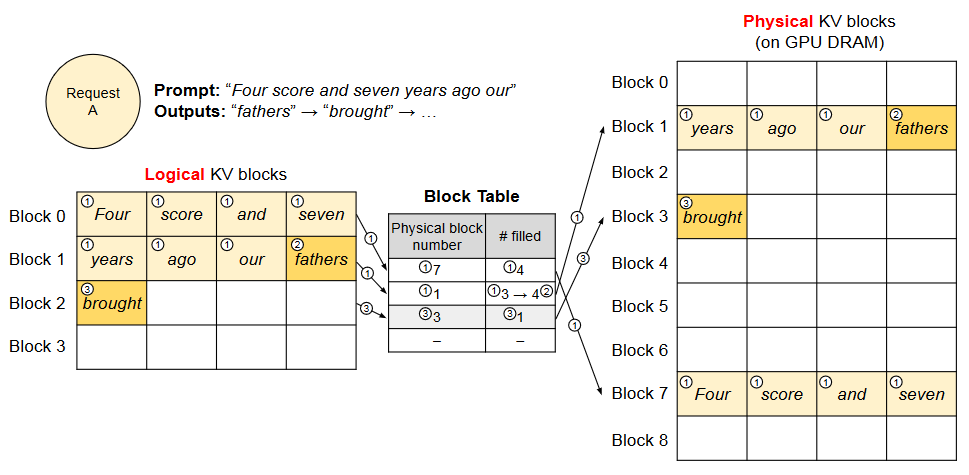

# 1.vllm

### 1.Overview

**vLLM是一个大模型推理服务框架**，声称

-   最牛的serving 吞吐量
-   **PagedAttention**对kv cache的有效管理
-   传入请求的**continus batching**，而不是static batching
-   高性能CUDA kernel
-   流行的HuggingFace模型无缝集成
-   有各种decoder算法的高吞吐量服务，包括parallel sampling和beam search等
-   tensor parallel
-   兼容OpenAI的API服务器 &#x20;

支持的模型确实挺多的：

-   Aquila (`BAAI/Aquila-7B`, `BAAI/AquilaChat-7B`, etc.)
-   Baichuan (`baichuan-inc/Baichuan-7B`, `baichuan-inc/Baichuan-13B-Chat`, etc.)
-   BLOOM (`bigscience/bloom`, `bigscience/bloomz`, etc.)
-   Falcon (`tiiuae/falcon-7b`, `tiiuae/falcon-40b`, `tiiuae/falcon-rw-7b`, etc.)
-   GPT-2 (`gpt2`, `gpt2-xl`, etc.)
-   GPT BigCode (`bigcode/starcoder`, `bigcode/gpt_bigcode-santacoder`, etc.)
-   GPT-J (`EleutherAI/gpt-j-6b`, `nomic-ai/gpt4all-j`, etc.)
-   GPT-NeoX (`EleutherAI/gpt-neox-20b`, `databricks/dolly-v2-12b`, `stabilityai/stablelm-tuned-alpha-7b`, etc.)
-   InternLM (`internlm/internlm-7b`, `internlm/internlm-chat-7b`, etc.)
-   LLaMA & LLaMA-2 (`meta-llama/Llama-2-70b-hf`, `lmsys/vicuna-13b-v1.3`, `young-geng/koala`, `openlm-research/open_llama_13b`, etc.)
-   MPT (`mosaicml/mpt-7b`, `mosaicml/mpt-30b`, etc.)
-   OPT (`facebook/opt-66b`, `facebook/opt-iml-max-30b`, etc.)
-   Qwen (`Qwen/Qwen-7B`, `Qwen/Qwen-7B-Chat`, etc.)

觉得有意思的东西其实主要是两个，continus batching和PagedAttention，本文为上集，主要讲讲continus batching。

### 2.LLM Decoder推理基础

分为两步：如下图，黄色为prompt，蓝色为每个token generation

-   prompt
-   LLM生成一个完整token序列，当遇到stop token或最大句子长度就停止


LLM decoder推理是memory bound的，这意味着推理throughput很大程度取决于你能喂进HBM显存多大的batch size，而不是GPU算力越高，吞吐越大。HBM的消耗随着model size和句子seqlen而变化，13b参数的模型对于seq中每个token的state都要花1M空间，那么对于A100-40G, 13b参数占了26g，还剩14g可以保存14k token的state，如果我们设seqlen为512，那么bs最大为28，如果seqlen=2048，那么bs最大为7；这是一个上限数字，因为还没算中间tensor的memory占用；

所以**量化**，即quantization在LLM里面很有用，可以加大单卡上的batchsize和seqlen，但是这要去修改模型的weights，也有不用修改weights的，比如flashattention，以及下文要提到的continuous batching，它们都提升了memory IO effeciency

### 3.LLM batching

LLM batching比较tricky，因为它们的推理具有迭代性质。这是因为某些客户端请求可以在batching中很早就完成，但释放其资源并向可能处于不同完成状态的batch中添加新客户端请求非常麻烦。这意味着GPU未被充分利用，因为一个batch中不同seq的生成长度不同于batch的最大生成长度，比如下图中，seq1生成了2个token，3生成了1个，4生成了2个，然而2生成了5个，seq1、3、4结束标记后的白色方块就是GPU在空闲，什么都没有做，此时GPU利用率非常低，**传统的static batching不能把白色空闲时间利用起来**。


那么static batching对GPU利用不足的频率是多少？这个主要取决于一个batch中这些句子的生成长度，比如分类任务，每个seq的输出长度都是1，比如聊天任务，那就不一了，那这样就会低效利用GPU。

### 4.continus batching

简单来说，**一旦一个batch中的某个seq完成生成，发射了一个end-of-seq token，就可以在其位置插入新的seq继续生成token**，从而达到比static batching更高的GPU利用率。


### 5.PagedAttention

PagedAttention是对kv cache所占空间的分页管理，是一个典型的**以内存空间换计算开销**的手段，vllm和tenorRT-llm都应用了这个手段来节约kv cache占用的memory，和现今大模型训练的recompute中间activation用于bwd的**以计算开销换内存空间**的手段恰好相反。

#### 5.1 KV Cache

LLM 的核心是自回归 Transformer 模型。该模型可基于输入（prompt）和其之前输出的 token 序列生成词（token），一次生成一个。对于每次请求，这个成本高昂的过程都会重复，直到模型输出终止 token。这种按序列的生成过程会让工作负载受到内存限制，从而无法充分利用 GPU 的计算能力，并会限制服务的吞吐量。

通过批量方式同时处理多个请求可以提高吞吐量。但是，要在单一批次中处理许多请求，就需要高效地管理每个请求所占用的内存空间。

举个例子，下图（左）展示了一个 130 亿参数的 LLM 在一台 40GB RAM 的英伟达 A100 GPU 上的内存分布。


其中， 65% 的内存都分配给了模型权重，而模型权重在提供服务期间是不会变化的。

30% 的内存是用于存储请求的动态状态。对 Transformer 而言，这些状态由与注意力机制关联的键（key）和值（value）张量构成，通常被称为\*\* KV 缓存\*\*，其表示用于生成序列中新输出 token 的之前 token 上下文。

其余占比很小的内存则是用于其它数据，包括激活 —— 评估 LLM 时创建的临时张量。

由于模型权重恒定不变，激活也只会占用少量 GPU 内存，因此对\*\* KV 缓存的管理方式就成了决定最大批量大小的关键\*\*。如果管理方式很低效，KV 缓存内存就会极大限制批量大小，并由此限制 LLM 的吞吐量，如图（右）所示。

来自 UC 伯克利等机构的这个研究团队在论文中表示，他们观察到当前的 LLM 服务系统都没有高效地管理 KV 缓存内存。主要原因是它们会将请求的 KV 缓存保存在邻接的内存空间中，因为大多数深度学习框架都需要将张量存储在相邻连续的内存中。

但是，不同于传统深度学习工作负载中的张量，KV 缓存有其自己的独特性质：它会在模型生成新 token 的过程中随时间动态地增长和缩小，而且它的持续时间和长度是无法事先知晓的


#### 5.2  vLLM架构

vLLM 采用一种集中式调度器（scheduler）来协调分布式 GPU 工作器（worker）的执行。**KV 缓存管理器由 PagedAttention 驱动，能以分页方式有效管理 KV 缓存**。具体来说，KV 缓存管理器通过集中式调度器发送的指令来管理 GPU 工作器上的物理 KV 缓存内存。


#### 5.3 **PagedAttention：解决内存瓶颈**

在自回归解码过程中，所有输入到 LLM 的 token 会产生注意力键和值的张量，这些张量**保存**在 GPU 内存中以生成下一个 token。这些缓存键和值的张量通常被称为 **KV 缓存**，其具有：

-   **内存占用大**：在 LLaMA-13B 中，缓存单个序列最多需要 1.7GB 内存；
-   **动态且不可预测**：KV 缓存的大小取决于序列长度，这是高度可变和不可预测的。因此，这对有效地管理 KV 缓存挑战较大。该研究发现，由于碎片化和过度保留，现有系统浪费了 60% - 80% 的内存。

为了解决这个问题，该研究引入了 **PagedAttention**，这是一种受操作系统中虚拟内存和分页经典思想启发的注意力算法。与传统的注意力算法不同，**PagedAttention 允许在非连续的内存空间中存储连续的键和值**。具体来说，**PagedAttention 将每个序列的 KV 缓存划分为块，每个块包含固定数量 token 的键和值**。在注意力计算期间，PagedAttention 内核可以有效地识别和获取这些块。

不同于传统的注意力算法，PagedAttention **支持将连续的键和值存储在非相邻连续的内存空间中**。

具体来说，PagedAttention 会将每个序列的 KV 缓存分成 KV 块。每一块都包含固定数量 token 的键和值的向量；这个固定数量记为 KV 块大小（B）。令第 j 个 KV 块的键块为 $K_j$，值块为 $V_j$。则注意力计算可以转换为以下形式的对块的计算：

$$
A_{i j}=\frac{\exp \left(q_{i}^{\top} K_{j} / \sqrt{d}\right)}{\sum_{t=1}^{\lceil i / B\rceil} \exp \left(q_{i}^{\top} K_{t} 1 / \sqrt{d}\right)}, o_{i}=\sum_{j=1}^{\lceil i / B\rceil} V_{j} A_{i j}^{\top}
$$

其中 $A_{i,j}$ 是在第 j 个 KV 块上的注意力分数的行向量。

在注意力计算期间，PagedAttention 核会分开识别并获取不同的 KV 块。


上图给出了 PagedAttention 的一个示例：其键和值向量分布在三个块上，并且这三个块在物理内存上并不相邻连续。

每一次，这个 PagedAttention 核都会将查询 token（forth）的查询向量 $q_i$ 与一个块（比如 0 块中的 Four score and seven 的键向量）中键向量 $K_j$ 相乘，以计算注意力分数 $A_{i,j}$；然后再将 $A_{i,j}$ 与块中的值向量$  V_j  $相乘，得到最终的注意力输出 $o_i$。

综上所述，PagedAttention 算法能让 KV 块存储在非相邻连续的物理内存中，从而让 vLLM 实现更为灵活的分页内存管理。

#### 5.4 KV 缓存管理器

使用 PagedAttention，将 KV 缓存组织为固定大小的 KV 块，就像虚拟内存中的分页。**KV 缓存被划分成块，块不需要在内存空间中连续**。

对 KV 缓存的请求会被表示成一系列逻辑 KV 块，在生成新 token 和它们的 KV 缓存时从左向右填充。最后一个 KV 块中未填充的位置留给未来填充。

因为**块在内存中不需要连续**，因而可以用一种更加灵活的方式管理键和值，就像在操作系统的虚拟内存中一样：可以将块视为页面，将 token 视为字节，将序列视为进程。序列的连续逻辑块通过块表映射到非连续物理块中。物理块在生成新 token 时按需分配。

在 PagedAttention 中，内存浪费只会发生在序列的最后一个块中。这使得在实践中可以实现接近最佳的内存使用，仅浪费不到 4 %。这种内存效率的提升被证明非常有用，允许系统将更多序列进行批处理，提高 GPU 使用率，显著提升吞吐量。

PagedAttention 还有另一个关键优势 —— **高效的内存共享**。例如在并行采样中，多个输出序列是由同一个提示（prompt）生成的。在这种情况下，提示的计算和内存可以在输出序列中共享。

#### 5.5 **使用 PagedAttention 和 vLLM 进行解码**

下图通过一个示例展示了 vLLM 在对单个输入序列的解码过程中执行 PagedAttention 和管理内存的方式。



从全局来看，在每次解码迭代中，**vLLM 首先会选取一组候选序列来批处理，并为新请求的逻辑块分配物理块**。

然后，vLLM 会将当前迭代的所有输入 token 连接起来，组成一个序列并将其输入到 LLM。在 LLM 的计算过程中，vLLM 使用 PagedAttention 核来访问以逻辑 KV 块形式存储的之前的 KV 缓存，然后将新生成的 KV 缓存保存到物理 KV 块中。

在一个 KV 块中存储多个 token（块大小 > 1）可让 PagedAttention 核并行处理多个位置的 KV 缓存，由此可以提升硬件使用率并降低延迟。

下图给出了 vLLM 管理两个序列的内存的示例。


### 6.vLLM源码学习

-   [LLM推理框架2：vLLM源码学习](https://zhuanlan.zhihu.com/p/643336063 "LLM推理框架2：vLLM源码学习")
-   [CUDA PagedAttention kernel源码解析](https://zhuanlan.zhihu.com/p/658233994 "CUDA PagedAttention kernel源码解析")
-   [LLM 高速推理框架 vLLM 源代码分析](<https://me.tric.space/2023/07/10/LLM 高速推理框架 vLLM 源代码分析/> "LLM 高速推理框架 vLLM 源代码分析")

#### 6.1 配置运行

**安装**

```bash
# 方法1
pip install vllm  # This may take 5-10 minutes.
```

```bash
# 方法2
git clone https://github.com/vllm-project/vllm.git
cd vllm
pip install -e .  # This may take 5-10 minutes.
```

```bash
# 方法3
git clone https://github.com/vllm-project/vllm.git
cd vllm
python setup.py install  # This may take 5-10 minutes.
```

安装完成后，运行examples/offline\_inference.py即可，**命令行运行**

```bash
python examples/offline_inference.py
```

代码

```python
from vllm import LLM, SamplingParams

# Sample prompts.
prompts = [
    "Hello, my name is",
    "The president of the United States is",
    "The capital of France is",
    "The future of AI is",
]
# Create a sampling params object.
sampling_params = SamplingParams(temperature=0.8, top_p=0.95)

# Create an LLM.
llm = LLM(model="facebook/opt-125m")
# Generate texts from the prompts. The output is a list of RequestOutput objects
# that contain the prompt, generated text, and other information.
outputs = llm.generate(prompts, sampling_params)
# Print the outputs.
for output in outputs:
    prompt = output.prompt
    generated_text = output.outputs[0].text
    print(f"Prompt: {prompt!r}, Generated text: {generated_text!r}")
```

参考资料：

-   [大模型推理服务框架vLLM要点简析 (上) ](https://zhuanlan.zhihu.com/p/654259045 "大模型推理服务框架vLLM要点简析 (上) ")
-   [vLLM](https://whaosoft.blog.csdn.net/article/details/131328282?spm=1001.2101.3001.6650.10\&utm_medium=distribute.pc_relevant.none-task-blog-2~default~BlogCommendFromBaidu~Rate-10-131328282-blog-131764968.235^v38^pc_relevant_sort\&depth_1-utm_source=distribute.pc_relevant.none-task-blog-2~default~BlogCommendFromBaidu~Rate-10-131328282-blog-131764968.235^v38^pc_relevant_sort\&utm_relevant_index=11 "vLLM")
-   [如何利用vLLM框架快速部署LLama2](https://zhuanlan.zhihu.com/p/655872477 "如何利用vLLM框架快速部署LLama2")
-
