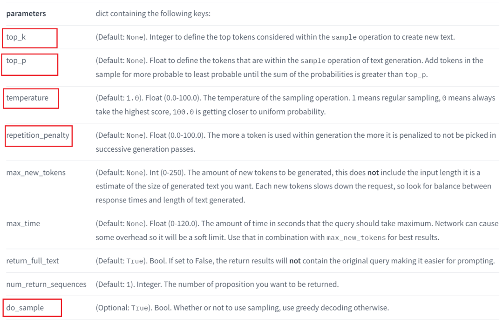
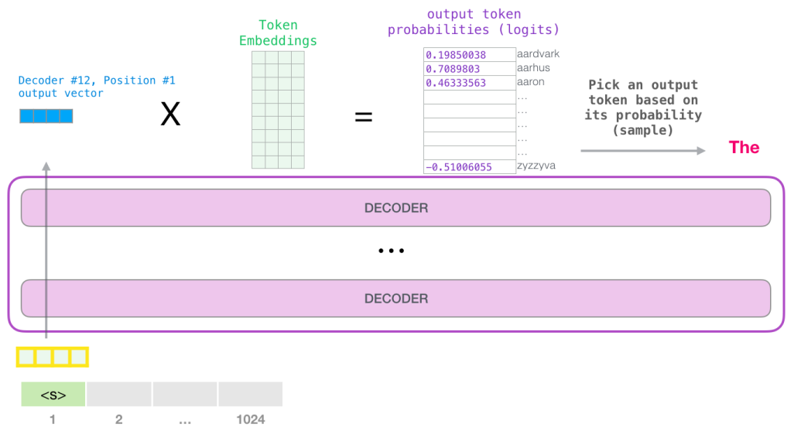
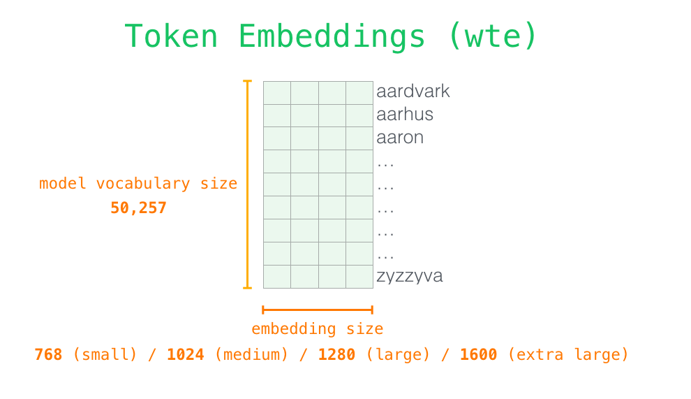
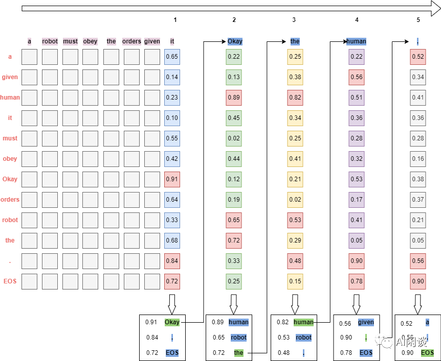
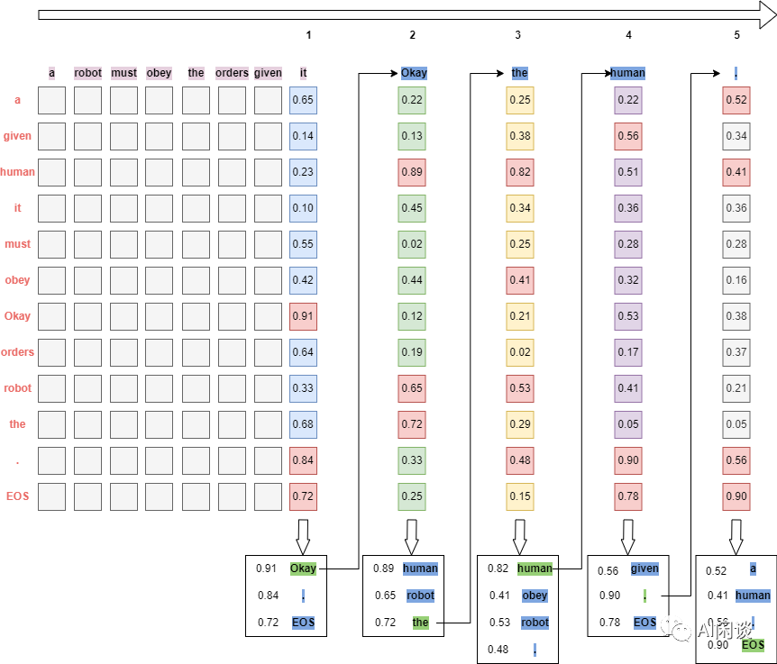
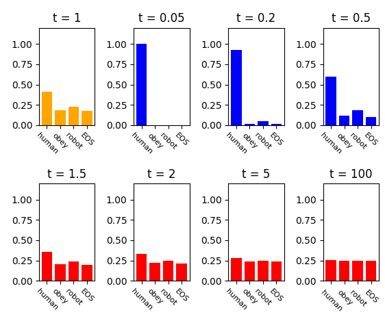
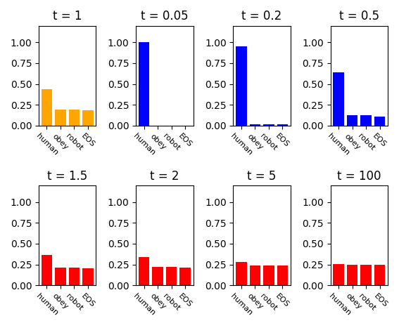
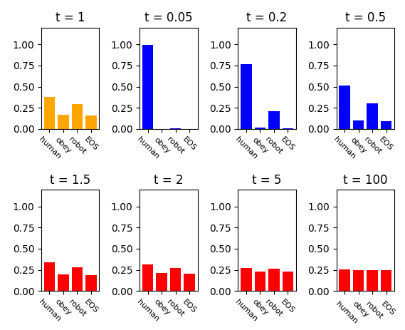

# LLM 推理常见参数

> 文章参考：[LLM 推理常见参数解析 (qq.com)](https://mp.weixin.qq.com/s?__biz=Mzk0ODU3MjcxNA==\&mid=2247484444\&idx=1\&sn=da7767b359c5707a8a5c0096a5c9e48c\&chksm=c364c359f4134a4f3b8321ab9cffa45deef6b3f453243d290db0fd9af643adaeb105762c6ba6\&mpshare=1\&scene=1\&srcid=1208PVZ0tCkXwSJdQd0cLqyP\&sharer_shareinfo=d9196be9eb87f381d27033be958a58c3\&sharer_shareinfo_first=d9196be9eb87f381d27033be958a58c3#rd "LLM 推理常见参数解析 (qq.com)")

## 1.引言 &#x20;

以下图Huggingface Inference API为例（其他框架类似），这里重点介绍$top\_k$,$top\_p$,$temperature$,$repetition\_penalty$参数，以及$greedy~search$和$beam~search$。

## 2.背景介绍

现在常见的LLM基本都是只包含`Transformer Decoder`的，每个Token在输入模型的Transformer Decoder之前，都会首先从Token Embedding（有些也叫Word Embedding）中通过查表获取对应的embedding向量，然后将embedding向量输入Transformer Decoder，并且在最后一层输出的也是同维度的embedding。在预测下一个Token时，实际只利用了上一个Token的embedding。

如下图所示，将输入“`a robot must obey the orders given it`”对应的embedding输入Transformer Decoding后，在最后的Transformer Decoder之后，每个Token对应的位置相应的也会生成一个新的embedding，然后使用最后一个Token“`it`”**对应的新生成的embedding（蓝色）** 来生成新的Token“`Okay`”，之后将新的Token“`Okay`”也作为输入，进一步根据“`Okay`”对应位置新生成的embedding来生成新的Token“`human`”，以此类推：

_5Y5ZVQhUfP.gif>)

那么怎么**根据新生成的embedding**来生成下一个Token呢，如下图所示，具体来说是**让新生成的embedding与Token Embeddings矩阵相乘**（也就是和每个Token对应的embedding向量做内积），得到和词表中每个Token的相似性得分（`logits`），然后基于这个得分即可以选择生成新的Token（比如直接取得分最高的Token）。

其中的Token Embeddings行数即为模型词表中Token的个数，列数即为embedding的维度，也就是每个Token对应一个embedding向量，如下图所示：

对于LLM的推理过程详情可以参考这两篇博文：

-   [ ] [The Illustrated GPT-2](http://jalammar.github.io/illustrated-gpt2/ "The Illustrated GPT-2")
-   [ ] [How GPT3 Works - Visualizations and Animations](http://jalammar.github.io/how-gpt3-works-visualizations-animations/ "How GPT3 Works - Visualizations and Animations")

## 3.Greedy Search

假设词表中有“`a`”,“`given`”,“`human`”,“`it`”,“`must`”,“`obey`”,“`Okay`”,“`orders`”,“`robot`”,“`the`”,“`.`”,“`EOS`”共12个Token，其中“`EOS`”表示终止Token。

GreedySearch（贪心搜索）的思路非常简单，**就是每次都从相似性得分（logits）选择得分最高的Token**（一般来说，都会将得分经过softmax层转换为概率分布，数值区间为`0~1`，此处为了简单，就不额外转换，不过都假设数值在`0~1`之间），直到结束。如下图所示：

-   [ ] **Step1**：使用最后一个Token“`it`”**对应的新生成的embedding来计算相似性得分（logits）**，最终“`Okay`”对应的得分0.91最高，所以选择“`Okay`”作为下一个Token。
-   [ ] **Step2**：使用“`Okay`”来计算相似性得分（logits），最终“`human`”对应的得分0.89最高，所以选择“`human`”作为下一个Token。
-   [ ] **Step3**：使用“`human`”来计算相似性得分（logits），最终“`.`”对应的得分0.78最高，所以选择“`.`”作为下一个Token。
-   [ ] **Step4**：使用“`.`”来计算相似性得分（logits），最终“`EOS`”对应的得分0.90最高，所以终止生成。

在推理阶段模型的权重都是确定的，并且也不会有dropout等其他随机性（忽略不可抗的硬件计算误差，比如并行规约求和的累积误差等），因此**如果是greedy search，则对于同一个输入，多次运行后模型的输出结果应该完全一致**。

-   [ ] 这样的好处是**在模型效果严格对齐时非常有必要**（比如将模型从Huggingface模型转换为推理效率更高的Faster Transformer模型，并且使用Faster Transformer进行推理部署）。
-   [ ] 这样的坏处**是模型效果可能不是最优的，也会缺乏一定的多样性**，比如用同样的问题问ChatGPT，其答案并不会每次都一样。至于如何增加多样性。

## 4.Beam Search

BeamSearch是GreedySearch的改进版本，**其不再是每次都取得分最大的Token，而是始终保留beam\_size个得分最大的序列**。还是使用上面的例子。如下图所示，假设beam\_size为2，也就是始终保留两个得分最大的序列：

**Step1**：使用最后一个Token“`it`”对应的新生成的embedding来计算相似性得分（logits），最终“`Okay`”对应的得分0.91和“`.`”对应的得分0.84最高，所以选择“Okay”和“.”作为下一个Token。

-   [ ] “a robot must obey the orders given it Okay”，对应得分0.91
-   [ ] “a robot must obey the orders given it .”，对应得分0.84

**Step2**：分别使用“`Okay`”和“`.`”来计算相似性得分（logits）

-   [ ] 对于“`Okay`”，最终“`human`”对应的得分0.89和“`the`”对应的得分0.72最高，对应候选序列
-   [ ] “a robot must obey the orders given it **Okay human**”，对应得分**0.8099**
-   [ ] “a robot must obey the orders given it **Okay the**”，对应得分0.6552
-   [ ] 对于“`.`”，最终“`the`”对应的得分0.92和“`EOS`”对应的得分0.70最高，对应候选序列
-   [ ] “a robot must obey the orders given it **. the**”，对应得分**0.7728**
-   [ ] “a robot must obey the orders given it **.**”，对应得分0.5880
-   [ ] **从以上4个序列中选出得分最高的2个保留**：
-   [ ] “a robot must obey the orders given it **Okay human**”，对应得分0.8099
-   [ ] “a robot must obey the orders given it **. the**”，对应得分0.7728

**Step3**：分别使用“`human`”和“`the`”来计算相似性得分（logits）

-   [ ] 对于“`human`”，最终“`.`”对应的得分0.78和“`human`”对应的得分0.72最高，对应候选序列
-   [ ] “a robot must obey the orders given it **Okay human.**”，对应得分**0.6317**
-   [ ] “a robot must obey the orders given it **Okay human human**”，对应得分0.5831
-   [ ] 对于“`the`”，最终“`human`”对应的得分0.80和“`robot`”对应的得分0.68最高，对应候选序列
-   [ ] “a robot must obey the orders given it **. the human**”，对应得分**0.6128**
-   [ ] “a robot must obey the orders given it **. the robot**”，对应得分0.5255
-   [ ] **从以上4个序列中选出得分最高的2个保留**：
-   [ ] “a robot must obey the orders given it **Okay human.**”，对应得分0.6317
-   [ ] “a robot must obey the orders given it **. the human**”，对应得分0.6128

**Step4**：分别使用“`.`”和“`human`”来计算相似性得分（logits）

-   [ ] 对于“`.`”，最终“`robot`”对应的得分0.81和“`EOS`”对应的得分0.90最高，对应候选序列
-   [ ] “a robot must obey the orders given it **Okay human. robot**”，对应得分0.5117
-   [ ] “a robot must obey the orders given it **Okay human.**”，对应得分**0.5685**
-   [ ] 对于“`human`”，最终“`must`”对应的得分0.68和“`.`”对应的得分0.90最高，对应候选序列
-   [ ] “a robot must obey the orders given it **. the human must**”，对应得分0.4167
-   [ ] “a robot must obey the orders given it **. the human.**”，对应得分0.5515
-   [ ] **从以上4个序列中选出概率最高的2个保留**，由于此时得分最高的“a robot must obey the orders given it Okay human.”已经生成终止符Token“`EOS`”，所以可以在此终止，因为不会有其他得分更高的序列。

由于beam search会同时保留多个序列，因此**就更容易得到得分更高的序列，并且beam\_size越大，获得更高得分的概率越高**。然而从上面也可以看出，每个step都需要进行beam\_size次前向计算（当然可以使用batch计算，但总的计算量不变），也就是计算量会扩大beam\_size倍。另一方面，LLM推理中一般都会使用Key、Valuecache，这也就会进一步增大Key、Valuecache的内存占用，同时增加了Key、Valuecache管理的复杂度。这也就是在LLM推理中为什么比较少使用beam search。

与greedy search类似，虽然beam search保留了多个序列，但最终输出时还是返回的得分最大的序列，因此**对于同一个输入，使用beam search，多次运行模型最终的输出依然是固定不变的**。

## 5.top\_k

从上面的介绍可以看出，**不管是greedysearch，还是beamsearch，对于固定输入，模型的输出是固定不变的**，这就显得比较单调，为了增加模型输出的多样性，人们提出了[top-k采样策略](https://arxiv.org/abs/1805.04833 "top-k采样策略")，其不像greedysearch那样每次取分数最高的，而是**先选出分数最高的k个，然后将其分数作为权重进行随机采样，得到下一个Token**。这也就引入了随机性，每次预测的结果都可能不一样。

还是以上面的例子来介绍，如下图所示（假设`k=3`）：

-   [ ] **Step1**：使用最后一个Token“`it`”对应的新生成的embedding来计算相似性得分（logits），选出得分最高的3个Token：\[“`Okay`”、“`.`”、“`EOS`”]，对应的权重为：`[0.91,0.84,0.72]`，使用该权重进行随机采样，获得新Token“`Okay`”。
-   [ ] **Step2**：使用“`Okay`”来计算相似性得分（logits），选出得分最高的3个Token：`[“human”、“robot”、“the”]`，对应的权重为：`[0.89,0.65,0.72]`，使用该权重进行随机采样，获得新Token“`the`”，事实上，“`the`”并不是得分最高的。
-   [ ] 以此类推，最终得到输出序列：“a robot must obey the orders given it **Okay the human.**”

可以看出，**如果top\_k=1，则对应greedysearch。**

## 6.top\_p

在top\_k中，每次都是从k个Token中采样，但是难免会出现一些特殊的case，比如某一个Token的分数非常高，其他分数都很低，此时仍旧会有一定的概率采样到那些分数非常低的Token，导致生成输出质量变差。此时，如果k是可变的，那么就可以过滤掉分数很低的Token，在[The Curious Case of Neural Text Generation](https://arxiv.org/abs/1904.09751 "The Curious Case of Neural Text Generation").中，作者提出了top\_p采样，**在每个step中，都对输出分数进行排序，然后将分数从大到小累加，直到累加分数大于设置的p为止，然后和top\_k类似，将每个选择出来的Token的分数作为权重进行随机采样**。这样，每次候选的Token个数都会因为Token分数的分布不同而不一样。

还是以上面的例子来介绍，如下图所示（假设`p=2.2`）：

-   [ ] **Step1**：使用最后一个Token“`it`”对应的新生成的embedding来计算相似性得分（logits），选出累积得分超过2.2的Token：`[“Okay”、“.”、“EOS”]`，对应的权重为：`[0.91,0.84,0.72]`，使用该权重进行随机采样，获得新Token“`Okay`”。
-   [ ] **Step2**：使用“`Okay`”来计算相似性得分（logits），选出累积得分超过2.2的Token：`[“human”、“robot”、“the”]`，对应的权重为：`[0.89,0.65,0.72]`，使用该权重进行随机采样，获得新Token“`the`”，事实上，“`the`”并不是得分最高的。
-   [ ] **Step3**：使用“`the`”来计算相似性得分（logits），选出累积得分超过2.2的Token：`[“human”、“obey”、“robot”、“.”]`，对应的权重为：`[0.82,0.41,0.53,0.48]`，使用该权重进行随机采样，获得新Token“`human`”，事实上，“`human`”并不是得分最高的，并且此时选出了4个候选Token。
-   [ ] 以此类推，最终得到输出序列：“a robot must obey the orders given it Okay the human.”

虽然从理论上讲，**top\_p似乎比top\_k更优雅，但这两种方法在实践中都很好用。top\_p也可以与top\_k结合使用，这可以避免分数非常低的Token**，同时提供一些动态选择的空间。

## 7.temperature

事实上，在**top\_k和top\_p的采样中并不是完全按照分数权重来采样的**，一般采样前我们会将候选Token的得分向量经过softmax（公式如下图）转换为概率，然后按照概率分布采样。

$$
\operatorname{softmax}\left(y_{i}\right)=\frac{e^{y_{i}}}{\sum_{j=1}^{n} e^{y_{j}}}
$$

很多时候我们想要控制采样的随机性，可以使用**带有温度系数T的softmax实现**，如下所示，温度系数T为大于0的任意值（Huggingface中限制`0.0<T<100.0`）。**当**\*\*`T=1`\*\***时，输出分布将与标准softmax输出相同。T的值越大，输出分布就越平滑，T的值越小，输出分布越陡峭**。

-   [ ] 如果希望**增加**输出分布的**随机性**，可以**增加**参数T的值，当T为无穷大时，分布变成均匀分布，就是完全随机。
-   [ ] 如果希望**减小**输出分布的**随机性**，可以**减小**参数T，当T趋近于0时，就是等价于取top1。

$$
\operatorname{softmax}\left(y_{i}\right)=\frac{e^{\frac{y_{i}}{T}}}{\sum_{j=1}^{n} e^{\frac{y_{j}}{T}}}
$$

假设得到的候选Token为：`[“human”、“obey”、“robot”、“EOS”]`，对应的分数为：`[0.92,0.11,0.33,0.04]`，则对于不同的参数t，利用上面的softmax可以得到对应的概率分布为：

-   [ ] 橙色：`t=1`，分布不变，不改变随机
-   [ ] 蓝色：`t<1`，减小随机性，并且t越小，随机性越小
-   [ ] 红色：`t>1`，增大随机性，并且t越大，随机性越大

## 8.repetition\_penalty（重复惩罚）

这个选项最早是由[A Conditional Transformer Language Model for Controllable Generation](https://arxiv.org/abs/1909.05858 "A Conditional Transformer Language Model for Controllable Generation")中提出的，其是**为了解决语言模型中重复生成的问题**，即使比较大的LLM也会存在。其思想比较简单，**就是记录之前已经生成过的Token，当预测下一个Token时，人为降低已经生成过的Token的分数，使其被采样到的概率降低**。

如下所示，直接基于上述带温度系数T的softmax进行实现，其中的`g`表示已经生成过的Token列表，如果某个Token已经在生成过的Token列表`g`中，则对其对应的温度系数T乘上一个系数`θ`，`θ`为大于0的任意值。

-   [ ] `θ=1`，表示不进行任何惩罚
-   [ ] `θ>1`，相当于尽量避免重复
-   [ ] `θ<1`，相当于希望出现重复

$$
p_{i}=\frac{\exp \left(x_{i} /(T \cdot I(i \in g))\right.}{\sum_{j} \exp \left(x_{j} /(T \cdot I(j \in g))\right.} \quad I(c)=\theta ~if~ c ~is ~True ~else ~1
$$

还是使用上一部分的示例，假设得到的候选Token为：`[“human”、“obey”、“robot”、“EOS”]`，对应的分数为：`[0.92,0.11,0.33,0.04]`，令`g=[“robot”,“it”]`，也就是这些Token已经生成过，对应的惩罚系数`θ=3`，可以看出，“`robot`”对应的采样概率都在降低：

如果希望鼓励出现重复，可以设置惩罚系数`θ<1`，比如，令`θ=0.5`，可以看出，“`robot`”对应的采样概率都在增加：

## 9.总结

通过以上的介绍，大概知道了各个参数的含义，整体来说：

-   [ ] `GreedySearch`是最简单、最直接的方式，其可以保证稳定的输出，相应的，`BeamSearch`可以进一步提升生成效果，但是代价更高，也是可以保证稳定的输出。
-   [ ] `top_p`和`top_k`都可以用于增加模型生成结果的多样性，输出结果往往会变。
-   [ ] 温度系数`temperature`一般用于控制随机性，`temperature`越大，随机性越强，`temperature`越小，随机性越弱。
-   [ ] 重复惩罚`repetition_penalty`用于避免模型一直输出重复的结果，`repetition_penalty`越大，出现重复性可能越小，`repetition_penalty`越小，出现重复性可能越大。
