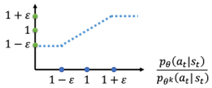
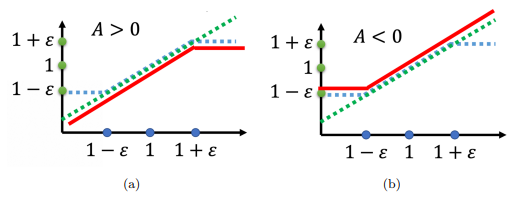

# 近端策略优化(ppo)

> 文章来源：[详解近端策略优化](https://www.cnblogs.com/xingzheai/p/15931681.html "详解近端策略优化")

## 0.引言

ppo其实就是策略梯度的一种变形。首先介绍一下同策略（on-policy）与异策略(off-policy)的区别。

在强化学习里面，需要学习的其实就是一个智能体。如果要学习的智能体跟和环境互动的智能体是同一个的话，称之为**同策略**。如果要学习的智能体跟和环境互动的智能体不是同一个的话，称之为**异策略**。策略梯度是同策略的算法。

## 1. 同策略的不足之处

首先回顾一下PG的期望奖励值，公式如下。

$$
\nabla \bar{R}_{\theta}=E_{\tau \sim p_{\theta}(\tau)}\left[R(\tau) \nabla \log p_{\theta}(\tau)\right]
$$

上面更新的公式中的$E_{τ∼p_θ(τ)}$是在策略$π_θ$的情况下， 所采样出来的轨迹$τ$做期望。但是如果更新了参数，从$θ$变成$θ′$，概率$p_θ(τ)$就不对了，之前采样出来的数据就不能用了。所以PG会花很多时间去采样数据，可以说大多数时间都在采样数据，智能体去跟环境做互动以后，接下来就要更新参数，只能用这些数据更新参数一次。接下来就要重新再去收集数据，才能再次更新参数。

## 2. 改进同策略的思路

策略梯度是同策略的算法，所以非常耗费时间，那么一个可能的改进思路是将同策略变成异策略。简单的思路就是**用另外一个策略**$π_{θ′}$**， 另外一个演员**$θ′$**去跟环境做互动。用**$θ′$**收集到的数据去训练**$θ$。假设可以用$θ′$收集到的数据去训练$θ$，意味着说可以把$θ′$收集到的数据用很多次，也就是可以执行梯度上升好几次，更新参数好几次，这都只要用同一笔数据就可以实现。因为假设$θ$有能力学习另外一 个演员$θ′$所采样出来的数据的话，那$θ′$就只要采样一次，也许采样多一点的数据，让$θ$去更新很多次， 这样就会比较有效率。

## 3. 同策略到异策略的具体实现

那么问题来了， 怎么找到这样的一个演员$θ′$，使其收集到的数据可以用于训练$θ$，且他们之间的差异可以被忽略不计呢？

首先介绍一个名词，**重要性采样（importance sampling）**。 假设有一个函数$f(x)$，$x$需要从分布$p$中采样。应该如何怎么计算$f(x)$的期望值呢？假设分布$p$不能做积分，那么可以从分布$p$尽可能多采样更多的$x_i$。这样就会得到更多的$f(x)$，取它的平均值就可以近似$f(x)$的期望值。

现在另外一个问题也来了，假设不能在分布$p$中采样数据，只能从另外一个分布$q$中去采样数据，$q$可以是任何分布。从$q$中采样$x_i$的话就不能直接套下面的式子。

$$
E_{x \sim p}[f(x)] \approx \frac{1}{N} \sum_{i=1}^{N} f\left(x^{i}\right)
$$

因为上式是假设$x$都是从$p$采样出来的。如果想要在$q$中采样的情况下带入上式，就需要做些变换。期望值$E_{x∼p}[f(x)]$的另一种写法是$\int f(x) p(x) d x$，对其进行变换，如下式所示，

$$
\int f(x) p(x) d x=\int f(x) \frac{p(x)}{q(x)} q(x) d x=E_{x \sim q}\left[f(x) \frac{p(x)}{q(x)}\right]
$$

整理得下式，

$$
E_{x \sim p}[f(x)]=E_{x \sim q}\left[f(x) \frac{p(x)}{q(x)}\right]
$$

这样就可以对分布$q$中采样的$x$取期望值。具体来说，从$q$中采样$x$，再去计算$f(x) \frac{p(x)}{q(x)}$，最后取期望值。所以就算不能从$p$里面去采样数据，只要能够从$q$里面去采样数据，代入上式，就可以计算从分布$p$采样$x$代入$f(x)$以后所算出来的期望值。

这边是从$q$做采样，所以**从**$q$**里采样出来的每一条数据，需要乘上一个重要性权重（importance weight）**$\frac{p(x)}{q(x)}$**来修正这两个分布的差异**。$q(x)$可以是任何分布。重要性采样有一些问题。虽然可以把$p$换成任何的$q$。但是在实现上，$p$和不$q$能差太多。差太多的话，会有一些问题。两个随机变量的平均值一样，并不代表它的方差一样，这里不展开解释，感兴趣的童鞋可以带入方差公式$\operatorname{Var}[X]=E\left[X^{2}\right]-(E[X])^{2}$推导一下。

现在要做的事情就是把重要性采样用在异策略的情况，把同策略训练的算法改成异策略训练的算法。 怎么改呢，如下式所示，用另外一个策略$π_θ′$，它就是另外一个演员，与环境做互动，采样出轨迹$θ′$，计算$R(τ)∇log⁡p_θ(τ)$。

$$
\nabla \bar{R}_{\theta}=E_{\tau \sim p_{\theta^{\prime}(\tau)}}\left[\frac{p_{\theta}(\tau)}{p_{\theta^{\prime}}(\tau)} R(\tau) \nabla \log p_{\theta}(\tau)\right]
$$

$θ′$的职责是要去示范给$θ$看。它去跟环境做互动，采样数据来训练$θ$。这两个分布虽然不一样，但其实没有关系。假设本来是从$p$做采样，但发现不能从$p$做采样，可以把$p$换$q$，在后面补上一个重要性权重。同理，把$θ$换成$θ′$后，要补上一个重要性权重 $\frac{p_{\theta}(\tau)}{p_{\theta^{\prime}}(\tau)}$。**这个重要性权重就是某一个轨迹**$θ′$**用**$θ$**算出来的概率除以这个轨迹**$τ$**用**$θ′$**算出来的概率**。

实际在做策略梯度的时候，并不是给整个轨迹$θ′$都一样的分数，而是每一个`状态-动作`的对会分开来计算。实际上更新梯度的时候，如下式所示。

$$
E_{\left(s_{t}, a_{t}\right) \sim \pi_{\theta}}\left[A^{\theta}\left(s_{t}, a_{t}\right) \nabla \log p_{\theta}\left(a_{t}^{n} \mid s_{t}^{n}\right)\right]
$$

用演员$θ$去采样出$s_t$跟 $a_t$ ，采样出状态跟动作的对，并计算这个状态跟动作对的优势$A_θ(s_t,a_t)$。$A_θ(s_t,a_t)$就是累积奖励减掉偏置项，这一项是估测出来的。它要估测的是**在状态**$s_t$**采取动作**$a_t$\*\* 是好的还是不好的\*\*。也就是说**如果**$A_θ(s_t,a_t)$**是正的，就要增加概率，如果是负的，就要减少概率**。 所以现在$s_t$、$a_t$是$θ′$跟环境互动以后所采样到的数据。但是拿来训练，要调整参数的模型是$θ$。**因为**$θ′$**跟**$θ$**是不同的模型，所以需要用重要性采样技术去做修正**。即把$s_t$、$a_t$ 用$θ$采样出来的概率除掉$s_t$、$a_t$ 用$θ′$采样出来的概率。公式如下。

$$
E_{\left(s_{t}, a_{t}\right) \sim \pi_{\theta^{\prime}}}\left[\frac{p_{\theta}\left(s_{t}, a_{t}\right)}{p_{\theta^{\prime}}\left(s_{t}, a_{t}\right)} A^{\theta}\left(s_{t}, a_{t}\right) \nabla \log p_{\theta}\left(a_{t}^{n} \mid s_{t}^{n}\right)\right]
$$

上式中的$A^θ(s_t,a_t)$有一个上标$θ$，代表说是演员$θ$跟环境互动的时候所计算出来的结果。但实际上从$θ$换到$θ′$的时候，$A^θ(st,at)$应该改成$A^{θ′}(st,at)$，为什么呢？A这一项是想要估测说在某一个状态采取某一个动作，接下来会得到累积奖励的值减掉基线。之前是$θ$在跟环境做互动，所以可以观察到的是$θ$可以得到的奖励。但是现在是$θ′$在跟环境做互动，所以得到的这个优势是根据$θ′$所估计出来的优势。但现在先不要管那么多，就假设$A^θ(s_t,a_t)$和$A^{θ′}(s_t,a_t)$可能是差不多的。

接下来，可以拆解$p_θ(s_t,a_t)$和$p_{θ′}(s_t,a_t)$，即

$$
\begin{aligned} p_{\theta}\left(s_{t}, a_{t}\right) & =p_{\theta}\left(a_{t} \mid s_{t}\right) p_{\theta}\left(s_{t}\right) \\ p_{\theta^{\prime}}\left(s_{t}, a_{t}\right) & =p_{\theta^{\prime}}\left(a_{t} \mid s_{t}\right) p_{\theta^{\prime}}\left(s_{t}\right)\end{aligned}
$$

于是可得公式

$$
E_{\left(s_{t}, a_{t}\right) \sim \pi_{\theta}}\left[\frac{p_{\theta}\left(a_{t} \mid s_{t}\right)}{p_{\theta^{\prime}}\left(a_{t} \mid s_{t}\right)} \frac{p_{\theta}\left(s_{t}\right)}{p_{\theta^{\prime}}\left(s_{t}\right)} A^{\theta^{\prime}}\left(s_{t}, a_{t}\right) \nabla \log p_{\theta}\left(a_{t}^{n} \mid s_{t}^{n}\right)\right]
$$

这里需要做一件事情，假设模型是$θ$的时候，看到$s_t$的概率，跟模型是$θ′$的时候，看到$s_t$的概率是差不多的，即$p_θ(s_t)=p_{θ′}(s_t)$。

为什么可以这样假设呢？一种直观的解释就是$p_θ(s_t)$很难算，这一项有一个参数$θ$，需要拿$θ$去跟环境做互动，算$s_t$出现的概率。 尤其是如果输入是图片的话，同样的st根本就不会出现第二次。根本没有办法估这一项，所以就直接无视这个问题。但是$p_θ(a_t∣s_t)$很好算，有$θ$这个参数，它就是个网络。就把$s_t$带进去，$s_t$就是游戏画面。 有个策略的网络，输入状态$s_t$，它会输出每一个$a_t$的概率。所以$p_θ(a_t∣s_t)$与$p_{θ′}(a_t∣s_t)$这两项，只要知道$θ$和$θ′$的参数就可以算。实际上在更新参数 的时候，就是按照下式来更新参数。公式如下。

$$
E_{\left(s_{t}, a_{t}\right) \sim \pi_{\theta^{\prime}}}\left[\frac{p_{\theta}\left(a_{t} \mid s_{t}\right)}{p_{\theta^{\prime}}\left(a_{t} \mid s_{t}\right)} A^{\theta^{\prime}}\left(s_{t}, a_{t}\right) \nabla \log p_{\theta}\left(a_{t}^{n} \mid s_{t}^{n}\right)\right]
$$

所以实际上，可以从梯度去反推原来的目标函数，可以用$∇f(x)=f(x)∇log⁡f(x)$来反推目标函数。当使用重要性采样的时候，要去优化的目标函数如下式所示，把它记$J^{θ′}(θ)$。括号里面的$θ$代表需要去优化的参数。用$θ′$去做示范采样数据，采样出$s_t$、$a_t$以后，要去计算$s_t$跟$a_t$的优势，再乘上 $\frac{p_{\theta}\left(a_{t} \mid s_{t}\right)}{p_{\theta}\left(a_{t} \mid s_{t}\right)}$)。

$$
J^{\theta^{\prime}}(\theta)=E_{\left(s_{t}, a_{t}\right) \sim \pi_{\theta^{\prime}}}\left[\frac{p_{\theta}\left(a_{t} \mid s_{t}\right)}{p_{\theta^{\prime}}\left(a_{t} \mid s_{t}\right)} A^{\theta^{\prime}}\left(s_{t}, a_{t}\right)\right]
$$

## 4. PPO

注意，由于在 PPO 中$θ′$是$θ_{old}$ ，即行为策略也是$π_θ$，所以 PPO 是同策略的算法。

上面通过重要性采样把同策略换成异策略，但重要性采样有一个问题：如果$p_θ(a_t∣s_t)$和$p_{θ′}(a_t∣s_t)$差太多的话，即这两个分布差太多的话，重要性采样的结果就会不好。那么怎么避免差太多呢？这就是 PPO 在做的事情。

PPO在训练的时候，**多加一个约束项**。 这个约束是$θ$跟$θ′$输出的动作的**KL散度**，简单来说，这一项的意思就是**要衡量说**$θ$**跟**$θ′$**有多像**。希望在训练的过程中，学习出来的$θ$跟$θ′$越像越好。因为如果$θ$跟$θ′$不像的话，最后的结果就会不好。所以在 PPO 里面有两项：

1.  一项是优化本来要优化的东西
2.  另一项是一个约束。这个约束就好像正则化的项一样，作用是希望最后学习出来的$θ$与$θ′$尽量不用差太多。

PPO算法公式如下。

$$
\begin{aligned} J_{\mathrm{PPO}}^{\theta^{\prime}}(\theta) & =J^{\theta^{\prime}}(\theta)-\beta \mathrm{KL}\left(\theta, \theta^{\prime}\right) \\ J^{\theta^{\prime}}(\theta) & =E_{\left(s_{t}, a_{t}\right) \sim \pi_{\theta}}\left[\frac{p_{\theta}\left(a_{t} \mid s_{t}\right)}{p_{\theta^{\prime}}\left(a_{t} \mid s_{t}\right)} A^{\theta^{\prime}}\left(s_{t}, a_{t}\right)\right]\end{aligned}
$$

### 4.1 TRPO

PPO 有一个前身：信任区域策略优化（trust region policy optimization，TRPO），TRPO 的式子如下式所示。

$$
\begin{array}{r}J_{\mathrm{TRPO}}^{\theta^{\prime}}(\theta)=E_{\left(s_{t}, a_{t}\right) \sim \pi_{\theta}}\left[\frac{p_{\theta}\left(a_{t} \mid s_{t}\right)}{p_{\theta^{\prime}}\left(a_{t} \mid s_{t}\right)} A^{\theta^{\prime}}\left(s_{t}, a_{t}\right)\right] \\ \mathrm{KL}\left(\theta, \theta^{\prime}\right)<\delta\end{array}
$$

TRPO 与 PPO 不一样的地方是约束项摆的位置不一样，**PPO 是直接把约束放到要优化的式子里，可以直接用梯度上升的方法最大化这个式子**。但**TRPO是把 KL 散度当作约束，它希望**$θ$**跟**$θ′$**的 KL 散度小于一个**$δ$。如果使用的是基于梯度的优化时，有约束是很难处理的，因为它把 KL 散度约束当做一个额外的约束，没有放目标里面。PPO 跟 TRPO 的性能差不多，**但 PPO 在实现上比 TRPO 容易的多，所以一般就用 PPO，而不用TRPO**。

### 4.2 PPO算法的两个主要变种

#### （1）近端策略优化惩罚（PPO-penalty）

首先初始化一个策略的参数$θ^0$。在每一个迭代里面，要用前一个训练的迭代得到的演员的参数$θ^k$去跟环境做互动，采样到一大堆`状态-动作`的对。 根据$θ^k$互动的结果，估测$A^{θ^k}(s_t,a_t)$。如下式所示。

$$
J_{\mathrm{PPO}}^{\theta^{k}}(\theta)=J^{\theta^{k}}(\theta)-\beta \mathrm{KL}\left(\theta, \theta^{k}\right)
$$

上述KL散度前需要乘一个权重$β$，需要一个方法来动态调整$β$。 这个方法就是自适应KL惩罚：如果 $KL(θ, θ^k ) > KLmax$，增加$β$；如果 $KL(θ, θ^k ) < KLmin$，减少 $β$。简单来说就是**KL散度的项大于自己设置的KL散度最大值，说明后面这个惩罚的项没有发挥作用，就把**$β$**调大。同理，如果KL 散度比最小值还要小，这代表后面这一项的效果太强了，所以要减少**$β$。近端策略优化惩罚公式如下。

$$
\begin{array}{l} J_{P P O}^{\theta^{k}}(\theta)=J^{\theta^{k}}(\theta)-\beta K L\left(\theta, \theta^{k}\right) \\ J^{\theta^{k}}(\theta) \approx \sum_{\left(s_{t}, a_{t}\right)} \frac{p_{\theta}\left(a_{t} \mid s_{t}\right)}{p_{\theta^{k}}\left(a_{t} \mid s_{t}\right)} A^{\theta^{k}}\left(s_{t}, a_{t}\right)\end{array}
$$

#### （2）近端策略优化裁剪（PPO-clip）

如果你觉得算KL散度很复杂，另外一种PPO变种即近端策略优化裁剪。近端策略优化裁剪要去最大化的目标函数如下式所示，式子里面就没有 KL 散度。

$$
\begin{aligned} J_{\mathrm{PPO} 2}^{\theta^{k}}(\theta) \approx \sum_{\left(s_{t}, a_{t}\right)} \min & \left(\frac{p_{\theta}\left(a_{t} \mid s_{t}\right)}{p_{\theta^{k}}\left(a_{t} \mid s_{t}\right)} A^{\theta^{k}}\left(s_{t}, a_{t}\right)\right. \\ & \left.\operatorname{clip}\left(\frac{p_{\theta}\left(a_{t} \mid s_{t}\right)}{p_{\theta^{k}}\left(a_{t} \mid s_{t}\right)}, 1-\varepsilon, 1+\varepsilon\right) A^{\theta^{k}}\left(s_{t}, a_{t}\right)\right)\end{aligned}
$$

上式看起来很复杂，其实很简单，它想做的事情就是希望$p_θ(a_t∣s_t)$跟$p_{θ^k}(a_t∣s_t)$，也就是做示范的模型跟实际上学习的模型，在优化以后不要差距太大。

-   操作符`min`作用是在第一项和第二项中选择最小的。
-   第二项前面有个**裁剪（clip）函数**，裁剪函数是指：在括号里有三项，如果第一项小于第二项，则输出$1 − ε$；如果第一项大于第三项的话，则输出$1 + ε$。
-   $ε$ 是一个超参数，要需要调整，一般设置为0.1或0.2 。

举个栗子，假设设$ε=0.2$，如下式所示。

$$
\operatorname{clip}\left(\frac{p_{\theta}\left(a_{t} \mid s_{t}\right)}{p_{\theta^{k}}\left(a_{t} \mid s_{t}\right)}, 0.8,1.2\right)
$$

在上式中，如果$\frac{p_{\theta}\left(a_{t} \mid s_{t}\right)}{p_{\theta^{k}}\left(a_{t} \mid s_{t}\right)}$计算结果小于0.8，则clip函数值就是0.8；如果结果大于1.2，则取1.2。当然，如果介于0.8\~1.2之间，则输入等输出。

详细看看clip函数到底算的是什么。



> 图1. clip函数

横轴是$\frac{p_{\theta}\left(a_{t} \mid s_{t}\right)}{p_{\theta^{k}}\left(a_{t} \mid s_{t}\right)}$，纵轴是裁剪函数的输出。



> 图2. clip函数详细图

如图 2-a 所示， $\frac{p_{\theta}\left(a_{t} \mid s_{t}\right)}{p_{\theta^{k}}\left(a_{t} \mid s_{t}\right)}$是绿色的线；$\operatorname{clip}\left(\frac{p_{\theta}\left(a_{t} \mid s_{t}\right)}{p_{\theta^{k}}\left(a_{t} \mid s_{t}\right)}, 1-\varepsilon, 1+\varepsilon\right)$是蓝色的线；在绿色的线跟蓝色的线中间，要取最小值。假设前面乘上的这个项 A，它是大于 0 的话，取最小的结果，就是红色的这一条线。如图 2-b 所示，如果 A 小于 0 的话，取最小的以后，就得到红色的这一条线。

这其实就是控制$p_θ(a_t∣s_t)$跟$p_{θ^k}(a_t∣s_t)$在优化以后不要差距太大。具体来说：

如果 $A > 0$，也就是某一个`状态-动作`的对是好的，希望增加这个`状态-动作`对的概率。也就是想要让$p_θ(a_t∣s_t)$越大越好，但它跟$p_{θ^k}(a_t∣s_t)$)的比值不可以超过$1+ε$。如果超过 $1 +ε$ 的话，就没有好处了。红色的线就是目标函数，希望目标越大越好，也就是希望$p_θ(a_t∣s_t)$越大越好。但是$\frac{p_{\theta}\left(a_{t} \mid s_{t}\right)}{p_{\theta^{k}}\left(a_{t} \mid s_{t}\right)}$只要大过 $1+ε$，就没有好处了。所以在训练的时候，当 $p_θ(a_t∣s_t)$ 被 训练到$\frac{p_{\theta}\left(a_{t} \mid s_{t}\right)}{p_{\theta^{k}}\left(a_{t} \mid s_{t}\right)}>1 +ε$ 时，它就会停止。

假设$p_θ(a_t∣s_t)$比$p_{θ^k}(a_t∣s_t)$还要小，并且这个优势是正的。因为这个动作是好的，希望这个动作被采取的概率越大越好，希望$p_θ(a_t∣s_t)$越大越好，那就尽量把它变大，但只要大到 $1 + ε$ 就好。

如果 $A < 0$，也就是某一个`状态-动作`对是不好的，希望把$p_θ(a_t∣s_t)$减小。如果$p_θ(a_t∣s_t)$比$p_{θ^k}(a_t∣s_t)$还大，那就尽量把它压小，压到$\frac{p_{\theta}\left(a_{t} \mid s_{t}\right)}{p_{\theta^{k}}\left(a_{t} \mid s_{t}\right)}$是 $ 1 − ε  $的时候就停了，就不要再压得更小。这样的好处就是不会让$p_θ(a_t∣s_t)$跟$p_{θ^k}(a_t∣s_t)$差距太大，并且实现这个方法也比较简单。

## 5. 代码实现

案例：倒立摆问题。钟摆以随机位置开始，目标是将其向上摆动，使其保持直立。 测试环境：Pendulum-v1

动作：往左转还是往右转，用力矩来衡量，即力乘以力臂。范围`[-2,2]`：（连续空间）

状态：cos(theta), sin(theta) , thetadot。

奖励：越直立拿到的奖励越高，越偏离，奖励越低。奖励的最大值为0。

定义网络结构：

```python
class FeedForwardNN(nn.Module):

  def __init__(self, in_dim, out_dim):
    
    super(FeedForwardNN, self).__init__()

    self.layer1 = nn.Linear(in_dim, 64)
    self.layer2 = nn.Linear(64, 64)
    self.layer3 = nn.Linear(64, out_dim)

  def forward(self, obs):
    
    if isinstance(obs, np.ndarray):
      obs = torch.tensor(obs, dtype=torch.float)

    activation1 = F.relu(self.layer1(obs))
    activation2 = F.relu(self.layer2(activation1))
    output = self.layer3(activation2)

    return output

```

定义PPO类：

```python
class PPO:

  def __init__(self, policy_class, env, **hyperparameters):

    # PPO 初始化用于训练的超参数
    self._init_hyperparameters(hyperparameters)

    # 提取环境信息
    self.env = env
    self.obs_dim = env.observation_space.shape[0]
    self.act_dim = env.action_space.shape[0]
        
    # 初始化演员和评论家网络
    self.actor = policy_class(self.obs_dim, self.act_dim)                                                
    self.critic = policy_class(self.obs_dim, 1)

    # 为演员和评论家初始化优化器
    self.actor_optim = Adam(self.actor.parameters(), lr=self.lr)
    self.critic_optim = Adam(self.critic.parameters(), lr=self.lr)

    # 初始化协方差矩阵，用于查询actor网络的action
    self.cov_var = torch.full(size=(self.act_dim,), fill_value=0.5)
    self.cov_mat = torch.diag(self.cov_var)

    # 这个记录器将帮助我们打印出每个迭代的摘要
    self.logger = {
      'delta_t': time.time_ns(),
      't_so_far': 0,          # 到目前为止的时间步数
      'i_so_far': 0,          # 到目前为止的迭代次数
      'batch_lens': [],       # 批次中的episodic长度
      'batch_rews': [],       # 批次中的rews回报
      'actor_losses': [],     # 当前迭代中演员网络的损失
    }

  def learn(self, total_timesteps):

    print(f"Learning... Running {self.max_timesteps_per_episode} timesteps per episode, ", end='')
    print(f"{self.timesteps_per_batch} timesteps per batch for a total of {total_timesteps} timesteps")
    t_so_far = 0 # 到目前为止仿真的时间步数
    i_so_far = 0 # 到目前为止，已运行的迭代次数
    while t_so_far < total_timesteps:                                                                  
  
      # 收集批量实验数据
      batch_obs, batch_acts, batch_log_probs, batch_rtgs, batch_lens = self.rollout()                    

      # 计算收集这一批数据的时间步数
      t_so_far += np.sum(batch_lens)

      # 增加迭代次数
      i_so_far += 1

      # 记录到目前为止的时间步数和到目前为止的迭代次数
      self.logger['t_so_far'] = t_so_far
      self.logger['i_so_far'] = i_so_far

      # 计算第k次迭代的advantage
      V, _ = self.evaluate(batch_obs, batch_acts)
      A_k = batch_rtgs - V.detach()                                                                 

      # 将优势归一化 在理论上不是必须的，但在实践中，它减少了我们优势的方差，使收敛更加稳定和快速。
      # 添加这个是因为在没有这个的情况下，解决一些环境的问题太不稳定了。
      A_k = (A_k - A_k.mean()) / (A_k.std() + 1e-10)
            
      # 在其中更新我们的网络。
      for _ in range(self.n_updates_per_iteration):  
  
        V, curr_log_probs = self.evaluate(batch_obs, batch_acts)

        # 重要性采样的权重
        ratios = torch.exp(curr_log_probs - batch_log_probs)

        surr1 = ratios * A_k
        surr2 = torch.clamp(ratios, 1 - self.clip, 1 + self.clip) * A_k

        # 计算两个网络的损失。
        actor_loss = (-torch.min(surr1, surr2)).mean()
        critic_loss = nn.MSELoss()(V, batch_rtgs)

        # 计算梯度并对actor网络进行反向传播
        # 梯度清零
        self.actor_optim.zero_grad()
        # 反向传播，产生梯度
        actor_loss.backward(retain_graph=True)
        # 通过梯度下降进行优化
        self.actor_optim.step()

        # 计算梯度并对critic网络进行反向传播
        self.critic_optim.zero_grad()
        critic_loss.backward()
        self.critic_optim.step()

        self.logger['actor_losses'].append(actor_loss.detach())
                
      self._log_summary()

      if i_so_far % self.save_freq == 0:
        torch.save(self.actor.state_dict(), './ppo_actor.pth')
        torch.save(self.critic.state_dict(), './ppo_critic.pth')

  def rollout(self):
    """
      这就是我们从实验中收集一批数据的地方。由于这是一个on-policy的算法，我们需要在每次迭代行为者/批评者网络时收集一批新的数据。
    """
    batch_obs = []
    batch_acts = []
    batch_log_probs = []
    batch_rews = []
    batch_rtgs = []
    batch_lens = []

    # 一回合的数据。追踪每一回合的奖励，在回合结束的时候会被清空，开始新的回合。
    ep_rews = []

    # 追踪到目前为止这批程序我们已经运行了多少个时间段
    t = 0 

    # 继续实验，直到我们每批运行超过或等于指定的时间步数
    while t < self.timesteps_per_batch:
      ep_rews = []  每回合收集的奖励

      # 重置环境
      obs = self.env.reset()
      done = False
            
      # 运行一个回合的最大时间为max_timesteps_per_episode的时间步数
      for ep_t in range(self.max_timesteps_per_episode):
      
        if self.render and (self.logger['i_so_far'] % self.render_every_i == 0) and len(batch_lens) == 0:
          self.env.render()

        # 递增时间步数，到目前为止已经运行了这批程序
        t += 1

        #  追踪本批中的观察结果
        batch_obs.append(obs)

        # 计算action，并在env中执行一次step。
        # 注意，rew是奖励的简称。
        action, log_prob = self.get_action(obs)
        obs, rew, done, _ = self.env.step(action)

        # 追踪最近的奖励、action和action的对数概率
        ep_rews.append(rew)
        batch_acts.append(action)
        batch_log_probs.append(log_prob)

        if done:
          break
                    
      # 追踪本回合的长度和奖励
      batch_lens.append(ep_t + 1)
      batch_rews.append(ep_rews)

    # 将数据重塑为函数描述中指定形状的张量，然后返回
    batch_obs = torch.tensor(batch_obs, dtype=torch.float)
    batch_acts = torch.tensor(batch_acts, dtype=torch.float)
    batch_log_probs = torch.tensor(batch_log_probs, dtype=torch.float)
    batch_rtgs = self.compute_rtgs(batch_rews)                                                              

    # 在这批中记录回合的回报和回合的长度。
    self.logger['batch_rews'] = batch_rews
    self.logger['batch_lens'] = batch_lens

    return batch_obs, batch_acts, batch_log_probs, batch_rtgs, batch_lens

  def compute_rtgs(self, batch_rews):

    batch_rtgs = []
        
    # 遍历每一回合，一个回合有一批奖励
    for ep_rews in reversed(batch_rews):
      # 到目前为止的折扣奖励
      discounted_reward = 0

      # 遍历这一回合的所有奖励。我们向后退，以便更顺利地计算每一个折现的回报
      for rew in reversed(ep_rews):
                
        discounted_reward = rew + discounted_reward * self.gamma
        batch_rtgs.insert(0, discounted_reward)

    # 将每个回合的折扣奖励的数据转换成张量
    batch_rtgs = torch.tensor(batch_rtgs, dtype=torch.float)

    return batch_rtgs

  def get_action(self, obs):
  
    mean = self.actor(obs)

    # 用上述协方差矩阵中的平均行动和标准差创建一个分布。
    dist = MultivariateNormal(mean, self.cov_mat)
    action = dist.sample()
    log_prob = dist.log_prob(action)

    return action.detach().numpy(), log_prob.detach()

  def evaluate(self, batch_obs, batch_acts):
    """
      估算每个观察值，以及最近一批actor网络迭代中的每个action的对数prob。
    """
        
    # 为每个batch_obs查询critic网络的V值。V的形状应与batch_rtgs相同。
    V = self.critic(batch_obs).squeeze()

    # 使用最近的actor网络计算批量action的对数概率。
    mean = self.actor(batch_obs)
    dist = MultivariateNormal(mean, self.cov_mat)
    log_probs = dist.log_prob(batch_acts)

    # 返回批次中每个观察值的值向量V和批次中每个动作的对数概率log_probs
    return V, log_probs


```

最终的动画效果如下图：


训练结果如下所示：

```bash
Average Episodic Length：200
Average Episodic Return：-76.99
Average actor_loss：0.0017
Average value_loss：0.49982
Iteration：10000
```

## 6. 总结

PPO其实就是**避免在使用重要性采样时由于在**$θ$**下的 **$p_θ(a_t∣s_t)$**与在**$θ′$** 下的**$p_{θ′}(a_t∣s_t)$**差太多，导致重要性采样结果偏差较大而采取的算法**。具体来说就是在训练的过程中增加一个限制，这个限制对应着$θ$和$θ′$输出的动作的 KL 散度，来衡量$θ$与$θ′$的相似程度。

## 7. 参考文献

\[1]《Reinforcement+Learning: An+Introduction》

\[2] [https://medium.com/analytics-vidhya/coding-ppo-from-scratch-with-pytorch-part-1-4-613dfc1b14c8](https://medium.com/analytics-vidhya/coding-ppo-from-scratch-with-pytorch-part-1-4-613dfc1b14c8 "https://medium.com/analytics-vidhya/coding-ppo-from-scratch-with-pytorch-part-1-4-613dfc1b14c8")
