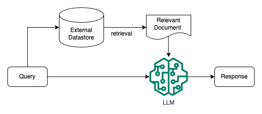
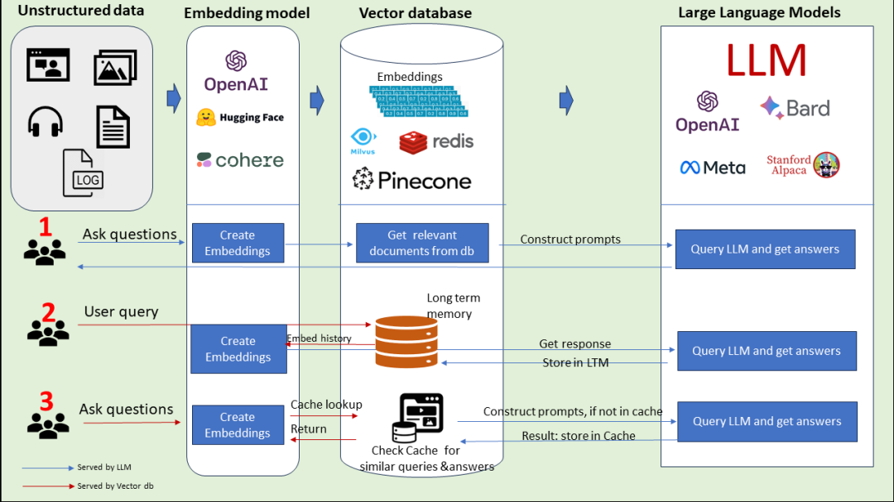
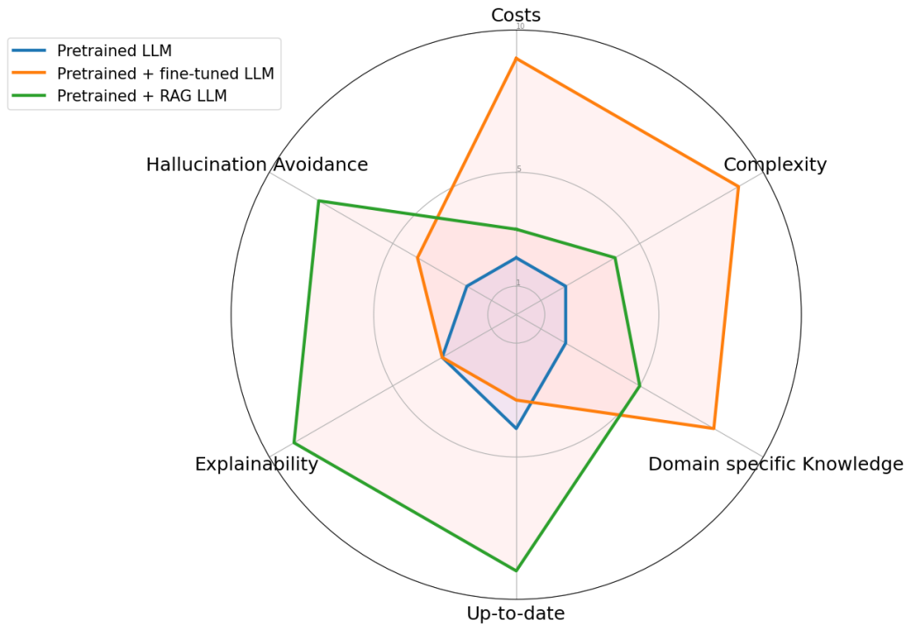

# rag（检索增强生成）技术

# 1.基本概念

**检索增强 LLM ( Retrieval Augmented LLM )**，简单来说，**就是给 LLM 提供外部数据库，对于用户问题 ( Query )，通过一些信息检索 ( Information Retrieval, IR ) 的技术，先从外部数据库中检索出和用户问题相关的信息，然后让 LLM 结合这些相关信息来生成结果**。下图是一个检索增强 LLM 的简单示意图。

传统的信息检索工具，比如 Google/Bing 这样的搜索引擎，只有检索能力 ( **Retrieval-only** )，现在 LLM 通过预训练过程，将海量数据和知识嵌入到其巨大的模型参数中，具有记忆能力 ( **Memory-only** )。从这个角度看，检索增强 LLM 处于中间，将 LLM 和传统的信息检索相结合，通过一些信息检索技术将相关信息加载到 LLM 的工作内存 ( **Working Memory** ) 中，即 LLM 的上下文窗口 ( **Context Window** )，亦即 LLM 单次生成时能接受的最大文本输入。

# 2.RAG解决的问题

> 参考资料：ACL 2023 Tutorial: Retrieval-based Language Models and Applications

### （1）长尾知识：

**对于一些相对通用和大众的知识，LLM 通常能生成比较准确的结果，而对于一些长尾知识**，LLM 生成的回复通常并不可靠。ICML 会议上的这篇论文 [Large Language Models Struggle to Learn Long-Tail Knowledge](https://arxiv.org/abs/2211.08411 "Large Language Models Struggle to Learn Long-Tail Knowledge")，就研究了 LLM 对基于事实的问答的准确性和预训练数据中相关领域文档数量的关系，发现有很强的相关性，即**预训练数据中相关文档数量越多，LLM 对事实性问答的回复准确性就越高**。从这个研究中可以得出一个简单的结论 ——\*\* LLM 对长尾知识的学习能力比较弱\*\*。下面这张图就是论文中绘制的相关性曲线。

为了提升 LLM 对长尾知识的学习能力，容易想到的是**在训练数据加入更多的相关长尾知识，或者增大模型的参数量**，虽然这两种方法确实都有一定的效果，上面提到的论文中也有实验数据支撑，但这**两种方法是不经济的**，即需要一个很大的训练数据量级和模型参数才能大幅度提升 LLM 对长尾知识的回复准确性。而通**过检索的方法把相关信息在 LLM 推断时作为上下文 ( Context ) 给出**，既能达到一个比较好的回复准确性，也是一种**比较经济的方式**。

### （2）私有数据

ChatGPT 这类通用的 LLM 预训练阶段利用的大部分都是公开的数据，**不包含私有数据，因此对于一些私有领域知识是欠缺的**。比如问 ChatGPT 某个企业内部相关的知识，ChatGPT 大概率是不知道或者胡编乱造。虽然可以在预训练阶段加入私有数据或者利用私有数据进行微调，但训练和迭代成本很高。此外，有研究和实践表明，**通过一些特定的攻击手法，可以让 LLM 泄漏训练数据，如果训练数据中包含一些私有信息，就很可能会发生隐私信息泄露**。

**如果把私有数据作为一个外部数据库，让 LLM 在回答基于私有数据的问题时，直接从外部数据库中检索出相关信息，再结合检索出的相关信息进行回答**。这样就不用通过预训练或者微调的方法让 LLM 在参数中记住私有知识，既节省了训练或者微调成本，也一定程度上避免了私有数据的泄露风险。

### （3）数据新鲜度

由于 LLM 中学习的知识来自于训练数据，虽然大部分知识的更新周期不会很快，但依然会有一些知识或者信息更新得很频繁。**LLM 通过从预训练数据中学到的这部分信息就很容易过时**。

如果**把频繁更新的知识作为外部数据库，供 LLM 在必要的时候进行检索，就可以实现在不重新训练 LLM 的情况下对 LLM 的知识进行更新和拓展，从而解决 LLM 数据新鲜度的问题**。

### （4）来源验证和可解释性

通常情况下，LLM 生成的输出不会给出其来源，比较难解释为什么会这么生成。而**通过给 LLM 提供外部数据源，让其基于检索出的相关信息进行生成，就在生成的结果和信息来源之间建立了关联，因此生成的结果就可以追溯参考来源，可解释性和可控性就大大增强**。即可以知道 LLM 是基于什么相关信息来生成的回复。

利用检索来增强 LLM 的输出，其中很重要的一步是通过一些检索相关的技术从外部数据中找出相关信息片段，然后把相关信息片段作为上下文供 LLM 在生成回复时参考。有人可能会说，随着 LLM 的上下文窗口 ( **Context Window** ) 越来越长，检索相关信息的步骤是不是就没有必要了，直接在上下文中提供尽可能多的信息。

# 3.RAG关键模块

为了构建检索增强 LLM 系统，需要实现的关键模块和解决的问题包括:

-   **数据和索引模块**：**将多种来源、多种类型和格式的外部数据转换成一个统一的文档对象** ( Document Object )，便于后续流程的处理和使用。文档对象除了包含原始的文本内容，一般还会携带文档的**元信息 ( Metadata )**，**可以用于后期的检索和过滤**。
-   **查询和检索模块**：如何准确高效地检索出相关信息
-   **响应生成模块**：如何利用检索出的相关信息来增强 LLM 的输出

# 4.几种RAG的调用模式

**模式一：** 非结构化数据通过Embedding Model把非结构化数据进行embedding存到向量数据库中，然后形成Construct Prompts给到LLM。LLM返回结果给到用户。

**模式二：** 用户提出问题，下一步把问题通过Embedding Model向量化，然后保存到长时记忆数据库（向量数据库）中，然后调用LLM完成问题的回答，接下来将大模型的回答存到长时记忆数据库中，最后返回给用户。

**模式三：** 用户问问题，下一步把问题通过Embedding Model向量化，然后从Cache中（向量数据库）查询类似的问题和答案，返回给用户。如果没有命中，则去和LLM交互。然后把LLM的回答存到Cache中，最后把回答返回给用户。

这三种形式就是典型的RAG的调用模式。它可以解决不同类型的数据如何让大模型知道的问题，同时在性能和效率上得到了提高，解决了长时记忆的问题，幻觉问题也有很大改善。

# 5.RAG vs. SFT

|       | RAG                                                                | SFT传统方法                                               |
| ----- | ------------------------------------------------------------------ | ----------------------------------------------------- |
| 数据    | 动态数据。 RAG 不断查询外部源，确保信息保持最新，而无需频繁的模型重新训练。                           | (相对)静态数据，并且在动态数据场景中可能很快就会过时。 SFT 也不能保证记住这些知识。         |
| 外部知识库 | RAG 擅长利用外部资源。通过在生成响应之前从知识源检索相关信息来增强 LLM 能力。 它非常适合文档或其他结构化/非结构化数据库。 | SFT 可以对 LLM 进行微调以对齐预训练学到的外部知识，但对于频繁更改的数据源来说可能不太实用。    |
| 模型定制  | RAG 主要关注信息检索，擅长整合外部知识，但可能无法完全定制模型的行为或写作风格。                         | SFT 允许根据特定的语气或术语调整LLM 的行为、写作风格或特定领域的知识。               |
| 缓解幻觉  | RAG 本质上不太容易产生幻觉，因为每个回答都建立在检索到的证据上。                                 | SFT 可以通过将模型基于特定领域的训练数据来帮助减少幻觉。 但当面对不熟悉的输入时，它仍然可能产生幻觉。 |
| 透明度   | RAG 系统通过将响应生成分解为不同的阶段来提供透明度，提供对数据检索的匹配度以提高对输出的信任。                  | SFT 就像一个黑匣子，使得响应背后的推理更加不透明。                           |
| 相关技术  | RAG 需要高效的检索策略和大型数据库相关技术。另外还需要保持外部数据源集成以及数据更新。                      | SFT 需要准备和整理高质量的训练数据集、定义微调目标以及相应的计算资源。                 |

与预训练或微调基础模型等传统方法相比，RAG 提供了一种经济高效的替代方法。RAG 从根本上增强了大语言模型在响应特定提示时直接访问特定数据的能力。为了说明 RAG 与其他方法的区别，请看下图。雷达图具体比较了三种不同的方法：预训练大语言模型、预训练 + 微调 LLM 、预训练 + RAG LLM。

