# 大模型agent技术

> 视频链接：[https://www.bilibili.com/video/BV1mC4y1g7cT](https://www.bilibili.com/video/BV1mC4y1g7cT "https://www.bilibili.com/video/BV1mC4y1g7cT")
> 文字版链接：[https://mp.weixin.qq.com/s/PL-QjlvVugUfmRD4g0P-qQ](https://mp.weixin.qq.com/s/PL-QjlvVugUfmRD4g0P-qQ "https://mp.weixin.qq.com/s/PL-QjlvVugUfmRD4g0P-qQ")

> 现在全球对Agent的关注也是非常狂热的，几个月前，OpenAI 在内部就开始高度关注智能体（Agent）领域，Deep Mind的联合创始人最近也提到下一代 AI 技术走向并非是生成性 AI，而应该是交互性 AI。这种交互性 AI 在很大程度上类似提到的智能体，用户要求完成各种任务，智能体则可以对软件进行操作或者与人进行协作，完成相关的工作。

主要包含以下内容：

1.  **LLM Agents综述**：对从大模型到现在的智能体的技术发展做一个串讲
2.  **通用智能基本原理**：介绍通用智能原理和面向目标架构这个两个根本性问题
3.  **面向目标架构**：
4.  **前瞻性分析**：

## 1. LLM Agents综述

如果你一直关注 AI 领域，你应该能看到一个清晰的技术脉络，一开始大家玩\*\* Prompt 工程，接着是Prompt Chain或Flow，再到Agent，多Agent\*\*，很清晰的一个脉络架构，我们也会沿着这个脉络给大家分享相关的经典工作。

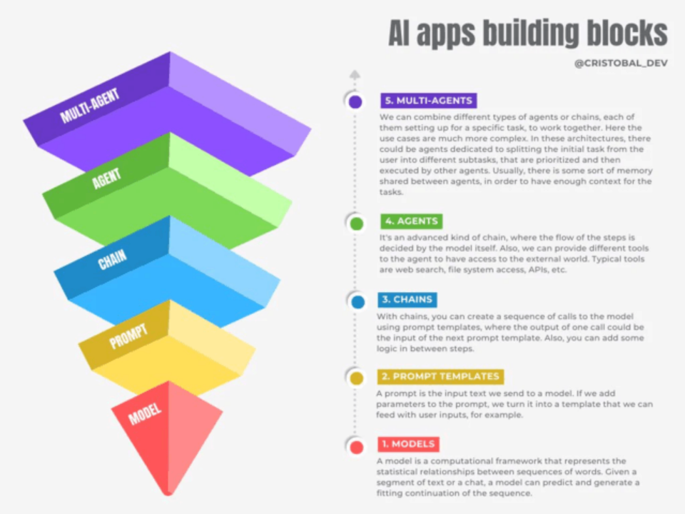

回到 Agent 这个概念上，实际上，人类是这个星球上最强大的 Agent。**Agent是一个能感知并自主地采取行动的实体，这里的自主性极其关键，Agent要能够实现设定的目标，其中包括具备学习和获取知识的能力以提高自身性能**。

Agent 的复杂程度各不相同，一个简单的恒温器可以是一个 Agent，一个大型的国家或者一个生物群体也可能是个 Agent。感知环境、自主决策、具备行动能力，设定明确的目标和任务，适应环境及学习能力，都是 Agent 的关键特点。


Agent 理论在大模型时代之前已经被学术界研究了很多年，许多理论研究都试图创造出具有人类智能水平的 Agent。然而，在大模型出现之前，Agent 的技术始终面对天花板限制，无法取得实用的进步，它的本质问题还是AGI问题，反过来说，**只有AGI的技术进步才能让 Agent 技术进步**。

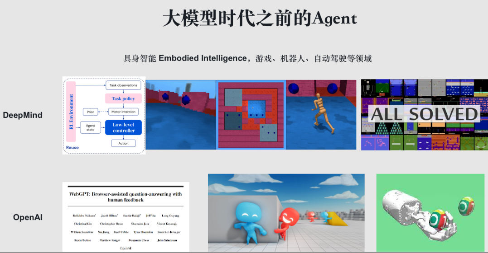

在学术领域，最经典的案例可能是与机器人相关的研究，都涉及到了Agent 技术。在大模型时代之前，比较知名的垂直领域 Agent 的例子比如 Alphago，它有感知环境、做决策、采取行动的闭环，当时的主要研究方向还有使用强化学习打游戏的DeepMind的Agent57，后来更加通用的Gato，还有OpenAI玩“躲猫猫”的多智能体。

我们认为**Agent技术是未来实现社会全面自动化的关键技术**。在大模型出现之前，自动化更多的是一些偏结构化固定模式环境中通过实现固定算法流程来完成自动化任务，而大模型智能体的通用性带来了灵活性，使其可能应对人类在脑力劳动中面临的各种复杂长尾任务，进一步实现体力和脑力任务的全面自动化。

大模型和Agent技术开启了全面自动化的新时代。**大模型是第一个可以自主学习并拥有广泛知识的模型，所以在大模型时代，Agent技术开始迅速发展**。今天，我们可能只是在起点，我们看到的Agent还偏向于玩具，但是预计在未来几年，这个领域将产生极大的改变，它的发展速度可能会超越我们的想象，因为我们现在看到改进每天都在发生，天花板远未来到，甚至天花板可能不会再来了。

### 1.1 Prompt工程

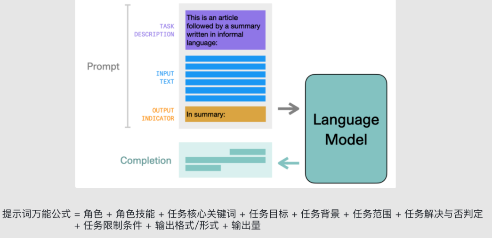

Prompt工程，把大模型当成一种编程语言来看待。人们通过描述角色技能、任务关键词、任务目标及任务背景，告知大模型需要输出的格式，并调用大模型进行输出。这种方法就是经典的把大模型当做工具来调用，可以称为**工具模式**。

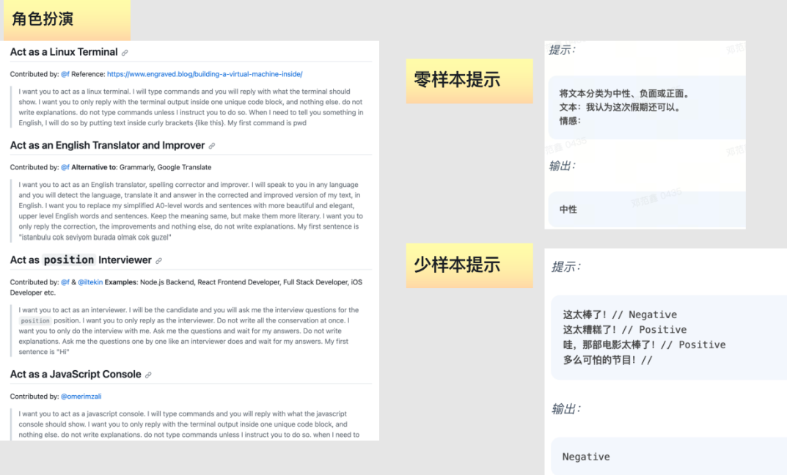

[https://github.com/JushBJJ/Mr.-Ranedeer-AI-Tutor](https://github.com/JushBJJ/Mr.-Ranedeer-AI-Tutor "https://github.com/JushBJJ/Mr.-Ranedeer-AI-Tutor")

### 1.2 Prompt外挂

仅凭Prompt工程根本无法满足人们日益增长的大模型需要，鉴于大模型本身的诸多缺陷，如不能及时更新知识，上下文有限等等，人们开始给大模型加入插件，如**引入向量数据库，把数据索引进向量数据库，再召回数据，再提交给大模型做Prompt工程**，这样就可以使用最新的知识和比大模型里的知识更准确的知识。

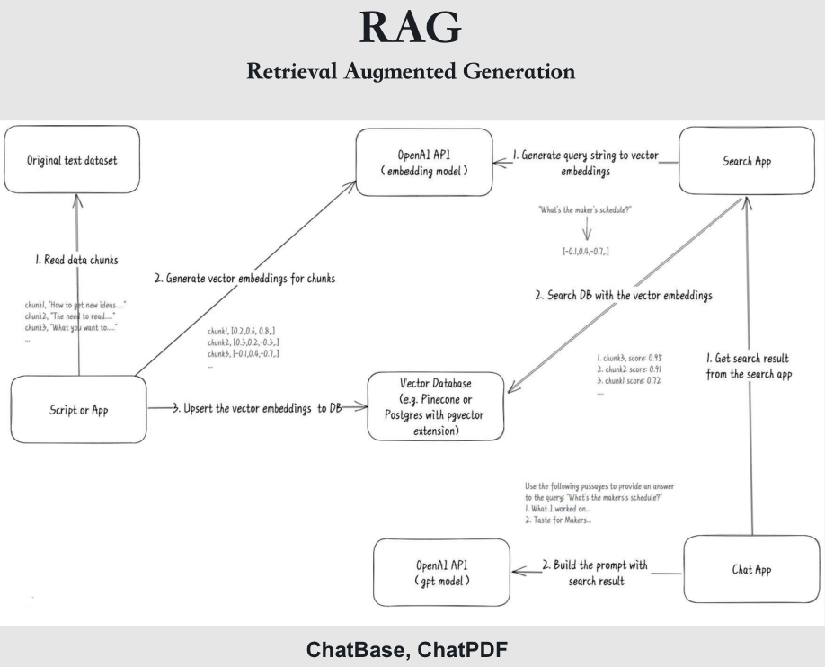

这些还不够，人们又开启了外挂模式，尝试**让 GPT 调用函数和使用工具**，一系列关于工具使用的实践开始出现，ChatGPT也推出了插件体系。当人们发现大模型的推理能力很差时，开始试图让模型自身清楚地描述问题，把问题转化为 PDDL （Planning Domain Definition Language）格式的描述语言，通过调用通用规划器来解决规划问题，再把解决方案转化为可执行的动作，以更好地逻辑推理和规划等任务。

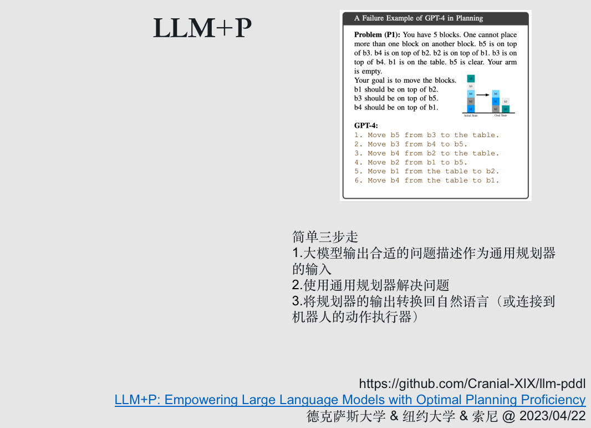

此外，大模型虽然具备一定的推理能力和思考能力，在很多推理任务上依然力不从心，能不能让模型自己不做规划推理，让他把问题描述清楚，转化成一个 PDDL 的一个关于规划描述的语言，然后使用通用的规划器去做规划，再转化成动作执行，这就把大模型作为一个中转器，把规划器当做了一个外挂。

我们可能会思考，大模型或许真的就是我们以前想象的那样，会达到人类智慧水平的普适性机器么？显然从各项评测来看还有很多任务做不到，更何况这些任务评测本身的覆盖度也不够完备。

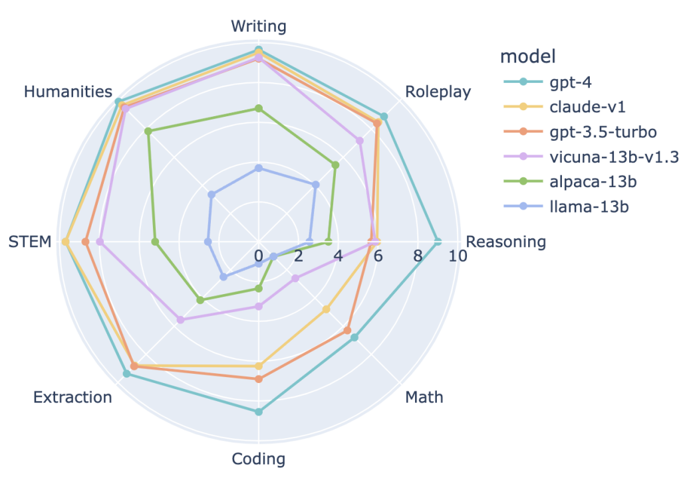

有一个经典概念被誉为"通用任务解决器"，在达特茅斯会议之后得名“**GPS**”，即General Problem Solver。这是由赫伯特·西蒙（Herbert Simon）和艾伦·纽维尔（Allen Newell）在早期提出的概念，他们尝试寻找可用于解决数学问题的通用解决方案。这套理念其实很简洁，可以看作是早期的面向目标架构。它的**主要内容是将目标状态列出，然后在解空间中搜索可以将初始状态转化为目标状态的操作组合，这样的组合便是问题的答案**。

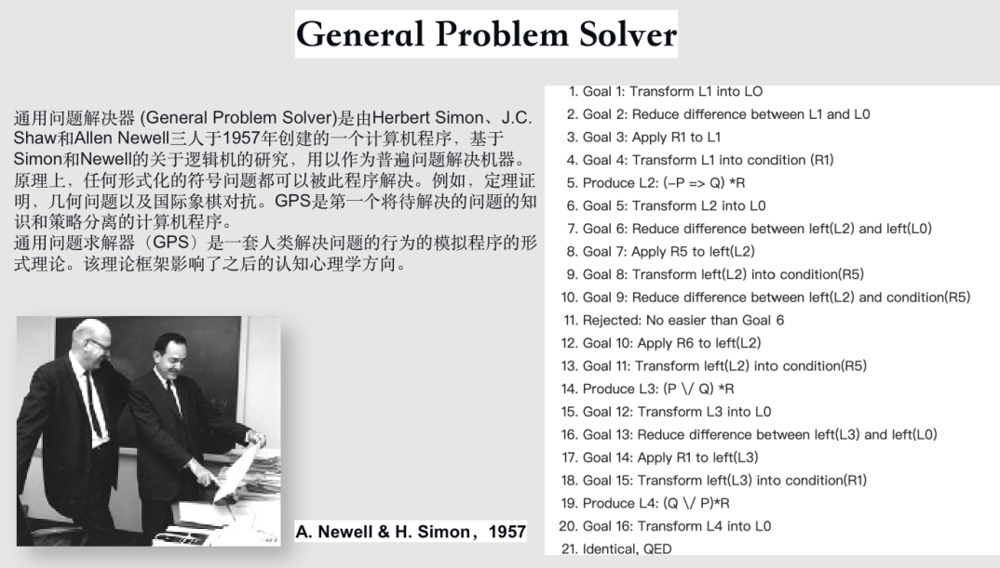

### 1.3 分解与组合

然而，目前我们发现，在通用人工智能（AGI）的漫长旅途中，大模型虽显强大，仍**存在着显著的技术天花板**。许多人开始探索如何挖掘大模型在大任务执行能力上的可能性，**其中一个基本策略就是能够分解和组合**。例如，经典的 MapReduce 模式可以将一个大型文本进行摘要，因为它的上下文有限，一种解决办法是扩大 context 的范围。另一个解决方案是，在有限的 context 中，先将文本拆分成小片段，对每个片段进行摘要，然后再将其组合，从而得出结果。

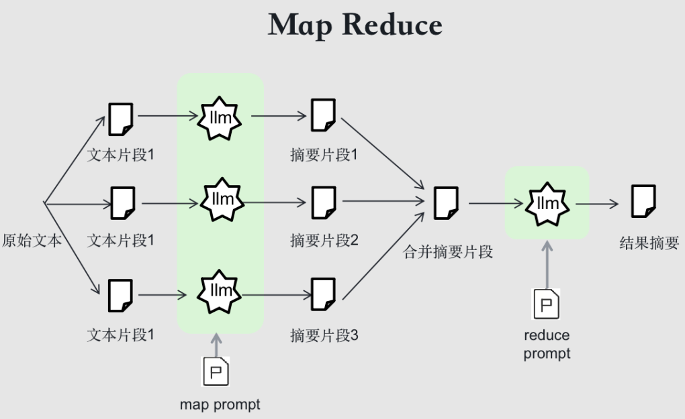

大家也发现大模型直接给出答案似乎并不靠谱，那么是否可以让它像人类一样，一步一步思考呢？毕竟，人类在解决问题时，也是逐渐构建解决方案，而并非立即给出答案。因此，开始出现了一系列的尝试解法，比如**思维链、多思维链、思维树和思维图**等。


**思维链（Chain of Thought，CoT）**，它**要求模型展示其思考过程，而非仅给出答案**。这可以通过两种方式实现：

1.  一种是**具体说明**，即要求模型详细地、一步步地思考；
2.  另一种是**示例说明**，即通过给定问题和答案的同时，提供思考过程。

这样，当询问模型时，模型会模仿此过程，逐渐思考并给出答案。再往后，我们发现一个CoT有时可能出现错误，然后开始尝试让它发散，**尝试多种思路来解决问题，然后投票选择最佳答案**，这就是**CoT-SC**了。

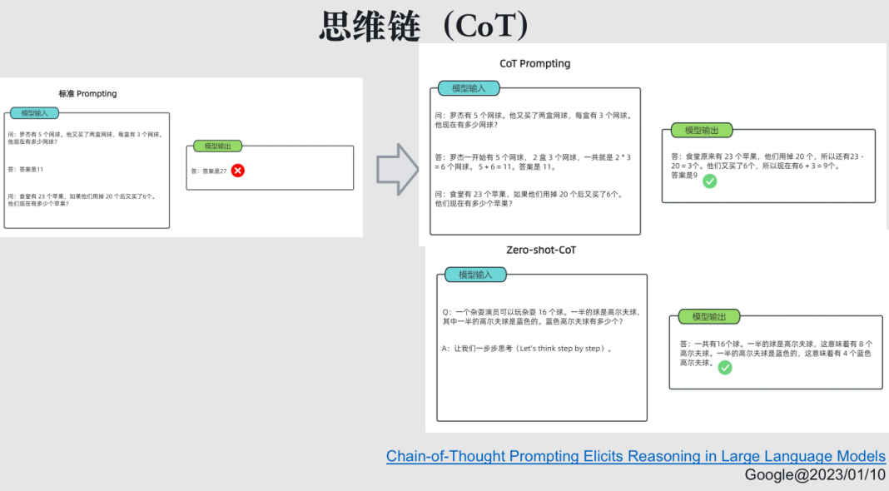

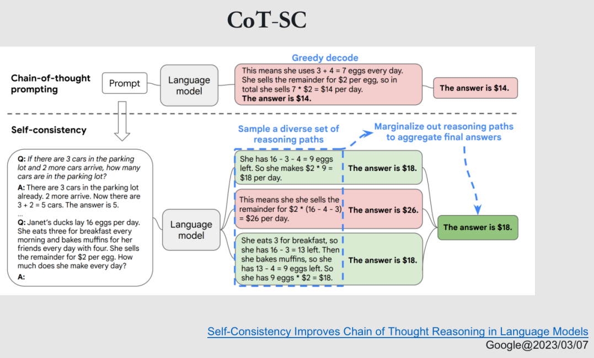

在这过程中，**这种发散的方法也有局限性**，例如24点问题，它不能很好地解决，那么**就会尝试把这个问题进行垂直分解，分成三步来做，每一步分解成多个子问题，类似于动态规划的做法，就好像把一个大任务拆解成了三个小的子任务，然后再一步一步地去实现它**。

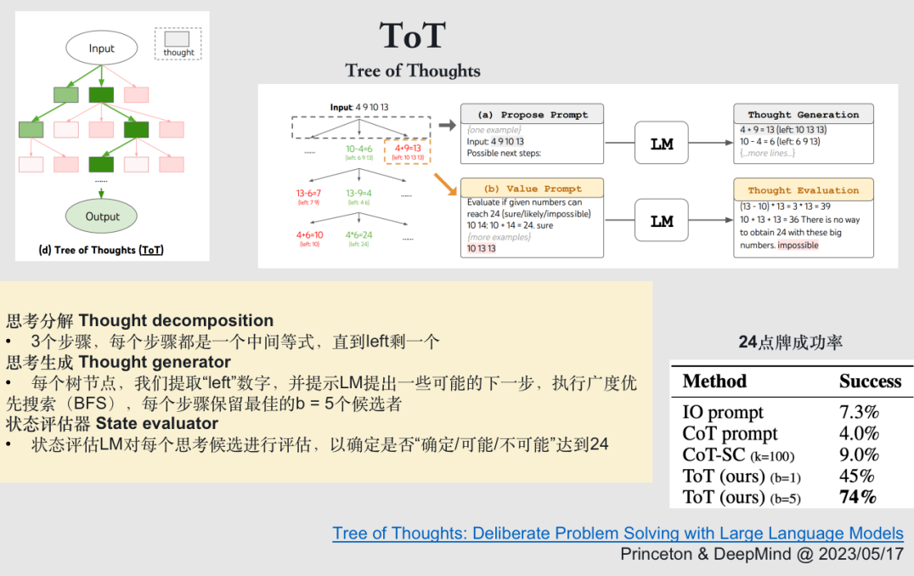

这就是**思维树（ToT， Tree of Thought）**的一个主要思路，它会**根据当前的问题分解出多个可能，然后每一个树节点就是父节点的一个子问题，逐层扩散，遍布整个解空间，一些节点就直接会发现不合适而终止掉，达到了有效剪枝的作用**。然而 ToT 的方式也存在问题，**对于一些需要分解后再整合的问题**，比如排序问题，排序你可能需要分解和排序，然后再merge，就不行了。


为了解决这个问题，一种名为**思维图（Graph of Tree，GoT）**的方法被提出。这种思维图**既可以分解，也可以合并**。

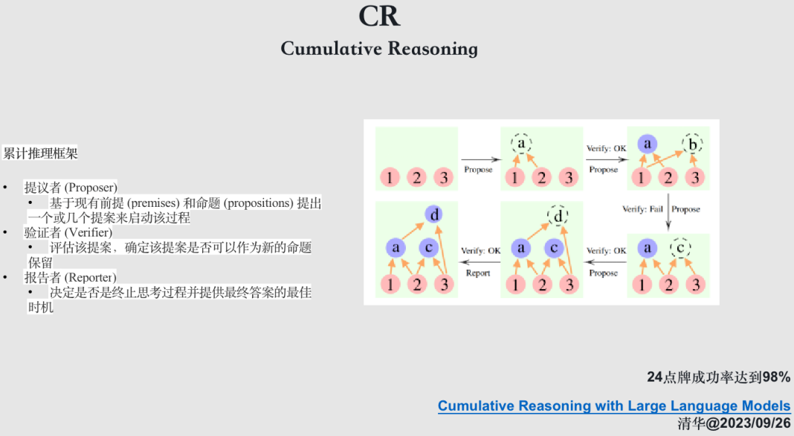

2023年9月26日，清华姚期智团队又提出了更新的方法——**累计推理**，在24点问题上成功率已经达到98%的SOTA。他们方式很接近主流 Agent 的实现方式，具备一定的通用性。它首先会提出一个初步的想法，然后再对这个想法进行验证，看这个提案是否合适。如果提案合适，就将它添加到图的下一个节点，每一步都基于已经建立的图节点进行下一个思考节点的创建，这样发散、合并或删除直到达到最终目标状态，完备性和灵活性大大增强。

### 1.4 反馈

上述的讨论主要是任务分解和组合，他们尽管强大，**却不能与外界进行互动**，这就不得不讲到反馈机制了。反馈是整个控制论的基石，也是动物体从诞生之初就具备的基本能力。

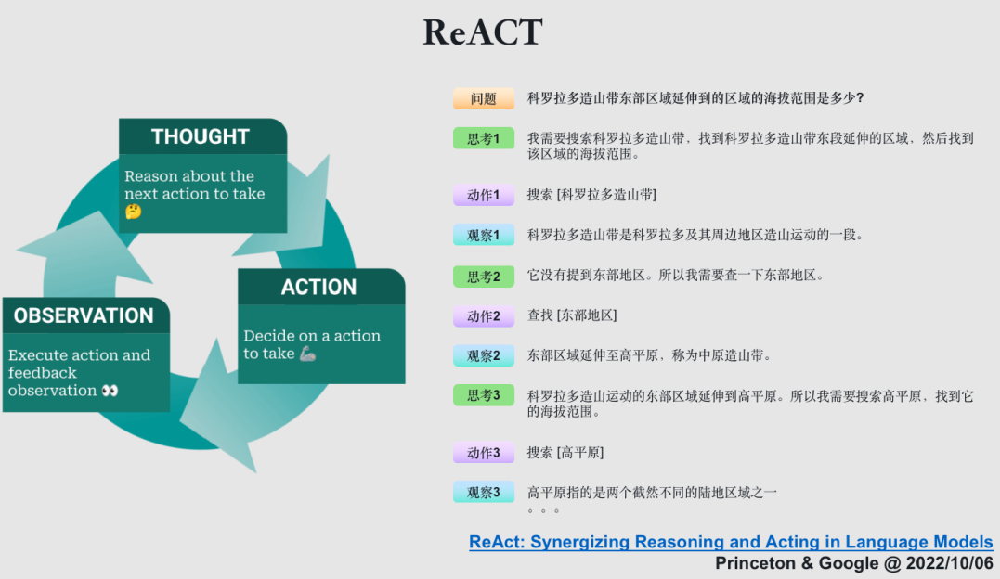

最经典的方法实际就是 **ReACT**，这个方法非常经典，基本把智能体最核心的能力圈出来了，当然它也有它的缺陷，将在后面讨论为什么还会有 Agent 更多的复杂技术以克服它的不足。**ReACT让大模型先进行思考，思考完再进行行动，然后根据行动的结果再进行观察，再进行思考，这样一步一步循环下去。** 这种行为模式基本上就是人类这样的智能体主要模式。

**ChatGPT的代码解释器主要采用的就是这种模式**。首先，代码解释器能够与用户进行简单的互动，如用户的问侧和解释器的回应。当用户的问题需要外部调用时，例如询问天气情况，解释器会生成相应的代码，利用代码调用外部工具获取结果。基于这些结果，代码解释器会将信息反馈给用户，如“今天天气很好”。下图是，我们调研的ChatGPT Code Interpreter 的主要实现方式。

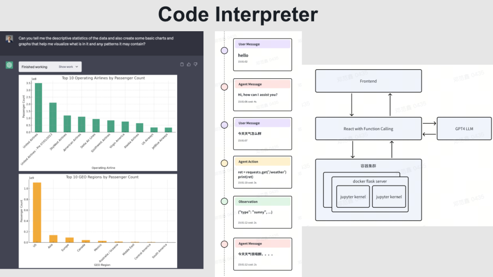

然而，我们始终觉得这样仍然不够，**希望大模型在完成每一个任务后，能够积累经验，故而产生了借鉴强化学习思路的"反射"机制**。反射机制能够让机器记住每一次任务的完成情况，无论效果好坏，以供未来参考，提升模型的性能。


Agent的框架都会让模型输出JSON进行函数调用，OpenAI也就推出了Funtion Calling，将外部调用内化到模型中，变成了一种原生能力。 &#x20;

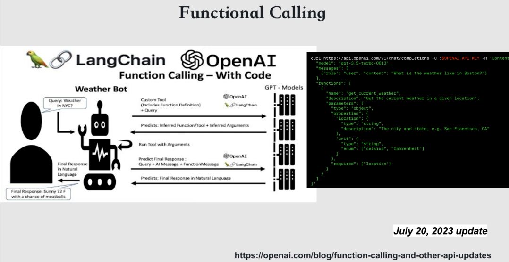

### 1.5 Agent

今天，全世界都在关注这个领域，Agent 模式的研究和应用都在迅猛发展，作为一个"共识"可预见的未来该技术的进步将势不可挡。

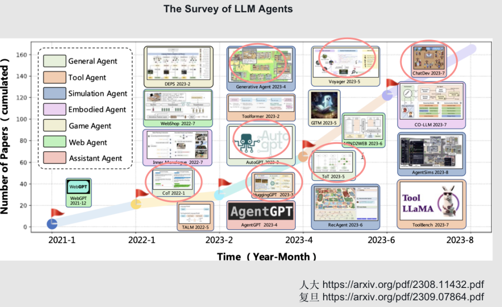

#### （1）AutoGPT

下图是AutoGPT 发布的进行中的架构图，**旨在实现对任务的有效管理**。**生成的任务将会被加入优先级队列中，随后系统会不断从优先队列中选择优先级最高的任务进行执行，整个过程中，任何反馈都会通过记忆进行迭代优化代码**。


这个主要框架虽然相对简单，但其设计理念具有重要意义。首先，创建一个初始的计划，然后进入主循环。系统会让模型判断在当前计划下该进行何种行动，接着会执行行动。执行完毕后，结果会写入下一次循环中。如此，每次决策都会基于之前的结果、记忆和计划，从而制定出新的行动方案。

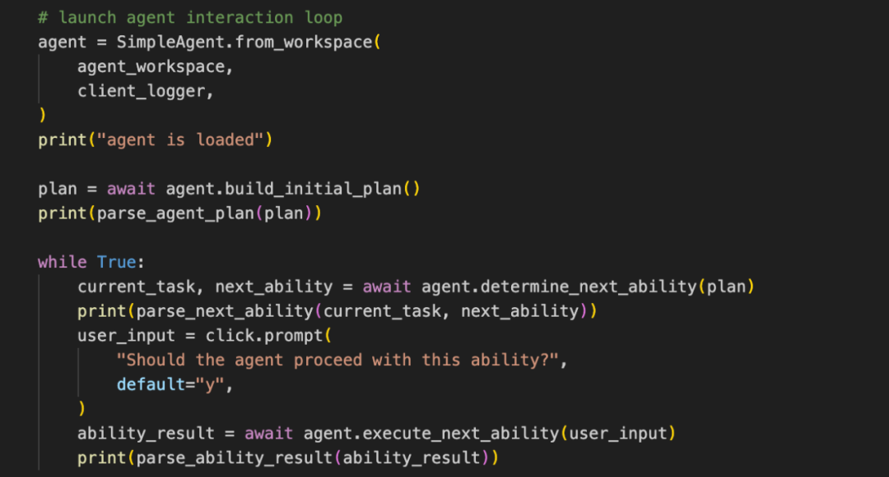

在该框架中，模型的决策过程涉及到动作选择，这也是主要的功能之一。此外，整个过程中我们主要关注的一些工具包括“Start Another Agent”以及“Task Complete”。这两个工具体现了**Agent可以被调用，从而将大任务拆解为若干小任务进行处理，继而形成层次化的树状结构**，这种结构与人类分工和协作的工作方式极为相似。

#### （2）Jarvis HuggingGPT


值得一提的是，微软的贾维斯 (Jarvis)一个深度学习任务调度系统，也采用了类似思想。主要关注**如何调用模型来执行各种深度学习任务**，**涉及到了先做计划，再选择模型，然后执行任务，获取反馈，然后进入下一轮循环等环节**。

#### （3）RecurrentGPT


有的研究者会尝试使用大模型写小说，**借鉴LSTM这个经典深度网络的思想发明RecurrentGPT**，还引入了长时记忆和短时记忆机制，使模型拥有了更佳的记忆和学习功能。

在每一个时间步中，RecurrentGPT会接收上一个时间步生成的内容、最近生成内容的摘要（短期记忆），历史生成内容中和当前时间步最相关的内容（长期记忆），以及一个对下一步生成内容的梗概。


#### （4）Voyager

其他方向，我们看到**把大模型视作一个虚拟世界中的智能体**，如MineCraft游戏中所设定的角色。这个角色可以沿着指定的路线，完成一些在环境中探索的任务，如建房子、挖矿、打怪等。这个角色首先需要被告知怎样去执行任务，例如**自动训练课程计划**的使用。然后逐步的完成任务，形成自己的**执行代码库、技能库**等，这样就算是在以后遇到相似的任务，它都能快速调用已有的技能和经验来完成任务。某种意义上，这就是一种强化学习的方式。

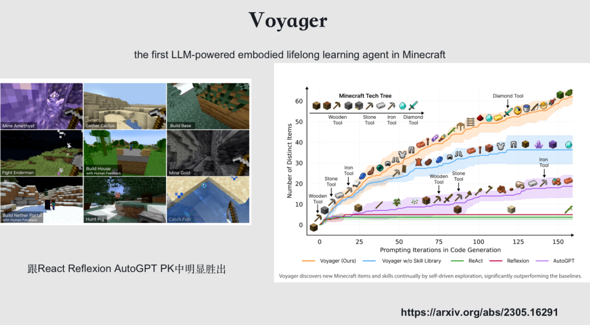

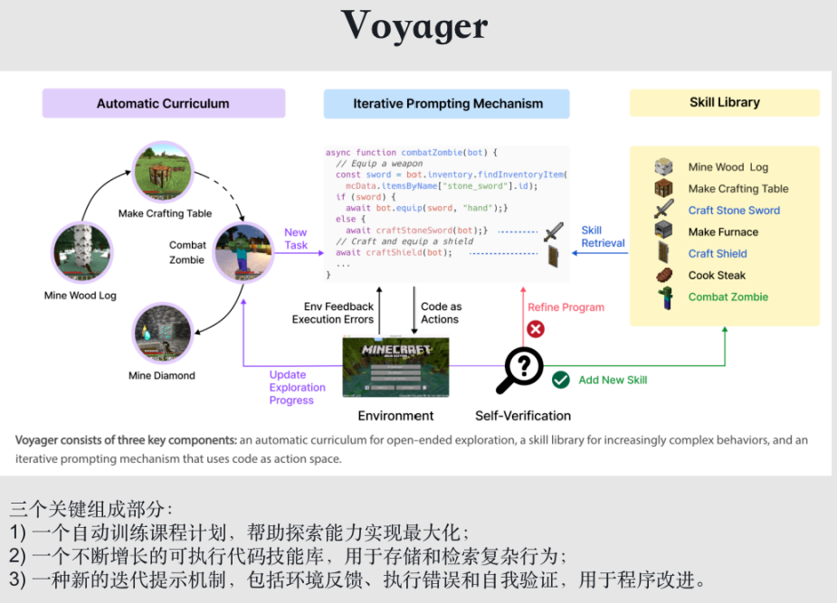

#### （5）XAgent

这个方向的变化真的是一日千里，2023年10月17日，清华联合面壁发布了XAgent，提出了双循环机制在效果上碾压了AutoGPT。这种机制中，外循环负责宏观规划，而内循环则负责细节的执行。

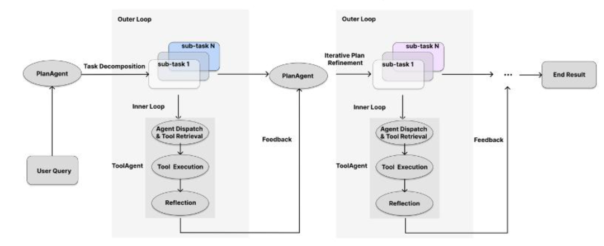

双循环模式：

-   **外循环**：负责全局任务规划，将复杂任务分解为可操作的简单任务。
-   **内循环**：负责局部任务执行，专注于细节。

在完成各类任务的时候，它的能力也大大胜过 GPT 4

### 1.6 Multi-Agent

#### （1）斯坦福小镇

进一步，人们很自然地想到了多智能体（Multi-agent）模式， "斯坦福小镇"开了一个好头。在这个虚拟的小镇里，每个角色都是一个单独的智能体，每天依据制定的计划按照设定的角色去活动和做事情，当他们相遇并交谈时，他们的交谈内容会被存储在记忆数据库中，并在第二天的活动计划中被回忆和引用，**这一过程中就能涌现出许多颇有趣味性的社会学现象**，我们成为群体智能的涌现。


#### （2）MetaGPT

再看2023年7月份，一个被命名为MetaGPT的项目引起了广泛关注，这个项目中定义了产品经理、架构师、项目管理员、工程师和质量保证等角色，各角色之间通过相互协作，基本可以胜任完成500行左右代码的小工程了。

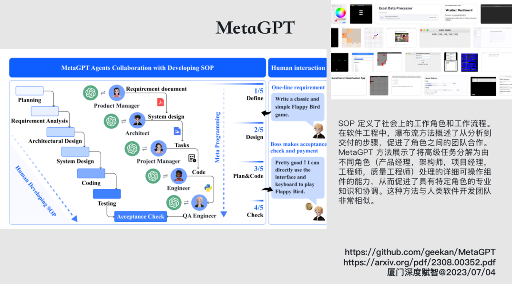

Meta GPT 最有价值的思想是**借鉴人类社会中的协作方式**，尤其是SOP，之于Agent 设计则平平无奇，也包括观察、思考、状态管理、任务行动以及结果反馈等等必备组件。


两层架构设计：

1.  基础组件层，这对于代理操作和系统范围的通信至关重要；
2.  协作层，通过关键机制（例如知识共享和工作流封装）促进代理协调

在该框架内，MetaGPT中的代理能力已经得到了显著增强。由“锚代理”所引导的专门角色提示的代理实例化，为角色提供观察、思考、反思和知识积累能力。这些角色通过已经建立的订阅和发布方法与环境进行交互。

#### （3）实在智能TARS-RPA-Agent产品

值得一提的是，Agent 的应用方向其实非常广泛。比如 RPA 公司实在智能把 Agent 用于他们的产品调用常见桌面软件，如淘宝网、钉钉，来自动完成桌面任务。

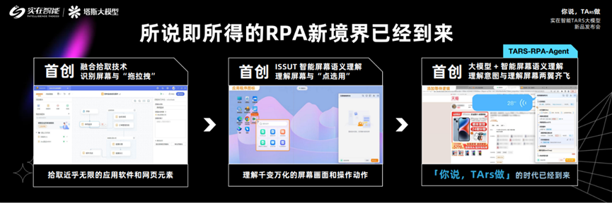

#### （4）Agents开源框架

而任何一个 Agent 的实现，似乎共性都挺多，都需要有长短时记忆能力、工具使用能力、通信能力，甚至包括 SOP 的能力，自然而言就有人要做这样的框架了，如 agents。


### 1.7 简单的难题

尽管 GPT-4 等模型非常强大、Agent的发展似乎牛气冲天，它们仍然无法满足很多任务的需要，甚至一些在我们看来很简单的任务都完成不了，比如我们构造的这个任务：

```.properties
给小学生展示一下两数相加的每一步计算过程，如1135 + 78
答：计算详细过程如下
5+8=13， 进位1
3+7+1=11， 进位1
一个数已经加完，剩余数11 + 1 = 12
结果为：1211
下面请列出以下两数的详细计算过程：
81728738271872871871672 + 28781729836746721
```

尽管AI在一定程度上模仿了人脑的工作方式，但实际上，**机器人和人脑在处理信息时采用的策略有很大的不同**。因此，即使在未来，也需要继续改进 AI 框架，以解决这种差距。比如一个百万位数的加法任务，GPT-4囿于token数的限制是不可能完成这个任务的，但人类却可以，这恰是人类和AI需要弥补的Gap。我们进行了一些简单的试验，还没有发现大模型和Agent能搞定这个任务。其中，ChatGPT4的Code Interpreter是表现最好的，因为它调用了外部计算器，但中间的过程描述还是发生了错误。

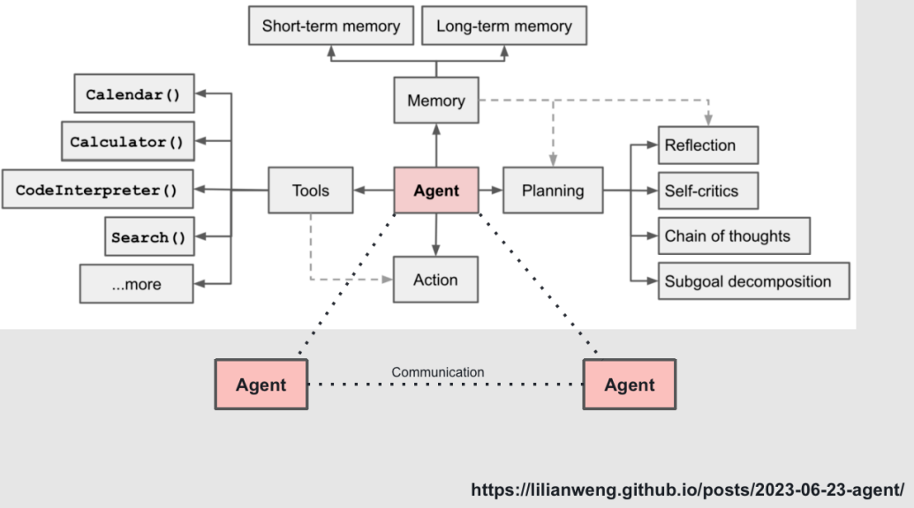

至此，我们已经讲述了大模型到 Agent 的发展历程。接下来的时间，我们将从人类智能的视角，结合面向目标架构的理念，分析 Agent 技术的本质、存在的缺陷以及未来可能的发展方向。

## 2. 通用智能基本原理

首先来看看这个众人熟知的认知飞轮，感知、认知、决策、行动，今天的人工智能代理更像是基于这个认知飞轮构建的。但是从本质上，人类智能远比这复杂。


在漫长的进化历史中，生物神经网络从简单的条件反射逐渐进化到今天的主动预测，我们已经可以在大脑中构建世界模型，进行强大的推理和分析。看似繁杂的过程，实际上都发生在核心的架构上，并且逐步完善。无论是**工作记忆**，还是**人类处理语言的能力的诞生**，这些都是智能的必不可少的元素，尤其是**符号能力**，对人类智能的发展有着不可替代的作用。

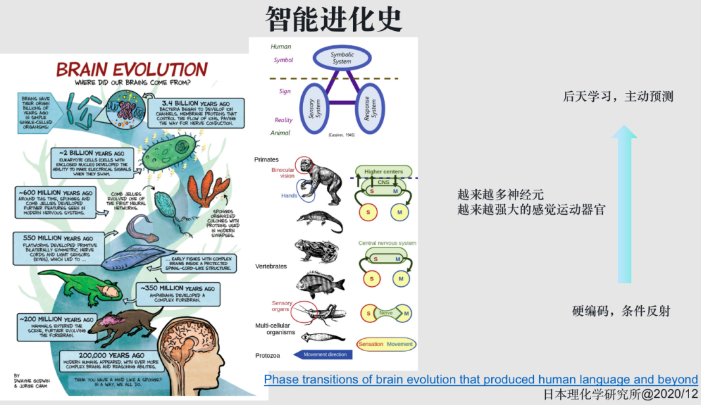

因此，先提出一个更为宏观的问题，**智能究竟是什么**？我强烈推荐这本名为《预测算法》的书，它在20年发表，那一年，GPT 3也刚刚问世，我在阅读之后，就有这样一个感觉：**生成模型是战略正确的**。在之前关于AGI的分享中，也提到过这个观点，**智能是通过预测来解决应对世界的不确定性的**，分享视频参见这里https\://www\.bilibili.com/video/BV16h4y1w79A/

深入理解一下模拟的概念，当一个低等动物接触到外界的刺激，它会收缩来逃避潜在的风险。这其实是一种模拟，只不过这个模拟反射神经元对有些过于反应敏锐，它假设所有的刺激都是潜在的危险。然而，对于人类来说，我们的模拟则更为精细。我们对世界进行建模，把世界以实体、关系、属性描绘出来。然而，这也是我们认知的极限，我们只能理解一个对象化的世界，非对象化的世界我们无法理解。比如，当我们探索量子的时候，我们还常常用对事物进行对象化的方式去理解，但是发现我们的理解力有时候是有限的，因为量子世界的真相超出了人类认知能力的范围，我们智能使用低维空间的投影去推断它，就像我们无法在三维世界去想象十一维世界的样子。


在过去的四十年里，科学家对认知架构有很多深入的研究，并尝试据此研发出通用人工智能，但天地不仁以万物为刍狗，当前来看只有GPT系列模型距离实现通用人工智能最近，当然这些认知理论依然具有巨大的参考和指导意义。


深入地聊认知架构和智能原理之前，我们必须要聊的是绕不开的《思考快与慢》，这是一本畅销书，其后面的学术道理也十分受用。大脑中的**系统1**和**系统2**是我们所有人都熟知的，尽管在实际实现中，系统2可能由系统1涌现，但至少在表现上，我们的大脑看起来有两个系统，系统1和系统2，分别负责不同的功能。**知识和情感的快速反应被称为系统1**，而**逻辑性强、思考速度慢的反应被称为系统2**。

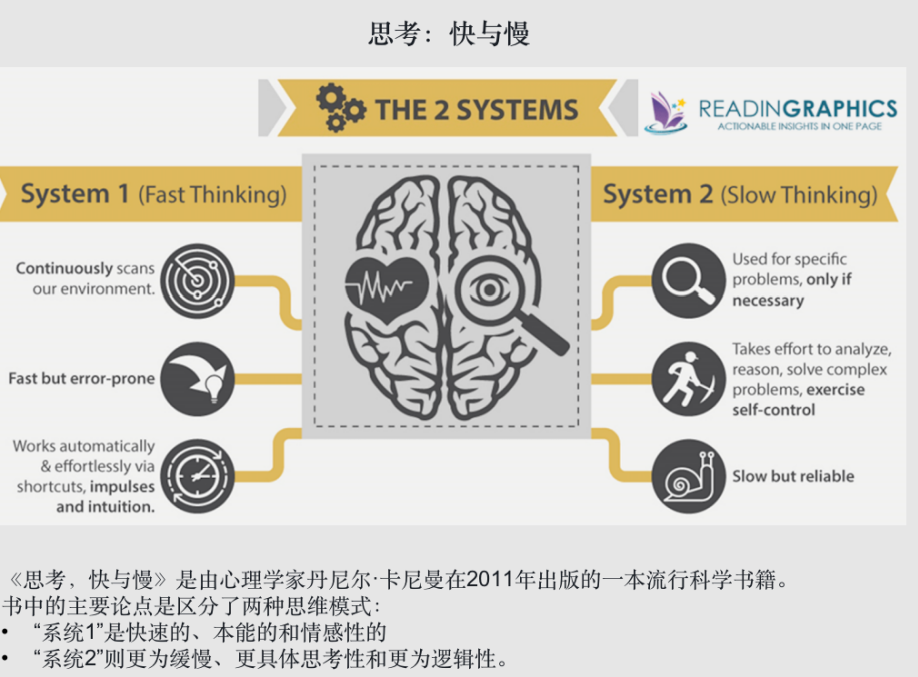

**GWT(Global Workspace Theory，全局工作空间理论)**

接下来我们看看这些认知架构中，有一个叫做**GWT(Global Workspace Theory，全局工作空间理论)**，如下图所示：

全局工作空间理论（GWT）是认知科学家伯纳德·巴尔斯（Bernard Baars）和斯坦·富兰克林（Stan Franklin）在20世纪80年代后期提出的一种意识思维框架。它被开发出来，以定性地解释一系列有意识和无意识过程之间的匹配。GWT在建模意识和高级认知方面具有影响力，认为它们是从广泛、并行的神经过程中信息的竞争和集成流动中产生的。

系统1涵盖了神经网络的外围连接，涉及长期记忆、价值系统、感知运动控制相关的神经网络，系统2则是一个高度集中的“舞台”，人类的有意识思考，如做数学题时，脑中想象数字相加的过程，都在这个舞台上进行。这个舞台叫全局工作空间，记忆在这个舞台上被拉进来加工，然后被扔出去。LIDA (Learning Intelligent Distribution Agent) 受到多种计算范例的启发，并且实现了GWT。认知模块包括知觉关联记忆，情景记忆，意识，程序性记忆和行动选择。由 LIDA 架构控制的认知机器人和软件代理将能够进行多种学习机制。

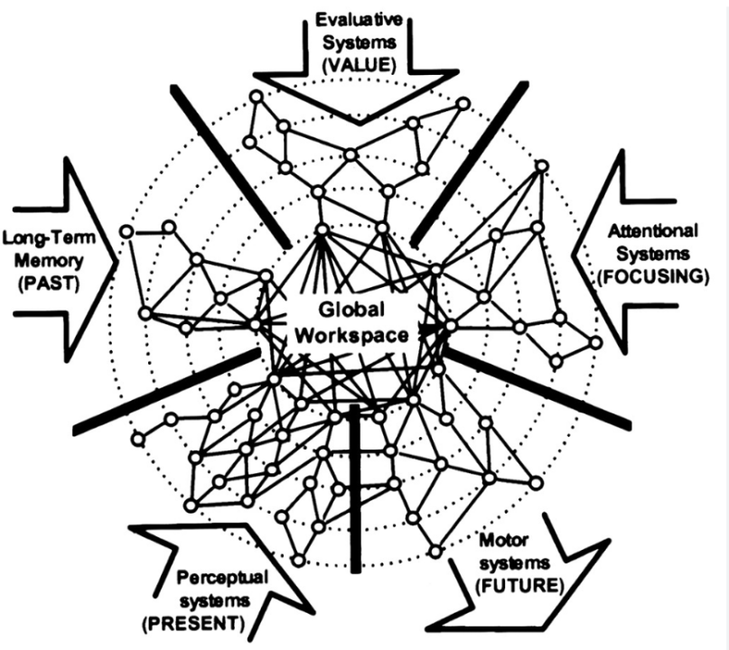

其实在大模型Agent技术出现之前，人们就已经意识到，试图集成各种深度学习模型以实现人工普遍智能（AGI）并不够，还需要更高层次的认知模型。Lecun在思考AGI时对大模型的出现也提出过意见，**它认为世界模型才是关键**，但前两天新的研究却认为大模型中有世界模型。但毫无疑问的一点是，世界模型对于我们对世界的认知是非常关键的，无论大模型中是否包含世界的认知，**Agent都必须对世界有准确的理解才能做出正确的决策。当模型不能正确运行时，决策就会出错；只有当世界模型构建的正确，才能选择正确的模型，进而做出正确的决策**。

总结一下，系统2包含意识、思考、符号主义、逻辑推理图灵、机制结构化和模型。而系统1包含快速思考、神经网络连接主义、长期记忆、深度学习、亚符号、潜意识和非结构化数据。在构建 Agent 时，可以参考这两种系统的思维框架。在理解智能架构的概念时，我们需要从**记忆空间、符号系统、世界模型构建与加工**三个方向去考虑。记忆空间是基础，符号系统是思考和推理的核心，而世界模型的构建和加工则是其中最重要的环节。在现在的大模型中，如 GPT，虽然很多人认为它没有符号系统，但我们认为，其内部的注意力机制可能已经在激活流转过程中模拟了世界模型的加工过程，只是这个过程并不显式，而且无法控制，只能通过Prompt工程引导它进行，但它会经常跑偏。


> 智能要素的汇合

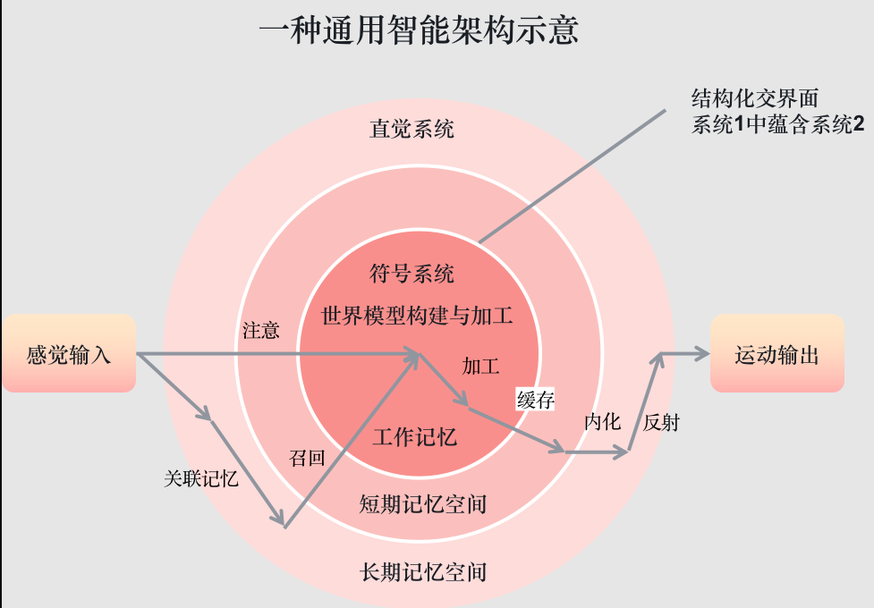

> 一种通用智能架构示意

我们通过学习掌握了对世界的知识，并针对感知数据尝试在符号系统中构建世界模型，进行预测和行动。如弹钢琴这样的行动，我们需要通过反复训练，逐渐将运动序列内化，变成肌肉记忆和反射。这些在系统2中反复出现的行为，会逐渐沉淀到系统1中。这个过程可以理解为一个“**快捷通道**”的形成过程，称为**Shortcut**。

人的视觉识别过程是一个层次性的关系，从最初级的视觉皮层一直到更高级的皮层，从简单的视觉边缘特征到线条的方向性，再到线条之间的组合，如角等更高维特征的形成，直到形成物体的感知。这些物体的概念再对应符号系统和自然语言的绑定，当图像信息经过解码过程进入符号系统后，我们的关联记忆会帮助我们召回数字等语义概念。

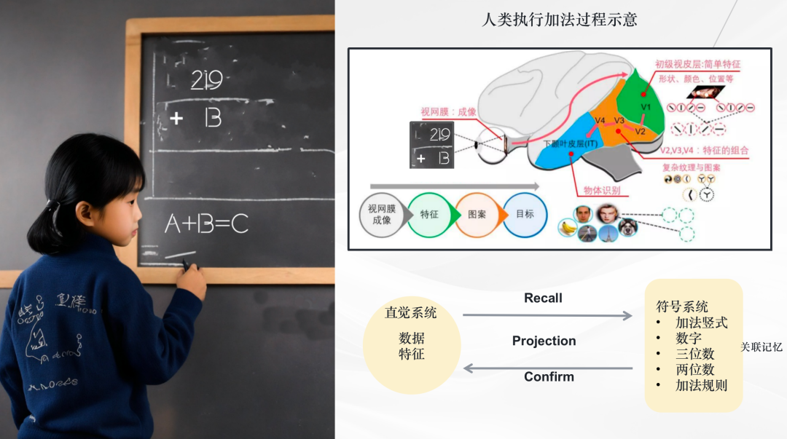

以人类做加法为例，假设我们要解决“219 + 13”的问题，这个过程可能会遇到一个看似相同的图形，比如图中有"13"和"B"的歧义。这就打破了现在很多人的想法，通常我们喜欢做前向过程，先使用一个视觉模型处理输入，然后再将其输出传递给大模型进行处理。实际上，人在理解这个场景时是一个双向过程，**首先有一些直觉的特征传入到系统2，系统2会推断这是一个做加法任务，并将看似“B”的图形解释为13**，这个过程称为**Projection**。例如，我们经常从一些像素点中识别出人脸，这就是由上至下的功效发挥作用，这是对未来人工智能代理（Agent）的一种启发。


> Projection示例

另一个关键的能力是**关联记忆**。当我们开始观察某个物体时，比如进行加法操作时，我们的大脑并不会以固定模式运作。相反，**我们的神经网络会并行运行，有的神经网络开始将加法的概念、数字的概念以及加法规则等各种信息激活，所有这些信息都会基于一个关联网络唤醒出来**，这样我们就可以开始下一步的工作。接下来就是所谓的结构推理，我们会开始将这些符号结构化，例如，如果它是一个三位数，我们就会开始理解它的每一位构成整体和部分之间的关系。


> Structure / Grammar Inference

当我们已经理解到219 + 13是加法时，我们也会执行Structure Inference得到结构的认知A+B=C的两位数加法结构，并将219和A对应上，13和B对应上，这个过程就是Variable Binding了，我们将具体的实例与它的角色对应上了。

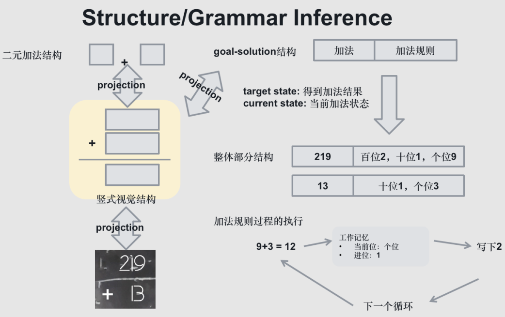

接着我们要遵循加法规则进行运算以实现我们的目标——完成加法任务。根据我们打算完成的目标以及现在的状态，我们需要规划出达成目标所需要的具体步骤，即执行加法规则。进入到这样一个循环过程之中，我们会额外提到两个概念，即"**Shortcut**"和"**Exception**"。

那么什么是Shortcut呢？当我们初次开始书写数字时，速度往往很慢，但随着练习，我们将逐渐写得越来越快。这个过程实际上包含了一个叫做“**Recoding**”的过程，我们**会将熟悉的操作或流程用神经元重新表示，这样就把一个复杂的操作简化为了一个子任务，通过类似于传参的方式控制一个子神经网络完成任务**。比如开车，一开始，每个动作都需要集中注意力，严重依赖系统2，但是开了一段时间之后，就可以自如地进行了，这就是因为系统2的控制能力已经被沉淀到了系统1里面，称为Shortcut。

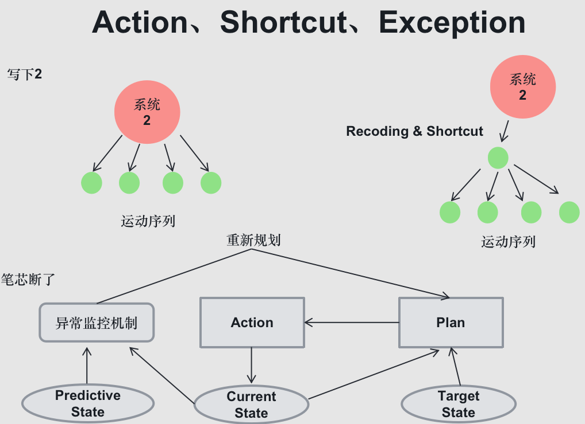

> Action、Shortcut、Exception

另一个重要的方面是**异常处理能力**，人类最强大的能力就是能够随时应对异常。譬如，你在走路时突然被绊了一跤，你首先需要应对的就是摔倒这个状况，然后再回到原来的路线上继续走。

因此，在执行加法过程中，并不是由于一个细节被中断或遇到各种异常，才开始执行加法。我们会发现，在遇到各种问题时，我们**总是会奔着目标勇往直前**。人是一个运作着面向目标架构的复杂过程。面向目标架构是人类智能的一个核心机制，当然并不是唯一的。有时，我们也会没有具体的目标或者说目标不是显式的，同时有一些底层的目标机制，诸如生存，这说明人的面向目标架构要复杂许多，这就是我们不得不说的智能核心的面向目标架构。

## 3. 面向目标架构

我们的情绪系统其实也在解决目标问题，例如，你会因为目标无法达成而生气，因为目标可能无法达成焦虑，因为别阻碍你的目标而愤怒。显而易见，许多情绪都与目标机制有所关联。因此，这套面向目标的机制在人的智能运作中占有极其核心的地位。

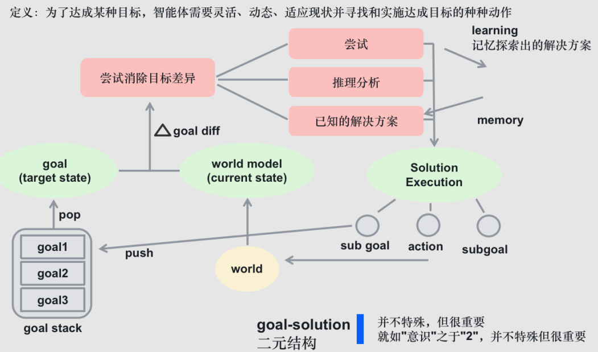

> 目标驱动机制

让我们通过一个简单的模型来描述该机制。首先，我们需要对这个世界有理解，因此我们会在脑中构建一个关于世界的模型。这个模型在结构化之后，就会变成了当前世界状态。而我们的目标是对应的一个目标世界状态。因此，人类就是在不停地消除当前状态和目标状态之间的差异，这个消除的过程就是目标驱动的过程。

在目标驱动的过程中，你开始尝试去解决这个问题，消除这个差异，你也可能有现成的解决方案，直接动用已有的解决方案执行已知的运动序列，也可能需要进行一定的思考，做出推理分析帮助你解决问题。

一旦你找到了一些执行序列，这些序列可能会变成一个子序列，子序列里有子目标。每个子目标的执行有可能是直接完成的，也可能需要进一步思考才能完成。正如我们可以看到，GPS这段代码就是在为了达成某一个目标而工作，它会遍历所有的目标，尝试让每一个目标都能够达成，一旦达成就结束。有兴趣的同学可以读一下这个代码，就是做暴力遍历找出达到目标状态的操作序列。

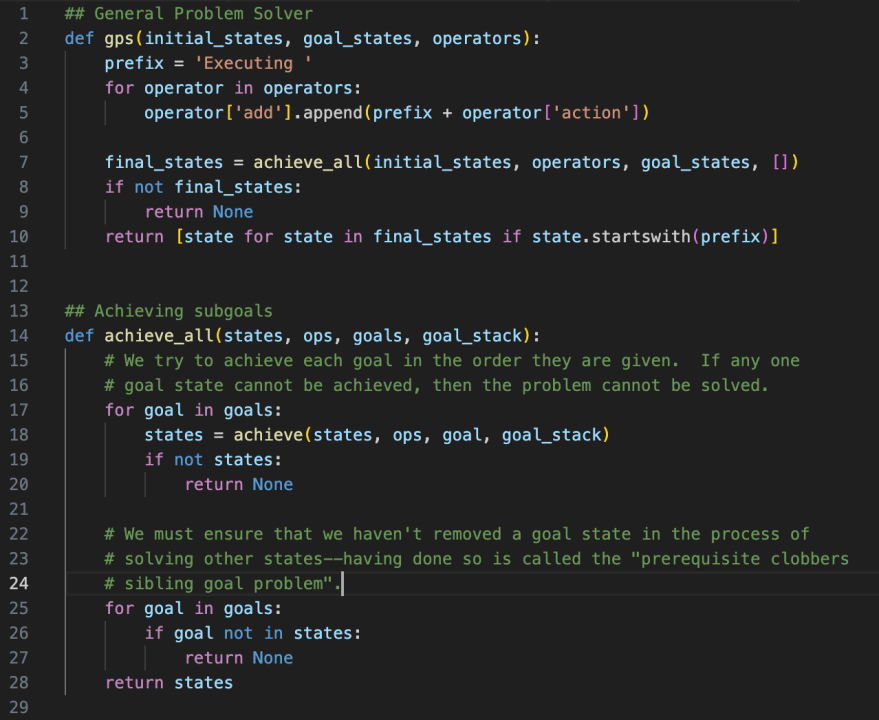

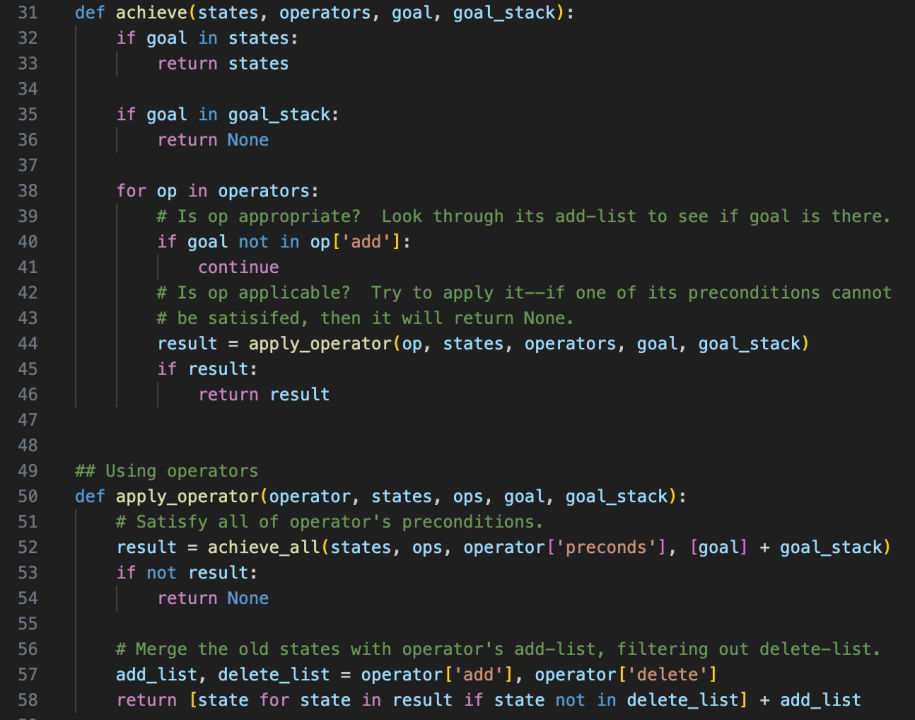

不过，**像GPS这种理想的解决方案在现实世界中可能并不奏效，因为真实世界的解空间过于庞大**，想想AlphaGo的故事就理解了，这也是为什么虽然此想法在理论上看起来很好，但在实际操作时却无法实施。

但这种思考很有启发，在Newell和Simon1972年出版的《Human Problem Solving》一书中，他们研究了人类如何解决问题，并意识到我们经常进行手段-目的分析(means-ends)

举一个例子：

> "我想把儿子送到幼儿园。我现在的状态和我想要的状态之间有什么区别？其中一个是距离。
> 是什么因素会改变距离？我的汽车。可是我的汽车坏了。要让它工作需要什么？一个新电池。
> 哪里能买到新电池？汽车修理店。我想让修理店为我安装一个新电池，但店里不知道我需要一个新电池。问题出在哪里？是沟通的问题。什么能让沟通变得容易？一部电话……以此类推。"

在计算机领域，有很多方法都与目标机制相关。例如，**过程描述语言（PDL）** 就是一种经典的方法，主要用于解决机器人问题。我们可以描述世界上的对象，它们当前的状态是怎样的，目标状态是怎样的，有哪些可以采取的操作，然后我们可以基于这些操作，使用规划器寻找一个合适的运动序列来解决问题。

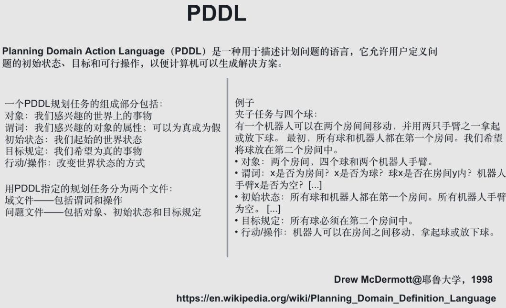

> PDDL

但在今天计算机领域的工程实践中，人们更多采用的是面向过程架构，无论是接口、函数、UI界面，还是组件，又或者是一个应用程序，都是以接口的形式存在的。而这个接口实质上是一种被调用的子流程，借此过程的完成，我们希望执行结果符合我们的预期，但程序并不为结果负责。它**解决的是过程和流程问题**，系统内没有目标的概念。


> 面向过程架构（Process Oriented Architure）

当然，也存在一些以目标导向为核心理念的的软件工程，例如声明式编程，它只需要你描述你想要什么，而无需关心执行的过程，像HTML和SQL便是其经典例子。在这样的架构下，程序能够自行寻找达成目标的方法。


> 命令式编程 vs 声明式编程

然而问题在于，这种面向目标的架构只能应用于垂直领域，而**无法普遍应用到所有领域，只有在特定的领域内才能发挥作用，这就限制了它的应用范围**。 &#x20;

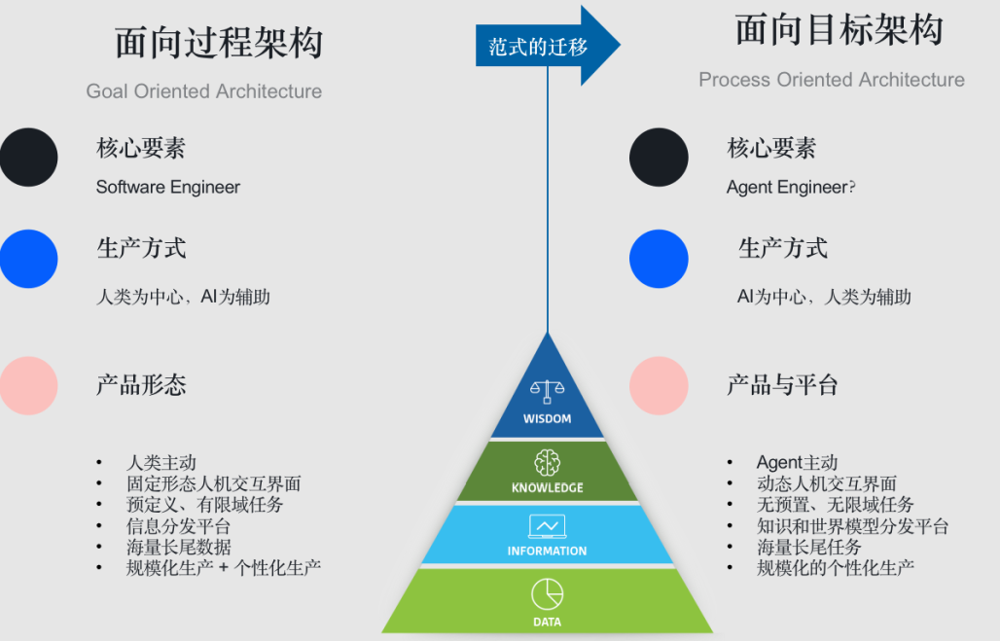

> 面向过程架构 vs 面向目标架构

总的来说，尽管面向目标架构在计算机领域有一席之地，但由于其只能在特定领域发挥作用，而无法解决所有领域的问题，因此它的应用还是有所限制，更多出现在特定的DSL（领域特定语言）中，这种架构的确也发挥了巨大的作用。在软件工程的范式迁移中，我们发现**面向过程架构与面向目标架构之间的重要区别点：随着人类的生产方式的变化，软件工程可能正逐步演化为智能体工程(Agent Engineering)；** 以前我们主导的生产方式是人类处于中心位，AI做辅助。而未来可能会变成以 AI 为中心，人类变为辅助。由此，整个产品形态和平台的构成可能会发生这样的转变。

在这一转变中，原本由人类主导的功能开发，逐渐演变为以智能体为主要驱动力。传统的用户界面，由于其垂直的任务层级架构，每一层都需要人类逐一生成，未来这个过程可能会被智能体自主生成并改良。此外，原本只能解决有限范围的任务，未来的架构则可以解决无限域的任务。就如同头条这样的平台，它是一个信息的分发平台。那么，是否会出现新的平台模式？比如一种知识和世界模型的分发平台。以前我们只能处理大量长尾数据，在未来可能能解决大量长尾任务。以前是廉价的规模化加昂贵的个性化，以后是廉价的规模化的个性化。

## 4. 前瞻性分析

根据上面的分析，我们能看到 Agent 技术在未来的发展还有很大的提升空间。我认为，这些提升主要可以从几个方向开始，包括引入**中央执行机构、学习能力、输入感知、输出执行、世界模型和记忆**等几个方面，这些构成因素是完备非正交的，都对提升 AI 技术至关重要。

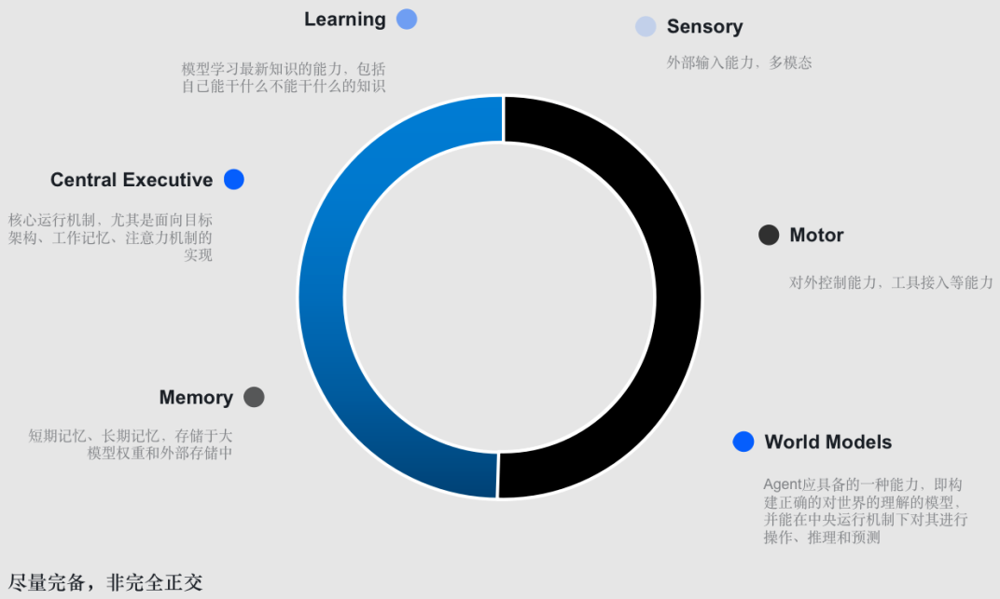

### 4.1 Central Executive

中央执行机构，这是一个核心的概念，但常常被人们忽视。现在的 Agent 只是一个规划器，它负责做规划。但实际上，这个流程中还存在很多未明确的问题，比如，**是否存在一个内部加工过程**，以及这个过程是否透明可控等。一种可能的解决办法是，将内部加工过程外部化，用系统2包裹起来，使每一步细粒度的思考都可以展现出来。

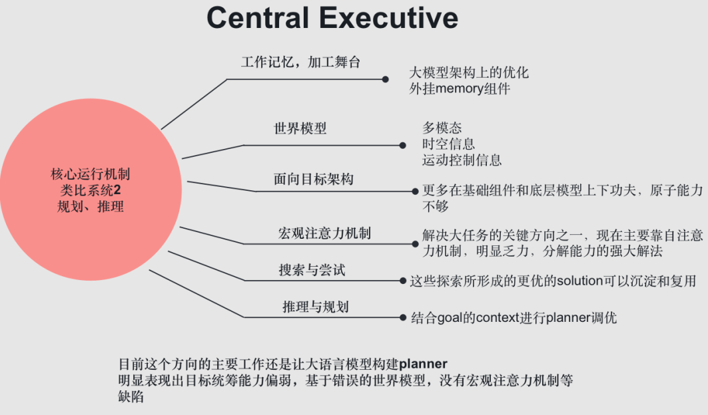

其次是**世界模型，**现在的大模型只能输入语言，显然这样是不够的，进一步理解世界需要多模态输入。这是我们在未来需要处理的关键问题。同样地，对于时间和自身的身体运动控制的认知也需要能够输入到大模型里面去。我们观察到，无论是自动驾驶汽车、大模型Agent，还是其他的诸多智能体模型，都已经在应用这种**面向目标的架构**。目前的挑战在于如何在细节上加以改进，如找出此架构未能完成某些任务的原因，以及这些缺陷是源于大模型底层的子任务能力不足，还是需要对框架本身做出改进，比如增加更多的思考层次，或加入更多的内部推演等。

另一个重要的问题是**宏观注意力**，由于大模型的上下文限制，是否可以让模型自身主动去探索外部世界，将其精力和注意力主动地投入到解答某些具有目标性的问题上去，实现主动的注意力机制？这不仅涉及到搜索和尝试的问题，如针对一些无法思考出解决方案的情况，模型应如何去进行尝试，而且这些尝试何时能够带来进步，以及如何去寻找更为优秀的解决空间，进行推理和规划。

### 4.2 Memory

值得注意的是，数学和逻辑学习也会涉及到上述问题，比如人类在很多情况下不擅长规划，那么我们是否可以利用网络和记忆机制来实现规划的功能？这其中就涉及到**记忆的内化**，也就是把大模型从外部世界获取的经验转化为内部参数，或者说把这些经验转化为内存。

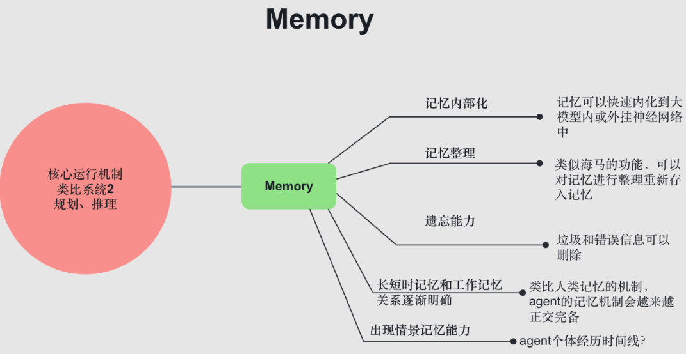

目前，我们依赖的记忆机制主要是把所有的信息存储在历史记录里，然后在需要的时候进行召回。然而，这些信息并未经过整理，在一些试图**整理记忆**的尝试中，我们发现人类是具有这种能力的。人类在获得大量相关的知识后，不会简单地把它们堆积在脑中，因为人的神经元存储空间是有限的。相反，人脑会通过海马体进行整理，而在我们做梦时，大脑会重新构造这些相关的知识，使得记忆网络变得有序。

目前还未见到具有**遗忘功能**的模型，也就是删掉一些垃圾信息或错误的信息。在大模型训练过程中，产生了许多无用甚至是错误的信息，而我们在工作中只是采用了许多方式来规避这些错误的信息，但为什么不试图去删掉它们呢？如果能够将这些信息替换为有价值的信息，那将是一件有价值的事。我注意到在人工智能领域中，**对于长短时记忆与工作记忆**，以及它们之间的关系讨论并不深入，更常见的是，人们将长短时记忆简化为向量数据库。我想解决这个问题，尝试对这两者进行深层次的理解，并建立更完备，更正交的关系也很重要。

### 4.3 Sensory

当人工智能Agent融入人类生活后，它与我们的体验和经历能否成为Agent自身的存储内容？如果可以，那么在未来，我们与Agent之间的互动将会变得更加实用，更加贴近现实生活，更加有温度。

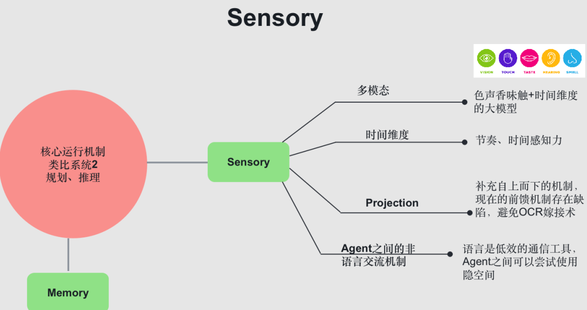

在输入的问题上，我明确地看到了**多模态**输入的必要性，同时，对于时间感知我认为也非常重要，时间性对于运动控制任务极其重要。引入多模态输入后，我们还要解决一个**自上而下**的机制问题，就是Projection启发的这个点，OCR嫁接术一定会在某类任务存在缺陷。

### 4.4 Motor

在交流方式上，我认为不应仅仅依赖于语言，虽然现在的交流基本都是基于语言的，但是，语言是一个低带宽且低效的通信工具。我在想，我们能否引入一种新的沟通方式 - 类似心灵感应的方式，让Agent在隐空间通信。


关于运动控制，当前的方式包括一些机器人应用，都比较**结构化**。但我认为，在未来，大模型的神经网络应该可以直接连接到运动控制的神经网络，实现层次化控制，使得运动更为流畅，甚至比人类更为灵活。

在另一方面，运动控制也应该是**数据化**的，而不是仅仅处于我们所说的”计划者“的层面。如果有一个命令下达，神经网络应该可以直接执行。

除此之外，还有一些**亚符号的控制**，在大模型直接对接神经网络时，我们应当避免通过语言来描述，因为我们可以通过这种方式得到的信息量会比通过语言描述来得多。

同时，也需要进行一些**外部工具的优化**，让现有的工具更适应我们的需求，比如一些愿意为了方便Agent调用进行改造的工具服务商将会在新的价值网络中占据一席之地，如一个旅游服务供应商，加入下一代Agent平台之后，Agent在完成用户旅游类任务时可能会有限调用它，并使用类似Web3的技术进行价值分配。

### 4.5 Learning

任何一个产品，或者说Agent，都需要学习。学习的过程是十分重要的，尤其是模型需要学会对自身的可靠性进行判断，**知道自己知道什么，更重要的是，知道自己并不知道什么**，不擅长什么，这将会对模型的发展产生重大影响。关于大型模型的优化，我认为最关键的问题就在于**模型需要明确自己的能力范围**。有些问题，大模型不能张口就来直接给出答案，过于逞能，它应该经过仔细的思考，保证任务目标的准确达成。


同时，我们也需要考虑模型的**权威性**问题。大模型可能从互联网和垃圾信息中学到很多知识，但这并不意味着它在解决问题时能提供最权威、最佳的做法。我们需要把这个模型训练到，即使是在面对垃圾信息输入时，它也能输出更好的、更有价值的解决方案。

另一方面，我们还需要考虑到**模型的多样性**。很多时候，为了保证任务的有效执行，往往会控制模型的温度参数，以保持其输出的稳定性。但是，在保证模型正确性的同时，我们也不应该忽略它的思维活跃度。我们应允许智能体在解决任务时有更大的解空间，以便找到最优的解决方案。

### 4.6 World Models

关于世界模型 ，需要注意的是，尽管模型的训练数据中可能含有很多垃圾信息和错误信息，我们还需要**让模型具有辨别和整理这些信息的能力**，以构建一个无矛盾、统一的实体网络，这一点鲜被提及，我认为现在黯然神伤的之前做知识图谱的同学可以重点考虑一下这个方向。


在此基础上，还需要让模型具备**推理能力**。一个优秀的智能体不应该仅仅依赖于内部推理，而应该有能力借助外部推理，当然这个外部推理可以当做工具来使用。

最后，我们还必须强化模型的**内部思考机制**。当调用一些有成本的接口时，模型不能只是“想到就做到”，而应该有自我觉知的能力，或者叫Mental Simulation，预判自己的行动可能会带来的结果，并在内部进行纠错，以保证行动的可靠性，这不同于Reflection是执行后根据执行结果再反思。进一步，我们可能更大的关注点应该是它在家庭生活及现实社会中的应用上，将其实现为实体化的机器人，那么**动力学机制和时间性认知**还是很重要的，而当前的大模型仅是一个简单的循环调用，无法实现这方面的任务。

好，以上就是我对一些方向的浅显思考。

最后，我们以伟人的一段话来结尾：Agent 技术，它是站在海岸遥望海中已经看得见桅杆尖头了的一只航船，它是立于高山之巅远看东方已见光芒四射喷薄欲出的一轮朝日，它是躁动于母腹中的快要成熟了的一个婴儿。

## 参考文章

1.  Wikipedia Agent. [https://en.wikipedia.org/wiki/Intelligent\_agent](https://en.wikipedia.org/wiki/Intelligent_agent "https://en.wikipedia.org/wiki/Intelligent_agent")
2.  Intelligent Agents 综述 [https://vsis-www.informatik.uni-hamburg.de/getDoc.php/publications/373/INTELLIGENT\_AGENTS\_v7\_final.pdf](https://vsis-www.informatik.uni-hamburg.de/getDoc.php/publications/373/INTELLIGENT_AGENTS_v7_final.pdf "https://vsis-www.informatik.uni-hamburg.de/getDoc.php/publications/373/INTELLIGENT_AGENTS_v7_final.pdf")
3.  Prompt经典收集。[https://github.com/f/awesome-chatgpt-prompts](https://github.com/f/awesome-chatgpt-prompts "https://github.com/f/awesome-chatgpt-prompts")
4.  LLM+P: Empowering Large Language Models with Optimal Planning Proficiency
5.  [https://github.com/Cranial-XIX/llm-pddl](https://github.com/Cranial-XIX/llm-pddl "https://github.com/Cranial-XIX/llm-pddl")
6.  Chain-of-Thought Prompting Elicits Reasoning in Large Language Models
7.  Self-Consistency Improves Chain of Thought Reasoning in Language Models
8.  Tree of Thoughts: Deliberate Problem Solving with Large Language Models
9.  Graph of Thoughts: Solving Elaborate Problems with Large Language Models
10. Cumulative Reasoning with Large Language Models
11. ReAct: Synergizing Reasoning and Acting in Language Models
12. Reflexion: Language Agents with Verbal Reinforcement Learning
13. [https://openai.com/blog/function-calling-and-other-api-updates](https://openai.com/blog/function-calling-and-other-api-updates "https://openai.com/blog/function-calling-and-other-api-updates")
14. 人大综述https\://arxiv.org/pdf/2308.11432.pdf
15. 复旦综述 [https://arxiv.org/pdf/2309.07864.pdf](https://arxiv.org/pdf/2309.07864.pdf "https://arxiv.org/pdf/2309.07864.pdf")
16. [https://github.com/Significant-Gravitas/AutoGPT](https://github.com/Significant-Gravitas/AutoGPT "https://github.com/Significant-Gravitas/AutoGPT")
17. [https://github.com/microsoft/JARVIS](https://github.com/microsoft/JARVIS "https://github.com/microsoft/JARVIS")
18. HuggingGPT: Solving AI Tasks with ChatGPT and its Friends in Hugging Face
19. GPT-Researcher [https://github.com/assafelovic/gpt-researcher](https://github.com/assafelovic/gpt-researcher "https://github.com/assafelovic/gpt-researcher")
20. RecurrentGPT [https://arxiv.org/abs/2305.13304](https://arxiv.org/abs/2305.13304 "https://arxiv.org/abs/2305.13304")
21. Voyager [https://arxiv.org/abs/2305.16291](https://arxiv.org/abs/2305.16291 "https://arxiv.org/abs/2305.16291")
22. [https://github.com/OpenBMB/XAgent](https://github.com/OpenBMB/XAgent "https://github.com/OpenBMB/XAgent")
23. 斯坦福小镇代码 [https://github.com/joonspk-research/generative\_agents](https://github.com/joonspk-research/generative_agents "https://github.com/joonspk-research/generative_agents")
24. 斯坦福小镇论文 Generative Agents: Interactive Simulacra of Human Behavior
25. MetaGPT代码 [https://github.com/geekan/MetaGPT](https://github.com/geekan/MetaGPT "https://github.com/geekan/MetaGPT")
26. MetaGPT论文 [https://arxiv.org/pdf/2308.00352.pdf](https://arxiv.org/pdf/2308.00352.pdf "https://arxiv.org/pdf/2308.00352.pdf")
27. [https://github.com/OpenBMB/ChatDev](https://github.com/OpenBMB/ChatDev "https://github.com/OpenBMB/ChatDev")
28. [https://github.com/OpenBMB/AgentVerse](https://github.com/OpenBMB/AgentVerse "https://github.com/OpenBMB/AgentVerse")
29. [https://arxiv.org/pdf/2307.07924.pdf](https://arxiv.org/pdf/2307.07924.pdf "https://arxiv.org/pdf/2307.07924.pdf")
30. Agents: An Open-source Framework for Autonomous Language Agents
31. [https://lilianweng.github.io/posts/2023-06-23-agent/](https://lilianweng.github.io/posts/2023-06-23-agent/ "https://lilianweng.github.io/posts/2023-06-23-agent/")
32. Phase transitions of brain evolution that produced human language and beyond
33. A Review of 40 Years in Cognitive Architecture Research Core Cognitive Abilities and Practical Applications
34. LIDA: A Computational Model of Global Workspace Theory and Developmental Learning
35. [https://hal.science/hal-03311492/document](https://hal.science/hal-03311492/document "https://hal.science/hal-03311492/document")
36. [https://ai.meta.com/blog/yann-lecun-advances-in-ai-research/](https://ai.meta.com/blog/yann-lecun-advances-in-ai-research/ "https://ai.meta.com/blog/yann-lecun-advances-in-ai-research/")
37. Projection: A Mechanism for Human-like Reasoning in Artificial Intelligence
38. [https://en.wikipedia.org/wiki/Planning\_Domain\_Definition\_Language](https://en.wikipedia.org/wiki/Planning_Domain_Definition_Language "https://en.wikipedia.org/wiki/Planning_Domain_Definition_Language")
