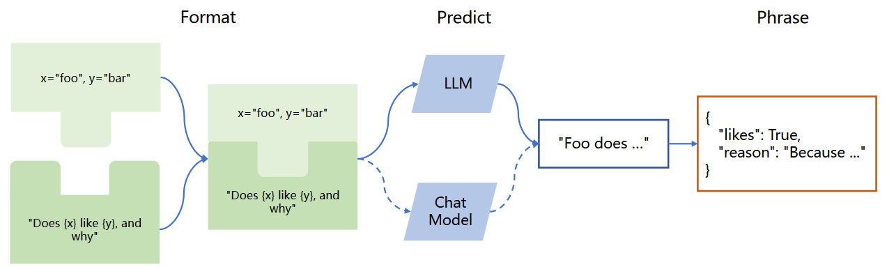

# 1.langchain

\[toc]

### 1.什么是 LangChain?

LangChain 是一个基于语言模型的框架，用于构建聊天机器人、生成式问答（GQA）、摘要等功能。它的核心思想是将不同的组件“链”在一起，以创建更高级的语言模型应用。

LangChain 框架核心目标是**为了连接多种大语言模型**（如 OpenAI、LLaMA 等）\*\*和外部资源 \*\*（如 Google、Wikipedia、Notion 以及 Wolfram 等），**提供抽象和工具以在文本输入和输出之间进行接口处理**。大语言模型和组件通过“链（Chain）”连接，使得开发人员可以快速开发原型系统和 应用程序。

LangChain 的主要价值在于以下几个方面：&#x20;

1.  **组件化**：LangChain 框架提供了用于处理语言模型的抽象组件，以及每个抽象组件的一系列 实现。这些组件具有模块化设计，易于使用，无论是否使用 LangChain 框架的其他部分，都 可以方便地使用这些组件。
2.  **现成的链式组装**：LangChain 框架提供了一些现成的链式组装，用于完成特定的高级任务。这 些现成的链式组装使得入门变得更加容易。对于更复杂的应用程序，LangChain 框架也支持 自定义现有链式组装或构建新的链式组装。
3.  **简化开发难度**：通过提供组件化和现成的链式组装，LangChain 框架可以大大简化大语言模 型应用的开发难度。开发人员可以更专注于业务逻辑，而无需花费大量时间和精力处理底层 技术细节。

### 2. LangChain 包含哪些核心模块

LangChain 的提供了以下 6 种标准化、可扩展的接口并且可以外部集成的核心模块：

1.  **模型输 入/输出（Model I/O）**：与语言模型交互的接口；
2.  **数据连接（Data connection）**：与特定应用程序的数 据进行交互的接口；
3.  **链（Chains）**：用于复杂的应用的调用序列；
4.  **智能体（Agents）**：语言模型作为推理器决定要执行的动作序列；
5.  **记忆（Memory）**：用于链的多次运行之间持久化应用程序状态；
6.  **回调 （Callbacks）**：记录和流式传输任何链式组装的中间步骤。

#### 2.1 模型输入/输出（Model I/O）

LangChain 中模型输入/输出模块**是与各种大语言模型进行交互的基本组件，是大语言模型应 用的核心元素**。该模块的基本流程如图所示。

主要包含以下部分：**Prompts**、**Language Models** 以 及 **Output Parsers**。用户原始输入与模型和示例进行组合，然后输入给大语言模型，再根据大语言 模型的返回结果进行输出或者结构化处理。



\*\*Prompts \*\*部分主要功能是提示词模板、提示词动态选择和输入管理。提示词是指输入模型的内 容。该输入通常由模板、示例和用户输入的组合。LangChain 提供了几个类和函数，使得构建和处 理提示词更加容易。

```python
from langchain import PromptTemplate 
template = """ You are a naming consultant for new companies. What is a good name for a company that makes {product}? """ 

prompt = PromptTemplate.from_template(template) 
prompt.format(product="colorful socks")

```

**Language Models **部分提供了**与大语言模型的接口**，LangChain 提供了两种类型模型的接口和 集成：

-   **LLMs**，接受文本字符串作为输入并返回文本字符串；
-   **Chat Model**，由大语言模型支持，但接受 Chat Messages 列表作为输入并返回 Chat Message。

```python
from langchain.chat_models import ChatOpenAI 
from langchain.schema import (AIMessage, HumanMessage, SystemMessage) 

chat = ChatOpenAI(
  openai_api_key="...", 
  temperature=0, 
  model='gpt-3.5-turbo' 
) 

# HumanMessage 表示用户输入的消息，
# AIMessage 表示系统回复用户的消息，
# SystemMessage 表示设置的 AI 应该遵循的目标，
# ChatMessage 表示任务角色的消息。
messages = [
  SystemMessage(content="You are a helpful assistant."), 
  HumanMessage(content="Hi AI, how are you today?"), 
  AIMessage(content="I'm great thank you. How can I help you?"), 
  HumanMessage(content="I'd like to understand string theory.") 
] 

res = chat(messages) 
print(res.content)

```

**Output Parsers** 部分的目标是辅助开发者从大语言模型输出中获取比仅文本更结构化的信息。 Output Parsers 包含很多具体的实现，但是每个都必须实现如下两个必须实现的方法：

1.  获取格式化指令（Get format instructions），返回包含语言模型输出应如何格式化的字符串的方法；解析 （Parse）
2.  接受字符串（假设为语言模型的响应）并将其解析为某种结构的方法。以及一个可选 的方法：带提示解析（Parse with prompt），接受字符串（假设为语言模型的响应）和提示（假设 为生成此响应的提示）并将其解析为某种结构的方法。

#### 2.2 数据连接（Data Connection）

许多大语言模型应用需要用户特定的数据，这些数据不是模型的训练集的一部分。为了支持上述应用的构建，**LangChain 数据连接（Data connection）**模块**通过以下方式提供组件来加载、转换、存储和查询数据**：Document loaders、Document transformers、Text embedding models、Vector stores 以及 Retrievers。数据连接模块部分的基本框架如图所示。


**Document loaders（文档加载）** 旨在从源中加载数据构建 Document。LangChain 中 Document 是包含文本和与其关联的元数据。LangChain 中包含加载简单 txt 文件的文档加载器，用于加载任 何网页的文本内容的加载器，甚至还包含用于加载 YouTube 视频的转录稿的加载器。以下是一个 最简单的从文件中读取文本加载数据的 Document 的示例：

```python
from langchain.document_loaders import TextLoader

loader = TextLoader("./index.md")
loader.load()
```

**Document transformers（文档转换）** 旨在处理文档，以完成各种转换任务，如将文档格式化为 Q\&A 形式，去除文档中的冗余内容等，从而更好地满足不同应用程序的需求。

**Text embedding models （文本嵌入模型）** 旨在将非结构化文本转换为嵌入表示。基于文本的嵌入 表示，可以进行语义搜索，查找最相似的文本片段。LangChain 中的 Embeddings 类公开了两个方法：一个用于文档嵌入表示，另一个用于查询嵌入表示。前者输入多个文本，后 者输入单个文本。

**Vector Stores（向量存储）** 是存储和检索非结构化数据的主要方式之一。它首先将数据转化为 嵌入表示，然后存储这些生成的嵌入向量。在查询阶段，系统会利用这些嵌入向量来检索与查询内 容“最相似”的文档。向量存储的主要任务是保存这些嵌入数据并执行基于向量的搜索。LangChain 能够与多种向量数据库集成，如 Chroma、FAISS 和 Lance 等

**Retrievers（检索器）** 是一个接口，其功能是基于非结构化查询返回相应的文档

#### 2.3 链（Chain）

虽然独立使用大语言模型能够应对一些简单任务，但对于更加复杂的需求，可能**需要将多个大语言模型进行链式组合，或与其他组件进行链式调用**。LangChain 为这种“链式”应用提供了 Chain 接口，并将该接口定义得非常通用。作为一个调用组件的序列，还可以包含其他链。基本接 口非常简单，代码如下所示：

```python
class Chain(BaseModel, ABC): 
  """Base interface that all chains should implement.""" 
  
  memory: BaseMemory 
  callbacks: Callbacks 
  def __call__( 
    self, 
    inputs: Any, 
    return_only_outputs: bool = False, 
    callbacks: Callbacks = None,
  ) -> Dict[str, Any]: 
    ...
```

链允许将多个组件组合在一起，创建一个单一的、连贯的应用程序。

#### 2.4 记忆（Memory）

在 LangChain 中，这种**存储关于过去交互的信息的能力**被称为“记忆”（Memory）。LangChain 中提供了许多用于向系统添加记忆的方法，可以单独使用，也可以无缝地整合到链中。

LangChain 记忆模块的基本框架如图所示。记忆系统需要支持两个基本操作：**读取和写入**。 每个链都根据输入定义了核心执行逻辑。其中一些输入直接来自用户，但有些输入可以来源于记忆。在接收到初始用户输入，但在执行核心逻辑之前，链将从记忆系统中读取内容并增强用户输 入。在核心逻辑执行完毕并在返回答复之前，链会将这一轮的输入和输出都保存到记忆系统中，以 便在将来使用它们。


简单的形式，它只是将聊天消息列表保存到缓冲区中，并将其传递到提示模板中。代码示例如下 所示：

```python
from langchain.memory import ConversationBufferMemory 
memory = ConversationBufferMemory() 
memory.chat_memory.add_user_message("hi!") 
memory.chat_memory.add_ai_message("whats up?")
```

#### 2.5 智能体（Agents）

智能体的核心思想**是使用大语言模型来选择要执行的一系列动作**。在链中，操作序列是硬编码在代码中的。在智能体中，则是将大语言模型用作推理引擎，以确定要采取哪些动作以及以何种顺序采取这些动作。**智能体通过将大语言模型与动作列表结合，自动地选择最佳的动作序列，从 而实现自动化决策和行动**。智能体可以用于许多不同类型的应用程序，例如自动化客户服务、智 能家居等。LangChain 中智能体由如下几个核心组件构成：

-   `Agent`：是负责**决定下一步该采取什么步骤的类**。由大语言模型和提示驱动。提示可以包括 智能体的个性（有助于使其以某种方式做出回应）、智能体的背景上下文（有助于提供所要求 完成的任务类型的更多上下文信息）、激发更好的推理的提示策略（例如广泛使用的 ReAct）。&#x20;
-   `Tools`：是**智能体调用的函数**。这里有两个重要的考虑因素：1）为智能体提供正确的工具访 问权限；2）用对智能体最有帮助的方式描述工具。
-   `Toolkits`：是一组旨在一起使用以完成特定任务的工具集合，并具有方便的加载方法。通常一 个工具集中有 3-5 个工具。
-   `AgentExecutor`：是智能体的运行空间，这是实际调用智能体并执行其选择的操作的部分。除 了 AgentExecutor 类外，LangChain 还支持其他智能体运行空间，包括 Plan-and-execute Agent、 Baby AGI、Auto GPT 等。

#### 2.6 回调（Callbacks）

LangChain 提供了回调系统，**允许连接到大语言模型应用程序的各个阶段**。这对于日志记录、 监控、流式处理和其他任务非常有用。可以通过使用 API 中提供的 callbacks 参数订阅这些事件。 CallbackHandlers 是实现 CallbackHandler 接口的对象，每个事件都可以通过一个方法订阅。当事件 触发时，CallbackManager 会调用相应事件所对应的处理程序。

### 3.一些核心概念

#### 3.1 Components and Chains

在 LangChain 中，**Component 是模块化的构建块，可以组合起来创建强大的应用程序**。Chain 是组合在一起以完成特定任务的一系列 Components（或其他 Chain）。例如，一个 Chain 可能包括一个 Prompt 模板、一个语言模型和一个输出解析器，它们一起工作以处理用户输入、生成响应并处理输出。

#### 3.2 Prompt Templates and Values

**Prompt Template** 负责创建 PromptValue，这是最终传递给语言模型的内容。Prompt Template 有助于将用户输入和其他动态信息转换为适合语言模型的格式。

**PromptValues** 是具有方法的类，这些方法可以转换为每个模型类型期望的确切输入类型（如文本或聊天消息）。

#### 3.3 Example Selectors

当您想要在 Prompts 中动态包含示例时，Example Selectors 很有用。他们**接受用户输入并返回一个示例列表以在提示中使用，使其更强大和特定于上下文。**

#### 3.4 Output Parsers

Output Parsers 负责将语言模型响应构建为更有用的格式。它们实现了两种主要方法：一种用于提供格式化指令，另一种用于将语言模型的响应解析为结构化格式。这使得在您的应用程序中处理输出数据变得更加容易。

#### 3.5 Indexes and Retrievers

`Index `是**一种组织文档的方式**，使语言模型更容易与它们交互。

`检索器`是**用于获取相关文档并将它们与语言模型组合的接口**。LangChain 提供了用于处理不同类型的索引和检索器的工具和功能，例如矢量数据库和文本拆分器。

#### 3.6 Chat Message History

`LangChain` 主要**通过聊天界面与语言模型进行交互**。

ChatMessageHistory 类负责记住所有以前的聊天交互数据，然后可以将这些交互数据传递回模型、汇总或以其他方式组合。这有助于维护上下文并提高模型对对话的理解。

#### 3.7 Agents and Toolkits

`Agent `是在 LangChain 中推动决策制定的实体。他们可以访问一套工具，并可以根据用户输入决定调用哪个工具。Tookits 是一组工具，当它们一起使用时，可以完成特定的任务。代理执行器负责使用适当的工具运行代理。

### 4.什么是 LangChain Agent?

LangChain Agent 是框架中驱动决策制定的实体。它可以访问一组工具，并可以根据用户的输入决定调用哪个工具。代理帮助构建复杂的应用程序，这些应用程序需要自适应和特定于上下文的响应。当存在取决于用户输入和其他因素的未知交互链时，它们特别有用。

### 5.  什么是 LangChain model?

LangChain model 是一种抽象，表示框架中使用的不同类型的模型。LangChain 中的模型主要分为三类：

1.  **LLM（大型语言模型）**：这些模型将文本字符串作为输入并返回文本字符串作为输出。它们是许多语言模型应用程序的支柱。
2.  **聊天模型( Chat Model)**：聊天模型由语言模型支持，但具有更结构化的 API。他们将聊天消息列表作为输入并返回聊天消息。这使得管理对话历史记录和维护上下文变得容易。
3.  **文本嵌入模型(Text Embedding Models)**：这些模型将文本作为输入并返回表示文本嵌入的浮点列表。这些嵌入可用于文档检索、聚类和相似性比较等任务。

开发人员可以为他们的用例选择合适的 LangChain 模型，并利用提供的组件来构建他们的应用程序。

### 6.  LangChain 包含哪些特点?

LangChain 旨在为六个主要领域的开发人员提供支持：

1.  **LLM 和提示**：LangChain 使管理提示、优化它们以及为所有 LLM 创建通用界面变得容易。此外，它还包括一些用于处理 LLM 的便捷实用程序。
2.  **链(Chain)**：这些是对 LLM 或其他实用程序的调用序列。LangChain 为链提供标准接口，与各种工具集成，为流行应用提供端到端的链。
3.  **数据增强生成**：LangChain 使链能够与外部数据源交互以收集生成步骤的数据。例如，它可以帮助总结长文本或使用特定数据源回答问题。
4.  **Agents**：Agents 让 LLM 做出有关行动的决定，采取这些行动，检查结果，并继续前进直到工作完成。LangChain 提供了代理的标准接口，多种代理可供选择，以及端到端的代理示例。
5.  **内存**：LangChain 有一个标准的内存接口，有助于维护链或代理调用之间的状态。它还提供了一系列内存实现和使用内存的链或代理的示例。
6.  **评估**：很难用传统指标评估生成模型。这就是为什么 LangChain 提供提示和链来帮助开发者自己使用 LLM 评估他们的模型。

8\.  LangChain 如何使用?

-   8.1 LangChain 如何调用 LLMs 生成回复？
-   8.2 LangChain 如何修改 提示模板？
-   8.3 LangChain 如何链接多个组件处理一个特定的下游任务？
-   8.4 LangChain 如何Embedding & vector store？

### 7.LangChain 如何使用?

#### 7.1 LangChain 如何调用 LLMs 生成回复？

要调用LLMs生成回复，可以使用LangChain框架提供的LLMChain类。LLMChain类是LangChain的一个组件，用于与语言模型进行交互并生成回复。以下是一个示例代码片段，展示了如何使用LLMChain类调用LLMs生成回复：

```python
from langchain.llms import OpenAI
from langchain.chains import LLMChain

llm = OpenAI(temperature=0.9)  # 创建LLM实例
prompt = "用户的问题"  # 设置用户的问题

# 创建LLMChain实例
chain = LLMChain(llm=llm, prompt=prompt)

# 调用LLMs生成回复
response = chain.generate()

print(response)  # 打印生成的回复
```

在上面的代码中，首先创建了一个LLM实例，然后设置了用户的问题作为LLMChain的prompt。接下来，调用LLMChain的generate方法来生成回复。最后，打印生成的回复。

请注意，可以根据需要自定义LLM的参数，例如温度（temperature）、最大令牌数（max\_tokens）等。LangChain文档中有关于LLMChain类和LLM参数的更多详细信息。

#### 7.2 LangChain 如何修改 提示模板？

要修改LangChain的提示模板，可以使用LangChain框架提供的`ChatPromptTemplate`**类。**`ChatPromptTemplate`**类允许您创建自定义的聊天消息提示，并根据需要进行修改。以下是一个示例代码片段，展示了如何使用**`ChatPromptTemplate`类修改提示模板：

```python
from langchain.prompts import ChatPromptTemplate

# 创建一个空的ChatPromptTemplate实例
template = ChatPromptTemplate()

# 添加聊天消息提示
template.add_message("system", "You are a helpful AI bot.")
template.add_message("human", "Hello, how are you doing?")
template.add_message("ai", "I'm doing well, thanks!")
template.add_message("human", "What is your name?")

# 修改提示模板
template.set_message_content(0, "You are a helpful AI assistant.")
template.set_message_content(3, "What is your name? Please tell me.")

# 格式化聊天消息
messages = template.format_messages()

print(messages)
```

在上面的代码中，首先创建了一个空的`ChatPromptTemplate`实例。然后，使用`add_message`方法添加了聊天消息提示。接下来，我们使用`set_message_content`方法修改了第一个和最后一个聊天消息的内容。最后，我们使用`format_messages`方法格式化聊天消息，并打印出来。

请注意，可以根据需要添加、删除和修改聊天消息提示。`ChatPromptTemplate`类提供了多种方法来操作提示模板。更多详细信息和示例代码可以在LangChain文档中找到。

#### 7.3 LangChain 如何链接多个组件处理一个特定的下游任务？

要链接多个组件处理一个特定的下游任务，可以使用LangChain框架提供的`Chain`类。`Chain`类允许您将多个组件连接在一起，以便按顺序处理任务。以下是一个示例代码片段，展示了如何使用`Chain`类链接多个组件处理下游任务：

```python
from langchain.chains import Chain
from langchain.components import Component1, Component2, Component3

# 创建组件实例
component1 = Component1()
component2 = Component2()
component3 = Component3()

# 创建Chain实例并添加组件
chain = Chain()
chain.add_component(component1)
chain.add_component(component2)
chain.add_component(component3)

# 处理下游任务
output = chain.process_downstream_task()

print(output)
```

在上面的代码中，首先创建了多个组件的实例，例如`Component1`、`Component2`和`Component3`。然后，创建了一个`Chain`实例，并使用`add_component`方法将这些组件添加到链中。最后，我们调用`process_downstream_task`方法来处理下游任务，并打印输出结果。

请注意，可以根据需要添加、删除和修改组件。`Chain`类提供了多种方法来操作链。

#### 7.4 LangChain 如何Embedding & vector store？

要在LangChain中进行嵌入和向量存储，可以使用LangChain框架提供的`Embedding`和`VectorStore`类。`Embedding`类用于将文本嵌入到向量空间中，而`VectorStore`类用于存储和检索嵌入向量。以下是一个示例代码片段，展示了如何在LangChain中进行嵌入和向量存储：

```python
from langchain.embeddings import Embedding
from langchain.vectorstore import VectorStore

# 创建Embedding实例
embedding = Embedding()

# 将文本嵌入到向量空间中
embedding.embed("Hello, world!")

# 创建VectorStore实例
vector_store = VectorStore()

# 存储嵌入向量
vector_store.store("hello", embedding.get_embedding())

# 检索嵌入向量
vector = vector_store.retrieve("hello")

print(vector)
```

在上面的代码中，首先创建了一个\*\*`Embedding`实例，并使用`embed`方法将文本嵌入到向量空间中。然后，我们创建了一个`VectorStore`实例，并使用`store`方法将嵌入向量存储到向量存储中。最后，使用`retrieve`方法检索嵌入向量，并打印出来。

请注意，可以根据需要添加、删除和修改嵌入向量。`Embedding`**类和**`VectorStore`类提供了多种方法来操作嵌入和向量存储。

### 8.LangChain知识问答实践

基于 LangChain 的知识问答系统框架如图所示。


知识库问答系统主要包含以下几个主要步 骤：

1.  收集领域知识数据构造知识库，这些数据应当能够尽可能的全面覆盖问答需求；
2.  将知识库中的对非结构数据进行文本提取和文本拆分，得到文本块；
3.  利用嵌入向量表示模型给出 文本块嵌入表示，并利用向量数据库进行保存；
4.  根据用户输入信息的嵌入表示，通过向量数据 库检索得到最相关文本片段，利用提示词模板与用户输入以及历史消息合并输入大语言模型；
5.  将大语言模型结果返回用户

上述过程的代码示例如下所示：

```python
from langchain.document_loaders import DirectoryLoader 
from langchain.embeddings.openai import OpenAIEmbeddings 
from langchain.text_splitter import CharacterTextSplitter 
from langchain.vectorstores import Chroma 
from langchain.chains import ChatVectorDBChain, ConversationalRetrievalChain 
from langchain.chat_models import ChatOpenAI 
from langchain.chains import RetrievalQA 

# 从本地读取相关数据 
loader = DirectoryLoader( 
  './Langchain/KnowledgeBase/', glob='**/*.pdf', show_progress=True 
) 

docs = loader.load()

# 将文件进行切分 
text_splitter = CharacterTextSplitter( chunk_size=1000, chunk_overlap=0 ) 
docs_split = text_splitter.split_documents(docs) 

# 初始化 OpenAI Embeddings 
embeddings = OpenAIEmbeddings() 

# 将数据存入 Chroma 向量存储 
vector_store = Chroma.from_documents(docs, embeddings) 

# 初始化检索器，使用向量存储 
retriever = vector_store.as_retriever() 
system_template = """ Use the following pieces of context to answer the users question. If you don't know the answer, just say that you don't know, don't try to make up an answer. Answering these questions in Chinese. 
----------
{question}
----------
{chat_history}
"""

# 构建初始 Messages 列表 
messages = [ 
  SystemMessagePromptTemplate.from_template(system_template), 
  HumanMessagePromptTemplate.from_template('{question}') 
] 

# 初始化 Prompt 对象 
prompt = ChatPromptTemplate.from_messages(messages) 

# 初始化大语言模型，使用 OpenAI API 
llm=ChatOpenAI(temperature=0.1, max_tokens=2048) 

# 初始化问答链 
qa = ConversationalRetrievalChain.from_llm(llm,retriever,condense_question_prompt=prompt) 

chat_history = [] 
while True: 
  question = input('问题：') 
  # 开始发送问题 chat_history 为必须参数, 用于存储对话历史 
  result = qa({'question': question, 'chat_history': chat_history}) 
  chat_history.append((question, result['answer'])) 
  print(result['answer'])

```

c
