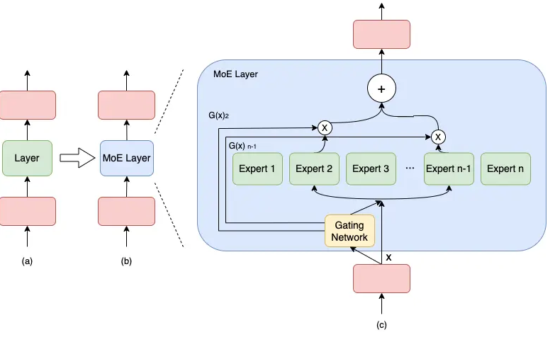
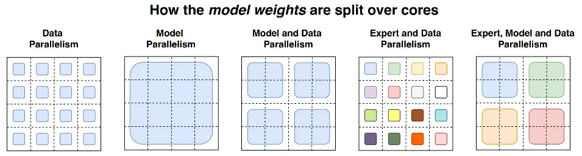
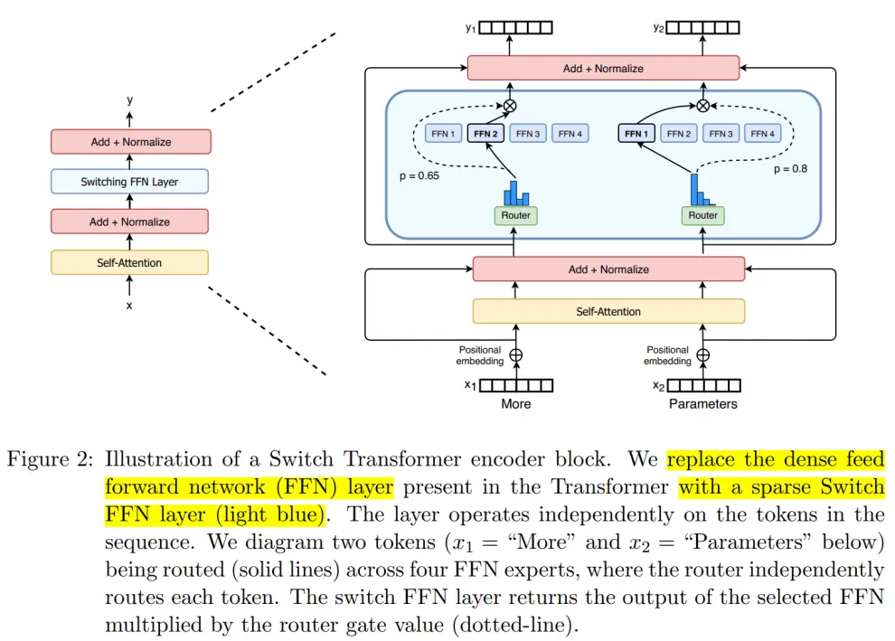

# 8.MOE并行

### 1.MOE

通常来讲，模型规模的扩展会导致训练成本显著增加，计算资源的限制成为了大规模密集模型训练的瓶颈。为了解决这个问题，一种基于稀疏 MoE 层的深度学习模型架构被提出，即**将大模型拆分成多个小模型(专家，****`expert`****)， 每轮迭代根据样本决定激活一部分专家用于计算，达到了节省计算资源的效果；** 并引入可训练并确保稀疏性的门( `gate` )机制，以保证计算能力的优化。

与密集模型不同，MoE 将模型的某一层扩展为多个具有相同结构的专家网络( `expert` )，并由门( `gate` )网络决定激活哪些 `expert` 用于计算，从而实现超大规模稀疏模型的训练。

以下图为例，模型包含 3 个模型层，如(a)到(b)所示，将中间层扩展为具有 `n` 个 `expert` 的 MoE 结构，并引入 `Gating network` 和 `Top_k` 机制，MoE 细节如下图(c)所示。



计算过程如下述公式。

$$
M o E(x)=\sum_{i=1}^{n}\left(G(x)_{i} E_{i}(x)\right) ~~~~~~~~~~~~~~~~(1)
$$

$$
G(x)=\operatorname{Top} K\left(\operatorname{softmax}\left(W_{g}(x)+\epsilon\right)\right) ~~~~~~(2)
$$

上述第 1 个公式表示了包含 `n` 个专家的 MoE 层的计算过程。具体来讲，首先对样本 `x` 进行门控计算， `W` 表示权重矩阵；然后，由 `Softmax` 处理后获得样本 `x` 被分配到各个 `expert` 的权重； 然后，只取前 `k` (通常取 1 或者 2）个最大权重；最终，整个 `MoE Layer` 的计算结果就是选中的 `k` 个专家网络输出的加权和。

### 2.MOE分布式并行策略

上面讲述了 MOE 整体结构，下面来讲述含MOE架构的模型的分布式并行策略。



#### 2.1 MOE + 数据并行

该策略是在数据并行模式下包含MOE架构，门网络(gate)和专家网络都被复制地放置在各个运算单元上。下图展示了一个有三个专家的两路数据并行MoE模型进行前向计算的方式。


该方式通常来说，对于现有的代码侵入性较小。但该方式唯一的问题是，专家的数量受到单个计算单元(如：GPU)的内存大小限制。

#### 2.2 MOE + 模型并行

该策略门网络依然是复制地被放置在每个计算单元上， 但是专家网络被独立地分别放置在各个计算单元上。因此，需引入额外的通信操作，该策略可以允许更多的专家网络们同时被训练，而其数量限制与计算单元的数量(如：GPU数量)是正相关的。

下图展示了一个有六个专家网络的模型被两路专家并行地训练。注意：专家1-3被放置在第一个计算单元上，而专家4-6被放置在第二个计算单元上。


该模式针对不同的模型和设备拓扑需要专门的并行策略，同时会引入额外的通信，因此，相较于数据并行+MOE策略，侵入性更强。

除了上述两种MOE并行方案之外，还可以**MOE+数据并行+模型并行**、**MOE+ZeRO增强的数据并行**等。

### 3.业界大模型的MOE并行方案

#### 3.1 GShard

GShard 是第一个将 MoE 的思想拓展到 Transformer 上的工作。具体的做法就是把 **Transformer 的 encoder 和 decoder 中每隔一个（every other）的FFN层，替换成 position-wise 的 MoE 层，使用的都是 Top-2 gating network**。


此处之外，GShard还加入了很多其他设计：

-   **Expert capacity balancing**：强制每个expert处理的tokens数量在一定范围内。
-   **Local group dispatching**：通过把一个batch内所有的tokens分组，来实现并行化计算。
-   **Auxiliary loss**：为了缓解“赢者通吃”问题，尽可能把token均分给各个专家。
-   **Random routing**：在Top-2 gating的设计下，两个expert如何更高效地进行routing。

#### 3.2 Switch-Transformer

Switch-Transformer 是在T5模型的基础上加入了 MoE 设计，并在C4数据集上预训练，得到了一个“又快又好”的预训练大模型。

Swith Transformer 简化了MoE的routing算法，从而大大提高了计算效率，具体如下图所示：



Swith Transformer 其设计的指导原则是以一种简单高效的实现方式**尽可能地把Transformer模型的参数量做大**。跟其他MoE模型的一个显著不同就是，**Switch Transformer 的 gating network 每次只 route 到 1 个 expert**，而其他的模型都是至少2个。这样就是最稀疏的MoE了，因此单单从MoE layer的计算效率上讲是最高的了。

#### 3.3 GLaM

这是 Google 在2021年底推出的一个超大模型，完整的 GLaM 总共有 1.2T 参数，每个 MoE 包含 64 个专家，总共 32 个 MoE 层，但在推理期间，模型只会激活 97B 的参数，占总参数的 8%。

GLaM 的体系架构，**每个输入 token 都被动态路由到从 64 个专家网络中选择的两个专家网络中进行预测**，如下图所示。


GLaM比GPT-3大7倍，但是由于使用了Sparse MoE的设计，训练成本却只有GPT-3的1/3，并且推理过程中的计算量减少了约一半；同时，在29个NLP任务上超越了GPT-3。


### 4.AI训练框架中的MOE并行训练

从 Google 发布的很多的论文和超大参数规模模型（千/万亿参数）可以看到，其基本都使用了 MOE 架构。除此之外，业界很多的AI训练框架中也继承了 MOE 并行，比如：PaddlePaddle、DeepSpeed、ColossalAI等。

#### 4.1 PaddlePaddle 中的 MOE 并行

下面是一个在动态图模式下使用 PaddlePaddle 框架进行 MoE 架构的适配和训练示例。

```python
# 导入需要的包
import paddle
from paddle.nn import Layer, LayerList, Linear, Dropout
from paddle.incubate.distributed.models.moe import MoELayer
from paddle.distributed.collective import Group
from paddle.distributed import fleet
import numpy as np

# 专家数
num_experts = 8

d_model = 512
d_hidden = 2048


# 封装专家层
class ExpertLayer(Layer):
    def __init__(self, d_model, d_hidden, name=None):
        super().__init__()
        self.htoh4 = Linear(d_model, d_hidden)
        self.h4toh = Linear(d_hidden, d_model)

    def forward(self, x):
        x = self.htoh4(x)
        x = self.h4toh(x)
        return x


# 初始化分布式环境，并构建 expert 通信组 moe_group
fleet.init(is_collective=True)
moe_group = paddle.distributed.new_group(list(range(fleet.worker_num())))


gate_config = {
    "type": "gshard",
    "top_k": 2,
}


experts_list = LayerList()
for expi in range(num_experts):
    exp_layer = ExpertLayer(d_model, d_hidden)
    experts_list.append(exp_layer)


# 调用 MoELayer API 封装并创建出 MoE 模型
class Model(Layer):
  def __init__(self, d_model, d_hidden, name=None):
      super().__init__()
      self.linear1 = Linear(d_model, d_model)
      self.moe_layer = MoELayer(d_model = d_model,
                              experts=experts_list,
                              gate=gate_config,
                              moe_group=moe_group,
                              recompute_interval=0)

      self.linear2 = Linear(d_model, d_model)
      self.dropout = Dropout(p=0.1)

  def forward(self, x):
      x = self.linear1(x)
      x = self.moe_layer(x)
      x = self.linear2(x)
      x = self.dropout(x)
      return x


model = Model(d_model, d_hidden)
optim = paddle.optimizer.SGD(parameters=model.parameters())

# 创建数据集，开始训练
for step in range(1, 100):
    x = paddle.rand([4, 256, d_model])

    y = model(x)
    loss = y.mean()
    loss.backward()
    optim.step()

    optim.clear_grad()

    print("=== step : {}, loss : {}".format(step, loss.numpy()))

```

#### 4.2 DeepSpeed 中的 MOE 并行

DeepSpeed中也提供了对 MOE 并行的支持。目前，DeepSpeed MoE 支持五种不同的并行形式，可以同时利用GPU和CPU内存，具体如下表所示。


下面是使用 ZeRO-Offload (stage 2) 和 DeepSpeed MOE组合的样例：

```python
# MOE 模型架构
class Net(nn.Module):
    def __init__(self):
        super(Net, self).__init__()
        self.conv1 = nn.Conv2d(3, 6, 5)
        self.pool = nn.MaxPool2d(2, 2)
        self.conv2 = nn.Conv2d(6, 16, 5)
        self.fc1 = nn.Linear(16 * 5 * 5, 120)
        self.fc2 = nn.Linear(120, 84)
        if args.moe:
            # MoE 层
            fc3 = nn.Linear(84, 84)
            self.moe_layer_list = []
            for n_e in args.num_experts:
                # 基于专家数创建 MOE 层
                self.moe_layer_list.append(
                    deepspeed.moe.layer.MoE(
                        hidden_size=84,
                        expert=fc3,
                        num_experts=n_e,
                        ep_size=args.ep_world_size,
                        use_residual=args.mlp_type == 'residual',
                        k=args.top_k,
                        min_capacity=args.min_capacity,
                        noisy_gate_policy=args.noisy_gate_policy))
            self.moe_layer_list = nn.ModuleList(self.moe_layer_list)
            self.fc4 = nn.Linear(84, 10)
        else:
            # 原始模型层
            self.fc3 = nn.Linear(84, 10)

    def forward(self, x):
        x = self.pool(F.relu(self.conv1(x)))
        x = self.pool(F.relu(self.conv2(x)))
        x = x.view(-1, 16 * 5 * 5)
        x = F.relu(self.fc1(x))
        x = F.relu(self.fc2(x))
        if args.moe:
            # 将原始 FFN 层替换成 MoE 层
            for layer in self.moe_layer_list:
                x, _, _ = layer(x)
            x = self.fc4(x)
        else:
            x = self.fc3(x)
        return x


net = Net()


# 组合 ZeRO-Offload (stage 2) 和 DeepSpeed MOE
def create_moe_param_groups(model):
    from deepspeed.moe.utils import split_params_into_different_moe_groups_for_optimizer

    parameters = {
        'params': [p for p in model.parameters()],
        'name': 'parameters'
    }

    return split_params_into_different_moe_groups_for_optimizer(parameters)


parameters = filter(lambda p: p.requires_grad, net.parameters())
if args.moe_param_group:
    parameters = create_moe_param_groups(net)


ds_config = {
  "train_batch_size": 16,
  "steps_per_print": 2000,
  "optimizer": {
    "type": "Adam",
    "params": {
      "lr": 0.001,
      "betas": [
        0.8,
        0.999
      ],
      "eps": 1e-8,
      "weight_decay": 3e-7
    }
  },
  "scheduler": {
    "type": "WarmupLR",
    "params": {
      "warmup_min_lr": 0,
      "warmup_max_lr": 0.001,
      "warmup_num_steps": 1000
    }
  },
  "gradient_clipping": 1.0,
  "prescale_gradients": False,
  "bf16": {
      "enabled": args.dtype == "bf16"
  },
  "fp16": {
      "enabled": args.dtype == "fp16",
      "fp16_master_weights_and_grads": False,
      "loss_scale": 0,
      "loss_scale_window": 500,
      "hysteresis": 2,
      "min_loss_scale": 1,
      "initial_scale_power": 15
  },
  "wall_clock_breakdown": False,
  "zero_optimization": {
      "stage": args.stage,
      "allgather_partitions": True,
      "reduce_scatter": True,
      "allgather_bucket_size": 50000000,
      "reduce_bucket_size": 50000000,
      "overlap_comm": True,
      "contiguous_gradients": True,
      "cpu_offload": True
  }
}

# 初始化
model_engine, optimizer, trainloader, __ = deepspeed.initialize(
    args=args, model=net, model_parameters=parameters, training_data=trainset, config=ds_config)
...
```

### 5.总结

本文简要介绍了目前业界的一些 MOE 并行方案。如果说Transformer结构使得模型突破到上亿参数量，那么稀疏 MoE 结构可以在不显著增加计算成本的情况下，使模型参数量进一步突破，达到上千亿、万亿规模。虽然，1990年左右 MOE 的概念就已经出现了；但是可以预见，MOE 将在通往AGI的道路上扮演越来越重要的角色。
