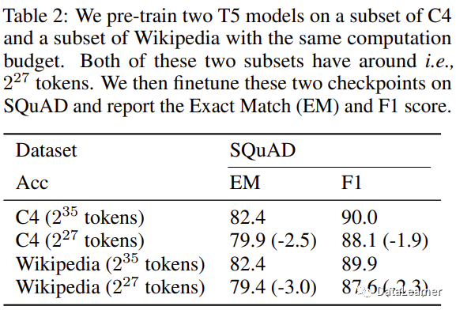

# 15.token及模型参数

参考资料：

-   [https://zhuanlan.zhihu.com/p/636812912](https://zhuanlan.zhihu.com/p/636812912 "https://zhuanlan.zhihu.com/p/636812912")
-   [https://mp.weixin.qq.com/s/DVH-vlOpGik8iwW4KnPlkw](https://mp.weixin.qq.com/s/DVH-vlOpGik8iwW4KnPlkw "https://mp.weixin.qq.com/s/DVH-vlOpGik8iwW4KnPlkw")
-   [https://mp.weixin.qq.com/s/DBP\_eafGeKMEuSIma9Z9Tg](https://mp.weixin.qq.com/s/DBP_eafGeKMEuSIma9Z9Tg "https://mp.weixin.qq.com/s/DBP_eafGeKMEuSIma9Z9Tg")

### 1.**预训练模型表现影响因素**

-   **模型表现强依赖于模型规模**(模型参数量`N`(Embedding除外)、训练Token数`D`、训练总计算量`C`)；
-   平滑幂定律：模型表现与三个因子均遵循幂定律，不受另外两个因子限制；
-   在给定计算量预算下，模型参数量以及训练Token数应该同比提升，对应模型参数量需要的训练Token数如下：

| Parameters  | FLOPs    | FLOPs (in Gopher unit) | Tokens         |
| ----------- | -------- | ---------------------- | -------------- |
| 400 Million | 1.92e+19 | 1//29,968              | 8.0 Billion    |
| 1 Billion   | 1.21e+20 | 1//4,761               | 20.2 Billion   |
| 10 Billion  | 1.23e+22 | 1//46                  | 205.1 Billion  |
| 67 Billion  | 5.76e+23 | 1                      | 1.5 Trillion   |
| 175 Billion | 3.85e+24 | 6.7                    | 3.7 Trillion   |
| 280 Billion | 9.90e+24 | 17.2                   | 5.9 Trillion   |
| 520 Billion | 3.43e+25 | 59.5                   | 11.0 Trillion  |
| 1 Trillion  | 1.27e+26 | 221.3                  | 21.2 Trillion  |
| 10 Trillion | 1.30e+28 | 22515.9                | 216.2 Trillion |

总体来说，这些结果表明，随着适当地提高模型大小、数据和计算能力，语言建模性能会平稳、可预测地提高。更大的语言模型将比其他模型表现更好，并且更具样本效率。

### 2.预训练数据 Token 重复 是否影响 模型性能？

-   **多轮epoch的训练会降低模型性能；**
-   更大规模的数据集会缓解重复epochs对模型性能下降的影响；
-   提高数据集的质量也无法挽救重复训练带来的过拟合；
-   小计算量模型的过拟合趋势与大计算量的差不多；
-   多样的训练目标不一定减轻多Epoch的性能下降；
-   Dropout是一个被大语言模型忽视的正则技术，虽然慢，但是可以降低多epochs的影响；
-   在训练过程中逐渐使用dropout是有效的策略；

### 3.SFT需要训练Token数？

-   少量高质量、多样性的数据，也可以训练出效果优秀的SFT模型

### 4.为什么要考虑在重复的数据集上做多次训练？

在此前的研究中，大家发现大语言模型的规模和训练数据集中tokens的数量对模型的性能有很大的影响。大模型扩展定律都认为模型的规模与训练数据的规模必须同时扩大才能让模型产生更好的性能。但是，tokens数量似乎并不是很足够，如下图所示是作者研究的模型参数规模增长和目前互联网是可用的数据集tokens数量增长情况：

在这幅图中，蓝色的虚线是互联网上数据集中tokens数量预估结果，高质量文本中tokens数量每年增长只有4%-5%，与世界经济增长率差不多，但是显著慢于模型规模的增长。例如，MetaAI训练的LLaMA-65B模型用了1.4万亿tokens，而2023年全球的tokens估计只有9万亿！按照目前模型规模的发展情况，在2023年-2027年几年的时间里，我们的模型将把全球所有数据集的tokens都训练完成，此后，我们很可能陷入缺少tokens训练的地步，这被作者称为**tokens危机**。

这就很自然的让大家想到，我们**是否可以通过增加训练的epochs来做重复的训练，以提高模型的效果？** 在如Vision Transformers这样的模型中，模型训练的epochs高达300次，而大语言模型的训练epochs通常都是1-2次，多的也都是个位数。2022年，**Hoffmann的论文中提出用重复的tokens训练大语言模型会让模型降低性能，而Taylor在训练Galactica模型时候发现epochs次数达到4次也可以提升模型效果**。显然，在重复数据集上训练多次对模型的影响目前还没有一个相对完善的研究。但是这个问题很重要！

因此，新加坡国立大学的研究人员做了这项研究，系统性分析了大语言模型epochs的设置影响，从3个方面得出了11个结论！本文将主要总结一下这些结论。

作者使用了开源的数据集和模型做了很多测试，对于实验设置我们不再描述。

### 5.预训练数据集重复的影响是什么？

#### 5.1 模型参数规模与tokens数量需要匹配

首先是模型参数规模的增长与模型需要的tokens数量基本是呈线性的。

这意味如果你**要充分训练一个LLM，需要根据它的参数数量来收集足够的tokens**。

#### 5.2 多轮epoch的训练会降低模型性能

作者分别使用C4数据集的子集，然后只是用了其中一部分数据集，并通过设置多次epochs来让模型总的训练过的tokens差不多水平，观察模型的性能。

如下图所示，可以看到，**数据集重复的次数越多，模型的性能越差**：

此外，**如果tokens数量不够，模型参数规模越大，越容易出现过拟合的现象**！

尽管重复数据上的训练会降低预训练模型的效果，但是这种方式对于下游任务的影响也没有人探测过。因此，作者也继续做了这方面的研究，得到的结论是在下游任务上也会出现，即**如果预训练模型在重复数据上进行，尽管训练的总的tokens数量可能一致，但是，其下游任务的效果也是更差！**

### 6.影响多次Epochs训练效果下降的原因是什么？

#### 6.1 更大规模的数据集会缓解重复epochs对模型性能下降的影响

在这个实验中，作者将重复的次数固定，然后看模型在不同规模数据集上重复训练的性能影响。如下图所示：

可以看到，当在227227个tokens和229229个tokens上重复训练2828次之后发现，前者更容易出现过拟合，而229229tokens的数据集上重复训练，模型性能下降不明显。

#### 6.2 提高数据集的质量也无法挽救重复训练带来的过拟合

Taylor在训练Galactica模型时候认为他之所以用4 epochs能提高训练效果可能是因为他的数据集质量更好。然而，本文的作者发现，**相对更高质量的数据集并不能降低重复训练带来的影响**。

作者用相同的重复策略在C4数据集和Wikipedia数据集上分别训练模型，发现二者都会因为重复训练带来模型性能的下降。这里的Wikipedia数据集质量相对C4更好一点。**说明相对提高数据集质量可能不会影响重复训练的负面效应**。

#### 6.3 参数数量和FLOPs在重复训练上的影响

模型规模的增长其实表现在2个方面，一个是**模型参数**，一个是**模型所需要的计算量**。模型参数相同的情况下，采用不同的模型架构所需要的FLOPs是不同的。作者对比了MoE架构，并采用ParamShare方法降低相同参数模型的FLOPs。

经过测试发现，**FLOPs较大的模型性能会更好一点，但是依然无法有效降低重复训练带来的模型损失**。

#### 6.4 小计算量模型的过拟合趋势与大计算量的差不多

这是一个有趣的发现，尽管在前面的实验中，相同参数规模不同计算量的模型都会受到重复数据集训练的影响。但是二者在模型性能表现的趋势上类似。

这意味着我们**可以利用较低计算量的模型预估大模型的训练结果**。在大语言模型的训练中，训练成本很高。采用类似的模型，但是更低的计算量来预估模型的表现将十分有价值！

#### 6.5 多样的训练目标可以减轻多Epoch下降吗？

目前大语言模型的训练目标有很多，例如预测下一个单词是神什么的生成式目标，也有把单词masked之后用来判断是什么单词的判别式目标。**如果语言模型的训练目标多样化，那么实际上更加可能受到多epoch带来的性能损失**。

例如，UL2这种模型就不适合多Epoch的训练，MLM这种模型受到的影响反而更小。

### 7.正则化可以降低多epochs的影响吗

正则技术，如dropout、droppath、weight decay等都是常用的防止过拟合的技术。而多Epochs的负面影响也都是过拟合。因此，作者研究了这些正则技术是否可以降低多epochs的影响。

#### 7.1 Dropout是一个被大语言模型忽视的正则技术，虽然慢，但是可以降低多epochs的影响

在目前超过100亿参数规模的大语言模型中，如GPT-3、PaLM、LLaMA等，都没有使用dropout（可能是因为太慢了）。而前面说的Galactica训练使用了，这是Galactica能够训练4Epochs提升性能的最重要的原因。

#### 7.2 在训练过程中逐渐使用dropout是有效的策略

在前面的讨论中，作者已经发现**dropout可以降低多epochs的影响，但是dropout会降低模型的性能**。因此，作者考虑不在全部训练中使用dropout，而是逐渐引入。

最终发现，**如果前期训练不用dropout，在后续的迭代中使用dropout也是有效的**！

#### 7.3 dropout对不同规模模型的影响不同

尽管前面已经证明dropout使用可以降低多epochs的影响，但是在**不同规模模型下是不同的**。对于规模较大的模型，dropout不能有效降低多epochs带来的坏处！

#### 7.4 通过MoE扫描确定稠密模型的最佳超参数

最后一个结论其实与epoch关系不大，作者强调的是MoE的模型表现与大模型真正的训练有类似的趋势，因此**用MoE去提前预估大模型的性能，做参数调优是一个非常好的思路**。

### 8.多epochs训练对大语言模型性能影响的总结

根据前面的实验我们知道，如果在tokens数量一定的数据集上做多epochs的模型训练，会影响模型的性能，降低模型的效果。这在预训练和下游任务都会产生影响。但是，随着模型的发展，高质量数据集的tokens数将很快用完。而采用正则技术虽然会影响模型训练效率，但是会降低这种影响。
