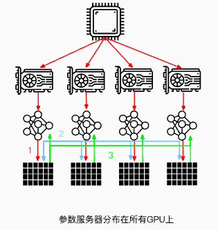

# 2.数据并行

### 1.简述

所谓数据并行，就是由于训练数据集太大；因此，**将数据集分为N份，每一份分别装载到N个GPU节点中，同时，每个GPU节点持有一个完整的模型副本**，分别基于每个GPU中的数据去进行梯度求导。然后，在GPU0上对每个GPU中的梯度进行累加，最后，再将GPU0聚合后的结果广播到其他GPU节点。


注意：这里是以GPU0作为参数服务器，除此之外，还可以使用CPU作为参数服务器。但是这种场景的训练速度通常会慢于使用GPU0作为参数服务器（通常情况下，GPU与CPU之间通信使用PCIe，而GPU与GPU之间通信使用Nvlink）。


当然，还可以将参数服务器分布在所有GPU节点上面，每个GPU只更新其中一部分梯度。



当然，数据并行不仅仅指对训练的数据并行操作，还可以对网络模型梯度、权重参数、优化器状态等数据进行并行。


下面主要以PyTorch中数据并行的发展为主线讲述现有一些数据并行方法。

### 2.数据并行（PyTorch DP）

数据并行(`torch.nn.DataParallel`)，这是Pytorch最早提供的一种数据并行方式，它基于单进程多线程进行实现的，它使用**一个进程来计算模型权重**，在每个批处理期间将数据分发到每个GPU。

DataParallel 的计算过程如下所示：

-   将 inputs 从主 GPU 分发到所有 GPU 上。
-   将 model 从主 GPU 分发到所有 GPU 上。
-   每个 GPU 分别独立进行前向传播，得到 outputs。
-   将每个 GPU 的 outputs 发回主 GPU。
-   在主 GPU 上，通过 loss function 计算出 loss，对 loss function 求导，求出损失梯度。
-   计算得到的梯度分发到所有 GPU 上。
-   反向传播计算参数梯度。
-   将所有梯度回传到主 GPU，通过梯度更新模型权重。
-   不断重复上面的过程。


它使用非常简单，仅需一行代码即可实现。

```python
net = torch.nn.DataParallel(model, device_ids=[0, 1, 2])
output = net(input_var)  # input_var can be on any device, including CPU
```

但是它的缺点也很明显：

-   **单进程多线程带来的问题**：DataParallel使用单进程多线程进行实现的，方便了信息的交换，但受困于 GIL，会带来性能开销，速度很慢。而且，只能在单台服务器（单机多卡）上使用（不支持分布式）。同时，不能使用 Apex 进行混合精度训练。
-   **效率问题，主卡性能和通信开销容易成为瓶颈，GPU 利用率通常很低**：数据集需要先拷贝到主进程，然后再分片（split）到每个设备上；权重参数只在主卡（GPU0）上更新，需要每次迭代前向所有设备做一次同步；每次迭代的网络输出需要聚集到主卡（GPU0）上。因此，通信很快成为一个瓶颈。除此之外，这将导致主卡和其他卡之间，**GPU利用率严重不均衡**（比如：主卡使用了10G显存，而其他卡只使用了2G显存，batch size稍微设置大一点主卡的显存就OOM了）。
-   **不支持模型并行**，由于其本身的局限性，没办法与模型并行组合使用。

当然，目前PyTorch官方建议使用DistributedDataParallel，而不是DataParallel类来进行多 GPU 训练，即使在单机多卡的情况下。那么下面我们来看看PyTorch DDP。

### 3.分布式数据并行 **（PyTorch DDP）**

分布式数据并行(`torch.nn.DistributedDataParallel`)，基于多进程进行实现的，每个进程都有独立的优化器，执行自己的更新过程。每个进程都执行相同的任务，并且每个进程都与所有其他进程通信。进程（GPU）之间只传递梯度，这样网络通信就不再是瓶颈。


具体流程如下：

-   首先将 rank=0 进程中的模型参数广播到进程组中的其他进程；
-   然后，每个 DDP 进程都会创建一个 **local Reducer** 来负责梯度同步。
-   在训练过程中，每个进程从磁盘加载 batch 数据，并将它们传递到其 GPU。每个 GPU 都有自己的前向过程，完成前向传播后，**梯度在各个 GPUs 间进行 All-Reduce**，每个 GPU 都收到其他 GPU 的梯度，从而可以独自进行反向传播和参数更新。
-   同时，每一层的梯度不依赖于前一层，所以**梯度的 All-Reduce 和后向过程同时计算**，以进一步缓解网络瓶颈。
-   在后向过程的最后，每个节点都得到了平均梯度，这样各个 GPU 中的模型参数保持同步 。


而**DataParallel** 是将梯度 reduce 到主卡，在主卡上更新参数，再将参数 broadcast 给其他 GPU，这样**无论是主卡的负载还是通信开销都比 DDP 大很多**)，相比于DataParallel，DistributedDataParallel方式可以更好地进行多机多卡运算，更好的进行负载均衡，运行效率也更高，虽然使用起来较为麻烦，但对于追求性能来讲是一个更好的选择。

以下为DistributedDataParallel的简单示例，使用 `torch.nn.Linear `作为本地模型，用 DDP 对其进行包装，然后在 DDP 模型上运行一次前向传播、一次反向传播和更新优化器参数步骤。 之后，本地模型上的参数将被更新，并且不同进程上的所有模型完全相同。

```python
import torch
import t dist
import torch.multiprocessing as mp
import torch.nn as nn
import torch.optim as optim
from torch.nn.parallel import DistributedDataParallel as DDP


def example(rank, world_size):
    # create default process group
    dist.init_process_group("gloo", rank=rank, world_size=world_size)
    # create local model
    model = nn.Linear(10, 10).to(rank)
    # construct DDP model
    ddp_model = DDP(model, device_ids=[rank])
    # define loss function and optimizer
    loss_fn = nn.MSELoss()
    optimizer = optim.SGD(ddp_model.parameters(), lr=0.001)

    # forward pass
    outputs = ddp_model(torch.randn(20, 10).to(rank))
    labels = torch.randn(20, 10).to(rank)
    # backward pass
    loss_fn(outputs, labels).backward()
    # update parameters
    optimizer.step()

def main():
    world_size = 2
    mp.spawn(example,
        args=(world_size,),
        nprocs=world_size,
        join=True)

if __name__=="__main__":
    # Environment variables which need to be
    # set when using c10d's default "env"
    # initialization mode.
    os.environ["MASTER_ADDR"] = "localhost"
    os.environ["MASTER_PORT"] = "29500"
    main()
```

#### 3.1 DP和DDP的区别

DP 和 DDP 的主要差异有以下几点：

-   DP 是基于单进程多线程的实现，只用于单机情况，而 DDP 是多进程实现的，每个 GPU 对应一个进程，适用于单机和多机情况，真正实现分布式训练，并且因为每个进程都是独立的 Python 解释器，DDP 避免了 GIL 带来的性能开销。
-   参数更新的方式不同。DDP在各进程梯度计算完成之后，各进程需要将梯度进行汇总平均，然后再由 rank=0 的进程，将其广播到所有进程后，各进程用该梯度来独立的更新参数（而 DP是梯度汇总到 GPU0，反向传播更新参数，再广播参数给其他剩余的 GPU）。由于DDP各进程中的模型，初始参数一致 (初始时刻进行一次广播)，而每次用于更新参数的梯度也一致；因此，各进程的模型参数始终保持一致（而在DP中，全程维护一个 optimizer，对各个GPU上梯度进行求平均，而在主卡进行参数更新，之后再将模型参数广播到其他GPU）。相较于DP，DDP传输的数据量更少，训练更高效，不存在 DP 中负载不均衡的问题。目前，基本上 DP 已经被弃用。
-   DDP 支持模型并行，而 DP 并不支持，这意味如果模型太大单卡显存不足时，只能使用DDP。

#### 3.2 补充说明

DP数据传输过程：

1.  前向传播得到的输出结果gather到主cuda计算loss
2.  scatter上述loss到各个cuda
3.  各个cuda反向传播计算得到梯度后gather到主cuda后，主cuda的模型参数被更新。
4.  主cuda将模型参数broadcast到其它cuda设备上，至此，完成权重参数值的同步。

综上，DP大概是有4次输出传输。

DDP数据传输过程：

1.  前向传播的输出和loss的计算都是在每个cuda独立计算的，梯度all-reduce到所有的CUDA(传输梯度)，这样初始参数相同，para.grad也相同，反向传播后参数就还是保持一致的，其他没有数据传输了。

### 4.完全分片数据并行 **(PyTorch FSDP)**

由于 PyTorch FSDP 受 DeepSpeed ZeRO 启发而获得灵感，因此，下面先简要介绍下 ZeRO。

#### 4.1 补充说明：ZeRO

通常来说，在模型训练的过程中，GPU上需要进行存储的参数包括了模型本身的参数、优化器状态、激活函数的输出值、梯度以及一些零时的Buffer。各种数据的占比如下图所示：


可以看到模型参数仅占模型训练过程中所有数据的一部分，当进行混合精度运算时，其中模型状态参数(优化器状态 + 梯度+ 模型参数）占到了一大半以上。因此，我们需要想办法去除模型训练过程中的冗余数据。

针对模型状态的存储优化（去除冗余），DeepSpeed 提出了 **ZeRO**，**ZeRO 使用的方法是分片，即每张卡只存 1/N 的模型状态量，这样系统内只维护一份模型状态参数**。

ZeRO对 模型状态（Model States）参数进行不同程度的分割，主要有三个不同级别：

-   \*\*ZeRO-1 \*\*: 对优化器状态分片（Optimizer States Sharding）
-   **ZeRO-2** : 对优化器状态和梯度分片（Optimizer States & Gradients Sharding）
-   **ZeRO-3** : 对优化器状态、梯度分片以及模型权重参数分片（Optimizer States & Gradients & Parameters Sharding）


**ZeRO-1**：

ZeRO-1没有将模型本身进行分片，也**没有将Gradient进行分片，而是只将优化器进行分片**。训练过程与DDP类似。

1.  forward过程由每个rank的GPU独自完整的完成，然后进行backward过程。在backward过程中，梯度通过allReduce进行同步。
2.  Optimizer state 使用贪心策略基于参数量进行分片，以此确保每个rank几乎拥有相同大小的优化器内存。
3.  每个rank只负责更新当前优化器分片的部分，由于每个rank只有分片的优化器state，所以当前rank忽略其余的state。
4.  在更新过后，通过广播或者allGather的方式确保所有的rank都收到最新更新过后的模型参数。

ZeRO-1 **非常适合使用类似Adam进行优化的模型训练**，因为Adam拥有额外的参数m（momentum）与v（variance），特别是FP16混合精度训练。ZeRO-1 不适合使用SGD类似的优化器进行模型训练，因为SGD只有较少的参数内存，并且由于需要更新模型参数，导致额外的通讯成本。ZeRO-1只是解决了Optimizer state的冗余。

**ZeRO-2**：

相比于ZeRO-1，**ZeRO-2除了对optimizer state进行切分，还对Gradient进行了切分**。

像ZeRO-1一样将optimizer的参数进行分片，并安排在不同的rank上。在backward过程中，**gradients被reduce操作到对应的rank上，取代了all-reduce**，以此减少了通讯开销。 每个rank独自更新各自负责的参数。在更新操作之后，广播或allGather保证所有的ranks接收到更新后的参数。

**ZeRO-3**：

为了进一步节省更多的内存，**ZeRO-3提出进行模型参数的分片**。类似以上两种分片方式，ranks负责模型参数的切片。可以进行参数切片的原因主要有以下两点：

1.  All-Reduce操作可以被拆分为Reduce与allgather操作的结合。
2.  模型的每一层拥有该层的完整参数，并且整个层能够直接被一个GPU装下。所以计算前向的时候，除了当前rank需要的层之外，其余的层的参数可以抛弃。从这个层面上来说，Zero相当于数据并行+模型并行。

#### 4.2 FSDP

完全分片数据并行(`torch.distributed.fsdp.FullyShardedDataParallel`)，是Pytorch最新的数据并行方案，在1.11版本引入的新特性，目的主要是用于训练大模型。我们都知道Pytorch DDP用起来简单方便，但是要求整个模型加载到一个GPU上，这使得大模型的训练需要使用额外复杂的设置进行模型分片。因此，为了打破模型分片的障碍（**包括模型参数，梯度，优化器状态**）；同时，仍然保持了数据并行的简单性，该新特性应运而生。

FSDP 是一种新型数据并行训练方法，但与传统的数据并行不同，传统的数据并行维护模型参数、梯度和优化器状态的每个 GPU 副本，而 **FSDP 将所有这些状态跨数据并行工作线程进行分片，并且可以选择将模型参数分片卸载到 CPU**。

下图显示了 FSDP 如何在 2 个数据并行进程中工作流程：


通常，模型层以嵌套方式用 FSDP 包装，因此，只有**单个 FSDP 实例**中的层需要在前向或后向计算期间将完整参数收集到**单个设备**。 计算完成后，收集到的完整参数将立即释放，释放的内存可用于下一层的计算。 通过这种方式，可以节省峰值 GPU 内存，从而可以扩展训练以使用更大的模型大小或更大的批量大小。 为了进一步最大化内存效率，当实例在计算中不活动时，FSDP 可以将参数、梯度和优化器状态卸载到 CPU。

解锁ZeRO/FSDP的关键是我们可以把DDP之中的All-Reduce操作分解为独立的 Reduce-Scatter 和 All-Gather 操作。


All-Reduce 是 Reduce-Scatter 和 All-Gather 的组合。聚合梯度的标准 All-Reduce 操作可以分解为两个单独的阶段。

-   Reduce-Scatter 阶段，在每个GPU上，会基于 rank 索引对 rank 之间相等的块进行求和。
-   All-Gather 阶段，每个GPU上的聚合梯度分片可供所有GPU使用。

通过重新整理 Reduce-Scatter 和 All-Gather，每个 DDP worker只需要存储一个参数分片和优化器状态。

在 PyTorch 中使用 FSDP 包装模型有两种方法。

-   自动包装（Auto Wrapping）是 DDP 的直接替代品；
-   手动包装（Manual Wrapping）需要对模型定义代码进行少量的更改，并且能够探索复杂的分片策略。

**自动包装（Auto Wrapping）**

模型层应以嵌套方式包装在 FSDP 中，以节省峰值内存并实现通信和计算重叠。 最简单的方法是自动包装，它可以作为 DDP 的直接替代品，而无需更改其余代码。

`fsdp_auto_wrap_policy`参数允许指定可调用函数以使用 FSDP 递归地包裹层。 PyTorch FSDP提供的`default_auto_wrap_policy`函数递归地包裹参数数量大于100M的层。当然，您也可以根据需要提供自己的包装策略。

此外，可以选择配置 `cpu_offload`，以便在计算中不使用包装参数时将这些参数卸载到 CPU。 这可以进一步提高内存效率，但代价是主机和设备之间的数据传输开销。

下面的示例展示了如何使用自动包装（Auto Wrapping）来包装 FSDP。

```python
from torch.distributed.fsdp import (
   FullyShardedDataParallel,
   CPUOffload,
)
from torch.distributed.fsdp.wrap import (
   default_auto_wrap_policy,
)
import torch.nn as nn
 
class model(nn.Module):
   def __init__(self):
       super().__init__()
       self.layer1 = nn.Linear(8, 4)
       self.layer2 = nn.Linear(4, 16)
       self.layer3 = nn.Linear(16, 4)
 
model = DistributedDataParallel(model())
fsdp_model = FullyShardedDataParallel(
   model(),
   fsdp_auto_wrap_policy=default_auto_wrap_policy,
   cpu_offload=CPUOffload(offload_params=True),
)
```

**手动包装（Manual Wrapping）**

通过有选择地对模型的某些部分应用包装，手动包装对于探索复杂的分片策略非常有用。 总体设置可以传递给enable\_wrap()上下文管理器。

```python
from torch.distributed.fsdp import (
   FullyShardedDataParallel,
   CPUOffload,
)
from torch.distributed.fsdp.wrap import (
   enable_wrap,
   wrap,
)
import torch.nn as nn
from typing import Dict
 
 
class model(nn.Module):
   def __init__(self):
       super().__init__()
       self.layer1 = wrap(nn.Linear(8, 4))
       self.layer2 = nn.Linear(4, 16)
       self.layer3 = wrap(nn.Linear(16, 4))
 
wrapper_kwargs = Dict(cpu_offload=CPUOffload(offload_params=True))
with enable_wrap(wrapper_cls=FullyShardedDataParallel, **wrapper_kwargs):
   fsdp_model = wrap(model())
```

使用上述两种方法之一，用 FSDP 包装模型后，可以采用与本地训练类似的方式训练模型，具体如下所示：

```python
optim = torch.optim.Adam(fsdp_model.parameters(), lr=0.0001)
for sample, label in next_batch():
  out = fsdp_model(input)
  loss = criterion(out, label)
  loss.backward()
  optim.step()
```

#### 4.3 DDP和FSDP的区别


在标准的数据并行（DistributedDataParallel）训练方法中，**每个GPU上都有一个模型副本，向前和向后传递的序列只在自己的数据分片上进行运行**。在这些局部计算之后，每个局部过程的参数和优化器与其他GPU共享，以便计算全局权重更新。

而在FullyShardedDataParallel训练方法中：

-   **Model shard**：每个GPU上仅存在**模型的分片**。
-   **All-gather**：每个GPU通过all-gather从其他GPU收集所有**权重**，以在本地计算前向传播。
-   **Forward（local）**：在本地进行前向操作。前向计算和后向计算都是利用完整模型。
-   **All-gather**：然后在后向传播之前再次执行此**权重**收集。
-   **Backward（local）**：本地进行后向操作。前向计算和后向计算都是利用完整模型，此时每个GPU上也都是**全部梯度**。
-   **Reduce-Scatter**：在向后传播之后，局部**梯度**被聚合并且通过 Reduce-Scatter 在各个GPU上分片，每个分片上的梯度是聚合之后本分片对应的那部分。
-   **Update Weight（local）**：每个GPU更新其局部**权重**分片。

同时，为了最大限度地提高内存效率，我们可以在每层前向传播后丢弃全部权重，为后续层节省内存。这可以通过将 FSDP 包装应用于网络中的每一层来实现（通过设置`reshard_after_forward=True`）。

### 5.总结

本文主要讲解了大模型分布式训练并行技术的数据并行，并以Pytorch为主线讲解了DP、DDP、FSDP三种不同的数据并行方案。

DP 主要存在如下问题：

1.  单进程多线程模式，由于锁的机制导致线程间同步存在瓶颈。
2.  使用普通的All-Reduce机制，所有的卡需要将梯度同步给0号节点，并由0号节点平均梯度后反向传播，再分发给所有其他节点，意味着0号节点负载很重。
3.  由于第二点的原因，导致0号GPU通讯成本是随着GPU数量的上升而线性上升的。
4.  不支持多机多卡。

目前，由于性能问题，DP基本不用了。

而 DDP 是多进程实现的，每个 GPU 对应一个进程，适用于单机和多机情况，真正实现分布式训练，并且因为每个进程都是独立的 Python 解释器，DDP 避免了 GIL 带来的性能开销。

DDP在各进程梯度计算完成之后，各进程需要将梯度进行汇总平均，然后再由 rank=0 的进程，将其广播到所有进程后，各进程用该梯度来独立的更新参数。由于DDP各进程中的模型，初始参数一致 (初始时刻进行一次广播)，而每次用于更新参数的梯度也一致；因此，各进程的模型参数始终保持一致。相较于DP，DDP传输的数据量更少，训练更高效，不存在 DP 中负载不均衡的问题。

虽然Pytorch DDP实现了真正的分布式训练，同时，避免了DP 中负载不均衡的问题，但是，要求整个模型加载到一个GPU上，这使得大模型的训练需要使用额外复杂的设置进行模型分片。因此，为了打破模型分片的障碍（**包括模型参数，梯度，优化器状态**），同时仍然保持了数据并行的简单性，FSDP应运而生。

FSDP 是一种新型数据并行训练方法，但与传统的数据并行不同，传统的数据并行维护模型参数、梯度和优化器状态的每个 GPU 副本，而 FSDP 将所有这些状态跨数据并行工作线程进行分片，并且可以选择将模型参数分片卸载到 CPU。
