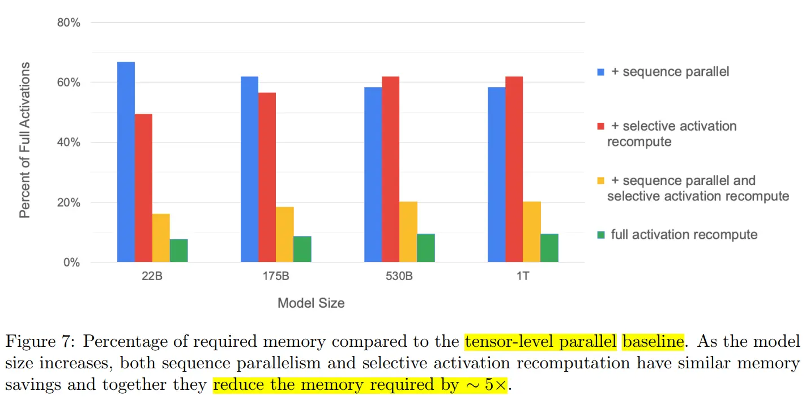

# 5.序列并行

### 1.序列并行（Colossal-AI）

> Colossal-AI 发表的论文：Sequence Parallelism: Long Sequence Training from System Perspective， 主要是**解决模型的输入长度(sequence length)限制**。

Colossal-AI 序列并行诞生的背景是 self-attention 的内存需求是输入长度（sequence length）的2次方。其复杂度为 $O(n^2)$，其中，n 是序列长度。换言之，**长序列数据将增加中间activation内存使用量，从而限制设备的训练能力**。

而现有的工作侧重于从算法的角度降低时间和空间复杂度。因此，作者提出了序列并行，这是一种内存高效的并行方法，可以帮助我们**打破输入序列长度限制，并在 GPU 上有效地训练更长的序列**；同时，该方法与大多数现有的并行技术兼容（例如：数据并行、流水线并行和张量并行）。

更重要的是，不再需要单个设备来保存整个序列。 即在稀疏注意力的情况下，我们的序列并行使我们能够训练具有无限长序列的 Transformer。


具体来说，**将输入序列分割成多个块，并将每个块输入到其相应的设备（即 GPU）中**。为了计算注意力输出，我们将环状通信与自注意力计算相结合，并提出了环自注意力（RSA）如下图所示。


实验表明，当按批量大小和序列长度进行缩放时，序列并行表现良好。


当扩展到 64 个 NVIDIA P100 GPU 时，与张量并相比，该法分别实现了 13.7 倍和 3.0 倍的最大批量大小和序列长度。

通过稀疏注意力，序列可以处理具有超过 114K 个 Token 的序列，这比现有的在单个设备上保存整个序列的稀疏注意力运行长度超过 27 倍。

除此之外，与张量并行和流水线并行不同，序列并行不受超参数（例如： 注意力头数、层数）限制。 因此，只要序列长度能被序列并行大小整除，我们的序列并行就可以使用。

### 2.序列并行

> Megatron-LM 发表的论文：Reducing Activation Recomputation in Large Transformer Models， 主要是**减少模型显存**。

Megatron-LM 的初衷是**考虑通过其他方式分摊张量并行中无法分摊的显存**，因此提出了序列并行的方法。

虽然 Megatron-LM 引用了 Colossal-AI 的序列并行的这篇文章，但是这两者其实并不是一个东西。

Megatron-LM 只是借用了 Colossal-AI 把 Sequence 这个维度进行平均划分的思想。在 张量的基础上，将 Transformer 层中的 LayerNorm 以及 Dropout 的输入按输入长度（Sequence Length）维度进行了切分，使得各个设备上面只需要做一部分的 Dropout 和 LayerNorm 即可。

这样做的好处有：

1.  LayerNorm 和 Dropout 的计算被平摊到了各个设备上，减少了计算资源的浪费；
2.  LayerNorm 和 Dropout 所产生的激活值也被平摊到了各个设备上，进一步降低了显存开销。

在 Megatron-LM 序列并行的这篇论文中，首先分析了 Transformer 模型运行时的显存占用情况。


假设输入长度为 s ，batch size为 b ，hidden dim为 h ，attention head数量为 a ，则每一层 Transformer（上图的灰色区域）的显存占用：

$$
Activations~memory~per~layer =s b h\left(34+5 \frac{a s}{h}\right)
$$

当我们开启了张量并行之后，上述Transformer层中的部分模块的显存可以被分摊到不同的设备之间。如下图所示，不能被分摊的部分主要是两个 LayerNorm 块的输入和输出： 4bsh ；两个 dropout mask 块：2bsh ；一共是 10bsh。


假设张量并行大小为t，因此，每个设备每一层 Transformer 的显存占用为：

$$
Activations~memory~per~layer =\operatorname{sbh}\left(10+\frac{24}{t}+5 \frac{a s}{h t}\right).
$$

下面开启张量并行以及序列并行，Transformer 层中的 LayerNorm 和 Dropout 块也会被切分，对 Tensor 在 Sequence 维度进行切分，切分数量等于张量并行大小。


每个设备每一层 Transformer 的显存占用为：

$$
Activations~memory~per~layer =\operatorname{sbh}\left(\frac{10}{t}+\frac{24}{t}+5 \frac{a s}{h t}\right)=\frac{s b h}{t}\left(34+5 \frac{a s}{h}\right).
$$

当然，做了额外的切分就会带来通信方式的改变。

Transformer 层的张量并行通信是由正向传播两个All-Reduce以及反向传播两个All-Reduce组成。

而序列并行由于对 Sequence 维度进行了划分，All-Reduce在这里已经不合适了。

为了收集在各个设备上进行序列并行所产生的结果，需要插入All-Gather算子；而为了使得张量并行所产生的结果可以传入序列并行层，需要插入Reduce-Scatter算子。

在下图中， g 所代表的就是前向传播的 All-Gather，反向传播的 Reduce-Scatter，$ \overline{g}  $则是相反的操作。


因此，我们可以清楚地看到，在 Megatron-LM 同时开启序列并行和模型并行时，每一个 Transformer 层完成一次前向传播和反向传播一共有 4 个 All-Gather 和 4 个 Reduce-Scatter 算子。乍一看，通信的操作比 Megatron-LM 仅开启张量并行多，但其实不然。因为，一个All-Reduce就相当于一个 Reduce-Scatter 和一个 All-Gather ，所以他们的总通信量是一样的。

通过添加序列并行并没有增加额外的通信开销，反而在后向传播代码的实现上，还把 Reduce-Scatter 和权重梯度的计算做了重叠，进一步减少了通信所占用的时间，使得提高设备的FLOPs Utilization成为了可能。

通过对Transformer层中所有Activation的消耗进行计算，发现在Transformer层里有一些操作是产生的激活值大，但计算量小。因此，就考虑干掉这一部分的激活值，通过选择性的进行激活重新计算（Selective Activation Recomputation）来进一步降低显存。与此同时，其他的激活值就通通保存，以节省重计算量。

通过对激活值的占比分析，序列并行降低了4成左右的激活值开销。选择性激活重新计算（selective activation recompute）也降低了4成左右的激活值开销。当两个特性都打开的时候，总共可以降低8成左右的激活值开销，尽管比全部激活值重计算的结果要稍高，但是在吞吐率上的提升还是非常的明显的。



### 3.Pytorch中的序列并行

上一篇张量并行的文章中提到 Pytorch 从 2.0.0 开始已经开始支持张量并行了。参考 Megatron-LM 的序列并行，目前在 Pytorch 中，也已经支持序列并行了，不过还没有 Release，具体示例如下所示：

```python
# 通过设备网格根据给定的 world_size 创建分片计划
device_mesh = DeviceMesh("cuda", torch.arange(0, args.world_size))

# 创建模型并移动到GPU
model = ToyModel().cuda(rank)

# 为并行化模块创建优化器
LR = 0.25
optimizer = torch.optim.SGD(model.parameters(), lr=LR)

# 根据给定的并行风格并行化模块，这里指定为序列并行
model = parallelize_module(model, device_mesh, SequenceParallel())

# 对分片模块执行多次前向/后向传播和优化器对参数进行更新。
for _ in range(args.iter_nums):
    # 对于 SP，所有rank的输入可以不同。
    inp = torch.rand(20, 10).cuda(rank)
    output = model(inp)
    output.sum().backward()
    optimizer.step()
```

### 4.总结

总的来说，Colossal-AI 的序列并行是为了打破单设备上序列长度的限制。而 Megatron-LM 的序列并行是在显存上面下了功夫，可以用更少的设备去运行大模型。除此之外，从文章细节里面可以看到，部分的计算的冗余被消除了，且重叠了一部分的通信，使得设备可以花更多的时间用于计算上面。虽然，Colossal-AI 和 Megatron-LM 都有序列并行，但是两者解决的问题、方法都不一样。除此之外，在Pytorch中，也已经支持序列并行了。
