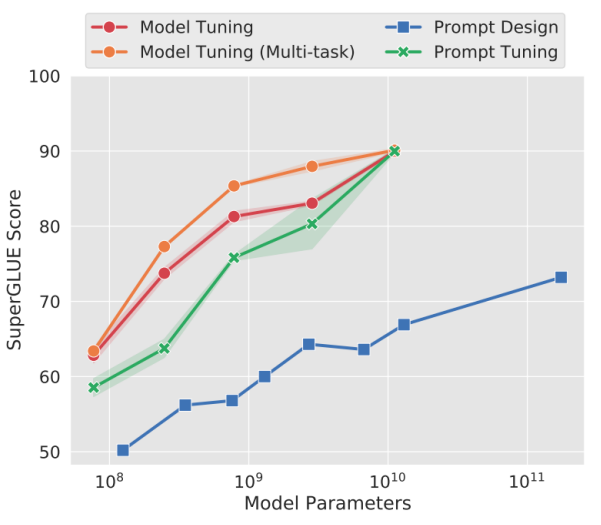

# 2.Prompting

### 1.BitFit

#### 1.1 背景

虽然对每个任务进行全量微调非常有效，但它也会为每个预训练任务生成一个独特的大型模型，这使得很难推断微调过程中发生了什么变化，也很难部署， 特别是随着任务数量的增加，很难维护。

理想状况下，我们希望有**一种满足以下条件的高效微调方法**：

-   到达能够匹配全量微调的效果。
-   仅更改一小部分模型参数。
-   使数据可以通过流的方式到达，而不是同时到达，便于高效的硬件部署。
-   改变的参数在不同下游任务中是一致的。

上述的问题取决于微调过程能多大程度引导新能力的学习以及暴露在预训练LM中学到的能力。

虽然，之前的高效微调方法Adapter-Tuning、Diff-Pruning也能够部分满足上述的需求。但是，作者提出了**一种参数量更小的稀疏的微调方法BitFit**，来满足上述的需求。

#### 1.2 技术原理

BitFit（论文：**BitFit: Simple Parameter-efficient Fine-tuning or Transformer-based Masked Language-models**）是一种**稀疏的微调方法**，它**训练时只更新bias的参数或者部分bias参数**。

对于Transformer模型而言，**冻结大部分 transformer-encoder 参数，只更新bias参数跟特定任务的分类层参数**。涉及到的bias参数有attention模块中计算`query`,`key`,`value`跟合并多个attention结果时涉及到的bias，MLP层中的bias，Layernormalization层的bias参数。

在Bert-Base/Bert-Large这种模型里，bias参数仅占模型全部参数量的0.08%～0.09%。但是通过在Bert-Large模型上基于GLUE数据集进行了 BitFit、Adapter和Diff-Pruning的效果对比发现，BitFit在参数量远小于Adapter、Diff-Pruning的情况下，效果与Adapter、Diff-Pruning想当，甚至在某些任务上略优于Adapter、Diff-Pruning。

同时，通过实验结果还可以看出，**BitFit微调结果相对全量参数微调而言, 只更新极少量参数的情况下，在多个数据集上都达到了不错的效果**，虽不及全量参数微调，但是远超固定全部模型参数的Frozen方式。

同时，通过对比BitFit训练前后的参数，**发现很多bias参数并没有太多变化**（例如：跟计算key所涉及到的bias参数）。发现计算query和将特征维度从N放大到4N的FFN层（intermediate）的bias参数变化最为明显，只更新这两类bias参数也能达到不错的效果，反之，固定其中任何一者，模型的效果都有较大损失。

### 2.Prefix Tuning

#### 2.1 背景

在Prefix Tuning之前的工作主要是人工设计离散的模版或者自动化搜索离散的模版。对于人工设计的模版，模版的变化对模型最终的性能特别敏感，加一个词、少一个词或者变动位置都会造成比较大的变化。而对于自动化搜索模版，成本也比较高；同时，以前这种离散化的token搜索出来的结果可能并不是最优的。

除此之外，传统的微调范式利用预训练模型去对不同的下游任务进行微调，对每个任务都要保存一份微调后的模型权重，一方面微调整个模型耗时长；另一方面也会占很多存储空间。

基于上述两点，Prefix Tuning提出**固定预训练LM**，**为LM添加可训练，任务特定的前缀，** 这样就可以为不同任务保存不同的前缀，微调成本也小；同时，这种Prefix实际就是连续可微的Virtual Token（Soft Prompt/Continuous Prompt），相比离散的Token，更好优化，效果更好。

#### 2.2 技术原理

Prefix Tuning（论文：**Prefix-Tuning: Optimizing Continuous Prompts for Generation**），**在输入token之前构造一段任务相关的virtual tokens作为Prefix，然后训练的时候只更新Prefix部分的参数，而PLM中的其他部分参数固定**。

针对不同的模型结构，需要构造不同的Prefix。

-   **针对自回归架构模型**：**在句子前面添加前缀**，得到 `z = [PREFIX; x; y]`，合适的上文能够在固定 LM 的情况下去引导生成下文（比如：GPT3的上下文学习）。
-   **针对编码器-解码器架构模型**：**Encoder和Decoder都增加了前缀**，得到 `z = [PREFIX; x; PREFIX0; y]`。Encoder端增加前缀是为了引导输入部分的编码，Decoder 端增加前缀是为了引导后续token的生成。

该方法其实和构造Prompt类似，只是Prompt是人为构造的“显式”的提示，并且无法更新参数，而Prefix则是可以学习的“隐式”的提示。

同时，**为了防止直接更新Prefix的参数导致训练不稳定和性能下降的情况，在Prefix层前面加了MLP结构，训练完成后，只保留Prefix的参数**。

除此之外，通过消融实验证实，只调整embedding层的表现力不够，将导致性能显著下降，因此，在每层都加了prompt的参数，改动较大。

另外，实验还对比了位置对于生成效果的影响，Prefix-tuning也是要略优于Infix-tuning的。其中，Prefix-tuning形式为 `[PREFIX; x; y]`，Infix-tuning形式为 `[x; INFIX; y]`。

### 3.Prompt Tuning

#### 3.1 背景

大模型全量微调对每个任务训练一个模型，开销和部署成本都比较高。同时，离散的prompts（指人工设计prompts提示语加入到模型）方法，成本比较高，并且效果不太好。

基于此，作者提出了Prompt Tuning，**通过反向传播更新参数来学习prompts，而不是人工设计prompts；同时冻结模型原始权重，只训练prompts参数，** 训练完以后，用同一个模型可以做多任务推理。

#### 3.2 技术原理

Prompt Tuning（论文：**The Power of Scale for Parameter-Efficient Prompt Tuning**），该方法可以看作是Prefix Tuning的简化版本，它给**每个任务定义了自己的Prompt，然后拼接到数据上作为输入，但只在输入层加入prompt tokens**，并且不需要加入 MLP 进行调整来解决难训练的问题。

通过实验发现，随着预训练模型参数量的增加，Prompt Tuning的方法会逼近全参数微调的结果。

同时，Prompt Tuning 还提出了 Prompt Ensembling，也就是**在一个批次（Batch）里同时训练同一个任务的不同 prompt（即采用多种不同方式询问同一个问题）**，这样相当于训练了不同模型，比模型集成的成本小多了。

### 4.**P-Tuning**

#### 4.1 背景

该方法的提出主要是为了解决这样一个问题：**大模型的Prompt构造方式严重影响下游任务的效果**。比如：GPT-3采用人工构造的模版来做上下文学习（in context learning），但人工设计的模版的变化特别敏感，加一个词或者少一个词，或者变动位置都会造成比较大的变化。

同时，近来的自动化搜索模版工作成本也比较高，以前这种离散化的token的搜索出来的结果可能并不是最优的，导致性能不稳定。

基于此，作者提出了P-Tuning，设计了一种**连续可微的virtual token**（同Prefix-Tuning类似）。

#### 4.2 技术原理

P-Tuning（论文：**GPT Understands, Too**），该方法**将Prompt转换为可以学习的Embedding层，并用MLP+LSTM的方式来对Prompt Embedding进行一层处理**。

相比Prefix Tuning，P-Tuning加入的可微的virtual token，**但仅限于输入层，没有在每一层都加；另外，virtual token的位置也不一定是前缀，插入的位置是可选的**。这里的出发点实际是把传统人工设计模版中的真实token替换成可微的virtual token。

经过预训练的LM的词嵌入已经变得高度离散，如果随机初始化virtual token，容易优化到局部最优值，而这些virtual token理论是应该有相关关联的。因此，作者通过实验发现**用一个prompt encoder来编码会收敛更快，效果更好**。即用一个LSTM+MLP去编码这些virtual token以后，再输入到模型。

从对比实验证实看出，P-Tuning获得了与全参数一致的效果。甚至在某些任务上优于全参数微调。

并且在实验中还发现，相同参数规模，如果进行全参数微调，Bert的在NLU任务上的效果，超过GPT很多；但是在P-Tuning下，GPT可以取得超越Bert的效果。

### 5.**P-Tuning** v2

#### 5.1 背景

之前的Prompt Tuning和P-Tuning等方法存在两个主要的问题：

第一，**缺乏模型参数规模和任务通用性**。

-   **缺乏规模通用性**：Prompt Tuning论文中表明当模型规模超过100亿个参数时，提示优化可以与全量微调相媲美。但是对于那些较小的模型（从100M到1B），提示优化和全量微调的表现有很大差异，这大大限制了提示优化的适用性。
-   **缺乏任务普遍性**：尽管Prompt Tuning和P-tuning在一些 NLU 基准测试中表现出优势，但提示调优对硬序列标记任务（即序列标注）的有效性尚未得到验证。

第二，**缺少深度提示优化**，在Prompt Tuning和P-tuning中，连续提示只被插入transformer第一层的输入embedding序列中，在接下来的transformer层中，插入连续提示的位置的embedding是由之前的transformer层计算出来的，这可能导致两个可能的优化挑战。

-   由于序列长度的限制，可调参数的数量是有限的。
-   输入embedding对模型预测只有相对间接的影响。

考虑到这些问题，作者提出了Ptuning v2，它**利用深度提示优化（如：Prefix Tuning），对Prompt Tuning和P-Tuning进行改进，作为一个跨规模和NLU任务的通用解决方案**。

#### 5.2 技术原理

P-Tuning v2（论文： **P-Tuning v2: Prompt Tuning Can Be Comparable to Fine-tuning Universally Across Scales and Tasks**），该方法**在每一层都加入了Prompts tokens作为输入，而不是仅仅加在输入层**，这带来两个方面的好处：

-   更多可学习的参数（从P-tuning和Prompt Tuning的0.01%增加到0.1%-3%），同时也足够参数高效。
-   加入到更深层结构中的Prompt能给模型预测带来更直接的影响。

具体做法基本同Prefix Tuning，可以看作是将文本生成的Prefix Tuning技术适配到NLU任务中，然后做了一些改进：

-   **移除重参数化的编码器**。以前的方法利用重参数化功能来提高训练速度和鲁棒性（如：Prefix Tuning中的MLP、P-Tuning中的LSTM））。在 P-tuning v2 中，作者发现重参数化的改进很小，尤其是对于较小的模型，同时还会影响模型的表现。
-   **针对不同任务采用不同的提示长度**。提示长度在提示优化方法的超参数搜索中起着核心作用。在实验中，我们发现不同的理解任务通常用不同的提示长度来实现其最佳性能，这与Prefix-Tuning中的发现一致，不同的文本生成任务可能有不同的最佳提示长度。
-   **引入多任务学习**。先在多任务的Prompt上进行预训练，然后再适配下游任务。多任务学习对我们的方法来说是可选的，但可能是相当有帮助的。一方面，连续提示的随机惯性给优化带来了困难，这可以通过更多的训练数据或与任务相关的无监督预训练来缓解；另一方面，连续提示是跨任务和数据集的特定任务知识的完美载体。我们的实验表明，在一些困难的序列任务中，多任务学习可以作为P-tuning v2的有益补充。
-   **回归传统的分类标签范式，而不是映射器**。标签词映射器（Label Word Verbalizer）一直是提示优化的核心组成部分，它将one-hot类标签变成有意义的词，以利用预训练语言模型头。尽管它在few-shot设置中具有潜在的必要性，但在全数据监督设置中，Verbalizer并不是必须的。它阻碍了提示调优在我们需要无实际意义的标签和句子嵌入的场景中的应用。因此，P-Tuning v2回归传统的CLS标签分类范式，采用随机初始化的分类头（Classification Head）应用于tokens之上，以增强通用性，可以适配到序列标注任务。

论文中展示了P-tuning v2在不同模型规模下的表现。对于简单的NLU任务，如SST-2（单句分类），Prompt Tuning和P-Tuning在较小的规模下没有显示出明显的劣势。但是当涉及到复杂的挑战时，如：自然语言推理（RTE）和多选题回答（BoolQ），它们的性能会非常差。相反，P-Tuning v2在较小规模的所有任务中都与微调的性能相匹配。并且，P-tuning v2在RTE中的表现明显优于微调，特别是在BERT中。

论文还通过消融实验研究了不同任务上Prompt Length的影响：

-   针对简单任务：如情感分析，较短的Prompt（\~20）即可取得不错的效果。
-   针对复杂任务：如阅读理解，需要更长的Prompt（\~100）。

总之，P-Tuning v2是一种在**不同规模和任务中都可与微调相媲美的提示方法**。P-Tuning v2对从330M到10B的模型显示出一致的改进，并在序列标注等困难的序列任务上以很大的幅度超过了Prompt Tuning和P-Tuning。P-Tuning v2可以成为微调的综合替代方案和未来工作的基线（Baseline）。
