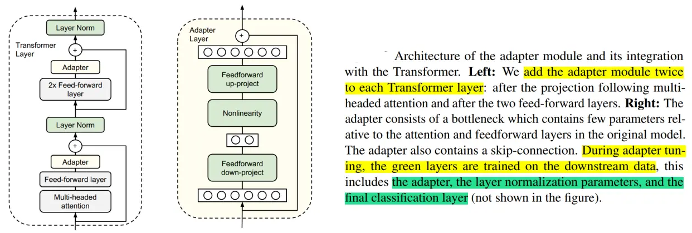

# 3.adapter-tuning

[大模型参数高效微调技术原理综述（四）-Adapter Tuning及其变体 - 知乎 (zhihu.com)](https://zhuanlan.zhihu.com/p/636038478 "大模型参数高效微调技术原理综述（四）-Adapter Tuning及其变体 - 知乎 (zhihu.com)")

### 1.Adapter Tuning

#### 1.1 背景

预训练模型参数量越来越多，在训练下游任务时进行全量微调变得昂贵且耗时。

基于此，作者提出了Adapter Tuning，Adapter 的出现缓解了上述问题 Adapter **在预训练模型每层中插入用于下游任务的参数**（针对每个下游任务，仅增加3.6%的参数），**在微调时将模型主体冻结，仅训练特定于任务的参数**，从而减少了训练时的算力开销。

#### 1.2 技术原理

Adapter Tuning（论文：**Parameter-Efficient Transfer Learning for NLP**），该方法**设计了Adapter结构**，并将其嵌入Transformer的结构里面，**针对每一个Transformer层，增加了两个Adapter结构(分别是多头注意力的投影之后和第二个feed-forward层之后)**，**在训练时，固定住原来预训练模型的参数不变，只对新增的 Adapter 结构和 Layer Norm 层进行微调，从而保证了训练的高效性**。

每当出现新的下游任务，通过添加Adapter模块来产生一个易于扩展的下游模型，从而避免全量微调与灾难性遗忘的问题。

#### 1.3 具体细节

每个 Adapter 模块主要由**两个前馈（Feedforward）子层组成**，第一个前馈子层（down-project）将Transformer块的输出作为输入，将原始输入维度`d`（高维特征）投影到`m`（低维特征），通过控制m的大小来限制Adapter模块的参数量，通常情况下，`m<<d`。然后，中间通过一个非线形层。在输出阶段，通过第二个前馈子层（up-project）还原输入维度，将m（低维特征）重新映射回d（原来的高维特征），作为Adapter模块的输出。同时，通过一个skip connection来将Adapter的输入重新加到最终的输出中去，这样可以保证，即便 Adapter 一开始的参数初始化接近0，Adapter也由于skip connection的设置而接近于一个恒等映射，从而确保训练的有效性。

$$
h \leftarrow h+f\left(h W_{\text {down }}\right) W_{u p}
$$

通过实验发现，只训练少量参数的Adapter方法的效果可以媲美全量微调，这也验证了Adapter是一种高效的参数训练方法，可以快速将语言模型的能力迁移到下游任务中去。

总之，Adapter通过引入0.5%～5%的模型参数可以达到不落后全量微调模型1%的性能。

### 2.AdapterFusion

#### 2.1 背景

为了整合来自多个任务的知识，传统的两个方法是按一定顺序微调（Sequential fine-tuning）或者多任务学习（multi-task learning）。前者的一大问题是需要先验知识来确定顺序，且模型容易遗忘之前任务学到的知识，后者的问题是不同的任务会互相影响，也难以平衡数据集大小差距很大的任务。

而之前的工作，Adapter Tuning的一个优势就是不用更新预训练模型的参数，而是插入比较少的新的参数就可以很好地学会一个任务。此时，Adapter 的参数某种程度上就表达了解决这个任务需要的知识。

作者受此启发，如果**想要把来自多个任务的知识结合起来，是否可以考虑把多个任务的Adapter的参数结合起来**？基于此，作者提出了 AdapterFusion，这是一种新的两阶段学习算法，可以利用来自多个任务的知识。

#### 2.2 技术原理

Adapter Fusion（论文：**AdapterFusion:Non-Destructive Task Composition for Transfer Learning**），**一种融合多任务信息的Adapter的变体**，在 Adapter 的基础上进行优化，通过将学习过程分为两阶段来提升下游任务表现。

-   **知识提取阶段**：在不同任务下引入各自的Adapter模块，用于学习特定任务的信息。
-   **知识组合阶段**：将预训练模型参数与特定于任务的Adapter参数固定，**引入新参数（AdapterFusion）来学习组合多个Adapter中的知识，以提高模型在目标任务中的表现**。

对于**第一阶段**，有两种训练方式，分别如下：

-   **Single-Task Adapters(ST-A)**：对于N个任务，模型都分别独立进行优化，各个任务之间互不干扰，互不影响。
-   **Multi-Task Adapters(MT-A)**：N个任务通过多任务学习的方式，进行联合优化。

对于**第二阶段**，为了避免通过引入特定任务参数而带来的灾难性遗忘问题，AdapterFusion提出了**一个共享多任务信息的结构**。针对特定任务`m`，AdapterFusion联合了第一阶段训练得到的`N`个Adapter信息。固定语言模型的参数跟`N`个Adapter的参数，新引入AdapterFusion的参数，目标函数也是学习针对特定任务`m`的AdapterFusion的参数。

#### 2.3 **AdapterFusion结构**

AdapterFusion具体结构就是一个Attention，它的参数包括`query`，`key`, `value`的矩阵参数，在transformer的每一层都存在，它的query是transformer每个子模块的输出结果，它的key跟value则是N个任务的adapter的输出。通过AdapterFusion，模型可以为不同的任务对应的adapter分配不同的权重，聚合N个任务的信息，从而为特定任务输出更合适的结果。

通过对全量微调、Adapter Tuning、AdapterFusion这三种方法在各个数据集上进行对比实验可以看出，AdapterFusion在大多数情况下性能优于全模型微调和Adapter Tuning，特别在MRPC与RTE数据集中，性能显著优于另外两种方法。

总之，通过将适配器的训练分为知识提取和知识组合两部分，**解决了灾难性遗忘、任务间干扰和训练不稳定的问题**。但是，Adapter模块的添加也导致模型整体参数量的增加，降低了模型推理时的性能。

### 3.AdapterDrop

#### 3.1 背景

近年来Adapter已被证明可以很好地用于机器翻译、跨语言迁移、社区问答和迁移学习的任务组合。尽管它们最近很受欢迎，但Adapter的计算效率尚未在参数效率之外得到探索。

作者通过对Adapter的计算效率进行分析，**发现与全量微调相比，Adapter在训练时快60%，但是在推理时慢4%-6%**。

基于此，作者提出了**AdapterDrop**方法缓解该问题。

#### 3.2 技术原理

AdapterDrop（论文：AdapterDrop: On the Efficiency of Adapters in Transformers），在不影响任务性能的情况下，**对Adapter动态高效的移除，尽可能的减少模型的参数量，提高模型在反向传播（训练）和正向传播（推理）时的效率**。

实验表明，**从较低的 Transformer 层中删除Adapter可以显着提高多任务设置中的推理速度**。 例如，将前五个Transformer层中的Adapter丢弃，在对 8 个任务进行推理时，速度提高了 39%。并且即使有多个丢弃层，AdapterDrop 也能保持良好的结果。

除此之外，作者还研究了对 AdapterFusion中的Adapter进行剪枝后的效果。

通过实验表明可以移除 AdapterFusion 中的大多数Adapter而不影响任务性能。使用剩余的两个Adapter，实现了与具有八个Adapter的完整 AdapterFusion  模型相当的结果，并将推理速度提高了 68%。

因此，作者建议在实际部署这些模型之前执行 AdaperFusion 剪枝。 这是一种简单而有效的技术，即使在完全保持性能的情况下也能实现效率提升。

总之，**AdapterDrop 通过从较低的 Transformer 层删除可变数量的Adaper来提升推理速度**。 当对多个任务执行推理时，动态地减少了运行时的计算开销，并在很大程度上保持了任务性能。

### 4.MAM Adapter

#### 4.1 背景

近年来提出了多种参数高效的迁移学习方法，这些方法**仅微调少量（额外）参数即可获得强大的性能**。虽然有效，但人们对为什么有效的关键要素以及各种高效微调方法之间的联系知之甚少。

下图展示了不同的微调方法，在Xsum数据集上做英文文本摘要任务的效果（ROUGE-2是该任务的评价指标（越大越好））以及其他高效微调方法参数量相对于全参数微调参数量的百分比。图中的左上角的位置是理想化的方法。从图中发现，Adapter，Prefix Tuning和LoRA都是性能比较好的方法。

为什么看起来Adapter、Prefix Tuning、LoRA（在结构上和公式上）都不太一样，尤其是Prefix Tuning，但是这三种方法有近似的效果？

基于此，作者分解了当下最先进的参数高效迁移学习方法（Adapter、Prefix Tuning和LoRA）的设计，并提出了一种新方法**MAM Adapter**，**一个在它们之间建立联系的统一框架**。具体来说，将它们**重新构建为对预训练模型中特定隐藏状态的修改，并定义一组设计维度，不同的方法沿着这些维度变化**。

首先，作者通过对Prefix Tuning变换，发现Prefix Tuning和Adapters的公式高度相似。

然后，分析不同微调方法的内部结构和结构插入形式的相似之处。下图展示了高效微调方法Adapter、Prefix Tuning、LoRA以及新变体（通过更换一些元素，设计了前人的工作里没有的变体） Parallel Adapter、 Scaled PA的结构。

下表展示了高效微调方法Adapter、Prefix Tuning、LoRA以及新变体在新增可训练参数结构形式（functional form）、结构插入形式（Insertion form）、新增结构在PLM修改的具体位置（modified representation）、新增结构与PLM的组合函数（composition function）。其中，新增可训练参数结构形式为需要学习的部分（注：Prefix Tuning为经过转换后的格式）；插入形式有串联或并联；模型修改的具体位置有Attention、FFN层。

#### 4.2 技术原理

MAM Adapter（论文：TOWARDS A UNIFIED VIEW OF PARAMETER-EFFICIENT TRANSFER LEARNING），**一个在Adapter、Prefix Tuning和LoRA之间建立联系的统一方法**。

作者对Adapter的放置和软提示（soft prompt）进行了详细的调查。得出如下结论：

-   并行放置的Adapter优于顺序放置的Adapter，并且与 FFN 并行放置的Adapter优于多头注意力（MHA）并行放置的Adapter（模型修改的位置如下图中所示，蓝色表示修改Attention、红色表示修改FFN）。
-   软提示可以通过仅更改 0.1% 的参数来有效地修改注意力。

然后，提出了“mix-and-match”（MAM）。 因此，最终模型 MAM Adapter 是用 FFN 层的并行Adapter和软提示的组合。

通过最终的实验结果，可以看到 MAM Adapter 在仅用了6.7%参数量（相比全量微调）的情况下，在Xsum和MT这两个任务上达到了和全量微调相近的效果，并且该方法大大优于 BitFit 和 Prompt Tuning，并始终优于 LoRA、Adapter 和 Prefix Tuning。

### 5.UniPELT

#### 5.1 背景

近年来，涌现出了许多针对语言模型的参数高效微调（PELT）方法，在模型训练参数极大的减少的情况下，模型效果与全量微调相当。但是不同的PELT方法在同一个任务上表现差异可能都非常大，这让针对特定任务选择合适的方法非常繁琐。

基于此，作者提出了UniPELT方法，**将不同的PELT方法作为子模块，并通过门控机制学习激活最适合当前数据或任务的方法**。

#### 5.2 技术原理

UniPELT（论文： UNIPELT: A Unified Framework for Parameter-Efficient Language Model Tuning）是 LoRA、Prefix Tuning和Adapter的门控组合。

更具体地说，LoRA 重新参数化用于 WQ 和 WV 注意力矩阵，Prefix Tuning应用于每一Transformer层的key和value，并在Transformer块的feed-forward子层之后添加Adapter。 对于每个模块，门控被实现为线性层，通过GP参数控制Prefix-tuning方法的开关，GL控制LoRA方法的开关，GA控制Adapter方法的开关。可训练参数包括 LoRA 矩阵 WA（Down）和WB（Up），提示调优参数Pk和Pv、Adapter参数和门函数权重。即图中蓝颜色的参数为可学习的参数。

UniPELT 仅用 100 个示例就在低数据场景中展示了相对于单个 LoRA、Adapter 和 Prefix Tuning 方法的显著改进。在更高数据的场景中，UniPELT 的性能与这些方法相当或更好。

实验还对不同 PELT 方法训练时间和推理时间进行了分析。

-   从训练速度来看，UniPELT比之前微调的方法多一些，但是还在能接受的范围，
-   从推理时间来看，BitFit方法增加的最少，UniPELT方法时间增加了27%。
-   从训练参数量来看，LoRA，BitFit，Prefix-tuning都比较小，UniPELT参数量相对会多一些。

总之，**本方法始终优于常规的全量微调以及它在不同设置下包含的子模块，通常超过在每个任务中单独使用每个子模块的最佳性能的上限**；并且，通过研究结果表明，多种 PELT 方法的混合涉及到PLM 的不同部分可能对模型有效性和鲁棒性都有好处。
