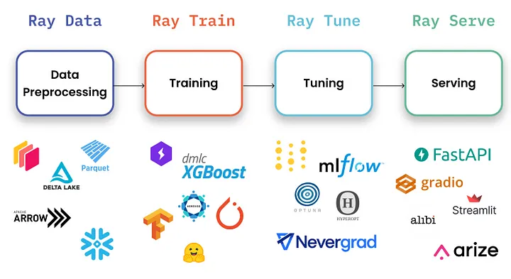
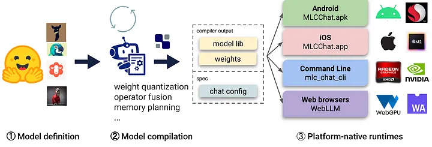

# 0.llm推理框架简单总结

下面首先来总结一下这些框架的特点，如下表所示：


LLM推理有很多框架，各有其特点，下面分别介绍一下表中七个框架的关键点：

1.  [**vLLM**](https://github.com/vllm-project/vllm "vLLM")：适用于大批量Prompt输入，并对推理速度要求高的场景；
2.  [**Text generation inference**](https://github.com/huggingface/text-generation-inference "Text generation inference")：依赖HuggingFace模型，并且不需要为核心模型增加多个adapter的场景；
3.  [**CTranslate2**](https://github.com/OpenNMT/CTranslate2 "CTranslate2")：可在CPU上进行推理；
4.  [**OpenLLM**](https://github.com/bentoml/OpenLLM "OpenLLM")：为核心模型添加adapter并使用HuggingFace Agents，尤其是不完全依赖PyTorch； &#x20;
5.  [**Ray Serve**](https://docs.ray.io/en/latest/serve/index.html "Ray Serve")：稳定的Pipeline和灵活的部署，它最适合更成熟的项目；
6.  [**MLC LLM**](https://github.com/mlc-ai/mlc-llm "MLC LLM")：可在客户端（边缘计算）（例如，在Android或iPhone平台上）本地部署LLM；
7.  [**DeepSpeed-MII**](https://github.com/microsoft/DeepSpeed-MII "DeepSpeed-MII")：使用DeepSpeed库来部署LLM；

下面在内存容量为40GB的A100 GPU上，并且使用LLaMA-1 13b模型（因为列表中的所有库都支持它）进行七个部署框架的对比。

### **1.vLLM**


vLLM的吞吐量比HuggingFace Transformers（HF）高14x-24倍，比HuggingFace Text Generation Inference（TGI）高2.2x-2.5倍。

#### 1.1 使用

**离线批量推理**

```python
# pip install vllm
from vllm import LLM, SamplingParams

prompts = [
    "Funniest joke ever:",
    "The capital of France is",
    "The future of AI is",
]
sampling_params = SamplingParams(temperature=0.95, top_p=0.95, max_tokens=200)
llm = LLM(model="huggyllama/llama-13b")
outputs = llm.generate(prompts, sampling_params)

for output in outputs:
    prompt = output.prompt
    generated_text = output.outputs[0].text
    print(f"Prompt: {prompt!r}, Generated text: {generated_text!r}")
```

**API Server**

```python
# Start the server:
python -m vllm.entrypoints.api_server --env MODEL_NAME=huggyllama/llama-13b

# Query the model in shell:
curl http://localhost:8000/generate \
    -d '{
        "prompt": "Funniest joke ever:",
        "n": 1,
        "temperature": 0.95,
        "max_tokens": 200
    }'
```

#### 1.2 **功能**

-   [**Continuous batching**](https://www.anyscale.com/blog/continuous-batching-llm-inference "Continuous batching")：有iteration-level的调度机制，每次迭代batch大小都有所变化，因此vLLM在大量查询下仍可以很好的工作。
-   [**PagedAttention**](https://vllm.ai/ "PagedAttention")：受操作系统中虚拟内存和分页的经典思想启发的注意力算法，这就是模型加速的秘诀。

#### 1.3 **优点**

-   **文本生成的速度**\*\*：\*\* 实验多次，发现vLLM的推理速度是最快的；
-   **高吞吐量服务**\*\*：\*\* 支持各种解码算法，比如parallel sampling, beam search等；
-   **与OpenAI API兼容**\*\*：\*\* 如果使用OpenAI API，只需要替换端点的URL即可；

#### 1.4 **缺点**

-   **添加自定义模型**：虽然可以合并自己的模型，但如果模型没有使用与vLLM中现有模型类似的架构，则过程会变得更加复杂。例如，增加Falcon的支持，这似乎很有挑战性；
-   **缺乏对适配器（LoRA、QLoRA等）的支持**：当针对特定任务进行微调时，开源LLM具有重要价值。然而，在当前的实现中，没有单独使用模型和适配器权重的选项，这限制了有效利用此类模型的灵活性。
-   **缺少权重量化**：有时，LLM可能不需要使用GPU内存，这对于减少GPU内存消耗至关重要。

这是LLM推理最快的库。得益于其内部优化，它显著优于竞争对手。尽管如此，它在支持有限范围的模型方面确实存在弱点。

**使用vLLM的开发路线可以参考：**[**https://github.com/vllm-project/vllm/issues/244**](https://link.zhihu.com/?target=https%3A//github.com/vllm-project/vllm/issues/244 "https://github.com/vllm-project/vllm/issues/244")

### **2.Text generation inference**


Text generation inference是用于文本生成推断的Rust、Python和gRPC服务器，在HuggingFace中已有LLM 推理API使用。

#### 2.1使用

**使用docker运行web server**

```bash
mkdir data
docker run --gpus all --shm-size 1g -p 8080:80 \
-v data:/data ghcr.io/huggingface/text-generation-inference:0.9 \
  --model-id huggyllama/llama-13b \
  --num-shard 1
```

**查询实例**

```bash
# pip install text-generation
from text_generation import Client

client = Client("http://127.0.0.1:8080")
prompt = "Funniest joke ever:"
print(client.generate(prompt, max_new_tokens=17 temperature=0.95).generated_text)
```

#### 2.2**功能**

-   **内置服务评估**\*\*：\*\* 可以监控服务器负载并深入了解其性能；
-   **使用flash attention（和v2）和Paged attention优化transformer推理代码**\*\*：\*\* 并非所有模型都内置了对这些优化的支持，该技术可以对未使用该技术的模型可以进行优化；

#### 2.3 **优点**

-   **所有的依赖项都安装在Docker中**\*\*：\*\* 会得到一个现成的环境；
-   **支持HuggingFace模型**\*\*：\*\* 轻松运行自己的模型或使用任何HuggingFace模型中心；
-   **对模型推理的控制**：该框架提供了一系列管理模型推理的选项，包括精度调整、量化、张量并行性、重复惩罚等；

#### 2.4**缺点**

-   **缺乏对适配器的支持**\*\*：\*\* 需要注意的是，尽管可以使用适配器部署LLM（可以参考[https://www.youtube.com/watch?v=HI3cYN0c9ZU](https://link.zhihu.com/?target=https%3A//www.youtube.com/watch%3Fv%3DHI3cYN0c9ZU "https://www.youtube.com/watch?v=HI3cYN0c9ZU")），但目前还没有官方支持或文档；
-   **从源代码（Rust+CUDA内核）编译**\*\*：\*\* 对于不熟悉Rust的人，将客户化代码纳入库中变得很有挑战性；
-   **文档不完整**：所有信息都可以在项目的自述文件中找到。尽管它涵盖了基础知识，但必须在问题或源代码中搜索更多细节；

**使用Text generation inference的开发路线可以参考：**[**https://github.com/huggingface/text-generation-inference/issues/232**](https://link.zhihu.com/?target=https%3A//github.com/huggingface/text-generation-inference/issues/232 "https://github.com/huggingface/text-generation-inference/issues/232")

### **3.CTranslate2**


CTranslate2是一个C++和Python库，用于使用Transformer模型进行高效推理。

### 3.1 使用

**转换模型**

```bash
pip install -qqq transformers ctranslate2

# The model should be first converted into the CTranslate2 model format:
ct2-transformers-converter --model huggyllama/llama-13b --output_dir llama-13b-ct2 --force
```

**查询实例**

```python
import ctranslate2
import transformers

generator = ctranslate2.Generator("llama-13b-ct2", device="cuda", compute_type="float16")
tokenizer = transformers.AutoTokenizer.from_pretrained("huggyllama/llama-13b")

prompt = "Funniest joke ever:"
tokens = tokenizer.convert_ids_to_tokens(tokenizer.encode(prompt))
results = generator.generate_batch(
    [tokens], 
    sampling_topk=1, 
    max_length=200, 
)
tokens = results[0].sequences_ids[0]
output = tokenizer.decode(tokens)
print(output)
```

#### 3.2**功能**

-   **在CPU和GPU上快速高效地执行**\*\*：\*\* 得益于内置的一系列优化：层融合、填充去除、批量重新排序、原位操作、缓存机制等。推理LLM更快，所需内存更少；
-   **动态内存使用率**\*\*：\*\* 由于CPU和GPU上都有缓存分配器，内存使用率根据请求大小动态变化，同时仍能满足性能要求；
-   **支持多种CPU体系结构**\*\*：\*\* 该项目支持x86–64和AArch64/ARM64处理器，并集成了针对这些平台优化的多个后端：英特尔MKL、oneDNN、OpenBLAS、Ruy和Apple Accelerate；

#### 3.3 **优点**

-   **并行和异步执行**：可以使用多个GPU或CPU核心并行和异步处理多个批处理；
-   **Prompt缓存**：在静态提示下运行一次模型，缓存模型状态，并在将来使用相同的静态提示进行调用时重用；
-   **磁盘上的轻量级**：量化可以使模型在磁盘上缩小4倍，而精度损失最小；

#### 3.4 **缺点**

-   **没有内置的REST服务器**：尽管仍然可以运行REST服务器，但没有具有日志记录和监控功能的现成服务
-   **缺乏对适配器（LoRA、QLoRA等）的支持**

### **4.DeepSpeed-MII**


在DeepSpeed支持下，DeepSpeed-MII可以进行低延迟和高通量推理。

#### 4.1 使用

**运行web服务**

```python
# DON'T INSTALL USING pip install deepspeed-mii
# git clone https://github.com/microsoft/DeepSpeed-MII.git
# git reset --hard 60a85dc3da5bac3bcefa8824175f8646a0f12203
# cd DeepSpeed-MII && pip install .
# pip3 install -U deepspeed

# ... and make sure that you have same CUDA versions:
# python -c "import torch;print(torch.version.cuda)" == nvcc --version
import mii

mii_configs = {
    "dtype": "fp16",
    'max_tokens': 200,
    'tensor_parallel': 1,
    "enable_load_balancing": False
}
mii.deploy(task="text-generation",
           model="huggyllama/llama-13b",
           deployment_name="llama_13b_deployment",
           mii_config=mii_configs)
```

**查询实例**

```python
import mii

generator = mii.mii_query_handle("llama_13b_deployment")
result = generator.query(  
  {"query": ["Funniest joke ever:"]}, 
  do_sample=True,
  max_new_tokens=200
)
print(result)
```

#### 4.2 **功能**

-   **多个副本上的负载平衡**\*\*：\*\* 这是一个非常有用的工具，可用于处理大量用户。负载均衡器在各种副本之间高效地分配传入请求，从而缩短了应用程序的响应时间。
-   **非持久部署**\*\*：\*\* 目标环境的部署不是永久的，需要经常更新的，这在资源效率、安全性、一致性和易管理性至关重要的情况下，这是非常重要的。

#### 4.3**优点**

-   **支持不同的模型库**\*\*：\*\* 支持多个开源模型库，如Hugging Face、FairSeq、EluetherAI等；
-   **量化延迟和降低成本**\*\*：\*\* 可以显著降低非常昂贵的语言模型的推理成本；
-   **Native和Azure集成**\*\*：\*\* 微软开发的MII框架提供了与云系统的出色集成；

#### 4.4**缺点**

-   **支持模型的数量有限**\*\*：\*\* 不支持Falcon、LLaMA2和其他语言模型；
-   **缺乏对适配器（LoRA、QLoRA等）的支持****；** ​

### **5.OpenLLM**


OpenLLM是一个用于在生产中操作大型语言模型（LLM）的开放平台。

#### 5.1 使用

**运行web服务**

```bash
pip install openllm scipy
openllm start llama --model-id huggyllama/llama-13b \
  --max-new-tokens 200 \
  --temperature 0.95 \
  --api-workers 1 \
  --workers-per-resource 1
```

**查询实例**

```python
import openllm

client = openllm.client.HTTPClient('http://localhost:3000')
print(client.query("Funniest joke ever:"))
```

#### 5.2 **功能**

-   **适配器支持**\*\*：\*\* 可以将要部署的LLM连接多个适配器，这样可以只使用一个模型来执行几个特定的任务；
-   **支持不同的运行框架**\*\*：\*\* 比如Pytorch（pt）、Tensorflow（tf）或Flax（亚麻）；
-   [**HuggingFace Agents**](https://huggingface.co/docs/transformers/main_classes/agent "HuggingFace Agents")**：** 连接HuggingFace上不同的模型，并使用LLM和自然语言进行管理；

#### 5.3 **优点**

-   **良好的社区支持**\*\*：\*\* 不断开发和添加新功能；
-   **集成新模型**\*\*：\*\* 可以添加用户自定义模型；
-   **量化**\*\*：\*\* OpenLLM支持使用bitsandbytes\[12]和GPTQ\[13]进行量化；
-   **LangChain集成**\*\*：\*\* 可以使用LangChian与远程OpenLLM服务器进行交互；

#### 5.4 **缺点**

-   **缺乏批处理支持**\*\*：\*\* 对于大量查询，这很可能会成为应用程序性能的瓶颈；
-   **缺乏内置的分布式推理**：如果你想在多个GPU设备上运行大型模型，你需要额外安装OpenLLM的服务组件Yatai；

### **6.Ray Serve**


Ray Serve是一个可扩展的模型服务库，用于构建在线推理API。Serve与框架无关，因此可以使用一个工具包来为深度学习模型的所有内容提供服务。



#### 6.1 使用

**运行web服务**

```bash
# pip install ray[serve] accelerate>=0.16.0 transformers>=4.26.0 torch starlette pandas
# ray_serve.py
import pandas as pd

import ray
from ray import serve
from starlette.requests import Request

@serve.deployment(ray_actor_options={"num_gpus": 1})
class PredictDeployment:
    def __init__(self, model_id: str):
        from transformers import AutoModelForCausalLM, AutoTokenizer
        import torch

        self.model = AutoModelForCausalLM.from_pretrained(
            model_id,
            torch_dtype=torch.float16,
            device_map="auto",
        )
        self.tokenizer = AutoTokenizer.from_pretrained(model_id)

    def generate(self, text: str) -> pd.DataFrame:
        input_ids = self.tokenizer(text, return_tensors="pt").input_ids.to(
            self.model.device
        )
        gen_tokens = self.model.generate(
            input_ids,
            temperature=0.9,
            max_length=200,
        )
        return pd.DataFrame(
            self.tokenizer.batch_decode(gen_tokens), columns=["responses"]
        )

    async def __call__(self, http_request: Request) -> str:
        json_request: str = await http_request.json()
        return self.generate(prompt["text"])

deployment = PredictDeployment.bind(model_id="huggyllama/llama-13b")

# then run from CLI command:
# serve run ray_serve:deployment
```

**查询实例**

```bash
import requests

sample_input = {"text": "Funniest joke ever:"}
output = requests.post("http://localhost:8000/", json=[sample_input]).json()
print(output)
```

#### 6.2 **功能**

-   **监控仪表板和Prometheus度量**\*\*：\*\* 可以使用Ray仪表板来获得Ray集群和Ray Serve应用程序状态；
-   **跨多个副本自动缩放**\*\*：\*\* Ray通过观察队列大小并做出添加或删除副本的缩放决策来调整流量峰值；
-   **动态请求批处理**\*\*：\*\* 当模型使用成本很高，为最大限度地利用硬件，可以采用该策略；

#### 6.3 **优点**

-   **文档支持**\*\*：\*\* 开发人员几乎为每个用例撰写了许多示例；
-   **支持生产环境部署**\*\*：\*\* 这是本列表中所有框架中最成熟的；
-   **本地LangChain集成**\*\*：\*\* 您可以使用LangChian与远程Ray Server进行交互；

#### 6.4 **缺点**

-   **缺乏内置的模型优化**\*\*：\*\* Ray Serve不专注于LLM，它是一个用于部署任何ML模型的更广泛的框架，必须自己进行优化；
-   **入门门槛高**\*\*：\*\* 该库功能多，提高了初学者进入的门槛；

如果需要最适合生产的解决方案，而不仅仅是深度学习，Ray Serve是一个不错的选择。它最适合于可用性、可扩展性和可观察性非常重要的企业。此外，还可以使用其庞大的生态系统进行数据处理、模型训练、微调和服务。最后，从OpenAI到Shopify和Instacart等公司都在使用它。

### **7.MLC LLM**


LLM的机器学习编译（MLC LLM）是一种通用的部署解决方案，它使LLM能够利用本机硬件加速在消费者设备上高效运行。



#### 7.1 使用

**运行web服务**

```bash
# 1. Make sure that you have python >= 3.9
# 2. You have to run it using conda:
conda create -n mlc-chat-venv -c mlc-ai -c conda-forge mlc-chat-nightly
conda activate mlc-chat-venv

# 3. Then install package:
pip install --pre --force-reinstall mlc-ai-nightly-cu118 \
  mlc-chat-nightly-cu118 \
  -f https://mlc.ai/wheels

# 4. Download the model weights from HuggingFace and binary libraries:
git lfs install && mkdir -p dist/prebuilt && \
  git clone https://github.com/mlc-ai/binary-mlc-llm-libs.git dist/prebuilt/lib && \
  cd dist/prebuilt && \  
  git clone https://huggingface.co/huggyllama/llama-13b dist/ && \
  cd ../..
  
  
# 5. Run server:
python -m mlc_chat.rest --device-name cuda --artifact-path dist
```

**查询实例**

```python
import requests

payload = {
   "model": "lama-30b",
   "messages": [{"role": "user", "content": "Funniest joke ever:"}],
   "stream": False
}
r = requests.post("http://127.0.0.1:8000/v1/chat/completions", json=payload)
print(r.json()['choices'][0]['message']['content'])
```

#### 7.2 **功能**

-   **平台本机运行时**\*\*：\*\* 可以部署在用户设备的本机环境上，这些设备可能没有现成的Python或其他必要的依赖项。应用程序开发人员只需要将MLC编译的LLM集成到他们的项目中即可；
-   **内存优化**\*\*：\*\* 可以使用不同的技术编译、压缩和优化模型，从而可以部署在不同的设备上；

#### 7.3**优点**

-   **所有设置均可在JSON配置中完成**\*\*：\*\* 在单个配置文件中定义每个编译模型的运行时配置；
-   **预置应用程序**\*\*：\*\* 可以为不同的平台编译模型，比如C++用于命令行，JavaScript用于web，Swift用于iOS，Java/Kotlin用于Android；

#### 7.4 **缺点**

-   **使用LLM模型的功能有限**：不支持适配器，无法更改精度等，该库主要用于编译不同设备的模型；
-   [**只支持分组量化**](https://arxiv.org/abs/2212.09720 "只支持分组量化")**：** 这种方法表现良好，但是在社区中更受欢迎的其他量化方法（bitsandbytes和GPTQ）不支持；
-   **复杂的安装**\*\*：\*\* 安装需要花几个小时，不太适合初学者开发人员；

如果需要在iOS或Android设备上部署应用程序，这个库正是你所需要的。它将允许您快速地以本机方式编译模型并将其部署到设备上。但是，如果需要一个高负载的服务器，不建议选择这个框架。

参考资料：

-   [Frameworks for Serving LLMs.](https://betterprogramming.pub/frameworks-for-serving-llms-60b7f7b23407 "Frameworks for Serving LLMs.")
-   [LLM七种推理服务框架总结](https://zhuanlan.zhihu.com/p/653352979 "LLM七种推理服务框架总结")
-   [目前业界大模型推理框架很多，各有什么优缺点，应该如何选择](https://www.zhihu.com/question/625415776 "目前业界大模型推理框架很多，各有什么优缺点，应该如何选择")
