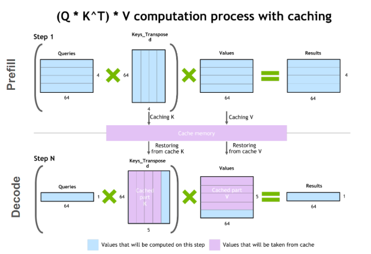

# llm推理优化技术

> 原文链接：[Mastering LLM Techniques: Inference Optimization | NVIDIA Technical Blog](https://developer.nvidia.com/blog/mastering-llm-techniques-inference-optimization/ "Mastering LLM Techniques: Inference Optimization | NVIDIA Technical Blog")

堆叠Transformer层以创建大型模型可以获得更好的准确性、few-shot学习能力，甚至在各种语言任务中具有接近人类的涌现能力。这些基础模型的训练成本很高，而且在推理过程中可能需要大量的内存和计算（经常性成本）。当今最流行的大型语言模型（LLM）的大小可以达到数百亿到数千亿个参数，并且根据用例的不同，可能需要摄入长输入（或上下文），这也会增加开销。

这篇文章讨论了LLM推理中最紧迫的挑战，以及一些实用的解决方案。读者应该对transformer架构和注意力机制有一个基本的了解。

# 1.理解LLM推理

大多数流行的only-decode LLM（例如 GPT-3）都是针对因果建模目标进行预训练的，本质上是作为下一个词预测器。这些 LLM 将一系列tokens作为输入，并自回归生成后续tokens，直到满足停止条件（例如，生成tokens数量的限制或遇到停止词）或直到生成特殊的 `<end>` 标记生成结束的tokens。该过程涉及两个阶段：预填充阶段和解码阶段。

请注意，tokens是模型处理的语言的原子部分。一个tokens大约是四个英文字符。所有自然语言在输入模型之前都会转换为toikens。

## 1.1 预填充阶段或处理输入

在预填充阶段，LLM处理输入token以计算中间状态（keys和value），用于生成“第一个”token。每个新的token都依赖于所有先前的token，但由于输入的全部已知，因此在运算上，都是高度并行化矩阵运算，可以有效地使用GPU。

## 1.2 解码阶段或生成输出

在解码阶段，LLM一次自回归生成一个输出token，直到满足停止条件。每个输出tokens都需要直到之前迭代的所有输出状态（keys和values）。这与预填充输入处理相比，就像矩阵向量运算未充分利用GPU计算能力。数据（weights, keys, values, activations） 从内存传输到GPU的速度决定了延迟，而不是计算实际时间消耗。即，这是一个内存限制操作。

本文中的许多推理挑战和相应的解决方案都涉及此解码阶段的优化：高效的注意力模块、有效管理键和值等。

不同的LLMs可能使用不同的tokenizers，因此比较它们之间的输出tokens可能并不简单。在比较推理吞吐量时，即使两个 LLMs每秒输出的tokens相似，如果它们使用不同的tokenizers，也可能不相等。这是因为相应的tokens可能代表不同数量的字符。

## 1.3 批处理（Batching）

提高 GPU 利用率和有效吞吐量的最简单方法是通过**批处理**。由于多个请求使用相同的模型，因此权重的内存成本被分散。大批量数据传输到 GPU 一次处理，将提高GPU资源的利用率。

然而，批量大小只能增加到一定限制，此时可能会导致内存溢出。为了防止这种情况发生，需要查看键值 (KV) 缓存和 LLM 内存要求。

传统批处理（也称为静态批处理， static batching）不是最佳的。这是因为**对于批次中的每个请求，LLM 可能会生成不同数量的tokens，并且不同tokens有不同的执行时间**。因此，批次中的所有请求都必须等待最长token的处理完成，而生成长度的巨大差异可能会加剧这种情况。有一些方法可以缓解这种情况，例如稍动态批处理。

## 1.4 KV缓存

解码阶段的一种常见优化是 KV 缓存。解码阶段在每个时间步生成单个token，但每个token依赖于之前token的键和值张量（包括预填充时计算的输入tokens的 KV 张量，以及当前时间步之前计算的任何新 KV 张量） 。

为了避免在每个时间步重新计算所有tokens的这些张量，**可以将它们缓存在 GPU 内存中**。每次迭代，当需要计算新token时，它们都会被添加到正在运行的缓存中，以便在下一次迭代中使用。在一些实现中，模型的每一层都有一个KV缓存。

> 图1 KV缓存机制

## 1.5 LLM内存需求

实际上，LLM对GPU显存的需求主要是模型权重和KV缓存：

-   **模型权重**：模型参数占用内存。例如，具有 70 亿个参数的模型（例如 Llama2-7B），以 16 位精度（FP16 或 BF16）加载，将占用大约 `7B * sizeof(FP16) ~= 14 GB` 的内存。
-   **KV缓存**：自注意力张量的缓存占用内存，避免冗余计算。

使用批处理时，批处理中每个请求的 KV 缓存仍然必须单独分配，并且可能会占用大量内存。下面的公式描述了 KV 缓存的大小，适用于当今最常见的 LLM 架构。

$$
每个token的KV缓存大小(字节) = 2 * (num\_layers) * (num\_heads * dim\_head) *  precision\_in\_bytes

$$

第一个因子 2 代表 K 和 V 矩阵。通常，`(num_heads * dim_head)`的值与Transformer的`hidden_​​size`（或模型的维度，`d_model`）相同。这些模型属性通常可以在配置文件中找到。

输入批次中输入序列中的每个tokens都需要此内存大小。假设半精度，KV缓存的总大小由以下公式给出:

$$
总KV缓存大小(字节)=(batch\_size) * (sequence\_length) * 2 * (num\_layers) * (hidden\_size) *  sizeof(FP16)
$$

例如，对于 16 位精度的 Llama 2 7B 模型，批量大小为 `1`，KV 缓存的大小将为 `1 * 4096 * 2 * 32 * 4096 * 2` 字节，即约 `2 GB`。

高效的管理 KV 缓存是一项具有挑战性的工作。内存需求随着批量大小和序列长度线性增长，可以快速扩展。因此，它限制了可服务的吞吐量，并对长上下文输入提出了挑战。这就是本文中介绍的多项优化背后的动机。

# 2.模型并行化扩展LLM

减少模型权重在每设备的显存占用的一种方法是**将模型分布在多个 GPU 上**。分散内存和计算可以运行更大的模型或更大批量的输入。模型并行化是训练或推理模型所必需的，模型并行化需要比单个设备更多的内存，用来训练和推理（延迟或吞吐量）。根据模型权重的划分方式，有多种方法可以并行化模型。

请注意，数据并行性也是一种经常在与下面列出的其他技术相同的的技术。在这种情况下，模型的权重被复制到多个设备上，并且输入的（全局）批量大小在每个设备上被分成微批次。它通过处理较大的批次来减少总体执行时间。然而，这是一种训练时间优化，在推理过程中不太相关。

## 2.1 Pipeline并行

Pipeline并行化**将模型（垂直）分片为块，其中每个块包含在单独设备上执行的层的子集**。图 2a 说明了四路Pipeline，其中模型按顺序分区，并且所有层的四分之一子集在每个设备上执行。一个设备上的一组操作的输出被传递到下一个设备，后者继续执行后续块。$F_n$和 $B_n$分别表示设备 $n$ 上的前向传播和后向传播。每个设备上存储模型权重的内存需求被分成四份。

该方法的缺点是，由于处理的顺序性质，**某些设备或层在等待前一层的输出（激活、梯度）时可能保持空闲状态**。这会导致前向和后向传递效率低下或出现“Pipeline bubbles”。在图 2b 中，白色空白区域是Pipeline并行性产生的Pipeline bubbles，其中设备闲置且未得到充分利用。

**微批处理可以在一定程度上缓解这种情况**，如图 2c 所示。输入的全局批次大小被分成子批次，这些子批次被一一处理，最后累积梯度。请注意，$F_{n,m}$ 和 $B_{n,m}$ 分别表示设备`n`上`m`批次的前向和后向传递。**这种方法缩小了管道气泡的尺寸，但并没有完全消除它们**。

> 图2 Pipeline并行，

## 2.2 Tensor并行

Tensor并行化**将模型的各个层（水平）分片为更小的、独立的计算块，这些计算块可以在不同的设备上执行**。Transformer的主要组成部分，注意力块和多层感知器（MLP）层是可以利用Tensor并行化的。在多头注意力块中，每个头或一组头可以分配给不同的设备，以便它们可以独立且并行地计算。

> 图3 Tensor并行化MLP和自注意力

图 3a 显示了两层 MLP Tensor并行的示例，每一层都由一个圆角框表示。在第一层中，权重矩阵$A$分为$A_1$和$A_2$ 。对于输入X，可以在同一批次不同设备上计算$XA_1$ 和$ XA_2  $，其中，f是identity 操作。这将每个设备上存储权重的内存需求减半。归约操作$g$组合了第二层的输出。

图 3b 是自注意力层中Tensor并行的示例。多个注意力头本质上是并行的，并且可以跨设备分割。

## 2.3 Sequence并行

Tensor并行化是有局限性，它需要将层划分为独立的、可管理的块，不适用于 `LayerNorm `和 `Dropout `等操作，而是在tensor并行中复制。虽然 `LayerNorm `和 `Dropout `的计算成本较低，但它们确实需要大量内存来存储（冗余）激活。

如[Reducing Activation Recomputation in Large Transformer Models](https://arxiv.org/pdf/2205.05198.pdf "Reducing Activation Recomputation in Large Transformer Models")所示，这些操作在输入序列中是独立的，并且这些操作**可以沿着“序列维度”进行分区**，从而提高内存效率。这称为序列并行性。

> 图4，transformer层的tensor并行化和sequence并行化

模型并行技术不是唯一的，可以结合使用。它们可以帮助扩展和减少 LLM 的每 GPU 内存占用量，但也有专门针对注意力模块的优化技术。

# 3.注意力机制优化

缩放点积注意力 (SDPA， scaled dot-product attention) 操作将`query`和`key`对映射到输出，如论文[Attention Is All You Need](https://arxiv.org/pdf/1706.03762.pdf "Attention Is All You Need")所述。

## 3.1 多头注意力（MHA）

作为 SDPA 的增强，三个变换张量对Q，K，V分别进行线性变换，**这些变换不会改变原有张量的尺寸**，使模型能够共同关注来自不同位置的不同表示子空间的信息。这些子空间是独立学习的，使模型能够更丰富地理解输入中的不同位置。

如图 5 所示，多个并行注意力操作的输出被拼接后线性投影以组合起来。每个并行注意力层称为“头”，这种方法称为多头注意力（MHA）。

当使用八个并行注意力头时，每个注意力头的维度都会减少（例如 $d\_model/8$）。这使得计算成本与单头注意力相似。

> 图5 缩放点积注意力（左）和多头注意力（右）的图示，并行的多个 SDPA 头

## 3.2 多查询注意力（MQA）

MHA 的推理优化之一称为多查询注意力 (MQA)，如 Fast Transformer Decoding 中提出的，**在多个注意力头之间共享键和值**。与以前一样，查询向量仍然被投影多次。

虽然 MQA 中完成的计算量与 MHA 相同，但从内存读取的数据量（键、值）只是以前的一小部分。当受内存带宽限制时，这可以实现更好的计算利用率。它还减少了内存中 KV 缓存的大小，为更大的批量大小留出了空间。

key头的减少会带来潜在的准确性下降。此外，需要在推理时利用这种优化的模型需要在启用 MQA 的情况下进行训练（或至少使用大约 5% 的训练量进行微调）。

## 3.3 分组注意力（GQA）

分组查询注意力 (GQA) 通过将键和值投影到几组查询头，在 MHA 和 MQA 之间取得平衡（图 6）。在每个组中，它的行为类似于多查询注意力。

图 6 显示多头注意力有多个键值头（左）。分组查询注意力（中心）的键值头多于一个，但少于查询头的数量，这是内存需求和模型质量之间的平衡。多查询注意力（右）具有单个键值头，有助于节省内存。

最初使用 MHA 训练的模型可以使用原始训练计算的一小部分通过 GQA 进行“升级训练”。它们获得接近 MHA 的质量，同时保持接近 MQA 的计算效率。 Llama 2 70B 是利用 GQA 的模型示例。

**MQA 和 GQA 等优化通过减少存储的key头和value头的数量来帮助减少 KV 缓存所需的内存**。 KV 缓存的管理方式可能仍然效率低下。与优化注意力模块本身不同，下一节将介绍一种更高效的 KV 缓存管理技术。

## 3.4 Flash attention

优化注意力机制的另一种方法是**修改某些计算的顺序，以更好地利用 GPU 的内存层次结构**。神经网络通常用层来描述，大多数实现也以这种方式布局，每次按顺序对输入数据进行一种计算。这并不总是能带来最佳性能，因为对已经进入内存层次结构的更高、性能更高级别的值进行更多计算可能是有益的。

在实际计算过程中将多个层融合在一起可以最大限度地减少 GPU 需要读取和写入内存的次数，并将需要相同数据的计算分组在一起，即使它们是神经网络中不同层的一部分。

一种非常流行的融合是 FlashAttention，这是一种 I/O 感知精确注意算法，详细信息请参阅 [FlashAttention: Fast and Memory-Efficient Exact Attention with IO-Awareness](https://arxiv.org/abs/2205.14135 "FlashAttention: Fast and Memory-Efficient Exact Attention with IO-Awareness")。精确注意力意味着它在数学上与标准多头注意力相同（具有可用于多查询和分组查询注意力的变体），因此可以无需修改即可交换到现有的模型架构，甚至是已经训练的模型。

I/O 感知意味着在将操作融合在一起时，它会考虑前面讨论的一些内存移动成本。特别是，FlashAttention 使用“平铺”一次性完全计算并写出最终矩阵的一小部分，而不是分步对整个矩阵进行部分计算，写出中间的中间值。

图 7 显示了 40 GB GPU 上的平铺 FlashAttention 计算模式和内存层次结构。右图显示了对注意力机制的不同组件进行融合和重新排序所带来的相对加速。

> 图7 40 GB GPU 上的平铺 FlashAttention 计算模式和内存层次结构

# 4.KV缓存的分页高效管理

有时，KV 缓存会静态地“过度配置”(over-provisioned)，以考虑最大可能的输入（支持的序列长度），因为输入的大小是不可预测的。例如，如果模型支持的最大序列长度为 2,048，则**无论请求中输入和生成的输出的大小如何，都将在内存中保留大小为 2,048 的数据。该空间可以是连续分配的，并且通常其中大部分未被使用，从而导致内存浪费或碎片**。该保留空间在请求的生命周期内被占用。

> 图8 由于过度配置和低效的 KV 缓存管理而导致的内存浪费和碎片

受操作系统分页的启发，PagedAttention 算法能够**将连续的键和值存储在内存中的不连续空间中**。它将每个请求的 KV 缓存划分为代表固定数量token的块，这些块可以不连续存储。

在注意力计算期间，使用根据记录索引获取这些块。当新的token产生时，就会进行新的区块分配。这些块的大小是固定的，消除了因不同请求需要不同分配等挑战而产生的低效率。这极大地限制了内存浪费，从而实现了更大的批量大小（从而提高了吞吐量）。

# 5.模型优化技术

到目前为止，我们已经讨论了 LLM 消耗内存的不同方式、跨多个不同 GPU 分配内存的一些方式，以及优化注意力机制和 KV 缓存。还有多种模型优化技术可以通过修改模型权重本身来减少每个 GPU 上的内存使用。 GPU 还具有专用硬件来加速这些修改值的运算，从而为模型提供更多加速。

## 5.1 量化（Quantization）

**量化是降低模型权重和激活精度的过程**。大多数模型都以 32 或 16 位精度进行训练，其中每个参数和激活元素占用 32 或 16 位内存（单精度浮点）。然而，大多数深度学习模型可以用每个值八个甚至更少的位来有效表示。

图 9 显示了一种可能的量化方法之前和之后的值分布。在这种情况下，舍入会丢失一些精度，并且剪裁会丢失一些动态范围，从而允许以更小的格式表示值。

> 图9 一种可能的量化方法之前和之后的值分布

降低模型的精度可以带来多种好处。如果模型占用的内存空间较少，则可以在相同数量的硬件上安运行更大的模型。量化还意味着可以在相同的带宽上传输更多参数，这有助于加速带宽有限的模型。

LLM 有许多不同的量化技术，涉及降低激活、权重或两者的精度。量化权重要简单得多，因为它们在训练后是固定的。然而，这可能会留下一些性能问题，因为激活仍然保持在更高的精度。 GPU 没有用于乘以 INT8 和 FP16 数字的专用硬件，因此必须将权重转换回更高精度以进行实际运算。

还可以量化激活、Transformer块和网络层的输入，但这也有其自身的挑战。激活向量通常包含异常值，有效地增加了它们的动态范围，并使以比权重更低的精度表示这些值变得更具挑战性。

一种选择是通过模型传递代表性数据集并选择以比其他激活更高的精度表示某些激活来找出这些异常值可能出现的位置 (`LLM.int8()`)。另一种选择是借用易于量化的权重的动态范围，并在激活中重用该范围。

## 5.2 稀疏（Sparsity）

与量化类似，事实证明，许多深度学习模型对于修剪或用 `0` 本身替换某些接近 `0` 的值具有鲁棒性。稀疏矩阵是许多元素为 0 的矩阵。这些矩阵可以用压缩形式表示，比完整的稠密矩阵占用的空间更少。

> 图10，以压缩格式表示的稀疏矩阵，由非零数据值及其相应的两位索引组成

GPU 尤其具有针对某种结构化稀疏性的硬件加速，其中每四个值中有两个由零表示。稀疏表示还可以与量化相结合，以实现更大的执行速度。寻找以稀疏格式表示大型语言模型的最佳方法仍然是一个活跃的研究领域，并为未来提高推理速度提供了一个有希望的方向。

## 5.3 蒸馏（Distillation）

缩小模型大小的另一种方法是通过称为蒸馏的过程**将其知识转移到较小的模型**。此过程涉及训练较小的模型（称为学生）来模仿较大模型（教师）的行为。

蒸馏模型的成功例子包括 [DistilBERT](https://arxiv.org/abs/1910.01108 "DistilBERT")，它将 BERT 模型压缩了 40%，同时保留了 97% 的语言理解能力，速度提高了 60%。

虽然LLMs中的蒸馏是一个活跃的研究领域，但神经网络的一般方法首次在[Distilling the Knowledge in a Neural Network](https://arxiv.org/abs/1503.02531 "Distilling the Knowledge in a Neural Network")中提出：

-   学生网络经过训练，可以反映较大教师网络的性能，使用损失函数来测量其输出之间的差异。该目标还可能包括将学生的输出与真实标签进行匹配的原始损失函数。
-   匹配的教师输出可以是最后一层（称为 `logits`）或中间层激活。

图 11 显示了知识蒸馏的总体框架。教师的 `logits `是学生使用蒸馏损失进行优化的软目标。其他蒸馏方法可能会使用其他损失措施来从老师那里“蒸馏”知识。

> 图11，知识蒸馏的通用框架

蒸馏的另一种方法是使用教师合成的数据对LLMs学生进行监督培训，这在人工注释稀缺或不可用时特别有用。一步一步蒸馏！更进一步，除了作为基本事实的标签之外，还从LLMs教师那里提取基本原理。这些基本原理作为中间推理步骤，以数据有效的方式培训规模较小的LLMs。

值得注意的是，当今许多最先进的LLMs都拥有限制性许可证，禁止使用他们的成果来训练其他LLMs，这使得找到合适的教师模型具有挑战性。

# 6.模型服务技术

模型执行通常受内存带宽限制，特别是权重中的带宽限制。即使在应用了前面描述的所有模型优化之后，它仍然很可能受到内存限制。因此，在加载模型权重时尽可能多地处理它们。换句话说，尝试并行。可以采取两种方法：

-   动态批处理(**In-flight batching**) ：同时执行多个不同的请求。
-   预测推理(**Speculative inference**) ：并行执行序列的多个不同步骤以尝试节省时间。

## 6.1 动态批处理（**In-flight batching**）

LLMs 具有一些独特的执行特征，这些特征可能导致在实践中难以有效地处理批量请求。一个模型可以同时用于多种不同的任务。从聊天机器人中的简单问答响应到文档摘要或代码块的生成，工作负载是高度动态的，输出大小变化几个数量级。

这种多功能性使得批处理请求并有效地并行执行它们变得具有挑战性，这是服务神经网络的常见优化。这可能会导致某些请求比其他请求更早完成。

为了管理这些动态负载，许多LLMs 服务解决方案包括一种称**为连续或动态批处理的优化调度技术**。这利用了这样一个事实：**LLMs的整个文本生成过程可以分解为模型上的多次执行迭代**。

通过动态批处理，服务器运行时会**立即从批处理中剔除已完成的序列，而不是等待整个批处理完成后再继续处理下一组请求**。然后，它开始执行新请求，而其他请求仍在进行中。因此，动态批处理可以极大地提高实际用例中 GPU 的整体利用率。

## 6.2 预测推理（**Speculative inference**）

预测推理也称为推测采样、辅助生成或分块并行解码，是并行执行 LLM 的另一种方式。通常，GPT 风格的大语言模型是自回归模型，逐个生成文本标记。

生成的每个标记都依赖于它之前的所有标记来提供上下文。这意味着在常规执行中，**不可能从同一个序列并行生成多个token，必须等待第 n 个token生成后才能生成 n+1 个token**。

图 12 显示了预测推理的示例，其中临时模型临时预测并行验证或拒绝的多个未来步骤。在这种情况下，临时模型中的前两个预测token被接受，而最后一个在继续生成之前被拒绝并删除。

> 图12， 预测推理示例

预测性抽样提供了一种解决方法。这种方法的基本思想是使用一些“更便宜”的过程来生成几个token长的临时序列。然后，并行执行多个步骤的主要“验证”模型，使用廉价临时序列作为需要的执行步骤的“预测”上下文。

如果验证模型生成与临时序列相同的token，那么就知道接受这些token作为输出。否则，可以丢弃第一个不匹配标记之后的所有内容，并使用新的临时序列重复该过程。

如何生成临时token有许多不同的选项，每个选项都有不同的权衡。可以训练多个模型，或在单个预训练模型上微调多个头，以预测未来多个步骤的标记。或者，可以使用小型模型作为临时模型，使用更大、功能更强大的模型作为验证器。

# 7.结论

这篇文章概述了许多最流行的解决方案，以帮助高效地优化和服务LLMs，无论是在数据中心还是在 PC 边缘。其中许多技术都经过优化并通过 NVIDIA TensorRT-LLM 提供，这是一个开源库，由 TensorRT 深度学习编译器以及优化的内核、预处理和后处理步骤以及多 GPU/多节点通信原语组成，可在 NVIDIA 上实现突破性的性能GPU。
