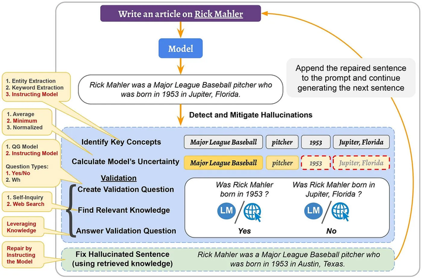
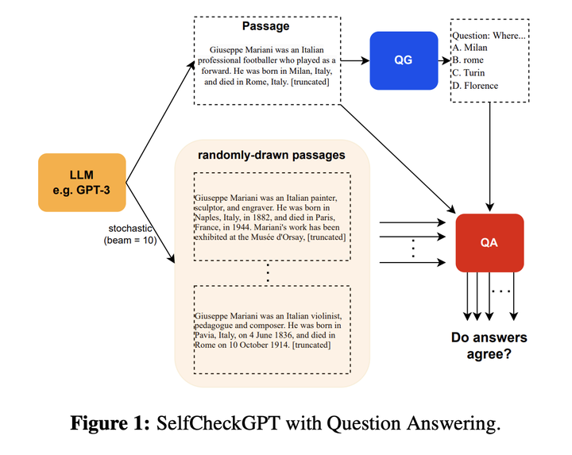

# 1.幻觉

### 1.什么是大模型幻觉？

在语言模型的背景下，幻觉指的是**一本正经的胡说八道**：看似流畅自然的表述，实则不符合事实或者是错误的。

幻觉现象的存在严重影响LLM应用的可靠性，本文将探讨大型语言模型(LLMs)的幻觉问题，以及解决幻觉现象的一些常见方法。

### 2.为什么需要解决LLM的幻觉问题？

LLMs的幻觉**可能会产生如传播错误信息或侵犯隐私等严重后果**。 比如在医疗应用中，对患者生成的报告如果存在幻觉可能导致错误诊断甚至影响生命安全。&#x20;

**幻觉影响了模型的可靠性和可信度**，因此需要解决LLM的幻觉问题。

### 3.幻觉一定是有害的吗？

幻觉**不一定是有害的**，特别是在**一些需要创造力或灵感的场合**，比如写电影剧情，幻觉的存在可能带来一些奇思妙想，使得生成的文本充满想象力。

因此，对幻觉的容忍度取决于具体的应用场景。

### 4.幻觉有哪些不同类型？

幻觉主要可以分为两类：即内在幻觉和外在幻觉。

-   **内在幻觉**：生成的内容与源内容相矛盾。 &#x20;
-   **外部幻觉**：生成的内容不能从源内容中得到验证，既不受源内容支持也不受其反驳。

### 5.为什么LLM会产生幻觉？

有一些研究也在致力于分析幻觉出现的不同原因，已知的一些原因包括：

1.  **源与目标的差异**：当我们在存在源与目标差异的数据上训练模型时，模型产生的文本可能与原始源内容产生偏差。这种差异，有时可能是在数据收集过程中不经意间产生的，有时则是故意为之。 &#x20;
2.  **无意识的源-目标差异**：这种差异的产生有多种原因。例如，数据可能是基于某种经验法则编制的，使得目标信息并不总是完全依赖源信息。举例来说，如果从两家不同的新闻网站获得相同事件的报道作为源与目标，目标报道中可能包含源报道没有的信息，从而导致二者不同。 &#x20;
3.  **有意识的源-目标差异**：某些任务在本质上并不追求源与目标的严格一致，尤其是在需要多样性输出的情境下。 &#x20;
4.  **训练数据的重复性**：训练过程中使用的数据，如果存在大量重复，可能导致模型在生成时过于偏好某些高频短语，这也可能引发“幻觉”。 &#x20;
5.  **数据噪声的影响**：使用充斥噪声的数据进行训练，往往是导致“幻觉”出现的关键因素之一。&#x20;
6.  **解码过程中的随机性**：某些旨在增加输出多样性的解码策略，如top-k采样、top-p方法以及温度调节，有时会增加“幻觉”的产生。这往往是因为模型在选择输出词汇时引入了随机性，而没有始终选择最可能的词汇。 &#x20;
7.  **模型的参数知识偏向**：有研究表明，模型在处理信息时，可能更依赖其在预训练阶段所积累的知识，而忽略了实时提供的上下文信息，从而偏离了正确的输出路径。 &#x20;
8.  **训练与实际应用中的解码差异**：在常见的训练方法中，我们鼓励模型基于真实数据预测下一个词汇。但在实际应用中，模型则是根据自己先前生成的内容进行预测。这种方法上的差异，尤其在处理长文本时，可能会导致模型的输出出现“幻觉”。 &#x20;

最后，如GPT之类的生成模型，**其实只是学会了文本中词汇间的统计规律，所以它们生成内容的准确性仍然是有限的**。

### 6.如何度量幻觉？

最有效可靠的方式当然是靠人来评估，但是人工评估的成本太高了。因此有了一些自动化评估的指标：

-   **命名实体误差**：命名实体（NEs）是“事实”描述的关键组成部分，我们可以利用NE匹配来计算生成文本与参考资料之间的一致性。直观上，如果一个模型生成了不在原始知识源中的NE，那么它可以被视为产生了幻觉（或者说，有事实上的错误）。 &#x20;
-   **蕴含率**：该指标定义为被参考文本所蕴含的句子数量与生成输出中的总句子数量的比例。为了实现这一点，可以采用成熟的蕴含/NLI模型。 &#x20;
-   **基于模型的评估**：应对复杂的句法和语义变化。 &#x20;
-   **利用问答系统**：此方法的思路是，如果生成的文本在事实上与参考材料一致，那么对同一个问题，其答案应该与参考材料相似。具体而言，对于给定的生成文本，问题生成模型会创建一组问题-答案对。接下来，问答模型将使用原始的参考文本来回答这些问题，并计算所得答案的相似性。 &#x20;
-   **利用信息提取系统**：此方法使用信息提取模型将知识简化为关系元组，例如<主体，关系，对象>。这些模型从生成的文本中提取此类元组，并与从原始材料中提取的元组进行比较。

### 7.如何缓解LLM幻觉？

与幻觉有关的数据问题可以（至少理论上）通过创建高质量无噪声的数据集来解决。但是，验证和清理数百GB的文本语料库难度太大了。

因此也有了一些其他的方法：

-   利用外部知识验证正确性 &#x20;
-   修改解码策略 &#x20;
-   采样多个输出并检查其一致性

#### 7.1 通过使用外部知识验证主动检测和减轻幻觉

《A Stitch in Time Saves Nine: Detecting and Mitigating Hallucinations of LLMs by Validating Low-Confidence Generation》

作者发现

-   **幻觉的生成是会传播的**，比如一句话出现幻觉，后续生成的文本可能也会出现幻觉甚至更严重。这意味着，如果我们能够“主动”检测并减轻幻觉，那么我们也可以阻止其在后续生成的句子中的传播。 &#x20;
-   **logit输出值（输出词汇表上的概率分布）可以用来获取幻觉的信号**。具体地说，我们计算了一个概率得分，并展示了当这个得分很低时，模型更容易产生幻觉。因此，它可以作为幻觉的一个信号，当得分很低时，可以对生成的内容进行信息验证。 &#x20;

基于这两个发现，作者提出了**主动检测和减轻的方法**。

在**检测**阶段，首先确定潜在幻觉的候选者，即生成句子的重要概念。然后，利用其logit输出值计算模型对它们的不确定性并检索相关知识。

在**减轻**阶段，使用检索到的知识作为证据修复幻觉句子。将修复的句子附加到输入（和之前生成的句子）上，并继续生成下一个句子。这个过程不仅减轻了检测到的幻觉，而且还阻止了其在后续生成的句子中的传播。

#### 7.2 事实核心采样

《Factuality Enhanced Language Models for Open-Ended Text Generation》

在这种方法中，作者认为，**采样的“随机性”在用于生成句子的后半部分时，对事实性的损害比在句子的开头更大**。因为在句子的开始没有前文，所以只要它在语法和上下文上是正确的，LM就可以生成任何内容。然而，随着生成的进行，前提变得更为确定，只有更少的单词选择可以使句子成为事实。因此，他们引入了事实核心采样算法，该算法在生成每个句子时动态调整“核心”p。在事实核心采样中，生成每个句子的第t个标记的核心概率pt为,

其中，λ是top-p概率的衰减因子，ω是概率的下限衰减。

#### 7.3 SelfCheckGPT

SelfCheckGPT的主要思想是：如果模型真的掌握某个事实，那么多次生成的结果应该是相似的且事实一致的；相反，如果模型在胡扯，那么随机采样多次的结果会发散甚至矛盾。

因此，他们从模型中采样多个response（比如通过变化温度参数）并测量不同response之间的信息一致性，以确定哪些声明是事实，哪些是幻觉。这种信息一致性可以使用各种方法计算，比如可以使用神经方法计算语义等价（如BERTScore）或使用IE/QA-based方法。

### 8.LLMs什么时候最容易产生幻觉？

-   **数值混淆**：当LLM处理与数字有关的文本，如日期或数值时，容易产生幻觉。 &#x20;
-   **处理长文本**：在需要解读长期依赖关系的任务中，例如文档摘要或长对话历史，模型可能会生成自相矛盾的内容。 &#x20;
-   **逻辑推断障碍**：若模型误解了源文本中的信息，它有可能产生不准确的结论。因此，模型的逻辑推理能力至关重要。 &#x20;
-   **上下文与内置知识的冲突**：模型在处理信息时，可能会过度依赖于预训练阶段获取的知识，而忽略实际上下文，导致输出不准确。 &#x20;
-   **错误的上下文信息**：当给定的上下文包含错误信息或基于错误的假设时（如：“为什么高尔夫球比篮球大？”或“氦的原子序数为什么是1？”），模型可能无法识别这些错误，并在其回答中产生幻觉。

参考资料：

-   [The Hallucination Problem of Large Language Models](https://medium.com/mlearning-ai/the-hallucination-problem-of-large-language-models-5d7ab1b0f37f "The Hallucination Problem of Large Language Models")
-   [七问大模型幻觉](https://zhuanlan.zhihu.com/p/651507945 "七问大模型幻觉")
-   [大模型幻觉的原因及解决方案](https://zhuanlan.zhihu.com/p/651456773 "大模型幻觉的原因及解决方案")
