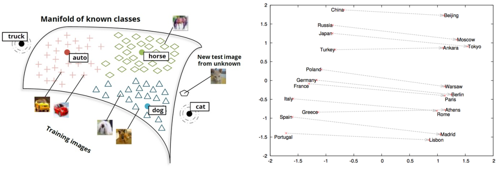
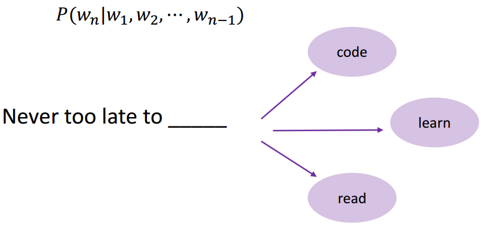
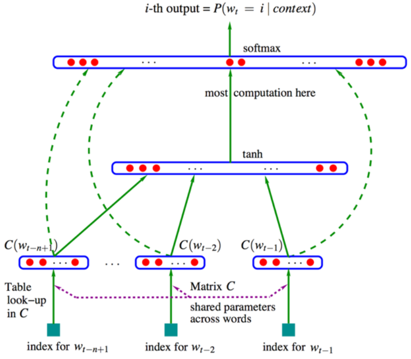
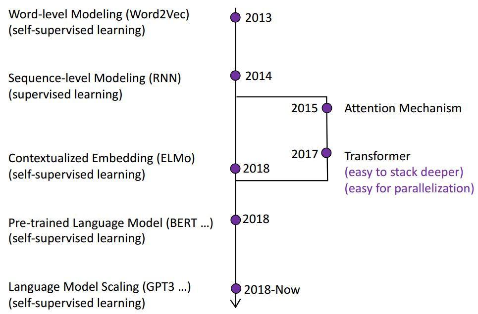
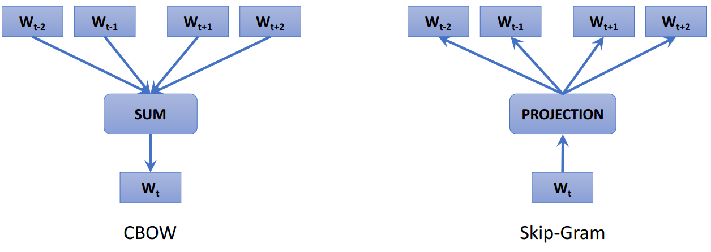
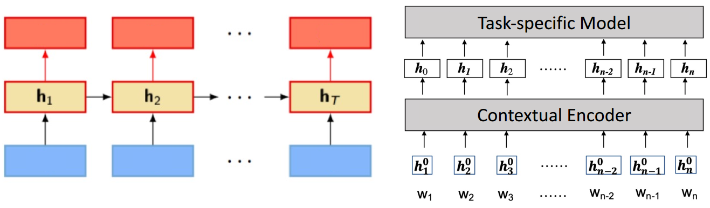

# 1.NLP&大模型基础

# 1.自然语言处理

## 1.1 基础与应用

### （1）图灵测试

原名：Imitation Game

采用一种行为注意的手段，尝试定义人工智能是不是具备人类智能的水平

- 1997年，人工智能在象棋方面战胜人类
- 2011年，IBM Watson DeepQA在问答节目上战胜所有人类。
- 2016年，Alpha go 在围棋方面战胜人类

### （2）NLP任务

基础任务：

- 词性标注：
- 命名实体识别：
- 共指消解：用代词代替实体
- 句法关系：互相依存关系
- 中文自动分词：

## 1.2 词表示

### （1）词表示

目的：**将单词转换为机器可以理解的符号**

目标：

- 词之间相似度的计算
- 词之间语义的关系

### （2）用一组相关的词表示

**近义词，上位词**；

问题：

1. 词语之间的较小差异无法区分；
2. 词义会发生变化，出现新的词义；
3. 主观性的问题，受限于词典的标注；
4. 数据稀疏问题；
5. 大量的人工去构建、维护词典；

### （3）one-hot表示

把每个词表示成独立的符号；

和词表一样长的向量去找一维跟这个词相对应，整个向量的维度跟词表的长度是相当的；

用来**表示文档时非常有效**，能较好地完成两个文档之间的相似度计算；

但是，在表示词的时候会有问题：**会假设词根词之间的向量任意之间都是正交的**，导致任意两个词之间进行相似度计算都是0.

$$
similarity ( star, sun )=\left(v_{\text {star }}, v_{\text {sun }}\right)=0
$$

### （4）上下文表示

一个词的词义由他经常出现在的位置的上下文有密切的关系

任何一个词都可以用他出现的维度或者重要性去进行表示，可以得到关于**每一个词的稠密向量**，就可以在这个空间里面利用稠密向量来计算两个词之间的相似度

问题：

1. 词表变大，存储需求也会变大
2. 有些词出现频度特别少，上下文少，这种方法不好表示

### （5）词嵌入

建立低维的稠密的向量空间，尝试把每一个词都学到这个空间里，用这个空间里的某一个位置所对应的向量来表示这个词，

在这个空间里我们可以**自动的学习出来词与词之间可能存在的相对比较稳定的一些关系**

## 1.3 语言模型

目的：根据前文，预测下一个词

1. 计算一个词的序列成为一句合法的话的概率，**联合概率**：$P(W)=P\left(w_{1}, w_{2}, \cdots, w_{n}\right)$
2. 根据前面说过的话，预测下一个词是什么，**条件概率**：$P\left(w_{n} \mid w_{1}, w_{2}, \cdots, w_{n-1}\right)$

基本假设：一个未来的词只会受到他前面的词的影响

$$
\begin{array}{l}P(\text { Never }, \text { too }, \text { late }, \text { to }, \text { learn })= \\ \quad P(\text { Never }) \times P(\text { too } \mid \text { Never }) \times P(\text { late } \mid \text { Never }, \text { too }) \times \\ \quad P(\text { to } \mid \text { Never }, \text { too, late }) \times P(\text { learn } \mid \text { Never }, \text { too, late, to })\end{array}
$$

$$
P( learn \mid Never, too, late, to )=\frac{P(\text { Never }, \text { too }, \text { late }, \text { to }, \text { learn })}{P(\text { Never }, \text { too }, \text { late }, \text { to })}
$$

语言模型：一个句子的联合概率=里面的每一个词基于前面已经出现的词的条件概率之积

$$
P\left(w_{1}, w_{2}, \cdots, w_{n}\right)=\prod_{i} P\left(w_{i} \mid w_{1}, w_{2}, \cdots, w_{i-1}\right)
$$

## 1.4 N-gram Model

**每一个词是一个单独的符号**

`4-gram`只会考虑相邻的4个词，也就是前面出现的三个词来预测下一个词

$$
P\left(w_{j} \mid\right. never to late to )=\frac{\text { count }\left(\text { too late to } w_{j}\right)}{\text { count }(\text { too late to })}
$$

`Bigram`就是`2-gram`，考虑连续出现的两个词，相当于只考虑前面出现的一个词，预测下一个词是什么

`Trigram`就是`3-gram`

在一个大规模数据里统计连续出现的序列的频度，在深度学习出现之前一个非常重要的技术

遵守**Markov的假设**，只考虑前面的有限的几个词

$$
P\left(w_{1}, w_{2}, \cdots, w_{n}\right) \approx \prod_{i} P\left(w_{i} \mid w_{i-k}, \cdots, w_{i-1}\right)
$$

$$
P\left(w_{i} \mid w_{1}, w_{2}, \cdots, w_{i-1}\right) \approx P\left(w_{i} \mid w_{i-k}, \cdots, w_{i-1}\right)
$$

**问题：**

1. 考虑的长度通常短，N多是2或者3，那上下文是1或2
2. 背后还是会**假设所有词相互之间都是独立的**，上下文基于符号去做统计，不能理解词与词之间的相似度造成了什么

## 1.5 神经语言模型

**每一个词是一个低维的向量**

用分布式的表示建构前文和当前词的预测条件概率

1. 把词表示成低维的向量
2. 把低维的向量拼在一起，形成一个更高的上下文的向量
3. 经过非线性的转换，用向量去预测下一个词是什么

通过对上下文的表示完成。

N-gram Model中每一个词是一个单独的符号，在Neural language Model中每一个词会被表示为一个向量。

相似的词会有一个相似的向量，就有可能在语境中发挥相似的作用。

# 2.大模型基础

## 2.1 大模型之旅

### （1）预训练大模型PLM

GLUE上预训练的语言模型的结果优于人类的表现，反映了语言理解的能力

### （2）大模型的特点

2018年以后，预训练大模型有以下三个特点：

1. 参数量越来越大
2. 数据越来越多
3. 计算资源越来越大

近两年来，参数尺度以每年10倍左右的速度增长；数据量也随之增长，计算成本也越来越高

注:M-millions, b -billion。最后一列训练时间是使用单个NVIDIA V100 GPU训练的估计时间

## 2.2 大模型背后的范式

### （1）预训练 + 微调

在**预训练**阶段，预训练的语言模型从大规模的未标记数据中获取丰富的知识

然后，我们可以使用特定任务的训练数据对预训练的语言模型进行**微调**，以适应预训练的知识

预训练和微调的基本范例可以追溯到**迁移学习**

人类可以应用以前学到的知识来更快地处理新问题，我们希望机器也有类似的能力

迁移学习使用“预训练，然后微调”的框架来实现“知识获取，然后知识转移”。

在预训练模型的后续工作中，使用了特征-表征-迁移和参数-迁移

### （2）词嵌入Word2Vec

Word2Vec使用两种主要的技术：CBOW（Continuous Bag of Words）和Skip-gram。两者均通过优化一个神经网络来训练词向量，但目标函数略有不同。

**CBOW (Continuous Bag of Words)**：CBOW模型预测的是目标词（中心词），而根据的是上下文词（周围的词）。具体来说，给定一个词的上下文，CBOW试图预测该词。

**Skip-gram**：Skip-gram与CBOW恰好相反。它的输入是中心词，输出则是上下文词。换句话说，它根据某个词来预测其周围的词。

### （3）解决一词多义：ELMo

- 使用RNN对大规模未标记数据进行语言建模
- 使用预训练的RNN生成**上下文词嵌入**

特定于任务的模型

### （4）Transformer

在Transformer的基础上，开发了一系列深度预训练模型，取代了更强大的浅层RNN

