# 2.神经网络基础

# 1.神经网络组成部分

## 1.1 神经网络

### （1）神经元

人工神经网络：灵感来自于大脑中的生物神经网络

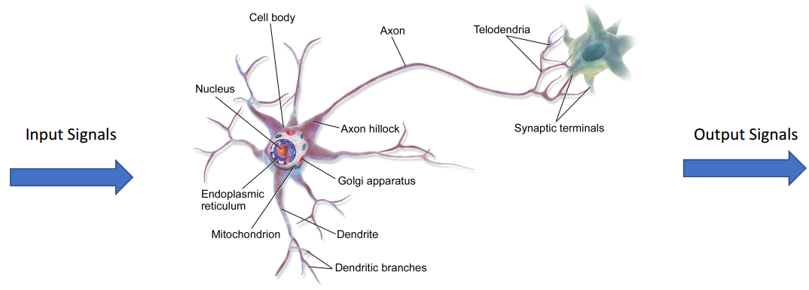

神经元是一个具有输入和一个输出和参数$w$,$b$的计算单元

$$
h_{\boldsymbol{w}, b}(\boldsymbol{x})=f\left(\boldsymbol{w}^{T} \boldsymbol{x}+b\right)
$$

### （2）单层神经网络

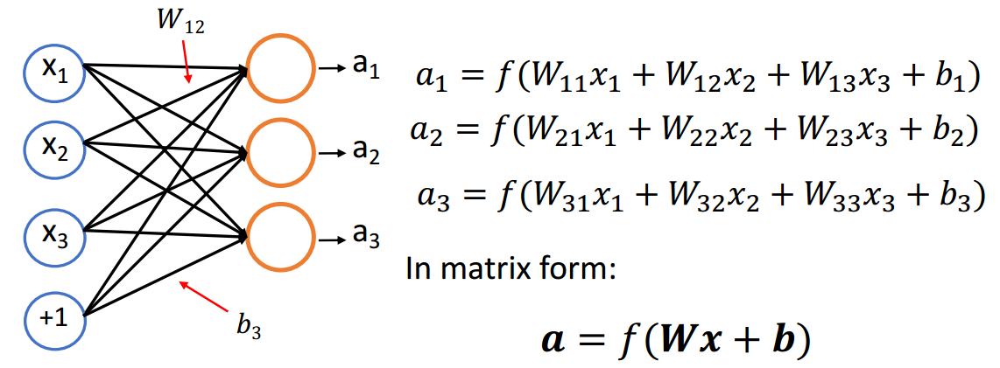

### （3）多层神经网络

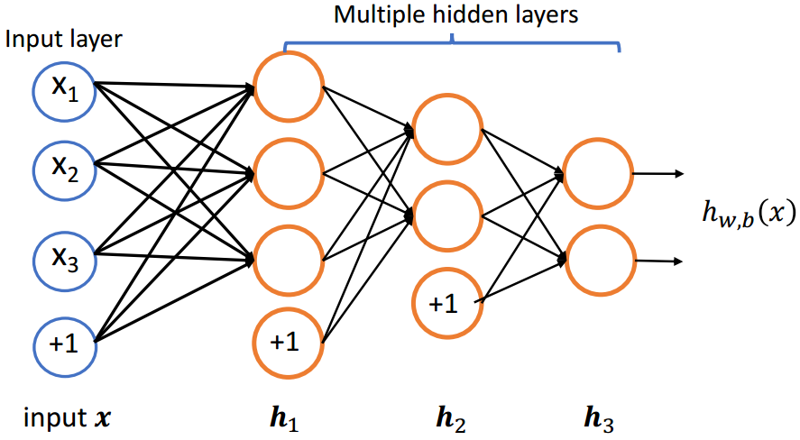

$$
\begin{array}{l}\boldsymbol{h}_{1}=f\left(\boldsymbol{W}_{1} \boldsymbol{x}+\boldsymbol{b}_{1}\right) \\ \boldsymbol{h}_{2}=f\left(\boldsymbol{W}_{2} \boldsymbol{h}_{1}+\boldsymbol{b}_{2}\right) \\ \boldsymbol{h}_{3}=f\left(\boldsymbol{W}_{3} \boldsymbol{h}_{2}+\boldsymbol{b}_{3}\right)\end{array}
$$

## 1.2 激活函数

如果神经网络中只存在线性运算的话，那么多层的神经网络其实可以被转化为单层的神经网络；所以我们**使用非线性的激活函数，防止多层的神经网络塌缩成单一的神经网络**

### （1）Sigmoid

$$
f(z)=\frac{1}{1+e^{-z}}
$$

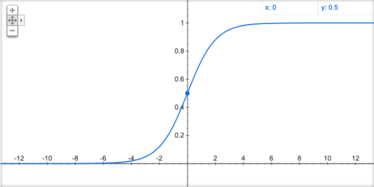

### （2）Tanh

$$
f(z)=\tanh (z)=\frac{e^{z}-e^{-z}}{e^{z}+e^{-z}}
$$

### （3）ReLU

$$
f(z)=\max (z, 0)
$$

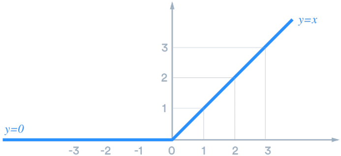

## 1.3 输出层

增加若干个隐层可以提高网络的表达能力，如果想要得到我们想要的输出结果，就需要添加网络的最后一层，即**输出层**

# 2.训练方式

## 2.1 训练目标

### （1）均方根误差

$$
\min _{\theta} J(\theta)=\min _{\theta} \frac{1}{N} \sum_{i=1}^{N}\left(y_{i}-F_{\theta}\left(x_{i}\right)\right)^{2}
$$

其中，$\theta$是神经网络参数

### （2）交叉熵

$$
\min _{\theta} J(\theta)=\min _{\theta}-\frac{1}{N} \sum_{i=1}^{N} \log P_{\operatorname{model}}\left(F_{\theta}\left(x_{i}\right)=y_{i}\right)
$$

其中，$\theta$是神经网络参数

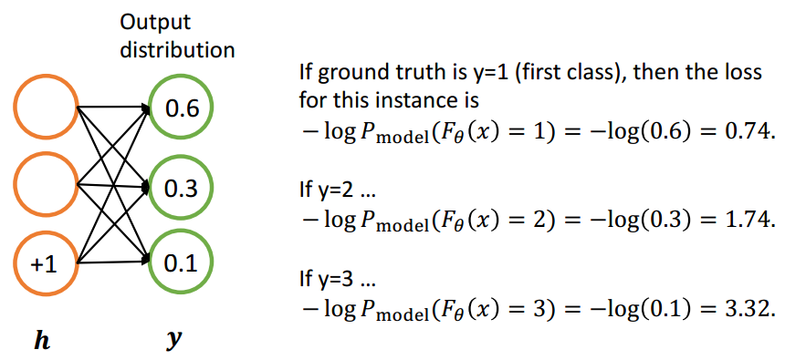

## 2.2 随机梯度下降

更新规则：

$$
\theta^{\text {new }}=\theta^{\text {old }}-\alpha \nabla_{\theta} \mathrm{J}(\theta)
$$

其中，$\alpha
 $是学习率

### （1）梯度

给定$n$个输入，$m$个输出的函数：

$$
\mathrm{F}(\boldsymbol{x})=\left[F_{1}\left(x_{1}, x_{2} \ldots x_{n}\right), F_{2}\left(x_{1}, x_{2} \ldots x_{n}\right) \ldots F_{m}\left(x_{1}, x_{2} \ldots x_{n}\right)\right]
$$

则输出为$m\times n$的雅可比矩阵

$$
\frac{\partial \mathrm{F}}{\partial \boldsymbol{x}}=\left[\begin{array}{ccc}\frac{\partial \mathrm{F}_{1}}{\partial x_{1}} & \cdots & \frac{\partial \mathrm{F}_{1}}{\partial x_{n}} \\ \vdots & \ddots & \vdots \\ \frac{\partial \mathrm{F}_{\mathrm{m}}}{\partial x_{1}} & \cdots & \frac{\partial \mathrm{F}_{\mathrm{m}}}{\partial x_{n}}\end{array}\right]
$$

其中，$\left(\frac{\partial \mathrm{F}}{\partial x}\right)_{i j}=\frac{\partial \mathrm{F}_{\mathrm{i}}}{\partial x_{j}}$表示第i个输出对第j个输入求梯度。

### （2）链式求导法则

给定$s=\boldsymbol{u}^{T} \boldsymbol{h}, \boldsymbol{h}=f(\boldsymbol{z}), \boldsymbol{z}=\boldsymbol{W} \boldsymbol{x}+\boldsymbol{b}$，求$\frac{\partial s}{\partial \boldsymbol{b}}$

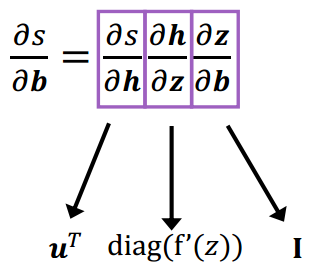

## 2.3 反向传播

### （1）计算图

计算图：将神经网路的传播以图的形式表示。

- 源节点：输入
- 内部节点：操作
- 边传递操作：结果

$$
\begin{array}{c}s=\boldsymbol{u}^{T} \boldsymbol{h} ~,~ \boldsymbol{h}=f(\mathbf{z}) ~,~ \boldsymbol{z}=\boldsymbol{W} \boldsymbol{x}+\boldsymbol{b} ~,~ \boldsymbol{x} \text { input }\end{array}
$$

梯度回传：沿着边往回走，沿着梯度传递

### （2）单个结点

节点接收到一个“上游梯度”

目标是传递正确的“下游梯度”

每个节点都有一个局部梯度（ local gradient ），输出相对于输入的梯度

$$
[downstream gradient] = [upstream gradient] \times
[local gradient]
$$

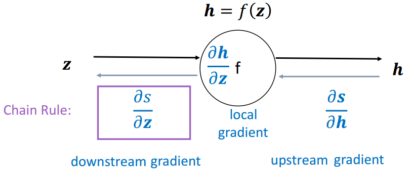

### （3）示例

函数：$\begin{array}{c}f(x, y, z)=(x+y) \max (y, z) ~~,~~ x=1, y=2, z=0\end{array}$

前向传播：

$$
\begin{array}{c}a=x+y=3 \\ \mathrm{~b}=\max (y, z)=2 \\ f=a b=6\end{array}
$$

本地梯度（Local gradients）：

$$
\begin{array}{c}\frac{\partial a}{\partial x}=1, \frac{\partial a}{\partial y}=1 \\ \frac{\partial b}{\partial y}=\mathbf{1}(y>z)=1, \frac{\partial b}{\partial z}=\mathbf{1}(z>y)=0 \\ \frac{\partial f}{\partial a}=b=2, \frac{\partial f}{\partial b}=a=3\end{array}
$$

初始计算图：

回传第一步：

回传第二步（`*`）：

$$
\frac{\partial f}{\partial a}=b=2, \frac{\partial f}{\partial b}=a=3
$$

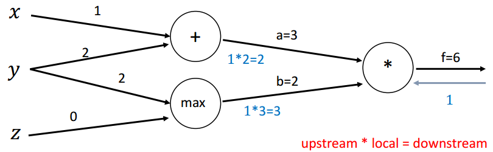

回传第三步（`max`）：

$$
\frac{\partial b}{\partial y}=\mathbf{1}(y>z)=1, \frac{\partial b}{\partial z}=\mathbf{1}(z>y)=0
$$

回传第四步（`+`）：

$$
\frac{\partial a}{\partial x}=1, \frac{\partial a}{\partial y}=1
$$

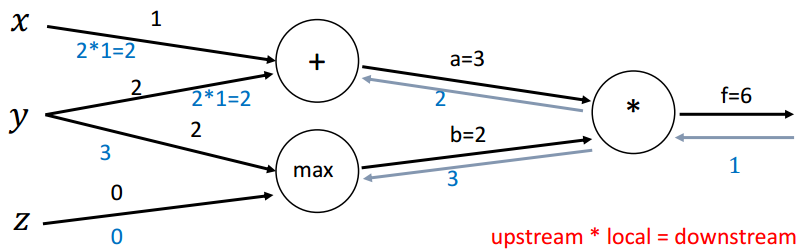

计算最终梯度：

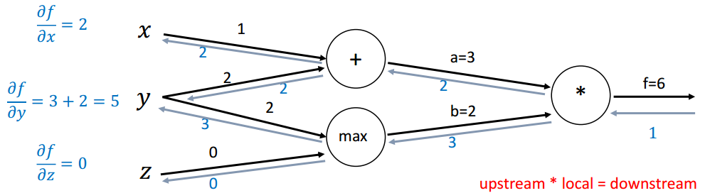

# 3.词表示：Word2Vec

Word2Vec：可以学到一些语义内涵，捕捉到语言学上的一些规律

## 3.1 Word2Vec

Word2vec使用浅层神经网络将单词与分布式表示相关联

它可以捕获许多语言规则，例如:

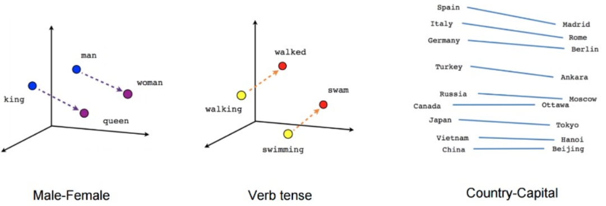

Word2vec可以利用两种架构来生成单词的分布式表示：

- Continuous bag-of-words (`CBOW`) &#x20;
- Continuous `skip-gram`

## 3.2 滑动窗口

Word2vec使用一个固定大小的滑动窗口沿着句子移动

- 在每个窗口中，中间的单词是目标单词，其他单词是上下文单词
- 给定上下文单词，CBOW预测目标单词的概率
- 当给定目标词时，skip-gram预测上下文词的概率

滑动窗口大小为5

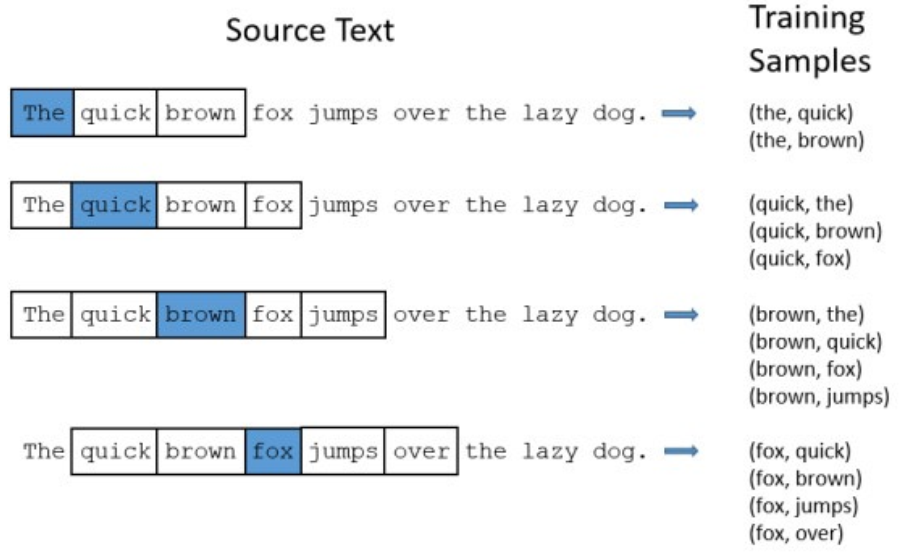

## 3.3 CBOW（Continuous Bag-of-Words）

在CBOW架构中，**该模型给出一个周围上下文词的窗口来预测目标词**

- 根据词袋假设：上下文词的顺序不影响预测
- 假设窗口大小为5，`Never too late to learn`

$$
P( late \mid[ never, too, to, learn ])
$$

## 3.4 Continuous Skip-Gram

在skip-gram架构中，该模型从目标词中预测上下文词

假设窗口大小为5，`Never too late to learn`

$$
P([ too, late ] \mid Never ), P([ Never, late, to ] \mid too ), \ldots
$$

Skip-gram每步预测一个上下文词，训练样本为:

$$
\begin{array}{l}P(\text { too } \mid \text { Never }), P(\text { late } \mid \text { Never }), P(\text { Never } \mid \text { too }), P(\text { late } \mid \text { too }), P(\text { to } \mid \text { too }), \ldots\end{array}
$$

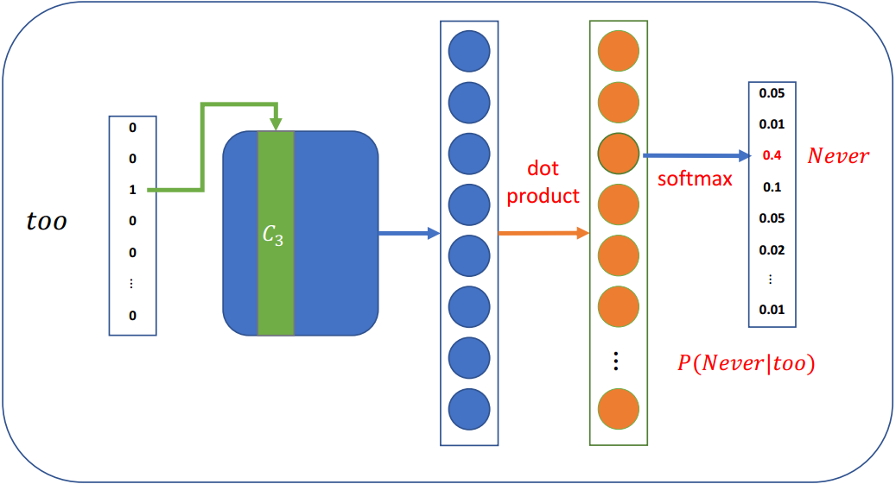

## 3.5 Softmax存在问题

当词汇量很大的时候

- Softmax对所有单词的每一步都依赖于大量的模型参数，这在计算上是不切实际的
- 我们需要提高计算效率

事实上，在word2vec中我们**并不需要一个完整的概率模型**；word2vec主要有两种改进方法:

- 负采样
- 分层softmax

## 3.6 负采样

当词汇表非常大，这意味着模型每一步都有大量的权重需要更新

负抽样的思想是，**每一步只更新一小部分权重**

既然有词汇表并且知道上下文单词，**可以按概率选择几个不在上下文单词列表中的单词**：

$$
P\left(w_{i}\right)=\frac{f\left(w_{i}\right)^{3 / 4}}{\sum_{j=1}^{V} f\left(w_{j}\right)^{3 / 4}}
$$

其中，$f(w_i)$为$w_i$的频次，$3/4$为经验值

相比于$\frac{f\left(w_{i}\right)}{\sum_{j=1}^{V} f\left(w_{j}\right)}$，这可以增加低频词出现的概率。

假设我们只选取4个负采样词：

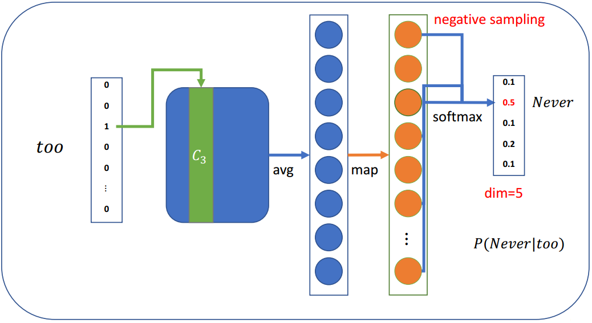

然后我们可以计算损失，并优化每一步的权重(不是所有的权重)

- 假设有一个大小为300×10,000的权重矩阵，输出大小为5
- 只需要更新300×5权重，这只占所有权重的0.05%

## 3.7 其他一些细节

### （1）Sub-Sampling

**罕见的单词可能更有可能携带不同的信息**，据此，Sub-Sampling有概率地丢弃单词:

$$
1-\sqrt{t / f(w)}
$$

其中，$f(w)$为单词频率，$t$是一个可调节的阈值吗

### （2）Soft sliding window

**滑动窗口应该给较远的单词分配较少的权重**

将滑动窗口最大的定义为 $S_{max}$，实际的滑动窗口大小在1和$S_{max}$之间随机选择

因此，那些靠近目标单词的单词更有可能出现在窗口中

# 4.通用神经网络

## 4.1 RNN

### （1）顺序记忆

RNN的关键概念：**处理序列数据时的顺序存储器**

定义：一种让大脑更容易识别序列模式的机制

RNN递归地更新序列内存以建模序列数据

### （2）RNN

### （3）RNN单元

$$
\begin{array}{c}h_{i}=\tanh \left(W_{x} x_{i}+W_{h} h_{i-1}+b\right) \\ y_{i}=F\left(h_{i}\right)\end{array}
$$

### （4）RNN语言模型

$W_h$参数是共享的

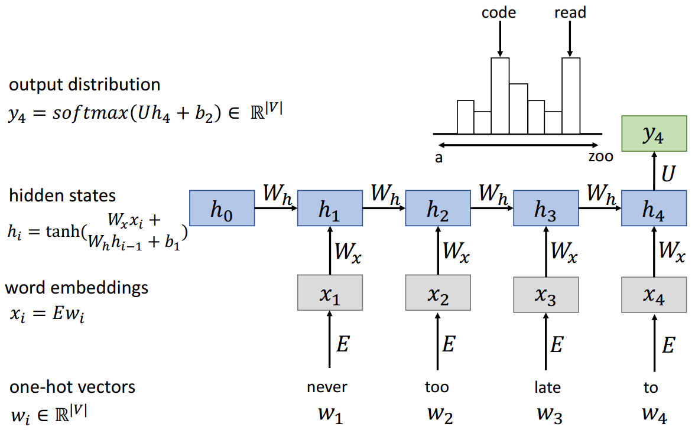

### （5）优缺点

优点：

- 可以处理任何长度的输入
- 模型尺寸不增加较长的输入
- 跨时间步共享权重
- 从许多后退步骤计算步骤

缺点：

- 循环计算速度慢
- 在实践中，很难从许多步骤中获取信息

### （6）梯度问题

RNN链比较长，**容易出现梯度消失或爆炸**

$$
h_{i}=\tanh \left(W_{x} x_{i}+W_{h} h_{i-1}+b\right)
$$

$$
\Delta w_{1}=\frac{\partial \text { Loss }}{\partial w_{2}}=\frac{\partial \text { Loss }}{\partial h_{n}} \frac{\partial h_{n}}{\partial h_{n-1}} \frac{\partial h_{n-1}}{\partial h_{n-2}} \ldots \frac{\partial h_{3}}{\partial h_{2}} \frac{\partial h_{2}}{\partial w_{2}}
$$

### （7）RNN变种

梯度消失问题的主要解决方案是**在递归中使用更复杂的隐单元计算**

- GRU
- LSTM

主要思想：**保持记忆，捕捉远距离的依赖**

## 4.2 GRU（Gated Recurrent Unit）

Vanilla RNN在下一个时间步直接计算隐藏层：

$$
h_{i}=\tanh \left(W_{x} x_{i}+W_{h} h_{i-1}+b\right)
$$

在原始RNN中，增加门控机制，主要用于平衡过去的信息和输入之间的影响。主要有两个门控单元：

**更新门**（update gate）：$z_{i}=\sigma\left(W_{x}^{(z)} x_{i}+W_{h}^{(z)} h_{i-1}+b^{(z)}\right)$

**重置门**（reset gate）：$r_{i}=\sigma\left(W_{x}^{(r)} x_{i}+W_{h}^{(r)} h_{i-1}+b^{(r)}\right)$

**新的激活输出** $\tilde{h}_{i}$：$\tilde{h}_{i}=\tanh \left(W_{x} x_{i}+r_{i} * W_{h} h_{i-1}+b\right)$

最后的隐藏单元输出$h_i$：$h_{i}=z_{i} * h_{i-1}+\left(1-z_{i}\right) * \tilde{h}_{i}$

**示例**

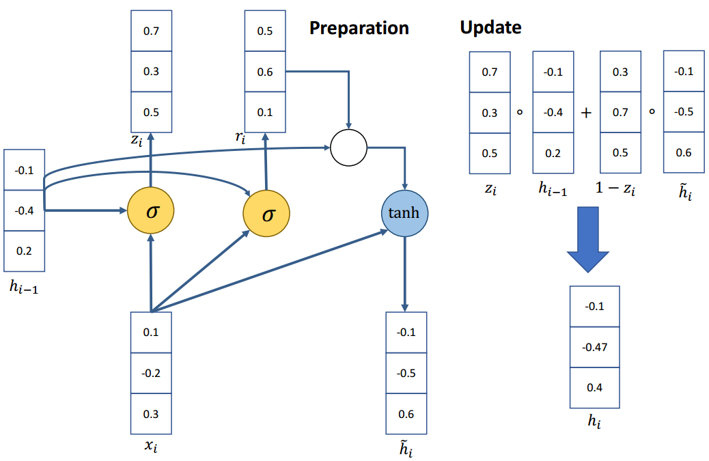

如果重置门$r_i$ 接近于0

$$
\tilde{h}_{i} \approx \tanh \left(W_{x} x_{i}+0 * W_{h} h_{i-1}+b\right)
$$

$$
\tilde{h}_{i} \approx \tanh \left(W_{x} x_{i}+b\right)
$$

忽略先前的隐藏状态，这表明当前的激活与过去无关。例如，在一篇新文章的开头，过去的信息对于当前的激活是无用的。

更新门$z_i$控制与当前激活相比，过去的状态有多少是重要的。

如果$z_i$接近于1，然后可以通过许多时间步骤复制该单元中的信息!

$$
h_{i}=1 * h_{i-1}+(1-1) * \tilde{h}_{i}=h_{i-1}
$$

如果$z_i$接近于0，然后将信息放入该单元并完全取代历史信息

## 4.3 LSTM（Long Short-Term Memory network）

LSTM是一种特殊的RNN，能够像GRU一样学习长期依赖关系；

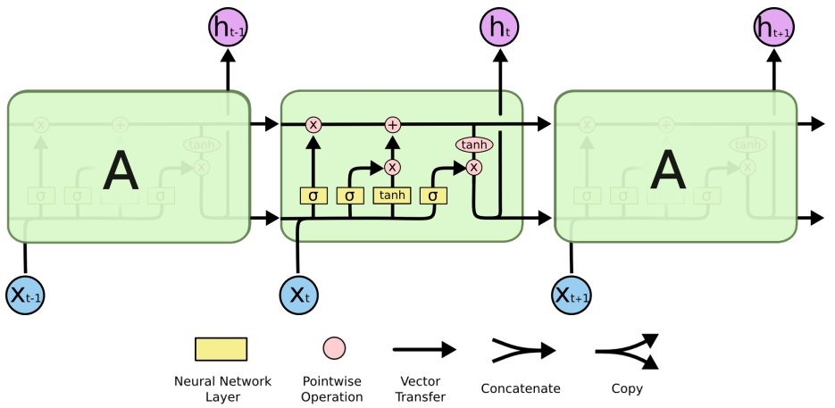

### （1）状态单元 $C_t$

LSTM的关键是单元状态$C_t$

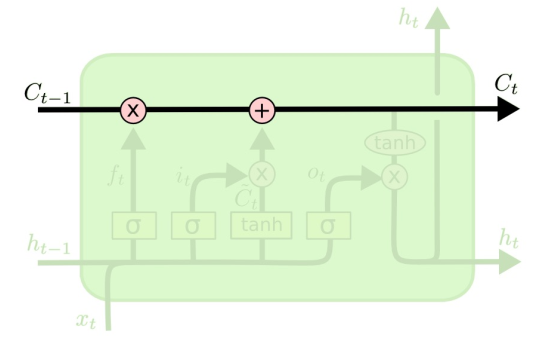

- 用于捕获长期依赖的额外向量
- 直接贯穿整个链条，只有少量的线性交互作用
- 易于删除或添加信息到细胞状态

### （2）遗忘门$f_t$

遗忘门：**决定从状态单元中丢弃哪些信息**

$$
f_{t}=\sigma\left(W_{f} \cdot\left[h_{t-1}, x_{t}\right]+b_{f}\right)
$$

其中，$\left[h_{t-1}, x_{t}\right]$为拼接向量

如果$f_{t}=0$，则直接遗忘过去的信息。

### （3）输入门 $i_t$

**输入门**：决定在单元状态中存储什么信息；

输入门$i_t$和新的候选状态信息 $\tilde{C}_{t}$

$$
i_{t}=\sigma\left(W_{i} \cdot\left[h_{t-1}, x_{t}\right]+b_{i}\right)
$$

$$
\tilde{C}_{t}=\tanh \left(W_{C} \cdot\left[h_{t-1}, x_{t}\right]+b_{C}\right)
$$

更新就的状态信息 $C_{t-1}$，结合前两步的结果

$$
C_{t}=f_{t} * C_{t-1}+i_{t} * \tilde{C}_{t}
$$

### （4）输出门$o_t$

输出门：**决定输出什么信息**

为特定的单词表示调整句子信息

$$
o_{t}=\sigma\left(W_{o}\left[h_{t-1}, x_{t}\right]+b_{o}\right)
$$

$$
h_{t}=o_{t} * \tanh \left(C_{t}\right)
$$

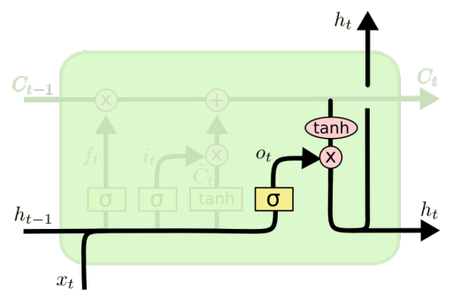

功能强大，特别是当堆叠和更深层时(每个隐藏层已经由深层内部网络计算)

如果你有大量的数据，非常有用

## 4.4 双向RNN

在传统的RNN中，当前状态只捕获过去的信息

$$
h_{t}=f\left(x_{t-1}, \ldots, x_{2}, x_{1}\right)
$$

问题：在很多应用中，我们希望输出$y_t$依赖于整个输入序列

## 4.5 CNN

RNN vs CNN

