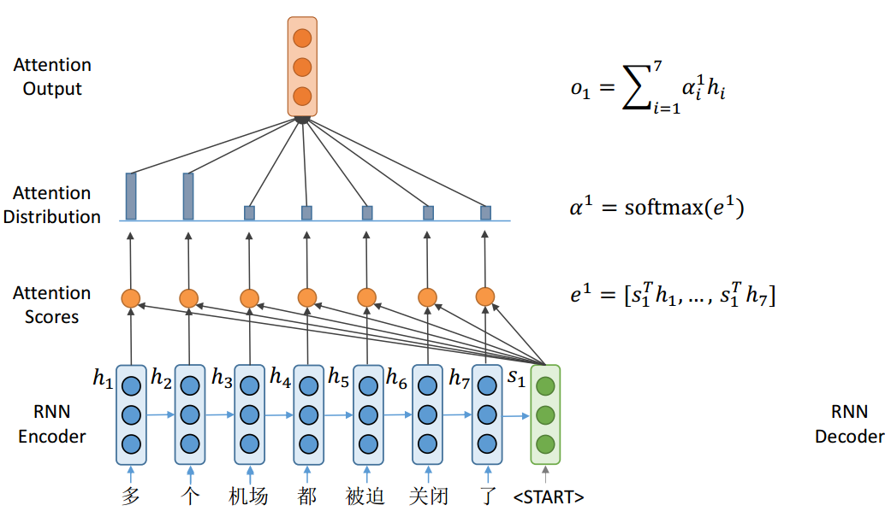
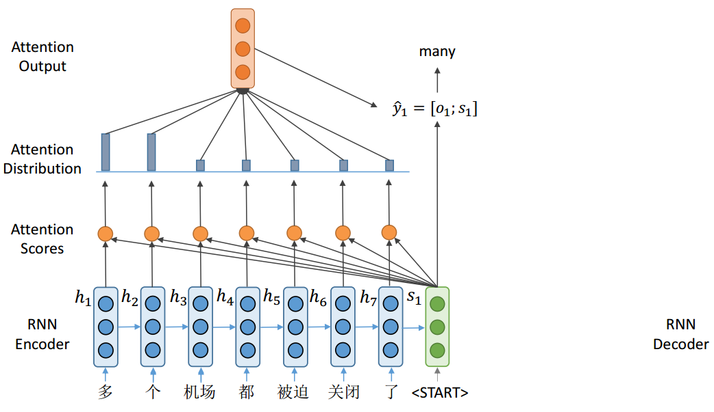
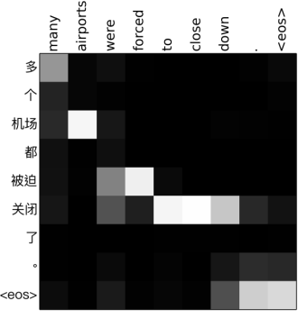
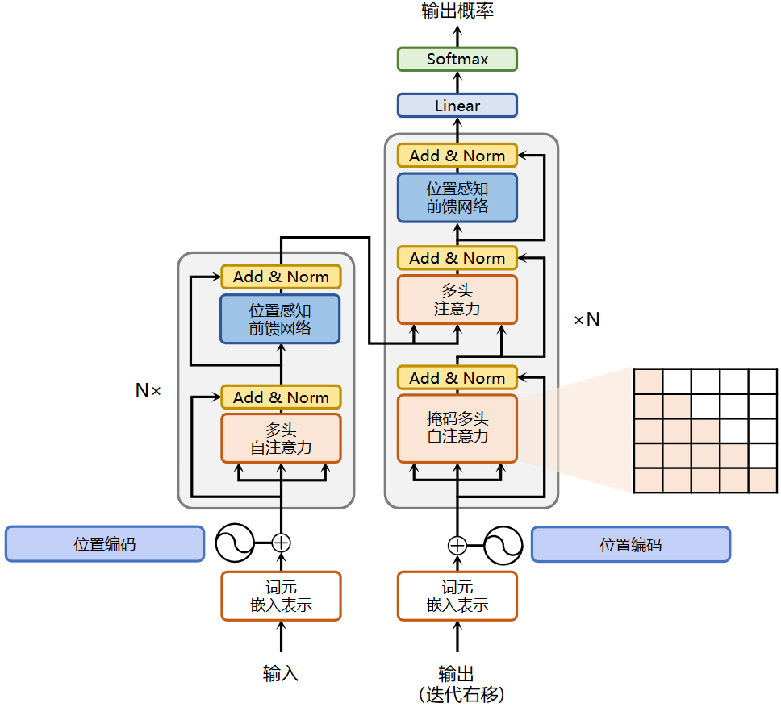
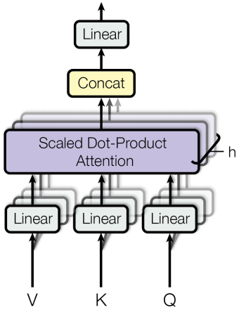
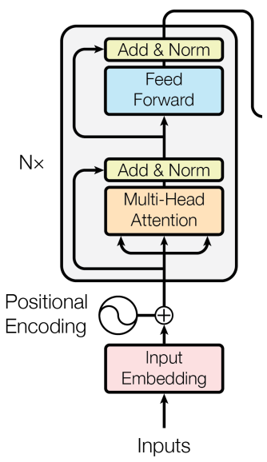
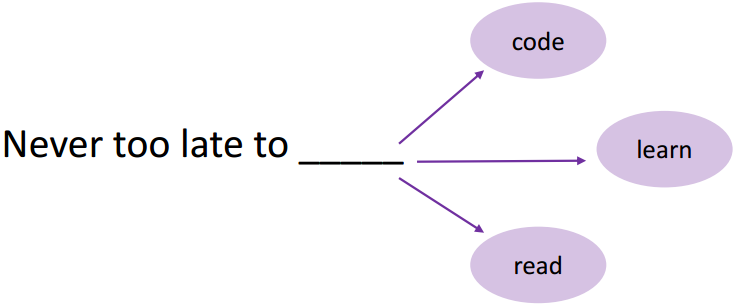
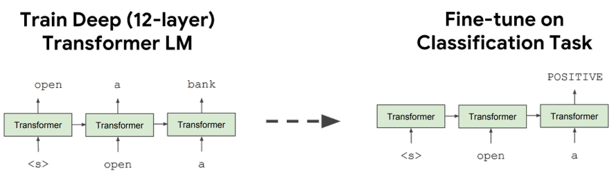
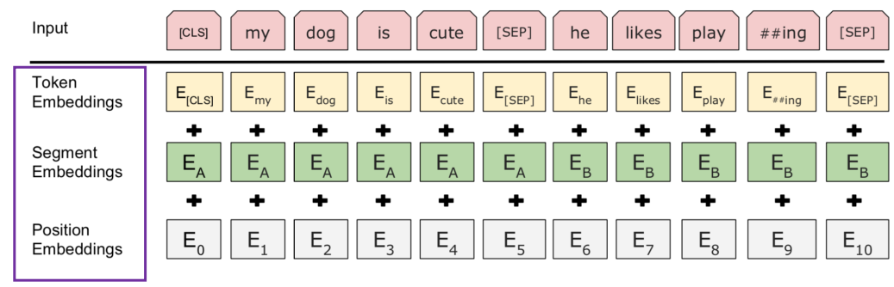
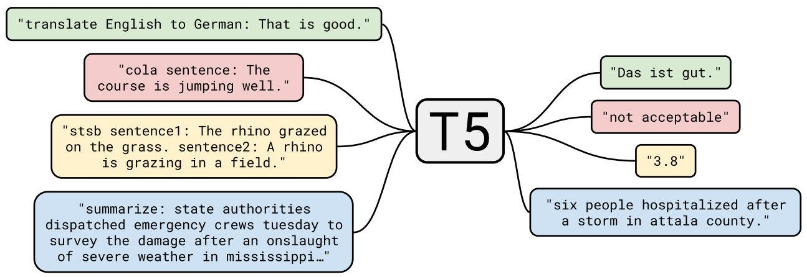

# 3.Transformer基础

# 1.Transformer

## 1.1 注意力机制

### （1）Seq2Seq注意力

传统的Seq2Seq序列模型存在信息瓶颈的问题

- 源句子编码的单向量需要捕获远举子的所有信息
- 单向量限制了编码器的表示能力：信息瓶颈


注意力机制：

- 注意力提供了瓶颈问题的解决方案；
- 核心思想：**在解码器的每一步，专注于源序列的特定部分**。

### （2）Seq2Seq注意力机制

1. Encoder隐藏状态：$h_{1}, h_{2} \ldots, h_{N} \in \mathbb{R}^{h}$
2. Decoder在$t$时刻的隐藏状态：$s_{t} \in \mathbb{R}^{h}$
3. 在$t$时刻，计算注意力分数 $e_t$ ： $e^{t}=\left[s_{t}^{T} h_{1}, \ldots, s_{t}^{T} h_{N}\right] \in \mathbb{R}^{N}$
4. 使用softmax得到注意力分布$\alpha_t$ ：$\alpha^{t}=\operatorname{softmax}\left(e^{t}\right) \in \mathbb{R}^{N}$
5. 利用注意力分布计算编码器隐藏状态的加权和作为注意力输出 ： $o_{t}=\sum_{i=1}^{N} \alpha_{i}^{t} h_{i} \in \mathbb{R}^{h}$
6. 连接注意力输出和解码器隐藏状态来预测单词 ：$\left[o_{t} ; s_{t}\right] \in \mathbb{R}^{2 h}$






### （3）注意力机制的变体

不同注意力分数的计算，有不同的变体，$\mathrm{e} \in \mathbb{R}^{N}$

#### Additive attention

$$
e_{i}=v^{T} \tanh \left(W_{1} h_{i}+W_{2} s\right) \in \mathbb{R}
$$

其中，$W_{1} \in \mathbb{R}^{d_{3} \times d_{1}}, W_{2} \in \mathbb{R}^{d_{3} \times d_{2}}$是权重矩阵，$v \in \mathbb{R}^{d_{3}}$是权重向量。

#### Basic dot-product attention

$$
e_{i}=s^{T} h_{i} \in \mathbb{R}
$$

假设向量$d_1=d_2$

#### Multiplicative attention

$$
e_{i}=s^{T} W h_{i} \in \mathbb{R}, \quad W \in \mathbb{R}^{d_{2} \times d_{1}}
$$

### （4）注意力通用定义

给定一个query向量和一组value向量，注意力技术根据query计算值的加权和

根据查询，**加权和是值的选择性汇总**。可以通过注意机制获得任意一组表征的固定大小的表征。

数学表示：

- 如果存在value向量$\boldsymbol{h}_{1}, \boldsymbol{h}_{2} \ldots, \boldsymbol{h}_{N} \in \mathbb{R}^{d_{1}}$，query向量$\mathbf{s} \in \mathbb{R}^{d_{2}}$
- 根据注意力分数$\mathbf{e} \in \mathbb{R}^{N}$，计算得到注意力输出$\mathbf{o} \in \mathbb{R}^{d_{1}}$

$$
\boldsymbol{\alpha}=\operatorname{softmax}(\boldsymbol{e}) \in \mathbb{R}^{N}
$$

$$
\boldsymbol{o}=\sum_{i=1}^{N} \alpha_{i} \boldsymbol{h}_{i} \in \mathbb{R}^{h}
$$

- 有几种不同的方法来计算的注意力分数$\mathbf{e} \in \mathbb{R}^{N}$

### （5）注意力机制的特点

**注意力解决Seq2Seq瓶颈问题**，解码器可以直接查看全部encoder输出

**注意力有助于消除梯度问题**

注意力提供了一些可解释性，可以通过注意图找出解码器关注的是什么；注意力允许网络对齐相关的单词



## 1.2 Transformer结构

### （1）总览

- 架构：Encoder-Decoder &#x20;
- 输入：byte pair encoding +  positional encoding &#x20;
- 模型：多个Encoder-Decoder  堆叠
- 输出：翻译单词的概率
- 损失函数：标准的交叉熵损失



### （2）Input Encoding

输入：byte pair encoding +  positional encoding &#x20;

#### Byte Pair Encoding（BPE）

一种分词算法。从字符词汇开始；将最常见的n-gram转换为新的n-gram。

之前使用空格，之类的切分，词表必定不会包含所有单词，所以BPE将单词切分为更小的词元。

通过将稀有词和未知词编码为子词单元序列来解决OOV (out of vocabulary)问题

- 在上面的例子中，OOV单词“最低”将被分割成“最低”。
- “low”和“lowest”之间的关系可以概括为“smart”和“smartest”。

原始词汇表：


1、将各个字母添加到词表中：

```bash
l, o, w, e, r, n, w, s, t, i, d
```

2、将频次为9的`es`对添加进去

```bash
l, o, w, e, r, n, w, s, t, i, d,  es
```

3、因为`s`不单独出现，是和`es`一起出现，删除`s`

```bash
l, o, w, e, r, n, w, t, i, d, es
```

4、将频次为9的`est`对添加进去，且`es`不是单独出现，和`est`一起出现，删除`es`

```bash
l, o, w, e, r, n, w, t, i, d,  est
```

循环这个过程，直到达到词表的大小要求即可。

#### Positional Encoding（PE）

Transformer block对位置不同的相同单词不敏感；添加位置编码 **，以便相同的单词在不同位置具有不同的表示**

$$
P E_{(p o s, 2 i)}=\sin \left(\right. pos \left./ 10000^{2 i / d}\right)
$$

$$
P E_{(p o s, 2 i+1)}=\cos \left(p o s / 10000^{2 i / d}\right)
$$

其中，$i$为词嵌入索引，范围为$[0, d/2]$

#### Input

`Input = BPE + PE`


### （3）Transformer Block

#### Dot-Product Attention

输入：

- 一个query向量$q$，一组键值对 $(k, v)$
- $q$、k向量维度为$d_k$
- $v$向量维度为$d_v$

输出：

- **输出是**$v$**向量的加权和**
- 每个值的权重由查询和对应键的点积计算： $A(q, K, V)=\sum_{i} \frac{e^{q \cdot k_{i}}}{\sum_{j} e^{q \cdot k_{j}}} v_{i}$
- 堆叠多个query为一个矩阵Q： $A(Q, K, V)=\operatorname{softmax}\left(Q K^{T}\right) V$

图示：

$$
A(Q, K, V)=\operatorname{softmax}\left(Q K^{T}\right) V
$$


#### Scaled Dot-Product Attention

点积注意力问题：

- **如果**$d_k$**维度过大，则**$q^T \cdot k$\*\* 的方差也会变得很大\*\*​
- 经过softmax后的注意力分布变得会很尖锐，梯度会变得很小

解决方法：

- 带有缩放的点积注意力：$A(Q, K, V)=\operatorname{softmax}\left(\frac{Q K^{T}}{\sqrt{d_{k}}}\right) V$


#### Self-attention

让词向量自己选择彼此

Q, K, V是从一个句子的单词向量中得到的



#### Multi-head Attention

不同的head：相同的计算，不同的参数

连接所有输出并馈送到线性层

$$
\operatorname{head}_{i}=\mathrm{A}\left(Q W_{i}^{Q}, K W_{i}^{K}, V W_{i}^{V}\right)
$$

$$
\operatorname{MultiHead}(Q, K, V)=\operatorname{Concat}\left(\right. head _{1}, \ldots, head \left._{h}\right) W^{O}
$$


#### Encoder Block

在每一层中，Q, K, V与前一层的输出相同



#### Decoder Block

**Mask self-attention**：单词只能看前面的单词，mask用于遮掩Encoder输出的未来的信息

**Encoder-Decoder 注意力**：query来自解码器，而key和value来自编码器


### （4）Trick

- 残差连接
- 层归一化：将输入向量变化为均值为0，方差为1的向量
- 标签平滑
- ADAM优化器
- 在加入残差之前，在每一层的训练中Dropout
- 带波束搜索(beam search)和长度惩罚(length penalties)的自回归解码

### （5）优缺点

优点

- Transformer是一个强大的模型，在许多NLP任务中被证明是有效的
- Transformer适合**并行化**
- 证明了**注意机制**的有效性
- 它还提供了对最近NLP进展，如BERT和GPT

缺点：

- 架构难以优化，对模型修改敏感
- 每层注意力计算的复杂度高$O(n^2)$，对输入文本长度有要求，最大不能超过512

# 2.PLM（Pretrained Language Models）

## 2.1 语言模型

语言建模是**预测即将出现的单词**的任务，计算即将到来的单词K的条件概率。

$$
P\left(w_{n} \mid w_{1}, w_{2}, \cdots, w_{n-1}\right)
$$



**语言建模**：最基本和最重要的NLP任务

- 包含多种语言理解知识，如语言知识和事实知识
- 只需要纯文本，不需要任何人工注释

通过语言模型学习到的语言知识可以很容易地转移到其他NLP任务中

NLP迁移学习有三种代表性模型

- Word2vec
- Pre-trained RNN
- GPT & BERT

## 2.2 PLMs（Pre-trained Langue Models）

PLM：对其他NLP任务具有强大可移植性的语言模型。word2vec是第一个PLM，如今的PLM都是基于Transformer的模型。

主要有两个分支：

1、**Feature-based 方法**

- 基于特征的方法中最具有代表性的模型是word2vec
- 使用PLM的输出作为下游模型的输入

2、**Fine-tuning 方法**

- 最具代表性的微调方法模型是BERT
- 语言模型也是下游模型，其参数将被更新。

### （1）GPT

[论文精读 GPT、GPT-2、GPT-3 | 37.2° Blog (wdndev.github.io)](https://wdndev.github.io/paper_reading/2.5.GPT_GPT-2_GPT-3/ "论文精读 GPT、GPT-2、GPT-3 | 37.2° Blog (wdndev.github.io)")

受Transformer在不同NLP任务中的成功启发，GPT是第一个基于Transformer预训练PLM的工作；

在自然语言处理领域，有很多各式各样的的任务，如问答，文本分类等。然而，现有的无标签文本非常多，而有标签的文本很少，这使得在这些有标签文本训练一个好的分辨模型很难，因为数据集太少。因此GPT第一个版本主要就是为了解决这个问题而提出的一套针对语言模型的预训练方法，使得大量的无标签数据能够被使用，并且对预训练好的模型加以微调使其适用于许多的下游任务。

在微调时，构造与子任务相关的输入，从而之只需要很少改变模型架构。

GPT = Transformer + left-to-right LM

GPT在下游任务上fine-tuned



### （2）BERT

[论文精读 BERT | 37.2° Blog (wdndev.github.io)](https://wdndev.github.io/paper_reading/2.2.BERT/ "论文精读 BERT | 37.2° Blog (wdndev.github.io)")

BERT的出现使得我们能够在一个大的数据集上面训练好一个比较深的神经网络，然后应用在很多的NLP任务上面，这样既简化了NLP任务的训练，又提升了它的性能，所以BERT和它之后的一系列工作使得自然语言处理在过去三年中有了质的飞跃。

**输入**：



## 2.3 Masked LM的应用

**基本思想**：**使用双向的信息去预测目标token**

将不同域的对象一起输入，并根据输入的对象预测目标对象

### （1）跨语言LM预训练

Translation Language Modeling (TLM)

TLM目标将**MLM扩展到平行句对**(例如，英语-法语)；为了预测一个被屏蔽的英语单词，该模型可以同时关注英语句子及其法语翻译，并鼓励对齐英语和法语表示

翻译语言建模(TLM)的目标是利用并行数据改进跨语言语言模型的预训练


### （2）跨模态LM预训练

自动语音识别(ASR)的视频和文本对

通过使用预训练模型将分层向量量化应用于视频衍生的特征，生成一系列“视觉词”

鼓励模型关注视频中的高级语义和较长时间动态

## 2.5 PLMs前沿技术

### （1）GPT-3

[论文精读 GPT、GPT-2、GPT-3 | 37.2° Blog (wdndev.github.io)](https://wdndev.github.io/paper_reading/2.5.GPT_GPT-2_GPT-3/ "论文精读 GPT、GPT-2、GPT-3 | 37.2° Blog (wdndev.github.io)")

GPT-3：大规模的PLM


### （2）T5

Encoder-Decoder架构

**将所有NLP任务重新构建为统一的文本到文本格式**，其中输入和输出始终是文本字符串



### （3）MoE

加强Encoder-Decoder与MoE(Mixture of Experts)数十亿的参数

Gshard 600B参数

Switch Transformer 1571b参数


# 3.Transformers API教程

[transformers 教程 - 知乎 (zhihu.com)](https://www.zhihu.com/column/c_1400131016443506688 "transformers 教程 - 知乎 (zhihu.com)")
