# 4.Prompt Tuning & Delta Tuning

# 1.Background

## 1.1 Fine Tuning : BERT

BERT不管输入是单句还是两句，它实际上会对每一个token产生一个表征，这些表征可以进行分类。

如果做的是token级别的分类任务，比如NER，那么这些token的表征会送到一个分类层中，来对每个token进行分类。

如果做的是句子级别的分类任务，那么一般会把这个`[CLS]` token，代表句子级别语义，送到分类层中。

也就是时候，BERT对于不同的任务，会将不同的表征送到分类层中去，比从零学习的神经网络效果会好很多。

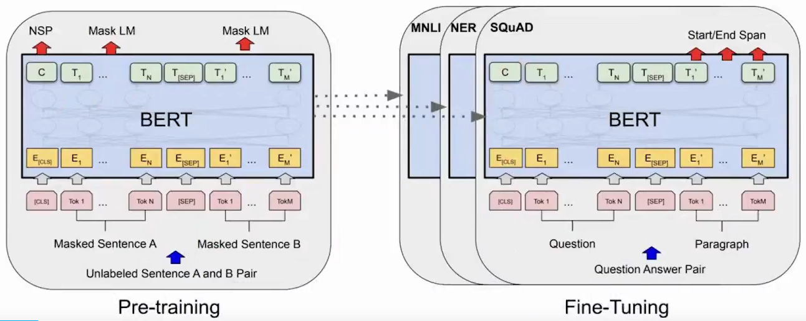

**BERT : 关系抽取**


1. 用 \[CLS] 进行分类
2. Mention Pooling， 实体之间的所有token，concat到一起，然后再接分类层。
3. Mention Pooling， 区分不同实体，在embedding加入Token type embedding；最后实体之间的所有token，concat到一起，然后再接分类层。考虑位置信息。
4. Entity Markers : 词表中增加特殊的字符

可以看到这些做法是非常经验性的，并且没有那么直观，最后我们都需要去训练一个分类器，即需要随机初始化一个分类层。将得到的表征喂给它，再和模型一起微调训练。

这种方式越来不不适应于我们现在的时代。

## 1.2 GPT

GPT是一个生成模型，生成第`n`个token取决于前 `n-1` token的概率。

将最后一个隐藏状态馈送到线性输出层

$$
P\left(y \mid x^{1}, \ldots, x^{m}\right)=\operatorname{softmax}\left(h_{l}^{m} W_{y}\right)
$$

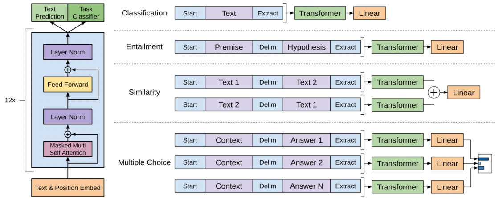

## 1.3 T5

- Encoder-decoder架构，11B参数
- 通过简单的演示将任务转换为`seq2seq`方式
- 解码器经过训练以输出所需的Tokens

假如要做情感分类任务，此时并不是输出0或1这种没有含义的表示。而是直接输出一个可以代表情感的单词，比如positive，来代替分类。

这种做法的好处就是，把所有任务的范式统一成一个训练的框架，即seq2seq。


比如上图示一个QNLI的数据，它由一个question和一个sentence组成。将它们喂给T5的时候，会进行一些处理，比如会说`qnli question是什么`，`sentence是什么`。然后原来的target是0，现在改成了具体的单词entailment。

即解码器被训练来输出需要的单词，而并不是我们所需要的那个类。通过这些简单的demonstration就把这些任务映射成了seq2seq之后，T5模型就可以训练了，不再需要额外的分类层让它重新训练了。

这种做法表明了一种趋势。

## 1.4 GPT-3

- 175B参数的大模型
- 参数量太大，微调很困难，采用prompts策略，应用到下游任务

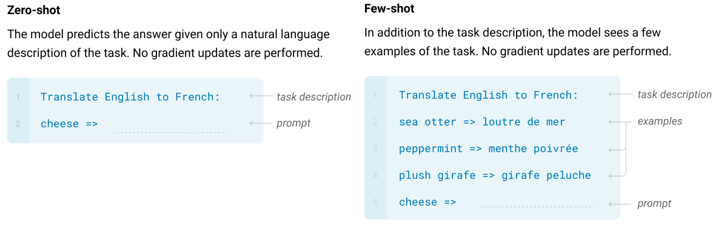

## 1.5 An Irreversible Trend

### （1）Model Scaling

- 更大的PLM往往会带来更好的性能
- 更好的自然语言理解能力
- 更好的自然语言生成质量
- 更好的持续学习新知识的能力

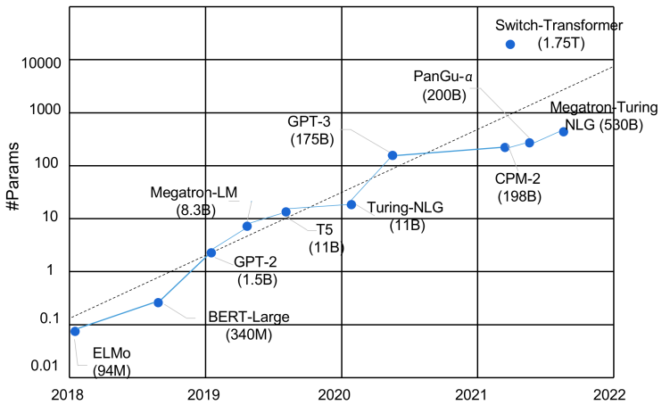

### （2）Difficult Tuning

- 主要方式：Fine-tuning
- 更新所有参数困难
- 为不同的任务保留单独的实例，占用存储空太大
- 泛化不良，监督不足
- 导致在研究中很少使用大规模PLM

## 1.6 Effective Model Adaptation

有两种方式高效使用大模型：

- **任务和数据方面**：通过缩小模型微调和预训练之间的差距，使用**Prompt-learning**来增强少量学习能力
- **优化方面**：使用**Delta Tuning**来微调具有数十亿参数的模型，并优化一小部分参数。用小参数的优化去驱动大模型


# 2.Prompt learning

## 2.1 基本组成与流程介绍

### （1）Prompt-learning

- 使用encoder作为PLMs的基本编码器
- Fine-tuning为特定任务添加额外的神经网络
- 微调所有参数
- pre-training和fine-tuning之间存在差距。**pre-training以mask的方式进行训练，而fine-tuning以QA的方式进行微调，存在差距**。

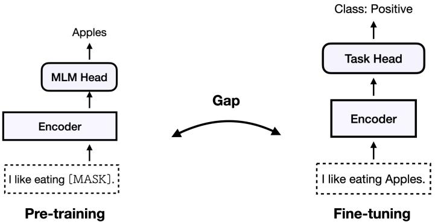

### （2）Template vs Verbalizer

- 用 `[MASK]` 位置添加额外的上下文（Template）
- 使用标签标记单词（Verbalizer）
- 弥补pre-training and fine-tuning差距

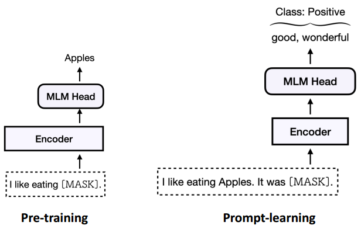

对于一个输入的实例，给它加一句话叫`it was [mask]`，即一个prompt，同时也给它保证成一个和预训练任务一样的形式。比如预训练中的MLM任务，这里也用mask的形式，让模型去预测该mask位置的单词。这里会预测出和预训练中一样的东西，即单词的概率分布。然后根据它子在整个词表上的分布，只去抽取其中想要的词。

比如说是一个情感分类任务，那么可能会有一个正类和负类。那么对于正类，就有good或wonderful等这种词来代表正类；而bad或terrible这种词来代表负类。

这里额外增加的这个上下文(`it wat [mask]`)称之为**模板(template)**；把标签映射到标签单词的映射器称为**verbalizer**；

这种做法还有一个好处是，**不再需要考虑各种任务之间的区别**。同样一套数据，根据prompt设置的不同，或者verbalizer选择的不同，那么可以把不同的任务看成是不同的分类。

这样就可以把所有的分类，甚至是生成任务都可以通过prompt重新组织成同样一个范

### （3）Template ：情绪分类

#### 使用模板提示

首先有一个输入`x = 'I love this moive'`。然后给它包一个prompt，变成` [x] Overall, it was a [z] movie`。这里`[z]`就是要预测的答案。最终经过prompt之后的数据变成了`x'='I love this moive. Overall it was a [z] movie.'`。

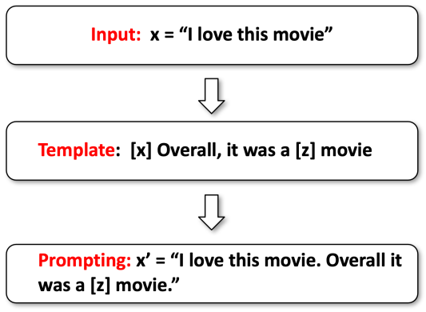

#### 预测答案

此时模型会输出一个词表上的概率分布，但只选择需要的概率最大的标签单词，假设这里时`fantastic`。

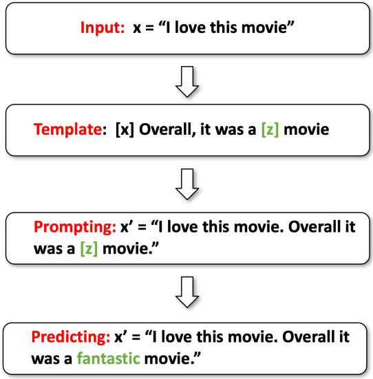

#### 使用Verbalizer将答案映射到类标签

比如认为`fantastic`是一个positive的类。

这样就通过prompt-learning完成情感分类的pipeline。


### （4）Prompt-learning ：注意事项

预训练模型：

- Auto-regressive (GPT-1, GPT-2, GPT-3; OPT…)&#x20;
- Masked Language Modeling (BERT, RoBERTa, DeBERTa) &#x20;
- Encoder-Decoder (T5, BART)

模板（Template）：

- Manually Design &#x20;
- Auto Generation &#x20;
- Textual or Continuous…

用言语表达（Verbalizer）：

- Manually Design &#x20;
- Expanding by external knowledge…

## 2.2 PTM选取

### （1）生成式模型

Auto-regressive (GPT-1, GPT-2, GPT-3; OPT…)&#x20;

**一般的MASK放在最后，需要最后一个词**，不一定适用于特别长的文本。但是现在几乎超大级别的模型，都是用这种自回归的方式去训练的。这种训练方式非常适用于超大模型。


### （2）MLM：分类模型，语言理解

Masked Language Modeling (BERT, RoBERTa, DeBERTa) &#x20;

如果要做理解任务或简单的分类任务，可能更好的办法用一个BERT或RoBERTa。

**MASK位置在中间，会把前后的上下文attention**。


### （3）Encoder-Decoder：T5

Encoder-Decoder (T5, BART)

然后像T5模型，实际上在训练的时候，它已经有了一些所谓的比较简单的prompt。

但没有做的事情是，详细地指明这个prompt可以长什么样。也没有说如果最后生成了那些单词之后，还可不可以做进一步地处理。

T5模型有一个好处是比较通用，没有说像自回归模型那样那么不擅长做理解，又不像BERT模型那样不擅长做生成。


## 2.3 Template构造

### （1）根据任务特点人为设计

考虑任务的特性是什么，比如关系抽取、文本分类、对话等等，我们要考虑任务的特性来构造不同的模板，此时可能需要个人的先验知识。

示例，利用人类的先验知识。对于不同的任务，确实可以利用人类的先验知识来设定不同的模板。

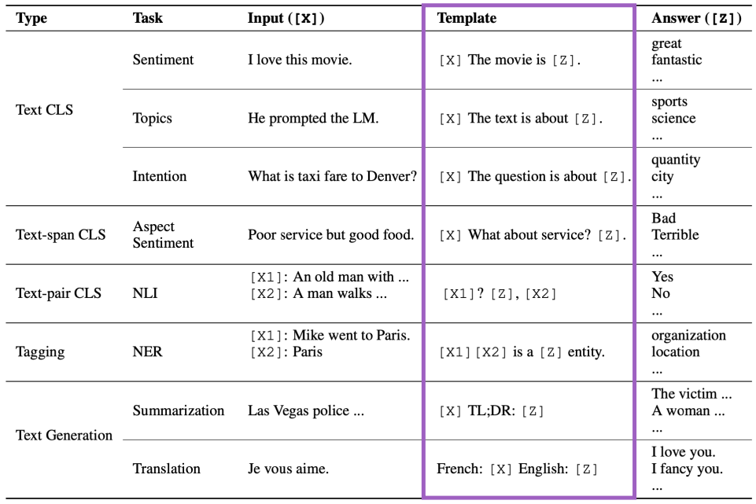

TL；DR：to long, don't reading

#### **实体关系任务Template**

- 复制模板中的实体
- 预测细粒度实体类型
- 汲取世界知识

假设输入是`London is one of the biggest cities in the world.`。假设要加一个模板，可以把`London`复制到模板中去，然后接上`is a [mask]`，来问模型`London`是什么类别。

这样对于每个输入，该模板开头的单词都不一样，表示不同的实体。这样来完成实体分类，从而达到抽取世界知识的效果。

通过这种做法，在少样本/零样本任务上表现特别好。


#### **逻辑增强Template**

人为定义的规则，加入分类任务中

也可以让模板变得非常复杂，这个例子中要抽取`Mark Twain`和`Langdon`的关系。

这里设计`prompt`的时候加入了一些人为定制的规则，如果要保证实体之间关系的类别，首先要保证它们实体本身类别的正确性。这样会带来额外一些制约，从而提升最终关系抽取分类的准确度。比如上图中的`x's parent was y`，必须要保证x和y都是person。


### （2）结构化，与规则相结合

- 所有提示符的**键值对**
- 将不同的任务组织成结构化的格式

提醒模型应该做什么。通过这种提醒，加上训练去微调模型，在模型内部做成一个区分，而且是不同维度上的区分。

首先定义一个`[Format]`表示格式是怎样的，然后定义一个`[Task]`表示数据集是怎么的，接着是`[Domain]`表示领域；然后是`[Question]`和`[Passage]`。


**多个Template**

- 为输入实例使用多个不同的提示
- 降低即时工程成本
- 稳定任务性能

方法

- 均匀平均
- 加权平均


### （3）自动生成与搜索优化

#### 基于现有单词的梯度搜索提示

> AUTOPROMPT: Eliciting Knowledge from Language Models with Automatically Generated Prompts. 2020

这里给定输入后，定义了一些触发单词，然后定义一个prompt模板，其中每个单词都是由mask来初始化，通过最大化后验标签的概率来优化这些prompt的嵌入，然后从这些触发单词中找到和优化后的嵌入所对应的单词当成prompt。这会导致最后生成的模板看起来没有什么具体含义(语义不通)，但是它就是有效的，甚至比人类定义的prompt更加有效。

这带给我们一些启示，通过prompt的目的是触发想要的单词，实际上这并不一定需要人类的直觉来定义。也就是说，**对人类来说是最好的，对模型不一定是最好的**。


#### 使用encoder-decoder模型生成prompts

> LM-BFF: Making Pre-trained Language Models Better Few-shot Learners. 2021

利用额外的模型来生成prompt，比如对于一些情感分析类数据直接喂给T5，然后看哪些prompt加上这些数据后得到的准确度最高。选择最高的作为最终的模板。

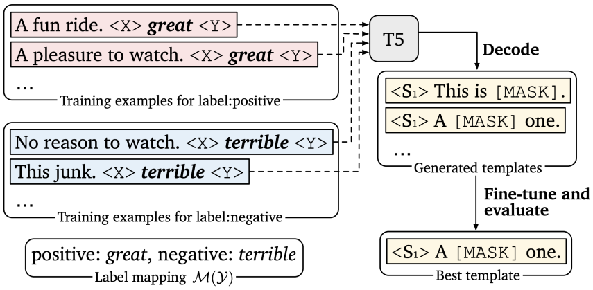

### （4）连续提示优化

- 通过优化连续提示，生成NLU模型
- P-tuning v1：prompts 输入层(与重新参数化)
- P-tuning v2：prompts 每一层(如前缀微调)

> P-Tuning v2: Prompt Tuning Can Be Comparable to Fine-tuning Universally Across Scales and Tasks

也可以通过特殊的字符来产生prompt


## 2.4 Verbalizer构造

**Verbalizer就是把标签映射成标签单词的过程。**

可以把标签定义为一个或多个词，如果是多个词的话， 那么就求这些词概率的(加权)平均值。然后比较类别之间的概率。

Verbalizer

- 映射：answer → 不固定标签
- Tokens : 预训练语言模型词汇表中的一个或多个Tokens&#x20;
- Chunks : 由多个符号组成的词块
- Sentence : 任意长度的句子

Construction &#x20;

- Hand-crafted &#x20;
- Auto-generation

### （1）人工构造Verbalizer

- 人工设计与人类的先验知识
- 从一个初始的标签词开始，释义和扩展
- 从一个初始的标签词开始，使用外部知识并扩展
- 用多个Tokens分解标签
- 虚拟Tokens 和优化标签嵌入

任务和相应的语言表达方法的例子

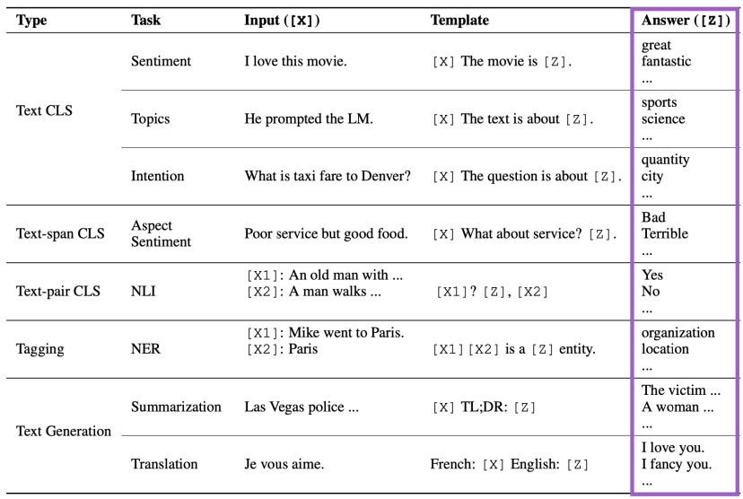

#### **Knowledgeable Prompting**

- 标签 → 单词
- 使用外部知识扩展标签词

> Knowledgeable prompt-tuning: Incorporating knowledge into prompt verbalizer for text classification. 2021

比如有一个问题：速度与加速度之间的关系是什么？ 然后加一个模板，`xx question`。这个`MASK`会预测认为定义的标签单词的概率，比如数学(mathematics)、运动(basketbal)和它们的同义词。

接着定义一个verbalizer，先给定标签，比如这里是科学(SCIENCE)。然后用一个知识库去扩充它，接着去掉噪音词，再去选择最终需要的单词。

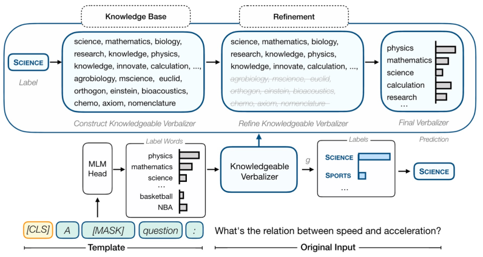

#### **Virtual Tokens as Label Words**

- 将 \[MASK] tokens 的隐藏状态投影到嵌入空间并学习原型
- 学习到的原型构成了语言表达器，并将PLM输出映射到相应的标签。

> Prototypical Verbalizer for Prompt-based Few-shot Tuning. 2021

除了用有意义的文本来构建之外，还可以用无意义的虚拟单词来表示标签单词。比如对于每个类别对应MASK的隐藏状态进行聚类，让不同的类别学到不同的簇，用这些簇中间的嵌入来表示最终的标签词。

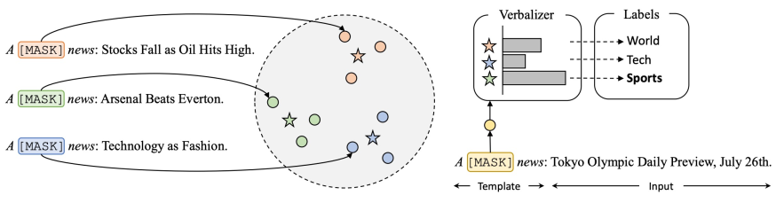

## 2.5训练新范式

训练模型的演变

1. 传统： 随机初始化后从零训练
2. BERT之后： 预训练-微调
3. T5： 基于文本-文本格式的预训练-微调
4. GPT： 预训练然后使用prompt\&in-context实现零/少样本学习

Prompt-learning 引入了新的学习策略

- pre-training，prompting，优化所有参数(中型模型，few-shot设置)
- pre-training，添加soft prompts，冻结模型和优化prompt embeddings (delta tuning perspective)
- pre-training与prompted data，zero-shot推理(Instruction tuning和T0)

### （1）Pre-trained Prompt Tuning

- 向输入层加入soft prompts (embeddings)
- **模型规模**
- 与11B PLM条件下的微调结果相当
- 本质上是一种**参数高效(delta tuning)** 方法


给预训练注入Prompts

- 完整数据：fine-tuning和prompt-tuning是可比较的
- 数据少：只有tuning prompts性能较差
- vanilla prompt tuning不能在低数据情况下有效推广
- 在预训练中注入soft prompts，提高prompt tuning的泛化性

### （2）多任务预训练和人工prompts

- 微调一个130B PLM与提示60个任务
- 大幅提高zero-shot 能力

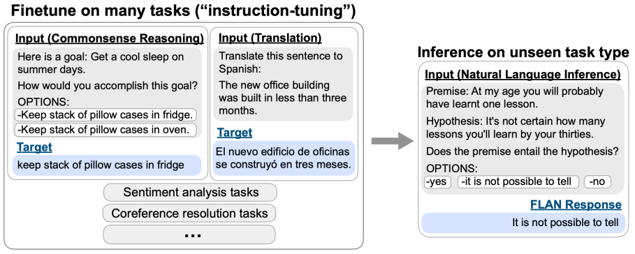

使用人工编写的prompts来训练encoder-decoder模型

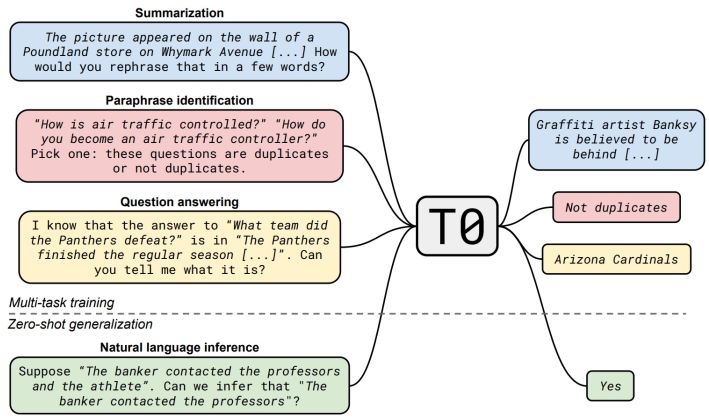

对未见过的任务进行zero-shot(绿色)。在1300亿的模型上去训练60个任务，为每个任务收集一些prompt，然后可以在未见过的任务上进行推理。


## 2.6 应用

已知的应用：

- 大多数NLP任务：NLU，生成，信息抽取，QA，翻译，...
- 具有位置相关性的任务可能比较困难，例如序列标记

视觉，多模态，生物医药

- 可以把输入加一些`soft token`，然后加上人工定义的医学领域的`prompt`，这样哪怕是小模型也可以在生物医学领域表现得特别好。
- 可以应用到多模态上，本质上是训练图片和文本之间的理解。首先给图片中对象画个框，然后给定颜色，然后在文本中问，比如这个女人被框到了什么颜色里。让模型预测颜色是什么样的，从而让模型建立颜色和文字的理解。


# 3.Delta Tuning

和prompt-learning不同，delta tuning是从另一个角度来高效地微调模型。  思想是**模型绝大部分参数不变，只微调一小部分模型，就能驱动大模型**。


**delta tuning**，对于每个任务只优化小部分参数，称之为**delta对象**，它们可能有各种各样的结构。这些delta对象代表解决任务能力的参数化表示。实际上这些参数所占空间很小，那么就没有资源压力。

实际上要考虑的地方也有很多，比如**模型的选择、delta对象如何设计**等等。

为什么参数高效的微调是有用的？

- 实际上在过去是不可能实现的，因为过去所有的网络参数都是随机初始化的。因为**有了预训练之后**，有了大模型之后，才能用delta tuning的范式。
- 因为大模型通过无监督的方式学习了**统一知识**，很多人认为在下游任务的微调中，只是把这个统一知识激发出来。即在下游微调任务中，并没有学习更多的知识，而是激发已经学到的知识。

delta tuing中的delta是什么？

- **Addition-based （增量式）**：新插入模型原来不存在的参数，然后只训练这些额外插入的参数。
- **Specification-based （指定式）**：指定模型哪些参数可以训练，哪些固定。
- **Reparameterization-based （重参数化式）**：用低维子空间参数来重参数化原来存在的参数。


## 3.1 Addition-based (增量式)

- 为Transformer层增加小的adapter(下图右边的网络模块)
- 实际上是**一个简单的双层神经网络，先缩小再非线性**，再还原：$h \leftarrow f\left(h W_{d}\right) W_{u}+h$（还有残差连接）
- 固定其他参数，只微调这些adapter
- 可训练参数只有整个模型的`0.5%~8%`

这样**可以达到和全参数模型几乎相同的效果**。


增量式的方法还有一种，叫做prefix-tuning，它和prompt有些联系。

- Addition在线性层，layernorm之前加的，
- refix-tuning在每层的隐藏状态前增加soft token，然后只优化这些soft token。


## 3.2 Specification-based (指定式)

这里介绍一种名为BitFit的方法，它只是去**微调所有偏置(bias)**，也能达到和全参数微调差不多的效果(简单任务)。


## 3.3 Reparameterization-based (重参数化)

重参数方法认为**优化过程可以在低维的空间完成**，将120个任务的优化压缩到低维的子空间里。比如在一个五维的空间中训练，然后还原到原来的参数里。此时可以发现在低维空间找到的解，可以在120个任务上表现的很好。


**LoRA**认为**要优化的矩阵本质上是低秩的**，虽然实际上并不是低秩的，但可以强行做低秩分解，比如$1000 \times 1000$分解为 $1000 \times 2$和 $2 \times 1000$的，这样可以减少很多计算量。

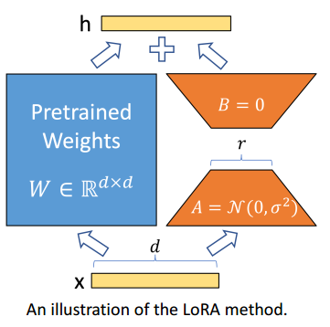

这些重参数化的方法本质上是有一些联系的，就是说**它们都基于相似的减少，模型的优化可以用很少代价来完成**。可以把它映射到一个低维或低秩的过程，用一个很简单的过程去完成这个模型的优化。

> \[1] Intrinsic dimensionality explains the effectiveness of language model tuning, 2020.
> \[2] LoRA: Low-Rank Adaptation of Large Langauge Models, 2021.
> \[3] Exploring low-dimensional intrinsic task subspace via prompt tuning, 2021.

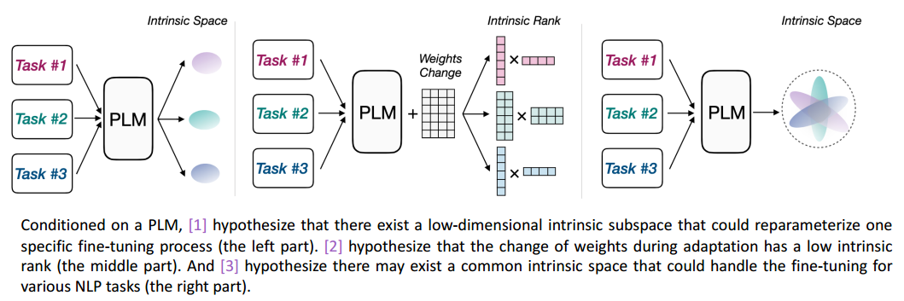

## 3.4 统一tuing

这种联系可以扩展到更多的方法，最近有人建立了一种统一框架，把这三种方式联系起来。

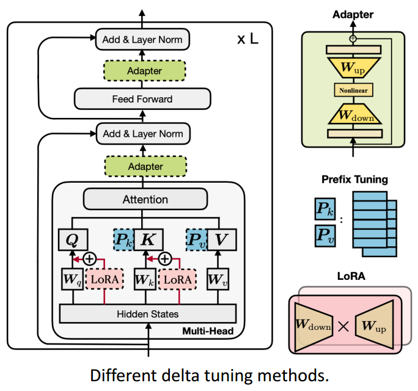

认为它们本质上可能在做同一件事情。


实际上它们都是**固定大模型参数，只微调很小部分的delta对象**。因此可以推导出更加通用的delta tuning变体。


在100多个NLP任务上进行了实验表明，delta tuning确实效果比较好，比如LoRA(LR)在100多个任务上只微调了0.38%的参数就能达到平均和全参数微调(FT)差不多的效果。


然后还可以发现不同的任务适用于不同的结构，那么是否存在一个最优结构呢。

比如可以**用自动机器学习的方法来搜索这个结构**，在每个位置设定一个开关，表示使用哪种delta tuning方式。这样就能找到一个比较稀疏的解，能让模型的效果特别好。


下图横轴表示参数量的稀疏程度(由多变少)，纵轴代表准确率。当参数量变少到万分之一的时候，其他的delta tuning方法都有显著的下降，而通过自动搜索方法得到的解它的效果和全参数微调还是保持相差不大。

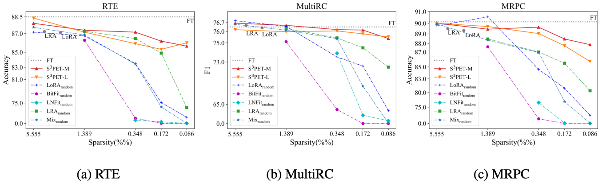

通过自动搜索的方法用更少的参数去探索一种极限。同时delta tuning还具备非常好的**可迁移性**，这几种delta tuning在不同的任务上得到的图像差不多。


## 3.5 总结

- **delta tuning在超大规模的模型上非常高效**
- 它的结构随着模型的增加变得越发不重要

# 4.OpenPrompt

## 4.1 OpenPrompt


Prompt其实可以自定义很多不同的Template/verbalizer，比如一个普通的情感分类任务，模板可能是`it was__`。 &#x20;

模板可能不同，mask位置可能不同，verbalizer也可能不同。

之前通常将模板写死到代码中，不方便我们尝试不同的模板，也无法灵活地找到mask的位置。 &#x20;
OpenPrompt工具包的目的是解决上面所说的问题，**定义统一的prompt tuning范式**，使用不同的模板，定义不同的verbalizer，去实现不同的任务。


上图是API交互。`PromptDataset`的输出是一个`Tempate`，包裹上输入之后，被`PromptTokenizer`分词成可以输入模型的数据。`PromptModel`把该输入中的soft token转换成`TemplateEmbeddings`，再输入预训练模型(PLM)，最后把mask的位置的输出抽出来，送给`Verbalizer`进行预测。 &#x20;

除此之外，通过`PromptTrainer`类提供了不同的训练方式。

下面简单看一下如何使用OpenPrompt。

1. 定义一个任务
2. 选择预训练模型
3. 定义一个Template
4. 定义一个Verbalizer
5. 定义一个PromptModel
6. 训练并推理

一些Template的例子： &#x20;

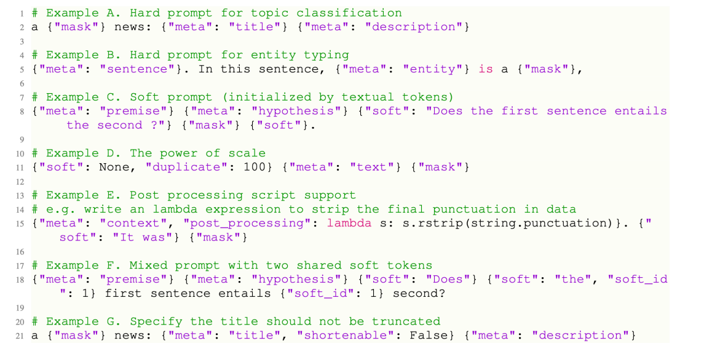

实施各种快速学习管道 （灰线是暂时没有出现的方法）

- 修改单独的模块和创建新的方法&#x20;
- 将现有方法应用于其他场景


## 4.2 OpenPrompt demo

下面用一个实例来进行演示。&#x20;

[OpenPrompt Demo - Colaboratory (google.com)](https://colab.research.google.com/drive/1bQnMvui8Zb6EwNXWiC3DYKr8AH0IEbQa#scrollTo=j1r0_pLwaqtZ "OpenPrompt Demo - Colaboratory (google.com)")

#### （1）安装包

首先安装需要的包

```bash
!pip install transformers --quiet
!pip install datasets==2.0 --quiet
!pip install openprompt --quiet
!pip install torch --quiet

```

#### （2）加载数据集

```python
from datasets import load_dataset
raw_dataset = load_dataset('super_glue', 'cb', cache_dir="../datasets/.cache/huggingface_datasets")
raw_dataset['train'][0]

```

```text
{'premise': 'It was a complex language. Not written down but handed down. One might say it was peeled down.',
 'hypothesis': 'the language was peeled down',
 'idx': 0,
 'label': 0}

```

并查看样本。

#### （3）加载模型和tokenizer

下面加载模型和分词器：

```text
from openprompt.plms import load_plm
plm, tokenizer, model_config, WrapperClass = load_plm("t5", "t5-base")

```

#### （4）构造输入

**构建输入**，将原始数据集处理成OpenPrompt可以使用的格式：

```text
from openprompt.data_utils import InputExample

dataset = {}
for split in ['train', 'validation', 'test']:
    dataset[split] = []
    for data in raw_dataset[split]:
        input_example = InputExample(text_a = data['premise'], text_b = data['hypothesis'], label=int(data['label']), guid=data['idx'])
        dataset[split].append(input_example)
print(dataset['train'][0])

```

```text
{
  "guid": 0,
  "label": 0,
  "meta": {},
  "text_a": "It was a complex language. Not written down but handed down. One might say it was peeled down.",
  "text_b": "the language was peeled down",
  "tgt_text": null
}

```

可以看到，有一部分叫`text_a`，另一部分输入叫`text_b`。还有刚才提到的`meta`信息。下面

**定义模板文本**：

```text
from openprompt.prompts import ManualTemplate
template_text = '{"placeholder":"text_a"} Deduction: {"placeholder":"text_b"}. Is it correct? {"mask"}.'
mytemplate = ManualTemplate(tokenizer=tokenizer, text=template_text)

```

模板定义如上所示，在mask位置输出我们想要的答案。

**使用标记器包装器类对wrapped\_example进行标记**

为了更好地理解模板包裹了什么，我们看一个例子

```text
wrapped_example = mytemplate.wrap_one_example(dataset['train'][0])
wrapped_example

```

```text
[[{'text': 'It was a complex language. Not written down but handed down. One might say it was peeled down.',
   'loss_ids': 0,
   'shortenable_ids': 1},
  {'text': ' Deduction:', 'loss_ids': 0, 'shortenable_ids': 0},
  {'text': ' the language was peeled down',
   'loss_ids': 0,
   'shortenable_ids': 1},
  {'text': '. Is it correct?', 'loss_ids': 0, 'shortenable_ids': 0},
  {'text': '<mask>', 'loss_ids': 1, 'shortenable_ids': 0},
  {'text': '.', 'loss_ids': 0, 'shortenable_ids': 0}],
 {'guid': 0, 'label': 0}]

```

`shortenable_ids`表示是否可压缩，`loss_ids`表示是否需要计算损失。

接下来处理这样的输出：

```text
wrapped_t5tokenizer = WrapperClass(max_seq_length=128, decoder_max_length=3, tokenizer=tokenizer,truncate_method="head")
# or
from openprompt.plms import T5TokenizerWrapper
wrapped_t5tokenizer= T5TokenizerWrapper(max_seq_length=128, decoder_max_length=3, tokenizer=tokenizer,truncate_method="head")

# You can see what a tokenized example looks like by
tokenized_example = wrapped_t5tokenizer.tokenize_one_example(wrapped_example, teacher_forcing=False)
print(tokenized_example)
print(tokenizer.convert_ids_to_tokens(tokenized_example['input_ids']))
print(tokenizer.convert_ids_to_tokens(tokenized_example['decoder_input_ids']))

```

```text
{'input_ids': [94, 47, 3, 9, 1561, 1612, 5, 933, 1545, 323, 68, 14014, 323, 5, 555, 429, 497, 34, 47, 158, 400, 26, 323, 5, 374, 8291, 10, 8, 1612, 47, 158, 400, 26, 323, 3, 5, 27, 7, 34, 2024, 58, 32099, 3, 5, 1, 0, 0, 0, 0, 0, 0, 0, 0, 0, 0, 0, 0, 0, 0, 0, 0, 0, 0, 0, 0, 0, 0, 0, 0, 0, 0, 0, 0, 0, 0, 0, 0, 0, 0, 0, 0, 0, 0, 0, 0, 0, 0, 0, 0, 0, 0, 0, 0, 0, 0, 0, 0, 0, 0, 0, 0, 0, 0, 0, 0, 0, 0, 0, 0, 0, 0, 0, 0, 0, 0, 0, 0, 0, 0, 0, 0, 0, 0, 0, 0, 0, 0, 0], 'attention_mask': [1, 1, 1, 1, 1, 1, 1, 1, 1, 1, 1, 1, 1, 1, 1, 1, 1, 1, 1, 1, 1, 1, 1, 1, 1, 1, 1, 1, 1, 1, 1, 1, 1, 1, 1, 1, 1, 1, 1, 1, 1, 1, 1, 1, 1, 0, 0, 0, 0, 0, 0, 0, 0, 0, 0, 0, 0, 0, 0, 0, 0, 0, 0, 0, 0, 0, 0, 0, 0, 0, 0, 0, 0, 0, 0, 0, 0, 0, 0, 0, 0, 0, 0, 0, 0, 0, 0, 0, 0, 0, 0, 0, 0, 0, 0, 0, 0, 0, 0, 0, 0, 0, 0, 0, 0, 0, 0, 0, 0, 0, 0, 0, 0, 0, 0, 0, 0, 0, 0, 0, 0, 0, 0, 0, 0, 0, 0, 0], 'decoder_input_ids': [0, 32099, 0], 'loss_ids': [0, 1, 0]}
['▁It', '▁was', '▁', 'a', '▁complex', '▁language', '.', '▁Not', '▁written', '▁down', '▁but', '▁handed', '▁down', '.', '▁One', '▁might', '▁say', '▁it', '▁was', '▁pe', 'ele', 'd', '▁down', '.', '▁De', 'duction', ':', '▁the', '▁language', '▁was', '▁pe', 'ele', 'd', '▁down', '▁', '.', '▁I', 's', '▁it', '▁correct', '?', '<extra_id_0>', '▁', '.', '</s>', '<pad>', '<pad>', '<pad>', '<pad>', '<pad>', '<pad>', '<pad>', '<pad>', '<pad>', '<pad>', '<pad>', '<pad>', '<pad>', '<pad>', '<pad>', '<pad>', '<pad>', '<pad>', '<pad>', '<pad>', '<pad>', '<pad>', '<pad>', '<pad>', '<pad>', '<pad>', '<pad>', '<pad>', '<pad>', '<pad>', '<pad>', '<pad>', '<pad>', '<pad>', '<pad>', '<pad>', '<pad>', '<pad>', '<pad>', '<pad>', '<pad>', '<pad>', '<pad>', '<pad>', '<pad>', '<pad>', '<pad>', '<pad>', '<pad>', '<pad>', '<pad>', '<pad>', '<pad>', '<pad>', '<pad>', '<pad>', '<pad>', '<pad>', '<pad>', '<pad>', '<pad>', '<pad>', '<pad>', '<pad>', '<pad>', '<pad>', '<pad>', '<pad>', '<pad>', '<pad>', '<pad>', '<pad>', '<pad>', '<pad>', '<pad>', '<pad>', '<pad>', '<pad>', '<pad>', '<pad>', '<pad>', '<pad>', '<pad>']
['<pad>', '<extra_id_0>', '<pad>']

```

这样对整个数据集进行处理：

```text
model_inputs = {}
for split in ['train', 'validation', 'test']:
    model_inputs[split] = []
    for sample in dataset[split]:
        tokenized_example = wrapped_t5tokenizer.tokenize_one_example(mytemplate.wrap_one_example(sample), teacher_forcing=False)
        model_inputs[split].append(tokenized_example)

```

#### （5）构造dataloader

dataloader对象是一个可迭代的对象，迭代它将为模型的每次前向传递提供输入张量。&#x20;

下面构建数据加载器：

```text
from openprompt import PromptDataLoader

train_dataloader = PromptDataLoader(dataset=dataset["train"], template=mytemplate, tokenizer=tokenizer,
    tokenizer_wrapper_class=WrapperClass, max_seq_length=256, decoder_max_length=3,
    batch_size=4,shuffle=True, teacher_forcing=False, predict_eos_token=False,
    truncate_method="head")

```

#### （6）构建Verbalizer

```text
from openprompt.prompts import ManualVerbalizer
import torch

# for example the verbalizer contains multiple label words in each class
myverbalizer = ManualVerbalizer(tokenizer, num_classes=3,
                        label_words=[["yes"], ["no"], ["maybe"]])

print(myverbalizer.label_words_ids)
logits = torch.randn(2,len(tokenizer)) # creating a pseudo output from the plm, and
print(myverbalizer.process_logits(logits))

```

这里指定了三个标签单词，分别对应三种类别。下面看verbalizer加工后的形状：

```text
Parameter containing:
tensor([[[4273]],

        [[ 150]],

        [[2087]]])
tensor([[-2.6867, -0.1306, -2.9124],
        [-0.6579, -0.8735, -2.7400]])

```

#### （7）分类Pipeline

下面定义一个分类Pipeline。

```text
from openprompt import PromptForClassification

use_cuda = torch.cuda.is_available()
print("GPU enabled? {}".format(use_cuda))
prompt_model = PromptForClassification(plm=plm,template=mytemplate, verbalizer=myverbalizer, freeze_plm=False)
if use_cuda:
    prompt_model=  prompt_model.cuda()

```

#### （8）GPU训练

把模型移到GPU上。在GPU上进行训练：

```text
# Now the training is standard
from transformers import  AdamW, get_linear_schedule_with_warmup
loss_func = torch.nn.CrossEntropyLoss()
no_decay = ['bias', 'LayerNorm.weight']
# it's always good practice to set no decay to biase and LayerNorm parameters
optimizer_grouped_parameters = [
    {'params': [p for n, p in prompt_model.named_parameters() if not any(nd in n for nd in no_decay)], 'weight_decay': 0.01},
    {'params': [p for n, p in prompt_model.named_parameters() if any(nd in n for nd in no_decay)], 'weight_decay': 0.0}
]

optimizer = AdamW(optimizer_grouped_parameters, lr=1e-4)

for epoch in range(5):
    tot_loss = 0
    for step, inputs in enumerate(train_dataloader):
        if use_cuda:
            inputs = inputs.cuda()
        logits = prompt_model(inputs)
        labels = inputs['label']
        loss = loss_func(logits, labels)
        loss.backward()
        tot_loss += loss.item()
        optimizer.step()
        optimizer.zero_grad()
        if step %100 ==1:
            print("Epoch {}, average loss: {}".format(epoch, tot_loss/(step+1)), flush=True)

```

```text
Epoch 0, average loss: 0.6918223202228546
Epoch 1, average loss: 0.21019931323826313
Epoch 2, average loss: 0.0998007245361805
Epoch 3, average loss: 0.0021352323819883168
Epoch 4, average loss: 0.00015113733388716355

```

#### （9）评估模型

最后我们评估一下模型效果：

```text
validation_dataloader = PromptDataLoader(dataset=dataset["validation"], template=mytemplate, tokenizer=tokenizer,
    tokenizer_wrapper_class=WrapperClass, max_seq_length=256, decoder_max_length=3,
    batch_size=4,shuffle=False, teacher_forcing=False, predict_eos_token=False,
    truncate_method="head")

allpreds = []
alllabels = []
for step, inputs in enumerate(validation_dataloader):
    if use_cuda:
        inputs = inputs.cuda()
    logits = prompt_model(inputs)
    labels = inputs['label']
    alllabels.extend(labels.cpu().tolist())
    allpreds.extend(torch.argmax(logits, dim=-1).cpu().tolist())

acc = sum([int(i==j) for i,j in zip(allpreds, alllabels)])/len(allpreds)
print(acc)

```

```text
0.9107142857142857

```

# 5.OpenDelta介绍

下面介绍OpenDelta工具，用于delta tuning，它的特点有：

- 干净：不需要编辑backonePTM的代码。 &#x20;
- 简单：从全模型tuning迁移到delta-tuning只需要3行代码。 &#x20;
- 可持续：外部库的进化不需要更新。
- 可扩展：各种ptm可以共享相同的delta-tuning代码。 &#x20;
- 灵活：能够应用delta-tuning到(几乎)任何位置。&#x20;

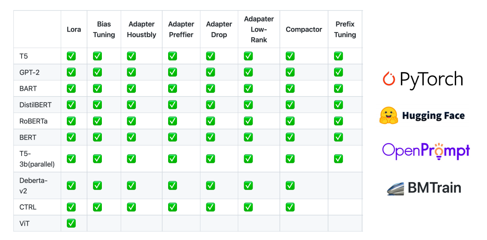

非常少的修改：

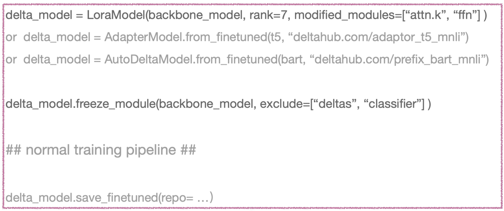

支持非常多的模型。

还是来看一个实例吧。

首先安装需要的包。

```text
!pip install transformers --quiet
!pip install datasets==2.0 --quiet
!pip install opendelta==0.2.2 --quiet

```

在开头载入需要用到的包：

```text
from dataclasses import dataclass, field
from typing import Optional, List
from transformers import Seq2SeqTrainingArguments, TrainerCallback 
from datasets import load_dataset, load_metric, concatenate_datasets
import transformers
from transformers import (
    AutoConfig,
    AutoModelForSeq2SeqLM,
    AutoTokenizer,
    HfArgumentParser,
    MBartTokenizer,
    default_data_collator,
    set_seed,
)
from datasets import load_dataset
import torch
import numpy as np
import random

```

定义模型的参数：

```text
@dataclass
class ModelArguments:
    """
    Arguments pertaining to which model/config/tokenizer we are going to fine-tune from.
    """
    model_name_or_path: str = field(
        metadata={"help": "Path to pretrained model or model identifier from huggingface.co/models"}
    )
    config_name: Optional[str] = field(
        default=None, metadata={"help": "Pretrained config name or path if not the same as model_name"}
    )
    tokenizer_name: Optional[str] = field(
        default=None, metadata={"help": "Pretrained tokenizer name or path if not the same as model_name"}
    )
    cache_dir: Optional[str] = field(
        default=None,
        metadata={"help": "Where to store the pretrained models downloaded from huggingface.co"},
    )
    use_fast_tokenizer: bool = field(
        default=True,
        metadata={"help": "Whether to use one of the fast tokenizer (backed by the tokenizers library) or not."},
    )
    model_revision: str = field(
        default="main",
        metadata={"help": "The specific model version to use (can be a branch name, tag name or commit id)."},
    )
    use_auth_token: bool = field(
        default=False,
        metadata={
            "help": "Will use the token generated when running `transformers-cli login` (necessary to use this script "
            "with private models)."
        },
    )

model_args = ModelArguments(model_name_or_path="t5-large", )

```

使用传统的方式加载模型：

```text
config = AutoConfig.from_pretrained(
    model_args.config_name if model_args.config_name else model_args.model_name_or_path,
    cache_dir=model_args.cache_dir,
    revision=model_args.model_revision,
    use_auth_token=True if model_args.use_auth_token else None,
)
config.dropout_rate = 0.0
tokenizer = AutoTokenizer.from_pretrained(
    model_args.tokenizer_name if model_args.tokenizer_name else model_args.model_name_or_path,
    cache_dir=model_args.cache_dir,
    use_fast=model_args.use_fast_tokenizer,
    revision=model_args.model_revision,
    use_auth_token=True if model_args.use_auth_token else None,
)
model = AutoModelForSeq2SeqLM.from_pretrained(
    model_args.model_name_or_path,
    from_tf=bool(".ckpt" in model_args.model_name_or_path),
    config=config,
    cache_dir=model_args.cache_dir,
    revision=model_args.model_revision,
    use_auth_token=True if model_args.use_auth_token else None,
)
model.resize_token_embeddings(len(tokenizer))

```

下面演示一下opendelta提供的可视化功能：

```text
from opendelta import Visualization
Visualization(model).structure_graph();

```


```python
root
├── shared(Embedding),lm_head(Linear) weight:[32100, 1024]
├── encoder (T5Stack)
│   ├── embed_tokens (Embedding) weight:[32100, 1024]
│   ├── block (ModuleList)
│   │   ├── 0 (T5Block)
│   │   │   └── layer (ModuleList)
│   │   │       ├── 0 (T5LayerSelfAttention)
│   │   │       │   ├── SelfAttention (T5Attention)
│   │   │       │   │   ├── q,k,v,o(Linear) weight:[1024, 1024]
│   │   │       │   │   └── relative_attention_bias (Embedding) weight:[32, 16]
│   │   │       │   └── layer_norm (T5LayerNorm) weight:[1024]
│   │   │       └── 1 (T5LayerFF)
│   │   │           ├── DenseReluDense (T5DenseActDense)
│   │   │           │   ├── wi (Linear) weight:[4096, 1024]
│   │   │           │   └── wo (Linear) weight:[1024, 4096]
│   │   │           └── layer_norm (T5LayerNorm) weight:[1024]
│   │   └── 1-23(T5Block)
│   │       └── layer (ModuleList)
│   │           ├── 0 (T5LayerSelfAttention)
│   │           │   ├── SelfAttention (T5Attention)
│   │           │   │   └── q,k,v,o(Linear) weight:[1024, 1024]
│   │           │   └── layer_norm (T5LayerNorm) weight:[1024]
│   │           └── 1 (T5LayerFF)
│   │               ├── DenseReluDense (T5DenseActDense)
│   │               │   ├── wi (Linear) weight:[4096, 1024]
│   │               │   └── wo (Linear) weight:[1024, 4096]
│   │               └── layer_norm (T5LayerNorm) weight:[1024]
│   └── final_layer_norm (T5LayerNorm) weight:[1024]
└── decoder (T5Stack)
    ├── embed_tokens (Embedding) weight:[32100, 1024]
    ├── block (ModuleList)
    │   ├── 0 (T5Block)
    │   │   └── layer (ModuleList)
    │   │       ├── 0 (T5LayerSelfAttention)
    │   │       │   ├── SelfAttention (T5Attention)
    │   │       │   │   ├── q,k,v,o(Linear) weight:[1024, 1024]
    │   │       │   │   └── relative_attention_bias (Embedding) weight:[32, 16]
    │   │       │   └── layer_norm (T5LayerNorm) weight:[1024]
    │   │       ├── 1 (T5LayerCrossAttention)
    │   │       │   ├── EncDecAttention (T5Attention)
    │   │       │   │   └── q,k,v,o(Linear) weight:[1024, 1024]
    │   │       │   └── layer_norm (T5LayerNorm) weight:[1024]
    │   │       └── 2 (T5LayerFF)
    │   │           ├── DenseReluDense (T5DenseActDense)
    │   │           │   ├── wi (Linear) weight:[4096, 1024]
    │   │           │   └── wo (Linear) weight:[1024, 4096]
    │   │           └── layer_norm (T5LayerNorm) weight:[1024]
    │   └── 1-23(T5Block)
    │       └── layer (ModuleList)
    │           ├── 0 (T5LayerSelfAttention)
    │           │   ├── SelfAttention (T5Attention)
    │           │   │   └── q,k,v,o(Linear) weight:[1024, 1024]
    │           │   └── layer_norm (T5LayerNorm) weight:[1024]
    │           ├── 1 (T5LayerCrossAttention)
    │           │   ├── EncDecAttention (T5Attention)
    │           │   │   └── q,k,v,o(Linear) weight:[1024, 1024]
    │           │   └── layer_norm (T5LayerNorm) weight:[1024]
    │           └── 2 (T5LayerFF)
    │               ├── DenseReluDense (T5DenseActDense)
    │               │   ├── wi (Linear) weight:[4096, 1024]
    │               │   └── wo (Linear) weight:[1024, 4096]
    │               └── layer_norm (T5LayerNorm) weight:[1024]
    └── final_layer_norm (T5LayerNorm) weight:[1024]

```

下面演示同一个backbone(T5)加上不同delta：

```text
from opendelta import AutoDeltaConfig, AutoDeltaModel

delta_model_spelling = AutoDeltaModel.from_finetuned("thunlp/Spelling_Correction_T5_LRAdapter_demo", backbone_model=model)
delta_model_spelling.detach()

delta_model_topic = AutoDeltaModel.from_finetuned("thunlp/Question_Topic_T5-large_Compacter", backbone_model=model)
delta_model_topic.detach()

delta_model_fact = AutoDeltaModel.from_finetuned("thunlp/FactQA_T5-large_Adapter", backbone_model=model)
delta_model_fact.detach()

```

下面定义多任务服务函数：

```text
def multitask_serving(input_text):
  # 首先进行拼写改错
    input_ids = tokenizer(input_text, return_tensors="pt").input_ids#.cuda()
    delta_model_spelling.attach()
    answers_ids =model.generate(input_ids=input_ids, max_length=20, num_beams=4)
    input_text = tokenizer.decode(answers_ids[0], skip_special_tokens=True)
    print("Correct Spelling: {}".format(input_text))
    delta_model_spelling.detach()
  # 然后传入主题分类模型
    delta_model_topic.attach()
    input_ids = tokenizer(input_text, return_tensors="pt").input_ids#.cuda()
    answers_ids =model.generate(input_ids=input_ids, max_length=20, num_beams=4)
    topic = tokenizer.decode(answers_ids[0], skip_special_tokens=True)
    delta_model_topic.detach()
    print("Question Topic: {}".format(topic))
  # 最后做问答
    delta_model_fact.attach()
    input_ids = tokenizer(input_text, return_tensors="pt").input_ids#.cuda()
    answers_ids =model.generate(input_ids=input_ids, max_length=20, num_beams=4)
    input_text = tokenizer.decode(answers_ids[0], skip_special_tokens=True)
    delta_model_fact.detach()
    print("Question Answer: {}".format(input_text))

```

多个任务的切换通过先`attach`再`detach`。

这里展示两个例子：

```text
multitask_serving("When was Beiiing olymp#ic heldd ?")
multitask_serving("What the commmon career of Newton ad eintesin?")

```

```text
Correct Spelling: When was Beijing Olympic held?
Question Topic: The question's topic is sports.
Question Answer: 2008
Correct Spelling: What was the common career of Newton and Einstein?
Question Topic: The question's topic is science.
Question Answer: Physicists

```

可以看到拼写模型把修正后的输入给了主题模型和问答模型。

如果我们想把这个预训练模型回退到没有加delta模型的模型，只要执行`detach`即可：

```text
delta_model_spelling.detach()
delta_model_topic.detach()
delta_model_fact.detach()

```
