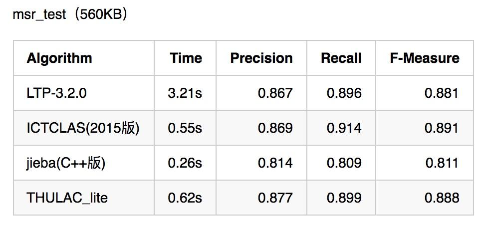

# 1.分词

## **1.概述**

分词是自然语言处理的基础，分词准确度直接决定了后面的词性标注、句法分析、词向量以及文本分析的质量。**英文语句使用空格将单词进行分隔**，除了某些特定词，如how many，New York等外，大部分情况下不需要考虑分词问题。但**中文不同，天然缺少分隔符**，需要读者自行分词和断句。故在做中文自然语言处理时，需要先进行分词。

## **2.中文分词难点**

中文分词不像英文那样，天然有空格作为分隔。而且中文词语组合繁多，分词很容易产生歧义。因此中文分词一直以来都是NLP的一个重点，也是一个难点。难点主要集中在**分词标准，切分歧义和未登录词**三部分。

### 2.1 **分词标准**

比如人名，有的算法认为姓和名应该分开，有的认为不应该分开。这需要制定一个相对统一的标准。又例如“花草”，有的人认为是一个词，有的人认为应该划分开为两个词“花/草”。某种意义上，**中文分词可以说是一个没有明确定义的问题**。

### 2.2 **切分歧义**

不同的切分结果会有不同的含义，这又包含如下几种情况

1. **组合型歧义**：分词粒度不同导致的不同切分结果。比如“中华人民共和国”，粗粒度的分词结果为“中华人民共和国”，细粒度的分词结果为“中华/人民/共和国”。这种问题需要根据使用场景来选择。在文本分类，情感分析等文本分析场景下，粗粒度划分较好。而在搜索引擎场景下，为了保证recall，细粒度的划分则较好。jieba分词可以根据用户选择的模式，输出粗粒度或者细粒度的分词结果，十分灵活。 另外，有时候汉字串AB中，AB A B可以同时成词，这个时候也容易产生组合型歧义。比如“他/将/来/网商银行”，“他/将来/想/应聘/网商银行”。这需要通过整句话来区分。 组合型歧义描述的是AB A B均可以同时成词的汉字串，它是可以预测的，故也有专家称之为“固有型歧义”
2. **交集型歧义**：不同切分结果共用相同的字，前后组合的不同导致不同的切分结果。比如“商务处女干事”，可以划分为“商务处/女干事”，也可以划分为“商务/处女/干事”。这也需要通过整句话来区分。交集型歧义前后组合，变化很多，难以预测，故也有专家称之为“偶发型歧义”。
3. **真歧义**：本身语法或语义没有问题，即使人工切分也会产生歧义。比如“下雨天留客天天留人不留”，可以划分为“下雨天/留客天/天留/人不留”，也可以划分为“下雨天/留客天/天留人不/留”。此时通过整句话还没法切分，只能通过上下文语境来进行切分。如果是不想留客，则切分为前一个。否则切分为后一个。

有专家统计过，中文文本中的切分歧义出现频次为1.2次/100汉字，其中交集型歧义和组合型歧义占比为12：1。而对于真歧义，一般出现的概率不大。

### 2.3 **未登录词**

也叫新词发现，或者生词，未被词典收录的词。未登录词分为如下几种类型

1. 新出现的词汇，比如一些网络热词，如“超女”“给力”等
2. 专有名词，主要是人名 地名 组织机构，比如“南苏丹”“特朗普” “花呗”“借呗”等。
3. 专业名词和研究领域词语，比如“苏丹红” “禽流感”
4. 其他专有名词，比如新出现的电影名、产品名、书籍名等。

**未登录词对于分词精度的影响远远超过歧义切分**。**未登录词识别难度也很大**，主要原因有

1. 未登录词增长速度往往比词典更新速度快很多，因此很难利用更新词典的方式解决未登录词问题。不过词典越大越全，分词精度也会越高。因此一个大而全的词典还是相当重要的。
2. 未登录词都是由普通词汇构成，长度不定，也没有明显的边界标志词
3. 未登录词还有可能与上下文中的其他词汇构成交集型歧义。
4. 未登录词中还有可能夹杂着英语字母等其他符号，这也带来了很大难度。比如“e租宝”。

对于词典中不包含的未登录词，无法基于字符串匹配来进行识别。此时**基于统计的分词算法就可以大显身手了**，**jieba分词采用了HMM隐马尔科夫模型和viterbi算法来解决未登录词问题**。下一篇文章我们会详细分析这个算法过程。

## **3.中文分词算法**

当前的分词算法主要分为两类，**基于词典的规则匹配方法**，和**基于统计的机器学习方法**。

### **3.1 基于词典的分词算法**

基于词典的分词算法，本质上就是**字符串匹配**。将待匹配的字符串基于一定的算法策略，和一个足够大的词典进行字符串匹配，如果匹配命中，则可以分词。根据不同的匹配策略，又分为**正向最大匹配法，逆向最大匹配法，双向匹配分词，全切分路径选择**等。

**最大匹配法**主要分为三种：

1. **正向最大匹配法**，从左到右对语句进行匹配，匹配的词越长越好。比如“商务处女干事”，划分为“商务处/女干事”，而不是“商务/处女/干事”。这种方式切分会有歧义问题出现，比如“结婚和尚未结婚的同事”，会被划分为“结婚/和尚/未/结婚/的/同事”。
2. **逆向最大匹配法**，从右到左对语句进行匹配，同样也是匹配的词越长越好。比如“他从东经过我家”，划分为“他/从/东/经过/我家”。这种方式同样也会有歧义问题，比如“他们昨日本应该回来”，会被划分为“他们/昨/日本/应该/回来”。
3. **双向匹配分词**，则同时采用正向最大匹配和逆向最大匹配，选择二者分词结果中**词数较少者**。但这种方式同样会产生歧义问题，比如“他将来上海”，会被划分为“他/将来/上海”。由此可见，词数少也不一定划分就正确。

**全切分路径选择**，将所有可能的切分结果全部列出来，从中选择最佳的切分路径。分为两种选择方法

1. **n最短路径方法**。将所有的切分结果组成有向无环图，切词结果作为节点，词和词之间的边赋予权重，找到权重和最小的路径即为最终结果。比如可以通过词频作为权重，找到一条总词频最大的路径即可认为是最佳路径。
2. **n元语法模型**。同样采用n最短路径，只不过路径构成时会考虑词的上下文关系。一元表示考虑词的前后一个词，二元则表示考虑词的前后两个词。然后根据语料库的统计结果，找到概率最大的路径。

### **3.2 基于统计的分词算法**

基于统计的分词算法，本质上是一个序列标注问题。将语句中的字，**按照他们在词中的位置进行标注**。标注主要有：B（词开始的一个字），E（词最后一个字），M（词中间的字，可能多个），S（一个字表示的词）。例如“网商银行是蚂蚁金服微贷事业部的最重要产品”，标注后结果为“BMMESBMMEBMMMESBMEBE”，对应的分词结果为“网商银行/是/蚂蚁金服/微贷事业部/的/最重要/产品”。

基于统计分析方法，得到序列标注结果，就可以得到分词结果了。这类算法基于机器学习或者现在火热的深度学习，主要有HMM，CRF，SVM，以及深度学习等。

1. **HMM，隐马尔科夫模型**。隐马尔科夫模型在机器学习中应用十分广泛，它包含观测序列和隐藏序列两部分。对应到NLP中，语句是观测序列，而序列标注结果是隐藏序列。任何一个HMM都可以由一个五元组来描述：观测序列，隐藏序列，隐藏态起始概率，隐藏态之间转换概率（转移概率），隐藏态表现为观测值的概率（发射概率）。其中起始概率，转移概率和发射概率可以通过大规模语料统计来得到。从隐藏态初始状态出发，计算下一个隐藏态的概率，并依次计算后面所有的隐藏态转移概率。序列标注问题就转化为了求解概率最大的隐藏状态序列问题。**jieba分词中使用HMM模型来处理未登录词**问题，并利用viterbi算法来计算观测序列（语句）最可能的隐藏序列（BEMS标注序列）。
2. **CRF，条件随机场**。也可以描述输入序列和输出序列之间关系。只不过它是基于条件概率来描述模型的。详细的这儿就不展开了。
3. **深度学习**。将语句作为输入，分词结果作为标注，可以进行有监督学习。训练生成模型，从而对未知语句进行预测。

## **4.分词质量和性能**

中文分词对于自然语言处理至关重要，评价一个分词引擎性能的指标主要有分词准确度和分词速度两方面。分词准确度直接影响后续的词性标注，句法分析，文本分析等环节。分词速度则对自然语言处理的实时性影响很大。下图为几种常用分词引擎在准确度和速度方面的对比。

由上可见，想要做准确度很高的通用型分词引擎是多么的困难。如果对准确度要求很高，可以尝试开发特定领域的分词引擎。比如专门针对金融领域。同时从图中可见，作为一款开源的通用型分词引擎，jieba分词的准确度和速度都还是不错的。后面会详细讲解jieba分词的用法及其原理。

## **5.总结**

中文分词是中文自然语言处理中的一个重要环节，为后面的词向量编码，词性标注，句法分析以及文本分析打下了坚实的基础。同时，由于中文缺少空格等分隔符，并且汉字间的组合特别多，很容易产生歧义，这些都加大了中文分词的难度。基于词典的字符串匹配算法和基于统计的分词算法，二者各有优缺点，我们可以考虑结合使用。随着深度学习的兴起，我们可以考虑利用深度学习来进行序列标注和中文分词。
