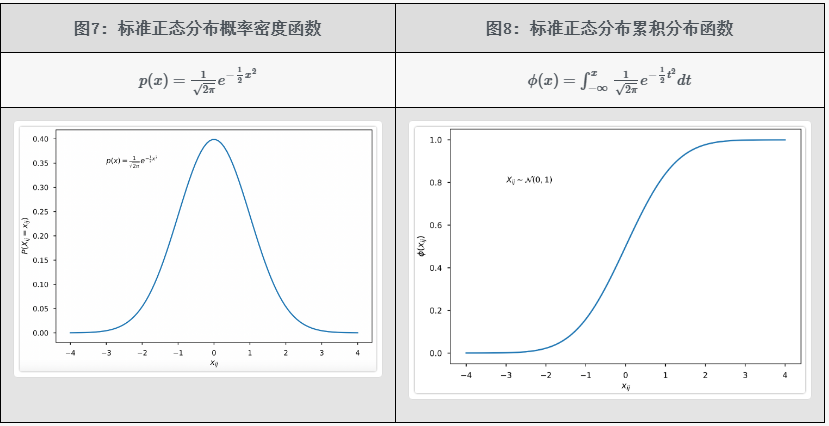
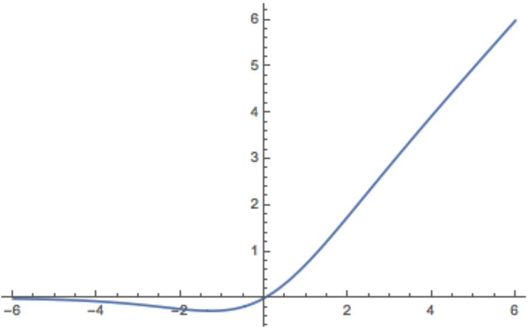

# 1.激活函数

### 1.激活函数作用

神经网络是线性的，无法解决非线性的问题，加入激活函数就是给模型引入非线性能力；

不同的激活函数，特点和作用不同：

- `Sigmoid`和`tanh`的特点是将输出限制在`(0,1)`和`(-1,1)`之间，说明`Sigmoid`和`tanh`适合做概率值的处理，例如LSTM中的各种门；而`ReLU`就不行，因为`ReLU`无最大值限制，可能会出现很大值。
- `ReLU`适合用于深层网络的训练，而`Sigmoid`和`tanh`则不行，因为它们会出现梯度消失。

### 2.梯度爆炸和梯度消失

模型中的梯度爆炸和梯度消失问题：

1. 激活函数导致的梯度消失，像 `sigmoid `和 `tanh` 都会导致梯度消失；
2. 矩阵连乘也会导致梯度消失，这个原因导致的梯度消失无法通过更换激活函数来避免。直观的说就是在反向传播时，梯度会连乘，当梯度都小于1.0时，就会出现梯度消失；当梯度都大于1.0时，就会出现梯度爆炸。

如何解决梯度爆炸和梯度消失问题：

1. 上述第一个问题只需要使用像 ReLU 这种激活函数就可以解决；
2. 上述第二个问题没有能够完全解决的方法，目前有一些方法可以很大程度上进行缓解该问题，比如：对梯度做截断解决梯度爆炸问题、残差连接、normalize。由于使用了残差连接和 normalize 之后梯度消失和梯度爆炸已经极少出现了，所以目前可以认为该问题已经解决了。

### 3.Sigmoid

Sigmoid函数公式：

$$
\sigma(z)=\frac{1}{1+e^{-z}}
$$

导数公式：

$$
\sigma^{\prime}(z)=\sigma(z)(1-\sigma(z))
$$

优点：

- 平滑，易于求导；
- 取值范围是`(0, 1)`，可直接用于求概率值的问题或者分类问题；比如 LSTM 中的门，二分类或者多标签分类问题；

缺点：

- **计算量大**，包含幂运算，以及除法运算；
- sigmoid 导数的取值范围是 `[0, 0.25]`，最大值都是小于 1 的，反向传播时又是"链式传导"，**经过几次相乘之后很容易就会出现梯度消失的问题**；
- **sigmoid 的输出的均值不是0**（即zero-centered），这会导致当前层接收到上一层的非0均值的信号作为输入，随着网络的加深，会改变数据的原始分布；

### 4.Tanh

Tanh的函数公式为：

$$
\begin{aligned} \tanh (z) & =\frac{e^{z}-e^{-z}}{e^{z}+e^{-z}} \\ & =\frac{2}{1+e^{-2 z}}-1\end{aligned}
$$

> 从上述公式的第二行可以看出，tanh 函数可以由 sigmoid 函数经过平移和拉伸得到。tanh 函数的取值范围是`（-1, 1）`。

导数公式

$$
\tanh (x)^{\prime}=\frac{\left(e^{x}+e^{-x}\right)^{2}-\left(e^{x}-e^{-x}\right)^{2}}{\left(e^{x}+e^{-x}\right)^{2}}=1-(\tanh (x))^{2}
$$

tanh 函数可以理解为是**基于 sigmoid 函数的一种改进的激活函数**，所以对于 sigmoid 函数的缺点，它能够解决一部分。但是 tanh 函数依然有着不少的缺点。tanh 函数的特点如下：

- 它的输出范围是`(-1, 1)`，解决了 sigmoid 函数输出的均值不是0（zero-centered）的问题；
- tanh 的导数取值范围是`(0, 1)`，可以看出其在反向传播的"链式传导"过程中的梯度消失问题要比 sigmoid 函数要好一些，但是其依然存在着梯度消失问题；
- **幂运算依然存在，计算量比较大**；

### 5.ReLU系列

#### 5.1 ReLU

`ReLU `全称为 Rectified Linear Unit，即修正线性单元函数。该函数的公式比较简单，相应的公式和图像如下表所示。

相比于 `sigmoid`、`tanh `这两个激活函数，`ReLU `激活函数的优缺点如下：

- 当 `z>0` 时，ReLU 激活函数的导数恒为常数1，这就避免了 sigmoid 和 tanh 会在神经网络层数比较深的时候出现的梯度消失的问题；
- 计算复杂度低，不再含有幂运算，只需要一个阈值就能够得到其导数；
- 经过实际实验发现，**使用 ReLU 作为激活函数，模型收敛的速度比 sigmoid 和 tanh 快**；
- 当 `z<0`时，ReLU 激活函数的导数恒为常数0，这既带来了一些有利的方面，也导致了一些坏的方面，分别进行描述。
  - 有利的方面：在深度学习中，目标是从大量数据中学习到关键特征，也就是把密集矩阵转化为稀疏矩阵，保留数据的关键信息，去除噪音，这样的模型就有了鲁棒性。ReLU 激活函数中将 `z<0`的部分置为0，就是产生稀疏矩阵的过程。
  - 坏的方面：将 `z<0`的部分梯度直接置为0会导致 Dead ReLU Problem(神经元坏死现象)。**可能会导致部分神经元不再对输入数据做响应，无论输入什么数据，该部分神经元的参数都不会被更新**。（这个问题是一个非常严重的问题，后续不少工作都是在解决这个问题）
- ReLU 有可能会导致梯度爆炸问题，解决方法是梯度截断；
- ReLU 的输出不是 0 均值的，这个和 sigmoid 类似。（后续的优化工作 ELU 在该问题上解决的比较好，ELU 的输出是近似为0的）

#### 5.2 Leaky ReLU

为了解决 ReLU 的 Dead ReLU 问题，提出了 渗漏整流线性单元(Leaky ReLU)，该方法是 ReLU 的一个变体。其在`z>0`的部分与ReLU一样保持不变；在`z<0`的部分，采用一个非常小的斜率0.01，其公式如下：

$$
Leaky \operatorname{ReLU}(z)=\left\{\begin{array}{ll}0.01 z & \text { if } z \leqslant 0 \\ z & \text { if } z>0\end{array}\right.
$$

其图像如下所示：

该方法是 ReLU 的一个变体，能够在一定程度上解决 Dead ReLU 问题，但是该方法的缺点是**效果并不稳定**，所以实际实验中使用该方法的并不多。

#### 5.3 PReLU, RReLU

PReLU 的全称为 Parametric Relu；PReLU 的全称为 Random ReLU。

这两个方法和 Leaky ReLU 类似，都是 ReLU 的变体。也都是为了解决 Dead ReLU 问题而提出来的。

Leaky ReLU 是在`z<0`时，设置了一个较小的常数0.01作为斜率。由于这种常数值的斜率并不好，所以 PReLU 提出了可学习的斜率，RReLU 提出了随机的斜率，两者具体的公式如下。

PReLU的公式如下，这里的$\alpha$是可学习的：

$$
\operatorname{PReLU}(z)=\left\{\begin{array}{ll}\alpha \cdot z & \text { if } z \leqslant 0 \\ z & \text { if } z>0\end{array}\right.
$$

RReLU 的公式如下，这里的 $\alpha$是从一个高斯分布中随机产生的，在训练过程中每次这个 $\alpha$ 都是不相同的；在推理时会将这个$\alpha$都是不相同的；在推理时会将这个

$$
\operatorname{RReLU}(z)=\left\{\begin{array}{ll}\alpha \cdot z & \text { if } z \leqslant 0 \\ z & \text { if } z>0\end{array}\right.
$$

PReLU 和 RReLU 的图像如下所示：

#### 5.4 ELU（指数线性单元）

ELU 的提出也解决了 ReLU 的问题。与 ReLU 相比，ELU 有负值，这会使激活的平均值接近零，让模型学习得更快。

$$
\mathrm{g}(x)=\operatorname{ELU}(x)=\left\{\begin{aligned} x, & x>0 \\ \alpha\left(\mathrm{e}^{x}-1\right), & x \leqslant 0\end{aligned}\right.
$$

其中 $\alpha$不是固定的，是通过反向传播学习出来的。ELU的一个小问题是需要exp计算，运算量会更大一些。

- 融合了sigmoid和ReLU，左侧具有软饱和性，右侧无饱和性。
- 右侧线性部分使得ELU能够缓解梯度消失，而左侧软饱能够让ELU对输入变化或噪声更鲁棒。
- ELU的输出均值接近于零，所以收敛速度更快。

### 6.GeLU

> 出自2016年的论文《Gaussian Error Linear Units (GELUs)》

先描述一下 GELU 这个激活函数直觉上是基于一个什么思路设计出来的。然后再具体看其如何近似求解、如何代码实现。

#### 6.1 介绍

先看一下 ReLU 激活函数是怎样做的，该函数中包含两种映射：一个是恒等映射（identity mapping），当输入值大于零时就是恒等映射；一个是置零映射（zero mapping），当输入值小于等于零时就是置零映射。

参考 ReLU 激活函数，设计另外一个包含恒等映射和置零映射的激活函数，并且参考 ReLU 函数来看，新激活函数应该有如下性质：

1. 在输入 `x` 满足某些条件时，为恒等映射；
2. 在输入 `x` 满足另外一些条件时，为置零映射；
3. 在输入 `x` 是一个较大的正值时，更希望为恒等映射；在输入 `x` 为一个较小的负值时，更希望是一个置零映射；

以上就是想要新设计的激活函数的性质。

下面的图7和图8是标准正态分布的概率密度函数和累积分布函数的图像。接下来根据下图8中的累积分布函数设计一个新的函数。

符号定义：输入值用 $x$ 表示，$ϕ(⋅)$表示下图8中的正态分布的累积分布函数，$f(⋅)$表示新设计的函数。

设计的新函数：给定输入值 $x$，函数 $f(x)$的输出值以 $ϕ(x)$的概率采用恒等映射，以 $1−ϕ(x)$的概率采用置零映射。也就是下述公式：

$$
\begin{aligned} f(x) & =x \cdot \phi(x)+0 \cdot(1-\phi(x)) \\ & =x \cdot \phi(x)\end{aligned}
$$

然后看一下，新设计的这个公式是否满足上述的激活函数性质。前两条是肯定满足的，主要看一下第3条性质：

- 当输入 $x$ 是一个较大的正值时，从图8中可以看出 $ϕ(x)$的函数图像逐渐趋近于1，由于函数 $f(x)$的输出值以 $ϕ(x)$的概率采用恒等映射，所以有接近于1的概率采用恒等映射；
- 当输入 $x$ 是一个较小的负值时，$ϕ(x)$趋近于0，由于函数 $f(x)$以 $1−ϕ(x)$的概率采用置零映射，所以有接近于1的概率采用置零映射；

可以看出新设计的这个函数是满足上述激活函数的性质的。

为了更直观描述设计该函数时的直觉，上述都是采用图8进行描述的，上述公式如果使用图7中的概率密度函数就是如下形式：

$$
\begin{aligned} f(x) & =x \cdot p(X<x)+0 \cdot(1-p(X<x)) \\ & =x \cdot p(X<x)\end{aligned}
$$

其中$x$表示实际的输入值，$X$表示随机变量。到此就得到了GELU的常见形式，公式如下所示：

$$
G E L U=x \cdot p(X<x)=x \cdot \phi(x)
$$

> 这里描述的设计 GELU 函数的直觉思路是非常简化的版本，只是为了易于理解。实际在设计这个函数时还需要考虑更多的因素，比如该函数的那几条性质和 ReLU 很像，已经有了 ReLU 为什么还要设计这个函数，这个函数在理论上是否能够解决 ReLU 的存在的 Dead ReLU 等问题；

#### 6.2 函数及导数

GeLU 公式为：

$$
G E L U=x \cdot \phi(x)
$$

使用该函数作为激活函数时，需要求解其导数。对其求导可得：

$$
\begin{aligned} \frac{d}{d x} G E L U & =\phi(x)+x \frac{d}{d x} \phi(x) \\ & =\phi(x)+x \cdot p(X=x)\end{aligned}
$$

其中$X$是随机变量，$p(X=x)$是图7中的标准正态分布概率密度函数中，随机变量取值为$x$时的值。

GELU 函数及其导数的图像如下所示。可以看出其函数图像和 ReLU 非常相似，其导数图像也和 ReLU 的导数图像非常相似，不过该图像是连续的。

GELU 激活函数的优缺点：

- 从其函数图像可以看出，在负值区域，不再全为0，这解决了 Dead ReLU 问题；
- GELU 函数是处处连续、光滑可导的；

#### 6.3 精确计算

对于 GeLU 的加速计算有两种方法。

第一种方法是精确求解。有一个函数为 Gauss Error function (gef)，由于使用率非常高所以在常见的库（比如TensorFlow、PyTorch）中都有针对该函数的优化，该函数的公式如下。

$$
\operatorname{erf}(y)=\frac{2}{\sqrt{\pi}} \int_{0}^{y} e^{-t^{2}} d t
$$

所以如果能够先求解出$erf(\cdot)$，再由该函数求解出 $\phi(x)$，那么可以加快计算。下面省略具体的推导过程，直接给出计算公式：

$$
\phi(x)=\frac{1+\operatorname{erf}\left(\frac{x}{\sqrt{2}}\right)}{2}
$$

另一种方法是不精确求解，而是求解其近似值。为了加速计算，还可以使用近似计算的方式。GELU 的近似公式如下所示：

$$
G E L U=0.5 * x\left(1+\tanh \left[\sqrt{\frac{2}{\pi}}\left(x+0.044715 x^{3}\right)\right]\right)
$$

### 7.Swish

> 出自2017年的论文《Searching for Activation Functions》

该激活函数的公式为：

$$
f(x)=x \cdot \sigma(x)
$$

Swish导数：

$$
\begin{array}{l}f^{\prime}(x) \\ =\sigma(x)+x \cdot \sigma(x) \cdot(1-\sigma(x)) \\ =x \cdot \sigma(x)+\sigma(x)(1-x \cdot \sigma(x)) \\ =f(x)+\sigma(x) \cdot(1-f(x))\end{array}
$$

该激活函数的图像为：

Swish特点：

- 和ReLU一样，没有上边界，因此不会出现梯度饱和现象
- 有下边界，可以产生更强的正则化效果（x左半轴慢慢趋近于0）
- 非单调
- 处处连续且可到，更容易训练

关于正则化效果：x轴越靠近左半轴，纵坐标的值越小，甚至接近于0，如果x值是-10，那么经过激活之后的值接近于0，那么就可以一定程度上过滤掉一部分信息，起到[正则化](https://so.csdn.net/so/search?q=正则化\&spm=1001.2101.3001.7020 "正则化")的效果。

### 8.GLU

PaLM 和 LLaMA 中都使用 SwiGLU 替换了 FFN

> 出自2017年的论文 [Language Modeling with Gated Convolutional Networks](https://arxiv.org/pdf/1612.08083.pdf "Language Modeling with Gated Convolutional Networks")

GLU 全称为 Gated Linear Unit，即**门控线性单元函数**。

参考ReLU激活函数，激活函数GLU的公式为如下公式的形式

$$
\operatorname{GLU}(x)=x \otimes \sigma(g(x))
$$

这里有一个新符号 $g(x)$表示的是向量$x$经过一层MLP或者卷积，$⊗$表示两个向量逐元素相乘，$σ$ 表示sigmoid函数。

当$\sigma(g(x))$趋近于0时表示对$x$进行阻断，当$\sigma(g(x))$趋近于1时表示允许$x$通过，以此实现门控激活函数的效果。
