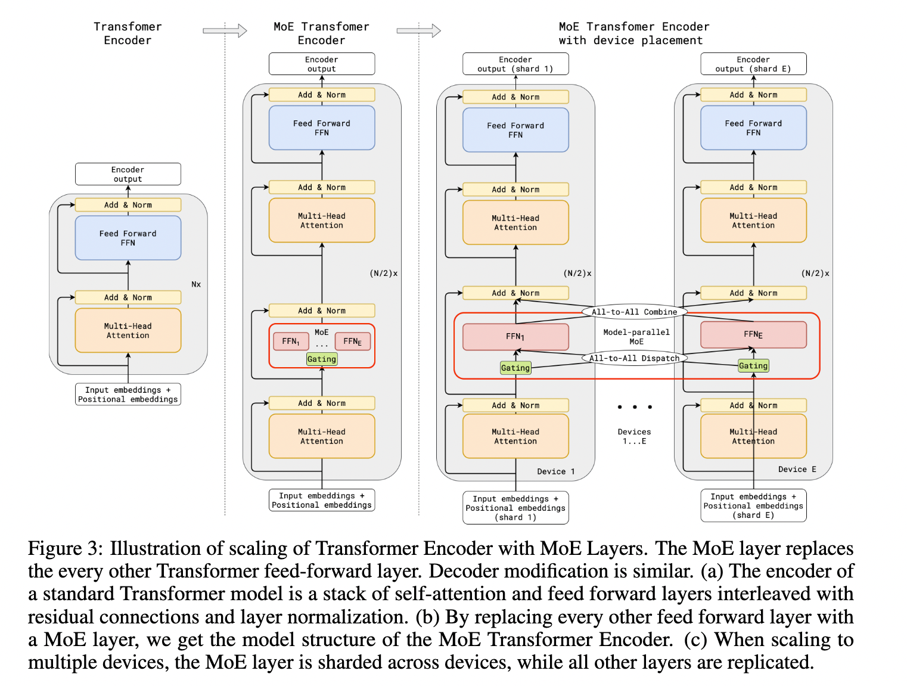
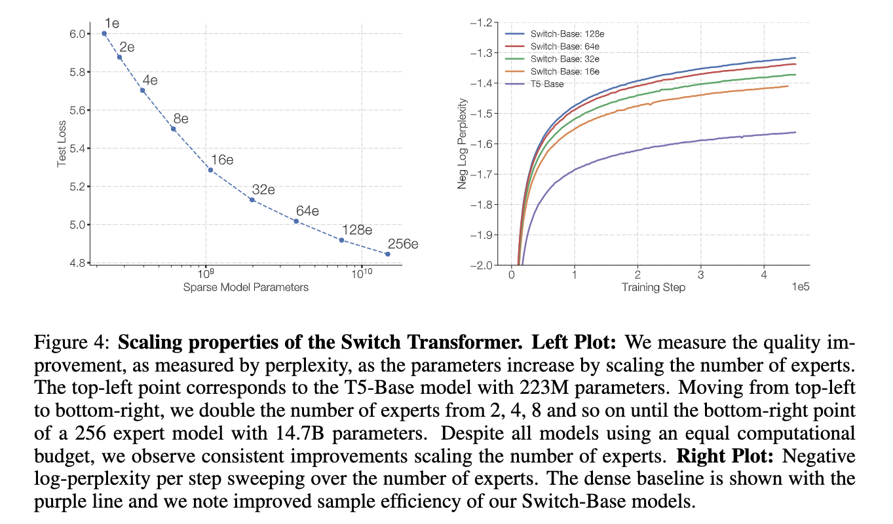
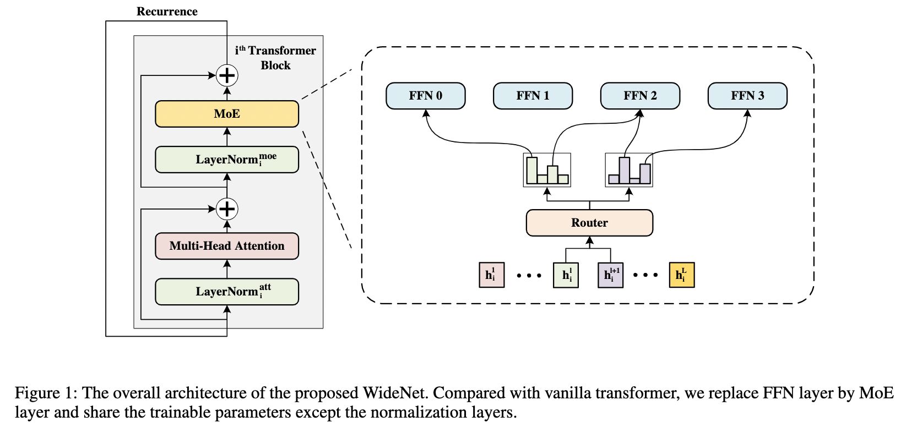
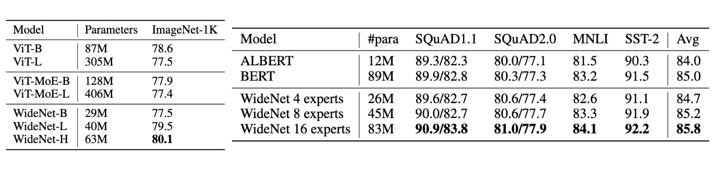
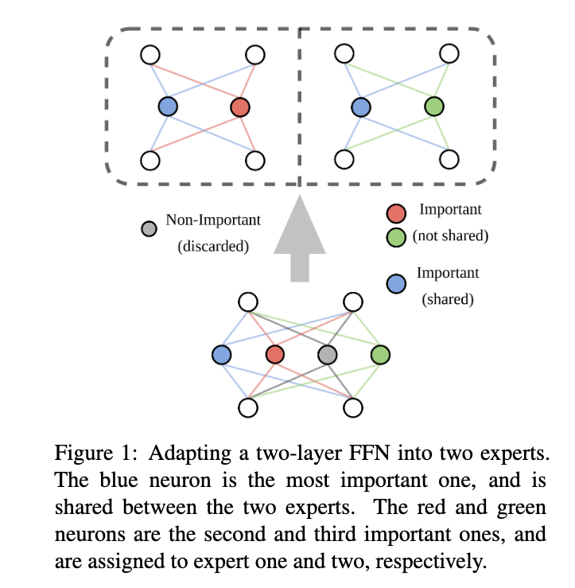
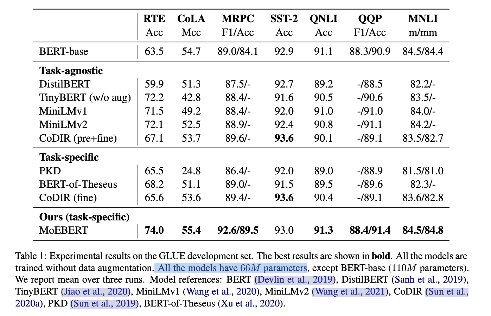
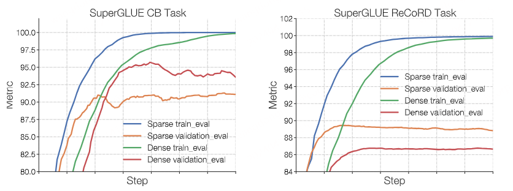

# 2.MoE经典论文简牍

参考资料：

- [MoE (Mixture-of-Experts) 经典文章简读](<https://beyondguo.github.io/paper_notes/notes/MoE——Mixture of Experts经典论文一览.html#开创工作> "MoE (Mixture-of-Experts) 经典文章简读")
- [Mixture-of-Experts (MoE) 经典论文一览](https://zhuanlan.zhihu.com/p/542465517 "Mixture-of-Experts (MoE) 经典论文一览")

## 1.开创工作

### 1.1 Adaptive mixtures of local experts, Neural Computation'1991

- 期刊/会议：Neural Computation (1991)
- 论文链接：[https://readpaper.com/paper/2150884987](https://readpaper.com/paper/2150884987 "https://readpaper.com/paper/2150884987")
- 代表性作者：Michael Jordan, Geoffrey Hinton

这是大多数MoE论文都引用的最早的一篇文章，发表于1991年，作者中有两个大家熟知的大佬：Michael Jordan 和 Geoffrey Hinton。

提出了一种新的监督学习过程，**一个系统中包含多个分开的网络，每个网络去处理全部训练样本的一个子集**。这种方式可以看做是把多层网络进行了**模块化的转换**。

假设我们已经知道数据集中存在一些天然的子集（比如来自不同的domain，不同的topic），那么用单个模型去学习，就会受到很多干扰（interference），导致学习很慢、泛化困难。这时，我们可以使用多个模型（即专家，expert）去学习，使用一个门网络（gating network）来决定每个数据应该被哪个模型去训练，这样就可以减轻不同类型样本之间的干扰。

其实这种做法，也不是该论文第一次提出的，更早就有人提出过类似的方法。对于一个样本 c，第 i 个 expert 的输出为 $\mathbf{o}_i^c$，理想的输出是 $\mathbf{d}^c$，那么损失函数就这么计算：

$$
\mathrm{E}^{\mathrm{c}}=\left\|\mathbf{d}^{\mathrm{c}}-\sum_{\mathrm{i}} \mathrm{p}_{\mathrm{i}}^{\mathrm{c}} \mathbf{o}_{\mathrm{i}}^{\mathrm{c}}\right\|^{2}
$$

其中 $p_i^c$ 是 gating network 分配给每个 expert 的权重，相当于多个 expert 齐心协力来得到当前样本 c 的输出。

这是一个很自然的设计方式，但是存在一个问题——**不同的 expert 之间的互相影响会非常大**，一个expert的参数改变了，其他的都会跟着改变，即所谓牵一发而动全身。这样的设计，最终的结果就是一个样本会使用很多的expert来处理。于是，这篇文章设计了一种新的方式，**调整了一下loss的设计，来鼓励不同的expert之间进行竞争**：

$$
E^{\mathrm{c}}=\sum_{i} p_{i}^{c}\left\|\mathbf{d}^{c}-\mathbf{o}_{i}^{\mathrm{c}}\right\|^{2}
$$

就是**让不同的 expert 单独计算 loss，然后在加权求和得到总体的 loss**。这样的话，每个专家，都有独立判断的能力，而不用依靠其他的 expert 来一起得到预测结果。下面是一个示意图：

在这种设计下，我们将 experts 和 gating network 一起进行训练，最终的系统就会倾向于让一个 expert 去处理一个样本。

上面的**两个 loss function，其实长得非常像，但是一个是鼓励合作，一个是鼓励竞争**。这一点还是挺启发人的。

论文还提到另外一个很启发人的 trick，就是上面那个损失函数，作者在实际做实验的时候，用了一个变体，使得效果更好：

$$
Original : \mathrm{E}^{\mathrm{c}}=\sum_{i} \mathrm{p}_{\mathrm{i}}^{\mathrm{c}}\left\|\mathbf{d}^{\mathrm{c}}-\mathbf{o}_{\mathrm{i}}^{\mathrm{c}}\right\|^{2}
$$

$$
Modified : \mathrm{E}^{\mathrm{c}}=-\log \sum_{\mathrm{i}} \mathrm{p}_{\mathrm{i}}^{\mathrm{C}} \mathrm{e}^{-\frac{1}{2}\left\|\mathrm{~d}^{\mathrm{c}}-\mathbf{o}_{\mathrm{i}}^{\mathrm{c}}\right\|^{2}}
$$

对比一下可以看出，在计算每个 expert 的损失之后，**先把它给指数化了再进行加权求和，最后取了log**。这也是一个我们在论文中经常见到的技巧。这样做有什么好处呢，我们可以对比一下二者在反向传播的时候有什么样的效果，使用$  E^c  $对 第 i 个 expert 的输出求导，分别得到：

$$
original ~derivative: \frac{\partial E^{c}}{\partial \mathbf{o}_{i}^{c}}=-2 p_{i}^{c}\left(\mathbf{d}^{c}-\mathbf{o}_{i}^{c}\right)
$$

$$
new~derivative: \frac{\partial E^{c}}{\partial \mathbf{o}_{i}^{c}}=-\left[\frac{p_{i}^{c} e^{-\frac{1}{2}\left\|\mathbf{d}^{c}-\mathbf{o}_{i}^{c}\right\|^{2}}}{\sum_{j} p_{j}^{c} e^{-\frac{1}{2}\left\|\mathbf{d}^{c}-\mathbf{o}_{j}^{c}\right\|^{2}}}\right]\left(\mathbf{d}^{c}-\mathbf{o}_{i}^{c}\right)
$$

可以看到，**前者的导数，只会跟当前 expert 有关，但后者则还考虑其他 experts 跟当前 sample c 的匹配程度**。换句话说，如果当前 sample 跟其他的 experts 也比较匹配，那么 $E^c $对 第 i 个 expert 的输出的导数也会相对更小一下。（其实看这个公式，跟我们现在遍地的对比学习loss真的很像！很多道理都是相通的）

以上就是这篇文章的理论部分，其实很简单，但它提到的MoE的设计，启发了后续无数的工作。

接下来一篇则是时隔20多年后的另一篇经典论文，可能也是大家更熟悉的MoE工作。

### 1.2 Outrageously Large Neural Networks: The Sparsely-Gated Mixture-of-Experts Layer, ICLR'17

- 期刊/会议：ICLR'17
- 论文链接：[https://readpaper.com/paper/2952339051](https://readpaper.com/paper/2952339051 "https://readpaper.com/paper/2952339051")
- 代表性作者：Quoc Le, Geoffrey Hinton, Jeff Dean

在 2010 至 2015 年间，两个独立的研究领域为混合专家模型 (MoE) 的后续发展做出了显著贡献：

1. **组件专家**：在传统的 MoE 设置中，整个系统由一个门控网络和多个专家组成。在支持向量机 (SVMs) 、高斯过程和其他方法的研究中，MoE 通常被视为整个模型的一部分。然而，Eigen、Ranzato 和 Ilya 的研究 探索了将 MoE 作为更深层网络的一个组件。这种方法**允许将 MoE 嵌入到多层网络中的某一层，使得模型既大又高效**。
2. **条件计算（Conditional Computation）**：传统的神经网络通过每一层处理所有输入数据。在这一时期，Yoshua Bengio 等研究人员开始探索**基于输入 token 动态激活或停用网络组件**的方法。

在 2017 年，Shazeer 等人将这一概念应用于 137B 的 LSTM 。通过引入稀疏性，这项工作在保持极高规模的同时实现了快速的推理速度。在牺牲极少的计算效率的情况下，把模型规模提升**1000多倍**。

这篇文章，从title上就可以看出来它的背景和目的——希望做出极大的神经网络。在此之前，有很多 **conditional computational** 的工作，在理论上可以在有限的计算成本内把模型做的非常大，但是那些方法在具体实现的时候，有各种各样的问题。这篇文章提出了 Sparsely-Gated Mixture-of-Experts layer ，声称终于解决了传统 conditional computational 的问题，在牺牲极少的计算效率的情况下，把模型规模提升1000多倍。

#### （1）Sparsely-Gated Mixture-of-Experts layer

跟1991年那个工作对比，这里的MoE主要有两个区别：

- **Sparsely-Gated**：不是所有expert都会起作用，而是极少数的expert会被使用来进行推理。这种稀疏性，也使得我们可以使用海量的experts来把模型容量做的超级大。
- **token-level**：前面那个文章，是 sample-level 的，即不同的样本，使用不同的experts，但是这篇则是 token-level 的，一个句子中不同的token使用不同的experts。

这篇文章是在RNN的结构上加入了MoE layer：

如图所示，每个token对应的position，都会有一个MoE Layer，每个MoE layer中包含了一堆的experts，每个expert都是一个小型的FFN，还有一个gating network会根据当前position的输入，选择少数几个expert来进行计算。

#### （2）Gating Network

设 $G(x)$ 和 $E_i(x) $分别是 gating network 和第 i 个 expert 的输出，那么对于在当前position的输入x，输出就是所有 experts 的加权和：

$$
\mathrm{y}=\sum_{\mathrm{i}=1}^{\mathrm{n}} \mathrm{G}(\mathrm{x})_{\mathrm{i}} \mathrm{E}_{\mathrm{i}}(\mathrm{x})
$$

(跟第一篇论文的第一个公式类似)

但是这里我们可能有上千个 experts，如果每个都算的话，计算量会非常大，所以这里的一个关键就是希望 G(x) 的输出是稀疏的，只有部分的 experts 的权重是大于 0 的，其余等于 0 的 expert 直接不参与计算。

首先看传统的 gating network 如何设计：

$$
\mathrm{G}_{\sigma}(\mathrm{x})=\operatorname{Softmax}\left(\mathrm{x} \cdot \mathrm{W}_{\mathrm{g}}\right)
$$

然后，作者**加入了 sparsity 和 noise**：

$$
\mathrm{G}(\mathrm{x})=\operatorname{Softmax}(\operatorname{KeepTopK}(\mathrm{H}(\mathrm{x}), \mathrm{k}))
$$

$$
\mathrm{H}(\mathrm{x})_{\mathrm{i}}=\left(\mathrm{x} \cdot \mathrm{W}_{\mathrm{g}}\right)_{\mathrm{i}}+\operatorname{StandardNormal}() \cdot \operatorname{Softplus}\left(\left(\mathrm{x} \cdot \mathrm{W}_{\text {noise }}\right)_{\mathrm{i}}\right)
$$

$$
\operatorname{KeepTopK}(\mathrm{v}, \mathrm{k})_{\mathrm{i}}=\left\{\begin{array}{ll}\mathrm{v}_{\mathrm{i}}, & \text { if } \mathrm{v}_{\mathrm{i}} \text { intopKelements. } \\ -\infty, & \text { otherwise. }\end{array}\right.
$$

总而言之，**sparsity 是通过 TopK sampling 的方式实现的，对于非 TopK 的部分，由于值是负无穷，这样在经过 softmax 之后就会变成 0，就相当于关门了**。noise 项则可以使得不同 expert 的负载更加均衡。在具体实验中，作者使用的K=2\~4.

#### （3）Expert Balancing

作者在实验中发现，不同 experts 在竞争的过程中，会出现“**赢者通吃**”的现象：前期变现好的 expert 会更容易被 gating network 选择，导致最终只有少数的几个 experts 真正起作用。因此作者**额外增加了一个 loss，来缓解这种不平衡现象**，公式如下：

$$
\operatorname{Importance}(\mathrm{X})=\sum_{\mathrm{x} \in \mathrm{X}} \mathrm{G}(\mathrm{x})
$$

$$
\mathrm{L}(\mathrm{X})=\lambda \cdot \mathrm{CV}(\text { Importance }(\mathrm{X}))^{2}
$$

其中 X 代表的是一个batch的样本，把一个batch所有样本的gating weights加起来，然后计算变异系数（ coefficient of variation）。总之，**这个反映了不同 experts 之间不平衡的程度**。最后这个 loss 会加到总体 loss 中，鼓励不同的 experts 都发挥各自的作用。

上面就是 Sparsely-Gated MoE的主要理论，作者主要在 language modeling 和 machine translation 两个任务上做了实验，因为这两个任务，都是特别受益于大数据和大模型的，而本文的MoE的作用主要就在于极大地扩大了模型容量——通过MoE，把RNN-based网络做到了137B（1.3千亿）参数的规模，还是挺震撼的。效果自然也是极好的。

经过训练呢，作者发现不同的 experts 确实分化出了不同的“专业”：

上面的两篇，是MoE系列工作的基础，接下来介绍的工作，都是近几年的比较出名的工作：

## 2.使用 MoE 开发超大模型

### 2.1 GShard: Scaling Giant Models with Conditional Computation and Automatic Sharding, ICLR'21

- 期刊/会议：ICLR'21
- 论文链接：[https://readpaper.com/paper/3040573126](https://readpaper.com/paper/3040573126 "https://readpaper.com/paper/3040573126")

GShard，按照文章的说法，是第一个将MoE的思想拓展到Transformer上的工作。具体的做法是，把Transformer的encoder和decoder中，**每隔一个（every other）的FFN层，替换成position-wise 的 MoE 层**，使用的都是 Top-2 gating network。

1. **标准 Transformer（a）**：是标准的Transformer编码器，其中每个 token 通过一个标准的 FFN。
2. **MoE Transformer（b）**：将每隔一个的 FFN 层替换为 MoE 层。这意味着在编码器中，不再是每个 token 都通过相同的 FFN，而是通过一个由多个专家组成的 MoE 层。
3. **MoE跨设备分片（c）**：它展示了 MoE 层是如何在多个设备上进行分片的。GShard MoE 层中的**专家网络（experts）被分布在不同的设备上**。每个专家网络负责处理一部分输入数据，并且每个 token 根据门控机制的输出被分配到一个或两个专家网络中。这样，整个 MoE 层的计算被分散到了多个设备上，每个设备负责处理一部分计算任务。

实现 **MoE 跨设备分片的关键技术是模型并行化（model parallelism）和数据并行化（data parallelism）的结合**。在模型并行化中，模型的不同部分（在这里是 MoE 层的专家网络）被分配到不同的设备上。在数据并行化中，输入数据（token）被分割成多个部分，每个部分被分配给不同的设备进行处理。

为了实现这种分片，论文中提到的 GShard 模块提供了一套 API 和编译器扩展，允许用户在模型代码中简单地注释关键张量，指定它们应该如何在设备集群上进行分片。这样，编译器就可以自动地将计算图（computation graph）转换为可以在多个设备上并行执行的程序，而不需要用户手动处理复杂的数据分片和通信逻辑。

由于专家被分配到不同设备，可以并行计算，因此大大提升了模型的计算效率，这也解释了为什么 MoE 可以实现更大模型参数、更低训练成本。

为了保持负载平衡和训练效率，GShard 的作者除了引入上节 Sparsely-Gated MoE 中的辅助 loss 外，还引入了一些关键变化：

- **随机路由****：** 在 Top-2 设置中，GShard 始终选择排名最高的专家，但第二个专家是根据其权重比例随机选择的。
- **专家容量****：** 可以设定一个阈值，定义一个专家能处理多少 token。如果两个专家的容量都达到上限，token 就会溢出，并通过残差连接传递到下一层，或在某些情况下被完全丢弃。专家容量是 MoE 中最重要的概念之一。为什么需要专家容量呢？因为所有张量的形状在编译时是静态确定的，无法提前知道多少 token 会分配给每个专家，因此需要一个固定的容量因子。

**注意：** 在推理过程中，只有部分专家被激活。同时，有些计算过程是共享的，例如自注意力 (self-attention) 机制，它适用于所有 token。**这就解释了为什么我们可以使用相当于 12B Dense 模型的计算资源来运行一个包含 8 个专家的 47B 模型**。如果我们采用 Top-2 门控，模型会使用高达 14B 的参数。但是，由于自注意力操作 (专家间共享) 的存在，实际上模型运行时使用的参数数量是 12B。

文中还提到了很多其他设计：

- **Expert capacity balancing**：强制每个expert处理的tokens数量在一定范围内
- **Local group dispatching**：通过把一个batch内所有的tokens分组，来实现并行化计算
- **Auxiliary loss**：也是为了缓解“赢者通吃”问题
- **Random routing**：在Top-2 gating的设计下，两个expert如何更高效地进行routing

### 2.2 Switch Transformers: Scaling to Trillion Parameter Models with Simple and Efficient Sparsity, JMLR'22

- 期刊/会议：JMLR'22
- 论文链接：[https://readpaper.com/paper/4568736324836663297](https://readpaper.com/paper/4568736324836663297 "https://readpaper.com/paper/4568736324836663297")

虽然发表是2022年才在发表在JMLR上，Swith Transformer实际上在21年就提出了。它是在**T5模型的基础上加入了MoE设计**，并在C4数据集上预训练，得到了一个“又快又好”的预训练大模型。

Swith Transformer 的主要亮点在于——**简化了MoE的routing算法，从而大大提高了计算效率。**

结构如下：

Swith Transformer 在论文中提到其设计的指导原则是——**尽可能地把Transformer模型的参数量做大！**（同时以一种简单高效的实现方式）

跟其他MoE模型的一个显著不同就是，**Switch Transformer 的 gating network 每次只 route 到 1 个 expert**，而其他的模型都是至少2个。这样就是最稀疏的MoE了，因此单单从MoE layer的计算效率上讲是最高的了。

下图展示了在同样的计算开销下，增大 experts 个数带来的性能提升，反正就是全面吊打T5，而且效率还一样：

### 2.3 GLaM: Efficient Scaling of Language Models with Mixture-of-Experts, 2021

- 年份：2021
- 论文链接：[https://readpaper.com/paper/4568736324836663297](https://readpaper.com/paper/4568736324836663297 "https://readpaper.com/paper/4568736324836663297")
- Google Blog：[https://ai.googleblog.com/2021/12/more-efficient-in-context-learning-with.html](https://ai.googleblog.com/2021/12/more-efficient-in-context-learning-with.html "https://ai.googleblog.com/2021/12/more-efficient-in-context-learning-with.html")

这是Google在2021年推出的一个超大模型，比GPT-3大三倍，但是由于使用了Sparse MoE的设计，训练成本却只有GPT-3的1/3，而且在29个NLP任务上超越了GPT-3。

下面这个来自Google Blog的动图很形象地展示了GLaM的结构：

其实我们可以发现，跟GShard几乎一模一样。

上表展示了GLaM跟其他大模型的对比。可以看到，虽然GLaM的总参数量有1.2T，但是在计算式实际激活的参数量只有96B，所以在inference的时候，比GPT-3等dense model要快得多。

GLaM使用的数据量也比Switch-Transformer等要大得多：

反正最终的结果，是一个比GPT-3更快更强大的通用LM。

### 2.4 小结

上面的三篇文章（GShard，Switch-Transformer，GLaM）都是希望通过MoE的方式把模型做得尽可能的大，大到普通人玩不起（动辄使用几百个experts），下面介绍的两篇文章，则更加亲民一点，是关于如何利用MoE去压缩模型、提高效率：

## 3.使用 MoE 来使模型轻量化

### 3.1 Go Wider Instead of Deeper, AAAI'22

- 期刊/会议：AAAI'22
- 论文链接：[https://readpaper.com/paper/3184020733](https://readpaper.com/paper/3184020733 "https://readpaper.com/paper/3184020733")

这个文章名字比较唬人，思路也比较新颖，所以介绍一下。

它提出了名为 WideNet 的结构，想解决的主要问题是，如何**在压缩模型参数量的情况下取得更好的效果**。比如Albert通过参数共享机制降低了BERT的参数量，像tiny-bert之类的则是减少了Transformer的层数，但他们的性能都有了显著的下降。这篇文章提出，**首先通过层之间的参数共享，来压缩模型大小，然后我们使用MoE的设计，扩大模型容量**（但是模型在feed forward的时候计算量并没怎么提升），这样就可以达到“既要模型参数少，还要模型效果好”的效果。示意图如下：

咋一看，似乎跟前面几个文章一模一样，但这里有一个重要区别：**使用了recurrence机制**，即层之间的参数共享（MoE layer也共享）。另外，为了增加学习的多样性，**normalization layer 并不共享**。

具体实现时，这里使用总共4个experts，每次选择Top2.

这样做的结果也挺不错：

### 3.2 MoEBERT: from BERT to Mixture-of-Experts via Importance-Guided Adaptation, NAACL'22

- 期刊/会议：NAACL'22
- 论文链接：[https://readpaper.com/paper/4614341372211634177](https://readpaper.com/paper/4614341372211634177 "https://readpaper.com/paper/4614341372211634177")

这一篇文章，则是结合了 MoE 和 knowledge distillation，在提升 inference 速度的情况下，还能提高效果。主要想解决传统的distillation方法掉点的问题。具体做法是把一个**预训练好**的模型（比如BERT）的FFN层分解成多个experts，这样在计算的时候速度可以大幅提高（相当于只激活原始FFN网络的一部分）。然后再通过模型蒸馏把原始模型的知识蒸馏到MoE版本的模型中。

注意这个文章其实跟上面介绍的WideNet类似，也是为了减少参数量。但有一个区别在于，WideNet是自己从头开始pre-train的，但是本文的MoEBERT则是想尽可能地把已经pre-train好的模型迁移过来，通过distillation的方式在downstream task上直接学。

因此，如果按照传统的方式让模型自由的去学习不同的experts，效果可能不好，因为你没有大量的数据来预训练。所以这里涉及到一个关键步骤—— **Importance-Guided Adaptation**：

在把 Transformer 中的FFN layer 改造成 MoE layer 时，我们先去计算 FFN layer 各个 neuron 的 importance，计算公式如下：

$$
I_{j}=\sum_{(x, y) \in \mathcal{D}}\left|\left(\mathbf{w}_{j}^{1}\right)^{\top} \nabla_{\mathbf{w}_{j}^{1}} \mathcal{L}(x, y)+\left(\mathbf{w}_{j}^{2}\right)^{\top} \nabla_{\mathbf{w}_{j}^{2}} \mathcal{L}(x, y)\right|
$$

这里的 $w^1$ 和 $w^2$ 分别是 FFN layer 的某个 neuron 的输出和输出 weights vector，这个 importance score 也被应用于很多 model pruning 的工作中来衡量网络的某个 unit 的重要性。然后，在把 FFN 分解的时候，我们**取最重要的一部分 neurons 在每个expert 中共享**，剩下的部分平均分配到每个 expert。由于共享机制的存在，一定会多出一些 neurons，这部分就直接丢弃。（注意，这里我们并没有增加模型的参数量，而只是把一个全连接的FFN层，分解成多个sub-networks，加起来的参数量实际上是一样的）

这个示意图很形象：

另外一个值得注意的点在于 expert routing 的方式，这里没有使用一个 gating network，而是**在训练前直接给每个 token 都随机分配了一个 expert** （具体是通过一个 hash function）。

在distillation部分，这里使用的逐层的distillation MSE loss，以及最后预测概率的 KL loss，二者加起来就是distillation 所使用的 loss。然后，再和原本自己的 CE loss 加起来，就是总体模型训练的loss。这里是直接在downstream dataset上面进行训练，属于 task-specific distillation。

实验的结果也验证了 MoEBERT可以在同样参数量（effective parameters，MoE layer中只考虑被激活的experts）的情况下超越其他 distillation baselines。

值得注意的时，这里的baselines中，task-agnostic的方法都使用了预训练，而task-specific都没有预训练。总体上看，使用了预训练的模型，效果都会更好一些，但是MoEBERT打破了这个规律，在只使用task dataset的情况下，取得了SOTA的结果。

图a验证了前面提到的 Importance-Guided Adaptation 的有效性；图b则是验证了通过hash function的方式，而不是 trainable gating的方式来进行routing 的有效性。

## 4.ST-MOE

之前讨论的负载均衡损失可能会导致稳定性问题。我们可以使用许多方法来稳定稀疏模型的训练，但这可能会牺牲模型质量。例如，引入 dropout 可以提高稳定性，但会导致模型质量下降。

### 4.1 用 Router z-loss 稳定模型训练

在论文 [ST-MOE: Designing Stable and Transferable Sparse Expert Models](https://arxiv.org/pdf/2202.08906.pdf "ST-MOE: Designing Stable and Transferable Sparse Expert Models") 中，作者提出了一种新的辅助损失函数，称为 **Router z-loss**，**用于提高稀疏模型的训练稳定性，同时保持或稍微提高模型质量**。这个损失函数是针对稀疏专家模型中的路由器（router）部分设计的，路由器负责将输入的 token 路由到最合适的专家（expert）层。

在 MoE 模型中，每个输入 token 可能被路由到多个专家，但通常只有一个专家层会被激活。为了确保路由器能够稳定地工作并产生高质量的输出，作者引入了 Router z-loss。**这个损失函数的目标是鼓励路由器产生较小的logits 值，因为较大的 logits 值在 softmax 激活函数中会导致较大的梯度，这可能会引起训练不稳定**。

Router z-loss 的定义如下：

$$
L_{z}(\boldsymbol{x})=\frac{1}{B} \sum_{i=1}^{B}\left(\log \sum_{j=1}^{N} e^{x_{j}^{(i)}}\right)^{2}
$$

其中， B 是 batch 中的 token 数量， N 是专家的数量， ${x}\in \mathbb{R}^{B\times N}$ 是路由器的 logits。这个损失函数通过惩罚较大的 logits 值来工作，因为这些值在 softmax 函数中会导致较大的梯度。通过这种方式，Router z-loss 有助于减少训练过程中的不稳定性，并可能提高模型的泛化能力。

### 4.2 专家如何学习？

ST-MoE 的研究者们发现，**Encorder 中不同的专家倾向于专注于特定类型的 token 或浅层概念**。例如，某些专家可能专门处理标点符号，而其他专家则专注于专有名词等。与此相反，Decorder 中的专家通常具有较低的专业化程度。此外，研究者们还对这一模型进行了多语言训练。尽管人们可能会预期每个专家处理一种特定语言，但实际上并非如此。由于 token 路由和负载均衡的机制，没有任何专家被特定配置以专门处理某一特定语言。

### 4.3 专家的数量对预训练有何影响？

增加更多专家可以提升处理样本的效率和加速模型的运算速度，但这些优势随着专家数量的增加而递减 (尤其是当专家数量达到 256 或 512 之后更为明显)。同时，这也意味着在推理过程中，需要更多的显存来加载整个模型。值得注意的是，Switch Transformers 的研究表明，其在大规模模型中的特性在小规模模型下也同样适用，即便是每层仅包含 2、4 或 8 个专家。

### 4.4 Fine-Tuning MoE 模型

稠密模型和稀疏模型在过拟合的动态表现上存在显著差异。**稀疏模型更易于出现过拟合现象**，因此在处理这些模型时，尝试更强的内部正则化措施是有益的，比如**使用更高比例的 dropout**。例如，可以为稠密层设定一个较低的 dropout 率，而为稀疏层设置一个更高的 dropout 率，以此来优化模型性能。

在 Fine-Tuning 过程中是否使用辅助损失是一个需要决策的问题。ST-MoE 的作者尝试关闭辅助损失，发现即使高达 11% 的 token 被丢弃，模型的质量也没有显著受到影响。token 丢弃可能是一种正则化形式，有助于防止过拟合。

实验观察到，在相同的预训练 PPL 下，稀疏模型在下游任务中的表现不如对应的稠密模型，特别是在理解任务 (如 SuperGLUE) 上。另一方面，对于知识密集型任务 (如 TriviaQA)，稀疏模型的表现异常出色。作者还观察到，在Fine-Tuning 过程中，较少的专家的数量有助于改善性能。另一个关于泛化问题确认的发现是，模型在小型任务上表现较差，但在大型任务上表现良好。

> 在小任务 (左图) 中，我们可以看到明显的过拟合，因为稀疏模型在验证集中的表现要差得多。在较大的任务 (右图) 中，MoE 则表现良好。

**一种可行的 Fine-Tuning 策略是尝试冻结所有非专家层的权重。实践中，这会导致性能大幅下降，可以尝试相反的方法：仅冻结 MoE 层的参数**。实验结果显示，这种方法几乎与更新所有参数的效果相当。这种做法可以加速 Fine-Tuning 过程，并降低显存需求。

> 通过仅冻结 MoE 层，我们可以在保持模型效果的同时加快训练速度

在 Fine-Tuning MoE 时还需要考虑的一个问题是，它们有需要特殊设置的超参数，例如，**稀疏模型往往更适合使用较小的 batch size 和较高的学习率**，这样可以获得更好的训练效果。

> 提高学习率和降低batch size可以提升稀疏模型微调效果

## 5.结语

以上总结了一下笔者在阅读 MoE 相关文献时印象较深的几篇文章，上述所阅读的文献主要与NLP相关的，其实 MoE 在各个领域中的应用已经十分广泛。比如Google提出的多模态MoE模型——LIMoE：

另外，跟 MoE 的理念相关的还有很多有趣的工作，比如：

**Diverse Ensemble Evolution: Curriculum Data-Model Marriage**, NeurIPS'18

**Diversity and Depth in Per-Example Routing Models**, ICLR'21

MoE 的思想，其实十分符合 Google 提出的 Pathways 愿景，也更加符合通用人工智能的设计理念。虽然目前 MoE 的工作，多数都是开发“超级模型”，但是上面列举的一些工作也表明 MoE 的用途还有很多，可以启发很多方向上方法的改进。
