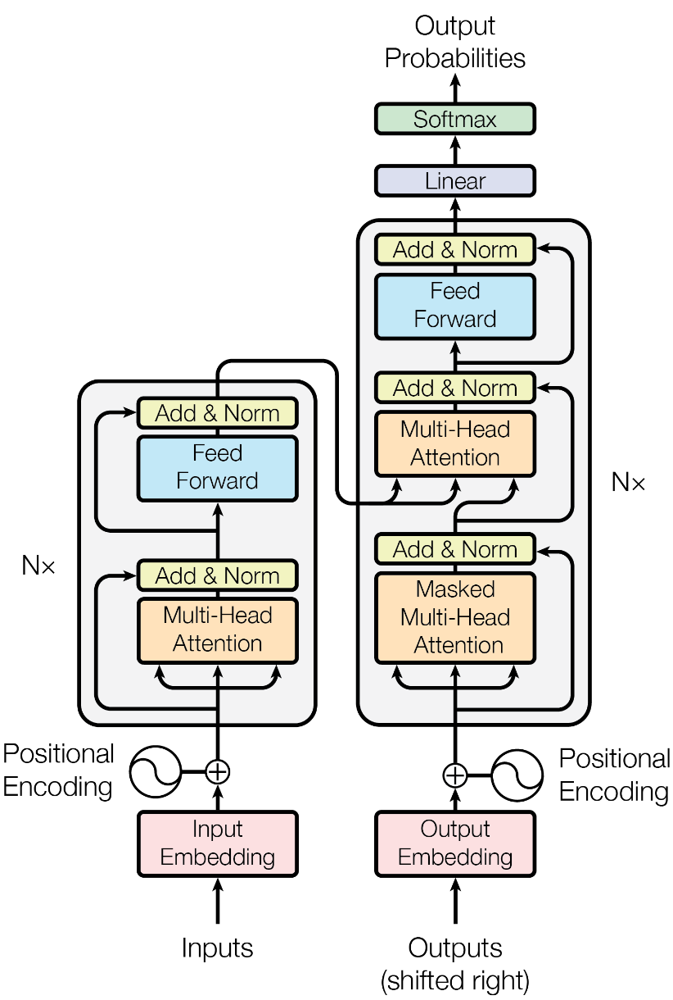
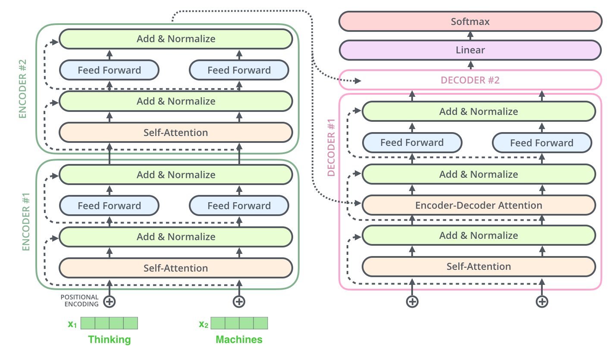

# Transformer架构细节




## 1.Transformer各个模块的作用

### （1）Encoder模块&#x20;

- 经典的Transformer架构中的Encoder模块包含6个Encoder Block. &#x20;
- 每个Encoder Block包含两个⼦模块, 分别是多头⾃注意⼒层, 和前馈全连接层. &#x20;
  - 多头⾃注意⼒层采⽤的是⼀种Scaled Dot-Product Attention的计算⽅式, 实验结果表  明, Multi-head可以在更细致的层⾯上提取不同head的特征, ⽐单⼀head提取特征的  效果更佳. &#x20;
  - 前馈全连接层是由两个全连接层组成, 线性变换中间增添⼀个Relu激活函数, 具体的 维度采⽤4倍关系, 即多头⾃注意⼒的d\_model=512, 则层内的变换维度d\_ff=2048. &#x20;

### （2）Decoder模块 &#x20;

- 经典的Transformer架构中的Decoder模块包含6个Decoder Block. &#x20;
- 每个Decoder Block包含3个⼦模块, 分别是多头⾃注意⼒层, Encoder-Decoder Attention  层, 和前馈全连接层. &#x20;
  - 多头⾃注意⼒层采⽤和Encoder模块⼀样的Scaled Dot-Product Attention的计算⽅  式, 最⼤的 区别在于**需要添加look-ahead-mask,** 即遮掩"未来的信息". &#x20;
  - Encoder-Decoder Attention层和上⼀层多头⾃注意⼒层最主要的区别在于Q != K = V,  矩阵Q来源于上⼀层Decoder Block的输出, 同时K, V来源于Encoder端的输出. &#x20;
  - 前馈全连接层和Encoder中完全⼀样. &#x20;

### （3）Add & Norm模块 &#x20;

- Add & Norm模块接在每⼀个Encoder Block和Decoder Block中的每⼀个⼦层的后⾯. &#x20;
- 对于每⼀个Encoder Block, ⾥⾯的两个⼦层后⾯都有Add & Norm. &#x20;
- 对于每⼀个Decoder Block, ⾥⾯的三个⼦层后⾯都有Add & Norm. &#x20;
- Add表示残差连接, 作⽤是为了将信息⽆损耗的传递的更深, 来增强模型的拟合能⼒. &#x20;
- Norm表示LayerNorm, 层级别的数值标准化操作, 作⽤是防⽌参数过⼤过⼩导致的学习过程异常 , 模型收敛特别慢的问题. &#x20;

### （4）位置编码器Positional Encoding &#x20;

- Transformer中采⽤三⻆函数来计算位置编码. &#x20;
- 因为三⻆函数是周期性函数, 不受序列⻓度的限制, ⽽且这种计算⽅式可以对序列中不同位置的编码的重要程度同等看待

## 2.Decoder端训练和预测的输入

1. 在Transformer结构中的Decoder模块的输⼊, 区分于不同的Block, 最底层的Block输⼊有其特殊的地⽅。第⼆层到第六层的输⼊⼀致, 都是上⼀层的输出和Encoder的输出。
2. 最底层的Block在**训练阶段**, 每⼀个time step的输⼊是上⼀个time step的输⼊加上真实标  签序列向后移⼀位. 具体来看, 就是每⼀个time step的输⼊序列会越来越⻓, 不断的将之前的  输⼊融合进来. &#x20;
   ```text
   假设现在的真实标签序列等于"How are you?", 
   当time step=1时, 输⼊张量为⼀个特殊的token, ⽐如"SOS"; 
   当time step=2时, 输⼊张量为"SOS How"; 
   当time step=3时, 输⼊张量为"SOS How are";
   以此类推...
   ```
3. 最底层的Block在**训练阶段**, 真实的代码实现中, 采⽤的是MASK机制来模拟输⼊序列不断添  加的过程. &#x20;
4. 最底层的Block在**预测阶段**, 每⼀个time step的输⼊是从time step=0开始, ⼀直到上⼀个  time step的预测值的累积拼接张量. 具体来看, 也是随着每⼀个time step的输⼊序列会越来越长. 相⽐于训练阶段最⼤的不同是这⾥不断拼接进来的token是每⼀个time step的预测值,  ⽽不是训练阶段每⼀个time step取得的groud truth值
   ```纯文本
   当time step=1时, 输⼊的input_tensor="SOS", 预测出来的输出值是output_tensor="What";
   当time step=2时, 输⼊的input_tensor="SOS What", 预测出来的输出值是output_tensor="is";
   当time step=3时, 输⼊的input_tensor="SOS What is", 预测出来的输出值是output_tensor="the";
   当time step=4时, 输⼊的input_tensor="SOS What is the", 预测出来的输出值是output_tensor="matter";
   当time step=5时, 输⼊的input_tensor="SOS What is the matter", 预测出来的输出值是output_tensor="?";
   当time step=6时, 输⼊的input_tensor="SOS What is the matter ?", 预测出来的输出值是output_tensor="EOS", 代表句⼦的结束符, 说明解码结束, 预测结束.

   ```

## 3.Self-attention

> Transformer中⼀直强调的self-attention是什么? 为什么能  发挥如此⼤的作⽤? 计算的时候如果不使⽤三元组(Q, K, V), ⽽  仅仅使⽤(Q, V)或者(K, V)或者(V)⾏不⾏?

### （1）self-attention的机制和原理

self-attention是⼀种通过⾃身和⾃身进⾏关联的attention机制, 从⽽得到更好的  representation来表达⾃身. &#x20;

self-attention是attention机制的⼀种特殊情况:  在self-attention中, Q=K=V, **序列中的每个单词(token)都和该序列中的其他所有单词 (token)进⾏attention规则的计算.** &#x20;

attention机制计算的特点在于, 可以**直接跨越⼀句话中不同距离的token, 可以远距离的学习到序列的知识依赖和语序结构.**


- 从上图中可以看到, self-attention可以远距离的捕捉到语义层⾯的特征(it的指代对象是  animal). &#x20;
- 应⽤传统的RNN, LSTM, 在获取⻓距离语义特征和结构特征的时候, **需要按照序列顺序依次  计算, 距离越远的联系信息的损耗越⼤, 有效提取和捕获的可能性越⼩.** &#x20;
- 但是应⽤self-attention时, 计算过程中会直接将句⼦中任意两个token的联系通过⼀个计算  步骤直接联系起来,

### （2）关于self-attention为什么要使⽤(Q, K, V)三元组⽽不是其他形式

⾸先⼀条就是从分析的⻆度看, 查询Query是⼀条独⽴的序列信息, 通过关键词Key的提示作⽤, 得到最终语义的真实值Value表达, 数学意义更充分, 完备. &#x20;

这⾥不使用(K, V)或者(V)没有什么必须的理由, 也没有相关的论⽂来严格阐述⽐较试验的结果差异, 所以可以作为开放性问题未来去探索, 只要明确在经典self-attention实现中⽤的是三元组就好

## 4.Self-attention归一化和放缩

### （1）self-attention中的归⼀化概述

**训练上的意义**：随着词嵌⼊维度d\_k的增⼤, q \* k 点积后的结果也会增⼤, 在训练时会将  softmax函数推入梯度⾮常⼩的区域, 可能出现梯度消失的现象, 造成模型收敛困难. &#x20;

**数学上的意义**: 假设q和k的统计变量是满⾜标准正态分布的独⽴随机变量, 意味着q和k满⾜均  值为0, ⽅差为1。\*\* 那么q和k的点积结果就是均值为0, ⽅差为\*\*$d_k$**, 为了抵消这种⽅差被放⼤**$d_k$\*\*  倍的影响, 在计算中主动将点积缩放\*\*​$\frac{1}{\sqrt(d_k)}$, 这样点积后的结果依然满⾜均值为0, ⽅差为  1。

### （2）softmax的梯度变化

这⾥我们分3个步骤来解释softmax的梯度问题: &#x20;

#### 第⼀步: softmax函数的输⼊分布是如何影响输出的

对于⼀个输⼊向量x, softmax函数将其做了⼀个归⼀化的映射, ⾸先通过⾃然底数e将输⼊元素之间的差距先"拉⼤", 然后再归⼀化为⼀个新的分布。 **在这个过程中假设某个输⼊x  中最⼤的元素下标是k, 如果输⼊的数量级变⼤(就是x中的每个分量绝对值都很⼤), 那么在数学上会造成y\_k的值⾮常接近1。** &#x20;

具体⽤⼀个例⼦来演示, 假设输⼊的向量$x = [a, a, 2a]$, 那么随便给⼏个不同数量级的值来看看对y3产⽣的影响

```纯文本
a = 1时,   y3 = 0.5761168847658291
a = 10时,  y3 = 0.9999092083843412
a = 100时, y3 = 1.0
```

采⽤⼀段实例代码将a在不同取值下, 对应的y3全部画出来, 以曲线的形式展示:

```python
from math import exp
from matplotlib import pyplot as plt
import numpy as np
f = lambda x: exp(x * 2) / (exp(x) + exp(x) + exp(x * 2))
x = np.linspace(0, 100, 100)
y_3 = [f(x_i) for x_i in x]
plt.plot(x, y_3)
plt.show()
```


从上图可以很清楚的看到输⼊元素的数量级对softmax最终的分布影响⾮常之⼤。&#x20;

**结论**： **在输⼊元素的数量级较⼤时, softmax函数⼏乎将全部的概率分布都分配给了最⼤值分量所对应的标签**

#### 第⼆步: softmax函数在反向传播的过程中是如何梯度求导的

首先，定义神经网络的输入和输出

$$
设X=[x_1,x_2,..., x_n], Y=softmax(X)=[y_1, y_2,..., y_3] \\
则~y_i=\frac{e^{x_i}}{\sum_{j=1}^{n} e^{x_j}},~显然~  \sum_{j=1}^{n} e^{x_j}=1
$$

反向传播就是输出端的损失函数对输⼊端求偏导的过程, 这⾥要分两种情况,&#x20;

\*\*（1）当 \*\*$i=j$**时：**

$$
\begin{aligned}
\frac{\partial y_{i}}{\partial x_{j}}& =\frac{\partial y_i}{\partial x_i}  \\
&=\frac{\partial}{\partial x_i}(\frac{e^{x_i}}{\sum_k e^{x_k}}) \\
&=\frac{(e^{x_i})'(\sum_k e^{x_k})-e^{x_i}(\sum_k e^{x_k})'}{(\sum_k e^{x_k})^2} \\
&=\frac{e^{x_i}\cdot(\sum_ke^{x_k})-e^{x_i}\cdot e^{x_i}}{(\sum_ke^{x_k})^2} \\
&=\frac{e^{x_i}\cdot(\sum_k e^{x_k})}{(\sum_k e^{x_k})^2}-\frac{e^{x_i}\cdot e^{x_i}}{(\sum_k e^{x_k})^2} \\
&=\frac{e^{x_i}}{\sum_k e^{x_k}}-\frac{e^{x_i}}{\sum_k e^{x_k}}\cdot\frac{e^{x_i}}{\sum_k e^{x_k}} \\
&=y_i-y_i\cdot y_i \\
&=y_i(1-y_i)
\end{aligned}
$$

**（2）当**$ i ≠ j$**时：**

$$
\begin{aligned}
\frac{\partial y_{i}}{\partial x_{j}} & =\frac{\partial}{\partial x_{j}}\left(\frac{e^{x_{i}}}{\sum_{k} e^{x_{k}}}\right) \\
& =\frac{\left(e^{x_{i}}\right)^{\prime}\left(\sum_{k} e^{x_{k}}\right)-e^{x_{i}}\left(\sum_{k} e^{x_{k}}\right)^{\prime}}{\left(\sum_{k} e^{x_{k}}\right)^{2}} \\
& =\frac{0 \cdot\left(\sum_{k} e^{x_{k}}\right)-e^{x_{i}} \cdot e^{x_{j}}}{\left(\sum_{k} e^{x_{k}}\right)^{2}} \\
& =-\frac{e^{x_{i}} \cdot e^{x_{j}}}{\left(\sum_{k} e^{x_{k}}\right)^{2}} \\
& =-\frac{e^{x_{i}}}{\sum_{k} e^{x_{k}}} \cdot \frac{e^{x_{i}}}{\sum_{k} e^{x_{k}}} \\
& =-y_{i} \cdot y_{i}
\end{aligned}
$$

经过对两种情况分别的求导计算, 可以得出最终的结论如下:

$$
\begin{aligned}
& 综上所述：\frac{\partial y_i}{\partial x_j}=\begin{cases}y_i-y_i\cdot y_i,&\text{i=j}\\ \\ 0-y_i\cdot y_i,&\text{i}\neq\text{j}\end{cases} \\
& 所以：\frac{\partial Y}{\partial X}=diag(Y)-Y^T\cdot Y（当Y的shape为(1,n)时）
\end{aligned} 
$$

#### 第三步: softmax函数出现梯度消失现象的原因

根据第二步中softmax函数的求导结果, 可以将最终的结果以矩阵形式展开如下:

$$
\frac{\partial g(X)}{\partial X} \approx\left[\begin{array}{cccc}
\hat{y}_{1} & 0 & \cdots & 0 \\
0 & \hat{y}_{2} & \cdots & 0 \\
\vdots & \vdots & \ddots & \vdots \\
0 & 0 & \cdots & \hat{y}_{d}
\end{array}\right]-\left[\begin{array}{cccc}
\hat{y}_{1}^{2} & \hat{y}_{1} \hat{y}_{2} & \cdots & \hat{y}_{1} \hat{y}_{d} \\
\hat{y}_{2} \hat{y}_{1} & \hat{y}_{2}^{2} & \cdots & \hat{y}_{2} \hat{y}_{d} \\
\vdots & \vdots & \ddots & \vdots \\
\hat{y}_{d} \hat{y}_{1} & \hat{y}_{d} \hat{y}_{2} & \cdots & \hat{y}_{d}^{2}
\end{array}\right]
$$

根据第一步中的讨论结果, 当输入x的分量值较大时, softmax函数会将大部分概率分配给最大的元素, 假设最大元素是x1, 那么softmax的输出分布将产生一个接近one-hot的结果张量y\_ = \[1, 0, 0,..., 0], 此时结果矩阵变为:

$$
\frac{\partial g(X)}{\partial X} \approx\left[\begin{array}{cccc}1 & 0 & \cdots & 0 \\ 0 & 0 & \cdots & 0 \\ & & & \\ \vdots & \vdots & \ddots & \vdots \\ 0 & 0 & \cdots & 0\end{array}\right]-\left[\begin{array}{cccc}1 & 0 & \cdots & 0 \\ 0 & 0 & \cdots & 0 \\ & & & \\ \vdots & \vdots & \ddots & \vdots \\ 0 & 0 & \cdots & 0\end{array}\right]=0
$$

结论：综上可以得出,\*\* 所有的梯度都消失为0(接近于0), 参数几乎无法更新, 模型收敛困难\*\*.

### （3）维度与点积大小的关系

针对为什么维度会影响点积的大小, 原始论文中有这样的一点解释如下:

```纯文本
To illustrate why the dot products get large, assume that the components of q and k are independent random variables with mean 0 and variance 1. Then their doct product,q*k = (q1k1+q2k2+......+q(d_k)k(d_k)), has mean 0 and variance d_k.

```

分两步对其进行一个推导, 首先就是假设向量q和k的各个分量是相互独立的随机变量, $X = q_i$, $Y = k_i$, X和Y各自有d\_k个分量, 也就是向量的维度等于d\_k, 有$E(X) = E(Y) = 0$, 以及$D(X) = D(Y) = 1$.

可以得到$E(XY) = E(X)E(Y) = 0 * 0 = 0$

同理, 对于$D(XY)$推导如下:

$$
\begin{aligned}
D(XY)& =E(X^2\cdot Y^2)-[E(XY)]^2  \\
&=E(X^2)E(Y^2)-[E(X)E(Y)]^2 \\
&=E(X^2-0^2)E(Y^2-0^2)-[E(X)E(Y)]^2 \\
&=E(X^2-[E(X)]^2)E(Y^2-[E(Y)]^2)-[E(X)E(Y)]^2 \\
&=D(X)D(Y)-[E(X)E(Y)]^2 \\
&=1\times1-\left(0\times0\right)^2 \\
&=1
\end{aligned}
$$

根据期望和方差的性质, 对于互相独立的变量满足下式：

$$
\begin{gathered}
E(\sum_{i}Z_{i})=\sum_{i}E(Z_{i}), \\
D(\sum_{i}Z_{i})=\sum_{i}D(Z_{i}) 
\end{gathered}
$$

根据上面的公式, 可以很轻松的得出q\*k的均值为$E(qk) = 0$, $D(qk) = d_k$。所以方差越大, **对应的qk的点积就越大, 这样softmax的输出分布就会更偏向最大值所在的分量**。一个技巧就是将点积除以$\sqrt{d_k}$ 将方差在数学上重新"拉回1", 如下所示

$$
D(\frac{q\cdot k}{\sqrt{d_k}})=\frac{d_k}{(\sqrt{d_k})^2}=1
$$

最终的结论：**通过数学上的技巧将方差控制在1, 也就有效的控制了点积结果的发散, 也就控制了对应的梯度消失的问题**!

## 5.Multi-head Attention

### （1）采⽤Multi-head Attention的原因 &#x20;

1. 原始论⽂中提到进⾏Multi-head Attention的原因是将模型分为多个头, **可以形成多个子空间间, 让模型去关注不同方面的信息**, 最后再将各个⽅⾯的信息综合起来得到更好的效果. &#x20;
2. 多个头进⾏attention计算最后再综合起来, 类似于CNN中采⽤多个卷积核的作⽤, 不同的卷  积核提取不同的特征, **关注不同的部分, 最后再进行融合**. &#x20;
3. 直观上讲, **多头注意力有助于神经网络捕捉到更丰富的特征信息**.

#### （2）Multi-head Attention的计算⽅式 &#x20;

1. Multi-head Attention和单⼀head的Attention唯⼀的区别就在于,\*\* 其对特征张量的最后⼀个维度进行了分割, ⼀般是对词嵌入的embedding\_dim=512进⾏切割成head=8, \*\*这样每⼀个head的嵌⼊维度就是512/8=64, 后续的Attention计算公式完全⼀致, 只不过是在64这个维度上进⾏⼀系列的矩阵运算⽽已. &#x20;
2. 在head=8个头上分别进⾏注意⼒规则的运算后, 简单采用拼接**concat**的⽅式对结果张量进  ⾏融合就得到了Multi-head Attention的计算结果.

## 6.Transformer和RNN

### （1）Transformer的并行计算 &#x20;

对于Transformer⽐传统序列模型RNN/LSTM具备优势的第⼀⼤原因就是强⼤的并⾏计算能力.&#x20;

对于RNN来说, 任意时刻`t`的输⼊是时刻t的输⼊`x(t)`和上⼀时刻的隐藏层输出`h(t-1)`, 经过运算后得到当前时刻隐藏层的输出`h(t)`, 这个`h(t)`也即将作为下⼀时刻`t+1`的输⼊的⼀部分.  这个计算过程是RNN的本质特征, RNN的历史信息是需要通过这个时间步⼀步⼀步向后传递的. 而**这就意味着RNN序列后⾯的信息只能等到前⾯的计算结束后, 将历史信息通过hidden state传递给后⾯才能开始计算, 形成链式的序列依赖关系, 无法实现**并行. &#x20;

对于Transformer结构来说, 在self-attention层, ⽆论序列的⻓度是多少, 都可以⼀次性计算所有单词之间的注意⼒关系, 这个attention的计算是同步的, 可以实现并⾏. &#x20;

### （2）Transformer的特征抽取能力&#x20;

对于Transformer⽐传统序列模型RNN/LSTM具备优势的第⼆⼤原因就是强⼤的特征抽取能力 。&#x20;

Transformer因为采⽤了Multi-head Attention结构和计算机制, 拥有⽐RNN/LSTM更强⼤的特征抽取能⼒, 这⾥并不仅仅由理论分析得来, 而是⼤量的试验数据和对⽐结果, 清楚的展示了Transformer的特征抽取能⼒远远胜于RNN/LSTM. &#x20;

**注意**: 不是越先进的模型就越无敌, 在很多具体的应⽤中RNN/LSTM依然⼤有⽤武之地, 要具体问题具体分析

## 7.Transformer代替seq2seq？

### （1）seq2seq的两大缺陷 &#x20;

1. seq2seq架构的第⼀⼤缺陷是将Encoder端的所有信息**压缩成⼀个固定⻓度的语义向量中,  ⽤这个固定的向量来代表编码器端的全部信息. 这样既会造成信息的损耗**, 也⽆法让Decoder 端在解码的时候去⽤注意⼒聚焦哪些是更重要的信息. &#x20;
2. seq2seq架构的第二大缺陷是**无法并行**, 本质上和RNN/LSTM无法并行的原因⼀样. &#x20;

### （2）Transformer的改进 &#x20;

Transformer架构同时解决了seq2seq的两⼤缺陷, 既可以并⾏计算, ⼜应⽤Multi-head  Attention机制来解决Encoder固定编码的问题, 让Decoder在解码的每⼀步可以通过注意⼒去  关注编码器输出中最重要的那些部分.

## 8.Transformer并行化

### （1）Encoder并行化


1. 上图最底层绿⾊的部分, 整个序列所有的token可以并⾏的进⾏Embedding操作, 这⼀层的处理是没有依赖关系的. &#x20;
2. 上图第⼆层⼟⻩⾊的部分, 也就是Transformer中最重要的self-attention部分, 这⾥对于任意⼀个单词⽐如x1, 要计算x1对于其他所有token的注意⼒分布, 得到z1. 这个过程是具有依赖性的, 必须等到序列中所有的单词完成Embedding才可以进⾏。因此这⼀步是不能并⾏处理的。 但是从另⼀个⻆度看, 我们真实计算注意⼒分布的时候, 采⽤的都是矩阵运算, 也就是可以⼀次性的计算出所有token的注意⼒张量, 从这个⻆度看也算是实现了并行, 只是矩阵运算的"并行"和词嵌⼊的"并行"概念上不同⽽已. &#x20;
3. 上图第三层蓝⾊的部分, 也就是前馈全连接层, 对于不同的向量z之间也是没有依赖关系的, 所以这⼀层是可以实现并行化处理的. 也就是所有的向量z输⼊Feed Forward⽹络的计算可以同步进⾏, 互不⼲扰

### （2）Decoder的并行化



1. Decoder模块在训练阶段采用了并行化处理。 其中Self-Attention和Encoder-Decoder Attention两个子层的并行化也是在进行矩阵乘法, 和Encoder的理解是一致的. 在进行Embedding和Feed Forward的处理时, 因为各个token之间没有依赖关系, 所以也是可以完全并行化处理的, 这里和Encoder的理解也是一致的.
2. Decoder模块在预测阶段基本上不认为采用了并行化处理. 因为第一个time step的输入只是一个"SOS", 后续每一个time step的输入也只是依次添加之前所有的预测token.
3. **注意:** 最重要的区别是训练阶段目标文本如果有20个token, 在训练过程中是一次性的输入给Decoder端, 可以做到一些子层的并行化处理. 但是在预测阶段, 如果预测的结果语句总共有20个token, 则需要重复处理20次循环的过程, 每次的输入添加进去一个token, 每次的输入序列比上一次多一个token, 所以不认为是并行处理.

### （3）总结

**Transformer架构中Encoder模块的并行化机制**

- **Encoder模块在训练阶段和测试阶段都可以实现完全相同的并行化.**
- Encoder模块在Embedding层, Feed Forward层, Add & Norm层都是可以并行化的.
- Encoder模块在self-attention层, 因为各个token之间存在依赖关系, 无法独立计算, 不是真正意义上的并行化.
- Encoder模块在self-attention层, 因为采用了矩阵运算的实现方式, 可以一次性的完成所有注意力张量的计算, 也是另一种"并行化"的体现.

**Transformer架构中Decoder模块的并行化机制**

- **Decoder模块在训练阶段可以实现并行化**.
- Decoder模块在训练阶段的Embedding层, Feed Forward层, Add & Norm层都是可以并行化的.
- Decoder模块在self-attention层, 以及Encoder-Decoder Attention层, 因为各个token之间存在依赖关系, 无法独立计算, 不是真正意义上的并行化.
- Decoder模块在self-attention层, 以及Encoder-Decoder Attention层, 因为采用了矩阵运算的实现方式, 可以一次性的完成所有注意力张量的计算, 也是另一种"并行化"的体现.
- **Decoder模块在预测计算不能并行化处理.**
