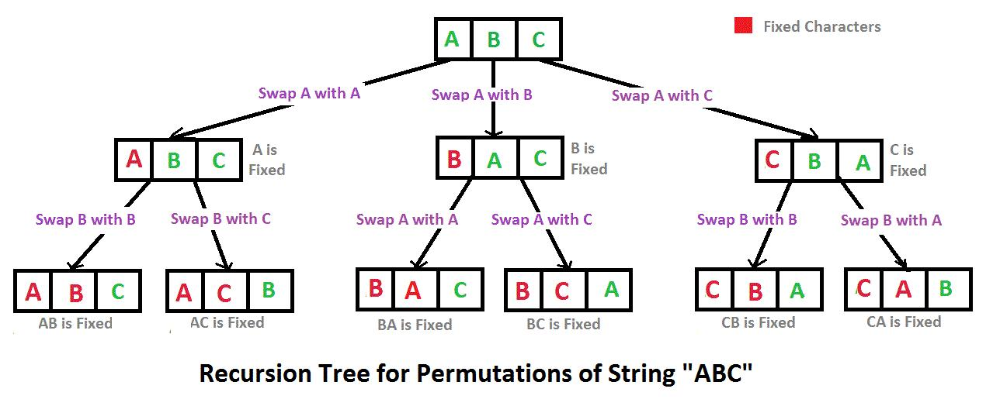
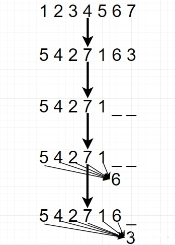

# bert变种

### 1.RoBERTa

> 原论文链接: [https://arxiv.org/pdf/1907.11692.pdf](https://arxiv.org/pdf/1907.11692.pdf "https://arxiv.org/pdf/1907.11692.pdf")

RoBERTa 的全称是 Robustly optimized BERT approach。

RoBERTa 是在 bert 的基础上做了一些改进，这些改进并不是设计什么新颖的结构，而是尽量使模型得到更充分的预训练，释放 bert 模型的潜力。

改进共有四个方面：

- **使用更大的 batch-size，更大的数据集，做更充分的训练**；
- 使用的数据中具有更大的 sequence length，而不是像 bert 中会掺杂一些短句；
- **移除 NSP 任务**：这里的实验结果表明，不使用NSP的效果要优于使用NSP
- **将静态 mask 机制改为动态 mask 机制**；

另外还有一个是 **tokenize 时使用的是与 GPT-2 相同的 BPE 策略**。

做了上述改进之后，指标有所提升。

### 2.ALBERT

> 原文链接：[https://openreview.net/pdf?id=H1eA7AEtvS](https://openreview.net/pdf?id=H1eA7AEtvS "https://openreview.net/pdf?id=H1eA7AEtvS")

ALBERT 的全称为 A Lite BERT。所以从名字可以看出，这个模型的目的是想搞一个比 Bert 更小、更轻量级的模型。这个模型相比于 Bert 在三个方面做了修改。

#### 2.1 对Embedding 层的参数做因式分解

> 符号说明：将 embedding 层向量的维度定义为 `E`，将 transformer 层中向量的维度定义为 `H`，在 Bert 中 `E` 与 `H` 是相等的。

在 Bert 模型中，embedding 层的向量维度与 transformer 层的向量维度是相同的，该文作者认为这两者没有必要相同，原因有二：

- 一般来说，模型不同的层学到的信息是不同的，按照 ELMo 模型中的分析，**靠近输入的层学到的是语法信息，离输入较远的层学到的是语义信息**。在本文中作者认为，embedding 层中学到的向量应该是没有上下文（context）信息的，而 transformer 层中学到的向量是包含上下文（context）信息的。所以从这个角度来说由于需要存储更复杂的上下文（context）信息，transformer 层中的向量维度 `H` 应该要远大于 embedding 层中的向量维度 `E`。
- 另外一个方面则是因为\*\* embedding 的参数量在整个模型的参数量中占比是比较高的\*\*，而 embedding 层在训练时更新的又比较稀疏（这个结论是哪来的？）所以减少 embedding 层的参数量是合理的。

基于上述两个原因，本文提出的方法是 **embedding 权重矩阵的维度是`V * E`**（这里的 `E < H` ），**得到 embedding 的向量之后再通过一个 ****`E * H`**** 的权重矩阵投影到 transformer 层的隐空间上**。改进前后 embedding 层的参数量分别为：

- 改进前的参数量：`V * E`，这里 `V` 表示 vocab 的个数，并且 `E` 与 `H` 相等。以 bert-base 模型为例，参数量为 21128 \* 768 = 16226304，约为 16M；
- 改进后的参数量：`V * E + E * H`，这里 `E` 是小于 `H` 的。还是以 bert-base 模型为例，假设 embedding 层的向量维度 `E` 为 128，参数量为 21128 \* 128 + 128 \* 768 = 2802688，约为 2.8M；

可以看出 embedding 层的参数量大幅减少。

#### 2.2 跨层参数共享

这部分的做法很容易理解，就是**所有的 transformer 层共享相同的参数，也就是说实际上只有一个 transformer 层的权重**，然后会多次经过这个 transformer 层。比如 bert-base 有 12 层 transformer，改成 ALBERT就是数据会经过同一个 transformer 层 12 次，如下图：

#### 2.3 将 NSP 任务换成了 SOP 任务

SOP 的全称为 sentence order prediction。

在该文章之前已经有些文章发现，bert 的论文中的 NSP 任务没有什么作用。该论文任务 NSP 任务之所以没有作用，是因为其太简单了，所以在其基础上设计了一个难度更高的新任务，也就是 SOP 任务。**SOP 任务就是预测两句话有没有被交换过顺序**。

### 3.spanBERT

SpanBERT是提出对BERT进行的一些简单修正，重新实现的BERT，其中它在三个方面进行的改进：1、将token mask改成spanmask。2、损失函数加上SBO损失。3、去掉NSP。

#### 3.1 将token mask改成span mask &#x20;

不采用随机mask的方法，而是采用mask掉一定的连续token。

原生BERT中对mask的位置是随机的，后面有改进为mask的时候如果一个单词被拆分成不同的word piece，那么这些token一起被mask（广义上的mask）。本文作者把这个推广到span级别：每次mask的时候，先从[几何分布](https://link.zhihu.com/?target=https://baike.baidu.com/item/%E5%87%A0%E4%BD%95%E5%88%86%E5%B8%83 "几何分布") 中采样出一个span长度，然后从均匀分布中采样span的起始位置。

#### 3.2 增加由边界预测mask的任务（SBO）

在很多任务中，会用到利用span的边界作为span本身的表示（比如coreference resolution），作者受此启发，增加了一个利用边界token预测span的任务。

序列$X=\left(x_{1}, \ldots x_{n}\right)$，其中$Y \subseteq X$，有被mask的span $\left(x_{s}, \ldots, x_{e}\right)$，其中`s`和`e`分别代表开始和结尾。我们通过外边界$x_{s-1}$和$x_{e+1}$来预测被mask掉的全部token。

如果被mask掉的单词的位置为 $p_i$，那么预测可以表示为：

$$
y_{i}=f\left(x_{s-1}, x_{e+1}, p_{i}\right)
$$

论文中f的实现用的是两层带GeLU激活函数的全连接网络。

#### 3.3 去掉NSP

# 4.XLNet

XLNet是由卡内基梅隆大学和Google大脑联合提出的一种算法，其沿用了自回归的语言模型，并利用排列语言模型合并了bert的优点，同时集成transformer-xl对于长句子的处理，达到了SOTA的效果。

#### 4.1 AR和AE

- AR：Autoregressive Language Modeling
- AE： Autoencoding Language Modeling

XLNet 的出发点就是：能否融合AR LM 和 AE LM 两者的优点。具体来说就是，站在 AR 的角度，如何引入和双向语言模型等价的效果.

#### 4.2 排列语言模型（Permutation Language Model）

作者发现，只要在 AR中再加入一个步骤，就能够完美地将AR与AE的优点统一起来，那就是提出**Permutation Language Model**（PLM）。

具体实现方式是，通过**随机取一句话的一种排列，然后将末尾一定量的词给“遮掩”**（和 BERT 里的直接替换 “\[MASK]” 有些不同）掉，最后**用 AR 的方式来按照这种排列依次预测被“遮掩”掉的词**。

我们可以发现通过随机取排列（Permutation）中的一种，就能非常巧妙地通过 **AR 的单向方式来习得双向信息**了。

论文中 Permutation 具体的实现方式是通过直接对 Transformer 的 **Attention Mask** 进行操作。

比如说序号依次为 1234 的句子，先随机取一种排列3241。于是根据这个排列就做出类似上图的 Attention Mask。先看第1行，因为在新的排列方式中 1 在最后一个，根据从左到右 AR 方式，1 就能看到 234 全部，于是第一行的 234 位置是红色的（没有遮盖掉，会用到），以此类推。第2行，因为 2 在新排列是第二个，只能看到 3，于是 3 位置是红色。第 3 行，因为 3 在第一个，看不到其他位置，所以全部遮盖掉...

#### 4.3 Two-Stream Self-Attention

为了实现 Permutation 加上 AR 预测过程，首先我们会发现，打乱顺序后位置信息非常重要，同时对每个位置来说，需要预测的是内容信息（对应位置的词），于是输入就不能包含内容信息，不然模型学不到东西，只需要直接从输入复制到输出就好了。

于是这里就造成了**位置信息与内容信息的割裂**，因此在 BERT 这样的位置信息加内容信息输入 Self-Attention (自注意力) 的流（Stream）之外，作者还增加了另一个**只有位置信息作为 Self-Attention****中 query 输入的流**。文中将前者称为 **Content Stream**，而后者称为 **Query Stream**。

这样就能利用 Query Stream 在对需要预测位置进行预测的同时，又不会泄露当前位置的内容信息。具体操作就是用两组隐状态（hidden states） *`g`* 和 `ℎ` 。其中 *`g`* 只有位置信息，作为 Self-Attention 里的 Q。 `ℎ` 包含内容信息，则作为 K 和 V。具体表示如下图(a)所示：

上图中我们需要理解两点：

- 第一点，最下面一层蓝色的 Content Stream 的输入是 $e(x_i)$ ，这个很好懂就是 $x$ 对应的词向量 (Embedding)，不同词对应不同向量，但看旁边绿色的 Query Stream，就会觉得很奇怪，为什么都是一样的 $w$ ？这个和Relative Positional Encoding 有关。
- 第二点，Query stream attention图中为了便于说明，只将当前位置之外的 h 作为 K 和 V，但实际上实现中应该是所有时序上的 h 都作为 K 和 V，最后再交给上图中的 Query stream 的 Attention Mask 来完成位置的遮盖。

#### 4.4 Partial Prediction

XLNet还使用了部分预测（Partial Prediction）的方法。因为LM是从第一个Token预测到最后一个Token，在预测的起始阶段，上文信息很少而不足以支持Token的预测，这样可能会对分布产生误导，从而使得模型收敛变慢。为此，XLNet只预测后面一部分的Token，而把前面的所有Token都当作上下文。

具体来说，对长度为T的句子，我们选取一个超参数K，使得后面`1/K`的Token用来预测，前面`1-1/K`的Token用作上下文。注意，`K`越大，上下文越多，模型预测就越精确。

#### 4.5 Transformer-XL

对于过长序列，如果分段来进行处理，往往会遗漏信息，且效果会下降，那么xlnet借鉴了Transformer-XL的思想，设置一个保留上一个片段的信息，在训练时进行更新。

### 5.AR和AE

#### 5.1 自回归语言模型（AutoRegressive LM）

AR语言模型：指的是，**依据前面（或后面）出现的tokens来预测当前时刻的token**，代表有 ELMO， GPT等。

> GPT 就是典型的自回归语言模型。ELMO 尽管看上去利用了上文，也利用了下文，但是本质上仍然是自回归 LM，这个跟模型具体怎么实现有关系。ELMO 是分别做了两个方向的自回归 LM（从左到右以及从右到左两个方向的语言模型），然后把 LSTM 的两个方向的隐状态拼接到一起，来体现双向语言模型这个事情的。所以其本质上仍然是自回归语言模型

给定文本序列$\mathbf{x}=\left[x_{1}, \ldots, x_{T}\right]$，语言模型的目标是调整参数使得训练数据上的似然函数最大：

$$
\max _{\theta} \log p_{\theta}(\mathbf{x})=\sum_{t=1}^{T} \log p_{\theta}\left(x_{t} \mid \mathbf{x}_{<t}\right)=\sum_{t=1}^{T} \log \frac{\exp \left(h_{\theta}\left(\mathbf{x}_{1: t-1}\right)^{T} e\left(x_{t}\right)\right)}{\sum_{x^{\prime}} \exp \left(h_{\theta}\left(\mathbf{x}_{1: t-1}\right)^{T} e\left(x^{\prime}\right)\right)}
$$

记号 $\mathbf{x}_{<t}$表示 `t` 时刻之前的所有$x$，也就是$\mathbf{x}_{1: t-1}$。$h_{\theta}\left(\mathbf{x}_{1: t-1}\right)$ 是 RNN 或者 Transformer（注：Transformer 也可以用于语言模型，比如在 OpenAI GPT）编码的 `t` 时刻之前的隐状态。$e(x)$是词$x$的embedding。

自回归语言模型的缺点是**无法同时利用上下文的信息**，貌似 ELMO 这种双向都做，然后拼接看上去能够解决这个问题，但其实融合方法过于简单，所以效果其实并不是太好。

它的优点**跟下游 NLP 任务有关**，比如生成类 NLP 任务，比如文本摘要，机器翻译等，在实际生成内容的时候，**就是从左向右的，自回归语言模型天然匹配这个过程**。而 Bert 这种 DAE（Denoise AutoEncoder）模式，在生成类 NLP 任务中，面临训练过程和应用过程不一致的问题，导致生成类的 NLP 任务到目前为止都做不太好

#### 5.2 自编码语言模型（AutoEncoder LM）

BERT 通过将序列 $x$中随机挑选15% 的 Token 变成 `[MASK]` 得到带噪声版本的$\hat x$。假设被 Mask 的原始值为$\hat x$，那么 BERT 希望尽量根据上下文恢复（猜测）出原始值，也就是：

$$
\max _{\theta} \log p_{\theta}(\overline{\mathbf{x}} \mid \hat{\mathbf{x}}) \approx \sum_{t=1}^{T} m_{t} \log p_{\theta}\left(x_{t} \mid \hat{\mathbf{x}}\right)=\sum_{t=1}^{T} m_{t} \log \frac{\exp \left(H_{\theta}(\mathbf{x})_{t}^{T} e\left(x_{t}\right)\right)}{\sum_{x^{\prime}} \exp \left(H_{\theta}(\mathbf{x})_{t}^{T} e\left(x^{\prime}\right)\right)}
$$

上式中，若$m_t = 1$表示`t`时刻是一个`Mask`，需要恢复。$H_\theta$ 是一个Transformer，它把长度为 `T`的序列$x$ 映射为隐状态的序列 $H_{\theta}(\mathbf{x})=\left[H_{\theta}(\mathbf{x})_{1}, H_{\theta}(\mathbf{x})_{2}, \ldots, H_{\theta}(\mathbf{x})_{T}\right]$。注意：前面的语言模型的 RNN 在 `t`时刻只能看到之前的时刻，因此记号是$h_{\theta}\left(\mathbf{x}_{1: t-1}\right)$；而 BERT 的 Transformer（不同与用于语言模型的 Transformer）可以同时看到整个句子的所有 Token，因此记号是 $H_{\theta}(\mathbf{x})$。

这种 AE LM 的优缺点正好和 AR LM 反过来，它能比较自然地融入双向语言模型，同时看到被预测单词的上文和下文，这是好处。

缺点是啥呢？主要在输入侧引入 `[Mask]` 标记，导致预训练阶段和 Fine-tuning 阶段不一致的问题，因为 Fine-tuning 阶段是看不到 `[Mask]` 标记的
