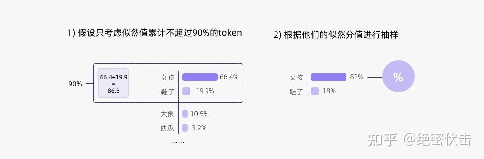

# 解码策略（Top-k & Top-p & Temperature）

## 0.简介

在大模型训练好之后，如何对训练好的模型进行解码（decode）是一个火热的研究话题。

一般给模型传入的解码参数如下所示。

```json
{
 "top_k": 10,
 "temperature": 0.95,
 "num_beams": 1,
 "top_p": 0.8,
 "repetition_penalty": 1.5,
 "max_tokens": 30000,
 "message": [
        {
 "content": "你好！",
 "role": "user"
        }
    ]
}
```

在自然语言任务中，通常使用一个预训练的大模型（比如GPT）来根据给定的输入文本（比如一个开头或一个问题）生成输出文本（比如一个答案或一个结尾）。为了生成输出文本，需要让模型逐个预测每个 token ，直到达到一个终止条件（如一个标点符号或一个最大长度）。在每一步，模型会给出一个概率分布，表示它对下一个单词的预测。例如，如果输入的文本是“我最喜欢的”，那么模型可能会给出下面的概率分布：


那么，应该如何从这个概率分布中选择下一个单词呢？以下是几种常用的方法：

- **贪心解码**（Greedy Decoding）：直接选择概率最高的单词。这种方法简单高效，但是可能会导致生成的文本过于单调和重复。
- **随机采样**（Random Sampling）：按照概率分布随机选择一个单词。这种方法可以增加生成的多样性，但是可能会导致生成的文本不连贯和无意义。
- **Beam Search**：维护一个大小为 k 的候选序列集合，每一步从每个候选序列的概率分布中选择概率最高的 k 个单词，然后保留总概率最高的 k 个候选序列。这种方法可以平衡生成的质量和多样性，但是可能会导致生成的文本过于保守和不自然。

以上方法都有各自的问题，而 **top-k 采样和 top-p 采样是介于贪心解码和随机采样之间的方法**，也是目前大模型解码策略中常用的方法。

## 2.top-k采样

在上面的例子中，如果使用**贪心策略**，那么选择的 token 必然就是“女孩”。

**贪心解码**是一种合理的策略，但也有一些缺点。例如，**输出可能会陷入重复循环**。想想智能手机自动建议中的建议。当你不断地选择建议最高的单词时，它可能会变成重复的句子。

**Top-k 采样**是对前面“贪心策略”的优化，它从排名前 k 的 token 中进行抽样，允许其他分数或概率较高的token 也有机会被选中。在很多情况下，这种抽样带来的随机性有助于提高生成质量。

**top-k 采样**的思路是，在每一步，只从概率最高的 k 个单词中进行随机采样，而不考虑其他低概率的单词。例如，如果 k=2，那么只从女孩、鞋子中选择一个单词，而不考虑大象、西瓜等其他单词。这样可以避免采样到一些不合适或不相关的单词，同时也可以保留一些有趣或有创意的单词。

下面是 top-k 采样的例子：


通过调整 k 的大小，即可控制采样列表的大小。“贪心策略”其实就是 k = 1的 top-k 采样。


下面是top-k 的代码实现：

```python
import torch
from labml_nn.sampling import Sampler

# Top-k Sampler
class TopKSampler(Sampler):
    # k is the number of tokens to pick
    # sampler is the sampler to use for the top-k tokens
    # sampler can be any sampler that takes a logits tensor as input and returns a token tensor; e.g. `TemperatureSampler`.
    def __init__(self, k: int, sampler: Sampler):
        self.k = k
        self.sampler = sampler

    # Sample from logits
    def __call__(self, logits: torch.Tensor):
        # New logits filled with −∞; i.e. zero probability
        zeros = logits.new_ones(logits.shape) * float('-inf')
        # Pick the largest k logits and their indices
        values, indices = torch.topk(logits, self.k, dim=-1)
        # Set the values of the top-k selected indices to actual logits.
        # Logits of other tokens remain −∞
        zeros.scatter_(-1, indices, values)
        # Sample from the top-k logits with the specified sampler.
        return self.sampler(zeros)
```

总结一下，top-k 有以下有点：

- 它可以根据不同的输入文本动态调整候选单词的数量，而不是固定为 k 个。这是因为不同的输入文本可能会导致不同的概率分布，有些分布可能比较平坦，有些分布可能比较尖锐。如果分布比较平坦，那么前 k 个单词可能都有相近的概率，那么我们就可以从中进行随机采样；如果分布比较尖锐，那么前 k 个单词可能会占据绝大部分概率，那么我们就可以近似地进行贪心解码。
- 它可以通过调整 k 的大小来控制生成的多样性和质量。一般来说，**k 越大，生成的多样性越高，但是生成的质量越低；k 越小，生成的质量越高，但是生成的多样性越低**。因此，可以根据不同的任务和场景来选择合适的k 值。
- 它可以与其他解码策略结合使用，例如温度调节（Temperature Scaling）、重复惩罚（Repetition Penalty）、长度惩罚（Length Penalty）等，来进一步优化生成的效果。

但是 top-k 也有一些缺点，比如：

- 它可能会导致生成的文本不符合常识或逻辑。这是因为\*\* top-k 采样只考虑了单词的概率，而没有考虑单词之间的语义和语法关系\*\*。例如，如果输入文本是“我喜欢吃”，那么即使饺子的概率最高，也不一定是最合适的选择，因为可能用户更喜欢吃其他食物。
- 它可能会导致生成的文本过于简单或无聊。这是因为 top-k 采样只考虑了概率最高的 k 个单词，而**没有考虑其他低概率但有意义或有创意的单词**。例如，如果输入文本是“我喜欢吃”，那么即使苹果、饺子和火锅都是合理的选择，也不一定是最有趣或最惊喜的选择，因为可能用户更喜欢吃一些特别或新奇的食物。

因此，通常会考虑 top-k 和其它策略结合，比如 top-p。

## 3.top-p采样

top-k 有一个缺陷，那就是“k 值取多少是最优的？”非常难确定。于是出现了动态设置 token 候选列表大小策略——即核采样（Nucleus Sampling）。

top-p 采样的思路是，在每一步，**只从累积概率超过某个阈值 p 的最小单词集合中进行随机采样，而不考虑其他低概率的单词**。这种方法也被称为**核采样（nucleus sampling）**，因为它只关注概率分布的核心部分，而忽略了尾部部分。例如，如果 p=0.9，那么我们只从累积概率达到 0.9 的最小单词集合中选择一个单词，而不考虑其他累积概率小于 0.9 的单词。这样可以避免采样到一些不合适或不相关的单词，同时也可以保留一些有趣或有创意的单词。

下图展示了 top-p 值为 0.9 的 Top-p 采样效果：



top-p 值通常设置为比较高的值（如0.75），目的是限制低概率 token 的长尾。**可以同时使用 top-k 和 top-p。如果 k 和 p 同时启用，则 p 在 k 之后起作用**。

下面是 top-p 代码实现的例子：

```python
import torch
from torch import nn

from labml_nn.sampling import Sampler

class NucleusSampler(Sampler):
    """
    ## Nucleus Sampler
    """
    def __init__(self, p: float, sampler: Sampler):
        """
        :param p: is the sum of probabilities of tokens to pick $p$
        :param sampler: is the sampler to use for the selected tokens
        """
        self.p = p
        self.sampler = sampler
        # Softmax to compute $P(x_i | x_{1:i-1})$ from the logits
        self.softmax = nn.Softmax(dim=-1)

    def __call__(self, logits: torch.Tensor):
        """
        Sample from logits with Nucleus Sampling
        """

        # Get probabilities $P(x_i | x_{1:i-1})$
        probs = self.softmax(logits)

        # Sort probabilities in descending order
        sorted_probs, indices = torch.sort(probs, dim=-1, descending=True)

        # Get the cumulative sum of probabilities in the sorted order
        cum_sum_probs = torch.cumsum(sorted_probs, dim=-1)

        # Find the cumulative sums less than $p$.
        nucleus = cum_sum_probs < self.p

        # Prepend ones so that we add one token after the minimum number
        # of tokens with cumulative probability less that $p$.
        nucleus = torch.cat([nucleus.new_ones(nucleus.shape[:-1] + (1,)), nucleus[..., :-1]], dim=-1)

        # Get log probabilities and mask out the non-nucleus
        sorted_log_probs = torch.log(sorted_probs)
        sorted_log_probs[~nucleus] = float('-inf')

        # Sample from the sampler
        sampled_sorted_indexes = self.sampler(sorted_log_probs)

        # Get the actual indexes
        res = indices.gather(-1, sampled_sorted_indexes.unsqueeze(-1))

        #
        return res.squeeze(-1)
```

## 3.Temperature采样

Temperature 采样受统计热力学的启发，高温意味着更可能遇到低能态。在概率模型中，logits 扮演着能量的角色，可以**通过将 logits 除以温度来实现温度采样，然后将其输入 Softmax 并获得采样概率**。

**越低的温度使模型对其首选越有信心，而高于1的温度会降低信心。0温度相当于 argmax 似然，而无限温度相当于均匀采样**。

Temperature 采样中的温度与玻尔兹曼分布有关，其公式如下所示：

$$
\rho_{i}=\frac{1}{Q} e^{-\epsilon_{i} / k T}=\frac{e^{-\varepsilon i / k T}}{\sum j=1^{M} e^{-\epsilon_{j} / k T}}
$$

其中 $\rho_i$ 是状态 i 的概率， $\epsilon_i$ 是状态 i 的能量， k 是波兹曼常数， T 是系统的温度， M 是系统所能到达的所有量子态的数目。

有机器学习背景的朋友第一眼看到上面的公式会觉得似曾相识。没错，上面的公式跟 Softmax 函数 :

$$
\operatorname{Softmax}\left(z_{i}\right)=\frac{e^{z_{i}}}{\sum_{c=1}^{C} e^{z_{c}}}
$$

很相似，本质上就是在 Softmax 函数上添加了温度（T）这个参数。Logits 根据我们的温度值进行缩放，然后传递到 Softmax 函数以计算新的概率分布。

上面“我喜欢漂亮的\_\_ \_”这个例子中，初始温度 T=1 ，直观看一下 T 取不同值的情况下，概率会发生什么变化：


通过上图可以清晰地看到，**随着温度的降低，模型愈来愈越倾向选择”女孩“；另一方面，随着温度的升高，分布变得越来越均匀**。当 T=50时，选择”西瓜“的概率已经与选择”女孩“的概率相差无几了。


通常来说，温度与模型的“创造力”有关。但事实并非如此。温度只是调整单词的概率分布。其最终的宏观效果是，**在较低的温度下，我们的模型更具确定性，而在较高的温度下，则不那么确定**。

下面是 Temperature 采样的代码实现：

```python
import torch
from torch.distributions import Categorical

from labml_nn.sampling import Sampler

class TemperatureSampler(Sampler):
    """
    ## Sampler with Temperature
    """
    def __init__(self, temperature: float = 1.0):
        """
        :param temperature: is the temperature to sample with
        """
        self.temperature = temperature

    def __call__(self, logits: torch.Tensor):
        """
        Sample from logits
        """

        # Create a categorical distribution with temperature adjusted logits
        dist = Categorical(logits=logits / self.temperature)

        # Sample
        return dist.sample()
```

## 4.联合采样（top-k & top-p & Temperature）

通常是将 **top-k、top-p、Temperature 联合起来使用**。使用的先后顺序是` top-k->top-p->Temperature`。

还是以前面的例子为例。

首先设置 `top-k = 3`，表示保留概率最高的3个 token。这样就会保留女孩、鞋子、大象这3个 token。

- 女孩：0.664
- 鞋子：0.199
- 大象：0.105

接下来，可以使用 top-p 的方法，保留概率的累计和达到 0.8 的单词，也就是选取女孩和鞋子这两个 token。接着使用 Temperature = 0.7 进行归一化，变成：

- 女孩：0.660
- 鞋子：0.340
