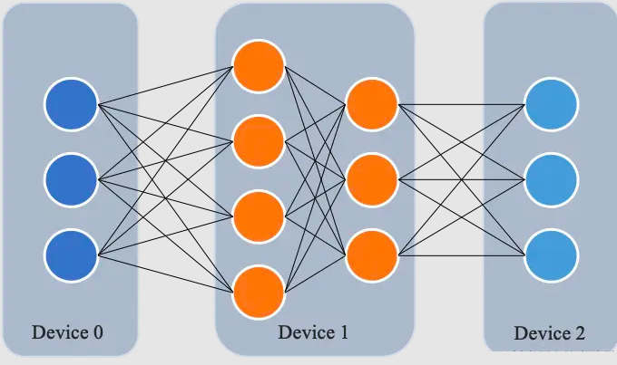
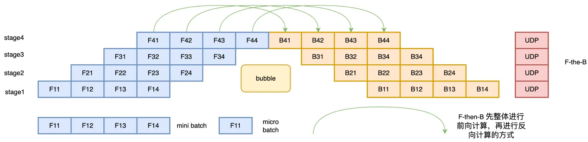
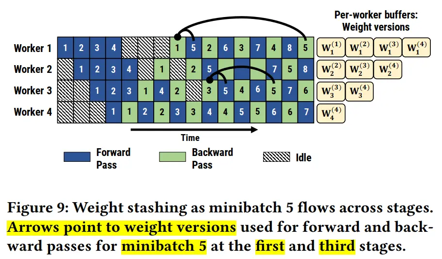
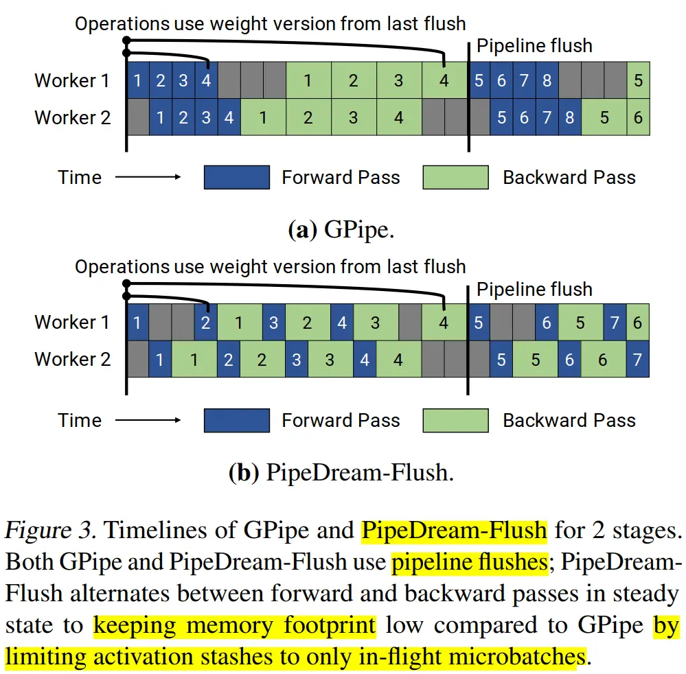
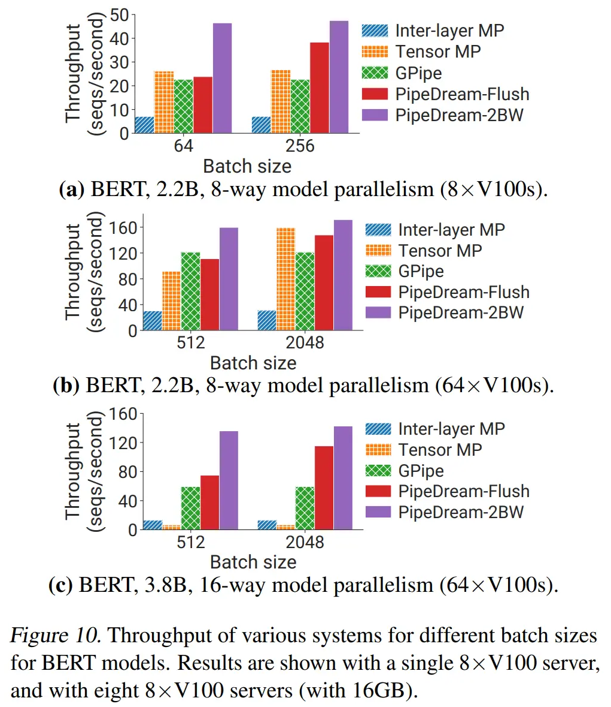

# 3.流水线并行

在数据并行训练中，一个明显的特点是每个 GPU 持有整个模型权重的副本，这就带来了冗余问题，虽然，FSDP 可以缓解冗余的问题，但是对于超大规模模型来说，仅使用数据并行进行分布式训练没办法使模型的参数规模进一步提升。因此，另一种并行技术是**模型并行**，即**模型被分割并分布在一个设备阵列上，每一个设备只保存模型的一部分参数**。

模型并行分为张量并行和流水线并行，张量并行为层内并行，对模型 Transformer 层内进行分割、流水线为层间并行，对模型不同的 Transformer 层间进行分割。


### 1.简介

所谓流水线并行，就是由于模型太大，无法将整个模型放置到单张GPU卡中；因此，将**模型的不同层放置到不同的计算设备**，降低单个计算设备的显存消耗，从而实现超大规模模型训练。
如下图所示，模型共包含四个模型层（如：Transformer层），被切分为三个部分，分别放置到三个不同的计算设备。即第 1 层放置到设备 0，第 2 层和第三 3 层放置到设备 1，第 4 层放置到设备 2。



相邻设备间通过通信链路传输数据。具体地讲，前向计算过程中，输入数据首先在设备 0 上通过第 1 层的计算得到中间结果，并将中间结果传输到设备 1，然后在设备 1 上计算得到第 2 层和第 3 层的输出，并将模型第 3 层的输出结果传输到设备 2，在设备 2 上经由最后一层的计算得到前向计算结果。反向传播过程类似。最后，各个设备上的网络层会使用反向传播过程计算得到的梯度更新参数。由于各个设备间传输的仅是相邻设备间的输出张量，而不是梯度信息，因此通信量较小。

### 2.朴素流水线并行

朴素流水线并行是实现流水线并行训练的最直接的方法。我们将模型按照层间切分成多个部分（Stage），并将每个部分（Stage）分配给一个 GPU。然后，我们对小批量数据进行常规的训练，在模型切分成多个部分的边界处进行通信。


下面以 4 层顺序模型为例：

```bash
output=L4(L3(L2(L1(input))))

```

将计算分配给两个 GPU，如下所示：

-   GPU1 computes: `intermediate=L2(L1(input))`
-   GPU2 computes: `output=L4(L3(intermediate))`

为了完成前向传播，我们在 GPU1 上计算中间值并将结果张量传输到 GPU2。 然后， GPU2 计算模型的输出并开始进行反向传播。 对于反向传播，我们从 GPU2 到 GPU1 的中间发送梯度。 然后， GPU1 根据发送的梯度完成反向传播。 这样，流水线并行训练会产生与单节点训练相同的输出和梯度。 朴素流水线并行训练相当于顺序训练，这使得调试变得更加容易。

下面说明了朴素流水线并行执行流程。 GPU1 执行前向传播并缓存激活（红色）。 然后，它使用 MPI 将 L2 的输出发送到 GPU2。 GPU2 完成前向传播，并使用目标值计算损失，完成之后开始反向传播。 一旦 GPU2 完成，梯度的输出被发送到 GPU1，从而完成反向传播。

请注意，这里仅使用了点到点通信（MPI.Send 和 MPI.Recv），并且不需要任何集体通信原语（因此，不需要 MPI.AllReduce）。


**朴素流水线并行存在的问题**：

那么该方法为什么被称为朴素流水线并行呢，它又有什么缺陷呢？

主要是因为该方案在任意给定时刻，除了一个 GPU 之外的其他所有 GPU 都是空闲的。因此，如果使用 4 个 GPU，则几乎等同于将单个 GPU 的内存量增加四倍，而其他资源 (如计算) 相当于没用上。所以，朴素流水线存在很多的Bubble。朴素流水线的 Bubble 的时间为 $O(\frac{K-1}{K})$，**当K越大，即GPU的数量越多时，空置的比例接近1，即GPU的资源都被浪费掉了**，因此，朴素的流水线并行将会导致**GPU使用率过低**。

另外，还需要加上在**设备之间复制数据的通信开销**；所以， 4 张使用朴素流水线并行的 6GB 卡将能够容纳 1 张 24GB 卡相同大小的模型，而后者训练得更快；因为，它没有数据传输开销。

还有**通信和计算没有交错**的问题：当我们通过网络发送中间输出 (FWD) 和梯度 (BWD) 时，没有 GPU 执行任何操作。

除此之外，还存在**高内存需求**的问题：先执行前向传播的GPU（如：GPU1）将保留整个小批量缓存的所有激活，直到最后。如果批量大小很大，可能会产生内存问题。

### 3.微批次流水线并行

微批次（MicroBatch）流水线并行与朴素流水线几乎相同，但它通过将传入的小批次（minibatch）分块为微批次（microbatch），并人为创建流水线来解决 GPU 空闲问题，从而允许不同的 GPU 同时参与计算过程，可以显著提升流水线并行设备利用率，减小设备空闲状态的时间。目前业界常见的流水线并行方法 GPipe 和 PipeDream 都采用微批次流水线并行方案。


### 4.GPipe

GPipe（Easy Scaling with Micro-Batch Pipeline Parallelism），由谷歌提出的一种流水线并行方案。最早，谷歌在Lingvo框架下开源了GPipe，基于 TensorFlow 库进行实现的。后来，Kakao Brain的工程师用 PyTorch 来实现了 GPipe，并开源出来，也就是 torchgpipe。之后，Facebook的FairScale库将torchgpipe集成到项目中。再后来，Facebook又将FairScale库中关于torchgpipe的部分代码集成到了PyTorch 1.8.0 之后的版本中。torchgpipe 的这部分代码被合并到 `torch/distributed/pipeline/sync` 目录下。

以下代码是基于PyTorch使用包含两个 FC 层的模型跨 GPU0 和 GPU1 进行流水线并行的示例：

```python
# Need to initialize RPC framework first.
os.environ['MASTER_ADDR'] = 'localhost'
os.environ['MASTER_PORT'] = '29500'
torch.distributed.rpc.init_rpc('worker', rank=0, world_size=1)

# 构建模型
fc1 = nn.Linear(16, 8).cuda(0)
fc2 = nn.Linear(8, 4).cuda(1)
model = nn.Sequential(fc1, fc2)

from torch.distributed.pipeline.sync import Pipe

# chunks表示micro-batches的大小，默认值为1
model = Pipe(model, chunks=8)
input = torch.rand(16, 16).cuda(0)
output_rref = model(input)

```

Gpipe 流水线并行主要用来解决这两个问题：

第一，**提高模型训练的并行度**。Gpipe 在朴素流水线并行的基础上，**利用数据并行的思想，将 mini-batch 细分为多个更小的 micro-batch，送入GPU进行训练**，来提高并行程度。


上图即为朴素流水线并行与 GPipe 微批次流水线并行对比，通过 GPipe 可以有效降低流水线并行bubble 空间的比例。其中，F的第一个下标表示 GPU 编号，F的第二个下标表示 micro-batch 编号。假设我们将 mini-batch 划分为 M 个，则 GPipe 流水线并行下， GPipe 流水线 Bubble 时间为： $O(\frac{K−1}{K+M-1})$。其中，K为设备，M为将mini-batch切成多少个micro-batch。当M>>K的时候，这个时间可以忽略不计。

但这样做也有一个坏处，那就是把 batch 拆小了之后，对于那些需要统计量的层（如：Batch Normalization），就会导致计算变得麻烦，需要重新实现。在Gpipe中的方法是，在训练时计算和运用的是micro-batch里的均值和方差，同时持续追踪全部mini-batch的移动平均和方差，以便在测试阶段进行使用。这样 Layer Normalization 则不受影响。

第二，**通过重计算（Re-materialization）降低显存消耗**。在模型训练过程中的前向传播时，会记录每一个算子的计算结果，用于反向传播时的梯度计算。


而 Re-materialization 可以不用保存中间层输出的激活值，在计算梯度的时候会重新计算出来这些激活值从而可以计算梯度。在 GPipe 中，应用了这个技术后，如果一个设备上有多层，那么就可以只保存多层中的最后一层的输出值。这样就降低了每个设备上内存占用峰值，同样的模型尺寸需要的显存就少了。

**Re-materialization并非是不需要中间结果，而是有办法在求导过程中实时的计算出之前被舍弃掉的中间结果**。

简而言之，GPipe 通过纵向对模型进行切分解决了单个设备无法训练大模型的问题；同时，又通过微批量流水线增加了多设备上的并行程度，除此之外，还使用re-materialization降低了单设备上的显存峰值。

上面讲述了 GPipe 流水线并行方案，接下来讲述一下 PipeDream 。讲述 PipeDream之前，我们先来看看流水线并行策略。

### 5.流水线并行策略

流水线并行根据执行的策略，可以分为 F-then-B 和 1F1B 两种模式。之前讲述的朴素流水线并行以及GPipe都是F-then-B模型，而后续讲述的 PipeDream 则是 1F1B 模式。

#### 5.1 F-then-B策略

F-then-B 模式，**先进行前向计算，再进行反向计算**。

F-then-B 模式由于缓存了多个 micro-batch 的中间变量和梯度，显存的实际利用率并不高。



#### 5.2 1F1B策略

1F1B（One Forward pass followed by One Backward pass）模式，**一种前向计算和反向计算交叉进行的方式**。在 1F1B 模式下，前向计算和反向计算交叉进行，可以及时释放不必要的中间变量。

1F1B 示例如下图所示，以 stage4 的 F42（**stage4 的第 2 个 micro-batch 的前向计算**）为例，F42 在计算前，F41 的反向 B41（stage4 的第 1 个 micro-batch 的反向计算）已经计算结束，即可释放 F41 的中间变量，从而 F42 可以**复用** F41 中间变量的显存。


研究表明，1F1B 方式相比于 F-then-B 方式，峰值显存可以节省 37.5%，对比朴素流水线并行峰值显存明显下降，设备资源利用率显著提升。

### 6.PipeDream（非交错式1F1B）-DeepSpeed

Gpipe 的流水线有以下几个问题：

-   将 mini-batch 切分成 m 份 micro-batch 后，将带来更频繁的流水线刷新（Pipeline flush），这降低了硬件效率，导致空闲时间的增加。


-   将 mini-batch 切分成 m 份 micro-batch 后， 需要缓存 m 份 activation，这将导致内存增加。原因是每个 micro-batch 前向计算的中间结果activation 都要被其后向计算所使用，所以需要在内存中缓存。即使使用了重计算技术，前向计算的 activation 也需要等到对应的后向计算完成之后才能释放。

而微软 DeepSpeed 提出的 PipeDream ，针对这些问题的改进方法就是 1F1B 策略。这种改进策略可以解决缓存 activation 的份数问题，使得 activation 的缓存数量只跟 stage 数相关，从而进一步节省显存，训练更大的模型。其解决思路就是努力减少每个 activation 的保存时间，即这就需要每个微批次数据尽可能早的完成后向计算，从而让每个 activation 尽可能早释放。


注意：**微批次在 GPipe 中叫 micro-batch，而在 PipeDream 叫 mini-batch**。为了避免干扰，本文统一使用 micro-batch。

PipeDream 具体方案如下：

-   一个阶段（stage）在做完一次 micro-batch 的前向传播之后，就立即进行 micro-batch 的后向传播，然后释放资源，那么就可以让其他 stage 尽可能早的开始计算，这就是 1F1B 策略。有点类似于把整体同步变成了众多小数据块上的异步，而且众多小数据块都是大家独立更新。
-   在 1F1B 的稳定状态（steady state,）下，会在每台机器上严格交替的进行前向计算/后向计算，这样使得每个GPU上都会有一个 micro-batch 数据正在处理，从而保证资源的高利用率（整个流水线比较均衡，没有流水线刷新（Pipeline Flush），这样就能确保以固定周期执行每个阶段上的参数更新。
-   面对流水线带来的异步性，**1F1B 使用不同版本的权重来确保训练的有效性**。



-   此外，PipeDream 还扩展了 1F1B，对于使用数据并行的 stage，采用轮询（round-robin）的调度模式将任务分配在同一个 stage 的各个设备上，保证了一个小批次的数据的前向传播计算和后向传播计算发生在同一台机器上，这就是 1F1B-RR（one-forward-noe-backward-round-robin）。

相比 GPipe，表面上看 PipeDream 在Bubble率上并没有优化，PipeDrea 流水线 Bubble 时间仍然为：$  O(\frac{K−1}{K+M-1}) $。但节省了显存之后，在设备显存一定的情况下，就可以通过增大 M 的值（增大micro-batch的个数）来降低Bubble率了。

### 7.PipeDream-2BW

在之前的流水线方案GPipe和PipeDream存在如下问题：

-   **GPipe 维护模型权重的单一版本，输入的小批次被分成更小的微批次**。权重梯度是累积的，不会立即应用，流水线会定期刷新，以确保不需要维护多个权重版本。 GPipe 提供类似于数据并行的权重更新语义，但是定期的流水线刷新可能会很昂贵，从而限制了吞吐量。减轻这种开销的一种方法是在流水线内执行额外的累积，但这并不总是实用的。
-   PipeDream 使用权重存储方案来确保相同输入的前向和后向传播中使用相同的权重版本。 在最坏的情况下，隐藏的权重版本总数为 d，其中， d 是流水线深度，这对于大模型来说太高了。 而且使用 PipeDream 默认的权重更新语义，每个阶段（state）的权重更新都有不同的延迟项；同时，流水线内不会执行累积。


基于此，作者提出了PipeDream-2BW。PipeDream-2BW 在流水线之中只维护了**两个版本的模型权重，2BW 是双缓冲权重**（double-buffered weights）。

PipeDream-2BW 会为每 m 个微批次生成一个新的权重版本（m>=d），其中，d为流水线深度，但是因为有些剩余后向传递仍然依赖于旧版本模型，所以新的模型版本无法立即取代旧版本，因此，新生成的权重版本需要缓冲以供将来使用。 然而，需要维护的权重版本总数最多为2，因为用于生成新权重版本的权重版本可以立即被丢弃（通过该阶段的后续的输入不再使用旧的权重版本），同时，由于只保存了两个版本，这极大的降低了内存的占用。


### 8.PipeDream-Flush（1F1B）

在 PipeDream 2BW 论文（Memory-Efficient Pipeline-Parallel DNN Training）中，还提到了一种变体 PipeDream-Flush， 使用 Flush 更新权重。它的内存占用量低于 PipeDream 2BW，但代价是吞吐量较低。该调度重用了微软的 PipeDream 中的 1F1B 调度策略；但是，同GPipe一样，**只维护单个权重版本并引入定期流水线刷新**（pipeline flush），以确保权重更新期间的权重版本保持一致，通过这种方式以执行性能为代价降低了峰值内存。下图显示了具有 2 个流水线阶段的 PipeDream-Flush 和 GPipe 的时间线。



下图展示了GPipe、PipeDream-Flush、PipeDream 2BW 流水线并行方法的吞吐量对比。



下图展示了GPipe、PipeDream-Flush、PipeDream 2BW 流水线并行方法的内存对比。


### 9.1F1B 调度（schedule）模式

上面讲述了 PipeDream，在使用 1F1B 策略时，存在两种调度模式：非交错调度和交错式调度。具体如下图所示，上面的部分显示了默认的非交错式调度（non-interleaved schedule），底部显示的是交错式调度（interleaved schedule）。


#### 9.1 非交错式调度

非交错式调度可分为三个阶段。第一阶段是热身阶段，处理器进行不同数量的前向计算。在接下来的阶段，处理器进行一次前向计算，然后是一次后向计算。最后一个阶段处理器完成后向计算。

上面的讲到微软的 PipeDream 就是使用非交错式 1F1B 调度。虽然，这种调度模式比 GPipe 更节省内存。然而，它需要和 GPipe 一样的时间来完成一轮计算。

#### 9.2 交错式调度

在交错式调度中，每个设备可以对多个层的子集（称为模型块）进行计算，而不是一个连续层的集合。

具体来看，在之前非交错式调度中，设备1拥有层1-4，设备2拥有层5-8，以此类推；但在交错式调度中，设备1有层1,2,9,10，设备2有层3,4,11,12，以此类推。在交错式调度模式下，流水线上的每个设备都被分配到多个流水线阶段（虚拟阶段，virtual stages），每个流水线阶段的计算量较少。

这种模式既节省内存又节省时间。但这个调度模式要求 micro-batch 的数量是流水线阶段（Stage）的整数倍。

英伟达 Megatron-LM 的流水线并行相关的论文（Efficient Large-Scale Language Model Training on GPU Clusters Using Megatron-LM）中采用了非交错式 1F1B 调度。

### 10.PipeDream（交错式1F1B）-Megatron-LM

Megatron-LM 基于 PipeDream-Flush 提出了一个小的Trick：交错式 1F1B 调度，而交错式 1F1B 调度也是 Megatron-LM 论文（Efficient Large-Scale Language Model Training on GPU Clusters Using Megatron-LM），virtual pipeline）中最主要的一个创新点。

传统的流水线并行通常会在一个设备（Device）上放置几个连续的模型层（如：Transformer层）。但 Megatron 这篇论文采用虚拟流水线（virtual pipeline），进行交错式1F1B并行。在设备数量不变的情况下，分出更多的流水线阶段（pipeline stage），以更多的通信量，换取流水线Bubble比率降低。

例如，之前如果每个设备有 4 层（即设备 1 有 1 – 4 层，设备 2 有 5 – 8 层，依此类推），现在我们可以让每个设备对两个模型块执行计算（每个模型块有 2 层） ，即设备 1 有第 1、2、9、10 层； 设备 2 有第 3、4、11、12 层，依此类推。 通过这种方案，流水线中的每个设备都被分配多个流水线阶段（与以前相比，每个流水线阶段的计算量更少）。


此外，该方案要求一个小批次中的微批次数量是管道并行大小（流水线中的设备数量）的整数倍。 例如，对于 4 个设备，一个小批次中的微批次数量必须是 4 的倍数。

那虚拟流水线（virtual pipeline）是怎么做到的呢？

对照上面示例图举例说明，若网络共16层（编号 0-15），4 个 Device，前述谷歌的 GPipe 和微软的 PipeDream 是分成 4 个 stage， 按编号 0-3 层放 Device1，4-7层放 Device2 ，以此类推。

英伟达的 virtual pipeline 则是按照文中提出的 virtual\_pipeline\_stage 概念减小切分粒度，以 virtaul\_pipeline\_stage=2 为例，将 0-1 层放 Device1, 2-3 层放在 Device2，...，6-7 层放到 Device4，8-9 层继续放在 Device1，10-11 层放在 Device2，...，14-15 层放在 Device4。

按照这种方式，Device之间的点对点通信次数(量)直接翻了virtual\_pipeline\_stage 倍，但空泡比率降低了，若定义每个 Device 上有 v 个 virtual stages，或者论文中也叫做 model chunks，在这个例子中 v=2，这样一来，空泡比率为：

$$
Bubble~ time~ fraction ~(pipeline~ bubble ~size) =\frac{t_{p b}^{\text {int. }}}{t_{i d}}=\frac{1}{v_{0}} \cdot \frac{p-1}{m_{\text {柆 }}}
$$

从上面公式可以看出空泡比率和 v 成反比，降低了 v 倍。当然，流水线气泡比率的降低并不是没有成本的：这个交错式调度需要额外的通信。 从数量上来说，通讯量也增加了 v 倍。 当然我们可以通过在多 GPU 服务器（例如： DGX A100 节点）中可以通过高速的网络带宽来减少这种额外通信的影响。英伟达论文中也探讨了使用 8 个 InfiniBand 网卡来减少这种额外通信的影响。

### 11.分布式训练框架流水线并行方案

上面讲述了目前主流的一些流水线并行（PP）方案，总的来说，PP可以细分为同步流水线并行(Sync-PP)和异步流水线并行(Async-PP)。

-   Sync-PP的代表有GPipe，PipeDream-flush等；
-   Async-PP的代表有PipeDream，PipeDream-2BW等。

同步方法与数据并行具有相同的权值更新语意，但是需要引入流水线bubble（空闲等待时间），会降低训练吞吐。而异步方法彻底消除的训练timeline中的bubble，但是需要引入不同的权值版本来解决权值过期的问题。

下面我们来看看几个知名的分布式训练框架中采用的流水线并行方案：

-   在 PyTorch 中，采用的是GPipe方案。使用的是F-then-B调度策略。
-   在 DeepSpeed 中，采用的是PipeDream-Flush，使用的是非交错式1F1B调度策略。使用这个调度方案，是为了促进最大规模的模型进行训练，在模型训练过程中中，存储多个权重缓冲可能会令人望而却步，我们的首要目标希望是一个“精确”的方法，而不需要收敛权衡。当然，DeepSpeed 引擎组件抽象出了流水线调度，你也可以自行实现其他的流水线调度方案。
-   在 Megatron-LM 中，基于PipeDream-Flush进行了改进，提供了一种交错式1F1B方案。
-   在 Colossal-AI 中，基于Megatron-LM的交错式1F1B方案，提供了非交错(`PipelineSchedule`) 和交错(`InterleavedPipelineSchedule`) 调度策略。

### 12.总结

本文首先讲述了朴素流水线并行，但是朴素的流水线并行在一个流水线并行组内，每一时刻只有一个GPU运行，这样将会导致GPU使用率极低。因此，谷歌提出了 Gpipe。

Gpipe 利用数据并行的思想，将 mini-batch 细分为多个更小的 micro-batch，送入GPU进行训练，来提高并行程度。将 mini-batch 拆分为 M个 micro-batch 后，导致更频繁的流水线刷新，降低硬件效率，同时，拆分为 M 个微批次之后，每个微批次反向传播过程中都会只用之前的激活值，因此，将导致内存占用更大。基于此，GPipe中使用重计算进行解决，前提是重计算出来的结果和之前得一样，并且前向的时间不能太长，否则流水线会被拉长太多。

后面提到了 F-then-B 和 1F1B 这两种流水线并行策略，F-then-B 可能会导致内存占用很高。而微软提出的 PipeDream 通过合理安排前向和反向过程的顺序（1F1B策略）来解决内存过高的问题。

相对于 GPipe，虽然 PipeDream 降低了内存的使用，但是其空泡（Bubble）率并没有降低。Megatron-LM的流水线并行方案中提出了交错式1F1B调度策略。进一步降低空泡（Bubble）率。但是，带来了额外的通信成本。其论文中提到了使用 IB 网络来缓解额外的通信影响。

说句题外话，在本文讲述的几种流水线并行方案中，除了 GPipe 之外，PipeDream及其变体的相关论文都有 Deepak Narayanan 的参与，真高产。
