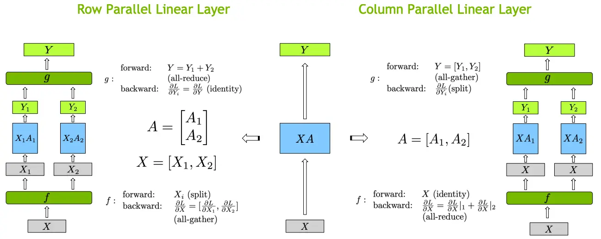
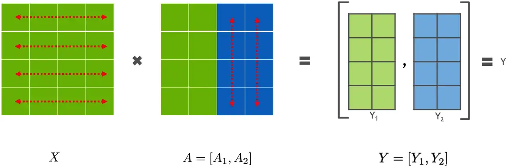
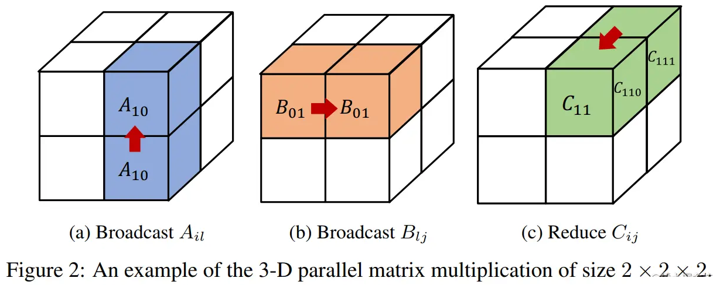
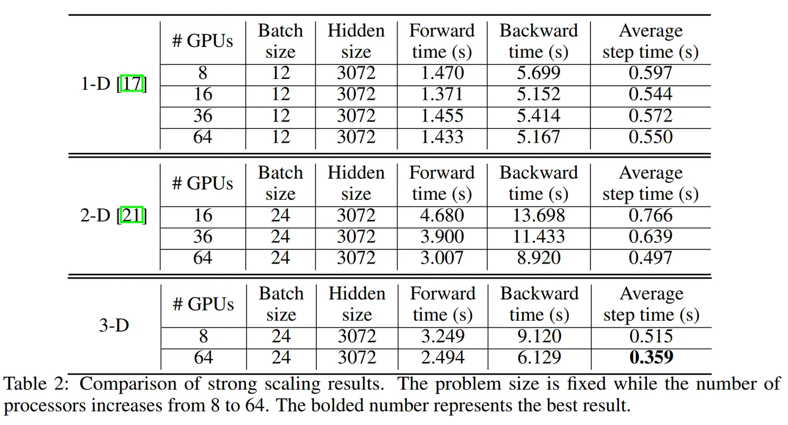

# 4.张量并行

和流水线并行类似，张量并行也是将模型分解放置到不同的GPU上，以解决单块GPU无法储存整个模型的问题。和流水线并行不同的地方在于，**张量并行是针对模型中的张量进行拆分，将其放置到不同的GPU上**。

### 1.简述

模型并行是不同设备负责单个计算图不同部分的计算。而将计算图中的层内的参数（张量）切分到不同设备（即层内并行），每个设备只拥有模型的一部分，以减少内存负荷，我们称之为张量模型并行。


张量并行从数学原理上来看就是对于`linear`层就是把矩阵分块进行计算，然后把结果合并；对于非`linear`层，则不做额外设计。

### 2.张量并行方式

张量切分方式分为按行进行切分和按列进行切分，分别对应**行并行（Row Parallelism）**与**列并行（Column Parallelism）**。


下面用通用矩阵的矩阵乘法（GEMM）来进行示例，看看线性层如何进行模型并行。假设 Y = XA ，对于模型来说，X 是输入，A是权重，Y是输出。



#### 2.1 行并行

行并行就是把权重 A 按照行分割成两部分。为了保证运算，同时我们也把 X 按照列来分割为两部分，具体如下所示：

$$
X A=\left[\begin{array}{ll}X 1 & X 2\end{array}\right]\left[\begin{array}{l}A 1 \\ A 2\end{array}\right]=X 1 A 1+X 2 A 2=Y 1+Y 2=Y
$$

这样，X1 和 A1 就可以放到 GPU0 之上计算得出 Y1，，X2 和 A2 可以放到第二个 GPU1 之上计算得出 Y2，然后，把Y1和Y2结果相加，得到最终的输出Y。


### 2.2 列并行

列并行就是把 A按照列来分割，具体示例如下：

$$
X A=[X]\left[\begin{array}{ll}A 1 & A 2\end{array}\right]=\left[\begin{array}{ll}X A 1 & X A 2\end{array}\right]=\left[\begin{array}{ll}Y 1 & Y 2\end{array}\right]=Y
$$

这样，将 X 分别放置在GPU0 和GPU1，将 A1 放置在 GPU0，将 A2 放置在 GPU1，然后分别进行矩阵运行，最终将2个GPU上面的矩阵拼接在一起，得到最终的输出Y。



### 3. 1维（1D）张量并行（Megatron-LM）

张量并行则涉及到不同的分片 (sharding)方法，现在最常用的都是 1D 分片，即**将张量按照某一个维度进行划分（横着切或者竖着切）**。

目前，在基于Transformer架构为基础的大模型中，最常见的张量并行方案由[Megatron-LM](https://link.juejin.cn?target=https://deepakn94.github.io/assets/papers/megatron-sc21.pdf "Megatron-LM")提出，它是一种高效的一维（1D）张量并行实现。它**采用的则是非常直接的张量并行方式，对权重进行划分后放至不同GPU上进行计算**。

如下图所示，对于一个基于 Transformer 结构的模型来说，主要由一个 N 层 Transformer 块组成，除此之外还有输入和输出 Embedding 层。


而一个 Transformer 层里面主要由由自注意力（Self-Attention）和 MLP 组成。因此，本方案主要针对多头注意力（MHA）块和MLP块进行切分进行模型并行。

对于 MLP 层切分相对来说比较简单，该层主要由一个GELU是激活函数，以及 A 和 B 两个线性层组成。其中，`f` 和 `g` 分别表示两个算子，每个算子都包含一组forward + backward 操作。f 和 g 是共轭的。


在MLP层中，**先对A采用“列切割”，然后对B采用“行切割”** 。

-   `f` 的 forward 计算：把输入X拷贝到两块GPU上，每块GPU即可独立做forward计算。
-   `g` 的 forward 计算：每块GPU上的forward的计算完毕，取得Z1和Z2后，GPU间做一次**AllReduce**，相加结果产生Z。
-   `g` 的 backward 计算：只需要把$\frac{\partial L}{\partial Z}$拷贝到两块GPU上，两块GPU就能各自独立做梯度计算。
-   `f` 的 backward 计算：当前层的梯度计算完毕，需要传递到下一层继续做梯度计算时，我们需要求得 $\frac{\partial L}{\partial X}$。则此时两块GPU做一次**AllReduce**，把各自的梯度 $\frac{\partial L}{\partial X_1}$和 $ \frac{\partial L}{\partial X_2}  $相加即可。

对于 MHA 层进行切分稍微会复杂一点。一个MHA层由多个自注意力块组成。每个自注意力头都可以独立计算，最后，再将结果拼接（concat）起来。也就是说，**可以把每个头的参数放到一块GPU上**。


在 MHA 层，对三个参数矩阵Q，K，V，**按照“列切割”** ，每个头放到一块GPU上，做并行计算。对线性层B，**按照“行切割”** 。切割的方式和 MLP 层基本一致，其forward与backward原理也一致，这里不再赘述。


最后，在实际应用中，**并不一定按照一个head占用一块GPU来切割权重，我们也可以一个多个head占用一块GPU，这依然不会改变单块GPU上独立计算的目的。所以实际设计时，我们尽量保证head总数能被GPU个数整除****。** ​

现在，将 MLP 与 MHA 块放置在一起，一个 Transformer 层的张量模型并行如下所示：


可以看到，一个 Transformer 层的正向和反向传播中总共有 4 个 All-Reduce 通信操作。

上面提到了对于一个 Transformer 结构的模型来说，通常，还有一个输入Embeding和一个输出Embeding层，其维数为 (v, h)，其中，h表示隐藏大小，v表示词汇量大小。

由于现代语言模型的词汇量约为数万个（例如，GPT-2使用的词汇量为50257），因此，将 Embeding 层 GEMM 进行并行化是非常有益的。然而，在Transformer语言模型中，为了节约内存，通常输出 Embeding 层与输入 Embeding 层共享权重，因此，需要对两者进行修改。

在Embbedding层，按照词的维度切分，即每张卡只存储部分词向量表，然后，通过 All Gather 汇总各个设备上的部分词向量结果，从而得到完整的词向量结果

在 Megatron-LM 中，通过如下方法来初始化张量并行、流水线并行以及数据并行组。

```python
from megatron.core import mpu, tensor_parallel

mpu.initialize_model_parallel(args.tensor_model_parallel_size,
                  args.pipeline_model_parallel_size,
                  args.virtual_pipeline_model_parallel_size,
                  args.pipeline_model_parallel_split_rank)

```

在给定 P 个处理器的情况下，下面为理论上的计算和内存成本，以及基于环形（ring）算法的1D 张量并行的前向和后向的通信成本。

| 计算     | 内存 (参数) | 内存 (activations) | 通信 (带宽)     | 通信 (时延)   |
| ------ | ------- | ---------------- | ----------- | --------- |
| O(1/P) | O(1/P)  | O(1)             | O(2(P−1)/P) | O(2(P−1)) |

### 4.多维张量并行

英伟达Megatron-LM的张量并行本质上使用的是 1 维矩阵划分，这种方法虽然将参数划分到多个处理器上，但每个处理器仍需要存储整个中间激活，在处理大模型时会浪费大量显存空间。此外，由于仅采用1维矩阵划分，**在每次计算中，每个处理器都需要与其他所有处理器进行通信**，因此，通信成本会随并行度增高而激增。

显然，1 维张量并行已无法满足当前超大AI模型的需求。对此，Colossal-AI 提供多维张量并行，即以 2/2.5/3 维方式进行张量并行。


#### 4.1 2D张量并行

Megatron中的 1D 张量并行方案并没有对激活（activations）进行划分，对于大模型而言，这也会消耗大量的内存。


为了平均分配计算和内存负荷，在 SUMMA 算法（一种可扩展的通用矩阵乘法算法，并行实现矩阵乘法）的基础上， [2D 张量并行](https://link.juejin.cn/?target=https://arxiv.org/pdf/2104.05343.pdf "2D 张量并行") 被引入。它**把 input 和 weight 都沿着两个维度均匀切分**。


这里还是以线性层 $Y=XA$为例。给定$P=q \times q$个处理器（必要条件），如果$q=2$，我们把输入$X$和权重$A$都划分为：

$$
\left[\begin{array}{ll}X_{00} & X_{01} \\ X_{10} & X_{11}\end{array}\right] 和 \left[\begin{array}{ll}A_{00} & A_{01} \\ A_{10} & A_{11}\end{array}\right]
$$

该计算包括$q$步。

当$t=1$时，即第一步，$X_{i0}$ (即: $\left[\begin{array}{l}X_{00} \\ X_{10}\end{array}\right]$)在其行中被广播，而$A_{0j}$（即：$\left[\begin{array}{ll}A_{00} & A_{01}\end{array}\right]$）在其列中被广播。因此，我们有

$$
\left[\begin{array}{ll}X_{00}, A_{00} & X_{00}, A_{01} \\ X_{10}, A_{00} & X_{10}, A_{01}\end{array}\right]
$$

然后，我们在每个处理器$(i,j)$上将 $X_{i0}$和$A_{0j}$相乘为

$$
\left[\begin{array}{ll}X_{00} A_{00} & X_{00} A_{01} \\ X_{10} A_{00} & X_{10} A_{01}\end{array}\right] (1).
$$

同样，当$t=2$时，$X_{i1}$在其行中被广播，$A_{1j}$在其列中被广播，我们将他们相乘为

$$
\left[\begin{array}{ll}X_{01} A_{10} & X_{01} A_{11} \\ X_{11} A_{10} & X_{11} A_{11}\end{array}\right] (2).
$$

之后，通过将(1)和(2)相加，我们有

$$
Y=X A=\left[\begin{array}{ll}X_{00} A_{00}+X_{01} A_{10} & X_{00} A_{01}+X_{01} A_{11} \\ X_{10} A_{00}+X_{11} A_{10} & X_{10} A_{01}+X_{11} A_{11}\end{array}\right]
$$

虽然，(1)和 (2)两个矩阵的结果仍然需要串行的计算。但是，单个矩阵（X 和 A）中的 4 个子矩阵可以使用 2×2 的处理器来并行计算。

在给定$  P=q×q $ 个处理器, 下面为理论上的计算和内存成本，以及基于环形算法的2D张量并行的前向和后向的通信成本。

| 计算         | 内存 (参数)    | 内存 (activations) | 通信 (带宽)       | 通信 (时延)     |
| ---------- | ---------- | ---------------- | ------------- | ----------- |
| $O(1/q^2)$ | $O(1/q^2)$ | $O(1/q^2)$       | $O(6(q−1)/q)$ | $O(6(q−1))$ |

通过 2D 并行，可以大大降低 Activation 的大小，因此，BatchSize可以大幅提升。

在 Colossal-AI 中，2D 张量并行示例如下所示：

```python
import colossalai  
import colossalai.nn as col_nn  
import torch  
from colossalai.utils import print_rank_0
from colossalai.context import ParallelMode
from colossalai.core import global_context as gpc
from colossalai.utils import get_current_device

# 并行设置
CONFIG = dict(parallel=dict(
    data=1,
    pipeline=1,
    tensor=dict(size=4, mode='2d'),
))

parser = colossalai.get_default_parser()  
    colossalai.launch(config=CONFIG,  
    rank=args.rank,  
    world_size=args.world_size,  
    local_rank=args.local_rank,  
    host=args.host,  
    port=args.port)  
  
class MLP(torch.nn.Module):  
    def __init__(self, dim: int = 256):  
        super().__init__()  
        intermediate_dim = dim * 4  
        self.dense_1 = col_nn.Linear(dim, intermediate_dim)  
        print_rank_0(f'Weight of the first linear layer: {self.dense_1.weight.shape}')  
        self.activation = torch.nn.GELU()  
        self.dense_2 = col_nn.Linear(intermediate_dim, dim)  
        print_rank_0(f'Weight of the second linear layer: {self.dense_2.weight.shape}')  
        self.dropout = col_nn.Dropout(0.1)  

    def forward(self, x):  
        x = self.dense_1(x)  
        print_rank_0(f'Output of the first linear layer: {x.shape}')  
        x = self.activation(x)  
        x = self.dense_2(x)  
        print_rank_0(f'Output of the second linear layer: {x.shape}')  
        x = self.dropout(x)  
        return x

# 创建模型
m = MLP()

# 随机输入一些数据来运行这个模型
x = torch.randn((16, 256), device=get_current_device())

# partition input
torch.distributed.broadcast(x, src=0)
x = torch.chunk(x, 2, dim=0)[gpc.get_local_rank(ParallelMode.PARALLEL_2D_COL)]
x = torch.chunk(x, 2, dim=-1)[gpc.get_local_rank(ParallelMode.PARALLEL_2D_ROW)]
print_rank_0(f'Input: {x.shape}')

x = m(x)
```

#### 4.2 2.5D张量并行

与一维张量并行相比，二维并行降低了内存成本，但可能引入更多的通信。因此，[2.5D张量并行](https://link.juejin.cn/?target=https://arxiv.org/pdf/2105.14500.pdf "2.5D张量并行") 在 2D SUMMA 的基础上被提出，它通过使用更多的设备($ P=q×q×d  $个处理器)来减少通信。


这里还是以线性层 $Y=XA$为例。给定$P=q \times q \times d$个处理器（必要条件），如果$q=d=2$.

首先，我们把输入$X$划分为 $d\times q$行和q列：

$$
\left[\begin{array}{ll}X_{00} & X_{01} \\ X_{10} & X_{11} \\ X_{20} & X_{21} \\ X_{30} & X_{31}\end{array}\right]
$$

它可以被重塑为 $d$ 层

$$
\left[\begin{array}{ll}X_{00} & X_{01} \\ X_{10} & X_{11}\end{array}\right] 和 \left[\begin{array}{ll}X_{20} & X_{21} \\ X_{30} & X_{31}\end{array}\right]
$$

另外，权重A被分割为

$$
\left[\begin{array}{ll}A_{00} & A_{01} \\ A_{10} & A_{11}\end{array}\right]
$$

对于X相关的每一层，我们使用SUMMA算法将X与A相乘。然后，我们得到输出

$$
\begin{array}{c}{\left[\begin{array}{ll}Y_{00}=X_{00} A_{00}+X_{01} A_{10} & Y_{01}=X_{00} A_{01}+X_{01} A_{11} \\ Y_{10}=X_{10} A_{00}+X_{11} A_{10} & Y_{11}=X_{10} A_{01}+X_{11} A_{11}\end{array}\right] \text { 和 }} \\ {\left[\begin{array}{ll}Y_{20}=X_{20} A_{00}+X_{21} A_{10} & Y_{21}=X_{20} A_{01}+X_{21} A_{11} \\ Y_{30}=X_{30} A_{00}+X_{31} A_{10} & Y_{31}=X_{30} A_{01}+X_{31} A_{11}\end{array}\right] .}\end{array}
$$

最后，将两个矩阵的垂直拼接操作，结果如下所示：

$$
\left[\begin{array}{ll}Y_{00} & X_{01} \\ Y_{10} & Y_{11} \\ Y_{20} & Y_{21} \\ Y_{30} & Y_{31}\end{array}\right]
$$

基于上面的推导，可以发现被拼接的两个矩阵天然可以并行计算。**看到这里，应该就可以发现这两个矩阵乘法就是上面的 2D 张量并行的形式。**

这里，我们总计有 2×2×2=8 个处理器，每 2×2=4 个处理器使用 2D 张量并行来处理对应的矩阵乘法。最后，将两个 2D 张量并行的结果进行拼接即可。


在给定 P=q×q×d 个处理器的情况下, 下面为理论上的计算和内存成本，以及基于环形算法的2.5D张量并行的前向和后向的通信成本。

| 计算          | 内存 (参数)    | 内存 (activations) | 通信 (带宽)             | 通信 (时延)     |
| ----------- | ---------- | ---------------- | ------------------- | ----------- |
| $O(1/dq^2)$ | $O(1/q^2)$ | $O(1/dq^2)$      | $O(3(q−1)(d+1)/dq)$ | $O(6(q−1))$ |

在 Colossal-AI 中，2.5D 张量并行示例如下所示：

```python
# 并行设置
CONFIG = dict(parallel=dict(  
    data=1,  
    pipeline=1,  
    tensor=dict(size=8, mode='2.5d', depth=2),  
))

...
  
# 创建模型
m = MLP()

# 随机输入一些数据来运行这个模型
x = torch.randn((16, 256), device=get_current_device())

# partition input  
torch.distributed.broadcast(x, src=0)  
x = torch.chunk(x, 2, dim=0)[gpc.get_local_rank(ParallelMode.PARALLEL_2P5D_DEP)]  
x = torch.chunk(x, 2, dim=0)[gpc.get_local_rank(ParallelMode.PARALLEL_2P5D_COL)]  
x = torch.chunk(x, 2, dim=-1)[gpc.get_local_rank(ParallelMode.PARALLEL_2P5D_ROW)]  
print_rank_0(f'Input: {x.shape}')  
  
x = m(x)

```

之所以叫 2.5D 张量并行是因为在 d = 1 时，这种并行模式可以退化成 2D 张量并行；在 d = q 时，它就变成了3D 张量并行。下面我们来看看 3D 张量并行。

#### 4.3 3D张量并行

之前的 3D 并行矩阵乘法对矩阵做了广播，造成了很大的内存冗余。



为了去除掉这种冗余性，Colossal-AI 把模型的矩阵进一步做了一个细粒度的划分。


Colossal-AI 的 3D 张量并行是一种将神经网络模型的计算并行化，以期望获得最佳通信成本优化的方法。与现有的 1D 和 2D 张量并行相比，具有更少的内存和网络通信开销。


论文中在64卡V100上面实验，3D张量并行相比1D张量和2D张量来说，训练速度更快。



这里还是以线性层 $Y=XA$为例。给定$P=q \times q \times q$个处理器（必要条件），如果$q=2$,我们把输入X和权重A分别划分为.

$$
\left[\begin{array}{ll}X_{000} & X_{001} \\ X_{010} & X_{011} \\ X_{100} & X_{101} \\ X_{110} & X_{111}\end{array}\right] 和 \left[\begin{array}{llll}A_{000} & A_{001} & A_{010} & A_{011} \\ A_{100} & A_{101} & A_{110} & A_{111}\end{array}\right],
$$

其中，每个$X_{ijl}$和$A_{lji}$都被存储在处理器$(i,j,l)$上，如下图所示


然后，我们在$(i, 0...q, l)$上收集$X_{ijl}$，以及在$(i, 0...q, l)$上收集$A_{lji}$

因此，我们在每个处理器 $(i,j,l)$ 上都有$  X_{il}  $和 $A_{lj}$以获得 $X_{il}A_{lj}$。 最后，我们在 $(i, j, 0...q)$对结果进行 reduce-scatter 得到 $Y_{ijl}$, 形成了

$$
Y=\left[\begin{array}{ll}Y_{000} & Y_{001} \\ Y_{010} & Y_{011} \\ Y_{100} & Y_{101} \\ Y_{110} & Y_{111}\end{array}\right]
$$

还需要注意的是，在后向传播中, 我们需要 all-gather 梯度 $\dot{Y_{ijl}}$；然后， reduce-scatter 梯度 $\dot{X_{il}}=\dot{Y_{ij}}A_{lj}^T$ 和 $\dot{A_{lj}}=X_{il}^T\dot{Y_{ij}}$。

在给定$ P=q×q×q$ 个处理器的情况下, 下面为理论上的计算和内存成本，以及基于环形算法的3D张量并行的前向和后向的通信成本。

| 计算         | 内存 (参数)    | 内存 (activations) | 通信 (带宽)         | 通信 (时延)     |
| ---------- | ---------- | ---------------- | --------------- | ----------- |
| $O(1/q^3)$ | $O(1/q^3)$ | $O(1/q^3)$       | $O(6(q−1)/q^3)$ | $O(6(q−1))$ |

在 Colossal-AI 中，3D 张量并行示例如下所示：

```python
# 并行设置
CONFIG = dict(parallel=dict(  
    data=1,  
    pipeline=1,  
    tensor=dict(size=8, mode='3d'),  
))

...
  
# 创建模型
m = MLP()

# 随机输入一些数据来运行这个模型
x = torch.randn((16, 256), device=get_current_device())

# partition input  
torch.distributed.broadcast(x, src=0)  
x = torch.chunk(x, 2, dim=0)[gpc.get_local_rank(ParallelMode.PARALLEL_3D_WEIGHT)]  
x = torch.chunk(x, 2, dim=0)[gpc.get_local_rank(ParallelMode.PARALLEL_3D_INPUT)]  
x = torch.chunk(x, 2, dim=-1)[gpc.get_local_rank(ParallelMode.PARALLEL_3D_OUTPUT)]  
print_rank_0(f'Input: {x.shape}')  
  
x = m(x)
```

### 5.Pytorch中的张量并行

当训练非常大的模型时，用户希望一起使用数据并行、张量并行、流水线并行，而现有解决方案的互操作性不是很好并且通常难以使用。最大的原因之一是没有通用的抽象来在不同的并行策略之间架起桥梁。

与此同时，无论是 Megatron-LM 还是 Colossal-AI 中的张量并行，都是基于 Transformer 架构模型提供的张量并行解决方案，不具备通用性。而 PyTorch 作为一个深度学习框架，肯定需要从更加通用的层面来进行设计，而不是仅针对某一类模型。

受 GSPMD、Oneflow 和 TF DTensor 的启发，PyTorch 从 2.0.0 开始引入 DTensor 作为下一代 ShardedTensor，为分布式存储和计算提供基本抽象。它作为分布式程序翻译和描述分布式训练程序的布局的基本构建块之一。通过DTensor抽象，我们可以无缝构建张量并行、DDP和FSDP等并行策略

PyTorch DTensor 主要用途：

-   提供在 checkpointing 期间保存/加载 state\_dict 的统一方法，即使存在复杂的张量存储分配策略，例如：将张量并行与 FSDP 中的参数分片相结合。
-   在 eager 模式下启用张量并行。 与 ShardedTensor 相比，DistributedTensor 允许更灵活地混合分片和复制。
-   充当 SPMD 编程模型的入口点和基于编译器的分布式训练的基础构建块。

PyTorch 中张量并行具体示例如下所示：

```python
from torch.distributed._tensor import DeviceMesh
from torch.distributed.tensor.parallel import PairwiseParallel, parallelize_module

# 通过设备网格根据给定的 world_size 创建分片计划
device_mesh = DeviceMesh("cuda", torch.arange(0, args.world_size))

# 创建模型并移动到GPU
model = ToyModel().cuda(rank)

# 为并行化模块创建优化器
LR = 0.25
optimizer = torch.optim.SGD(model.parameters(), lr=LR)

# 根据给定的并行风格并行化模块，
# 这里指定为PairwiseParallel，将 colwise 和 rowwise 样式串联为固定对，就像 [Megatron-LM](https://arxiv.org/abs/1909.08053) 所做的那样。
model = parallelize_module(model, device_mesh, PairwiseParallel())

# 对分片模块执行多次前向/后向传播和优化器对参数进行更新。
for i in range(args.iter_nums):
    # 对于 TP，所有 TP rank 的输入需要相同。
    # 设置随机种子是为了模仿数据加载器的行为。
    if rank==0:
        print(f"-----------{i}--------------")
    torch.manual_seed(i)
    inp = torch.rand(20, 10).cuda(rank)
    if rank==0:
        print(f"rank: {rank} , input shape: {inp.shape}")
    output = model(inp)
    if rank==0:
        print(f"rank: {rank} , input shape: {output.shape}")
    output.sum().backward()
    optimizer.step()

```

### 6.总结

本文主要针对 Megatron-LM 和 Colossal-AI 的张量并行方案进行了讲解。其中，Megatron-LM 提出了一种高效的一维（1D）张量并行化实现。这种方法虽然将参数划分到多个处理器上，但每个处理器仍需要存储整个中间激活，在处理大模型时会消耗大量的显存空间。此外，由于仅采用1维矩阵划分，在每次计算中，每个处理器都需要与其他所有处理器进行通信；因此，通信成本会随并行度增高而激增。显然，1维张量并行已无法满足当前超大AI模型的需求。对此，Colossal-AI提供多维张量并行，即以2/2.5/3维方式进行张量并行。

无论是 Megatron-LM 还是 Colossal-AI，都是基于 Transformer 架构模型提供的张量并行解决方案，不具备通用性。因此，本文还简要介绍了 PyTorch 中的张量并行解决方案。
