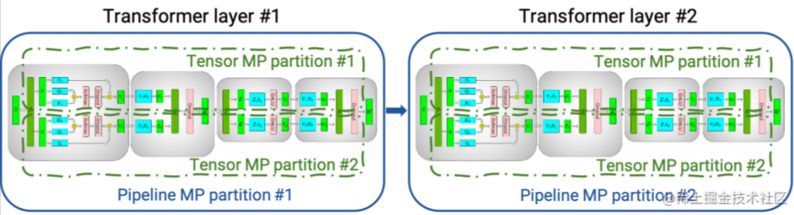
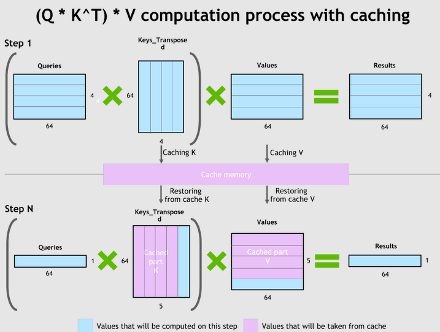

# 3.faster\_transformer

> **Note: FasterTransformer development has transitioned to **[**TensorRT-LLM**](https://github.com/NVIDIA/TensorRT-LLM/tree/release/0.5.0 "TensorRT-LLM")**. All developers are encouraged to leverage TensorRT-LLM to get the latest improvements on LLM Inference. The NVIDIA/FasterTransformer repo will stay up, but will not have further development.**

### 1.**简介**

[**NVIDIA FasterTransformer (FT)**](https://link.zhihu.com/?target=https://github.com/NVIDIA/FasterTransformer/ "NVIDIA FasterTransformer (FT)") 是一个用于实现基于Transformer的神经网络推理的加速引擎。它包含Transformer块的高度优化版本的实现，其中包含编码器和解码器部分。使用此模块，您可以运行编码器-解码器架构模型（如：T5）、仅编码器架构模型（如：BERT）和仅解码器架构模型（如： GPT）的推理。

FT框架是用C++/CUDA编写的，依赖于高度优化的 cuBLAS、cuBLASLt 和 cuSPARSELt 库，这使您可以在 GPU 上进行快速的 Transformer 推理。

与 NVIDIA TensorRT 等其他编译器相比，FT 的最大特点是它支持以分布式方式进行 Transformer 大模型推理。

下图显示了如何使用张量并行 (TP) 和流水线并行 (PP) 技术将基于Transformer架构的神经网络拆分到多个 GPU 和节点上。

-   当每个张量被分成多个块时，就会发生张量并行，并且张量的每个块都可以放置在单独的 GPU 上。在计算过程中，每个块在不同的 GPU 上单独并行处理；最后，可以通过组合来自多个 GPU 的结果来计算最终张量。
-   当模型被深度拆分，并将不同的完整层放置到不同的 GPU/节点上时，就会发生流水线并行。

在底层，节点间或节点内通信依赖于 MPI 、 NVIDIA NCCL、Gloo等。因此，使用FasterTransformer，您可以在多个 GPU 上以张量并行运行大型Transformer，以减少计算延迟。同时，TP 和 PP 可以结合在一起，在多 GPU 节点环境中运行具有数十亿、数万亿个参数的大型 Transformer 模型。

除了使用 C ++ 作为后端部署，FasterTransformer 还集成了 TensorFlow（使用 TensorFlow op）、PyTorch （使用 Pytorch op）和 Triton 作为后端框架进行部署。当前，TensorFlow op 仅支持单 GPU，而 PyTorch op 和 Triton 后端都支持多 GPU 和多节点。

### 2.**FasterTransformer 中的优化技术**

与深度学习训练的通用框架相比，FT 使您能够获得更快的推理流水线以及基于 Transformer 的神经网络具有更低的延迟和更高的吞吐量。 FT 对 GPT-3 和其他大型 Transformer 模型进行的一些优化技术包括：

#### 2.1 层融合（Layer fusion）

这是预处理阶段的一组技术，将多层神经网络组合成一个单一的神经网络，将使用一个单一的核（kernel）进行计算。 这种技术减少了数据传输并增加了数学密度，从而加速了推理阶段的计算。 例如， multi-head attention 块中的所有操作都可以合并到一个核（kernel）中。

#### 2.2 自回归模型的推理优化(激活缓存)

为了防止通过Transformer重新计算每个新 token 生成器的先前的key和value，FT 分配了一个缓冲区来在每一步存储它们。

虽然需要一些额外的内存使用，但 FT 可以节省重新计算的成本。该过程如下图所示，相同的缓存机制用于 NN 的多个部分。

#### 2.3 内存优化

与 BERT 等传统模型不同，大型 Transformer 模型具有多达数万亿个参数，占用数百 GB 存储空间。即使我们以半精度存储模型，GPT-3 175b 也需要 350 GB。因此有必要减少其他部分的内存使用。

例如，在 FasterTransformer 中，**在不同的解码器层重用了激活/输出的内存缓冲（buffer）**。由于 GPT-3 中的层数为 96，因此我们只需要 1/96 的内存量用于激活。

#### 2.4 使用 MPI 和 NCCL 实现节点间/节点内通信并支持模型并行

FasterTransormer 同时提供张量并行和流水线并行。 对于张量并行，FasterTransformer 遵循了 [**Megatron**](https://link.zhihu.com/?target=https://arxiv.org/pdf/1909.08053.pdf "Megatron") 的思想。 对于自注意力块和前馈网络块，FT 按行拆分第一个矩阵的权重，并按列拆分第二个矩阵的权重。 通过优化，FT 可以将每个 Transformer 块的归约（reduction）操作减少到两次。

对于流水线并行，FasterTransformer 将整批请求拆分为多个微批，隐藏了通信的空泡（bubble）。 FasterTransformer 会针对不同情况自动调整微批量大小。

#### 2.5 MatMul 核自动调整（GEMM 自动调整）

矩阵乘法是基于 Transformer 的神经网络中最主要和繁重的操作。 FT 使用来自 CuBLAS 和 CuTLASS 库的功能来执行这些类型的操作。 重要的是要知道 MatMul 操作可以在“硬件”级别使用不同的底层（low-level）算法以数十种不同的方式执行。

[**GemmBatchedEx**](https://link.zhihu.com/?target=https://docs.nvidia.com/cuda/cublas/index.html#cublas-GemmBatchedEx "GemmBatchedEx") 函数实现了 MatMul 操作，并以cublasGemmAlgo\_t作为输入参数。 使用此参数，您可以选择不同的底层算法进行操作。

FasterTransformer 库使用此参数对所有底层算法进行实时基准测试，并为模型的参数和您的输入数据（注意层的大小、注意头的数量、隐藏层的大小）选择最佳的一个。 此外，FT 对网络的某些部分使用硬件加速的底层函数，例如： **expf、** shfl\_xor\_sync。

#### 2.6 低精度推理

FT 的核（kernels）**支持使用 fp16 和 int8 等低精度输入数据进行推理**。 由于较少的数据传输量和所需的内存，这两种机制都会加速。 同时，int8 和 fp16 计算可以在特殊硬件上执行，例如：Tensor Core（适用于从 Volta 开始的所有 GPU 架构）。

除此之外还有**快速的 C++ BeamSearch 实现**、当模型的权重部分分配到八个 GPU 之间时，**针对 TensorParallelism 8 模式优化的 all-reduce**。

### 3.**支持的模型**

目前，FT 支持了 Megatron-LM GPT-3、GPT-J、BERT、ViT、Swin Transformer、Longformer、T5 和 XLNet 等模型。您可以在 GitHub 上的[FasterTransformer](https://link.zhihu.com/?target=https://github.com/NVIDIA/FasterTransformer#support-matrix "FasterTransformer")库中查看最新的支持矩阵。

### 4.**存在的问题**

**英伟达新推出了TensorRT-LLM，相对来说更加易用，后续FasterTransformer将不再为维护了**。
