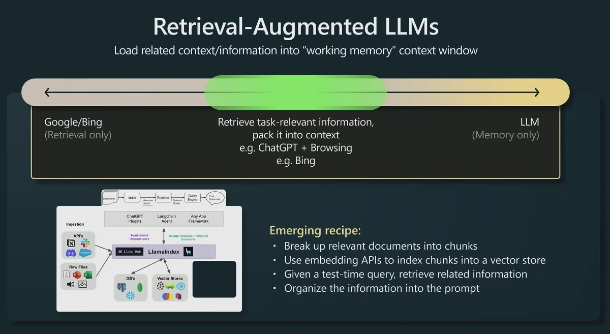
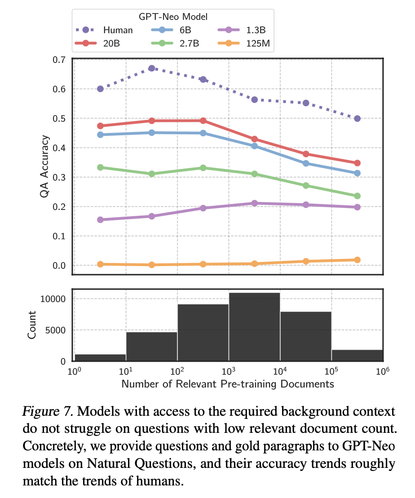
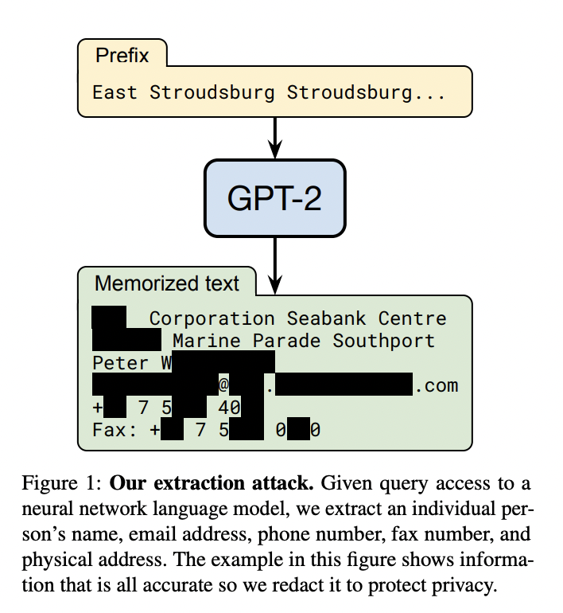
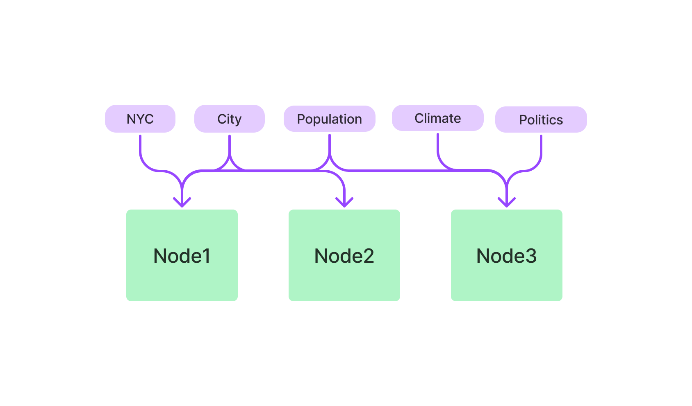
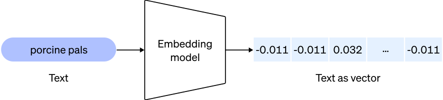
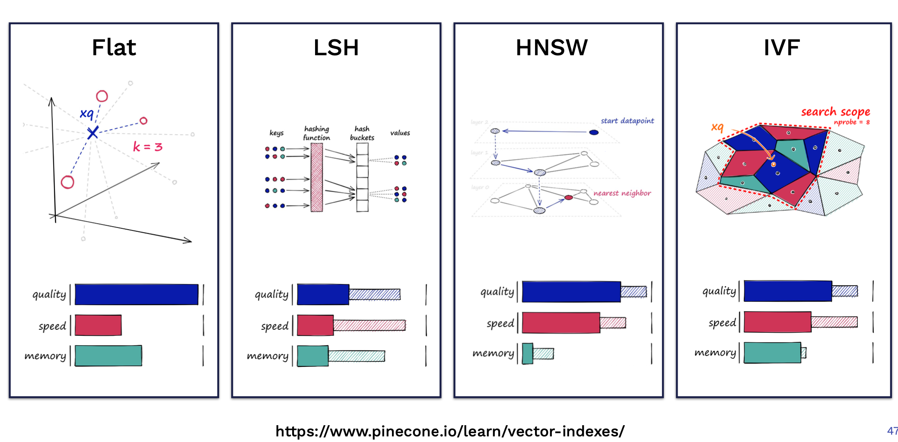
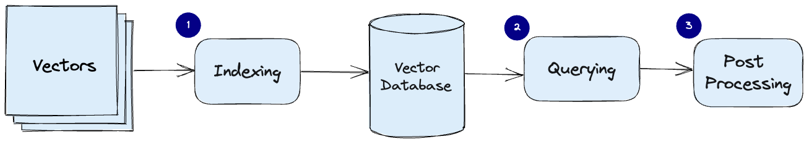
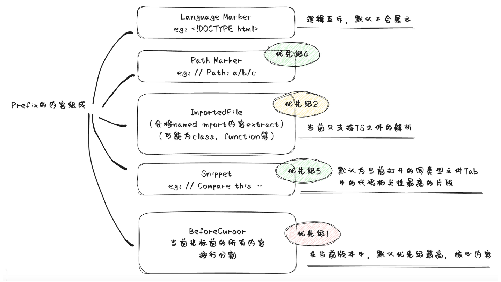
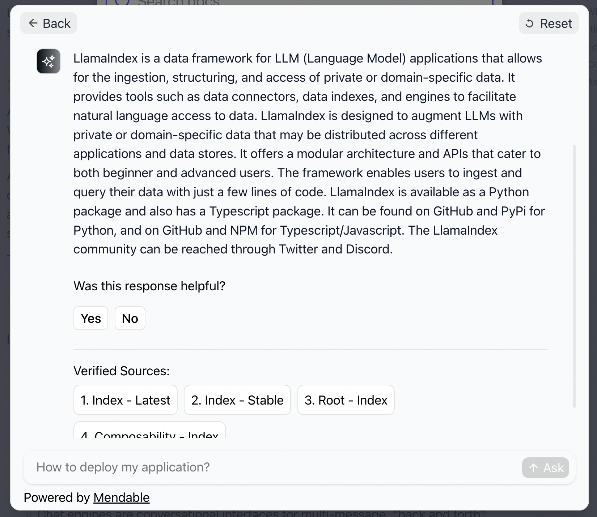

# 检索增强llm

> 文章来源：[万字长文: 检索增强 LLM (qq.com)](https://mp.weixin.qq.com/s?__biz=MzA5NTQ2MDEyOA==\&mid=2247484380\&idx=1\&sn=7b0b5dc3f76dd7a634ebb77df8697a24\&chksm=90be4d93a7c9c485593b6a299d607bfbcc30f05ec691b85f1fb6cf81c51ffe863dbc34759be6\&mpshare=1\&scene=1\&srcid=1204gaSWi0sA7clI6UZEYYL5\&sharer_shareinfo=f728c72f50e0aee521fb1319eb3b82b0\&sharer_shareinfo_first=f728c72f50e0aee521fb1319eb3b82b0#rd "万字长文: 检索增强 LLM (qq.com)")

ChatGPT 的出现，让我们看到了大语言模型 ( Large Language Model, LLM ) 在语言和代码理解、人类指令遵循、基本推理等多方面的能力，但幻觉问题 [**Hallucinations**](https://machinelearningmastery.com/a-gentle-introduction-to-hallucinations-in-large-language-models/ "Hallucinations") 仍然是当前大语言模型面临的一个重要挑战。简单来说，**幻觉问题是指 LLM 生成不正确、荒谬或者与事实不符的结果**。此外，\*\*数据新鲜度 ( Data Freshness ) \*\*也是 LLM 在生成结果时出现的另外一个问题，即 LLM 对于一些时效性比较强的问题可能给不出或者给出过时的答案。而通过检索外部相关信息的方式来增强 LLM 的生成结果是当前解决以上问题的一种流行方案，这里把这种方案称为 **检索增强 LLM** ( Retrieval Augmented LLM )，有时候也被称为 检索增强生成 ( Retrieval Augmented Generation, RAG )。&#x20;

这篇长文将对检索增强 LLM 的方案进行一个相对全面的介绍。主要内容包括：

-   检索增强 LLM 的概念介绍、重要性及其解决的问题
-   检索增强 LLM 的关键模块及其实现方法
-   检索增强 LLM 的一些案例分析和应用

# 1.RAG基本概念

## 1.1 什么是检索增强 LLM

**检索增强 LLM ( Retrieval Augmented LLM )**，简单来说，**就是给 LLM 提供外部数据库，对于用户问题 ( Query )，通过一些信息检索 ( Information Retrieval, IR ) 的技术，先从外部数据库中检索出和用户问题相关的信息，然后让 LLM 结合这些相关信息来生成结果**。下图是一个检索增强 LLM 的简单示意图。


OpenAI 研究科学家 Andrej Karpathy 前段时间在微软 Build 2023 大会上做过一场关于 GPT 模型现状的分享 [State of GPT](https://www.youtube.com/watch?v=bZQun8Y4L2A\&ab_channel=MicrosoftDeveloper "State of GPT")，这场演讲前半部分分享了 ChatGPT 这类模型是如何一步一步训练的，后半部分主要分享了 LLM 模型的一些应用方向，其中就对检索增强 LLM 这个应用方向做了简单介绍。下面这张图就是 Andrej 分享中关于这个方向的介绍。



传统的信息检索工具，比如 Google/Bing 这样的搜索引擎，只有检索能力 ( **Retrieval-only** )，现在 LLM 通过预训练过程，将海量数据和知识嵌入到其巨大的模型参数中，具有记忆能力 ( **Memory-only** )。从这个角度看，检索增强 LLM 处于中间，将 LLM 和传统的信息检索相结合，通过一些信息检索技术将相关信息加载到 LLM 的工作内存 ( **Working Memory** ) 中，即 LLM 的上下文窗口 ( **Context Window** )，亦即 LLM 单次生成时能接受的最大文本输入。

不仅 Andrej 的分享中提到基于检索来增强 LLM 这一应用方式，从一些著名投资机构针对 AI 初创企业技术栈的调研和总结中，也可以看到基于检索来增强 LLM 技术的广泛应用。比如今年6月份红杉资本发布了一篇关于大语言模型技术栈的文章 [**The New Language Model Stack**](https://www.sequoiacap.com/article/llm-stack-perspective/ "The New Language Model Stack")，其中就给出了一份对其投资的33家 AI 初创企业进行的问卷调查结果，下图的调查结果显示有 88% 左右的创业者表示在自己的产品中有使用到基于检索增强 LLM 技术。


无独有偶，美国著名风险投资机构 A16Z 在今年6月份也发表了一篇介绍当前 LLM 应用架构的总结文章 [**Emerging Architectures for LLM Applications**](https://a16z.com/emerging-architectures-for-llm-applications/ "Emerging Architectures for LLM Applications")，下图就是文章中总结的当前 LLM 应用的典型架构，其中最上面 **Contextual Data** 引入 LLM 的方式就是一种通过检索来增强 LLM 的思路。


## 1.2 检索增强 LLM 解决的问题

为什么要结合传统的信息检索系统来增强 LLM ？换句话说，基于检索增强的 LLM 主要解决的问题是什么？这部分内容参考自普林斯顿大学陈丹琦小组之前在 ACL 2023 大会上关于基于检索的语言模型的分享 ACL 2023 Tutorial: Retrieval-based Language Models and Applications

### （1）长尾知识

虽然当前 LLM 的训练数据量已经非常庞大，动辄几百 GB 级别的数据量，万亿级别的标记数量 ( Token )，比如 GPT-3 的预训练数据使用了3000 亿量级的标记，LLaMA 使用了 1.4 万亿量级的标记。训练数据的来源也十分丰富，比如维基百科、书籍、论坛、代码等，LLM 的模型参数量也十分巨大，从几十亿、百亿到千亿量级，但让 LLM 在有限的参数中记住所有知识或者信息是不现实的，训练数据的涵盖范围也是有限的，总会有一些长尾知识在训练数据中不能覆盖到。

**对于一些相对通用和大众的知识，LLM 通常能生成比较准确的结果，而对于一些长尾知识**，LLM 生成的回复通常并不可靠。ICML 会议上的这篇论文 [Large Language Models Struggle to Learn Long-Tail Knowledge](https://arxiv.org/abs/2211.08411 "Large Language Models Struggle to Learn Long-Tail Knowledge")，就研究了 LLM 对基于事实的问答的准确性和预训练数据中相关领域文档数量的关系，发现有很强的相关性，即**预训练数据中相关文档数量越多，LLM 对事实性问答的回复准确性就越高**。从这个研究中可以得出一个简单的结论 ——\*\* LLM 对长尾知识的学习能力比较弱\*\*。下面这张图就是论文中绘制的相关性曲线。


为了提升 LLM 对长尾知识的学习能力，容易想到的是**在训练数据加入更多的相关长尾知识，或者增大模型的参数量**，虽然这两种方法确实都有一定的效果，上面提到的论文中也有实验数据支撑，但这**两种方法是不经济的**，即需要一个很大的训练数据量级和模型参数才能大幅度提升 LLM 对长尾知识的回复准确性。而通**过检索的方法把相关信息在 LLM 推断时作为上下文 ( Context ) 给出**，既能达到一个比较好的回复准确性，也是一种**比较经济的方式**。下面这张图就是提供相关信息的情况下，不同大小模型的回复准确性，对比上一张图，可以看到对于同一参数量级的模型，在提供少量相关文档参与预训练的情况下，让模型在推断阶段利用相关信息，其回复准确性有了大幅提升。



### （2）私有数据

ChatGPT 这类通用的 LLM 预训练阶段利用的大部分都是公开的数据，**不包含私有数据，因此对于一些私有领域知识是欠缺的**。比如问 ChatGPT 某个企业内部相关的知识，ChatGPT 大概率是不知道或者胡编乱造。虽然可以在预训练阶段加入私有数据或者利用私有数据进行微调，但训练和迭代成本很高。此外，有研究和实践表明，**通过一些特定的攻击手法，可以让 LLM 泄漏训练数据，如果训练数据中包含一些私有信息，就很可能会发生隐私信息泄露**。比如这篇论文 [Extracting Training Data from Large Language Models](https://arxiv.org/abs/2012.07805 "Extracting Training Data from Large Language Models") 的研究者们就通过构造的 Query 从 **GPT-2** 模型中提取出了个人公开的姓名、邮箱、电话号码和地址信息等，即使这些信息可能只在训练数据中出现一次。文章还发现，较大规模的模型比较小规模的更容易受到攻击。



**如果把私有数据作为一个外部数据库，让 LLM 在回答基于私有数据的问题时，直接从外部数据库中检索出相关信息，再结合检索出的相关信息进行回答**。这样就不用通过预训练或者微调的方法让 LLM 在参数中记住私有知识，既节省了训练或者微调成本，也一定程度上避免了私有数据的泄露风险。

### （3）数据新鲜度

由于 LLM 中学习的知识来自于训练数据，虽然大部分知识的更新周期不会很快，但依然会有一些知识或者信息更新得很频繁。**LLM 通过从预训练数据中学到的这部分信息就很容易过时**。比如 GPT-4 模型使用的是截止到 2021-09 的预训练数据，因此涉及这个日期之后的事件或者信息，它会拒绝回答或者给出的回复是过时或者不准确的。下面这个示例是问 GPT-4 当前推特的 CEO 是谁，GPT-4 给出的回复还是 Jack Dorsey，并且自己会提醒说回复可能已经过时了。


如果**把频繁更新的知识作为外部数据库，供 LLM 在必要的时候进行检索，就可以实现在不重新训练 LLM 的情况下对 LLM 的知识进行更新和拓展，从而解决 LLM 数据新鲜度的问题**。

### （4）来源验证和可解释性

通常情况下，LLM 生成的输出不会给出其来源，比较难解释为什么会这么生成。而**通过给 LLM 提供外部数据源，让其基于检索出的相关信息进行生成，就在生成的结果和信息来源之间建立了关联，因此生成的结果就可以追溯参考来源，可解释性和可控性就大大增强**。即可以知道 LLM 是基于什么相关信息来生成的回复。Bing Chat 就是利用检索来增强 LLM 输出的典型产品，下图展示的就是 Bing Chat 的产品截图，可以看到其生成的回复中会给出相关信息的链接。


利用检索来增强 LLM 的输出，其中很重要的一步是通过一些检索相关的技术从外部数据中找出相关信息片段，然后把相关信息片段作为上下文供 LLM 在生成回复时参考。有人可能会说，随着 LLM 的上下文窗口 ( **Context Window** ) 越来越长，检索相关信息的步骤是不是就没有必要了，直接在上下文中提供尽可能多的信息。比如 GPT-4 模型当前接收的最大上下文长度是 32K， Claude 模型最大允许 [100K](https://www.anthropic.com/index/100k-context-windows "100K") 的上下文长度。

虽然 LLM 的上下文窗口越来越大，但检索相关信息的步骤仍然是重要且必要的。一方面当前 **LLM 的网络架构决定了其上下文窗口的长度是会有上限的**，不会无限增长。另外看似很大的上下文窗口，能容纳的信息其实比较有限，比如 32K 的长度可能仅仅相当于一篇大学毕业论文的长度。另一方面，有研究表明，**提供少量更相关的信息，相比于提供大量不加过滤的信息，LLM 回复的准确性会更高**。比如斯坦福大学的这篇论文 [Lost in the Middle](https://arxiv.org/pdf/2307.03172.pdf "Lost in the Middle") 就给出了下面的实验结果，可以看到 LLM 回复的准确性随着上下文窗口中提供的文档数量增多而下降。


**利用检索技术从大量外部数据中找出与输入问题最相关的信息片段，在为 LLM 生成回复提供参考的同时，也一定程度上过滤掉一些非相关信息的干扰，便于提高生成回复的准确性**。此外，上下文窗口越大，推理成本越高。所以相关信息检索步骤的引入也能降低不必要的推理成本。

# 2.关键模块

为了构建检索增强 LLM 系统，需要实现的关键模块和解决的问题包括:

-   **数据和索引模块**：如何处理外部数据和构建索引
-   **查询和检索模块**：如何准确高效地检索出相关信息
-   **响应生成模块**：如何利用检索出的相关信息来增强 LLM 的输出

## 2.1 数据和索引模块

### （1）数据获取

数据获取模块的作用一般是**将多种来源、多种类型和格式的外部数据转换成一个统一的文档对象** ( Document Object )，便于后续流程的处理和使用。文档对象除了包含原始的文本内容，一般还会携带文档的**元信息 ( Metadata )**，**可以用于后期的检索和过滤**。元信息包括但不限于：

-   时间信息，比如文档创建和修改时间
-   标题、关键词、实体(人物、地点等)、文本类别等信息
-   文本总结和摘要

**有些元信息可以直接获取，有些则可以借助 NLP 技术**，比如关键词抽取、实体识别、文本分类、文本摘要等。既可以采用传统的 NLP 模型和框架，也可以基于 LLM 实现。


外部数据的来源可能是多种多样的，比如可能来自

-   Google 套件里各种 Doc 文档、Sheet 表格、Slides 演示、Calendar 日程、Drive 文件等
-   Slack、Discord 等聊天社区的数据
-   Github、Gitlab 上托管的代码文件
-   Confluence 上各种文档
-   Web 网页的数据
-   API 返回的数据
-   本地文件

外部数据的类型和文件格式也可能是多样化的，比如

-   从数据类型来看，包括纯文本、表格、演示文档、代码等
-   从文件存储格式来看，包括 txt、csv、pdf、markdown、json 等格式

外部数据可能是多语种的，比如中文、英文、德文、日文等。除此之外，还可能是多模态的，除了上面讨论的文本模态，还包括图片、音频、视频等多种模态。不过这篇文章中讨论的外部数据将限定在文本模态。

在构建数据获取模块时，不同来源、类型、格式、语种的数据可能都需要采用不同的读取方式。

### （2）文本分块

文本分块是**将长文本切分成小片段的过程**，比如将一篇长文章切分成一个个相对短的段落。那么为什么要进行文本分块？一方面**当前 LLM 的上下文长度是有限制的**，直接把一篇长文全部作为相关信息放到 LLM 的上下文窗口中，可能会超过长度限制。另一方面，对于长文本来说，即使其和查询的问题相关，但**一般不会通篇都是完全相关的**，而分块能一定程度上剔除不相关的内容，**为后续的回复生成过滤一些不必要的噪声**。

**文本分块的好坏将很大程度上影响后续回复生成的效果，切分得不好，内容之间的关联性会被切断。因此设计一个好的分块策略十分重要**。分块策略包括具体的切分方法 ( 比如是按句子切分还是段落切分 )，块的大小设为多少合适，不同的块之间是否允许重叠等。Pinecone 的这篇博客 [Chunking Strategies for LLM Applications](https://www.pinecone.io/learn/chunking-strategies/ "Chunking Strategies for LLM Applications") 中就给出了一些在设计分块策略时需要考虑的因素。

-   **原始内容的特点**：原始内容是长文 ( 博客文章、书籍等 ) 还是短文 ( 推文、即时消息等 )，是什么格式 ( HTML、Markdown、Code 还是 LaTeX 等 )，不同的内容特点可能会适用不同的分块策略；
-   **后续使用的索引方法**：目前最常用的索引是对分块后的内容进行向量索引，那么不同的向量嵌入模型可能有其适用的分块大小，比如 **sentence-transformer** 模型比较适合对句子级别的内容进行嵌入，OpenAI 的 **text-embedding-ada-002** 模型比较适合的分块大小在 256\~512 个标记数量；
-   **问题的长度**：问题的长度需要考虑，因为需要基于问题去检索出相关的文本片段；
-   **检索出的相关内容在回复生成阶段的使用方法**：如果是直接把检索出的相关内容作为 Prompt 的一部分提供给 LLM，那么 LLM 的输入长度限制在设计分块大小时就需要考虑。

#### 分块实现方法

那么文本分块具体如何实现？一般来说，实现文本分块的整体流程如下:

1.  将原始的长文本切分成小的语义单元，这里的语义单元通常是句子级别或者段落级别；
2.  将这些小的语义单元融合成更大的块，直到达到设定的块大小 ( Chunk Size )，就将该块作为独立的文本片段；
3.  迭代构建下一个文本片段，一般相邻的文本片段之间会设置重叠，以保持语义的连贯性。

那如何把原始的长文本切分成小的语义单元? 最常用的是基于分割符进行切分，比如句号 ( `. `)、换行符 ( `\n` )、空格等。除了可以利用单个分割符进行简单切分，还可以定义一组分割符进行迭代切分，比如定义 `["\n\n", "\n", " ", ""]` 这样一组分隔符，切分的时候先利用第一个分割符进行切分 ( 实现类似按段落切分的效果 )，第一次切分完成后，对于超过预设大小的块，继续使用后面的分割符进行切分，依此类推。这种切分方法能比较好地保持原始文本的层次结构。

对于一些结构化的文本，比如代码，Markdown，LaTeX 等文本，在进行切分的时候可能需要单独进行考虑:

-   比如 Python 代码文件，分割符中可能就需要加入类似 `\nclass `，`\ndef ` 这种来保证类和函数代码块的完整性；
-   比如 Markdown 文件，是通过不同层级的 Header 进行组织的，即不同数量的 # 符号，在切分时就可以通过使用特定的分割符来维持这种层级结构。

**文本块大小的设定也是分块策略需要考虑的重要因素**，太大或者太小都会影响最终回复生成的效果。文本块大小的计算方法，最常用的可以直接**基于字符数进行统计 ( Character-level )**，也可以**基于标记数进行统计 ( Token-level )**。至于如何确定合适的分块大小，这个因场景而异，很难有一个统一的标准，可以通过评估不同分块大小的效果来进行选择。

上面提到的一些分块方法在 [LangChain](https://python.langchain.com/docs/modules/data_connection/document_transformers/ "LangChain") 中都有相应的实现。比如下面的代码示例

```python
from langchain.text_splitter import CharacterTextSplitter
from langchain.text_splitter import RecursiveCharacterTextSplitter, Language

# text split
text_splitter = RecursiveCharacterTextSplitter(
    # Set a really small chunk size, just to show.
    chunk_size = 100,
    chunk_overlap  = 20,
    length_function = len,
    add_start_index = True,
)

# code split
python_splitter = RecursiveCharacterTextSplitter.from_language(
            language=Language.PYTHON, 
            chunk_size=50, 
            chunk_overlap=0  
)

# markdown split
md_splitter = RecursiveCharacterTextSplitter.from_language(  
            language=Language.MARKDOWN, 
            chunk_size=60, 
            chunk_overlap=0  
)

```

### （3）数据索引

经过前面的数据读取和文本分块操作后，接着就需要对处理好的数据进行索引。**索引是一种数据结构，用于快速检索出与用户查询相关的文本内容**。它是检索增强 LLM 的核心基础组件之一。

下面介绍几种常见的索引结构。为了说明不同的索引结构，引入节点(Node)的概念。在这里，节点就是前面步骤中对文档切分后生成的文本块(Chunk)。下面的索引结构图来自 LlamaIndex 的文档[How Each Index Works](https://gpt-index.readthedocs.io/en/latest/core_modules/data_modules/index/index_guide.html "How Each Index Works")。

#### 1）链式索引

链式索引**通过链表的结构对文本块进行顺序索引**。在后续的检索和生成阶段，可以简单地顺序遍历所有节点，也可以基于关键词进行过滤。


#### 2）树索引

树索引**将一组节点 ( 文本块 ) 构建成具有层级的树状索引结构**，其从叶节点 (原始文本块) 向上构建，**每个父节点都是子节点的摘要**。在检索阶段，既可以从根节点向下进行遍历，也可以直接利用根节点的信息。**树索引提供了一种更高效地查询长文本块的方式，它还可以用于从文本的不同部分提取信息**。与链式索引不同，树索引无需按顺序查询。


#### 3）关键词表索引

关键词表索引**从每个节点中提取关键词，构建了每个关键词到相应节点的多对多映射，意味着每个关键词可能指向多个节点，每个节点也可能包含多个关键词**。在检索阶段，可以基于用户查询中的关键词对节点进行筛选。




#### 4）向量索引

向量索引是**当前最流行的一种索引方法**。这种方法一般利用**文本嵌入模型** ( Text Embedding Model ) 将文本块映射成一个固定长度的向量，然后存储在**向量数据库**中。检索的时候，对用户查询文本采用同样的文本嵌入模型映射成向量，然后基于向量相似度计算获取最相似的一个或者多个节点。


上面的表述中涉及到向量索引和检索中三个重要的概念: **文本嵌入模型**、**相似向量检索**和**向量数据库**。下面一一进行详细说明。

##### 文本嵌入模型

文本嵌入模型 ( Text Embedding Model ) 将非结构化的文本转换成结构化的向量 ( Vector )，目前常用的是学习得到的**稠密向量**。



当前有很多文本嵌入模型可供选择，比如

-   早期的 Word2Vec、GloVe 模型等，目前很少用。
-   基于孪生 BERT 网络预训练得到的 [Sentence Transformers](https://arxiv.org/abs/1908.10084 "Sentence Transformers") 模型，对句子的嵌入效果比较好
-   OpenAI 提供的 [text-embedding-ada-002](https://openai.com/blog/new-and-improved-embedding-model "text-embedding-ada-002") 模型，嵌入效果表现不错，且可以处理最大 8191 标记长度的文本
-   [Instructor](https://instructor-embedding.github.io/ "Instructor") 模型，这是一个经过指令微调的文本嵌入模型，可以根据任务(例如分类、检索、聚类、文本评估等)和领域(例如科学、金融等)，提供任务指令而生成相对定制化的文本嵌入向量，无需进行任何微调
-   [BGE](https://github.com/FlagOpen/FlagEmbedding/blob/master/README_zh.md "BGE")模型: 由智源研究院开源的中英文语义向量模型，目前在MTEB中英文榜单都排在第一位。

下面就是评估文本嵌入模型效果的榜单 [MTEB Leaderboard](https://huggingface.co/spaces/mteb/leaderboard "MTEB Leaderboard") (截止到 2023-08-18 )。值得说明的是，这些现成的文本嵌入模型没有针对特定的下游任务进行微调，所以不一定在下游任务上有足够好的表现。最好的方式一般是在下游特定的数据上重新训练或者微调自己的文本嵌入模型。


##### 相似向量检索

相似向量检索要解决的问题是给定一个查询向量，如何从候选向量中准确且高效地检索出与其相似的一个或多个向量。首先是**相似性度量**方法的选择，可以采用余弦相似度、点积、欧式距离、汉明距离等，通常情况下可以直接使用**余弦相似度**。其次是相似性检索算法和实现方法的选择，候选向量的数量量级、检索速度和准确性的要求、内存的限制等都是需要考虑的因素。

当候选向量的数量比较少时，比如只有几万个向量，那么 Numpy 库就可以实现相似向量检索，实现简单，准确性高，速度也很快。国外有个博主做了个简单的基准测试发现 [Do you actually need a vector database](https://www.ethanrosenthal.com/2023/04/10/nn-vs-ann/ "Do you actually need a vector database") ，当候选向量数量在 10 万量级以下时，通过对比 Numpy 和另一种高效的近似最近邻检索实现库 [Hnswlib](https://github.com/nmslib/hnswlib "Hnswlib") ，发现在检索效率上并没有数量级的差异，但 Numpy 的实现过程更简单。


下面就是使用 Numpy 的一种简单实现代码:

```python
import numpy as np

# candidate_vecs: 2D numpy array of shape N x D
# query_vec: 1D numpy array of shape D
# k: number of top k similar vectors

sim_scores = np.dot(candidate_vecs, query_vec)
topk_indices = np.argsort(sim_scores)[::-1][:k]
topk_values = sim_scores[topk_indices]
```

对于大规模向量的相似性检索，使用 Numpy 库就不合适，需要使用更高效的实现方案。Facebook团队开源的 [Faiss](https://github.com/facebookresearch/faiss "Faiss") 就是一个很好的选择。Faiss 是一个用于高效相似性搜索和向量聚类的库，它实现了在任意大小的向量集合中进行搜索的很多算法，除了可以在CPU上运行，有些算法也支持GPU加速。Faiss 包含多种相似性检索算法，具体使用哪种算法需要综合考虑数据量、检索频率、准确性和检索速度等因素。

Pinecone 的这篇博客 [Nearest Neighbor Indexes for Similarity Search](https://www.pinecone.io/learn/series/faiss/vector-indexes/ "Nearest Neighbor Indexes for Similarity Search") 对 Faiss 中常用的几种索引进行了详细介绍，下图是几种索引在不同维度下的定性对比:



##### 向量数据库

上面提到的基于 Numpy 和 Faiss 实现的向量相似检索方案，如果应用到实际产品中，可能还缺少一些功能，比如：

-   数据托管和备份
-   数据管理，比如数据的插入、删除和更新
-   向量对应的原始数据和元数据的存储
-   可扩展性，包括垂直和水平扩展

所以**向量数据库**应运而生。简单来说，**向量数据库是一种专门用于存储、管理和查询向量数据的数据库，可以实现向量数据的相似检索、聚类等**。目前比较流行的向量数据库有 [Pinecone](https://www.pinecone.io/ "Pinecone")、[Vespa](https://vespa.ai/ "Vespa")、[Weaviate](https://weaviate.io/ "Weaviate")、[Milvus](https://milvus.io/ "Milvus")、[Chroma](https://www.trychroma.com/ "Chroma") 、[Tencent Cloud VectorDB](https://cloud.tencent.com/product/vdb "Tencent Cloud VectorDB")等，大部分都提供开源产品。

Pinecone 的这篇博客 [What is a Vector Database](https://www.pinecone.io/learn/vector-database/ "What is a Vector Database") 就对向量数据库的相关原理和组成进行了比较系统的介绍，下面这张图就是文章中给出的一个向量数据库常见的数据处理流程:



1.  **索引**: 使用乘积量化 ( Product Quantization ) 、局部敏感哈希 ( LSH )、HNSW 等算法对向量进行索引，这一步将向量映射到一个数据结构，以实现更快的搜索。
2.  **查询**: 将查询向量和索引向量进行比较，以找到最近邻的相似向量。
3.  **后处理**: 有些情况下，向量数据库检索出最近邻向量后，对其进行后处理后再返回最终结果。

向量数据库的使用比较简单，下面是使用 Python 操作 Pinecone 向量数据库的示例代码:

```python
# install python pinecone client
# pip install pinecone-client
import pinecone 
# initialize pinecone client
pinecone.init(api_key="YOUR_API_KEY", environment="YOUR_ENVIRONMENT")
# create index 
pinecone.create_index("quickstart", dimension=8, metric="euclidean")
# connect to the index
index = pinecone.Index("quickstart")
# Upsert sample data (5 8-dimensional vectors) 
index.upsert([ 
        ("A", [0.1, 0.1, 0.1, 0.1, 0.1, 0.1, 0.1, 0.1]), 
        ("B", [0.2, 0.2, 0.2, 0.2, 0.2, 0.2, 0.2, 0.2]), 
        ("C", [0.3, 0.3, 0.3, 0.3, 0.3, 0.3, 0.3, 0.3]), 
        ("D", [0.4, 0.4, 0.4, 0.4, 0.4, 0.4, 0.4, 0.4]), 
        ("E", [0.5, 0.5, 0.5, 0.5, 0.5, 0.5, 0.5, 0.5]) 
      ])

# query
index.query( 
      vector=[0.3, 0.3, 0.3, 0.3, 0.3, 0.3, 0.3, 0.3], 
      top_k=3, 
      include_values=True 
      ) 

# Returns: 
# {'matches': [{'id': 'C', 
#               'score': 0.0, 
#               'values': [0.3, 0.3, 0.3, 0.3, 0.3, 0.3, 0.3, 0.3]}, 
#              {'id': 'D', 
#               'score': 0.0799999237, 
#               'values': [0.4, 0.4, 0.4, 0.4, 0.4, 0.4, 0.4, 0.4]}, 
#              {'id': 'B', 
#               'score': 0.0800000429, 
#               'values': [0.2, 0.2, 0.2, 0.2, 0.2, 0.2, 0.2, 0.2]}], 
# 'namespace': ''}

# delete index 
pinecone.delete_index("quickstart")
```

## 2.2查询和检索模块

### （1）查询变换

查询文本的表达方法直接影响着检索结果，微小的文本改动都可能会得到天差万别的结果。直接用原始的查询文本进行检索在很多时候可能是简单有效的，但有时候可能需要对查询文本进行一些变换，以得到更好的检索结果，从而更可能在后续生成更好的回复结果。下面列出几种常见的查询变换方式。

#### 1）变换一: 同义改写

将原始查询改写成相同语义下不同的表达方式，改写工作可以调用 LLM 完成。比如对于这样一个原始查询:  `What are the approaches to Task Decomposition?`，可以改写成下面几种同义表达:

> How can Task Decomposition be approached?
> What are the different methods for Task Decomposition?
> What are the various approaches to decomposing tasks?

对于每种查询表达，分别检索出一组相关文档，然后对所有检索结果进行去重合并，从而得到一个更大的候选相关文档集合。通过将同一个查询改写成多个同义查询，能够克服单一查询的局限，获得更丰富的检索结果集合。

#### 2）变换二: 查询分解

有相关研究表明 ( [self-ask](https://ofir.io/self-ask.pdf "self-ask")，[ReAct](https://arxiv.org/abs/2210.03629 "ReAct") )，LLM 在回答复杂问题时，如果将复杂问题分解成相对简单的子问题，回复表现会更好。这里又可以分成**单步分解**和**多步分解**。

**单步分解**将一个复杂查询转化为多个简单的子查询，融合每个子查询的答案作为原始复杂查询的回复。


对于**多步分解**，给定初始的复杂查询，会一步一步地转换成多个子查询，结合前一步的回复结果生成下一步的查询问题，直到问不出更多问题为止。最后结合每一步的回复生成最终的结果。


#### 3）变换三: HyDE

[HyDE](http://boston.lti.cs.cmu.edu/luyug/HyDE/HyDE.pdf "HyDE")，全称叫 Hypothetical Document Embeddings，给定初始查询，**首先利用 LLM 生成一个假设的文档或者回复，然后以这个假设的文档或者回复作为新的查询进行检索**，而不是直接使用初始查询。这种转换在没有上下文的情况下可能会生成一个误导性的假设文档或者回复，从而可能得到一个和原始查询不相关的错误回复。下面是论文中给出的一个例子:


### （2）排序和后处理

经过前面的检索过程可能会得到很多相关文档，就需要进行筛选和排序。常用的筛选和排序策略包括：

-   基于相似度分数进行过滤和排序
-   基于关键词进行过滤，比如限定包含或者不包含某些关键词
-   让 LLM 基于返回的相关文档及其相关性得分来重新排序
-   基于时间进行过滤和排序，比如只筛选最新的相关文档
-   基于时间对相似度进行加权，然后进行排序和筛选

## 2.3 回复生成模块

### （1）回复生成策略

检索模块基于用户查询检索出相关的文本块，回复生成模块让 LLM 利用检索出的相关信息来生成对原始查询的回复。LlamaIndex 中有给出一些不同的回复生成策略。

一种策略是依次结合每个检索出的相关文本块，每次不断修正生成的回复。这样的话，有多少个独立的相关文本块，就会产生多少次的 LLM 调用。另一种策略是在每次 LLM 调用时，尽可能多地在 Prompt 中填充文本块。如果一个 Prompt 中填充不下，则采用类似的操作构建多个 Prompt，多个 Prompt 的调用可以采用和前一种相同的回复修正策略。

### （2）回复生成 Prompt 模板

下面是 LlamaIndex 中提供的一个生成回复的 Prompt 模板。从这个模板中可以看到，可以用一些分隔符 ( 比如 ------ ) 来区分相关信息的文本，还可以指定 LLM 是否需要结合它自己的知识来生成回复，以及当提供的相关信息没有帮助时，要不要回复等。

```python
template = f'''
Context information is below.
---------------------
{context_str}
---------------------
Using both the context information and also using your own knowledge, answer the question: {query_str}

If the context isn't helpful, you can/don’t answer the question on your own.
'''
```

下面的 Prompt 模板让 LLM 不断修正已有的回复。

```python
template = f'''
The original question is as follows: {query_str}
We have provided an existing answer: {existing_answer}
We have the opportunity to refine the existing answer (only if needed) with some more context below.
------------
{context_str}
------------
Using both the new context and your own knowledege, update or repeat the existing answer.
'''
```

# 3.案例分析和应用

## 3.1 ChatGPT 检索插件

ChatGPT 检索插件 [ChatGPT Retrieval Plugin](https://github.com/openai/chatgpt-retrieval-plugin "ChatGPT Retrieval Plugin") 是 OpenAI 官方给出的一个通过检索来增强 LLM 的范例，实现了让 ChatGPT 访问私有知识的一种途径，其在 Github 上的开源仓库短时间内获得了大量关注。下面是 ChatGPT 检索插件内部原理的一张示意图([图片来源: openai-chatgpt-retrieval-plugin-and-postgresql-on-azure](https://techcommunity.microsoft.com/t5/azure-database-for-postgresql/openai-chatgpt-retrieval-plugin-and-postgresql-on-azure/ba-p/3826411 "图片来源: openai-chatgpt-retrieval-plugin-and-postgresql-on-azure"))。


在 API 接口设计上，检索插件提供了下面几种接口:

-   `/upsert`: 该接口将上传的一个或多个文本文档，先切分成文本块，每个文本块大小在 200 个 Token，然后利用 OpenAI 的 文本嵌入模型将文本块转换成向量，最后连同原始文本和元信息存储在向量数据库中，代码仓库中实现了对几乎所有主流向量类数据库的支持。
-   `/upsert-file`: 该接口允许上传 PDF、TXT、DOCX、PPTX 和 MD 格式的单个文件，先转换成纯文本后，后续处理流程和 `/upsert` 接口一样。
-   `/query`: 该接口实现对给定的查询，返回和查询最相关的几个文本块，实现原理也是基于相似向量检索。用户可以在请求中通过 `filter` 参数对文档进行过滤，通过 `top_k` 参数指定返回的相关文本块数量。
-   `/delete`: 该接口实现从向量数据库中对一个或多个文档进行删除操作。

## 3.2 LlamaIndex 和 LangChain

[LlamaIndex](https://gpt-index.readthedocs.io/en/latest/index.html# "LlamaIndex") 是一个服务于 LLM 应用的数据框架，提供外部数据源的导入、结构化、索引、查询等功能，这篇文章的结构和内容有很大一部分是参考 LlamaIndex 的文档，文章中提到的很多模块、算法和策略，LlamaIndex 基本都有对应的实现，提供了相关的高阶和低阶 API。

LlamaIndex 主要包含以下组件和特性：

-   数据连接器：能从多种数据源中导入数据，有个专门的项目 [Llama Hub](https://llamahub.ai/ "Llama Hub")，可以连接多种来源的数据
-   数据索引：支持对读取的数据进行多种不同的索引，便于后期的检索
-   查询和对话引擎：既支持单轮形式的查询交互引擎，也支持多轮形式的对话交互引擎
-   应用集成：可以方便地与一些流行的应用进行集成，比如 ChatGPT、LangChain、Flask、Docker等

下面是 LlamaIndex 整体框架的一张示意图。


除了 LlamaIndex，[LangChain](https://python.langchain.com/docs/get_started/introduction.html "LangChain") 也是当前流行的一种 LLM 应用开发框架，其中也包含一些检索增强 LLM 的相关组件，不过相比较而言，LlamaIndex 更侧重于检索增强 LLM 这一相对小的领域，而 LangChain 覆盖的领域更广，比如会包含 LLM 的链式应用、Agent 的创建和管理等。下面这张图就是 LangChain 中 [Retrieval](https://python.langchain.com/docs/modules/data_connection/ "Retrieval") 模块的整体流程示意图，包含数据加载、变换、嵌入、向量存储和检索，整体处理流程和 LlamaIndex 是一样的。


## 3.3 Github Copilot 分析

[Github Copilot](https://github.com/features/copilot "Github Copilot") 是一款 AI 辅助编程工具。如果使用过就会发现，Github Copilot 可以根据代码的上下文来帮助用户自动生成或者补全代码，有时候可能刚写下类名或者函数名，又或者写完函数注释，Copilot 就给出了生成好的代码，并且很多时候可能就是我们想要实现的代码。由于 Github Copilot 没有开源，网上有人对其 VSCode 插件进行了逆向分析，比如 [copilot internals](https://thakkarparth007.github.io/copilot-explorer/posts/copilot-internals "copilot internals") 和 [copilot analysis](https://github.com/mengjian-github/copilot-analysis "copilot analysis")，让我们可以对 Copilot 的内部实现有个大概的了解。

简单来说，**Github Copilot 插件会收集用户在 VSCode 编程环境中的多种上下文信息构造 Prompt，然后把构造好的 Prompt 发送给代码生成模型 ( 比如 Codex )，得到补全后的代码，显示在编辑器中**。如何检索出相关的上下文信息 ( Context ) 就是其中很重要的一个环节。Github Copilot 算是检索增强 LLM 在 AI 辅助编程方向的一个应用。

需要说明的是，上面提到的两份逆向分析是几个月之前做的，Github Copilpot 目前可能已经做了很多的更新和迭代，另外分析是原作者阅读理解逆向后的代码得到的，所以可能会产生一些理解上的偏差。而下面的内容是我结合那两份分析产生的，因此有些地方可能是不准确甚至是错误的，但不妨碍我们通过 Copilot 这个例子来理解上下文信息对增强 LLM 输出结果的重要性，以及学习一些上下文相关信息检索的实践思路。

下面是一个 Prompt 的示例，可以看到包含前缀代码信息 ( prefix )，后缀代码信息 ( suffix )，生成模式 ( isFimEnabled )，以及 Prompt 不同组成元素的起始位置信息 ( promptElementRanges )。


抛开代码生成模型本身的效果不谈，Prompt 构造的好坏很大程度上会影响代码补全的效果，而上下文相关信息 ( Context ) 的提取和构成很大程度上又决定了 Prompt 构造的好坏。让我们来看一下 Github Copilot 的 Prompt 构造中有关上下文相关信息抽取的一些关键思路和实现。

Copilot 的 Prompt 包含不同类型的相关信息，包括

-   `BeforeCursor`：光标前的内容
-   `AfterCursor`：光标后的内容
-   `SimilarFile`：与当前文件相似度较高的代码片段
-   `ImportedFile` ：import 依赖
-   `LanguageMarker`：文件开头的语言标记
-   `PathMarker`：文件的相对路径信息

其中相似代码片段的抽取，会先获取最近访问过的多份同种语言的文件，作为抽取相似代码片段的候选文档。然后设定窗口大小 ( 比如默认为 60 行 ) 和步长 ( 比如默认为 1 行 )，以滑动窗口的方式将候选文档切分成代码块。接着计算每个切分后的代码块和当前文件的相似度，最后保留相似度较高的几个代码块。这里当前文件的获取是从当前光标往前截取窗口大小的内容，相似度的度量采用的是 **Jaccard 系数**，具体来说，会对代码块中的每一行进行分词，过滤常见的代码关键字 ( 比如 if, then, else, for 这些)，得到一个标记 ( Token ) 集合，然后就可以在当前代码块和候选代码块的 Token 集合之间计算 Jaccard 相似度。在 Copilot 的场景下，这种相似度的计算方式简单有效。
$J(A, B) = \frac{|A \cap B|}{|A \cup B|} = \frac{|A \cap B|}{|A| + |B| - |A \cap B|}$
上面的一篇分析文章中将 Prompt 的组成总结成下面的一张图。



构造好 Prompt 后，Copilot 还会判断是否有必要发起请求，代码生成模型的计算是非常耗费算力的，因此有必要过滤一些不必要的请求。其中一个判断是利用简单的线性回归模型对 Prompt 进行打分，当分数低于某个阈值时，请求就不会发出。这个线性回归模型利用的特征包括像代码语言、上一次代码补全建议是否被采纳或拒绝、上一次采纳或拒绝距现在的时长、光标左边的字符等。通过分析模型的权重，原作者给出了一些观察：

-   一些编程语言的权重相对于其他语言权重要更高 ( php > js > python > rust > ... )，PHP 权重最高，果然 **PHP是世界上最好的语言**( ^ \_^ )。
-   右半边括号 ( 比如 `)`，`]` ) 的权重要低于左半边括号，这是符合逻辑的。

通过对 Github Copilot 这个编程辅助工具的分析可以看到：

-   **检索增强 LLM 的思路和技术在 Github Copilot 的实现中发挥着重要作用**
-   上下文相关信息 ( Context ) 可以是一个广义概念，可以是相关的文本或者代码片段，也可以是文件路径、相关依赖等，每个场景都可以定义其特定的上下文元素
-   相似性的度量和相似检索方法可以因场景而异，不一定所有场景都需要用余弦相似度，都需要通过向量相似检索的方式找出相关文档，比如 Copilot 的实现中就利用简单的 Jaccard 系数来计算分词后 Token 集合的相似度，简单高效。

## 3.4 文档和知识库的检索与问答

检索增强 LLM 技术的一个典型应用是知识库或者文档问答，比如针对企业内部知识库或者一些文档的检索与问答等。这个应用方向目前已经出现了很多商业化和开源的产品。比如 [Mendable](https://www.mendable.ai/ "Mendable") 就是一款商业产品，能提供基于文档的 AI 检索和问答能力。上面提到的 LlamaIndex 和 LangChain 项目官方文档的检索能力就是由 Mendable 提供的。下面就是一张使用截图，可以看到 Mendable 除了会给出生成的回复，也会附上参考链接。



除了商业产品，也有很多类似的开源产品。比如

-   [Danswer](https://github.com/danswer-ai/danswer "Danswer"): 提供针对企业内部文档的问答功能，能实现多种来源的数据导入，支持传统的检索和基于 LLM 的问答，能智能识别用户的搜索意图，从而采用不同的检索策略，支持用户和文档的权限管理，以及支持Docker部署等
-   [PandaGPT](https://www.pandagpt.io/ "PandaGPT"): 支持用户上传文件，然后可以针对文件内容进行提问
-   [FastGPT](https://fastgpt.run/ "FastGPT"): 一个开源的基于 LLM 的 AI 知识库问答平台
-   [Quivr](https://github.com/StanGirard/quivr "Quivr"): 这个开源项目能实现用户对个人文件或者知识库的检索和问答，期望成为用户的「第二大脑」
-   [ChatFiles](https://github.com/guangzhengli/ChatFiles "ChatFiles"): 又一个基于 LLM 的文档问答开源项目

下面这张图是 ChatFiles 项目的技术架构图，可以发现这类项目的基本模块和架构都很类似，基本都遵从检索增强 LLM 的思路，这类知识库问答应用几乎成为 LLM 领域的 **Hello World** 应用了。


# 4.参考

1.  [ChatGPT Retrieval Plugin](https://github.com/openai/chatgpt-retrieval-plugin "ChatGPT Retrieval Plugin") #project
2.  [Hypothetical Document Embeddings](https://arxiv.org/abs/2212.10496?ref=mattboegner.com "Hypothetical Document Embeddings") #paper
3.  [Knowledge Retrieval Architecture for LLM’s (2023)](https://mattboegner.com/knowledge-retrieval-architecture-for-llms/ "Knowledge Retrieval Architecture for LLM’s (2023)") #blog
4.  [Chunking Strategies for LLM Applications](https://www.pinecone.io/learn/chunking-strategies/ "Chunking Strategies for LLM Applications") #blog
5.  [LangChain Document Transformers](https://python.langchain.com/docs/modules/data_connection/document_transformers/ "LangChain Document Transformers") #doc
6.  [LlamaIndex Index Guide](https://gpt-index.readthedocs.io/en/latest/core_modules/data_modules/index/index_guide.html "LlamaIndex Index Guide") #doc
7.  [Full stack LLM Bootcamp: Augmented Language Models](https://fullstackdeeplearning.com/llm-bootcamp/spring-2023/augmented-language-models/ "Full stack LLM Bootcamp: Augmented Language Models") #course
8.  [Pinecone: vector indexes in faiss](https://www.pinecone.io/learn/series/faiss/vector-indexes/ "Pinecone: vector indexes in faiss") #blog
9.  [Pinecone: what is a vector database](https://www.pinecone.io/learn/vector-database/ "Pinecone: what is a vector database") #blog
10. [Zero and Few Shot Text Retrieval and Ranking Using Large Language Models](https://blog.reachsumit.com/posts/2023/03/llm-for-text-ranking/ "Zero and Few Shot Text Retrieval and Ranking Using Large Language Models") #blog
11. [copilot internals](https://thakkarparth007.github.io/copilot-explorer/posts/copilot-internals "copilot internals") #blog
12. [copilot analysis](https://github.com/mengjian-github/copilot-analysis "copilot analysis") #blog
13. [Discover LlamaIndex: Key Components to Build QA Systems](https://www.youtube.com/watch?v=A3iqOJHBQhM\&ab_channel=LlamaIndex "Discover LlamaIndex: Key Components to Build QA Systems") #video
14. [Billion scale approximate nearest neighbor search](https://wangzwhu.github.io/home/file/acmmm-t-part3-ann.pdf "Billion scale approximate nearest neighbor search") #slide
15. [ACL 2023 Tutorial: Retrieval based LM](https://acl2023-retrieval-lm.github.io/ "ACL 2023 Tutorial: Retrieval based LM") #slide
16. [Pinecone: why use retrieval instead of larger context](https://www.pinecone.io/blog/why-use-retrieval-instead-of-larger-context/ "Pinecone: why use retrieval instead of larger context") #blog
17. [RETA-LLM](https://github.com/RUC-GSAI/YuLan-IR/tree/main/RETA-LLM "RETA-LLM") #project
18. [Document Metadata and Local Models for Better, Faster Retrieval](https://www.youtube.com/watch?v=njzB6fm0U8g\&ab_channel=LlamaIndex "Document Metadata and Local Models for Better, Faster Retrieval") #video
