# 5.高效训练&模型压缩

# 1.背景介绍

## 1.1 CPU & GPU

预训练语言模型以每年十倍的速度增大，越大的模型往往表现出更好的性能；但为了训练这些模型耗费也越来越昂贵，训练代码变得更复杂。

希望让训练过程变得更加简单，训练变得更高效，并且训练更加廉价。

首先要分析GPU内存；其次理解在多张显卡之间的合作模式是怎样的。

深度学习中最常见的矩阵乘法和向量加法适合于用GPU来计算。 &#x20;

CPU和GPU的合作方法通过CPU发送一些控制信号去控制GPU进行计算。 &#x20;

如果想把模型的向量加法或矩阵乘法放到GPU中计算的话，需要把这些数据从CPU上拷贝到GPU上(`.cuda`)。

显卡中有哪些显存的组成。

## 1.2 显存组成

#### （1）参数

为了加速模型的前向传播，需要把模型所有的参数都放到显卡中。

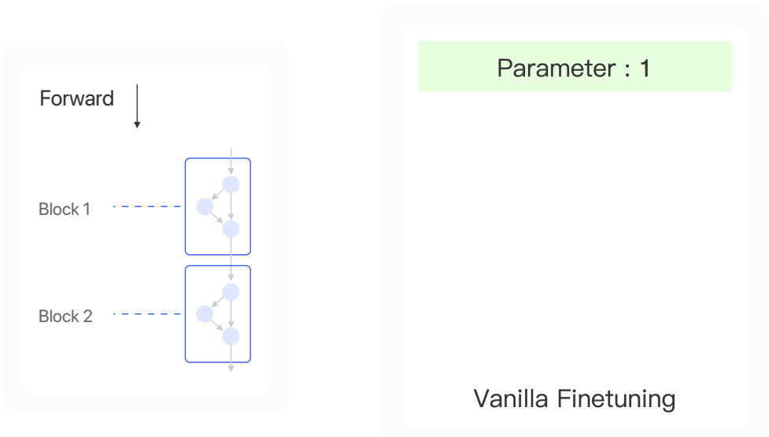

#### （2）梯度

在反向传播过程中，计算得到的梯度也保存到显卡中。

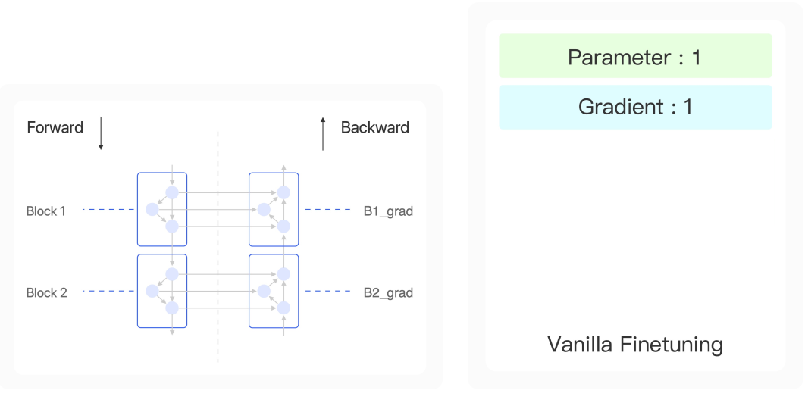

#### （3）中间结果

模型的中间计算结果，比如线性层 $y=Wx$，为了计算反向传播，需要在前向传播时在显卡中保存模型的输入(中间结果)。

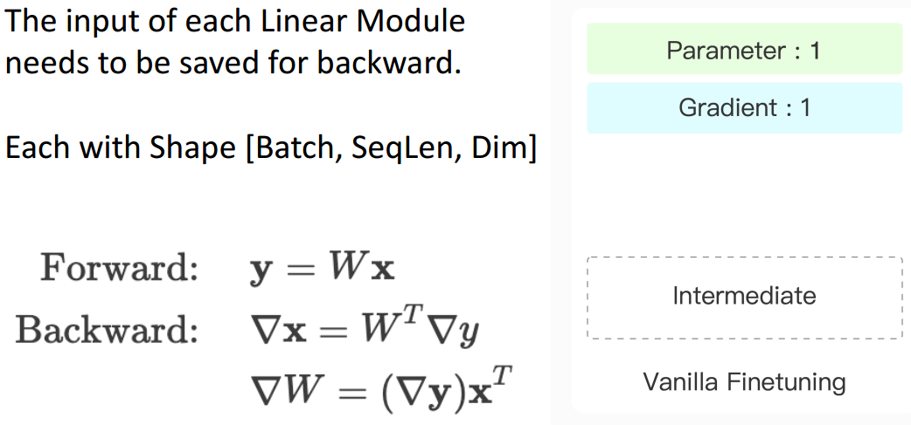

#### （4）优化器

第四部分，在显存中占大头的一部分，就是优化器，比如`Adam`，需要保存模型的梯度，和相关的历史信息`(m_t,v_t)`。它们的参数量是和梯度等数量级的。

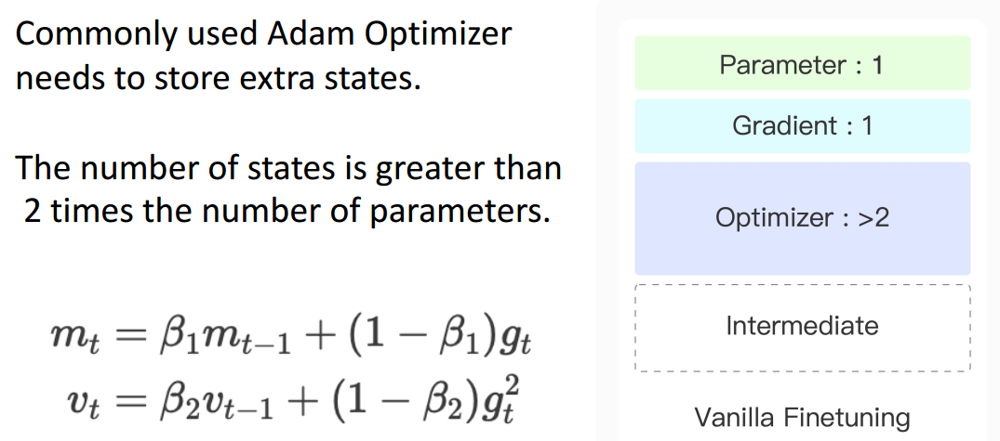

这四部分是预训练模型在显卡中主要的四个组成部分。 &#x20;

#### （5）示例

一个11B参数的预训练语言模型，每个需要用float类型(FP32)来存储 &#x20;

$$
\frac{11 * 10^{9} * 4(F P 32)}{1024^{3}} \approx 40 G B
$$

光模型参数就占用了40GB的显存。

# 2.模型训练优化方式

## 2.1 数据并行

### (1）协作通信

#### 0）参数服务器

1. 有一个参数服务器。
2. 前向传播

- 在每台设备上复制该参数
- 每个副本处理输入的一部分。

1. 反向传播

- 每个副本的梯度取平均值。
- 平均梯度用于更新参数服务器

在数据并行过程中，有一个参数服务器，它保持了模型的参数，以及完整的数据。前向传播过程中，参数服务器上的参数会被复制到所有的显卡上，这样每张显卡上都得到了和参数服务器一样的参数。然后把数据分成三份，每张显卡用这部分数据进行前向传播&反向传播，得到各自的梯度，为了让模型学到这份数据的所有知识，需要把这些梯度信息进行聚合。这里用了一个取平均操作，然后让聚合好的参数去更新模型。就能学到这三部分数据合起来完整的知识。

参数服务器可以在0号显卡上，从0号显卡把模型的参数复制到1,2,3号显卡。这就像一个广播过程；而从1,2,3号显卡上对模型的梯度进行聚合(或规约)，把规约的结果放到服务器0号显卡上。

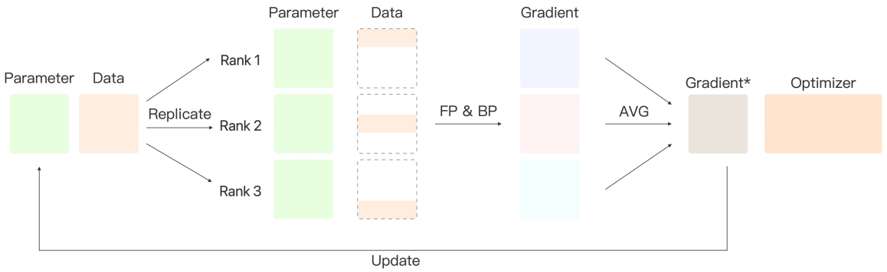

#### 1）Broadcast &#x20;

广播算子做的事情就是**把数据从其中的一张显卡上传到其他所有的显卡上**。可以看到通过广播之后，在原本第二张显卡上的`in`这个向量广播到所有显卡上变成了`out`向量。

#### 2）Reduce

规约(Reduce)。规约有很多种种类，可以是**求和、平均、最值**等。会把各张显卡上的数据进行一个规约，然后把规约得到的结果放到一张指定的显卡里面。比如这里把规约的结果放到2号显卡里面。假设规约操作是求和，那么2号显卡最终得到的`out=int0+in1+in2+in3`。

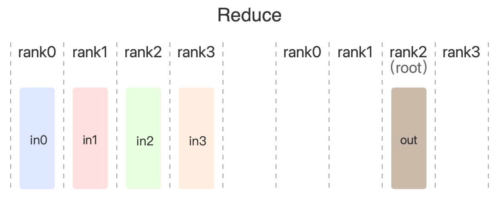

#### 3）All Reduce

All Reduce。比规约多了一个All。在规约的基础上，**把规约得到的结果告诉所有的显卡(All)**。也就是说，最后得到的结果里面，每张显卡上都会得到完全一样的`out=in0+in1+in2+in3`。

#### 4）Reduce Scatter

Reduce Scatter。和All Reduce的相同之处在于，都会把规约得到的结果发送给所有的显卡。不同之处在于，**Reduce Scatter最后每张显卡上只得到了一部分的规约结果**。比如0号显卡就会得到`in0`的前`1/4`的参数＋`in1`的前`1/4`参数＋`in2`的前`1/4`参数＋`in3`的前`1/4`参数。而3号显卡会得到`in0`的最后`1/4`的参数＋`in1`的最后`1/4`参数＋`in2`的最后`1/4`参数＋`in3`的最后`1/4`参数。

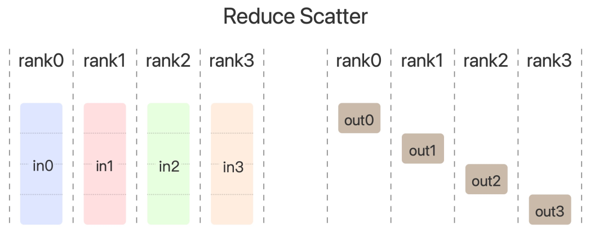

#### 5）All Gather

收集(All Gather)，**拼接每张显卡上的结果**。比如`in0`拼接`in1`拼接`in2`拼接`in3`得到0号显卡的`out`，然后广播到所有显卡上。

### （2）数据并行

可以看到数据并行有两个核心点。

1. **通过把数据分成很多份**，让每张显卡计算得到各自梯度之后，为了得到所有数据的知识，需要把这些梯度进行一个规约操作。
2. 通过使用参数服务器，让规约后的梯度去更新参数服务器上的参数。然后通过广播的操作，让每张显卡上**同步**得到更新之后的参数。

### （3）分布式数据并行

而分布式参数并行对此进行了优化，**舍弃了专门的参数服务器**，让每张显卡各自去完成参数的更新，保证它们参数更新之后的结果一致。

具体来说，初始时，每张显卡上都有一个相同的模型参数，得到了一部分数据。通过前向传播&反向传播得到各自的梯度信息，然后对梯度信息进行一个规约。为了让每张显卡都得到相同的梯度信息，使用All Reduce，它会把规约结果告诉所有的显卡。这样，每一张显卡上都能得到完整的规约之后的梯度，每张显卡都有一样的参数，就可以分别通过模型的优化器进行更新。每轮更新之后，既然参数一样，梯度一样，优化器之前的历史信息一样，那么更新之后，各张显卡上的参数也会保持一致。

带来的显存上的优化

中间结果是一个和`batch`乘以句子长度和模型维度相关的显存占用。在使用数据并存的时候，把一批数据分成了很多份，让每张显卡只处理其中的一部分数据。每张显卡上所处理的`batch`大小就降低到了原来的显卡数量(n)分之一。通过把输入的维度进行了降低，那么模型整体的中间结果量也会进行降低。

缺点：数据较少时，参数，梯度，优化器都会保存到显卡上。

## 2.2模型并行

一张显卡上无法存放模型的所有参数，那么就想办法把一个模型分成很多个小的部分。

比如针对线性层矩阵乘法的例子，假设有一个`3×2`的矩阵。它乘上一个 `2×1`的向量，那么本质上可以把它的结果分成三部分。

这里的 `3×2`的矩阵就是线性层中的参数 `W`，向量就是线性层的输入。可以通过矩阵乘法的性质，把模型的参数横向切成很多份(n)，最后得到线性层的结果就是很多个这样小的矩阵乘上线性层的输入，最后把结果进行拼接。

通过这样的方式，线性层的参数就可以划分到多张显卡上。同时需要保证多张显卡上模型的输入是一样的。那么就不能使用数据并行的方式对数据进行划分。

$$
\left[\begin{array}{ll}1 & 2 \\ 3 & 4 \\ 5 & 6\end{array}\right]\left[\begin{array}{l}x \\ y\end{array}\right]=\left[\begin{array}{c}1 x+2 y \\ 0 \\ 0\end{array}\right]+\left[\begin{array}{c}0 \\ 3 x+4 y \\ 0\end{array}\right]+\left[\begin{array}{c}0 \\ 0 \\ 5 x+6 y\end{array}\right]
$$

$$
\begin{aligned} \mathbf{y}_{A} & =W_{A \times B} \mathbf{x}_{B} \\ & =\left[W_{\frac{A}{n} \times B}^{(1)} ; W_{\frac{A}{n} \times B}^{(2)} ; \cdots ; W_{\frac{A}{n} \times B}^{(n)}\right] \mathbf{x}_{B} \\ & =\left[W_{\frac{A}{n} \times B}^{(1)} \mathbf{x}_{B} ; W_{\frac{A}{n} \times B}^{(2)} \mathbf{x}_{B} ; \cdots ; W_{\frac{A}{n} \times B}^{(n)} \mathbf{x}_{B}\right]\end{aligned}
$$

**需要保证每张显卡上的输入是一样的，是同样一批数据**，**这里对线性层参数进行划分**。每张显卡上得到线性层参数矩阵的一小部分，通过这一小部分参数和数据进行矩阵乘法，就得到了很多个子结果。这里通过All Gather收集算子进行拼接，然后广播给所有的显卡。

这样，每张显卡上只需要保存原来的N分之一的模型参数，N是显卡数量。由于只保留了这么一小部分参数，梯度也只需要保留这么多，同时优化器也只需要保持同样级别的参数量。但模型计算的中间结果没有减少，这也是该方法的一个弊端。当batch size很大的时候，仍然会出现显存溢出的问题。

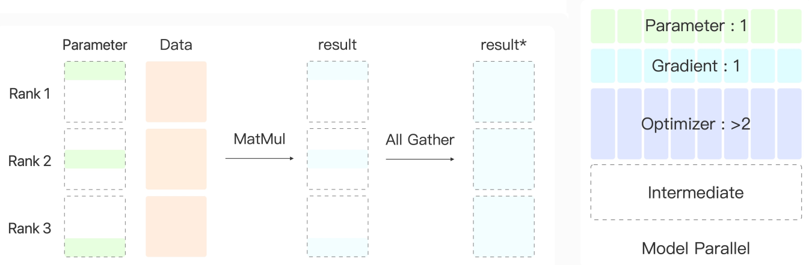

## 2.3 ZeRO

Zero Redundancy优化器是基于**数据并行**建立的一套框架，在数据并行中需要对模型的梯度进行规约。为了保证每轮迭代之后每张显卡上的参数仍然是一致的。就让每张显卡都得到了规约后的参数。然后每张显卡各自进行更新。

可以发现每张显卡用的是同样的一批数据，和同样的一批梯度去进行参数更新。那么它们各自去进行参数优化，是不是就带来了计算上的重复和冗余。

为了消除这样的冗余，那么**每张显卡只获得一部分的梯度，然后只更新一部分参数**。这样多张显卡通过合作的方式来更新模型的完整参数。

### （1）ZeRO-Stage 1 &#x20;

具体来说，由于是基于数据并行的架构，因此**每张显卡上保存了完整的模型参数**。有一部分数据，通过前向传播&反向传播得到各自的梯度。之后在规约的时候，不是使用All Reduce的方式，而是使用**Reduce Scatter**让每张显卡得到一部分reduce的结果。这样让**每张显卡上得到的部分梯度去更新对应的部分模型参数，最后通过收集的操作All Gather将每张显卡分工合作之后的结果告诉所有的显卡**。这样，每张显卡上得到了完全一样的参数和一致的结果。

### （2）ZeRO-Stage 2 &#x20;

在第2阶段中，进行了一个优化。在第1阶段中，需要在反向传播得到所有梯度之后，对梯度进行Reduce Scatter，然后让每张显卡上各得到一部分规约后的梯度`Gradient*`。 原来的梯度就不需要保存在显卡上了。**在第1阶段，在反向传播结束之后，才把这个梯度移除**。那可以在反向传播的过程中先把`Gradient*`算出来，然后把之前一步的`Gradient`删掉。

### （3）ZeRO-Stage 3

在第3阶段，**对模型的参数进一步划分**。因为每张显卡上只保留了一部分梯度去进行参数更新，参数更新也只更新一部分的模型参数。这样，**实际上每张显卡可以只保存它自己参数更新所负责的那一部分参数**。在FP\&BP的过程中，需要的时候，把模型的参数进行一个All Gather的操作， 用完之后，就可以将参数从显卡中释放。

注意：反向传播也需要模型完整的参数

### （4）总结

比较一下这三个阶段的显存占比：

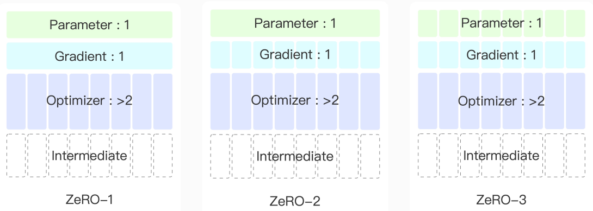

在第1阶段中，每张显卡只需要处理一部分的模型梯度，优化器降低到了原来的显卡数分之一，同时把中间结果的量也降低到原来的卡数分之一； &#x20;

第2阶段中，进一步地把模型的梯度划分提前，把Reduce Scatter提前到了反向传播的过程中，实际上不需要保留完整的梯度。 &#x20;

第3阶段中，进一步地划分参数。

通过这三部分的优化，显卡上的四大组成部分：参数、梯度、优化器和中间结果都得到了划分，每张显卡只需要保持自己的那部分参数。

## 2.4 Pipeline并行

与模型的并行方法有类似之处，模型并行的方法通过把线性层分成很多个小的矩阵，然后把这些小的矩阵分到各张显卡上。 &#x20;

而对流水线的并行方法，**把模型的不同层分给不同的显卡**。比如有一个三层的Transformer，可以把Transformer的第一层分到第一张显卡上；第二层分到第二张显卡上，等等。 &#x20;

进行前向传播的过程中，需要在第一张显卡上完成第一层的模型计算，然后把计算结果告诉第二张显卡，第二章显卡进行计算，再把计算结果传给下一张显卡。 &#x20;

可以看到，这样的方法，显存占比都得到了划分，因为每张显卡上只保留了某些层的参数，也只用保留对应的梯度。虽然没有使用数据并行的方法，但模型层数变少了，这样中间结果也得到了减少。 &#x20;

但这种方法存在的弊端在于，0号显卡计算的时候，1号和2号显卡实际上处于空闲的状态。

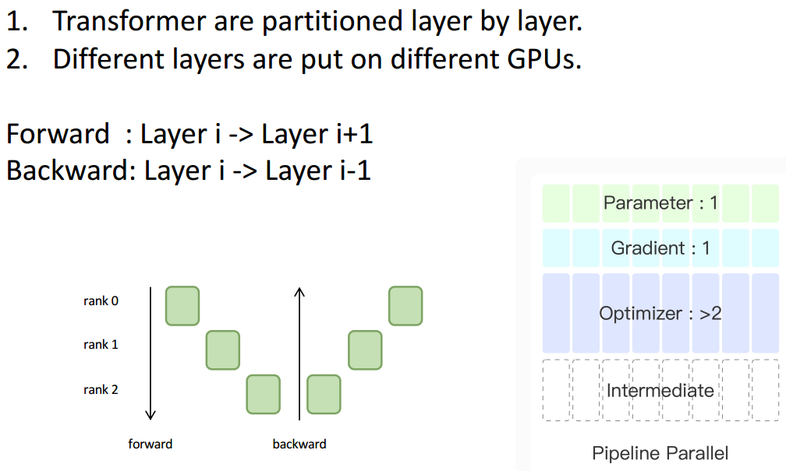

## 2.5 优化技术细节

### （1）混合精度

比如C语言中有`float`类型、`double`类型和`long double`类型。数值表示范围依次增大。

`double`类型比`float`类型有更大的表示范围和更高的有效位精度，但是`double`类型的计算会更慢。 &#x20;

同理`FP16`和`FP32`是一样的，前者的数值表示范围和有效位数更小，同时计算会更快。 &#x20;

在\*\*一般模型的训练中，可能使用`FP32`\*\***作为默认训练参数的表示**。实际上，模型的参数一般不会超过千这个数量级，那么完全可以使用`FP16`。

那能否从`FP32`转到`FP16`得到运行速度上的提升呢？其实会面临一个问题，在参数更新的时候，`权重=梯度*学习率`，一般学习率是比较小的：`1e-5`、`1e-3`等。而`FP16`能表示的最小值，是`1e-5`数量级的数，假如梯度乘上学习率低于`FP16`的表示范围，那么参数更新量就会产生丢失(下溢)。

那么既然`FP32`能达到出更高的表示范围，**可以把**\*\*`FP16`****的梯度乘上学习率得到的参数更新量表示为****`FP32`\*\*，但模型的参数是更低精度的`FP16`。那无法直接把参数更新量加到模型参数上，**此时需要在优化器上额外保留单精度(****`FP32`****)的一个参数。**

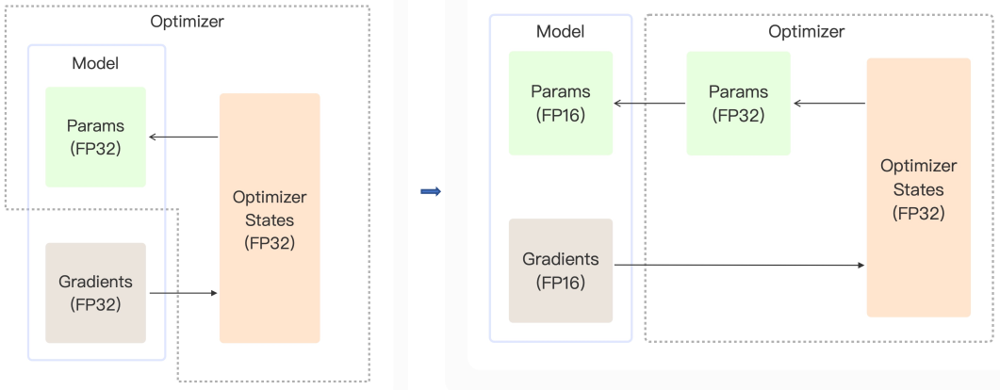

在一般的模型训练中，模型会有`FP32`的参数和`FP32`的梯度，然后优化器会使用`FP32`的梯度进行参数优化。

而在混合精度训练中，为了加速模型的前向传播&反向传播，模型中会使用半精度(`FP16`)的参数，和半精度的梯度，把梯度传到优化器里进行优化器的更新。**同时把优化器的更新量保存为**\*\*`FP32`****类型，把这个****`FP32`****类型通过优化器里临时创建的****`FP32`\*\***参数进行累积，之后转回到FP16的参数来与模型进行计算。**

### （2）Offloading

以Adam为例，**优化器的参数量会是模型参数量两倍的关系**，显然它是一个显存占用的大头。能否把它从显卡中移除呢？

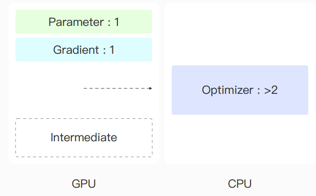

其实是可以的，**可以把它从显卡上移到CPU上**。 &#x20;

这样需要先把模型参数的梯度从显卡中传给CPU，在CPU上进行优化器的优化，将优化的结果传回显卡上。在使用了ZeRO3梯度优化之后，参数划分为显卡数分之一，通过把一张显卡绑定到多张CPU上，就可以让每张CPU上的计算量足够低，能让CPU不成为模型训练的瓶颈。

### （3）Overlapping

通信的计算的重叠。在GPU中的内存操作一般是**异步的**，**可以提前给内存发送一个请求，可以去进行其他的计算，其他计算完成之后，对那个内存请求进行接收**。

在模型前向传播过程中，需要把Layer1的参数通过Gather操作，然后对Layer2的参数进行优化。在获得完Layer1参数之后，在Layer1前向传播计算过程中，异步地把Layer2参数的获得进行提前。在Layer1前向传播计算完之后，Layer2的参数也已经获得，那么就可以马上进行Layer2前向传播计算。

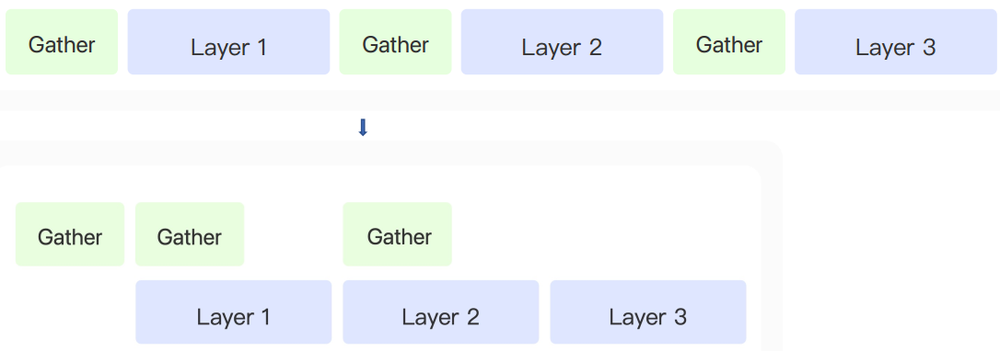

### （4）Checkpointing

Checkpointing就是检查点，就像单机游戏中的存档。

为了支持模型的反向传播，需要把模型计算的所有中间结果保持在显卡中，是否可以通过存档的方式进行优化。

即**不把所有结果都保持到显卡中，而只保持一定的存档点**。

以Transformer为例，只保留Transformer大层的输入作为检查点，在反向传播过程中，那么如何为大层中的线性层梯度进行计算。此时可以通过**重计算**，就是说通过Transformer每个大层的输入，在反向传播过程中，重新对它进行一个前向的传播。临时得到每个大层里面所有线性层的输入，那么得到了中间结果，就可以进行反向传播。 &#x20;

完成了这一层的反向传播之后，就可以把检查点和临时重计算的中间结果从显存中清理掉。这样就不需要保存那么多中间结果。

## 2.6 BMTrain——使用介绍

本小节介绍BMTrain性能上的提升。

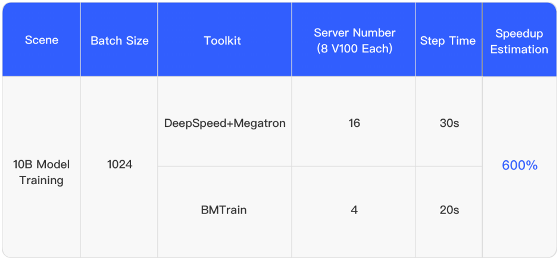

据说可以使用更少的机器，达到更快的速度。

[bmtrain\_demo.ipynb - Colaboratory (google.com)](https://colab.research.google.com/drive/1H-T7PmTjdcgwYUFfMikfxZ4_bMWRKu8h?usp=sharing "bmtrain_demo.ipynb - Colaboratory (google.com)")

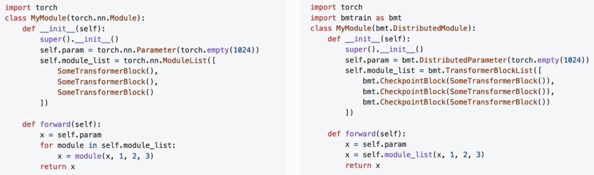

使用上也简单，替换一些包名前缀。就可以用到前面提到的一些技术。

# 3.模型压缩

背景就是大模型的规模增长非常快。

接下来介绍模型压缩的一些技术，目的是希望把大规模的模型压缩成更小规模。 &#x20;

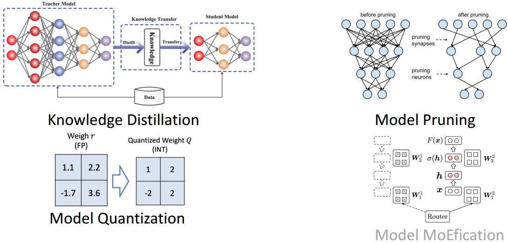

## 3.1 知识蒸馏（Knowledge Distillation）

什么是知识 ？

这里知识指的是**模型的参数本身**，本质是把模型从输入映射到输出的过程。知识蒸馏就是想把这种映射能力从大模型迁移到小模型上。

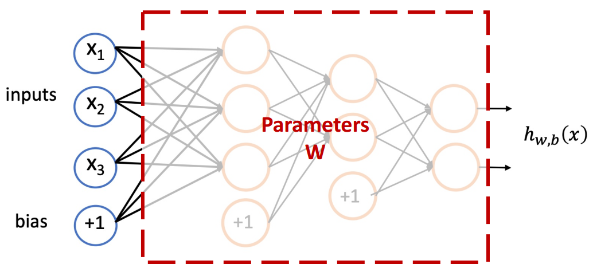

soft target比gold labels提供了更多的信息

对于输入数据，会有大模型作为Teacher，它会算出当前数据的预测结果，logits。 &#x20;

同时，该数据也可以输入给一个小得多的Student模型，该模型对于数据也能给出logits，知识蒸馏想做的事情是让这两个logits尽可能地接近。

### （1）PKD

第一篇关于预训练模型的知识蒸馏工作称为PKD，它是面向BERT做的知识蒸馏。

> Sun et al. Patient Knowledge Distillation for BERT Model Compression. EMNLP 2019.

它针**对传统的知识蒸馏进行改进，让student模型可以从teacher模型中间层进行学习**。 &#x20;

PKD针对模型很多层都有输出，或者说隐藏状态。它想做的事情是**让student模型的隐藏状态和教师的尽可能接近**。而不是仅拟合最终的输出。

### （2）TinyBERT

还有一个非常有代表性的工作是，TinyBERT。它进一步地推广了能学习的信号。**从Teacher模型中找到了更多的可用于知识蒸馏的中间表示。** 比如输入的嵌入向量以及Attention矩阵。

> Jiao et al. TinyBERT: Distilling BERT for Natural Language Understanding. Findings of EMNLP 2020

## 3.2 模型剪枝

这里剪枝做的事情，比如对于参数矩阵`W`，可能有很多元素非常接近于0。那么是否可以把这些参数丢掉。 &#x20;

核心是**去除参数冗余部分**，去除的依据是根据重要性，重要性最直观的依据是看元素绝对值大小，如果非常接近于0，那么就认为它不重要。

剪枝分为**结构化剪枝**和**非结构化剪枝**。 &#x20;

现在比较有用的是结构化剪枝，它考虑一次性删除矩阵中的一行/一列/一块。这样删掉之后矩阵还是一个比较规整的形状，从而比较利于并行化计算。

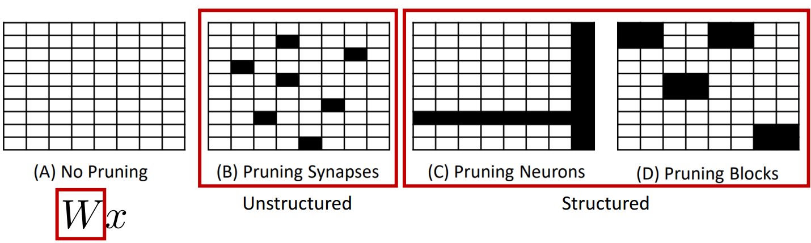

权重剪枝效果

- 30-40%的权值可以被丢弃而不影响BERT的普适性(剪枝预训练)
- 对下游任务进行微调不会改变其性质(剪枝下游)

注意力剪枝（结构化）

- 切除一个头
- 定义注意头的重要性分数

$$
I_{h}=\mathbb{E}_{x \sim X}\left|\operatorname{Att}_{h}(x)^{T} \frac{\partial \mathcal{L}(x)}{\partial \operatorname{Att}_{h}(x)}\right|
$$

针对注意力中的冗余。如果把某个注意力head丢掉，观察对与机器翻译和语言理解任务上的影响，从图中可以看到，这种做法不一定会对模型造成负面的影响，甚至很多时候还带来结果的提升。

在不同的模型上迭代地剪枝头(蓝线)

- 层剪枝(结构化)
- 将dropout从权重扩展到层
- 训练：随机dropout层
- 测试：选择任意深度的sub-network

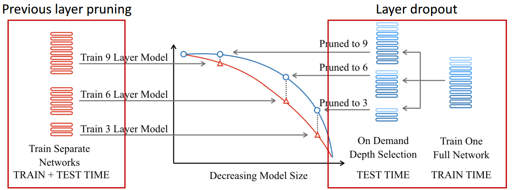

## 3.3 模型量化

标准的神经网络数值计算是浮点计算，那么表示的位数相对多一些。观察发现，神经网络其实不需要这么高的精度，所以可以把浮点的表示转换成定精度的表示。

随着位数的降低，准确率的变化：

## 3.4 其他方法

### （1）权重共享

ALBERT：两种参数缩减技术&#x20;

- 将大的词表向量分解为两个小矩阵&#x20;
- 跨层参数共享

> Lan et al. ALBERT: A Lite BERT for Self-supervised Learning of Language Representations. ICLR 2020.

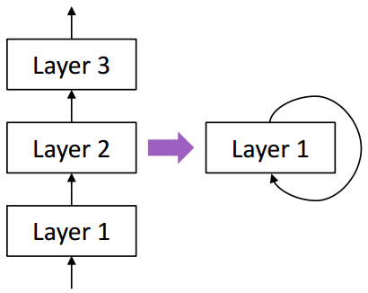

### （2）低阶近似（Low-rank Approximation）

$$
\begin{array}{c}D=U \Sigma V^{\top} \in \mathbb{R}^{m \times n}, \quad m \geq n \quad \Sigma=: \operatorname{diag}\left(\sigma_{1}, \ldots, \sigma_{m}\right) \\ \widehat{D}^{*}=U_{1} \Sigma_{1} V_{1}^{\top}\end{array}
$$

难以直接进行低秩近似

分解输入矩阵

### （3）Architecture Search

Transformer架构是否是完美的？

- 基于Transformer的神经结构搜索
- 预定义几个简单模块
- 对每个架构进行几个小时的训练

> So et al. Primer: Searching for Efficient Transformersfor Language Modeling. NeurIPS 2021.

两种高效的架构

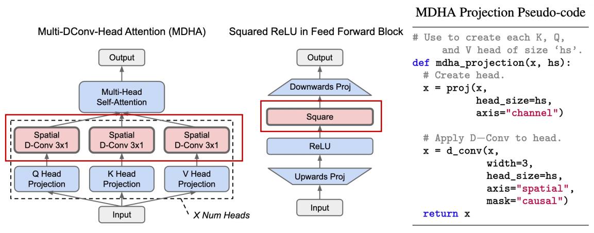

# 4.BMCook

与现有的压缩工具包相比，BMCook支持所有主流的PLM加速方法

- 用几行代码实现不同的压缩方法
- 压缩方法可以以任何方式组合到极端加速

- BMCook的核心：模型压缩配置文件
- 用几行代码实现多种方法

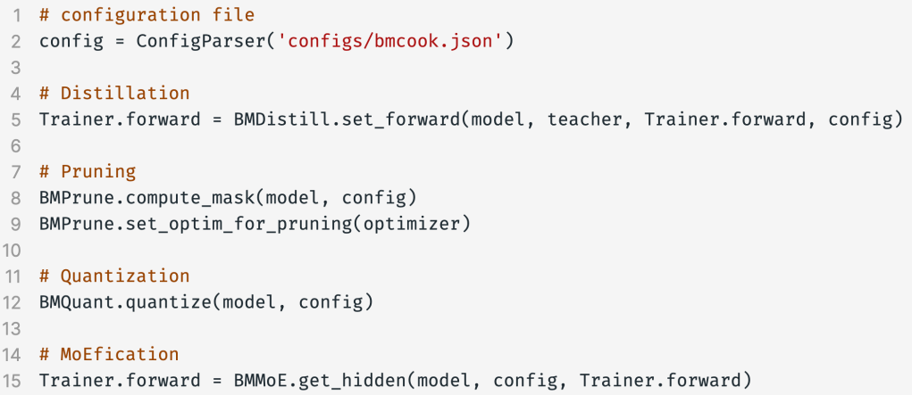

蒸馏配置，支持MSE和CE损耗

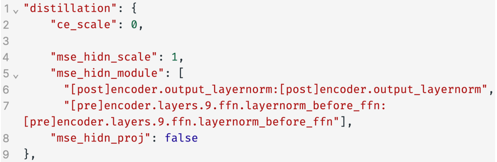

模型剪枝配置，支持非结构化剪枝

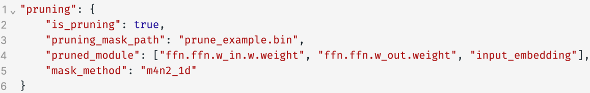

模型量化配置，更换所有线性模块

# 5.BMInf

BMInf是OpenBMB发布的第一个工具包。

Github repo: [https://github.com/OpenBMB/BMInf](https://github.com/OpenBMB/BMInf "https://github.com/OpenBMB/BMInf")

主要的目的是能在便宜的GPU，比如GTX 1060上，也能运行起来大模型。

消费级显卡运行大模型困难：

1. 高内存占用；
2. 计算能力；

## 5.1 深入理解Transformer

来深入分析模型，看如何优化模型。

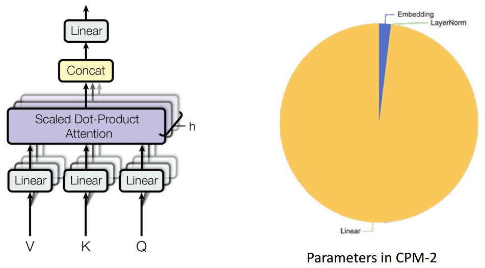

Transformer模型中主要的就是**线性层**，比如对于CMP-2中90%的参数都是在线性层中。

所以先来针对线性层。**在允许一些精度损失的前提下，来优化线性层的运算效率**。

> [https://developer.nvidia.com/blog/nvidia-hopper-architecture-in-depth/](https://developer.nvidia.com/blog/nvidia-hopper-architecture-in-depth/ "https://developer.nvidia.com/blog/nvidia-hopper-architecture-in-depth/")

目前常用的是`FP32`，但目前模型比较大，为了降低开销，逐渐在训练过程中引入`FP16`。

> `FP16`示例：1.001， -1.001
> `FP8`示例：1.0， 1.25， 1.5

`INT8`：范围更小，但更准确

为了进一步降低开销，有没有可能使用INT8来表示参数。

## 5.2 量化

使用整数来模拟浮点矩阵运算。

首先**找到矩阵里面最大的那个数，然后缩放到`-127~127`，得到缩放系数。然后把浮点矩阵中所有元素除以该缩放系数**，每个元素值经过四舍五入就能得到新的整数。这样可以把浮点数矩阵拆成缩放系数和一个整数矩阵。

就让能让矩阵中值从`FP16`变成了`INT8`。

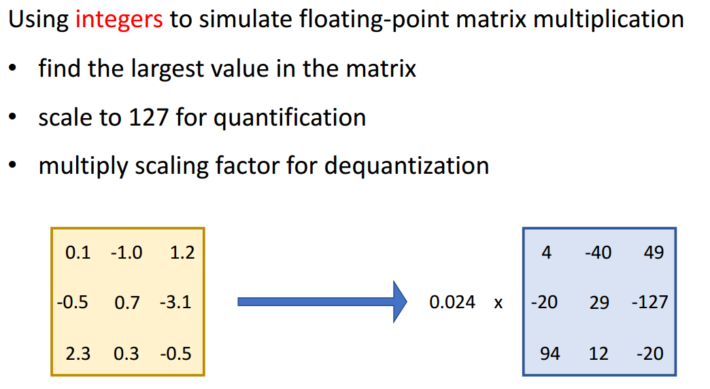

在完成了矩阵量化之后，如果用INT8来模拟矩阵乘法呢？

针对线性层来说，分别对它的**输入和权重进行量化，就可以得到两个INT8的矩阵和对应的缩放系数**。接着在这两个INT8的矩阵中进行矩阵乘法。这会得到一个整数结果，但该结果INT8是存不下来的，此时会用INT32来存储。同时针对缩放系数进行一个标量惩罚，得到一个新的缩放系数，然后把整数结果乘上这个新缩放系数还原成浮点数。

但是该方法直接应用在Transformer上效果不理想。因为Transformer中矩阵太大，使用一个缩放因子有点困难。

此需要更加精细的量化方法。**可以将量化的粒度从原来的整个矩阵变成一行或一列，计算单行/列的缩放系数。** 这种方法能在Transformer上达到不错的效果。

使用这种方法可以使模型大小优化一半(11G)，但还是不能放到GTX 1060(6G)上。

## 5.3 内存分配

借鉴操作系统中**虚拟内存**机制。 &#x20;

在进行一个百亿模型推理的时候，实际上**并不会同时用到这11G的参数**，每次只用一部分。比如每次只计算一层，实际上只用到了这一层的参数。那些暂时不用计算的层没必要一直放到GPU上。

这种方法在`CUDA6`中被实现了。

**如果能在计算一层的同时去加载另一层参**数，那么理论上只需要两层，就可以让整个模型完美地运行起来。比如我们在计算第0层的时候，同时加载第1层。这样第0层计算完之后，就可以释放第0层所占的空间，去加载第1层的参数进行计算，同时加载第2层参数。

但实际操作上遇到了一些问题，

实际上**传输一层参数的时间远远超过了计算该层参数所用的时间**。如果只放两层参数的话，虽然占用空间小，但花费的时间反而特别长。那是否可以多放几层，来减少加载参数所用的开销。

假设**一块GPU上能放n层参数，那么可以固定n-2层在GPU上，多余的2层空间用于调度**。

那现在的问题是，哪些层固定？

假如两层需要从CPU加载，左边的方案是固定7,8,9，调度6和10。  右边是固定6,8,10，调度7个9。 &#x20;

这两种方法的区别在于，**要加载的层之间的间隔**，左边是间隔了3层，右边是间隔1层。

那么左边的方案肯定不会差于右边的，因为我们在加载完第6层之后，中间留下第7、8、9层计算的时间来加载第10层。即留给加载第10层的时间更长。

所以要**尽量扩大需要加载的两层之间的间隔**。

## 5.4 使用介绍

在实现了上面的技术(BMInf包)之后，终于可以把百亿参数模型放到GTX1060上运行起来。

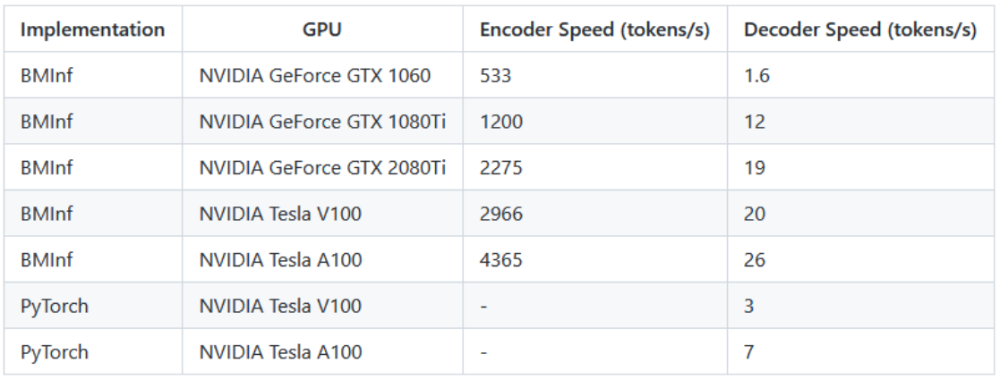

那么这么好的工具包怎么使用呢？

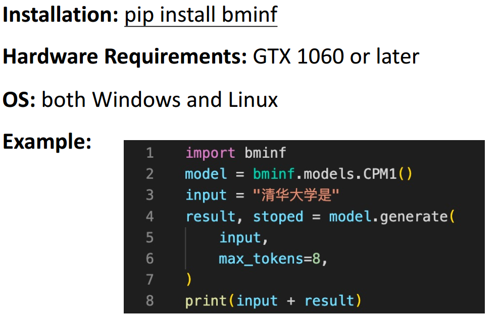
