# 6.文本理解和生成大模型

# 1.简介

## 1.1 NLP的主要应用

NLP的主要应用主要分为两类：**自然语言理解(NLU)**和**自然语言生成(NLG)**。 &#x20;

- **信息检索**是NLU非常有代表性的应用；
- **文本生成**是NLG一个代表性例子；
- **机器问答**综合了自然语言理解和自然语言生成两个任务。

在这三种任务中，大模型都带来了一定的变革。

## 1.2 信息检索

信息检索是非常古老、非常经典的任务。在这一方面，大模型可以帮助机器来提供更加智能、更加准确的搜索结果。

## 1.3 机器问答

问机器一些问题，希望机器能提供我们想要的答案。**传统的机器问答方法是基于模板、或者基于知识库的，这样使得它的问答范围受限**。

但现在大模型允许机器回答更加复杂的问题，从下面的例子中，列出一些最先进的大模型可以回答的问题。可以看到，即使它背后没有一个知识库去支撑它搜索相关的知识，大模型里面蕴含的知识也足以帮助机器回答上述问题。

## 1.4文本生成

利用大模型可以帮助机器生成更加流畅、自然的文本。

# 2.信息检索

## 2.1 背景

信息以爆炸的形式增加，用户对信息检索的需求也是在急剧增长。

可以看到全球的信息用户数量也非常庞大。 &#x20;

自动检索：**根据用户的查询，从海量的文本信息中提炼出少量的与用户需求高度相关的文档**，反馈给用户。

信息检索有很多典型的应用，比如搜索引擎、问答系统和智能写作等。

## 2.2 IR定义和评价

### （1）IR定义

首先来看下如何定义信息检索(IR)任务。

- 给定一个`query` $q$
- 给定一个文档库 $D = \{\cdots,d\_i,\cdots \}$
- IR系统计算相关系数得分$f(q,d_i)$，然后根据该得分进行排序

一个典型的IR系统分为两个阶段：检索和重排阶段。

- 在检索阶段，针对整个文档库，从中找到相关文档的子集，它**重视的检索速度和相关文档的召回率**；
- 在重排序阶段针对上一步得到的少量文档进行精排，看重的是**性能和效果**。

### （2）IR评价指标

IR中常用的三个指标是`MRR@k`、`MAP@k`和`NDCG@k`。后面的`@k`表示在评测中，只要考虑top K个排序的结果。

#### MRR (Mean Reciprocal Rank)

MRR是平均倒数排名，给定一个待评测的查询集合 `Q`，MRR只会考虑哪个查询排名**最靠前的第一个相关文档的位置**。 &#x20;

$$
M R R=\frac{1}{|Q|} \sum_{i=1}^{|Q|} \frac{1}{\operatorname{rank}_{i}}
$$

比如说查询集合中一个有三个查询：cat、torus和virus。这三个查询排在首位的相关文档位置，分别是第3位、第2位和第1位。那么对它们取倒数之后就是`1/3`、`1/2`和`1`。对它们求均值之后得到`0.61`，就是MRR评测的结果。

$$
M R R=(1 / 3+1 / 2+1) / 3=0.61
$$

#### MAP (Mean Average Precision)

MAP，**一组查询平均准确率的均值，它会考虑所有相关文档**。这里也举个例子，这个查询集合中一共有两个查询，它们分别有4篇和5篇相关文档。 &#x20;

在query1中，这四篇相关文档都被成功地召回了，它们被召回的位置分别是第1位、2位、4位和7位。同样对它们取倒数排名，计算均值之后得到0.83。 &#x20;

在query2中，五篇中只成功召回了3篇，位置是1,3和5。那么计算它们的倒数分数，求均值得到0.45。 &#x20;

接着对这两个查询的分数相加，再求平均，得到0.64。才是最终MAP的得分。

#### NDCG (Normalized Discounted Cumulative Gain)

NDCG，**归一化的折损累积增益**，该**指标是商业的搜索引擎/推荐系统中最常用的评价指标**。它会将文档设置成不同的相关等级，相关程度越高，等级越高。 &#x20;

它的计算方式为：用待评测的排序列表的DCG分数，除以IDCG的分数。IDCG的分数就是一个理想状态下列表的真实排序方式；DCG的计算公式如下图所示。

也看一个具体的例子，针对一个query抽回的五篇文档，分别有不同的相关等级 $rel_i $。 &#x20;

会计算它的增益和折损后的增益，最后再求和就是DCG的分数。

## 2.3 传统方法

### （1）BM25

#### BM25 (Best Matching 25)

给定一个查询，其中包含相应的单词，BM25会计算**该查询与每一篇文档的匹配分数**。

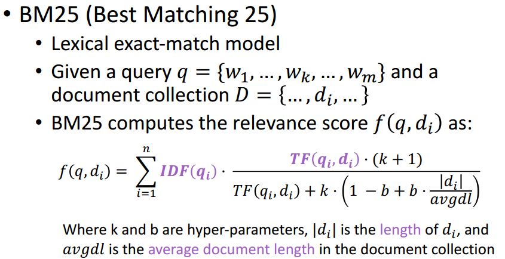

#### TF (Term Frequency)

TF就是**词频**，为查询中每个单词在文档中出现的频率。

#### IDF (Inverse Document Frequency)

而IDF是**逆文档频率**，评估查询单词的稀有程度。如果一个文档在所有文档中都出现，那么它的IDF分数反而很低。

### （2）缺点

那么这种基于词汇匹配的算法存在两方面的问题。

首先是**词汇失配**的问题，因为人类会使用不同的单词来表达同一个意思。&#x20;

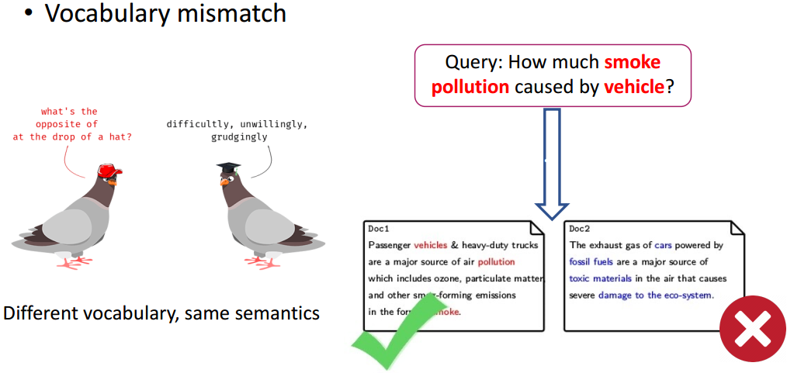

其次是**语义失配**问题，可能即使文档和词汇有很高的匹配率，但描述的含义却完全不一样。

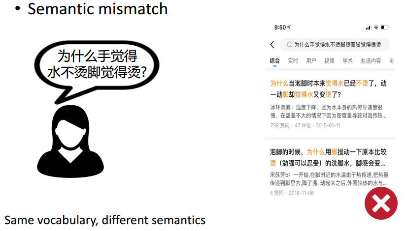

## 2.4 神经网络方法

### （1）简介

神经网络IR**使用神经网络将用户的查询和文档库的中的文档投射到同一个向量空间，然后计算两者的相关性分数**，从而避免了传统IR中的词汇失配合语义失配的问题。

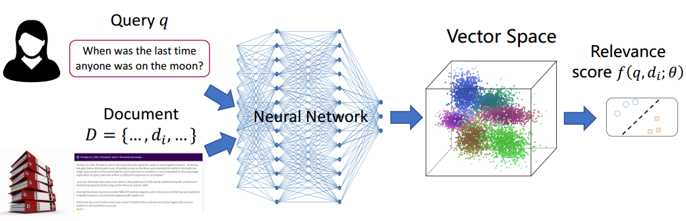

从性能上来说，Neural IR的方法尤其是基于大预训练语言模型的方法，它的检索性能远远超越了传统IR的方法。也可以看到Neural IR的研究热度是逐年增加的。

通常会在**重排序阶段**采用左边的**Cross-Encoder的大模型架构**，它会将查询和问答进行词汇级别的拼接，然后进行一个精细地交互式建模，生成一个`查询-文档`的共同表示，然后产生相关性分数。这种建模方式的好处是比较精细，达到的检索性能也较好，但缺点是计算代价比较高。所以一般使用在重排序阶段。

而在第一阶段，**检索阶段**，一般采用右边的**Dual-encoder，双塔的架构**，使用大模型对查询和文档分别进行编码，形成两个独立的向量，然后再去计算向量间的相似性。这样可以极大地降低计算的开销。

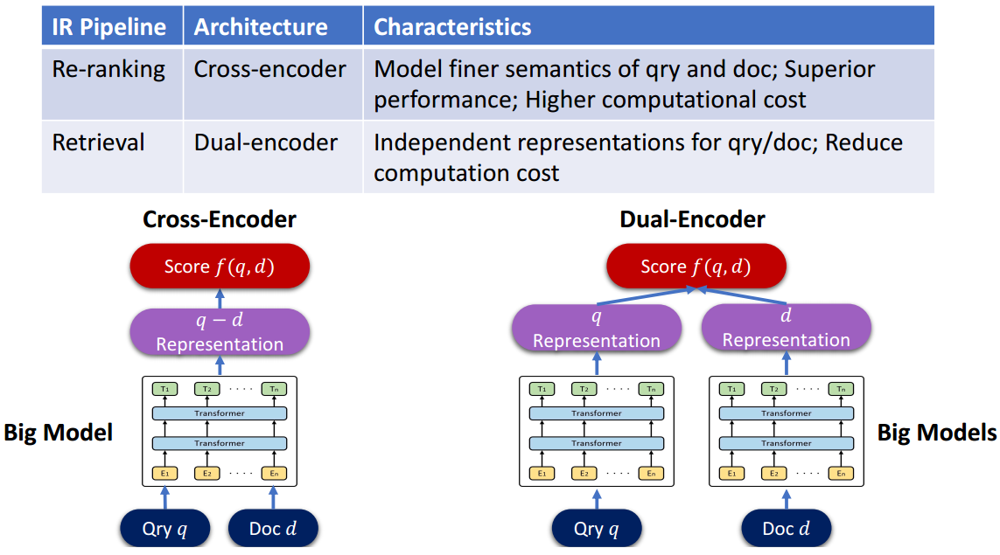

### （2）Cross-Encoder架构

**会先把查询和文档进行拼接，然后一起喂给大模型**。这里以BERT为例，拼接完之后，经过多层transformer的建模之后，把最后一层的CLS token作为`查询-文档`的共同表示。经过一个NLP的投射变成一个标量的分数，可以作为`查询-文档`相关性的分数。

在训练该大模型的时候，训练数据的形式是每个查询配一个相关文档，和至少一篇的不相关文档。

然后采用常见的Ranking Loss，比如这里的Pairwise hinge loss，为相关文档和查询分配更高的分数。

这里分别展示了以BERT和T5作为bacakbone的重排序结果，可以看到相比传统的IR方法，基于大模型的方法可以达到更出色的重排序效果。并且随着模型参数量的增加，重排序的性能也会持续地增强。

> Dai, Zhuyun, et al. SIGIR 2019. Deeper Text Understanding for IR with Contextual Neural Language Modeling. &#x20;
> Nogueira Rodrigo, et al. EMNLP 2020. Document Ranking with a Pretrained Sequence-to-Sequence Model.

### （3）Dual-Encoder架构

这里以DPR为例，它使用两个独立的Encoder分别对查询和文档进行编码，然后用类似softmax这种NLL损失来训练模型。

> Karpukhin Vladimir, et al. EMNLP 2020. Dense Passage Retrieval for Open-Domain Question Answering

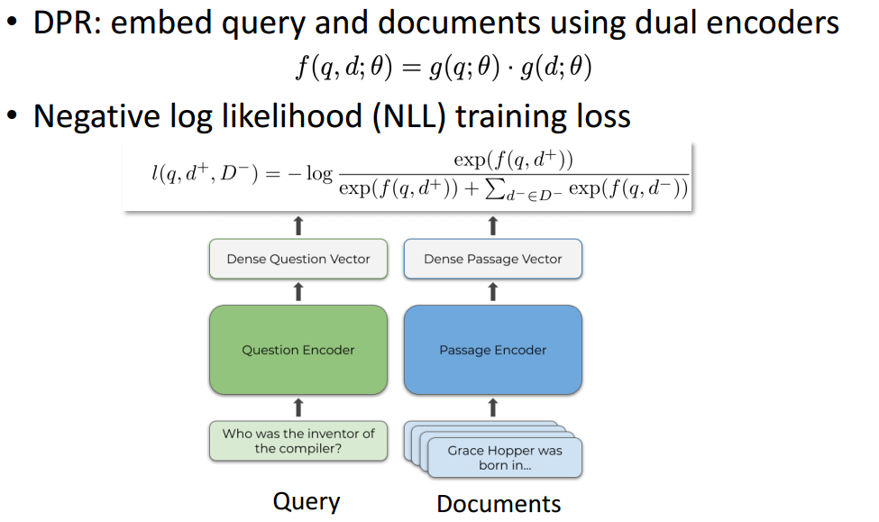

Dual-Encoder架构的好处是，因为是**独立编码**，所以可以提前计算缓存整个文档库的编码。然后只需要计算用户的新查询编码，接着使用一些最近邻搜索的工具，比如`faiss`，去找出最相近的`k`个文档。

> [https://github.com/facebookresearch/faiss](https://github.com/facebookresearch/faiss "https://github.com/facebookresearch/faiss")

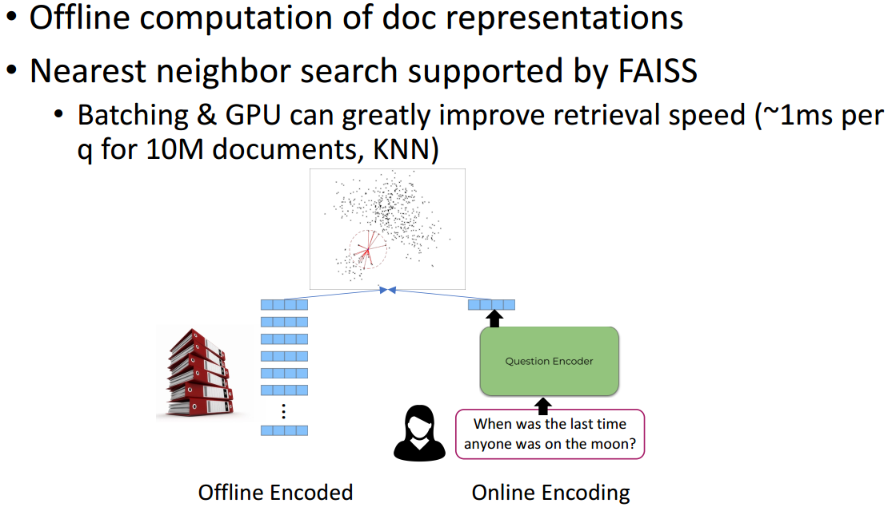

在检索性能方法，在第一阶段检索时，以BERT、T5作为backbone的效果。在使用1K训练数据的情况下，它的效果已经超过了BM25，同时随着训练数据的增加，大模型的性能也会增加。同样模型的大小增加，效果也越好。

> Karpukhin Vladimir, et al. EMNLP 2020. Dense Passage Retrieval for Open-Domain Question Answering. &#x20;
> Ni, Jianmo, et al. arXiv 2022. Large dual encoders are generalizable retrievers

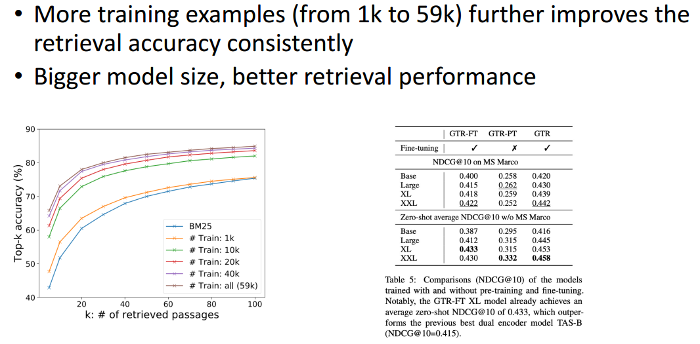

## 2.5 前沿热点

本小节介绍几种比较常见的基于大模型的Neural IR架构，和IR领域比较前沿的研究热点。

### （1）Negative-enhanced Fine-tuning

首先有相当一部分工作是在研究**如何在微调阶段去挖掘更好的负例**，目前几种常见的训练负例有上图这么几种。 &#x20;

- `In-bach negative`：在训练中同一个batch的正例可以作为其他query的一个负例。 &#x20;
- `Random negative`：随机地从文档中进行采样。 &#x20;
- `BM25的负例`：先用BM25针对每个query抽回一些top k的文档，然后删除掉相关文档，剩下的就是不相关的。

在In-batch空间中，它们的分布是非常不一样的， 因此它最大对大模型检索的性能影响也是比较大的。&#x20;

下面介绍一篇工作，它在训练过程中使用模型本身去挖掘更难的负样本，从而获得更好的性能。

#### ANCE (Approximate nearest neighbor Negative Contrastive Learning)

该方法称为ANCE，它会在模型的训练过程中（图中的绿线）去异步地维护Inferencer的程序，然后每隔k步，去把最新的模型拿过来推理一下，把那些排名靠前的难负样本抽回来，加到下一轮的训练过程中，这样不断地迭代刷新。

> Xiong et al. ICLR 2021. Approximate nearest neighbor negative contrastive learning for dense text retrieval.

#### RocketQA (NAACL 2021)

还有一类方法，比如RocketQA，它建模**更精细的Cross-Encoder来帮助Dual-Encoder去过滤难负例**，然后加到Dual-Encoder的训练中，这样交叠学习，从而提升Dual-Encoder第一阶段检索的性能。

> Qu Yingqi, et al. NAACL 2021. RocketQA: An Optimized Training Approach to Dense Passage Retrieval for Open-Domain Question Answering.

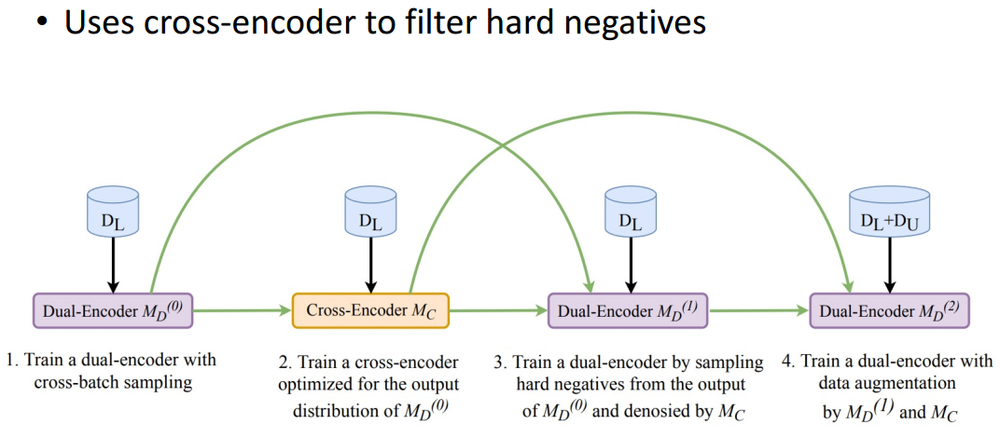

### （2）IR-oriented Pretraining

上面是在微调阶段的一个研究热点，第二个研究热点集中在**大规模的预训练阶段**。

#### SEED-Encoder (EMNLP 2021)

SEED-Encoder，它通过在**预训练阶段为Encoder配置一个较弱的Decoder，来促使下面的Encoder对文本形成一个更好的表示**。它主要的调整，第一个在于Encoder和Decoder之间的连接，第二个在于限制Decoder的Span。这些操作的目地在于**让CLS的表示足够强**，这个模型在预训练的时候只能通过CLS token来重建出原文本。CLS表现能力的增强，对IR是非常有帮助的。

> Lu Shuqi, et al. EMNLP 2021. Less is More: Pre-train a Strong Text Encoder for Dense Retrieval Using a Weak Decoder.

#### ICT (Inverse Cloze Task)

ICT，是在预训练的数据上去做一些操作，比如它会针对预训练的文本，随机地抽取文本中任意的一个句子，把这个句子作为我们的查询，剩下的虚线的文本框，作为查询的一个正例。这样就构建出来在微调阶段才能有的数据，接着它再用In-batch negative来配合着进行提前的预训练。

> Chang Wei-Cheng, et al. ICLR 2021. Pre-training Tasks for Embedding-based Large-scale Retrieval

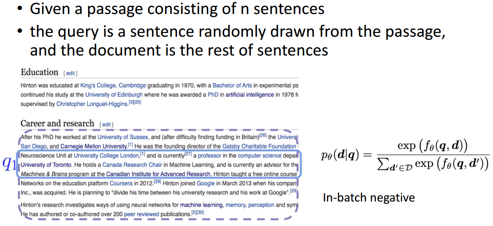

### （3）Few/Zero-Shot IR

现在越来越多的工作开始关注到Few-shot IR领域，因为在现实生活中，有很多检索场景，都是少样本的场景。这些场景缺乏大规模的监督数据，比如长尾的网页搜索、 涉及隐私的个人检索/企业检索、人工标注昂贵的医学/法律等专业领域的检索。

#### Weak supervision generation

在这些领域，有一部分工作在研究如何用**弱监督的数据去取代监督的数据来训练大模型**。比如下图列了三种不同弱监督数据来源。有文档的标题与文本的正文、网页中的锚文本对、还有的直接用大模型去根据文本生成一个query，这样通过大模型生成数据。

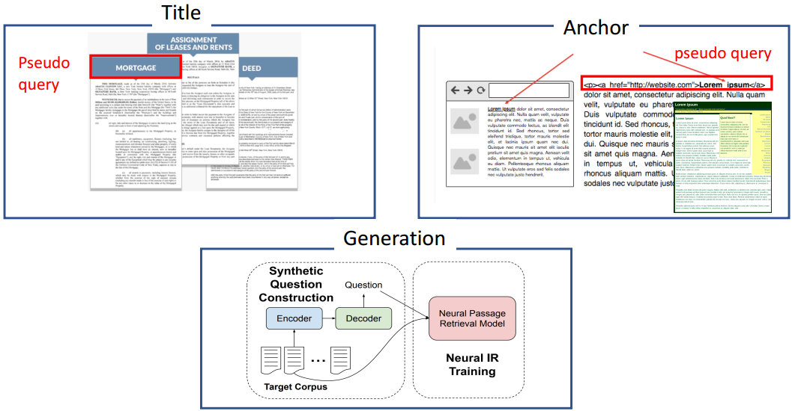

但由于刚才提到的弱监督数据是没有经过人工质量检测，不可避免会存在不同程度噪音。因此也涌现了一类工作，去研究如何针对弱监督数据进行去噪学习。比如ReinfoSelect。

> Kaitao Zhang, et al. WWW 2020. Selective weak supervision for neural information retrieval.

#### （4）其他

还有两个有意思的研究方向，

- 一个是**对话式IR**，针对用户会同时提多个问题，且后面的问题与前面的问题有关联。 &#x20;
- 另一个方向是**使用大模型去检索长文本**。因为长文本情况下，模型需要考虑的问题比较多，比如长距离依赖。

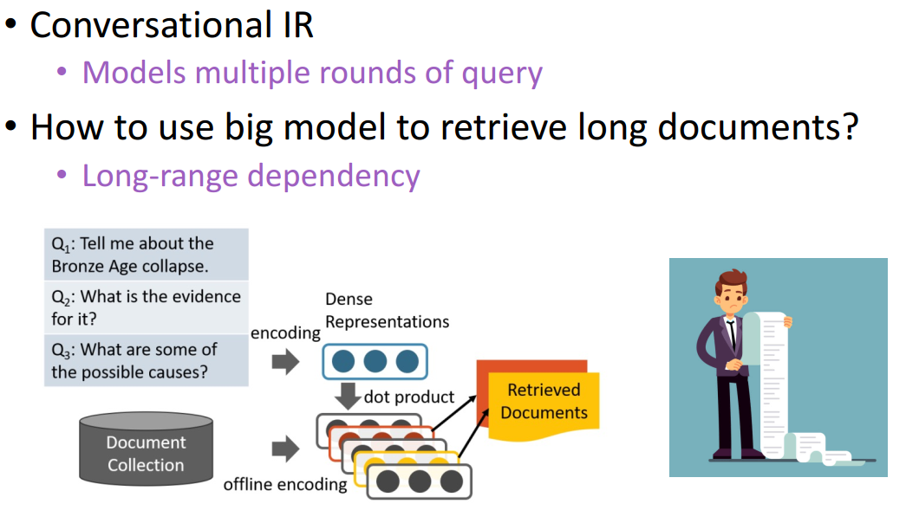

# 3.QA

QA分为很多种：

- 机器阅读理解：阅读特定的文本并回答问题
- 开放领域QA：搜索并阅读相关文档以回答问题
- 基于知识的QA：根据知识图谱回答问题
- 对话式QA：根据对话历史回答问题

这里主要介绍前面两种。机器阅读理解是在检索到相关文档后，让机器代替人类去从相关文档中抽取答案的过程。

## 3.1 机器阅读理解

### （1）RC定义与类型

阅读理解的定义：首先会有一篇文章，以及对应的题目，通过理解题目的含义来回答问题。

阅读理解的形式有很多种。 &#x20;

- 有**完形填空**，通过挖掉句子中某些词，希望模型能正确输出被挖掉的词。
- 多选：
- 抽取式的阅读理解，它的答案隐藏在文章中，让机器去预测问题的答案实际上是文章中的某个词/短语。

从机器阅读理解的数据集类型可以看到它的发展。

### （2）Traditional Pipeline

介绍阅读理解领域一些经典的方法。

在大模型出来之前，机器阅读理解经典的框架是这样的。

> Seo et al., Bidirectional Attention Flow for Machine Comprehension, In Proceedings of ICLR 2017

它是一个四层的结构：

1. 首先**对文档和问题分别进行编码，得分文档和问题的向量集合**。
2. 然后**分别处理这些向量集合**，同时包括一些注意力，得分文档和问题的汇聚向量表示。
3. 接着基于从文档到问题/从问题到文档的**交互得到融合问题和文档的向量**
4. 最后喂给线性层进行**预测**。

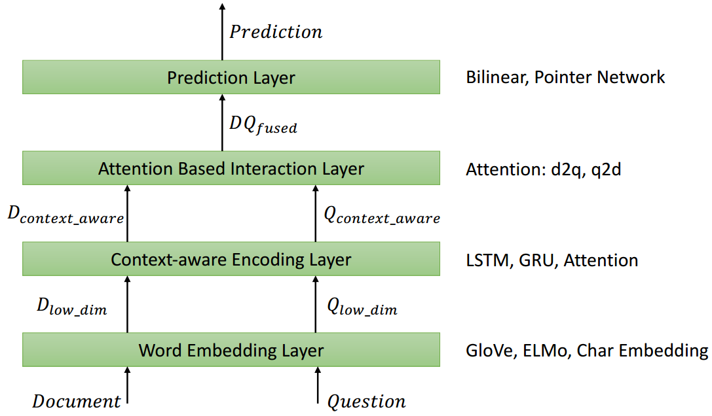

BiDAF就是遵循了上面的框架实现的模型。

> Seo et al., Bidirectional Attention Flow for Machine Comprehension, In Proceedings of ICLR 2017

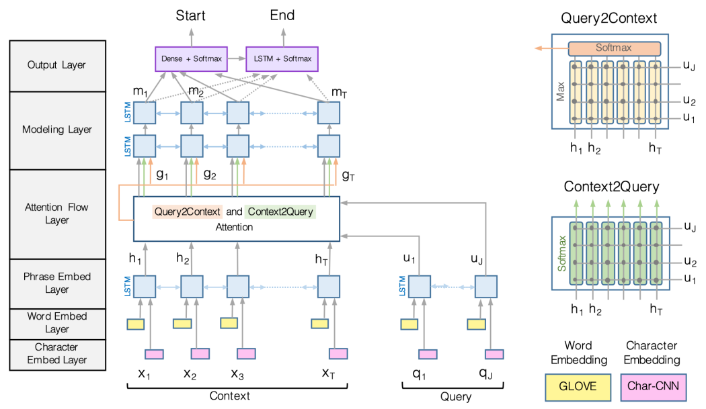

这些设计很复杂，并且迁移性不好。

### （3）Big-model-based Methods

有了大模型之后，**只需要用一个大模型就可以替代上面的前三层**。

这里给出了BERT刚出来时非常简单的实现问答系统的示例。

将问题和上下文的连接提供给BERT。获得问题感知上下文表示，以预测答案的开始/结束

直接拼接问题和文档，作为BERT的输入，然后用`[CLS]`进行分类得到最终的答案。

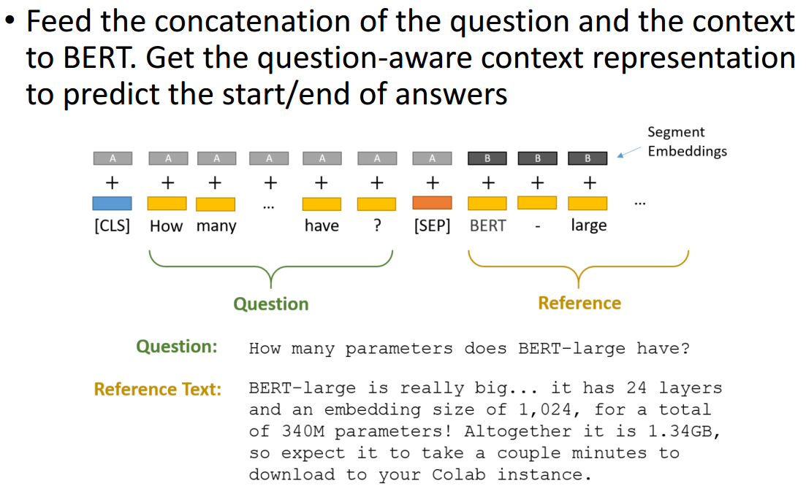

大模型的好处除了在于简化阅读理解的Pipeline之外，还有另一个好处是可以**统一不同问答系统的形式**。

可以统一成`text-to-text`的形式，比如抽取式QA可以看成给定输入，直接输出答案。

> Khashabi et al., UNIFIEDQA: Crossing Format Boundaries with a Single QA System, Findings of EMNLP 2020

## 3.2 开放式QA

开放式QA假设的是**没有给出相关的文章，模型必须自己去寻找相关的文章**。比如从维基百科中去寻找相关文章。开放式QA最终的目标是**建立一个端到端的QA系统**，只需要喂给它问题就能得到答案。

开放式QA有两种类型：生成式和检索式。

### （1）生成式QA

生成式的方法就是**用大模型内所存储的知识，直接去回答问题**。

> Roberts et al., How Much Knowledge Can You Pack Into the Parameters of a Language Model?, EMNLP 2020

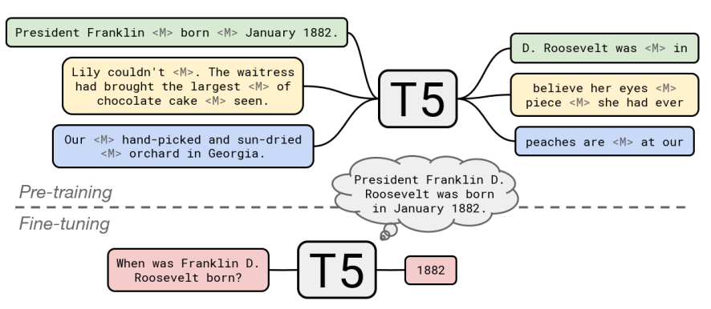

### （2）检索式QA

第二种是基于检索的方法，通常由两部分组成：`Document retriever`和`Document reader。`

分别用于检索出相关文章以及从相关文章中找出对应答案。&#x20;

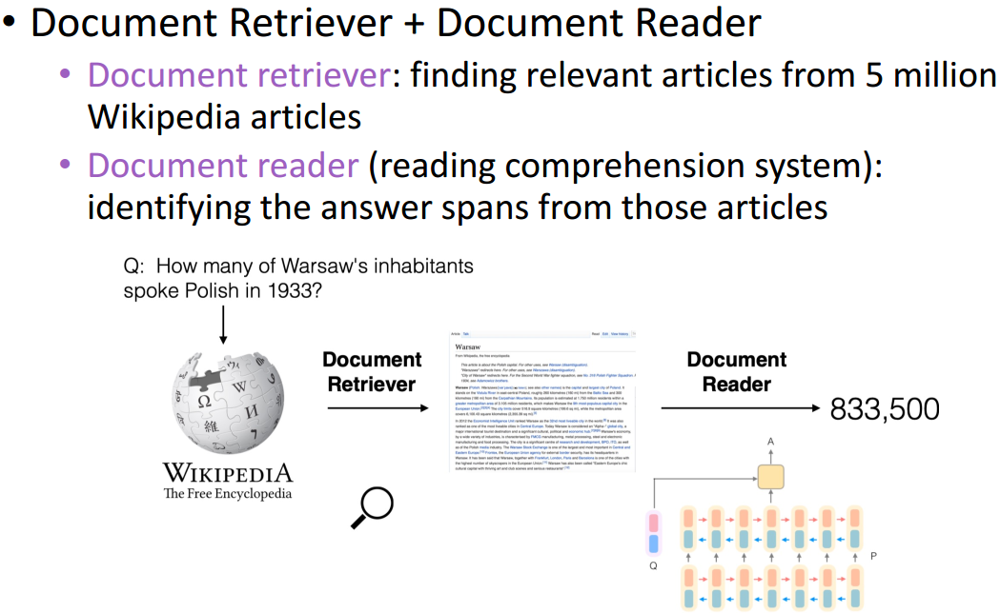

### （3）REALM

在大模型流行起来后一个非常重要的方向是**如何用检索来辅助大模型的预训练过程**。 &#x20;

让大模型在下游的机器问答环节中表现得更好。 &#x20;

REALM这篇工作它在**模型的预训练过程中加入了一个检索的任务，让大模型把预训练当成一个开放式QA的任务，在预训练的时候，同时训练大模型和知识检索器**。然后在下游的任务中直接用检索器进行检索，从而能够达到更好的表现。

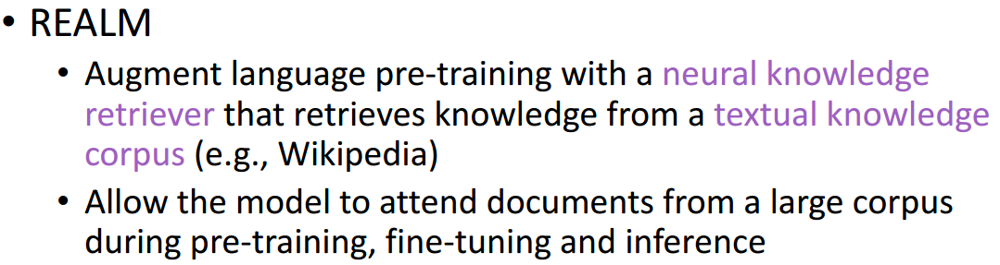

它具体是如何做的呢？首先在预训练语料库中有一个样本，比如遮盖了pyramidion(金字塔)这样一个词。然后把预训练的过程看作是一个问答的过程， 要去回答这个问题需要在知识库中进行一些检索。把该样本当成一个问题，然后让神经检索器去进行一些检索。再把检索到的相关文章和该问题一起输入到大模型中，希望大模型根据这些文章为找到问题的答案。

在下游的微调过程中，就可以用相同的Pipeline，给定一个问题，用前面预训练好的检索器检索相关的文章，然后通过相关的文章来回答问题。

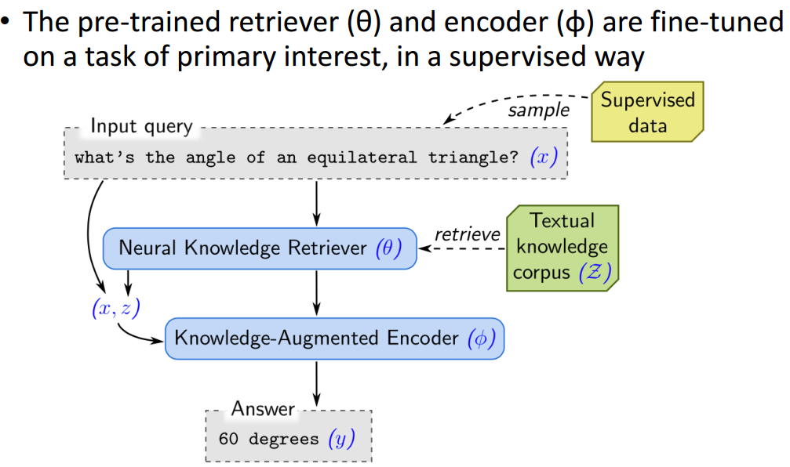

### （4）WebGPT

WebGPT比前面介绍的模型更强大，在于它不限定只能在维基百科中寻找答案，而是可以**直接在搜索引擎上去寻找相关的文章，然后回答问题**。

- 将文档检索外包给微软必应网络搜索API
- 利用无监督的预训练，通过微调GPT-3来实现高质量的文档合成
- 创建一个基于文本的网页浏览环境，人类和语言模型都可以与之交互

训练前让很多标注人员给定一些问题，让他们用基于文本的检索器去寻找答案。并记录了标注人员每一步的操作。比如可以去搜索，点击每个链接，把有用的句子摘录出来，然后 继续寻找下一个相关的内容。

用这些记录的行为去微调GPT-3，希望GPT-3能够模仿人类行为来使用浏览器。然后惊奇的发现，即使给定较少的训练数据，比如几千条，GPT-3就可以很容易地学会怎么去操控浏览器，它每次可以进行检索，记下重要的引用，再通过这些引用生成最终的问题答案。

# 4.文本生成

文本生成可以**把一些非语言性的表示信息，通过模型以一种人类可以理解的语言表示处理**。 &#x20;

非语言性的表示就是常说的数据，比如图片、表格、图等。我们统一把这种生成叫做`date-to-text`生成，实际上广义上还包括`text-to-text`的生成。

## 4.1 文本生成任务

1. `Data-To-Text (image, table, graph) ` : 输入可以有很多种形式，比如说图片、表格、图等。
2. `Dialogue`  : 模型针对用户的特定输入，给予一些回答。 &#x20;
3. `Machine Translation`   : 机器翻译，尽可能保留语义和语法
4. `Poetry Generation`   : 诗歌的生成，在生成诗歌的时候，不仅要求它包含某种主题，包含某些关键词，同时还要求它满足一些诗歌的格律。
5. `Style Transfer`   : 文本风格转移，把输入文本的风格转移成所需要的风格。上面是文本风格转移中一些常见的子任务。
6. `Storytelling` : 故事生成，在给定关键词/故事线下进行故事的生成。上面是一个简单的例子。

文本生成任务中还包括总结生成的任务，输入是较长的文档，希望模型能生成较短的关于文档的摘要。

## 4.2 神经网络文本生成

### （1）语言模型

\*\*基于前面`t-1`****词生成第****`t`\*\***个词**。

有**条件的语言建模**，不仅基于已经生成的词，还基于其他输入。比如机器翻译。

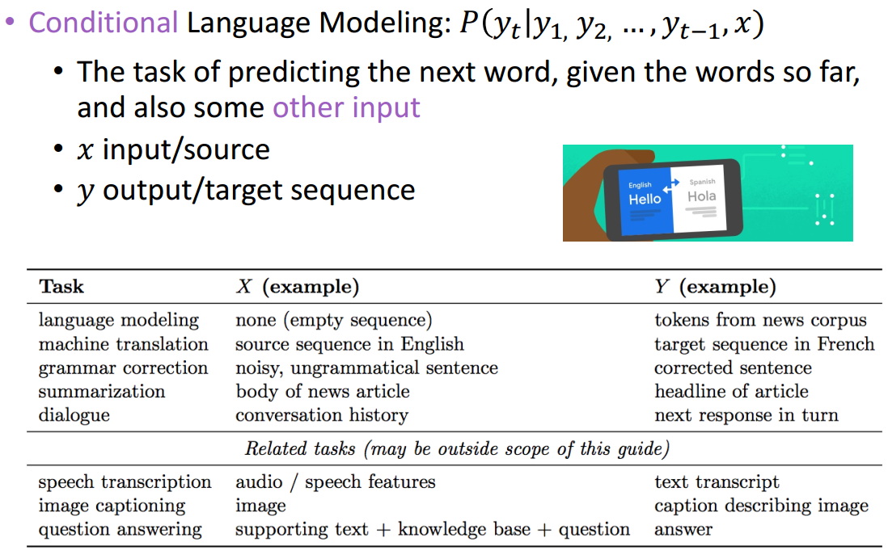

### （2）Seq2seq

Seq2Seq也是一种条件语言模型。&#x20;

在**训练时以teacher forcing的方式进行训练，而测试时基于已生成的单词**。 &#x20;

这会带来训练与测试分布的gap。

T5也是一种seq2sqe模型，它基于Transformer实现，将所有的NLP任务统一成`text-to-text`的形式表表示。

上图左侧是Encoder部分，右侧是Decoder部分。

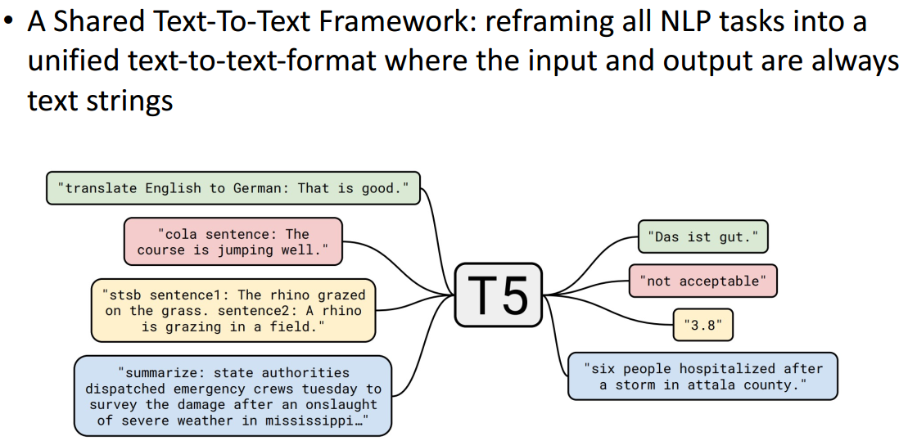

T5模型在清洗过的数据集上进行训练，**训练时遮盖句子中的部分单词**。在训练时，**希望模型能通过这样的输入预测出被遮盖的部分**。

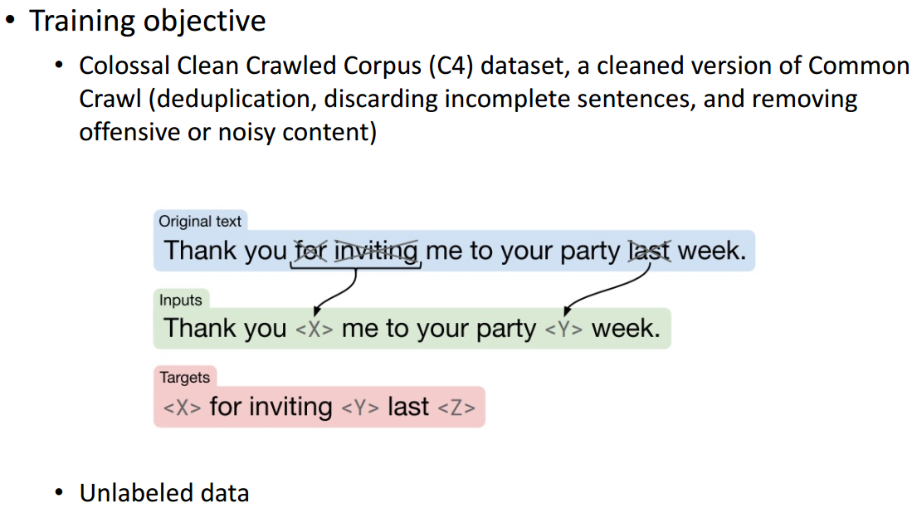

### （3）Autoregressive models

语言模型分为两大类，其一是自回归生成。 &#x20;

**在预测时以过去的输出作为参考来生成下一个单词**。

**GPT一系列模型就是自回归生成的典型例子**。

它拿到了Transformer中的Decoder部分：

- GPT1认为**可以通过生成式预训练来提升语言理解能力**；
- GPT-2认为**语言模型是一种无监督的多任务学习者**；
- GPT3认为**语言模型是少样本学习者**。

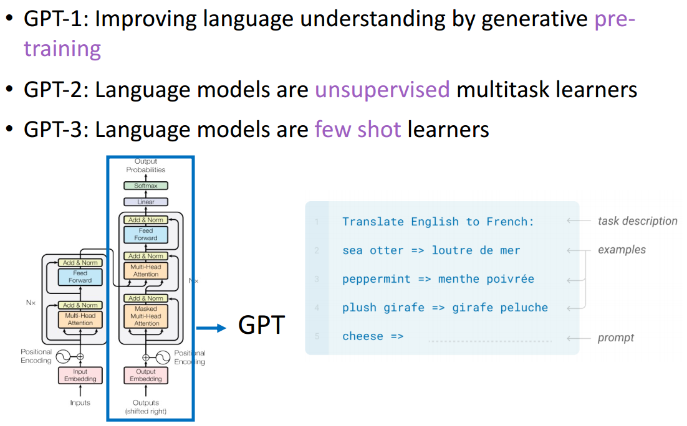

以GPT-2为例，**它是在无标签的数据上训练的，可以根据下游具体的有标签数据进行微调**。

### （4）Non-autoregressive models

另一类是非自回归生成。

在给定source和target的情况下，**编码器会对source进行编码，在解码器生成的过程中，每个解码器之间是没有时序关系的**。可以通过编码器的信息一次性地并行地生成所有的输出单词。

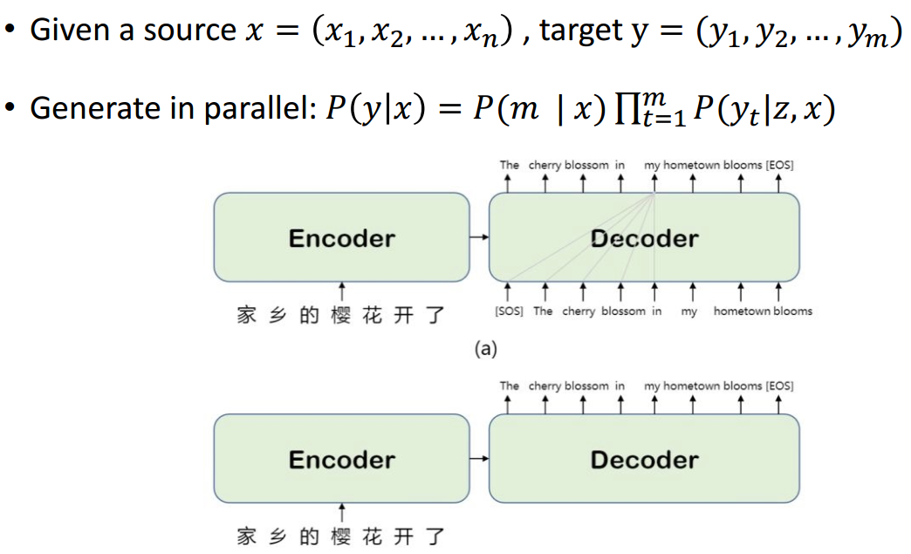

在给定输入的情况下，输出只与两部分相关。

1. 输入会决定目标句子的长度  `m`；
2. 在生成当成单词的时候只与 `z`和 `x`相关， `x`是输入的表示， `z`是计算得到的不同 `x`和不同 `y`之间的权重关系。可以看到`z`中是没有 $y_{t-1}$ 这一项的。所以可以并行地对这些词进行生成。

### （5）Decoding strategy

#### Greedy Decoding

Greedy Decoding，在**生成的每步中都会选择计算概率最大的单词作为输出单词**。

这种方法的缺点是**很容易生成重复的文本，这样可读性较差**。

#### Beam Search

束搜索是另一种方法，它\*\*在生成时的每步选择最好的`k`个局部序列。最终从这 ​`k`\*\***个序列中选择概率最大的输出**。

这两种做法在每步中都会概率最大的那个/些单词，是否有必要选择一个这样概率最大的单词呢？

实际上是每必要的，那么要怎么做呢？ 下面介绍一些基于采用的方法。

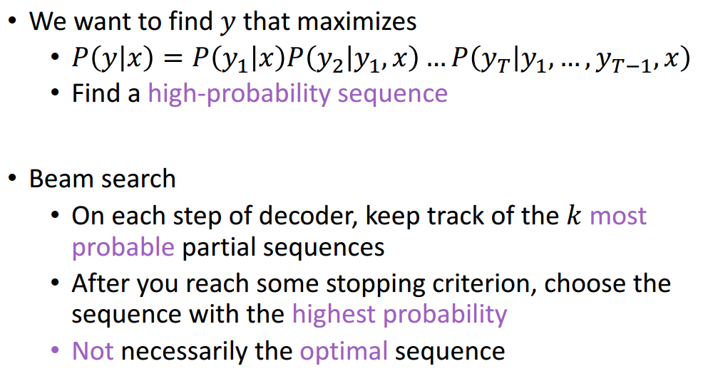

#### Sampling-based Decoding

这些方法按照模型计算出来单词的概率分布，**按照概率随机地从词表中选择生成的单词**，从而增加模型生成的多样性。

但也有可能生成无关的概率较小的单词，为了避免大量出现这种无意义的词，可以采取`top-n`和`top-p`两种方法。

- `top-n`就是在采样的过程中局限于 `n`个最有可能的单词上进行采样。
- `top-p`限制采样在若干个单词上进行，这些单词满足怎样的条件呢？概率最大的这些单词概率之和要大于一个阈值 `p`。
- `sample with temperature` : 在最终的softmax之前，inputs除以温度洗漱 $\tau$

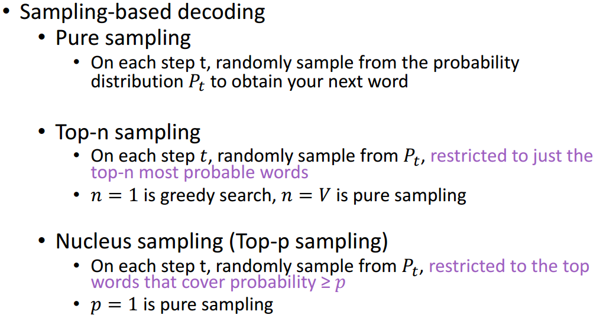

## 4.3 受控文本生成

### （1）Prompt methods

首先\*\*通过`prompt`\*\***的形式来控制**，比如图中在 `A knife`前面加上`Horror`来生成恐怖的描述；或者在前面加上`Reviews`来生成关于它的评价。

除了可以在文本前面加一个`Prompt`，还可以在模型前加一个`Prefix`。比如增加较小的参数矩阵(Prefix)拼在Transformer前面，**只对Prefix进行训练**。来指导模型完成不同的任务。

### （2）Modifying probability distribution

另一种是**通过修改概率分布的方法**，这里会再多训练两个模型，一个**生成非歧视语言的模型**，另一个生成**带有严重歧视的语言模型**。

在**文本生成时希望生成的语言贴近非歧视语言模型，而原理歧视语言模型**。

$$
\tilde{P}\left(X_{t} \mid \boldsymbol{x}_{<t}\right)=\operatorname{softmax}\left(\mathbf{z}_{t}+\alpha\left(\mathbf{z}_{t}^{+}-\mathbf{z}_{t}^{-}\right)\right)
$$

### （3）Reconstructing model architecture

还有一种做法是**直接修改模型结构**，这里给控制信号额外增加了一系列的transfomer结构，这类transformer只负责编码控制信号。

## 4.4 文本生成评估

本小节介绍文本生成的评估方法，主要分为两类。

一类是通用的，另一类是专用的。

### （1）通用方法

- `BLEU`：生成的文本的n-gram与tokens的text的类似度，BP是对短句的惩罚
- `PPL`：测试集上，有多大的概率生成sample，sample和test集上的拟合度越高，`ppl`越低
- `ROUGE`：基于召回计算的方法，主要解决模型生成低召回率问题。

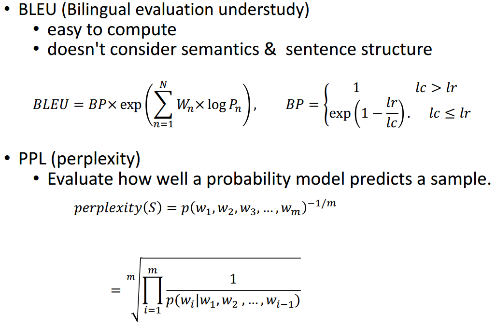

### （2）其他方法

除了通用的方法外， 还有其他的测量矩阵。比如基于距离可以测量文本的余弦相似度。

## 4.5 挑战

- 生成重复的文本，然后还有seq2seq方法中的gap。
- 模型生成的文本往往缺乏逻辑的一致性。
- 在控制性方面很难同时保证语言质量与可控质量。
- 在评估是如何在不同模型之间统一测量标准。

在这些领域，有一部分工作在研究如何用弱监督的数据去取代监督的数据来训练大模型。比如上面列了三种不同弱监督数据来源。有文档的标题与文本的正文、网页中的锚文本对、还有的直接用大模型去根据文本生成一个query，这样通过大模型生成数据。
